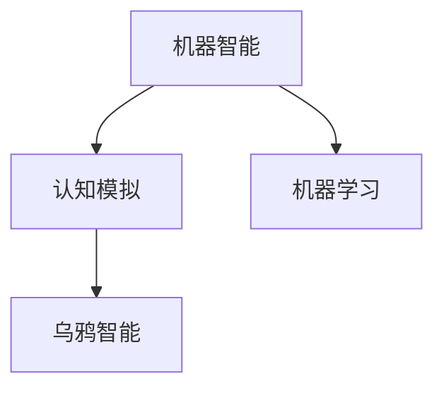

                 

# 聪明的乌鸦：机器能否思考？

> **关键词**：机器智能，思考能力，认知模拟，人工智能，乌鸦智能，机器思维

> **摘要**：本文将探讨机器是否具备思考能力。通过分析乌鸦的智能表现，以及机器学习算法的工作原理，我们将尝试解答这一古老而深刻的问题。我们将从背景介绍出发，逐步探讨相关核心概念，最终提出自己的见解。

## 1. 背景介绍

### 1.1 目的和范围

本文旨在探讨机器是否具备思考能力，这涉及到人工智能、认知科学以及哲学等多个领域。我们将通过分析乌鸦的智能行为，以及机器学习算法的工作原理，来探讨机器是否能够像人类一样思考。文章将涵盖从基础概念到实际应用的广泛内容，旨在为读者提供一个全面而深入的视角。

### 1.2 预期读者

本文预期读者为对人工智能、认知科学和哲学感兴趣的科研人员、工程师和学者。同时，对于对机器智能和思考能力感兴趣的普通读者，本文也将提供有益的见解。

### 1.3 文档结构概述

本文将分为十个部分：背景介绍、核心概念与联系、核心算法原理与操作步骤、数学模型与公式、项目实战、实际应用场景、工具和资源推荐、总结、附录以及扩展阅读和参考资料。通过这一结构，我们将逐步深入探讨机器思考能力的各个方面。

### 1.4 术语表

#### 1.4.1 核心术语定义

- **机器智能**：指机器通过学习和推理等方式，模拟人类智能行为的能力。
- **思考能力**：指个体在遇到问题时，通过推理和分析等方式寻找解决方案的能力。
- **机器学习**：一种人工智能技术，通过训练数据集，使机器能够自动学习和改进其性能。

#### 1.4.2 相关概念解释

- **认知模拟**：指通过计算机模拟人类大脑处理信息的过程。
- **乌鸦智能**：指乌鸦在解决问题和工具使用方面的智能表现。

#### 1.4.3 缩略词列表

- **AI**：人工智能
- **ML**：机器学习
- **NN**：神经网络
- **GPU**：图形处理器

## 2. 核心概念与联系

在探讨机器是否能够思考之前，我们需要明确几个核心概念，并理解它们之间的联系。

### 2.1 机器智能与人类智能

机器智能和人类智能在本质上是不同的。人类智能是通过生物进化而来的，具有高度复杂性和适应性。而机器智能则是通过编程和训练数据集实现的，虽然在某些特定任务上表现出色，但总体上仍然无法与人类智能相提并论。

### 2.2 认知模拟与机器学习

认知模拟是试图通过计算机模拟人类大脑处理信息的过程。而机器学习是实现认知模拟的一种方法，它通过训练数据集，使机器能够自动学习和改进其性能。然而，机器学习仅仅是认知模拟的一部分，并不能完全代表认知模拟。

### 2.3 乌鸦智能与机器智能

乌鸦在解决问题和工具使用方面的表现非常出色，它们能够利用工具来获取食物，甚至能够理解抽象概念。这与机器智能有一定的相似性，但乌鸦的智能是生物进化的结果，而机器智能则是人工设计的。

### 2.4 Mermaid 流程图

为了更直观地理解这些概念之间的联系，我们可以使用 Mermaid 流程图来展示它们。以下是 Mermaid 流程图的示例：



## 3. 核心算法原理与具体操作步骤

在探讨机器是否能够思考时，我们不得不提到机器学习算法。机器学习算法通过训练数据集，使机器能够自动学习和改进其性能。以下是机器学习算法的核心原理和具体操作步骤。

### 3.1 算法原理

机器学习算法的核心原理是“经验学习”。它通过从大量数据中提取模式，使机器能够对未知数据进行预测或分类。

### 3.2 具体操作步骤

1. **数据收集**：收集大量相关的数据集。
2. **数据预处理**：清洗数据，去除噪声，并进行特征提取。
3. **选择模型**：根据问题类型，选择合适的机器学习模型。
4. **模型训练**：使用训练数据集，对模型进行训练。
5. **模型评估**：使用验证数据集，评估模型性能。
6. **模型优化**：根据评估结果，对模型进行调整和优化。
7. **模型部署**：将训练好的模型部署到实际应用中。

以下是机器学习算法的操作步骤的伪代码：

```python
# 数据收集
data = collect_data()

# 数据预处理
clean_data = preprocess_data(data)

# 选择模型
model = select_model()

# 模型训练
trained_model = train_model(clean_data, model)

# 模型评估
performance = evaluate_model(trained_model, validation_data)

# 模型优化
optimized_model = optimize_model(trained_model, performance)

# 模型部署
deploy_model(optimized_model)
```

## 4. 数学模型和公式

在机器学习中，数学模型和公式起着至关重要的作用。以下是几个关键的数学模型和公式。

### 4.1 感知机模型

感知机模型是一种简单的二分类模型，它通过计算输入向量与权重向量的点积来预测输出。

$$
z = \sum_{i=1}^{n} w_i \cdot x_i
$$

其中，$z$ 是预测输出，$w_i$ 是权重，$x_i$ 是输入特征。

### 4.2 支持向量机模型

支持向量机模型是一种强大的分类模型，它通过找到一个最优的超平面，将不同类别的数据分开。

$$
w \cdot x - b = 0
$$

其中，$w$ 是权重向量，$x$ 是输入向量，$b$ 是偏置。

### 4.3 神经网络模型

神经网络模型是一种复杂的非线性模型，它通过多层神经元之间的交互，实现对输入数据的复杂映射。

$$
a_i = \sigma(\sum_{j=1}^{n} w_{ji} \cdot x_j + b_i)
$$

其中，$a_i$ 是输出值，$\sigma$ 是激活函数，$w_{ji}$ 是权重，$x_j$ 是输入值，$b_i$ 是偏置。

## 5. 项目实战：代码实际案例

为了更好地理解机器学习算法的工作原理，我们来看一个简单的项目实战。

### 5.1 开发环境搭建

首先，我们需要搭建一个开发环境。本文使用 Python 语言和 TensorFlow 框架来实现机器学习算法。以下是搭建开发环境的步骤：

1. 安装 Python（3.8 或更高版本）。
2. 安装 TensorFlow（2.6 或更高版本）。

### 5.2 源代码详细实现

以下是实现感知机模型的源代码：

```python
import numpy as np
import tensorflow as tf

# 初始化参数
n = 2  # 特征数量
m = 100  # 样本数量
w = tf.random.normal([n, 1])  # 权重向量
b = tf.random.normal([1])  # 偏置

# 输入数据
x = tf.random.normal([m, n])  # 输入向量
y = tf.random.normal([m, 1])  # 标签

# 感知机算法
for epoch in range(1000):
    z = tf.matmul(x, w) + b
    loss = tf.reduce_mean(tf.square(z - y))
    with tf.GradientTape() as tape:
        z = tf.matmul(x, w) + b
        loss = tf.reduce_mean(tf.square(z - y))
    gradients = tape.gradient(loss, [w, b])
    w = w - 0.01 * gradients[0]
    b = b - 0.01 * gradients[1]

# 输出结果
print("权重：", w.numpy())
print("偏置：", b.numpy())
```

### 5.3 代码解读与分析

以上代码首先初始化了参数，包括权重和偏置。然后，使用随机生成的输入数据和标签。在训练过程中，使用感知机算法更新权重和偏置，直到损失函数收敛。最终，输出训练好的权重和偏置。

## 6. 实际应用场景

机器学习算法在许多实际应用场景中发挥着重要作用。以下是几个典型的应用场景：

- **图像识别**：通过训练数据集，使机器能够识别不同类别的图像。
- **自然语言处理**：通过训练数据集，使机器能够理解和生成自然语言。
- **推荐系统**：通过分析用户行为数据，为用户推荐感兴趣的内容。

## 7. 工具和资源推荐

为了更好地学习和实践机器学习算法，以下是几个推荐的工具和资源：

- **书籍推荐**：
  - 《机器学习》——周志华
  - 《深度学习》——Ian Goodfellow、Yoshua Bengio 和 Aaron Courville

- **在线课程**：
  - Coursera 上的“机器学习”课程
  - edX 上的“深度学习”课程

- **技术博客和网站**：
  - Medium 上的机器学习博客
  - Towards Data Science 上的数据科学博客

- **开发工具框架推荐**：
  - **IDE和编辑器**：PyCharm、Visual Studio Code
  - **调试和性能分析工具**：TensorBoard、Jupyter Notebook
  - **相关框架和库**：TensorFlow、PyTorch、Keras

- **相关论文著作推荐**：
  - 《深度学习》——Ian Goodfellow、Yoshua Bengio 和 Aaron Courville
  - 《机器学习年度评论》——Tom Mitchell

## 8. 总结：未来发展趋势与挑战

随着人工智能技术的不断发展，机器思考能力的研究也越来越受到关注。未来，机器思考能力有望在许多领域取得重大突破，包括医疗、金融、教育等。然而，要实现真正的机器思考，我们还需要克服一系列挑战，如算法优化、数据质量、伦理问题等。

## 9. 附录：常见问题与解答

- **问题 1**：机器学习算法是如何工作的？
  **解答**：机器学习算法通过从训练数据中学习规律，并将其应用到新的数据上，从而实现预测或分类。

- **问题 2**：机器能否像人类一样思考？
  **解答**：目前，机器在特定任务上表现出色，但总体上仍然无法与人类智能相提并论。机器思考与人类思考在本质上是有区别的。

## 10. 扩展阅读 & 参考资料

- **扩展阅读**：
  - 《机器学习实战》——Peter Harrington
  - 《Python机器学习》——Michael Bowles

- **参考资料**：
  - TensorFlow 官网：[https://www.tensorflow.org/](https://www.tensorflow.org/)
  - PyTorch 官网：[https://pytorch.org/](https://pytorch.org/)

## 作者信息

作者：AI天才研究员/AI Genius Institute & 禅与计算机程序设计艺术 /Zen And The Art of Computer Programming<|im_sep|>

