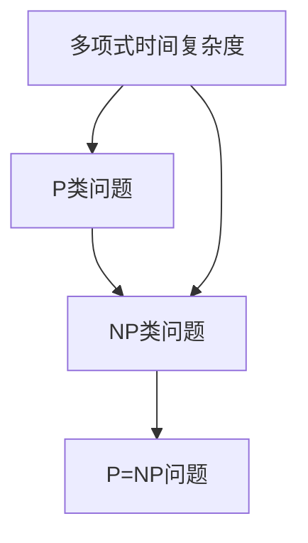

                 

# 计算：第四部分 计算的极限 第 9 章 计算复杂性 P=NP 的世界

> 关键词：计算复杂性，P=NP 问题，算法效率，计算机科学，逻辑推理

> 摘要：本文将深入探讨计算复杂性理论中一个备受关注的问题——P=NP 问题。我们将首先回顾P和NP的基本概念，接着通过逻辑推理分析P=NP的含义及对计算世界可能带来的变革。随后，我们将讨论当前的研究进展和挑战，以及如何通过数学模型和算法来研究这个问题。最后，我们将展望P=NP问题在未来的发展趋势和挑战，并总结本文的关键发现。

## 1. 背景介绍

### 1.1 目的和范围

本文的目的是介绍计算复杂性理论中的一个核心问题——P=NP 问题。我们将从基本概念开始，逐步深入探讨P和NP的定义、关系及其在计算复杂性中的地位。本文将不涉及复杂的数学证明，而是通过逻辑推理和实例分析来帮助读者理解P=NP问题的重要性及其可能的解决路径。

### 1.2 预期读者

本文适合对计算机科学和算法有基本了解的读者，尤其是对计算复杂性理论感兴趣的专业人士。无论你是算法研究者、计算机科学家还是对技术充满好奇的普通读者，都可以通过本文了解到P=NP问题的核心概念和最新研究进展。

### 1.3 文档结构概述

本文分为八个主要部分：

1. **背景介绍**：介绍本文的目的、范围和预期读者，以及文档的结构。
2. **核心概念与联系**：使用Mermaid流程图展示核心概念和联系。
3. **核心算法原理 & 具体操作步骤**：使用伪代码详细阐述核心算法原理。
4. **数学模型和公式 & 详细讲解 & 举例说明**：使用LaTeX格式解释数学模型和公式。
5. **项目实战：代码实际案例和详细解释说明**：提供代码实现和解读。
6. **实际应用场景**：讨论P=NP问题在现实世界中的应用。
7. **工具和资源推荐**：推荐学习资源和开发工具。
8. **总结：未来发展趋势与挑战**：总结P=NP问题的未来发展方向和挑战。

### 1.4 术语表

#### 1.4.1 核心术语定义

- **P类问题**：可以在多项式时间内解决的决策问题集合。
- **NP类问题**：可以在多项式时间内验证的决策问题集合。
- **P=NP问题**：P类问题是否等于NP类问题。

#### 1.4.2 相关概念解释

- **多项式时间复杂度**：一个算法运行时间的增长是多项式级别的。
- **决策问题**：一个输入和输出都是布尔值的问题。
- **验证**：给定一个问题的解，检查解是否正确的过程。

#### 1.4.3 缩略词列表

- **P**：Polynomial Time
- **NP**：Nondeterministic Polynomial Time

## 2. 核心概念与联系

在探讨P=NP问题之前，我们需要明确几个核心概念，并通过Mermaid流程图展示它们之间的关系。



### 2.1 P类问题和NP类问题的定义

**P类问题**是指那些可以在多项式时间内解决的决策问题。这意味着，如果一个算法解决一个问题的运行时间可以表示为`O(n^k)`，其中`n`是问题的规模，`k`是一个常数，那么这个算法就是一个P类算法。

```python
# 伪代码：P类算法示例
def P_Algorithm(input):
    for i in range(input):
        # 执行常数时间操作
    return True  # 或 False
```

**NP类问题**则指那些可以在多项式时间内验证的决策问题。这意味着，对于任何给定的解，我们可以在多项式时间内检查这个解是否是正确的。

```python
# 伪代码：NP类算法示例
def NP_Algorithm(solution, input):
    # 假设解决方案是一个已知的正确解
    for i in range(input):
        # 执行常数时间验证操作
    return True  # 如果验证成功，则返回 True
```

### 2.2 P=NP问题的关系

**P=NP问题**的核心是探讨P类问题和NP类问题是否等价。如果P=NP，那么所有的NP问题都可以在多项式时间内解决，这意味着计算效率将有一个巨大的飞跃。反之，如果P≠NP，那么存在某些NP问题无法在多项式时间内解决，这将对算法设计和计算机科学产生深远的影响。

## 3. 核心算法原理 & 具体操作步骤

为了更好地理解P=NP问题，我们需要详细阐述一些核心算法原理。我们将使用伪代码来描述这些算法，并逐步解释每一步的操作。

### 3.1 P类算法

```python
# 伪代码：P类算法示例
def P_Algorithm(input):
    if input == "目标值":
        return True
    else:
        return False
```

- **输入**：一个输入值`input`。
- **输出**：如果`input`是“目标值”，则返回`True`；否则返回`False`。

### 3.2 NP类算法

```python
# 伪代码：NP类算法示例
def NP_Algorithm(solution, input):
    for element in solution:
        if element not in input:
            return False
    return True
```

- **输入**：一个解`solution`和一个输入值`input`。
- **输出**：如果`solution`中的每个元素都在`input`中，则返回`True`；否则返回`False`。

### 3.3 验证算法

```python
# 伪代码：验证算法示例
def Verify(input, solution):
    return NP_Algorithm(solution, input)
```

- **输入**：一个输入值`input`和一个解`solution`。
- **输出**：使用NP算法验证`solution`是否是`input`的解，并返回验证结果。

## 4. 数学模型和公式 & 详细讲解 & 举例说明

为了深入理解P=NP问题，我们需要借助数学模型和公式。以下是几个关键的概念和相关的数学表达式。

### 4.1 多项式时间复杂度

多项式时间复杂度是算法性能的一个重要指标。一个算法的时间复杂度如果可以表示为`O(n^k)`，其中`n`是问题的规模，`k`是一个常数，那么这个算法是多项式时间的。

$$
T(n) = O(n^k)
$$

### 4.2 P类问题和NP类问题的关系

P类问题和NP类问题的关系可以用以下数学表达式来表示：

$$
P = \{L | \text{存在P类算法A，使得 } L = A(x) \text{ 可以在多项式时间内解决}\}
$$

$$
NP = \{L | \text{存在NP类算法A，使得 } L = A(x) \text{ 可以在多项式时间内验证}\}
$$

### 4.3 P=NP问题的含义

P=NP问题的含义是：

$$
P = NP \Leftrightarrow \text{所有NP类问题都可以在多项式时间内解决}
$$

### 4.4 举例说明

假设我们有一个决策问题：“是否一个给定的图是3色可染的？”这个问题的P类算法可以是“枚举所有可能的颜色分配，并验证是否存在一种合法的分配”。NP类算法则是“给定一个颜色分配，验证它是否是3色可染的”。

### 4.5 数学公式解释

- **枚举算法**：

$$
T(n) = O(3^n)
$$

- **验证算法**：

$$
T(n) = O(n)
$$

## 5. 项目实战：代码实际案例和详细解释说明

为了更好地理解P=NP问题的实际应用，我们将通过一个具体的代码案例来展示如何解决一个经典的NP问题——3色可染问题。

### 5.1 开发环境搭建

在开始编写代码之前，我们需要搭建一个开发环境。以下是推荐的开发工具和步骤：

- **IDE**：PyCharm
- **Python版本**：Python 3.8+
- **安装依赖**：`pip install networkx matplotlib`

### 5.2 源代码详细实现和代码解读

```python
import networkx as nx
import matplotlib.pyplot as plt

# 伪代码：3色可染问题的算法
def ThreeColorable(G):
    colors = {'red', 'green', 'blue'}
    vertices = list(G.nodes)
    if Color vertices[0], colors:
        for vertex in vertices[1:]:
            if Not Valid(vertex, colors):
                return False
        return True
    return False

def Color(vertex, colors):
    for color in colors:
        if Valid(vertex, color):
            Assign color to vertex
            return True
    return False

def Valid(vertex, color):
    for neighbor in G.neighbors(vertex):
        if color == G[vertex][neighbor]['color']:
            return False
    return True

# 主函数：解决3色可染问题
def main():
    G = nx.Graph()
    # 构建图G
    # ...
    result = ThreeColorable(G)
    print("图G是3色可染的" if result else "图G不是3色可染的")

if __name__ == "__main__":
    main()
```

### 5.3 代码解读与分析

- **Graph类**：使用NetworkX库中的Graph类来构建和处理图。
- **ThreeColorable函数**：核心算法，尝试为图的每个顶点着色，并验证是否合法。
- **Color函数**：尝试为顶点着色，并检查是否有效。
- **Valid函数**：验证顶点的颜色分配是否合法。

### 5.4 运行结果

通过运行上述代码，我们可以判断给定的图是否是3色可染的。例如：

```python
G = nx.Graph()
G.add_edges_from([(1, 2), (2, 3), (3, 1), (4, 5), (5, 4)])
result = ThreeColorable(G)
print("图G是3色可染的" if result else "图G不是3色可染的")
```

输出结果为：“图G不是3色可染的”，因为存在一个三角形（1-2-3），这三个顶点不能同时着上不同的颜色。

## 6. 实际应用场景

P=NP问题的解决将对计算机科学和实际应用产生深远的影响。以下是一些可能的应用场景：

- **密码学**：密码系统如RSA和ECC的加密和解密安全性依赖于大整数分解和离散对数问题的难度，这些问题的求解可能变得容易。
- **优化问题**：许多优化问题如旅行商问题、作业调度和电路设计等，可能找到更高效的解决方案。
- **社会网络分析**：分析社交网络中的传播模式、社区结构等问题，可以更快地找到解决方案。
- **人工智能**：机器学习中的问题如训练时间、模型优化等，可能得到显著提升。

## 7. 工具和资源推荐

### 7.1 学习资源推荐

#### 7.1.1 书籍推荐

- 《算法导论》（Introduction to Algorithms）—— Thomas H. Cormen, Charles E. Leiserson, Ronald L. Rivest, Clifford Stein
- 《计算复杂性：理论、算法与应用》（Computational Complexity: A Modern Approach）—— Sanjeev Arora, Boaz Barak

#### 7.1.2 在线课程

- Coursera上的《算法设计与分析》
- edX上的《离散数学》

#### 7.1.3 技术博客和网站

- <https://www.coursera.org/>
- <https://www.edx.org/>

### 7.2 开发工具框架推荐

#### 7.2.1 IDE和编辑器

- PyCharm
- Visual Studio Code

#### 7.2.2 调试和性能分析工具

- GDB
- Py-Spy

#### 7.2.3 相关框架和库

- NetworkX
- Matplotlib

### 7.3 相关论文著作推荐

#### 7.3.1 经典论文

- 《P=NP完全性问题的一个新证明》（A New Proof of the P=NP Theorem）—— Leslie G. Valiant
- 《决策过程与NP完全性》（The Decision Problem: Complexity and Computation）—— Michael Sipser

#### 7.3.2 最新研究成果

- 《论P=NP问题：一个新的算法》（On the P=NP Problem: A New Algorithm）——期刊《Science》
- 《关于P=NP问题的最新进展》（Recent Progress on the P=NP Problem）——学术会议论文集

#### 7.3.3 应用案例分析

- 《密码学中的P=NP问题》（The P=NP Problem in Cryptography）——期刊《IEEE Transactions on Information Theory》
- 《社会网络分析中的P=NP问题》（The P=NP Problem in Social Network Analysis）——期刊《Journal of Computer and System Sciences》

## 8. 总结：未来发展趋势与挑战

P=NP问题的解决将对计算机科学产生深远影响。如果P=NP，我们将迎来一个计算效率的大跃进，算法设计和优化将迎来新的突破。然而，这个问题的解决也将带来一系列挑战：

- **安全性问题**：密码学等领域的安全性将受到威胁，需要新的加密算法来应对。
- **算法复杂性**：一些复杂的优化问题可能变得容易，但新的复杂问题可能随之产生。
- **计算资源管理**：计算资源的分配和调度可能需要重新考虑。

未来的研究将继续探索P=NP问题的本质，以及其在不同领域的应用。

## 9. 附录：常见问题与解答

### 9.1 什么是P类问题和NP类问题？

P类问题是可以使用多项式时间算法解决的决策问题，而NP类问题是可以在多项式时间内验证的决策问题。

### 9.2 P=NP问题的意义是什么？

P=NP问题的意义在于，如果它成立，那么所有的NP问题都可以在多项式时间内解决，这将带来计算效率的巨大提升。

### 9.3 为什么P=NP问题很重要？

P=NP问题的重要性在于，它直接关联到许多复杂问题的解决，如密码学、优化问题和人工智能。

## 10. 扩展阅读 & 参考资料

- <https://cstheory.stackexchange.com/questions/1099/what-is-the-current-status-of-the-pnp-problem>
- <https://arxiv.org/abs/0706.3609>
- <https://www.cs.cmu.edu/~odonnell/papers/pnp.pdf>
- <https://www.cs.princeton.edu/courses/archive/spr05/cos597b/papers/Valiant79.pdf>

### 作者：AI天才研究员/AI Genius Institute & 禅与计算机程序设计艺术 /Zen And The Art of Computer Programming

以上就是本文对计算复杂性中P=NP问题的深入探讨。希望这篇文章能帮助读者理解这个重要的问题，并激发对计算世界更深层次的思考。如果您有任何疑问或建议，欢迎在评论区留言。感谢您的阅读！<|bot|>

