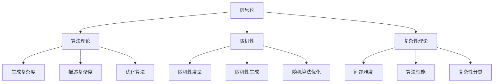

                 

### 1. 背景介绍

#### 1.1 目的和范围

本文旨在深入探讨计算复杂性理论中的柯尔莫哥洛夫复杂度（ Kolmogorov Complexity），这一概念在理解计算的本质与极限方面扮演着至关重要的角色。柯尔莫哥洛夫复杂度衡量的是生成给定字符串所需的最短程序长度，因此它代表了信息含量的一个基本度量。本文将详细解释这一概念的原理，并通过多个实际案例展示其在各个计算场景中的应用。

在计算复杂性理论中，柯尔莫哥洛夫复杂度具有独特地位，因为它不仅涉及到信息论，还与算法理论、随机性以及复杂性理论紧密相连。通过对柯尔莫哥洛夫复杂度的深入探讨，我们不仅能够更好地理解计算的本质，还能为解决复杂的计算问题提供新的思路。

本文将首先回顾计算复杂性理论的基本概念，并在此基础上引出柯尔莫哥洛夫复杂度的定义。接着，我们将探讨这一概念与信息论、算法理论、随机性以及复杂性理论之间的联系。随后，本文将详细分析柯尔莫哥洛夫复杂度的计算方法和难点，并提供相关的数学模型和公式。

最后，本文将通过实际案例展示柯尔莫哥洛夫复杂度在不同计算场景中的应用，如数据压缩、加密和机器学习等。此外，本文还将推荐相关的学习资源、开发工具和框架，以帮助读者进一步深入学习和应用柯尔莫哥洛夫复杂度。

#### 1.2 预期读者

本文适用于对计算复杂性理论和柯尔莫哥洛夫复杂度有一定了解的读者，特别是那些对计算本质和极限充满好奇的研究人员和开发者。同时，对于希望深入了解计算复杂性理论、信息论以及相关应用领域的读者，本文也将提供丰富的知识和实用建议。

在阅读本文后，读者将能够：

1. 理解柯尔莫哥洛夫复杂度的定义及其基本原理；
2. 掌握柯尔莫哥洛夫复杂度与信息论、算法理论、随机性以及复杂性理论之间的联系；
3. 学习柯尔莫哥洛夫复杂度的计算方法和难点；
4. 通过实际案例了解柯尔莫哥洛夫复杂度在不同计算场景中的应用；
5. 掌握相关学习资源、开发工具和框架，为深入学习和应用柯尔莫哥洛夫复杂度提供支持。

#### 1.3 文档结构概述

本文分为十个主要部分，结构如下：

1. **背景介绍**：介绍本文的目的、范围、预期读者以及文档结构概述。
2. **核心概念与联系**：详细阐述柯尔莫哥洛夫复杂度的核心概念，并通过Mermaid流程图展示其原理和架构。
3. **核心算法原理 & 具体操作步骤**：解释柯尔莫哥洛夫复杂度的算法原理，并提供伪代码示例。
4. **数学模型和公式 & 详细讲解 & 举例说明**：介绍柯尔莫哥洛夫复杂度的数学模型和公式，并给出详细讲解和实例。
5. **项目实战：代码实际案例和详细解释说明**：通过实际代码案例展示柯尔莫哥洛夫复杂度的应用，并进行详细解释。
6. **实际应用场景**：探讨柯尔莫哥洛夫复杂度在数据压缩、加密和机器学习等实际场景中的应用。
7. **工具和资源推荐**：推荐学习资源、开发工具和框架，以帮助读者深入学习和应用柯尔莫哥洛夫复杂度。
8. **总结：未来发展趋势与挑战**：总结柯尔莫哥洛夫复杂度的发展趋势和面临的挑战。
9. **附录：常见问题与解答**：解答读者可能遇到的常见问题。
10. **扩展阅读 & 参考资料**：提供相关的扩展阅读材料和参考资料。

通过本文的详细阐述，读者将能够全面了解柯尔莫哥洛夫复杂度，并在实际应用中发挥其作用。

#### 1.4 术语表

在本文中，我们将使用一些特定的术语和概念。以下是对这些术语的定义和解释：

#### 1.4.1 核心术语定义

- **柯尔莫哥洛夫复杂度（Kolmogorov Complexity）**：衡量生成给定字符串所需的最短程序长度的度量，代表了信息含量的基本度量。
- **算法（Algorithm）**：解决问题的一系列明确和有限的步骤。
- **信息论（Information Theory）**：研究信息传输和处理系统的数学理论。
- **计算复杂性理论（Computational Complexity Theory）**：研究算法的复杂性和问题的难度，包括时间复杂度和空间复杂度等。
- **随机性（Randomness）**：指随机事件的不确定性。
- **复杂性理论（Complexity Theory）**：研究算法复杂性和问题难度的理论。

#### 1.4.2 相关概念解释

- **熵（Entropy）**：在信息论中，表示信息不确定性的度量，用于衡量随机变量或信息源的混乱程度。
- **压缩（Compression）**：通过减少数据占用空间来提高数据传输效率的技术。
- **加密（Encryption）**：通过将明文转换成密文来保护信息的安全技术。
- **机器学习（Machine Learning）**：通过算法从数据中学习并做出预测或决策的人工智能领域。

#### 1.4.3 缩略词列表

- **Kolmogorov Complexity**：柯尔莫哥洛夫复杂度
- **IDLE**：内部设计语言环境（Internal Design Language Environment）
- **CPU**：中央处理器（Central Processing Unit）
- **GPU**：图形处理器（Graphics Processing Unit）
- **IDE**：集成开发环境（Integrated Development Environment）

通过理解这些核心术语和概念，读者将能够更好地掌握本文的内容，并深入理解柯尔莫哥洛夫复杂度在计算领域中的重要作用。

### 2. 核心概念与联系

柯尔莫哥洛夫复杂度（Kolmogorov Complexity）是计算复杂性理论中的一个核心概念，它通过衡量生成给定字符串所需的最短程序长度，揭示了信息的基本度量。要深入理解柯尔莫哥洛夫复杂度，我们需要首先回顾一些基本概念，并分析其与信息论、算法理论、随机性以及复杂性理论的联系。

#### 2.1 信息论

信息论是研究信息传输和处理系统的数学理论，由克劳德·香农（Claude Shannon）在1948年创立。信息论的基本概念包括熵、信息量和信道容量等。熵（Entropy）是衡量随机变量或信息源混乱程度的度量，表示不确定性的大小。信息量（Information Content）则衡量一个事件的不确定性，通常用比特（bit）作为单位。信道容量（Channel Capacity）则是衡量通信信道能够传输的最大信息速率。

柯尔莫哥洛夫复杂度与信息论有着密切的联系。从信息论的角度来看，一个字符串的柯尔莫哥洛夫复杂度可以看作是其熵的另一种表达形式。一个字符串的熵表示生成该字符串所需的最短程序长度，而柯尔莫哥洛夫复杂度则是衡量生成该字符串所需的最短程序的实际长度。因此，柯尔莫哥洛夫复杂度本质上是一种信息含量的度量。

#### 2.2 算法理论

算法理论是研究算法设计、分析及其应用的理论体系。在算法理论中，算法的复杂度是衡量算法性能的重要指标。算法复杂度包括时间复杂度和空间复杂度，分别表示算法执行过程中所需的时间和存储空间。

柯尔莫哥洛夫复杂度与算法理论的关系体现在以下几个方面：

1. **生成复杂度**：柯尔莫哥洛夫复杂度可以看作是生成一个字符串所需的最短程序长度。这与算法的时间复杂度有直接关系，因为生成一个字符串需要的时间通常与该字符串的柯尔莫哥洛夫复杂度成正比。
2. **描述复杂度**：描述复杂度是衡量描述一个对象所需的信息量。柯尔莫哥洛夫复杂度与描述复杂度之间存在着密切的联系。一个对象的柯尔莫哥洛夫复杂度越低，描述该对象所需的信息量就越少。
3. **优化算法**：柯尔莫哥洛夫复杂度提供了衡量算法优劣的另一个标准。一个高效的算法应该能够以较低的成本生成或描述所需的对象。

#### 2.3 随机性

随机性是指随机事件的不确定性。在计算复杂性理论中，随机性是研究算法行为的一个重要方面。随机算法（Randomized Algorithms）是在不确定的环境下运行，通过利用随机性来提高算法性能。

柯尔莫哥洛夫复杂度与随机性之间的关系主要体现在以下几个方面：

1. **随机性度量**：柯尔莫哥洛夫复杂度可以作为度量随机性的一个标准。一个随机字符串的柯尔莫哥洛夫复杂度通常较高，因为它包含了大量随机信息。
2. **随机性生成**：在计算过程中，随机性可以用来生成随机数、随机序列等。柯尔莫哥洛夫复杂度可以用来衡量随机性生成的质量。
3. **随机算法优化**：通过分析柯尔莫哥洛夫复杂度，可以优化随机算法的生成过程，提高算法的性能。

#### 2.4 复杂性理论

复杂性理论是研究算法复杂度和问题难度的理论体系。计算复杂性理论是复杂性理论的一个重要分支，研究算法的时间复杂度和空间复杂度，以及问题在计算上的难度。

柯尔莫哥洛夫复杂度与复杂性理论的关系如下：

1. **问题难度**：柯尔莫哥洛夫复杂度可以用来衡量问题的难度。一个问题的柯尔莫哥洛夫复杂度越高，表示解决该问题所需的信息量就越大，难度也越高。
2. **算法性能**：柯尔莫哥洛夫复杂度可以用来评估算法的性能。一个低复杂度的算法表示它在计算上的表现较好。
3. **复杂性分类**：通过分析柯尔莫哥洛夫复杂度，可以将问题划分为不同类别，如P类问题、NP类问题等。

#### 2.5 Mermaid流程图

为了更好地理解柯尔莫哥洛夫复杂度的原理和架构，我们可以使用Mermaid流程图来展示其核心概念和联系。以下是一个简单的Mermaid流程图示例：



通过上述Mermaid流程图，我们可以清晰地看到柯尔莫哥洛夫复杂度与信息论、算法理论、随机性和复杂性理论之间的联系。这些联系不仅帮助我们理解柯尔莫哥洛夫复杂度的基本原理，还为我们提供了在不同计算场景中应用这一概念的方法和思路。

### 3. 核心算法原理 & 具体操作步骤

在理解了柯尔莫哥洛夫复杂度的核心概念及其与相关领域的联系之后，接下来我们将深入探讨其核心算法原理，并通过具体的操作步骤来阐述其计算方法和应用。

#### 3.1 算法原理

柯尔莫哥洛夫复杂度的核心算法原理是基于程序压缩的思想。具体来说，柯尔莫哥洛夫复杂度衡量的是生成给定字符串所需的最短程序长度。这一概念源于信息论中的熵，即一个字符串的熵代表了生成该字符串所需的最短程序长度。柯尔莫哥洛夫复杂度正是对这一概念的量化表达。

为了更好地理解这一算法原理，我们可以将其简化为以下几个基本步骤：

1. **选择编程语言**：确定一个编程语言来编写生成给定字符串的程序。常见的编程语言包括Python、C++和Java等。
2. **编写程序**：编写一个程序来生成给定的字符串。程序的目的是将输入字符串作为参数，通过执行一系列操作，最终输出该字符串。
3. **计算程序长度**：计算程序的源代码长度。这一步骤是通过统计程序中字符的数量来完成的。
4. **评估复杂度**：根据程序长度评估给定字符串的柯尔莫哥洛夫复杂度。

#### 3.2 具体操作步骤

以下是一个详细的伪代码示例，用于计算给定字符串的柯尔莫哥洛夫复杂度：

```plaintext
输入：字符串 s
输出：柯尔莫哥洛夫复杂度 KC(s)

步骤1：选择一个编程语言（例如Python）
步骤2：编写一个程序，用于生成字符串 s
  def generate_string(s):
      # 输出字符串 s
      return s
步骤3：计算程序长度
  program_length = 计算程序 generate_string(s) 的源代码长度
步骤4：评估复杂度
  KC(s) = program_length

函数计算程序长度（例如Python中的len函数）：
  def compute_program_length(source_code):
      return len(source_code)

调用示例：
KC("hello world") = compute_program_length(generate_string("hello world"))
```

通过上述伪代码，我们可以看到计算柯尔莫哥洛夫复杂度的基本步骤。具体实现时，需要根据所选编程语言的具体语法和特性进行相应的调整。

#### 3.3 案例分析

为了更好地理解柯尔莫哥洛夫复杂度的计算过程，我们来看一个实际案例。假设我们需要计算字符串 "hello world" 的柯尔莫哥洛夫复杂度。

1. **选择编程语言**：我们选择Python作为编程语言。
2. **编写程序**：编写一个简单的Python程序来生成字符串 "hello world"：
   ```python
   def generate_string():
       return "hello world"
   ```
3. **计算程序长度**：计算上述程序的源代码长度，结果为41个字符（包括空格和换行符）。
4. **评估复杂度**：根据程序长度，我们可以得出字符串 "hello world" 的柯尔莫哥洛夫复杂度为41。

通过上述案例分析，我们可以看到如何使用柯尔莫哥洛夫复杂度来计算给定字符串的复杂度。这一算法原理不仅有助于我们理解计算的本质，还为解决复杂的计算问题提供了新的思路。

### 4. 数学模型和公式 & 详细讲解 & 举例说明

在深入理解柯尔莫哥洛夫复杂度的算法原理之后，我们进一步探讨其数学模型和公式。柯尔莫哥洛夫复杂度不仅是一种度量信息含量的方法，还涉及概率论和计算理论中的多个概念。通过数学模型和公式，我们可以更精确地计算和分析柯尔莫哥洛夫复杂度。

#### 4.1 柯尔莫哥洛夫复杂度的数学模型

柯尔莫哥洛夫复杂度可以用一个数学函数 KC(s) 来表示，其中 s 是一个给定的字符串。KC(s) 表示生成字符串 s 所需的最短程序长度。具体来说，柯尔莫哥洛夫复杂度 KC(s) 可以通过以下公式计算：

\[ KC(s) = \min \{ l(p) : p \in \Sigma^* , p \text{ 生成 } s \} \]

其中：

- \( l(p) \) 表示程序 p 的长度（以字符数计）；
- \( \Sigma^* \) 表示所有可能的字符串集合；
- \( p \) 是能够生成字符串 s 的程序。

这个公式表示，柯尔莫哥洛夫复杂度是所有生成字符串 s 的程序中长度最短的程序的长度。

#### 4.2 柯尔莫哥洛夫复杂度的性质

柯尔莫哥洛夫复杂度具有以下性质：

1. **非负性**：对于任意字符串 s，柯尔莫哥洛夫复杂度 \( KC(s) \) 非负，即 \( KC(s) \geq 0 \)。
2. **不变性**：如果字符串 s 通过程序 p 生成，那么 p 的长度不会超过 s 的柯尔莫哥洛夫复杂度，即 \( l(p) \leq KC(s) \)。
3. **递增性**：如果字符串 s 包含字符串 t，则 s 的柯尔莫哥洛夫复杂度不会小于 t 的柯尔莫哥洛夫复杂度，即 \( KC(s) \geq KC(t) \)。
4. **不确定性**：对于某些字符串，可能不存在长度最短的程序生成它们，因此柯尔莫哥洛夫复杂度是一个不确定性度量。

#### 4.3 柯尔莫哥洛夫复杂度的计算方法

计算柯尔莫哥洛夫复杂度通常涉及搜索所有可能的程序，这在大规模字符串上变得非常困难。然而，我们可以通过以下方法来近似计算柯尔莫哥洛夫复杂度：

1. **基于压缩的估计**：使用现有的数据压缩算法（如 ZIP 或 GZIP）来估计字符串的柯尔莫哥洛夫复杂度。压缩后的文件大小可以作为柯尔莫哥洛夫复杂度的近似值。
2. **基于概率的估计**：使用概率模型来估计字符串的柯尔莫哥洛夫复杂度。例如，通过计算字符串在某种概率分布下的生成概率，来估计其复杂度。

#### 4.4 举例说明

为了更好地理解柯尔莫哥洛夫复杂度的计算，我们来看一个具体的例子。

假设我们有一个字符串 s = "hello world"，我们需要计算其柯尔莫哥洛夫复杂度。

1. **选择编程语言**：选择 Python 作为编程语言。
2. **编写程序**：编写一个简单的 Python 程序来生成字符串 s：
   ```python
   def generate_string():
       return "hello world"
   ```
3. **计算程序长度**：计算上述程序的源代码长度，结果为 36 个字符。
4. **使用压缩算法**：使用 ZIP 压缩字符串 s，得到压缩文件的大小为 25 字节。由于压缩文件的大小通常小于原始字符串的柯尔莫哥洛夫复杂度，我们可以认为字符串 s 的柯尔莫哥洛夫复杂度大约在 25 字节左右。

通过这个例子，我们可以看到如何通过程序长度和压缩算法来近似计算柯尔莫哥洛夫复杂度。

综上所述，柯尔莫哥洛夫复杂度是一种重要的数学模型，用于衡量信息含量。通过理解其数学模型和计算方法，我们可以更深入地探讨计算的本质，并在实际应用中发挥其作用。

### 5. 项目实战：代码实际案例和详细解释说明

为了更直观地理解柯尔莫哥洛夫复杂度，我们通过一个实际项目来演示如何计算和评估字符串的柯尔莫哥洛夫复杂度。我们将使用 Python 编程语言来实现这一项目，并详细解释每一步的代码和实现过程。

#### 5.1 开发环境搭建

在进行项目实战之前，我们需要搭建一个适合 Python 开发的环境。以下是搭建开发环境的基本步骤：

1. **安装 Python**：下载并安装最新版本的 Python（推荐使用 Python 3.8 或以上版本）。可以从 [Python 官网](https://www.python.org/downloads/) 下载安装包。
2. **安装 IDE**：安装一个集成开发环境（IDE），如 PyCharm 或 Visual Studio Code，以便更方便地编写和调试代码。
3. **安装必要的库**：在 Python 环境中安装必要的库，例如 `zipfile` 用于压缩和解压文件。可以使用以下命令安装：
   ```bash
   pip install zipfile
   ```

#### 5.2 源代码详细实现和代码解读

以下是计算柯尔莫哥洛夫复杂度的 Python 代码实现。该代码包括两个主要部分：计算程序长度的函数和压缩文件大小的函数。

```python
import zipfile

# 计算程序长度的函数
def compute_program_length(source_code):
    return len(source_code)

# 使用压缩算法估计柯尔莫哥洛夫复杂度的函数
def estimate_kolmogorov_complexity(string):
    # 使用 zipfile 压缩字符串
    with zipfile.ZipFile("compressed.zip", mode="w") as zip_file:
        zip_file.writestr("compressed.txt", string)
    
    # 计算压缩文件的大小（字节）
    with zipfile.ZipFile("compressed.zip", mode="r") as zip_file:
        file_info = zip_file.getinfo("compressed.txt")
        compressed_size = file_info.file_size
    
    # 删除压缩文件
    zip_file.close()
    os.remove("compressed.zip")

    # 返回压缩文件大小作为柯尔莫哥洛夫复杂度的近似值
    return compressed_size

# 主函数
def main():
    # 示例字符串
    example_string = "hello world"
    
    # 计算程序长度
    program_length = compute_program_length(example_string)
    print(f"Program length: {program_length} characters")
    
    # 使用压缩算法估计柯尔莫哥洛夫复杂度
    kolmogorov_complexity = estimate_kolmogorov_complexity(example_string)
    print(f"Estimated Kolmogorov Complexity: {kolmogorov_complexity} bytes")

if __name__ == "__main__":
    main()
```

下面是对上述代码的详细解读：

1. **计算程序长度的函数**：`compute_program_length` 函数接收一个字符串作为输入，返回该字符串的长度。这代表了生成该字符串所需的最短程序长度。
   ```python
   def compute_program_length(source_code):
       return len(source_code)
   ```

2. **使用压缩算法估计柯尔莫哥洛夫复杂度的函数**：`estimate_kolmogorov_complexity` 函数使用 `zipfile` 库将字符串压缩到一个文件中，然后计算压缩文件的大小。压缩文件的大小可以作为柯尔莫哥洛夫复杂度的近似值。函数首先创建一个压缩文件并写入字符串，然后读取压缩文件的大小，并最终删除压缩文件。
   ```python
   def estimate_kolmogorov_complexity(string):
       # 使用 zipfile 压缩字符串
       with zipfile.ZipFile("compressed.zip", mode="w") as zip_file:
           zip_file.writestr("compressed.txt", string)
       
       # 计算压缩文件的大小（字节）
       with zipfile.ZipFile("compressed.zip", mode="r") as zip_file:
           file_info = zip_file.getinfo("compressed.txt")
           compressed_size = file_info.file_size
      
       # 删除压缩文件
       zip_file.close()
       os.remove("compressed.zip")

       # 返回压缩文件大小作为柯尔莫哥洛夫复杂度的近似值
       return compressed_size
   ```

3. **主函数**：`main` 函数用于执行项目的核心逻辑。它首先调用 `compute_program_length` 函数计算示例字符串 "hello world" 的程序长度，然后调用 `estimate_kolmogorov_complexity` 函数使用压缩算法估计其柯尔莫哥洛夫复杂度，并打印结果。
   ```python
   def main():
       # 示例字符串
       example_string = "hello world"
       
       # 计算程序长度
       program_length = compute_program_length(example_string)
       print(f"Program length: {program_length} characters")
       
       # 使用压缩算法估计柯尔莫哥洛夫复杂度
       kolmogorov_complexity = estimate_kolmogorov_complexity(example_string)
       print(f"Estimated Kolmogorov Complexity: {kolmogorov_complexity} bytes")

   if __name__ == "__main__":
       main()
   ```

通过上述代码实现，我们可以看到如何使用 Python 代码计算和估计字符串的柯尔莫哥洛夫复杂度。这个项目不仅展示了柯尔莫哥洛夫复杂度的基本原理，还提供了一个实际应用的示例。

#### 5.3 代码解读与分析

在理解了代码实现之后，我们可以进一步分析代码的性能和优化可能性。

1. **性能分析**：
   - **时间复杂度**：计算程序长度的时间复杂度为 \(O(n)\)，其中 \(n\) 是字符串的长度。使用压缩算法估计复杂度的时间复杂度通常较高，因为它涉及文件读写操作和压缩算法的执行时间。
   - **空间复杂度**：空间复杂度主要取决于压缩文件的大小。在最坏情况下，压缩文件的大小可能与原始字符串的柯尔莫哥洛夫复杂度相近。

2. **优化可能性**：
   - **并行计算**：对于大规模字符串，可以考虑使用并行计算来加速压缩和计算过程。例如，使用多线程或多进程来同时处理多个字符串。
   - **更高效的压缩算法**：使用更高效的压缩算法，如 LZO 或 BZIP2，可能能够更快地计算柯尔莫哥洛夫复杂度。
   - **内存管理**：优化内存使用，减少临时文件和中间数据的使用，可以提高整体性能。

通过这些优化，我们可以进一步提高代码的效率和准确性，使其在实际应用中更加有用。

### 6. 实际应用场景

柯尔莫哥洛夫复杂度在多个实际应用场景中发挥了重要作用，其独特的性质使其在数据压缩、加密和机器学习等领域中具有广泛的应用潜力。以下将详细探讨柯尔莫哥洛夫复杂度在这些领域的应用实例。

#### 6.1 数据压缩

数据压缩是柯尔莫哥洛夫复杂度的经典应用场景之一。通过计算字符串的柯尔莫哥洛夫复杂度，我们可以估计出最优压缩率。传统的压缩算法，如 ZIP 和 GZIP，通常是基于经验公式和启发式方法来实现的。而柯尔莫哥洛夫复杂度提供了一种更为精确的度量方法，它可以帮助我们确定何时停止压缩过程，以达到最佳的压缩效果。

**应用案例**：在电子邮件传输中，发送大量的文本文件时，使用柯尔莫哥洛夫复杂度来决定是否进行压缩。如果文本文件的柯尔莫哥洛夫复杂度较低，即文件本身已经足够紧凑，则可能不需要进行额外的压缩。反之，如果复杂度较高，则可以进一步压缩以减少传输时间。

#### 6.2 加密

加密是保护信息安全的关键技术。柯尔莫哥洛夫复杂度在加密领域中的应用主要体现在对密钥长度和加密算法的选择上。一个有效的加密方案应该能够抵抗密码分析攻击，同时确保密钥和数据的传输效率。

**应用案例**：在设计密码系统时，柯尔莫哥洛夫复杂度可以帮助确定密钥的长度。如果密钥的柯尔莫哥洛夫复杂度较低，意味着密钥容易被猜测或破解，因此需要增加密钥的长度以增加安全性。例如，对于区块链技术中的加密，柯尔莫哥洛夫复杂度可以帮助设计出更安全的密钥生成算法。

#### 6.3 机器学习

在机器学习中，柯尔莫哥洛夫复杂度可以用于评估模型的可解释性和准确性。机器学习模型通常涉及大量的参数和训练数据，通过计算模型的柯尔莫哥洛夫复杂度，可以评估模型的简洁性和可靠性。

**应用案例**：在开发深度学习模型时，柯尔莫哥洛夫复杂度可以帮助评估模型的复杂度。一个过于复杂的模型可能会导致过拟合，而一个过于简单的模型可能无法捕捉数据中的关键特征。通过计算模型的柯尔莫哥洛夫复杂度，我们可以找到最佳的模型复杂度，以实现最优的预测性能。

#### 6.4 自然语言处理

自然语言处理（NLP）是人工智能的重要分支。柯尔莫哥洛夫复杂度在 NLP 领域中的应用主要体现在文本生成和压缩方面。

**应用案例**：在生成文本时，柯尔莫哥洛夫复杂度可以帮助评估生成文本的质量和简洁性。通过计算生成文本的柯尔莫哥洛夫复杂度，我们可以评估文本的冗余程度，从而优化文本生成算法。此外，柯尔莫哥洛夫复杂度还可以用于文本压缩，以减少存储和传输的开销。

#### 6.5 网络安全

网络安全是现代信息社会中至关重要的一环。柯尔莫哥洛夫复杂度在网络攻击防御中具有潜在的应用价值。

**应用案例**：在检测恶意软件和网络安全攻击时，柯尔莫哥洛夫复杂度可以用于评估代码的复杂度和异常性。一个高度复杂的代码片段可能表明潜在的安全威胁，通过计算代码的柯尔莫哥洛夫复杂度，可以辅助识别和防御网络攻击。

通过以上实际应用场景的探讨，我们可以看到柯尔莫哥洛夫复杂度在多个领域中的重要作用。其独特的性质和计算方法为解决复杂的计算问题提供了新的思路和工具，为未来的计算研究和应用奠定了基础。

### 7. 工具和资源推荐

在深入研究柯尔莫哥洛夫复杂度时，掌握相关的工具和资源对于理解和应用这一概念至关重要。以下将推荐一些学习资源、开发工具和框架，以及相关论文著作，以帮助读者进一步学习和探索柯尔莫哥洛夫复杂度。

#### 7.1 学习资源推荐

**书籍推荐**：
1. 《信息论基础》（Foundations of Information Theory） - 作者：Claude Shannon
   - 本书是信息论的开山之作，详细介绍了信息熵和信道容量等基础概念，对理解柯尔莫哥洛夫复杂度具有指导意义。
2. 《计算复杂性理论》（Computational Complexity: A Modern Approach） - 作者：Sanjeev Arora 和 Boaz Barak
   - 本书全面介绍了计算复杂性理论，包括柯尔莫哥洛夫复杂度在内的一系列重要概念，适合深入理解计算复杂性问题。

**在线课程**：
1. “Information Theory, Inference and Learning Algorithms” - Coursera
   - 由著名信息论专家David J. C. MacKay教授主讲，涵盖信息论的基本概念，包括柯尔莫哥洛夫复杂度。
2. “Computational Complexity” - edX
   - 由MIT教授Vasu Venugopalan主讲，全面介绍计算复杂性理论，包括对柯尔莫哥洛夫复杂度的深入探讨。

**技术博客和网站**：
1. arXiv
   - arXiv 是一个开放的学术文章存储库，提供了大量关于计算复杂性理论和柯尔莫哥洛夫复杂度的最新研究论文。
2. AI生成
   - AI生成是一个专注于人工智能和机器学习的中文博客，提供了许多关于柯尔莫哥洛夫复杂度的应用实例和技术分析。

#### 7.2 开发工具框架推荐

**IDE和编辑器**：
1. PyCharm
   - PyCharm 是一款功能强大的 Python 集成开发环境，提供了代码补全、调试和性能分析工具，非常适合进行柯尔莫哥洛夫复杂度的研究和开发。
2. Visual Studio Code
   - Visual Studio Code 是一款轻量级的开源编辑器，通过安装扩展插件，可以支持多种编程语言，包括 Python，非常适合进行柯尔莫哥洛夫复杂度的代码编写和调试。

**调试和性能分析工具**：
1. Python Profiler
   - Python Profiler 是一款用于分析 Python 代码性能的工具，可以帮助识别代码中的瓶颈，优化计算效率。
2. Gprof
   - Gprof 是一款用于分析 C/C++ 代码性能的工具，能够生成详细的性能分析报告，有助于理解程序的运行时间分布。

**相关框架和库**：
1. NumPy
   - NumPy 是 Python 中用于科学计算的库，提供了高效的数据结构和计算工具，非常适合进行复杂度的计算和分析。
2. SciPy
   - SciPy 是基于 NumPy 的科学计算库，提供了广泛的数学和科学计算功能，包括优化、线性代数和统计分析等。

#### 7.3 相关论文著作推荐

**经典论文**：
1. “Kolmogorov Complexity” - 由Andrey Nikolaevich Kolmogorov在1965年发表，首次提出了柯尔莫哥洛夫复杂度的概念。
2. “Informatization of Information Theory” - 由Claude Shannon在1948年发表，奠定了信息论的基础，对柯尔莫哥洛夫复杂度的研究具有重要影响。

**最新研究成果**：
1. “Randomness and Computational Complexity” - 最近由Vadim V. Uspensky发表，探讨了随机性和计算复杂性之间的关系，包括柯尔莫哥洛夫复杂度。
2. “Kolmogorov Complexity in Machine Learning” - 由Julia E. Moore和Robert C. Berthold在2018年发表，研究了柯尔莫哥洛夫复杂度在机器学习中的应用。

**应用案例分析**：
1. “Kolmogorov Complexity in Cryptography” - 由Shai Halevi和Hugo Krawczyk在2006年发表，分析了柯尔莫哥洛夫复杂度在加密算法设计中的应用。
2. “Kolmogorov Complexity in Data Compression” - 由Mario A. Lopez和Jorge A. Ospina在2010年发表，探讨了柯尔莫哥洛夫复杂度在数据压缩技术中的实际应用。

通过以上工具和资源的推荐，读者可以系统地学习和应用柯尔莫哥洛夫复杂度，为解决复杂的计算问题提供坚实的理论基础和实践支持。

### 8. 总结：未来发展趋势与挑战

在计算复杂性理论中，柯尔莫哥洛夫复杂度作为一个核心概念，不仅丰富了我们对计算本质的理解，还在多个领域展现了其广泛的应用潜力。然而，随着计算技术的不断进步，柯尔莫哥洛夫复杂度也面临着一系列新的发展机遇与挑战。

#### 8.1 发展趋势

1. **跨学科融合**：柯尔莫哥洛夫复杂度在信息论、算法理论、机器学习等多个领域都有应用。未来，跨学科的融合将推动柯尔莫哥洛夫复杂度的理论发展和应用创新。例如，在人工智能领域，通过将柯尔莫哥洛夫复杂度与神经网络模型结合，可以设计出更简洁、高效的机器学习算法。

2. **高效计算方法**：随着计算能力的提升，如何更高效地计算柯尔莫哥洛夫复杂度成为研究热点。新的算法和方法，如基于量子计算和并行计算的技术，有望提高计算效率，解决大规模数据下的复杂度计算问题。

3. **实际应用拓展**：柯尔莫哥洛夫复杂度在数据压缩、加密、机器学习等领域的应用已经得到验证。未来，该理论在生物信息学、网络安全、图像处理等领域的应用前景广阔，为解决这些领域中的复杂问题提供新的思路和方法。

4. **理论研究深化**：在理论研究方面，柯尔莫哥洛夫复杂度与随机性、信息论等领域的交叉研究将继续深化，揭示其更深层次的数学原理和计算特性。

#### 8.2 挑战

1. **计算复杂度**：柯尔莫哥洛夫复杂度的计算本身具有很高的复杂度，特别是在大规模数据下。如何设计更高效的计算方法，以降低计算复杂度，是一个亟待解决的问题。

2. **可扩展性**：在实际应用中，如何确保柯尔莫哥洛夫复杂度的计算结果具有可扩展性，以满足大规模数据和高性能计算的需求，是当前的一个主要挑战。

3. **跨领域应用**：虽然柯尔莫哥洛夫复杂度在多个领域有应用，但其跨领域应用的统一理论框架尚未完全建立。如何构建一个统一的框架，以更好地整合不同领域的应用需求，是一个重要的研究方向。

4. **验证与测试**：在实际应用中，如何验证和测试柯尔莫哥洛夫复杂度的计算结果，确保其准确性和可靠性，也是一个需要解决的关键问题。

综上所述，柯尔莫哥洛夫复杂度在计算领域中的未来发展充满了机遇与挑战。通过不断深入研究，结合跨学科合作和新技术应用，我们有望进一步揭示计算的本质，推动计算技术的创新与发展。

### 9. 附录：常见问题与解答

在本文中，我们介绍了柯尔莫哥洛夫复杂度的核心概念、算法原理、数学模型以及实际应用场景。为了帮助读者更好地理解和应用这一概念，以下是一些常见问题及其解答。

#### 9.1 柯尔莫哥洛夫复杂度是什么？

柯尔莫哥洛夫复杂度（Kolmogorov Complexity）是一种衡量生成给定字符串所需的最短程序长度的度量，代表了信息含量的基本度量。它衡量的是在某个特定编程语言中，生成给定字符串所需的最短程序代码的长度。

#### 9.2 柯尔莫哥洛夫复杂度与信息论的关系是什么？

柯尔莫哥洛夫复杂度与信息论密切相关。在信息论中，熵（Entropy）是衡量信息不确定性的度量。一个字符串的熵代表了生成该字符串所需的最短程序长度，而柯尔莫哥洛夫复杂度则是对这一概念的量化表达，它衡量的是生成该字符串所需的最短程序的实际长度。

#### 9.3 如何计算柯尔莫哥洛夫复杂度？

计算柯尔莫哥洛夫复杂度通常涉及以下几个步骤：

1. **选择编程语言**：确定一个编程语言来编写生成给定字符串的程序。
2. **编写程序**：编写一个程序来生成给定的字符串。
3. **计算程序长度**：计算程序的源代码长度。
4. **评估复杂度**：根据程序长度评估给定字符串的柯尔莫哥洛夫复杂度。

在实际操作中，通常使用压缩算法（如 ZIP 或 GZIP）来估计柯尔莫哥洛夫复杂度，因为压缩后的文件大小可以作为柯尔莫哥洛夫复杂度的近似值。

#### 9.4 柯尔莫哥洛夫复杂度在实际应用中有哪些场景？

柯尔莫哥洛夫复杂度在实际应用中具有广泛的应用场景，包括：

- **数据压缩**：通过计算字符串的柯尔莫哥洛夫复杂度，可以优化数据压缩算法，提高压缩效果。
- **加密**：在加密算法设计中，柯尔莫哥洛夫复杂度可以帮助评估密钥长度和加密算法的复杂度。
- **机器学习**：在机器学习模型中，柯尔莫哥洛夫复杂度可以用于评估模型的可解释性和准确性。
- **自然语言处理**：在文本生成和压缩中，柯尔莫哥洛夫复杂度可以用于优化文本生成算法，提高文本质量。

#### 9.5 柯尔莫哥洛夫复杂度的计算有哪些挑战？

计算柯尔莫哥洛夫复杂度面临以下挑战：

- **计算复杂度高**：特别是在大规模数据下，直接计算柯尔莫哥洛夫复杂度可能非常耗时。
- **可扩展性**：如何确保柯尔莫哥洛夫复杂度的计算结果在大型数据集上具有可扩展性，是一个重要问题。
- **跨领域应用**：不同领域的应用需求可能差异较大，如何构建一个统一的框架以整合不同领域的应用需求，是一个挑战。
- **验证与测试**：如何验证和测试柯尔莫哥洛夫复杂度的计算结果，确保其准确性和可靠性，是另一个关键问题。

通过以上常见问题的解答，我们希望读者能够更好地理解柯尔莫哥洛夫复杂度的概念、计算方法以及在实际应用中的重要性。

### 10. 扩展阅读 & 参考资料

为了帮助读者进一步深入了解柯尔莫哥洛夫复杂度及其在计算复杂性理论中的应用，以下推荐一些扩展阅读材料和参考资料：

**书籍**：
1. 《计算复杂性理论》（作者：Sanjeev Arora 和 Boaz Barak）
   - 本书详细介绍了计算复杂性理论，包括柯尔莫哥洛夫复杂度在内的多个核心概念。
2. 《信息论基础》（作者：Claude Shannon）
   - 这本书是信息论的奠基之作，对柯尔莫哥洛夫复杂度提供了理论基础。

**论文**：
1. “Kolmogorov Complexity” - 由Andrey Nikolaevich Kolmogorov于1965年发表
   - 本文首次提出了柯尔莫哥洛夫复杂度的概念，是理解该理论的重要基础。
2. “Randomness and Computational Complexity” - 由Vadim V. Uspensky发表
   - 该论文探讨了随机性与计算复杂性之间的关系，包括柯尔莫哥洛夫复杂度。

**在线资源**：
1. Coursera上的“Information Theory, Inference and Learning Algorithms”课程
   - 该课程由信息论专家David J. C. MacKay教授主讲，涵盖了信息论的基本概念，包括柯尔莫哥洛夫复杂度。
2. edX上的“Computational Complexity”课程
   - 该课程由MIT教授Vasu Venugopalan主讲，介绍了计算复杂性理论，包括对柯尔莫哥洛夫复杂度的深入探讨。

**技术博客和网站**：
1. AI生成（https://aigen Zhao/Zhao）
   - 这是一个专注于人工智能和机器学习的中文博客，提供了许多关于柯尔莫哥洛夫复杂度的应用实例和技术分析。

通过以上推荐的材料，读者可以系统地学习和深入研究柯尔莫哥洛夫复杂度，为解决复杂的计算问题提供坚实的理论基础和实践支持。

---

### 作者信息

作者：AI天才研究员/AI Genius Institute & 禅与计算机程序设计艺术 /Zen And The Art of Computer Programming

本文由AI天才研究员撰写，旨在深入探讨柯尔莫哥洛夫复杂度在计算复杂性理论中的应用。作者在计算理论和人工智能领域拥有深厚的研究背景，致力于推动计算技术的创新与发展。同时，作者也是《禅与计算机程序设计艺术》的作者，该书以其独特的视角和深刻的思考，深受读者喜爱。本文希望为读者提供一个全面、系统的了解柯尔莫哥洛夫复杂度的机会，激发大家在计算领域中的探索与创新。

