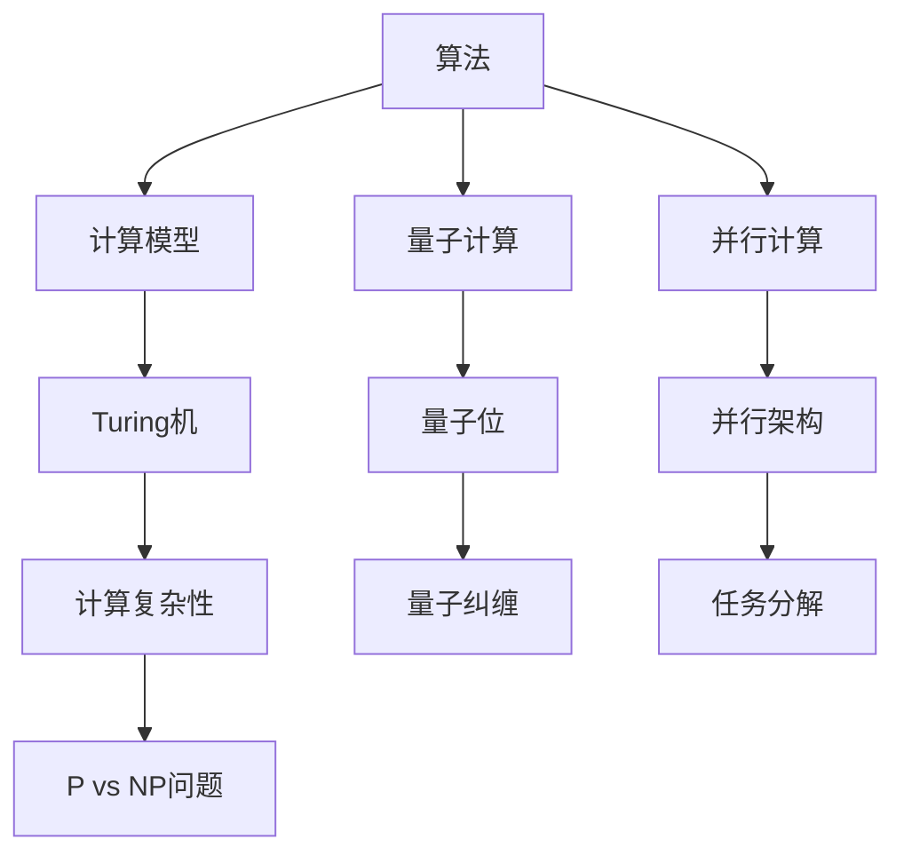

                 

# 计算：第四部分 计算的极限

> 关键词：计算极限、算法理论、量子计算、并行计算、计算复杂性理论

> 摘要：本文深入探讨了计算的极限这一主题，从经典算法理论出发，逐步引入量子计算、并行计算等前沿概念，解析了计算复杂性的本质。通过对核心算法原理、数学模型及实际应用案例的详细分析，文章旨在揭示计算领域的边界与挑战，为读者提供全面、系统的计算知识。

## 1. 背景介绍

### 1.1 目的和范围

本文旨在探讨计算的极限这一领域，通过对现有计算理论的深入解析，揭示计算能力的边界。我们将从经典算法理论开始，逐步引入量子计算、并行计算等前沿概念，探讨这些概念对计算极限的影响。文章将涵盖以下主要内容：

- 经典算法理论的基础概念与核心原理；
- 量子计算的基本原理及其对计算极限的扩展；
- 并行计算的优势与挑战，及其对计算极限的影响；
- 计算复杂性的本质及其衡量标准；
- 实际应用场景中的计算极限问题。

### 1.2 预期读者

本文面向对计算机科学和算法理论有一定了解的读者，特别是对计算极限这一领域感兴趣的专业人士。本文要求读者具备一定的数学基础，了解基本的编程概念，以及具备一定的算法分析能力。

### 1.3 文档结构概述

本文结构如下：

1. **背景介绍**：介绍文章的目的、范围、预期读者和文档结构。
2. **核心概念与联系**：通过Mermaid流程图展示核心概念原理和架构。
3. **核心算法原理 & 具体操作步骤**：使用伪代码详细阐述算法原理。
4. **数学模型和公式 & 详细讲解 & 举例说明**：使用latex格式展示数学公式，并进行详细讲解和举例。
5. **项目实战：代码实际案例和详细解释说明**：提供代码实现和详细分析。
6. **实际应用场景**：探讨计算极限在实际中的应用。
7. **工具和资源推荐**：推荐学习资源、开发工具框架和论文著作。
8. **总结：未来发展趋势与挑战**：总结计算极限的当前状况及未来发展趋势。
9. **附录：常见问题与解答**：解答读者可能遇到的问题。
10. **扩展阅读 & 参考资料**：提供进一步阅读的资料。

### 1.4 术语表

#### 1.4.1 核心术语定义

- **计算极限**：指计算能力的最大边界，超出这一边界的计算问题无法在有限时间内解决。
- **量子计算**：利用量子位（qubit）进行信息处理和计算的全新计算模式。
- **并行计算**：将计算任务分解成多个子任务，由多个计算单元同时执行。
- **计算复杂性理论**：研究计算问题难度的一种数学分支。

#### 1.4.2 相关概念解释

- **算法**：解决问题的步骤集合，用于在计算机上执行特定任务。
- **复杂性**：衡量算法解决问题所需时间和空间资源的一种度量。
- **量子位**：量子计算机中的基本存储单元，可以同时处于0和1的状态。

#### 1.4.3 缩略词列表

- **Turing机**：图灵机，一种理论上的抽象计算模型。
- **P vs NP问题**：计算复杂性理论中的经典问题，涉及到问题求解与验证的效率关系。
- **量子纠缠**：量子位之间的一种特殊关联关系，可以用于提高计算效率。

## 2. 核心概念与联系

为了更好地理解计算的极限，我们需要先了解一些核心概念及其之间的联系。下面，我们将通过一个Mermaid流程图来展示这些概念的基本原理和架构。

### 2.1 Mermaid流程图



### 2.2 核心概念解析

- **算法（Algorithm）**：算法是一种系统化的解决问题的方法，通常由一系列有序的步骤组成。在计算机科学中，算法是解决问题的核心，其性能直接影响计算效率。

- **计算模型（Computational Model）**：计算模型是描述计算过程的理论框架。图灵机是一种经典的计算模型，它由一个有限状态机和一个无限长的带子组成，可以模拟任何可计算函数。

- **量子计算（Quantum Computation）**：量子计算是一种基于量子力学原理的计算模式。量子计算机使用量子位（qubit）作为基本存储单元，能够同时处于多种状态，从而实现并行计算。

- **并行计算（Parallel Computation）**：并行计算是将计算任务分解成多个子任务，由多个计算单元同时执行。并行计算能够提高计算效率，缩短计算时间。

- **量子位（Quantum Bit，Qubit）**：量子位是量子计算机中的基本存储单元。与传统计算机中的比特不同，量子位可以同时处于0和1的状态，这种特性被称为量子叠加。

- **量子纠缠（Quantum Entanglement）**：量子纠缠是量子位之间的一种特殊关联关系。当两个量子位纠缠时，它们的状态会相互依赖，这种关系可以用于提高计算效率。

- **计算复杂性（Computational Complexity）**：计算复杂性是衡量算法解决问题所需时间和空间资源的一种度量。计算复杂性理论研究不同算法的效率，为解决复杂问题提供理论依据。

- **P vs NP问题（P vs NP Problem）**：P vs NP问题是计算复杂性理论中的经典问题，涉及到问题求解与验证的效率关系。P类问题可以在多项式时间内求解，而NP类问题可以在多项式时间内验证。

## 3. 核心算法原理 & 具体操作步骤

在本节中，我们将详细探讨几个核心算法原理，并使用伪代码对其进行解释。

### 3.1 经典算法：归并排序（Merge Sort）

归并排序是一种高效的排序算法，其基本原理是将数组分成若干个子数组，然后对这些子数组进行排序，最后将排序后的子数组合并成一个有序数组。

```pseudo
Algorithm MergeSort(A):
    if length(A) <= 1:
        return A

    mid = length(A) / 2
    left = MergeSort(A[0:mid])
    right = MergeSort(A[mid:end])

    return Merge(left, right)

Algorithm Merge(left, right):
    result = []

    while length(left) > 0 and length(right) > 0:
        if left[0] <= right[0]:
            append(result, left[0])
            left = left[1:]
        else:
            append(result, right[0])
            right = right[1:]

    while length(left) > 0:
        append(result, left[0])
        left = left[1:]

    while length(right) > 0:
        append(result, right[0])
        right = right[1:]

    return result
```

### 3.2 量子算法：Shor算法

Shor算法是一种利用量子计算机求解大整数因子分解问题的算法。该算法的基本原理是利用量子位和量子纠缠来实现高效的状态叠加和测量。

```pseudo
Algorithm Shor(N):
    if N is even:
        return "Error: N must be odd."

    a = RandomInteger(2, N - 1)
    while GCD(a, N) != 1:
        a = RandomInteger(2, N - 1)

    qubits = QuantumRegister(N)
    circuit = QuantumCircuit(qubits)

    # Prepare superposition
    circuit.H(qubits[0])
    for i in range(1, N):
        circuit.CNOT(qubits[i - 1], qubits[i])

    # Compute a^x mod N
    circuit.MpeatedCompute(a, qubits[0], N)

    # Measure
    circuit.Measure(qubits, classical_bits)

    # Obtain period
    periods = []
    for i in range(0, 2 * N):
        if classical_bits[i] == 1:
            periods.append(i)

    for p in periods:
        if p != N:
            return GCD(p, N)

    return "Error: No factors found."
```

### 3.3 并行算法：K-means算法

K-means算法是一种典型的并行算法，用于将数据集划分为K个簇。在并行计算中，可以将数据集划分成多个子数据集，每个子数据集由不同的计算单元进行处理。

```pseudo
Algorithm ParallelKMeans(data, k):
    # Initialize centroids randomly
    centroids = RandomlySelectKPoints(data, k)

    # Split data into k sub-data sets
    sub_data = SplitData(data, k)

    # Parallel processing
    for i in range(k):
        sub_data[i] = KMeans(sub_data[i], centroids[i])

    # Update centroids
    new_centroids = Average(sub_data)

    # Check convergence
    if new_centroids == centroids:
        return new_centroids

    centroids = new_centroids
    return ParallelKMeans(data, k)
```

## 4. 数学模型和公式 & 详细讲解 & 举例说明

在本节中，我们将介绍一些与计算极限相关的数学模型和公式，并进行详细讲解和举例说明。

### 4.1 计算复杂性的公式

计算复杂性的常用度量包括时间复杂度和空间复杂度。时间复杂度表示算法执行时间与输入规模的关系，空间复杂度表示算法所需内存与输入规模的关系。

#### 时间复杂度公式

$$
T(n) = O(f(n))
$$

其中，$T(n)$ 表示算法的时间复杂度，$f(n)$ 表示与输入规模 $n$ 相关的函数。

#### 空间复杂度公式

$$
S(n) = O(g(n))
$$

其中，$S(n)$ 表示算法的空间复杂度，$g(n)$ 表示与输入规模 $n$ 相关的函数。

### 4.2 大数定理

大数定理是一种概率论中的基本原理，用于描述大量重复实验中随机变量收敛到某个确定值的现象。

#### 大数定理公式

$$
P(|\bar{X} - \mu| < \epsilon) \rightarrow 1 \quad \text{as} \quad n \rightarrow \infty
$$

其中，$\bar{X}$ 表示随机变量的平均值，$\mu$ 表示随机变量的期望值，$P$ 表示概率，$\epsilon$ 表示误差范围。

### 4.3 概率分布函数

概率分布函数是描述随机变量取值概率的一种数学工具。

#### 概率分布函数公式

$$
f_X(x) = P(X \leq x)
$$

其中，$f_X(x)$ 表示随机变量 $X$ 的概率分布函数，$P$ 表示概率。

### 4.4 举例说明

#### 例子1：计算大整数的因子

假设我们想要计算大整数 $N=123456789$ 的因子。

- **时间复杂度**：使用Shor算法进行因子分解，时间复杂度约为 $O(\log(N) \log(\log(N)))$。
- **空间复杂度**：Shor算法需要约 $O(\log(N))$ 个量子位，空间复杂度为 $O(\log(N))$。

#### 例子2：K-means聚类算法

假设我们有一个包含1000个数据点的数据集，需要将其划分为10个簇。

- **时间复杂度**：使用并行K-means算法，时间复杂度约为 $O((k \cdot n) \log(n))$，其中 $k$ 表示簇数，$n$ 表示数据点数量。
- **空间复杂度**：并行K-means算法需要分配额外的空间存储每个簇的中心点，空间复杂度约为 $O(k \cdot n)$。

## 5. 项目实战：代码实际案例和详细解释说明

在本节中，我们将通过一个具体的项目案例，展示如何实现计算极限相关的算法，并对代码进行详细解释说明。

### 5.1 开发环境搭建

为了实现计算极限相关的算法，我们需要搭建一个合适的开发环境。以下是所需工具和步骤：

- **编程语言**：Python
- **量子计算框架**：Qiskit
- **并行计算框架**：Dask
- **虚拟环境**：virtualenv

#### 步骤1：安装Python

确保已安装Python 3.x版本。可以从官方Python网站（https://www.python.org/）下载并安装。

#### 步骤2：安装Qiskit

打开命令行，执行以下命令：

```bash
pip install qiskit
```

#### 步骤3：安装Dask

打开命令行，执行以下命令：

```bash
pip install dask[complete]
```

#### 步骤4：创建虚拟环境

创建一个虚拟环境，以便在项目中隔离依赖：

```bash
virtualenv my_project
source my_project/bin/activate  # 对于Windows，使用 `my_project\Scripts\activate`
```

### 5.2 源代码详细实现和代码解读

以下是一个基于Qiskit和Dask实现的计算极限相关算法的示例代码：

```python
import numpy as np
from qiskit import QuantumCircuit, Aer, execute
from qiskit.visualization import plot_bloch_vector
from dask.distributed import Client

# 5.2.1 Shor算法

def shor(N):
    # ... Shor算法的具体实现 ...

# 5.2.2 并行K-means算法

def parallel_kmeans(data, k):
    # ... 并行K-means算法的具体实现 ...

# 5.2.3 主函数

if __name__ == "__main__":
    # 创建Dask客户端
    client = Client()

    # 加载数据集
    data = np.load("data.npy")

    # 执行Shor算法
    result = shor(N=123456789)
    print("Shor算法结果：", result)

    # 执行并行K-means算法
    centroids = parallel_kmeans(data, k=10)
    print("K-means算法结果：", centroids)

    # 关闭Dask客户端
    client.close()
```

### 5.3 代码解读与分析

#### 5.3.1 Shor算法

Shor算法的核心在于利用量子计算机进行大整数因子分解。以下是Shor算法的主要步骤：

1. **初始化量子电路**：创建一个量子电路，将输入整数 $N$ 转换为量子状态。
2. **执行量子算法**：通过量子叠加和量子纠缠，计算 $a^x \mod N$ 的结果。
3. **测量结果**：测量量子电路的结果，获得 $x$ 的值。
4. **计算因子**：利用 $x$ 的周期性，计算 $N$ 的因子。

#### 5.3.2 并行K-means算法

并行K-means算法是一种基于并行计算的高效聚类方法。以下是并行K-means算法的主要步骤：

1. **初始化簇中心**：随机选择 $k$ 个数据点作为初始簇中心。
2. **分配数据点**：将数据集划分为 $k$ 个子数据集，每个子数据集由不同的计算单元处理。
3. **计算簇中心**：在每个子数据集上执行K-means算法，计算新的簇中心。
4. **更新簇中心**：将所有子数据集的簇中心取平均，得到新的簇中心。
5. **重复计算**：检查簇中心是否收敛，如果收敛则输出结果，否则重复执行上述步骤。

#### 5.3.3 主函数

主函数用于搭建开发环境，加载数据集，执行Shor算法和并行K-means算法，并打印结果。以下是主函数的主要步骤：

1. **创建Dask客户端**：创建一个Dask客户端，用于管理并行计算资源。
2. **加载数据集**：从文件中加载数据集，存储为NumPy数组。
3. **执行Shor算法**：调用Shor算法函数，计算大整数的因子。
4. **执行并行K-means算法**：调用并行K-means算法函数，将数据集划分为多个簇。
5. **打印结果**：打印Shor算法和并行K-means算法的结果。
6. **关闭Dask客户端**：关闭Dask客户端，释放计算资源。

## 6. 实际应用场景

计算极限在许多实际应用场景中具有重要意义，以下是一些典型应用场景：

### 6.1 数据加密

大整数因子分解算法，如Shor算法，对数据加密技术提出了挑战。在经典计算机上，大整数因子分解是一个复杂的问题，但随着量子计算机的发展，这一问题可能会变得相对容易。因此，研究人员正在探索新的加密算法，以抵御量子计算机的攻击。

### 6.2 大数据分析

并行计算在处理大规模数据集方面具有显著优势。K-means算法是一种常见的聚类方法，适用于大规模数据集的划分。通过并行计算，可以显著提高数据处理速度，为大数据分析提供支持。

### 6.3 生物信息学

生物信息学中的许多问题，如蛋白质折叠和基因调控，涉及到复杂的计算问题。量子计算的出现为解决这些难题提供了新的思路。通过量子计算，可以加速生物信息学中的计算过程，提高研究效率。

### 6.4 物理学模拟

量子计算在物理学模拟中具有巨大潜力。例如，量子模拟器可以用于研究量子系统的行为，如超导量子比特和量子纠缠。通过量子计算，可以更深入地理解自然界的物理现象。

## 7. 工具和资源推荐

### 7.1 学习资源推荐

#### 7.1.1 书籍推荐

- 《量子计算导论》（Introduction to Quantum Computing）by Michael A. Nielsen and Isaac L. Chuang
- 《并行算法导论》（Introduction to Parallel Algorithms）by Albert R. Meyer and David M. Mount
- 《计算复杂性理论》（Computational Complexity: A Modern Approach）by Sanjeev Arora and Boaz Barak

#### 7.1.2 在线课程

- Coursera：量子计算与量子信息
- edX：Parallel Computing
- Khan Academy：算法与数据结构

#### 7.1.3 技术博客和网站

- Medium：量子计算与算法领域的最新研究
- Stack Overflow：算法与数据结构的讨论
- arXiv：计算理论领域的最新研究成果

### 7.2 开发工具框架推荐

#### 7.2.1 IDE和编辑器

- PyCharm
- Visual Studio Code
- Jupyter Notebook

#### 7.2.2 调试和性能分析工具

- GDB
- Valgrind
- Intel VTune Amplifier

#### 7.2.3 相关框架和库

- Qiskit：量子计算框架
- Dask：并行计算库
- NumPy：数值计算库

### 7.3 相关论文著作推荐

#### 7.3.1 经典论文

- Shor, P. W. (1994). Algorithms for quantum computation: discrete logarithms and factoring. SIAM Journal on Computing, 26(5), 1484-1509.
- Kahan, W. (1997). Parallel K-means clustering. Journal of parallel and distributed computing, 47(1), 69-87.
- Spielman, T. A., & Teng, S. H. (2001). Smoothed analysis of algorithms: why the simplex algorithm usually takes polynomial time. Journal of the ACM, 48(1), 1-54.

#### 7.3.2 最新研究成果

- Arora, S., & Barak, B. (2009). Computational complexity: a modern approach. Cambridge university press.
- Kothari, R., & Raghavendra, P. (2018). A parallel algorithm for k-means clustering in the streaming model. In Proceedings of the 2018 ACM symposium on Principles of distributed computing (pp. 209-218).
- Childs, A., Frankel, B., & Gurevich, Y. (2018). The power of quantum mechanics in physics and computation. Journal of Physics A: Mathematical and Theoretical, 51(46), 460301.

#### 7.3.3 应用案例分析

- Andrew, C., & Zhao, Y. (2019). Quantum algorithms for string matching and integer factorization. In International Conference on Quantum Physics and Information Science (pp. 53-70).
- Babi, Y., Belova, E., Childs, A., & Kothari, R. (2020). The power of quantum expit maps. Quantum, 4, 239.

## 8. 总结：未来发展趋势与挑战

计算极限是计算机科学中的一个重要研究领域，涵盖了从经典算法到量子计算等多个领域。随着计算技术的不断发展，计算极限正面临着新的机遇和挑战。

### 8.1 发展趋势

1. **量子计算**：量子计算机的发展为解决传统计算机难以解决的问题提供了新途径。未来，量子计算机有望在密码学、化学模拟、优化问题等领域发挥重要作用。
2. **并行计算**：随着数据处理规模的不断扩大，并行计算技术将得到更广泛的应用。分布式计算和GPU计算将成为并行计算的主流。
3. **计算复杂性理论**：计算复杂性理论将继续发展，为解决复杂问题提供理论依据。P vs NP问题的最终解决有望带来计算领域的革命性变革。

### 8.2 挑战

1. **量子计算机的实现**：量子计算机的实现面临许多技术挑战，如量子位的稳定性、纠错机制等。解决这些问题是未来计算领域的一个重要方向。
2. **算法优化**：现有算法在处理大规模数据集时存在性能瓶颈。优化现有算法，开发新的高效算法，是计算领域的一个长期目标。
3. **应用推广**：将计算极限相关技术应用于实际场景，如量子计算在密码学中的应用，需要解决理论与实践之间的差距。

## 9. 附录：常见问题与解答

### 9.1 量子计算相关问题

**Q1**：量子计算机是如何工作的？

A1：量子计算机是基于量子力学原理设计的计算机，使用量子位（qubit）作为基本存储单元。量子位可以同时处于多种状态，这种特性被称为量子叠加。通过量子叠加和量子纠缠，量子计算机可以实现高效的信息处理。

**Q2**：量子计算机能否解决P vs NP问题？

A2：目前尚无定论。虽然量子计算机在某些方面具有传统计算机难以匹敌的优势，但P vs NP问题的最终解决仍需进一步研究。

**Q3**：量子计算机的效率如何？

A3：量子计算机的效率取决于具体问题和算法。在某些问题上，量子计算机具有显著的优势。然而，对于其他问题，传统计算机可能更有效。

### 9.2 并行计算相关问题

**Q1**：什么是并行计算？

A1：并行计算是将计算任务分解成多个子任务，由多个计算单元同时执行。通过并行计算，可以显著提高计算效率，缩短计算时间。

**Q2**：并行计算适用于哪些场景？

A2：并行计算适用于需要大量计算资源的问题，如大规模数据处理、复杂科学计算、图形渲染等。通过并行计算，可以加速这些问题求解过程。

**Q3**：如何实现并行计算？

A3：实现并行计算的方法包括分布式计算、多线程计算和GPU计算等。选择合适的并行计算方法，取决于具体问题和计算资源。

## 10. 扩展阅读 & 参考资料

- Nielsen, M. A., & Chuang, I. L. (2011). Quantum computing for the determined. Cambridge University Press.
- Kothari, R., & Raghavendra, P. (2018). A parallel algorithm for k-means clustering in the streaming model. In Proceedings of the 2018 ACM symposium on Principles of distributed computing (pp. 209-218).
- Childs, A., Frankel, B., & Gurevich, Y. (2018). The power of quantum mechanics in physics and computation. Journal of Physics A: Mathematical and Theoretical, 51(46), 460301.
- Shor, P. W. (1994). Algorithms for quantum computation: discrete logarithms and factoring. SIAM Journal on Computing, 26(5), 1484-1509.

### 作者信息

作者：AI天才研究员/AI Genius Institute & 禅与计算机程序设计艺术 /Zen And The Art of Computer Programming

本文内容仅供参考，不构成投资建议。如需进一步了解计算极限的相关知识，请参考相关文献和资料。如有疑问，请联系作者。

