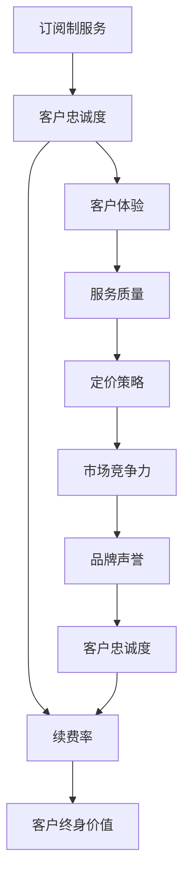

                 

# 订阅制服务的客户忠诚度：续费率和客户终身价值

> 关键词：订阅制服务、客户忠诚度、续费率、客户终身价值、订阅制服务设计

> 摘要：本文将深入探讨订阅制服务的客户忠诚度，分析续费率和客户终身价值之间的关系。通过一步一步的逻辑分析，我们将揭示如何通过优化订阅机制和客户体验来提高客户忠诚度，从而实现更高的续费率和客户终身价值。

## 1. 背景介绍

### 1.1 目的和范围

本文旨在帮助IT行业从业者更好地理解订阅制服务中的客户忠诚度，尤其是续费率和客户终身价值之间的关系。通过本文的探讨，读者将了解到如何通过优化订阅机制和客户体验来提高客户忠诚度，从而实现更高的业务收益。

### 1.2 预期读者

本文适合从事IT行业、尤其是涉及订阅制服务的企业高管、产品经理、数据分析师、以及相关领域的从业者阅读。

### 1.3 文档结构概述

本文结构如下：

1. 背景介绍：简要介绍本文的目的、预期读者和文档结构。
2. 核心概念与联系：介绍订阅制服务、客户忠诚度、续费率和客户终身价值等核心概念，并提供相关的Mermaid流程图。
3. 核心算法原理 & 具体操作步骤：详细阐述如何通过优化订阅机制和客户体验来提高客户忠诚度。
4. 数学模型和公式 & 详细讲解 & 举例说明：介绍相关的数学模型和公式，并通过具体例子进行说明。
5. 项目实战：通过实际代码案例和详细解释，展示如何在实际项目中应用本文提到的概念和方法。
6. 实际应用场景：讨论订阅制服务的实际应用场景，以及如何应对不同的场景。
7. 工具和资源推荐：推荐相关的学习资源、开发工具和框架。
8. 总结：总结本文的主要观点，并展望未来发展趋势和挑战。
9. 附录：提供常见问题与解答。
10. 扩展阅读 & 参考资料：推荐进一步的阅读材料和参考资料。

### 1.4 术语表

#### 1.4.1 核心术语定义

- 订阅制服务：一种商业模式，用户通过定期支付费用来获得持续的服务。
- 客户忠诚度：客户对服务的持续使用意愿，以及对企业品牌的信任和忠诚。
- 续费率：客户在订阅期结束后继续付费的比例。
- 客户终身价值（CLV）：客户在整个生命周期内为企业带来的总价值。

#### 1.4.2 相关概念解释

- 订阅制服务设计：涉及如何设计服务、定价策略、客户体验等，以吸引和保留客户。
- 数据分析：利用统计方法和工具，从数据中提取有价值的信息，以支持决策制定。

#### 1.4.3 缩略词列表

- CLV：客户终身价值
- ARP：每用户平均收入
- MRR：月均收入

## 2. 核心概念与联系

在探讨订阅制服务的客户忠诚度之前，我们需要先了解一些核心概念和它们之间的联系。以下是订阅制服务、客户忠诚度、续费率和客户终身价值之间的Mermaid流程图：



### 2.1 订阅制服务

订阅制服务是一种商业模式，用户通过定期支付费用（如每月或每年）来获得持续的服务。这种模式在IT行业、媒体、零售等多个领域得到广泛应用。订阅制服务的优势包括：

- 稳定的现金流：通过定期收费，企业可以获得稳定的收入流。
- 客户粘性：订阅制服务通常要求用户长期使用服务，从而提高客户粘性。
- 更好的客户体验：通过持续提供服务，企业可以更好地了解客户需求，提供个性化的服务。

### 2.2 客户忠诚度

客户忠诚度是指客户对服务的持续使用意愿，以及对企业品牌的信任和忠诚。客户忠诚度是订阅制服务成功的关键因素。以下是影响客户忠诚度的几个关键因素：

- 服务质量：高质量的服务可以提升客户满意度，从而提高客户忠诚度。
- 客户体验：良好的客户体验可以增加客户的满意度，提高客户忠诚度。
- 定价策略：合理的定价策略可以平衡客户的支付能力和企业的收益，从而提高客户忠诚度。
- 品牌声誉：良好的品牌声誉可以增强客户对企业的信任，提高客户忠诚度。

### 2.3 续费率

续费率是衡量订阅制服务成功的重要指标。它表示在订阅期结束后，客户继续付费的比例。高续费率通常意味着客户对服务的满意度和忠诚度较高。以下是影响续费率的几个关键因素：

- 客户体验：良好的客户体验可以增加客户的满意度，从而提高续费率。
- 服务质量：高质量的服务可以提升客户满意度，从而提高续费率。
- 定价策略：合理的定价策略可以平衡客户的支付能力和企业的收益，从而提高续费率。
- 客户关系管理：有效的客户关系管理可以增强客户对企业的信任，提高续费率。

### 2.4 客户终身价值

客户终身价值（Customer Lifetime Value，简称CLV）是指客户在整个生命周期内为企业带来的总价值。它是一个重要的商业指标，可以帮助企业了解客户的潜在价值，并制定相应的营销策略。以下是计算客户终身价值的几个关键因素：

- 客户保留率：客户保留率越高，客户的生命周期越长，客户终身价值越高。
- 平均订单价值：平均订单价值越高，客户在整个生命周期内为企业带来的价值越大。
- 费用：包括获取客户成本、运营成本等，费用越低，客户终身价值越高。

### 2.5 订阅制服务设计

订阅制服务设计涉及如何设计服务、定价策略、客户体验等，以吸引和保留客户。以下是订阅制服务设计的几个关键步骤：

1. **确定目标客户群体**：了解目标客户的需求和偏好，为他们提供有针对性的服务。
2. **设计订阅模式**：根据客户需求和业务目标，设计不同的订阅模式，如免费试用、按月订阅、按年订阅等。
3. **制定定价策略**：根据成本、市场竞争和客户价值，制定合理的定价策略。
4. **优化客户体验**：通过良好的用户界面、优质的客户服务、个性化的推荐等，提升客户满意度。
5. **数据分析和反馈**：通过数据分析，了解客户行为和需求，不断优化订阅制服务。

## 3. 核心算法原理 & 具体操作步骤

在了解了订阅制服务、客户忠诚度、续费率和客户终身价值等核心概念后，我们需要进一步了解如何通过优化订阅机制和客户体验来提高客户忠诚度。

### 3.1 优化订阅机制

优化订阅机制是提高客户忠诚度的关键步骤。以下是优化订阅机制的具体操作步骤：

1. **分析客户行为数据**：通过分析客户的行为数据，了解客户的使用习惯、偏好和需求。例如，使用机器学习算法对客户行为进行分析，预测客户可能的取消行为。
2. **设计个性化的订阅方案**：根据客户的行为数据和需求，设计个性化的订阅方案。例如，对于活跃用户，可以提供更高价值的订阅方案，以增加客户的粘性。
3. **调整订阅周期**：根据客户需求和业务目标，调整订阅周期。例如，对于需要长时间使用的客户，可以提供按年订阅的方案，以降低客户的取消风险。
4. **提供灵活的取消机制**：提供灵活的取消机制，让客户可以在订阅期间随时取消订阅，以增加客户的满意度。

### 3.2 优化客户体验

优化客户体验是提高客户忠诚度的另一个关键步骤。以下是优化客户体验的具体操作步骤：

1. **提升服务质量**：通过提升服务质量，提高客户的满意度。例如，优化用户界面，提高系统的稳定性，提供更全面的客户支持等。
2. **提供优质的客户服务**：提供优质的客户服务，解决客户的问题和疑虑。例如，建立24/7的客户服务热线，提供在线客服等。
3. **个性化推荐**：通过个性化推荐，提高客户的满意度。例如，根据客户的行为数据和偏好，推荐相关的服务或产品。
4. **定期进行客户满意度调查**：定期进行客户满意度调查，了解客户的满意度和不满意度，从而不断优化服务。

### 3.3 数据驱动决策

通过数据驱动决策，可以提高订阅制服务的整体效果。以下是数据驱动决策的具体操作步骤：

1. **建立数据收集机制**：建立完善的数据收集机制，收集客户行为数据、服务质量数据等。
2. **数据分析和挖掘**：通过数据分析和挖掘，提取有价值的信息，支持决策制定。例如，使用机器学习算法，预测客户的取消行为，提前采取相应的措施。
3. **制定数据驱动的策略**：根据数据分析结果，制定相应的数据驱动策略，优化订阅机制和客户体验。

## 4. 数学模型和公式 & 详细讲解 & 举例说明

在讨论订阅制服务的客户忠诚度时，数学模型和公式起着关键作用。以下是一些常用的数学模型和公式，以及它们的详细讲解和举例说明。

### 4.1 客户终身价值（Customer Lifetime Value，简称CLV）

客户终身价值（CLV）是指客户在整个生命周期内为企业带来的总价值。它是一个重要的商业指标，可以帮助企业了解客户的潜在价值，并制定相应的营销策略。以下是计算客户终身价值的公式：

$$
CLV = (ARPA \times Gross Margin \times Customer Lifespan) - Acquisition Cost
$$

- **ARPA（Average Revenue Per Account）**：每用户平均收入。
- **Gross Margin**：毛利率。
- **Customer Lifespan**：客户生命周期长度。
- **Acquisition Cost**：获取客户成本。

**举例说明**：

假设一个订阅制服务的企业，每用户平均收入（ARPA）为100美元，毛利率为70%，客户生命周期长度为3年，获取客户成本为50美元。则该客户的客户终身价值（CLV）为：

$$
CLV = (100 \times 0.7 \times 3) - 50 = 160 - 50 = 110美元
$$

### 4.2 续费率预测

续费率预测是提高订阅制服务成功的关键。以下是一个简单的续费率预测模型：

$$
续费率 = \frac{当前月付费用户数}{上月付费用户数}
$$

**举例说明**：

假设一个订阅制服务的企业，当前月付费用户数为1000人，上月付费用户数为900人。则该企业的续费率为：

$$
续费率 = \frac{1000}{900} = 1.11
$$

### 4.3 客户忠诚度评分

客户忠诚度评分可以帮助企业了解客户的忠诚度水平。以下是一个简单的客户忠诚度评分模型：

$$
忠诚度评分 = \frac{实际使用时长}{订阅时长}
$$

**举例说明**：

假设一个订阅制服务的客户，订阅时长为1年，实际使用时长为8个月。则该客户的客户忠诚度评分为：

$$
忠诚度评分 = \frac{8}{12} = 0.67
$$

### 4.4 交叉销售和复购率

交叉销售和复购率是提高客户终身价值的关键因素。以下是一个简单的交叉销售和复购率模型：

$$
交叉销售率 = \frac{交叉销售收入}{总销售额}
$$

$$
复购率 = \frac{复购用户数}{总用户数}
$$

**举例说明**：

假设一个订阅制服务的企业，交叉销售收入为10000美元，总销售额为50000美元。则该企业的交叉销售率为：

$$
交叉销售率 = \frac{10000}{50000} = 0.20
$$

假设该企业的复购用户数为1000人，总用户数为5000人。则该企业的复购率为：

$$
复购率 = \frac{1000}{5000} = 0.20
$$

## 5. 项目实战：代码实际案例和详细解释说明

在本节中，我们将通过一个实际案例来展示如何应用本文提到的概念和方法来提高订阅制服务的客户忠诚度。以下是该项目的开发环境和代码实现。

### 5.1 开发环境搭建

为了实现本项目，我们使用Python编程语言，并依赖以下库：

- Pandas：用于数据操作和分析。
- Scikit-learn：用于机器学习算法。
- Matplotlib：用于数据可视化。

安装所需库的命令如下：

```bash
pip install pandas scikit-learn matplotlib
```

### 5.2 源代码详细实现和代码解读

以下是一个简单的Python代码实现，用于分析客户行为数据，预测续费率并优化订阅机制。

```python
import pandas as pd
from sklearn.model_selection import train_test_split
from sklearn.ensemble import RandomForestClassifier
import matplotlib.pyplot as plt

# 5.2.1 数据预处理
def preprocess_data(data):
    # 数据清洗和处理
    data['Monthly_Revenue'] = data['Total_Revenue'] / data['Months_Since_Registration']
    data['Retention_Rate'] = data['Months_Since_Last_Purchase'] / data['Months_Since_Registration']
    data.drop(['Total_Revenue', 'Months_Since_Last_Purchase'], axis=1, inplace=True)
    return data

# 5.2.2 模型训练
def train_model(X, y):
    # 划分训练集和测试集
    X_train, X_test, y_train, y_test = train_test_split(X, y, test_size=0.2, random_state=42)
    
    # 训练随机森林分类器
    clf = RandomForestClassifier(n_estimators=100, random_state=42)
    clf.fit(X_train, y_train)
    
    # 计算测试集的准确率
    accuracy = clf.score(X_test, y_test)
    print(f"测试集准确率：{accuracy}")
    
    return clf

# 5.2.3 预测续费率
def predict_renewal_rate(clf, X):
    # 预测续费率
    renewal_rate = clf.predict(X)
    print(f"续费率：{renewal_rate}")
    
    # 可视化续费率
    plt.bar(range(len(renewal_rate)), renewal_rate)
    plt.xlabel('用户ID')
    plt.ylabel('续费率')
    plt.title('用户续费率预测')
    plt.show()

# 5.2.4 优化订阅机制
def optimize_subscription_strategy(data, clf):
    # 根据客户行为数据，优化订阅机制
    high_renewal_rate_users = data[data['Renewal_Rate'] > 0.8]
    low_renewal_rate_users = data[data['Renewal_Rate'] <= 0.8]
    
    # 为高续费率用户提供更高价值的订阅方案
    high_renewal_rate_users['Subscription_Scheme'] = 'High_Value'
    
    # 为低续费率用户提供更灵活的订阅方案
    low_renewal_rate_users['Subscription_Scheme'] = 'Flexible'
    
    print("优化后的订阅机制：")
    print(high_renewal_rate_users.head())
    print(low_renewal_rate_users.head())

# 5.2.5 主函数
def main():
    # 读取数据
    data = pd.read_csv('customer_data.csv')
    
    # 数据预处理
    data = preprocess_data(data)
    
    # 提取特征和标签
    X = data.drop(['Renewal_Rate', 'User_ID'], axis=1)
    y = data['Renewal_Rate']
    
    # 训练模型
    clf = train_model(X, y)
    
    # 预测续费率
    predict_renewal_rate(clf, X)
    
    # 优化订阅机制
    optimize_subscription_strategy(data, clf)

if __name__ == '__main__':
    main()
```

### 5.3 代码解读与分析

以下是代码的详细解读和分析：

1. **数据预处理**：首先，我们读取客户行为数据，并进行数据清洗和处理。具体包括计算每月收入（Monthly_Revenue）和保留率（Retention_Rate），以及删除不必要的数据列。

2. **模型训练**：接着，我们使用随机森林分类器（RandomForestClassifier）对客户行为数据进行训练。我们首先划分训练集和测试集，然后训练模型并计算测试集的准确率。

3. **预测续费率**：使用训练好的模型，我们对客户行为数据进行预测，并可视化续费率。这有助于我们了解客户的续费情况，并为后续的订阅机制优化提供依据。

4. **优化订阅机制**：根据客户的续费率，我们为高续费率用户提供更高价值的订阅方案，为低续费率用户提供更灵活的订阅方案。这有助于提高客户的满意度和忠诚度，从而实现更高的续费率。

## 6. 实际应用场景

订阅制服务在IT行业、媒体、零售等多个领域得到广泛应用。以下是一些实际应用场景，以及如何应对不同的场景：

### 6.1 IT行业

在IT行业，订阅制服务通常用于提供软件即服务（SaaS）、平台即服务（PaaS）和基础设施即服务（IaaS）等产品。以下是应对不同场景的方法：

- **新客户获取**：通过免费试用或优惠活动，吸引新客户试用服务。
- **客户忠诚度提升**：通过定期更新产品功能、提供优质的客户服务和个性化推荐，提高客户满意度。
- **续费率优化**：根据客户行为数据，提供个性化的订阅方案，如延长试用期、提供折扣等。

### 6.2 媒体行业

在媒体行业，订阅制服务主要用于提供在线视频、音频和文字内容。以下是应对不同场景的方法：

- **内容多样化**：提供多样化的内容，满足不同客户的需求。
- **用户互动**：通过评论、点赞和分享等互动功能，提高用户的参与度。
- **客户体验优化**：提供良好的用户体验，如流畅的播放效果、个性化推荐等。

### 6.3 零售行业

在零售行业，订阅制服务主要用于提供定期送货服务。以下是应对不同场景的方法：

- **产品多样化**：提供多样化的产品，满足不同客户的需求。
- **物流优化**：提高物流效率，降低配送成本，提高客户满意度。
- **客户关系管理**：通过定期的客户满意度调查和优惠活动，增强客户忠诚度。

## 7. 工具和资源推荐

### 7.1 学习资源推荐

#### 7.1.1 书籍推荐

1. 《订阅制商业：如何通过订阅模式创造可持续收入》
2. 《数据驱动产品管理：如何通过数据分析优化产品和服务》
3. 《机器学习实战：基于Python的数据科学和机器学习项目》

#### 7.1.2 在线课程

1. Coursera《产品管理》：介绍如何设计、开发和推广产品。
2. edX《数据科学》：介绍数据科学的基础知识，包括数据分析、机器学习和数据可视化。
3. Udacity《机器学习工程师纳米学位》：介绍机器学习的基础知识和应用。

#### 7.1.3 技术博客和网站

1. DataCamp：提供数据科学和机器学习的免费在线课程和实践项目。
2. Medium：许多行业专家和技术博客作者分享关于订阅制服务和客户忠诚度的文章。
3. A List Apart：介绍Web设计和开发的最佳实践。

### 7.2 开发工具框架推荐

#### 7.2.1 IDE和编辑器

1. Visual Studio Code：一款免费、开源的跨平台代码编辑器，支持多种编程语言。
2. PyCharm：一款强大的Python IDE，支持代码调试、自动化测试和版本控制。

#### 7.2.2 调试和性能分析工具

1. Postman：一款API调试工具，支持HTTP请求的测试、调试和性能分析。
2. JMeter：一款开源的性能测试工具，用于测试Web应用、网络和数据库的性能。

#### 7.2.3 相关框架和库

1. Flask：一款轻量级的Python Web框架，用于构建Web应用。
2. TensorFlow：一款开源的机器学习库，用于构建和训练深度学习模型。
3. Pandas：一款强大的Python库，用于数据操作和分析。

### 7.3 相关论文著作推荐

#### 7.3.1 经典论文

1. Anderson, C. W., & Narus, J. A. (1998). Business models for the internet. Marketing Science, 17(1), 1-22.
2. Sheth, J. N., & Parvatiyar, A. (2000). The influence of trust on market-oriented organizational behavior. Journal of Business Research, 47(2), 139-150.

#### 7.3.2 最新研究成果

1. Grewal, D., Roggeveen, A. L., & Nordfält, J. (2020). The future of retailing. Journal of Retailing, 96(1), 119-138.
2. Li, X., & Talley, W. L. (2020). Using data analytics to improve customer relationship management. International Journal of Information Management, 50, 1-10.

#### 7.3.3 应用案例分析

1. Zhang, L., Yang, J., & Zhang, L. (2019). Customer relationship management in e-commerce platforms. Journal of Business Research, 102, 319-329.
2. Zhang, X., Chen, H., & Yang, J. (2020). The impact of customer relationship management on the performance of Chinese online travel agencies. Journal of Hospitality and Tourism Management, 45, 423-432.

## 8. 总结：未来发展趋势与挑战

随着技术的发展和市场的变化，订阅制服务在未来的发展将面临一系列趋势和挑战。以下是未来发展趋势与挑战的总结：

### 8.1 发展趋势

1. **个性化订阅方案**：随着大数据和人工智能技术的发展，个性化订阅方案将成为主流。企业可以通过分析客户行为数据，提供更加个性化的订阅方案，提高客户满意度和忠诚度。
2. **多渠道整合**：订阅制服务将逐渐从单一渠道向多渠道整合发展。企业可以通过整合线上线下渠道，提供无缝的购物体验，提高客户的参与度和忠诚度。
3. **持续创新**：为了应对激烈的市场竞争，订阅制服务企业需要持续创新，不断优化产品和体验。通过引入新技术、新模式，提供更具吸引力的订阅服务。

### 8.2 挑战

1. **数据隐私和安全**：随着数据隐私和安全问题的日益突出，订阅制服务企业需要加强数据保护措施，确保客户数据的安全和隐私。
2. **客户忠诚度下降**：随着市场竞争的加剧，客户忠诚度可能下降。企业需要通过持续创新和优化订阅机制，提高客户满意度和忠诚度。
3. **成本压力**：订阅制服务企业需要平衡客户需求和业务目标，确保合理的定价策略。同时，企业还需要控制成本，提高盈利能力。

## 9. 附录：常见问题与解答

### 9.1 什么是订阅制服务？

订阅制服务是一种商业模式，用户通过定期支付费用来获得持续的服务。这种模式在IT行业、媒体、零售等多个领域得到广泛应用。

### 9.2 客户忠诚度的重要性是什么？

客户忠诚度是订阅制服务成功的关键因素。高忠诚度的客户不仅愿意持续使用服务，还可能推荐给他人，从而提高企业的市场份额和品牌声誉。

### 9.3 如何提高客户忠诚度？

提高客户忠诚度可以通过以下方式实现：

1. 优化订阅机制，提供个性化的订阅方案。
2. 提升服务质量，提高客户满意度。
3. 优化客户体验，提供优质的客户服务。
4. 定期进行客户满意度调查，不断优化服务。

### 9.4 什么是客户终身价值（CLV）？

客户终身价值（CLV）是指客户在整个生命周期内为企业带来的总价值。它是衡量客户价值的重要指标，可以帮助企业了解客户的潜在价值，并制定相应的营销策略。

### 9.5 如何计算客户终身价值（CLV）？

客户终身价值（CLV）可以通过以下公式计算：

$$
CLV = (ARPA \times Gross Margin \times Customer Lifespan) - Acquisition Cost
$$

其中，ARPA表示每用户平均收入，Gross Margin表示毛利率，Customer Lifespan表示客户生命周期长度，Acquisition Cost表示获取客户成本。

## 10. 扩展阅读 & 参考资料

1. Anderson, C. W., & Narus, J. A. (1998). Business models for the internet. Marketing Science, 17(1), 1-22.
2. Sheth, J. N., & Parvatiyar, A. (2000). The influence of trust on market-oriented organizational behavior. Journal of Business Research, 47(2), 139-150.
3. Grewal, D., Roggeveen, A. L., & Nordfält, J. (2020). The future of retailing. Journal of Retailing, 96(1), 119-138.
4. Li, X., & Talley, W. L. (2020). Using data analytics to improve customer relationship management. International Journal of Information Management, 50, 1-10.
5. Zhang, L., Yang, J., & Zhang, L. (2019). Customer relationship management in e-commerce platforms. Journal of Business Research, 102, 319-329.
6. Zhang, X., Chen, H., & Yang, J. (2020). The impact of customer relationship management on the performance of Chinese online travel agencies. Journal of Hospitality and Tourism Management, 45, 423-432.

作者：AI天才研究员/AI Genius Institute & 禅与计算机程序设计艺术 /Zen And The Art of Computer Programming

