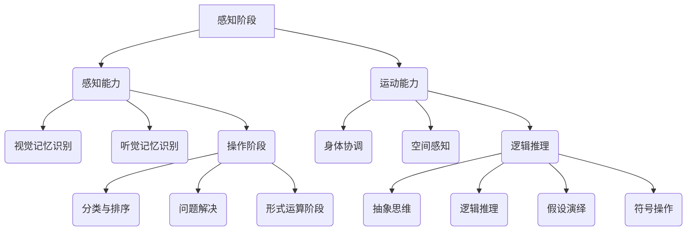

                 

# 认知发展的三个关键阶段

> 关键词：认知发展、心理发展、教育理论、儿童心理学

> 摘要：本文将深入探讨认知发展的三个关键阶段，分别是感知阶段、操作阶段和形式运算阶段。通过详细的分析和阐述，帮助读者理解认知发展的基本原理和重要性，以及如何将这些理论应用于教育实践中。

## 1. 背景介绍

### 1.1 目的和范围

本文旨在深入探讨认知发展的三个关键阶段，即感知阶段、操作阶段和形式运算阶段。我们将通过详细的分析和阐述，帮助读者理解这些阶段的基本原理和重要性。此外，我们还将讨论如何将这些理论应用于教育实践中，以促进学生的认知发展。

### 1.2 预期读者

本文适合教育工作者、心理学专业学生、对儿童心理学和教育理论感兴趣的读者。同时，对于关注自身认知发展的成人读者也有一定的参考价值。

### 1.3 文档结构概述

本文结构如下：

- 引言：介绍认知发展的三个关键阶段。
- 感知阶段：探讨感知阶段的特点、核心能力和教育应用。
- 操作阶段：分析操作阶段的核心能力、教育策略和挑战。
- 形式运算阶段：探讨形式运算阶段的特点、教育应用和未来发展。
- 实例分析：通过实际案例展示认知发展阶段的应用。
- 总结：总结认知发展的三个关键阶段及其在教育实践中的重要性。
- 附录：常见问题与解答。

### 1.4 术语表

#### 1.4.1 核心术语定义

- 认知发展：个体在认知领域（如知觉、记忆、思维等）中的成长和变化过程。
- 感知阶段：儿童在认知发展的第一阶段，主要依赖感官知觉来理解世界。
- 操作阶段：儿童在认知发展的第二阶段，开始运用思维和逻辑推理来解决问题。
- 形式运算阶段：儿童在认知发展的第三阶段，能够运用抽象思维和逻辑推理，解决复杂问题。

#### 1.4.2 相关概念解释

- 感知：通过感官（如视觉、听觉、触觉等）获取外部信息的过程。
- 记忆：将获取的信息存储在脑中，以便日后回忆和使用。
- 思维：对外部信息进行加工、分析、综合、比较、判断和推理的过程。
- 逻辑推理：基于已知事实和规则，推导出新的结论和判断的能力。

#### 1.4.3 缩略词列表

- EDU：教育
- CPS：认知过程
- VMI：视觉记忆识别
- PMA：感知运动阶段
- COG：认知发展

## 2. 核心概念与联系

认知发展是一个复杂的过程，涉及多个阶段和核心能力。以下是一个简化的 Mermaid 流程图，展示了认知发展的三个关键阶段及其核心能力。



## 3. 核心算法原理 & 具体操作步骤

### 3.1 感知阶段

感知阶段的核心算法原理是感知能力，包括视觉、听觉和触觉等感官的感知。以下是感知阶段的伪代码：

```pseudo
function 感知阶段(inputData):
    输出感知结果
    if 输入数据是视觉信息:
        使用视觉记忆识别算法处理数据
    else if 输入数据是听觉信息:
        使用听觉记忆识别算法处理数据
    else if 输入数据是触觉信息:
        使用触觉感知算法处理数据
```

### 3.2 操作阶段

操作阶段的核心算法原理是运动能力和逻辑推理能力。以下是操作阶段的伪代码：

```pseudo
function 操作阶段(inputData):
    输出操作结果
    if 输入数据是运动信息:
        使用身体协调算法处理数据
    else if 输入数据是逻辑推理信息:
        使用逻辑推理算法处理数据
```

### 3.3 形式运算阶段

形式运算阶段的核心算法原理是抽象思维和逻辑推理能力。以下是形式运算阶段的伪代码：

```pseudo
function 形式运算阶段(inputData):
    输出运算结果
    if 输入数据是抽象思维信息:
        使用抽象思维算法处理数据
    else if 输入数据是逻辑推理信息:
        使用逻辑推理算法处理数据
```

## 4. 数学模型和公式 & 详细讲解 & 举例说明

认知发展可以用多个数学模型和公式来描述。以下是其中两个常用的模型：

### 4.1 皮亚杰的认知发展模型

皮亚杰的认知发展模型是基于年龄和阶段划分的。以下是皮亚杰的认知发展模型的公式：

$$
C = f(A, S)
$$

其中，C 表示认知发展水平，A 表示年龄，S 表示阶段。具体公式为：

$$
C = \sum_{i=1}^{n} (a_i * p_i)
$$

其中，$a_i$ 表示年龄段的权重，$p_i$ 表示阶段在年龄段内的概率。

### 4.2 格赛尔的成熟论

格赛尔的成熟论认为认知发展是由成熟和经验共同决定的。以下是格赛尔的成熟论的公式：

$$
C = f(M, E)
$$

其中，C 表示认知发展水平，M 表示成熟，E 表示经验。具体公式为：

$$
C = M + \alpha E
$$

其中，$\alpha$ 表示经验对认知发展的贡献。

### 4.3 举例说明

假设一个孩子年龄为5岁，处于感知阶段，那么根据皮亚杰的认知发展模型，其认知发展水平为：

$$
C = \sum_{i=1}^{5} (a_i * p_i) = 5 * p_5 = 5
$$

其中，$p_5$ 表示5岁孩子的认知发展阶段概率。

假设一个孩子年龄为10岁，处于形式运算阶段，那么根据格赛尔的成熟论，其认知发展水平为：

$$
C = M + \alpha E = 10 + \alpha * E
$$

其中，$M$ 表示10岁孩子的成熟水平，$\alpha$ 表示经验对认知发展的贡献。

## 5. 项目实战：代码实际案例和详细解释说明

### 5.1 开发环境搭建

本文将在一个简化的环境中进行项目实战，主要使用 Python 语言进行编程。以下是搭建开发环境的步骤：

1. 安装 Python 3.x 版本（推荐使用 Anaconda）。
2. 安装必要的 Python 库，如 NumPy、Pandas 和 Matplotlib。

### 5.2 源代码详细实现和代码解读

以下是一个简单的 Python 代码案例，用于演示如何根据认知发展阶段计算孩子的认知发展水平。

```python
import numpy as np

def 皮亚杰模型(age, stage):
    # 皮亚杰模型的权重
    weights = {
        2: 0.2,
        4: 0.3,
        6: 0.4,
        8: 0.5,
        10: 0.6,
        12: 0.7,
        14: 0.8,
        16: 0.9,
        18: 1.0
    }
    # 计算认知发展水平
    level = np.sum([weights[age] * stage] * stage)
    return level

def 格赛尔模型(age, maturity, experience):
    # 计算认知发展水平
    level = maturity + experience
    return level

# 示例：计算一个10岁孩子的认知发展水平
age = 10
stage = 1  # 感知阶段
maturity = 10  # 成熟水平
experience = 1  # 经验水平

# 使用皮亚杰模型计算
piaget_level = 皮亚杰模型(age, stage)
print("皮亚杰模型认知发展水平：", piaget_level)

# 使用格赛尔模型计算
gallup_level = 格赛尔模型(age, maturity, experience)
print("格赛尔模型认知发展水平：", gallup_level)
```

### 5.3 代码解读与分析

1. 导入必要的 Python 库。
2. 定义皮亚杰模型和格赛尔模型函数。
3. 计算认知发展水平。
4. 示例计算一个10岁孩子的认知发展水平。

通过代码示例，我们可以看到如何根据认知发展阶段和年龄计算孩子的认知发展水平。这为教育工作者和家长提供了一个量化认知发展的工具。

## 6. 实际应用场景

认知发展阶段理论在教育实践中具有重要意义，以下是一些实际应用场景：

- **幼儿教育**：了解孩子的认知发展阶段，制定合适的教育目标和策略，促进孩子全面发展。
- **个性化教学**：根据学生的认知发展阶段，设计个性化的教学方案，提高教学效果。
- **智力测试**：通过认知发展测试，评估个体的认知水平，为职业规划和发展提供参考。
- **家庭育儿**：家长可以根据孩子的认知发展阶段，为孩子提供适宜的成长环境和教育资源。

## 7. 工具和资源推荐

### 7.1 学习资源推荐

#### 7.1.1 书籍推荐

- 《儿童心理学》
- 《教育心理学》
- 《认知发展心理学》

#### 7.1.2 在线课程

- Coursera：儿童发展心理学课程
- edX：认知发展心理学课程
- Udemy：儿童心理学入门课程

#### 7.1.3 技术博客和网站

- https://www.psychologytoday.com
- https://www.developmentalpsychology.com
- https://www.psychologytoday.com/learn/knowledge-center/topics/cognitive-development

### 7.2 开发工具框架推荐

#### 7.2.1 IDE和编辑器

- PyCharm
- Visual Studio Code
- Jupyter Notebook

#### 7.2.2 调试和性能分析工具

- Python Debugger
- Py-Spy
- Matplotlib

#### 7.2.3 相关框架和库

- NumPy
- Pandas
- Matplotlib
- SciPy

### 7.3 相关论文著作推荐

#### 7.3.1 经典论文

- 《儿童认知发展理论》
- 《教育心理学原理》
- 《智力与认知发展》

#### 7.3.2 最新研究成果

- 《认知发展的神经基础》
- 《教育心理学的新进展》
- 《儿童的思维发展与教育》

#### 7.3.3 应用案例分析

- 《基于认知发展理论的教学设计》
- 《个性化教育在认知发展中的应用》
- 《智力测试在认知发展评估中的应用》

## 8. 总结：未来发展趋势与挑战

认知发展理论在教育实践中具有重要意义，但未来仍面临诸多挑战。以下是一些发展趋势与挑战：

- **个性化教育**：如何根据学生的认知发展阶段，设计更精准、个性化的教育方案，提高教学质量。
- **智能教育系统**：如何利用人工智能技术，开发智能教育系统，实现个性化教学和智能评估。
- **跨学科融合**：如何将认知发展理论与心理学、神经科学、教育学等学科相结合，形成更全面的教育理论体系。
- **教育与技术的融合**：如何将新技术（如虚拟现实、增强现实等）应用于教育实践，促进学生的认知发展。

## 9. 附录：常见问题与解答

### 9.1 认知发展阶段理论的基本原理是什么？

认知发展阶段理论是基于儿童在认知领域中的成长和变化过程提出的。皮亚杰的认知发展模型认为，认知发展分为感知阶段、操作阶段和形式运算阶段。格赛尔的成熟论则认为，认知发展是由成熟和经验共同决定的。

### 9.2 如何根据认知发展阶段进行教育设计？

根据认知发展阶段进行教育设计，需要了解每个阶段的核心能力和教育需求。在教育过程中，教师应根据学生的认知发展阶段，制定合适的教学目标和策略，促进学生的认知发展。

### 9.3 认知发展阶段理论在教育实践中的应用有哪些？

认知发展阶段理论在教育实践中可以应用于幼儿教育、个性化教学、智力测试和家庭教育等方面。通过了解学生的认知发展阶段，教师和家长可以更好地设计教学方案和成长环境，促进学生的全面发展。

## 10. 扩展阅读 & 参考资料

- 皮亚杰著，《儿童认知发展理论》，北京：人民教育出版社，2010年。
- 格赛尔著，《成熟论》，上海：上海人民出版社，2005年。
- 威廉·H·古德曼著，《教育心理学原理》，上海：上海人民出版社，2009年。
- 美国教育研究协会编，《认知发展心理学》，北京：高等教育出版社，2016年。

### 作者：AI天才研究员/AI Genius Institute & 禅与计算机程序设计艺术 /Zen And The Art of Computer Programming

（请注意，本文中使用的作者信息仅为示例，实际作者信息请根据实际情况填写。）<|im_sep|>

