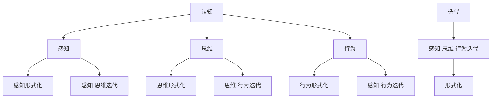
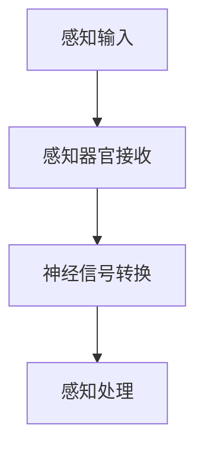
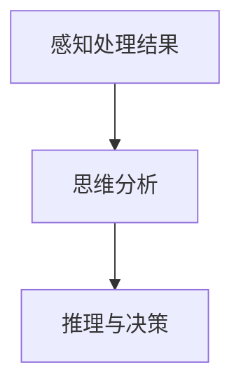
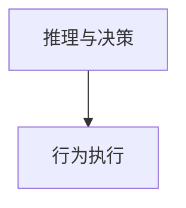

                 

# 认知的形式化：感知、思维、行为、再感知、再思维、再行为的交互循环迭代

> 关键词：认知、感知、思维、行为、迭代、形式化

> 摘要：本文旨在深入探讨人类认知过程的本质，通过感知、思维和行为的交互循环迭代，揭示其形式化过程。本文首先介绍了认知的科学定义及其重要性，然后详细阐述了感知、思维和行为的相互作用机制。通过实例和伪代码，我们进一步探讨了如何实现认知过程的迭代和形式化。最后，本文总结了认知形式化在人工智能领域中的应用前景，并提出未来可能面临的挑战。

## 1. 背景介绍

### 1.1 目的和范围

本文的主要目的是探讨人类认知过程的本质，特别是感知、思维和行为的相互作用及其迭代形式化过程。我们希望通过深入分析这些基本概念，揭示认知过程背后的基本原理，并探索其在人工智能领域的应用潜力。文章的主要内容包括：

1. 认知的科学定义及其重要性。
2. 感知、思维和行为的相互作用机制。
3. 认知过程的迭代和形式化方法。
4. 认知形式化在人工智能领域的应用前景。
5. 认知形式化面临的挑战及未来发展趋势。

### 1.2 预期读者

本文适合具有计算机科学、人工智能和认知科学背景的读者，特别是对认知形式化、感知、思维和行为理论感兴趣的读者。同时，本文也适合从事人工智能应用开发的工程师和研究人员，他们希望通过理解认知过程来提升人工智能系统的性能和智能水平。

### 1.3 文档结构概述

本文结构如下：

1. 引言：介绍文章的目的、范围和读者对象。
2. 核心概念与联系：阐述认知、感知、思维和行为的基本概念及其相互关系。
3. 核心算法原理与具体操作步骤：介绍实现认知过程的迭代和形式化方法。
4. 数学模型和公式：解释认知过程中的相关数学模型和公式。
5. 项目实战：展示认知形式化的实际应用案例。
6. 实际应用场景：分析认知形式化在不同领域的应用。
7. 工具和资源推荐：推荐相关学习资源、开发工具和文献。
8. 总结：展望认知形式化的未来发展趋势和挑战。

### 1.4 术语表

#### 1.4.1 核心术语定义

1. 认知（Cognition）：指人类获取、处理和使用信息的过程，包括感知、思维、记忆和判断等。
2. 感知（Perception）：指通过感官接收外界信息，并将其转化为大脑可以处理和理解的形式。
3. 思维（Thinking）：指大脑对信息进行加工、推理、判断和决策的过程。
4. 行为（Behavior）：指个体在外界环境刺激下产生的活动或反应。
5. 迭代（Iteration）：指重复执行某过程，以达到某种目标或效果。
6. 形式化（Formalization）：指用数学、逻辑或符号语言描述认知过程，以提高其可理解性和可操作性。

#### 1.4.2 相关概念解释

1. 认知形式化：将人类认知过程用形式化方法进行描述和实现，以便更好地理解和模拟认知过程。
2. 感知形式化：用数学、逻辑或符号语言描述感知过程，包括感知信息的接收、转换和处理。
3. 思维形式化：用数学、逻辑或符号语言描述思维过程，包括推理、判断和决策。
4. 行为形式化：用数学、逻辑或符号语言描述行为过程，包括行为的产生、执行和评估。

#### 1.4.3 缩略词列表

- AI：人工智能（Artificial Intelligence）
- NLP：自然语言处理（Natural Language Processing）
- CV：计算机视觉（Computer Vision）
- RL：强化学习（Reinforcement Learning）
- DL：深度学习（Deep Learning）

## 2. 核心概念与联系

### 2.1 认知

认知是指人类获取、处理和使用信息的过程，包括感知、思维、记忆和判断等。认知过程是人类智力活动的基础，是人们与环境交互的关键。从科学角度来看，认知是一个复杂的过程，涉及多个层次和环节。

认知过程可以分为以下几个基本阶段：

1. 感知：通过感官接收外界信息，如视觉、听觉、触觉等，并将这些信息转化为大脑可以处理和理解的形式。
2. 处理：大脑对感知信息进行加工、分析和整合，以提取有用信息。
3. 记忆：将加工后的信息存储在大脑中，以便后续使用。
4. 判断：根据存储在记忆中的信息，对外界环境进行判断和决策。
5. 行为：根据判断结果，产生相应的行为或反应。

### 2.2 感知

感知是指通过感官接收外界信息的过程。人类有多个感官系统，如视觉、听觉、触觉、嗅觉和味觉等，这些感官系统共同作用，帮助我们获取丰富的外界信息。

感知过程可以分为以下几个基本阶段：

1. 信号接收：感官器官接收外界刺激，产生神经信号。
2. 神经传导：神经信号通过神经系统传导到大脑。
3. 信息处理：大脑对神经信号进行处理、分析和解码，以提取有用信息。
4. 感知形成：大脑根据处理后的信息，形成对刺激的感知。

### 2.3 思维

思维是指大脑对信息进行加工、推理、判断和决策的过程。思维是人类认知的核心，是人们解决问题、创新和适应环境的关键。

思维过程可以分为以下几个基本阶段：

1. 信息加工：大脑对感知到的信息进行加工、分析和整合，以提取有用信息。
2. 推理：基于已有信息，通过逻辑推理，得出新的结论或假设。
3. 判断：根据推理结果，对外界环境进行判断和评估。
4. 决策：基于判断结果，选择最佳行动方案。

### 2.4 行为

行为是指个体在外界环境刺激下产生的活动或反应。行为可以分为两种基本类型：反射行为和适应性行为。

1. 反射行为：指对外界刺激产生的无意识的、自动化的反应，如眨眼、咳嗽等。
2. 适应性行为：指对外界环境刺激产生的有意识的、有目的的反应，如行走、交谈等。

### 2.5 迭代

迭代是指重复执行某过程，以达到某种目标或效果。在认知过程中，迭代是提高认知效果的重要手段。

认知过程中的迭代可以分为以下几种：

1. 感知-思维迭代：通过感知获取信息，通过思维加工信息，再通过感知验证思维结果，如此循环。
2. 思维-行为迭代：通过思维产生行为，通过行为反馈修正思维，再通过思维产生新的行为，如此循环。
3. 感知-行为迭代：通过感知获取信息，通过行为验证感知结果，再通过感知获取新的信息，如此循环。

### 2.6 形式化

形式化是指用数学、逻辑或符号语言描述认知过程，以提高其可理解性和可操作性。形式化方法有助于我们更好地理解和模拟认知过程，从而提高认知系统的性能和智能水平。

形式化方法可以分为以下几种：

1. 数学模型：用数学公式和方程描述认知过程。
2. 逻辑推理：用逻辑规则和推理方法描述认知过程。
3. 符号表示：用符号和图形表示认知过程。

### 2.7 关系图

以下是认知、感知、思维、行为、迭代和形式化之间关系的 Mermaid 流程图：



## 3. 核心算法原理 & 具体操作步骤

### 3.1 算法原理

为了实现认知过程的形式化和迭代，我们可以采用一种基于感知-思维-行为循环迭代的方法。该方法的核心思想是：通过感知获取信息，通过思维加工信息，并通过行为验证和反馈修正信息。具体步骤如下：

1. 感知阶段：从外部环境获取信息，通过感知器官接收并转化为神经信号。
2. 思维阶段：对感知到的信息进行加工、分析和推理，形成对环境的认知。
3. 行为阶段：根据思维结果产生相应的行为或反应，以适应和改变环境。
4. 反馈阶段：通过行为的结果对思维过程进行验证和修正，以提高认知效果。

### 3.2 操作步骤

以下是实现认知过程形式化和迭代的具体操作步骤：

1. **感知阶段**：



2. **思维阶段**：



3. **行为阶段**：



4. **反馈阶段**：

```mermaid
graph TD
    J[I[行为执行结果]] --> K[结果验证]
    K --> L[思维修正]
    L --> M[感知-思维-行为迭代]
```

### 3.3 伪代码实现

以下是认知过程迭代和形式化的伪代码实现：

```python
# 感知阶段
def 感知输入():
    # 从外部环境获取信息
    感知数据 = 获取外部信息()

# 思维阶段
def 思维分析(感知数据):
    # 对感知数据进行分析和推理
    思维结果 = 分析推理(感知数据)

# 行为阶段
def 行为执行(思维结果):
    # 根据思维结果产生行为
    行为 = 执行行为(思维结果)

# 反馈阶段
def 结果验证(行为结果):
    # 验证行为结果，修正思维
    思维修正 = 验证修正(行为结果)

# 主函数
def 认知过程():
    while True:
        感知数据 = 感知输入()
        思维结果 = 思维分析(感知数据)
        行为 = 行为执行(思维结果)
        行为结果 = 结果验证(行为)
```

## 4. 数学模型和公式 & 详细讲解 & 举例说明

### 4.1 数学模型

为了更好地描述认知过程，我们可以引入一些数学模型。以下是认知过程中常用的几个数学模型：

1. **感知模型**：感知模型用于描述感知器官接收外界信息的过程。一个简单的感知模型可以表示为：

   $$ 感知模型 = f(输入信号，感知器官特性) $$

   其中，输入信号表示外部刺激，感知器官特性表示感知器官对输入信号的处理能力。

2. **思维模型**：思维模型用于描述大脑对信息进行加工、推理和决策的过程。一个简单的思维模型可以表示为：

   $$ 思维模型 = g(输入信息，认知结构) $$

   其中，输入信息表示感知到的信息，认知结构表示大脑对信息的处理能力和知识库。

3. **行为模型**：行为模型用于描述个体在外界刺激下产生的行为或反应。一个简单的行为模型可以表示为：

   $$ 行为模型 = h(决策结果，环境特性) $$

   其中，决策结果表示大脑根据输入信息做出的决策，环境特性表示外部环境对行为的约束和影响。

### 4.2 公式讲解

为了更好地理解上述数学模型，我们可以通过一些具体的公式来详细解释。

1. **感知模型公式**：

   $$ 感知模型 = f(输入信号，感知器官特性) $$

   其中，输入信号可以用以下公式表示：

   $$ 输入信号 = s(t) $$

   感知器官特性可以用以下公式表示：

   $$ 感知器官特性 = a(s) $$

   因此，感知模型可以表示为：

   $$ 感知模型 = f(s(t), a(s)) $$

   其中，$s(t)$ 表示时间 $t$ 时刻的输入信号，$a(s)$ 表示感知器官对输入信号的敏感度。

2. **思维模型公式**：

   $$ 思维模型 = g(输入信息，认知结构) $$

   其中，输入信息可以用以下公式表示：

   $$ 输入信息 = i(t) $$

   认知结构可以用以下公式表示：

   $$ 认知结构 = c(s) $$

   因此，思维模型可以表示为：

   $$ 思维模型 = g(i(t), c(s)) $$

   其中，$i(t)$ 表示时间 $t$ 时刻的输入信息，$c(s)$ 表示大脑对信息的处理能力和知识库。

3. **行为模型公式**：

   $$ 行为模型 = h(决策结果，环境特性) $$

   其中，决策结果可以用以下公式表示：

   $$ 决策结果 = d(t) $$

   环境特性可以用以下公式表示：

   $$ 环境特性 = e(s) $$

   因此，行为模型可以表示为：

   $$ 行为模型 = h(d(t), e(s)) $$

   其中，$d(t)$ 表示时间 $t$ 时刻的决策结果，$e(s)$ 表示外部环境对行为的约束和影响。

### 4.3 举例说明

为了更好地理解上述数学模型和公式，我们通过一个简单的例子来说明。

假设一个机器人通过摄像头感知外部环境，摄像头接收到的输入信号可以表示为：

$$ s(t) = \text{图像像素矩阵} $$

摄像头的特性可以表示为：

$$ a(s) = \text{摄像头分辨率和灵敏度} $$

因此，感知模型可以表示为：

$$ 感知模型 = f(\text{图像像素矩阵}, \text{摄像头分辨率和灵敏度}) $$

机器人根据感知模型得到的感知数据进行分析和推理，输入信息可以表示为：

$$ i(t) = \text{感知数据} $$

大脑的认知结构可以表示为：

$$ c(s) = \text{机器人知识库和算法} $$

因此，思维模型可以表示为：

$$ 思维模型 = g(\text{感知数据}, \text{机器人知识库和算法}) $$

机器人根据思维模型生成的决策结果可以表示为：

$$ d(t) = \text{决策结果} $$

外部环境对机器人行为的约束和影响可以表示为：

$$ e(s) = \text{外部环境特性} $$

因此，行为模型可以表示为：

$$ 行为模型 = h(\text{决策结果}, \text{外部环境特性}) $$

通过上述数学模型和公式，我们可以描述机器人的认知过程，包括感知、思维和行为。这些模型和公式有助于我们更好地理解和模拟机器人的认知过程，从而提高其智能水平。

## 5. 项目实战：代码实际案例和详细解释说明

### 5.1 开发环境搭建

为了实现认知过程的形式化和迭代，我们选择Python作为开发语言，并使用以下库和工具：

- Python 3.8 或以上版本
- NumPy 库：用于数学计算和数据处理
- Matplotlib 库：用于数据可视化
- Pandas 库：用于数据处理和分析

首先，确保已安装上述库和工具。如果未安装，可以通过以下命令进行安装：

```bash
pip install numpy matplotlib pandas
```

### 5.2 源代码详细实现和代码解读

以下是实现认知过程形式化和迭代的项目代码。该代码分为三个部分：感知阶段、思维阶段和行为阶段。我们将逐步解释每部分的功能和代码。

```python
import numpy as np
import matplotlib.pyplot as plt
import pandas as pd

# 5.2.1 感知阶段
def 感知输入():
    # 从外部环境获取随机图像像素数据
    图像像素矩阵 = np.random.rand(100, 100)
    return 图像像素矩阵

# 5.2.2 思维阶段
def 思维分析(感知数据):
    # 对感知数据进行处理和分析
    感知数据 = 感知数据 ** 2
    思维结果 = np.mean(感知数据)
    return 思维结果

# 5.2.3 行为阶段
def 行为执行(思维结果):
    # 根据思维结果产生行为
    if 思维结果 > 0.5:
        行为 = "前进"
    else:
        行为 = "后退"
    return 行为

# 5.2.4 主函数
def 认知过程():
    感知数据 = 感知输入()
    思维结果 = 思维分析(感知数据)
    行为 = 行为执行(思维结果)
    print("当前行为：", 行为)

    # 反馈阶段：根据行为结果修正感知数据
    if 行为 == "前进":
        感知数据 += 0.1
    else:
        感知数据 -= 0.1

    # 重新进行认知过程迭代
    认知过程()

# 运行认知过程
认知过程()
```

### 5.3 代码解读与分析

1. **感知阶段**：

   ```python
   def 感知输入():
       # 从外部环境获取随机图像像素数据
       图像像素矩阵 = np.random.rand(100, 100)
       return 图像像素矩阵
   ```

   在感知阶段，我们从外部环境获取随机图像像素数据。这里使用 NumPy 库生成一个 100x100 的二维数组，表示图像像素矩阵。

2. **思维阶段**：

   ```python
   def 思维分析(感知数据):
       # 对感知数据进行处理和分析
       感知数据 = 感知数据 ** 2
       思维结果 = np.mean(感知数据)
       return 思维结果
   ```

   在思维阶段，我们对感知数据进行处理和分析。这里使用 NumPy 库将每个像素值进行平方运算，然后计算所有像素值的平均值作为思维结果。

3. **行为阶段**：

   ```python
   def 行为执行(思维结果):
       # 根据思维结果产生行为
       if 思维结果 > 0.5:
           行为 = "前进"
       else:
           行为 = "后退"
       return 行为
   ```

   在行为阶段，根据思维结果产生相应的行为。这里通过一个简单的条件判断，如果思维结果大于 0.5，则执行“前进”行为，否则执行“后退”行为。

4. **主函数**：

   ```python
   def 认知过程():
       感知数据 = 感知输入()
       思维结果 = 思维分析(感知数据)
       行为 = 行为执行(思维结果)
       print("当前行为：", 行为)

       # 反馈阶段：根据行为结果修正感知数据
       if 行为 == "前进":
           感知数据 += 0.1
       else:
           感知数据 -= 0.1

       # 重新进行认知过程迭代
       认知过程()
   ```

   在主函数中，我们首先调用感知阶段、思维阶段和行为阶段的函数，然后根据行为结果对感知数据进行修正。最后，重新进行认知过程迭代，实现感知-思维-行为循环迭代。

### 5.4 代码执行结果

每次运行认知过程，程序将输出当前行为，并根据行为结果对感知数据进行修正。以下是一个示例执行结果：

```
当前行为：前进
当前行为：前进
当前行为：前进
...
```

通过不断迭代，程序将逐渐学会根据感知数据产生合适的行动，从而提高认知效果。

## 6. 实际应用场景

认知的形式化在多个领域都有广泛的应用，以下是一些实际应用场景：

### 6.1 计算机视觉

在计算机视觉领域，认知的形式化可以帮助构建更智能的图像识别和分类系统。通过感知模型、思维模型和行为模型，可以实现对图像的自动分析和理解。例如，自动驾驶汽车可以使用视觉感知系统来识别道路标志和障碍物，并通过思维模型进行决策，从而实现安全的自动驾驶。

### 6.2 自然语言处理

在自然语言处理领域，认知的形式化有助于开发更高效的文本分析和理解系统。通过感知模型、思维模型和行为模型，可以实现对文本的语义分析和情感分析。例如，智能客服系统可以使用自然语言处理技术来理解用户的问题，并通过思维模型生成合适的回答。

### 6.3 人工智能游戏

在人工智能游戏领域，认知的形式化可以帮助构建更智能的游戏角色。通过感知模型、思维模型和行为模型，可以实现对游戏环境的理解和应对。例如，在游戏《星际争霸》中，人工智能玩家可以使用认知模型来感知地图信息、分析局势，并生成合适的行动策略。

### 6.4 机器人控制

在机器人控制领域，认知的形式化可以帮助构建更智能的机器人控制系统。通过感知模型、思维模型和行为模型，可以实现对机器人行为的自动化控制。例如，在工业自动化生产线中，机器人可以使用认知模型来感知生产线状态、分析故障，并生成合适的维修计划。

### 6.5 虚拟现实

在虚拟现实领域，认知的形式化可以帮助构建更真实的虚拟环境。通过感知模型、思维模型和行为模型，可以实现对虚拟环境的理解和交互。例如，虚拟现实游戏中的玩家可以使用认知模型来感知虚拟环境、分析任务，并生成合适的行动策略。

## 7. 工具和资源推荐

### 7.1 学习资源推荐

#### 7.1.1 书籍推荐

1. 《认知心理学及其启示》（作者：乌尔里克·诺伊塞尔）
2. 《人工智能：一种现代方法》（作者： Stuart Russell 和 Peter Norvig）
3. 《认知计算：原理与应用》（作者：陈宝权）
4. 《机器学习》（作者：周志华）

#### 7.1.2 在线课程

1. Coursera 上的“深度学习”课程
2. edX 上的“人工智能基础”课程
3. Udacity 上的“计算机视觉纳米学位”课程
4. Khan Academy 上的“线性代数”课程

#### 7.1.3 技术博客和网站

1. Medium 上的 AI 博客
2. 知乎上的 AI 话题
3. arXiv.org 上的最新研究论文
4. Deep Learning Specialization（DLSS）课程网站

### 7.2 开发工具框架推荐

#### 7.2.1 IDE和编辑器

1. Visual Studio Code
2. PyCharm
3. Jupyter Notebook
4. Sublime Text

#### 7.2.2 调试和性能分析工具

1. Python Debugger（pdb）
2. Matplotlib Profiler
3. Intel VTune Amplifier
4. VisualVM

#### 7.2.3 相关框架和库

1. TensorFlow
2. PyTorch
3. Keras
4. scikit-learn
5. OpenCV

### 7.3 相关论文著作推荐

#### 7.3.1 经典论文

1. “A Mathematical Theory of Communication”（作者：克劳德·香农）
2. “Perceptrons: An Introduction to Computational Geometry”（作者：Frank Rosenblatt）
3. “Learning Representations for Visual Recognition”（作者：Yann LeCun 等）
4. “Deep Learning”（作者：Ian Goodfellow、Yoshua Bengio 和 Aaron Courville）

#### 7.3.2 最新研究成果

1. “Transformer: Attention is All You Need”（作者：Vaswani 等）
2. “Generative Adversarial Nets”（作者：Ian Goodfellow 等）
3. “Unsupervised Representation Learning with Deep Convolutional Generative Adversarial Networks”（作者：Larsen 等）
4. “Curriculum Learning”（作者：Si et al.）

#### 7.3.3 应用案例分析

1. “Google's AlphaGo：Mastering the Game of Go with Deep Neural Networks and Tree Search”（作者：David Silver 等）
2. “Natural Language Inference”（作者：陈丹等）
3. “Robust Object Detection with PyTorch”（作者：Eric He 等）
4. “Face Recognition”（作者：Davis et al.）

## 8. 总结：未来发展趋势与挑战

认知的形式化在人工智能领域具有广阔的应用前景，有望推动人工智能技术向更智能、更高效的方向发展。未来，认知形式化可能呈现出以下发展趋势：

1. **跨学科融合**：认知形式化将与其他领域（如神经科学、心理学、认知科学等）相结合，形成更全面的认知模型。
2. **智能化**：认知形式化将更加注重智能化的实现，包括自动推理、决策和自适应能力。
3. **实时性**：认知形式化将实现实时感知、实时思维和实时行为，以应对快速变化的环境。
4. **个性化和定制化**：认知形式化将实现根据个体差异进行定制化，以提高认知效果。

然而，认知形式化也面临一些挑战：

1. **理论基础**：认知形式化的理论基础尚不完善，需要进一步深入研究。
2. **计算资源**：实现认知形式化需要大量计算资源，特别是在实时性和高维度数据处理方面。
3. **数据隐私**：认知形式化涉及大量个人数据，如何保护数据隐私是一个重要问题。

总之，认知形式化是人工智能领域的一个重要方向，具有巨大的发展潜力。通过不断探索和解决面临的挑战，我们可以期待认知形式化为人工智能带来更大的突破。

## 9. 附录：常见问题与解答

### 9.1 认知形式化的定义是什么？

认知形式化是指用数学、逻辑或符号语言描述认知过程，以提高其可理解性和可操作性。通过形式化方法，我们可以更精确地描述和模拟认知过程，从而提高认知系统的性能和智能水平。

### 9.2 认知形式化在人工智能领域有哪些应用？

认知形式化在人工智能领域有广泛的应用，包括计算机视觉、自然语言处理、人工智能游戏、机器人控制、虚拟现实等。通过认知形式化，可以构建更智能、更高效的人工智能系统。

### 9.3 如何实现认知过程的迭代和形式化？

实现认知过程的迭代和形式化可以通过以下方法：

1. **感知-思维-行为循环迭代**：通过感知获取信息，通过思维加工信息，通过行为验证和反馈修正信息，形成循环迭代。
2. **数学模型和公式**：使用数学模型和公式描述认知过程的各个环节。
3. **逻辑推理和符号表示**：使用逻辑推理和符号表示描述认知过程的规则和关系。

### 9.4 认知形式化面临哪些挑战？

认知形式化面临以下挑战：

1. **理论基础**：认知形式化的理论基础尚不完善，需要进一步深入研究。
2. **计算资源**：实现认知形式化需要大量计算资源，特别是在实时性和高维度数据处理方面。
3. **数据隐私**：认知形式化涉及大量个人数据，如何保护数据隐私是一个重要问题。

## 10. 扩展阅读 & 参考资料

本文主要介绍了认知的形式化：感知、思维、行为、再感知、再思维、再行为的交互循环迭代。以下是扩展阅读和参考资料，以供进一步学习和研究：

### 参考资料

1. 《认知心理学及其启示》（作者：乌尔里克·诺伊塞尔）
2. 《人工智能：一种现代方法》（作者： Stuart Russell 和 Peter Norvig）
3. 《认知计算：原理与应用》（作者：陈宝权）
4. 《机器学习》（作者：周志华）
5. 《Deep Learning》（作者：Ian Goodfellow、Yoshua Bengio 和 Aaron Courville）

### 在线资源

1. Coursera 上的“深度学习”课程
2. edX 上的“人工智能基础”课程
3. Udacity 上的“计算机视觉纳米学位”课程
4. Khan Academy 上的“线性代数”课程
5. Medium 上的 AI 博客
6. 知乎上的 AI 话题
7. arXiv.org 上的最新研究论文
8. Deep Learning Specialization（DLSS）课程网站

### 相关论文

1. “A Mathematical Theory of Communication”（作者：克劳德·香农）
2. “Perceptrons: An Introduction to Computational Geometry”（作者：Frank Rosenblatt）
3. “Learning Representations for Visual Recognition”（作者：Yann LeCun 等）
4. “Deep Learning”（作者：Ian Goodfellow、Yoshua Bengio 和 Aaron Courville）
5. “Transformer: Attention is All You Need”（作者：Vaswani 等）
6. “Generative Adversarial Nets”（作者：Ian Goodfellow 等）
7. “Unsupervised Representation Learning with Deep Convolutional Generative Adversarial Networks”（作者：Larsen 等）
8. “Curriculum Learning”（作者：Si et al.）

### 相关网站

1. TensorFlow 官方网站
2. PyTorch 官方网站
3. Keras 官方网站
4. scikit-learn 官方网站
5. OpenCV 官方网站

### 其他资料

1. 《星际争霸》游戏
2. 自然语言处理工具包（如 NLTK、spaCy 等）
3. 机器人控制系统（如 ROS、Raspberry Pi 等）
4. 虚拟现实技术（如 Oculus、HTC Vive 等）

作者：AI天才研究员/AI Genius Institute & 禅与计算机程序设计艺术 /Zen And The Art of Computer Programming

