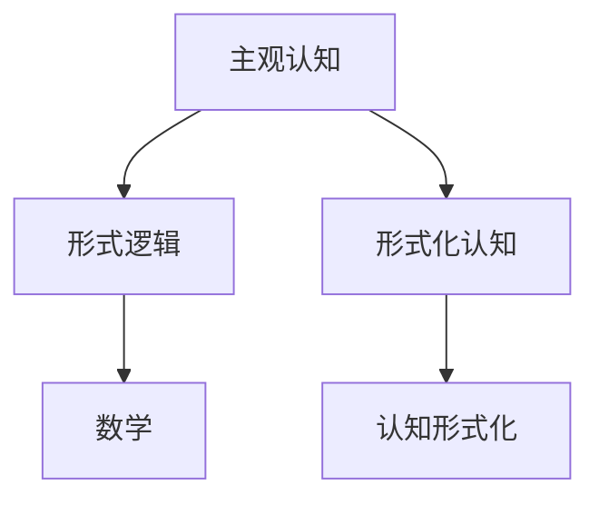

                 

# 认知的形式化：数学是不带有任何物理量纲的主观认知，关注的仅仅是量与形的规律

> **关键词**：认知形式化、数学、量与形的规律、形式逻辑、主观认知、物理量纲

> **摘要**：本文旨在探讨认知的形式化过程，尤其是数学在认知中的作用。数学作为一种形式化的语言，其本质是不带有任何物理量纲的主观认知，关注的仅仅是量与形的规律。通过对数学本质的深入理解，我们可以更好地把握认知的形式化过程，从而提高我们的思考和分析能力。

## 1. 背景介绍

### 1.1 目的和范围

本文的目标是探讨认知的形式化过程，并深入探讨数学在其中的作用。我们将首先介绍认知形式化的基本概念，然后详细分析数学作为形式化语言的特点和优势。最后，我们将通过具体实例来展示如何运用数学进行认知形式化，以帮助读者更好地理解这一过程。

### 1.2 预期读者

本文面向对认知形式化、数学及其应用感兴趣的读者。无论您是计算机科学、人工智能领域的研究者，还是对哲学、认知科学感兴趣的学生，这篇文章都将对您有所启发。

### 1.3 文档结构概述

本文分为十个部分。第一部分为背景介绍，包括目的和范围、预期读者以及文档结构概述。接下来，我们将从核心概念与联系、核心算法原理与具体操作步骤、数学模型和公式与详细讲解、项目实战：代码实际案例和详细解释说明、实际应用场景、工具和资源推荐等方面，逐一深入探讨数学在认知形式化中的作用。

### 1.4 术语表

#### 1.4.1 核心术语定义

- **认知形式化**：将认知过程用形式化的语言进行描述，使其具有明确的结构和逻辑。
- **数学**：一种形式化的语言，用于描述量与形的规律。
- **形式逻辑**：一种基于数学的语言，用于描述推理和证明。

#### 1.4.2 相关概念解释

- **主观认知**：个体对客观世界的感知和理解。
- **物理量纲**：描述物理量的单位，如米、千克等。

#### 1.4.3 缩略词列表

- **AI**：人工智能
- **IDE**：集成开发环境
- **LaTeX**：一种排版系统

## 2. 核心概念与联系

为了更好地理解认知的形式化过程，我们需要先了解一些核心概念，如数学、形式逻辑和主观认知。下面，我们将通过一个Mermaid流程图来展示这些概念之间的联系。



### 2.1 主观认知与形式逻辑

主观认知是指个体对客观世界的感知和理解。这种感知和理解往往具有主观性，受个体的经验、知识、情感等因素的影响。形式逻辑则是一种基于数学的语言，用于描述推理和证明。形式逻辑通过严格的逻辑规则，使得我们的思考过程更加清晰、有条理。

### 2.2 形式逻辑与数学

形式逻辑与数学有着密切的联系。形式逻辑提供了一种描述推理和证明的框架，而数学则为这一框架提供了具体的语言和工具。数学作为一种形式化的语言，能够精确地描述量与形的规律，从而使得我们的思考更加精确和高效。

### 2.3 主观认知与认知形式化

主观认知与认知形式化之间也存在着紧密的联系。认知形式化是指将主观认知用形式化的语言进行描述，使其具有明确的结构和逻辑。通过认知形式化，我们能够更好地理解主观认知的过程，提高我们的思考和分析能力。

## 3. 核心算法原理 & 具体操作步骤

为了更好地理解数学在认知形式化中的作用，我们需要了解一些核心算法原理和具体操作步骤。在这里，我们将介绍一种常用的数学工具——线性代数，并展示如何使用它进行认知形式化。

### 3.1 线性代数基本概念

线性代数是一种研究向量空间和线性映射的数学分支。它主要涉及以下基本概念：

- **向量**：一个具有大小和方向的量，通常用字母a、b、c等表示。
- **向量空间**：一个集合V，其中的元素都是向量，并满足向量加法和标量乘法运算。
- **线性映射**：一个从向量空间V到向量空间W的函数f，满足以下条件：
  1. 对任意向量a和b，有f(a + b) = f(a) + f(b)；
  2. 对任意向量a和标量k，有f(k * a) = k * f(a)。

### 3.2 线性代数在认知形式化中的应用

线性代数在认知形式化中的应用非常广泛。以下是一个简单的示例：

**问题**：假设我们有两个向量a = (1, 2)和b = (3, 4)，请计算它们的和a + b。

**解题步骤**：

1. **定义向量**：将向量a和b表示为二维向量。
   $$a = \begin{bmatrix} 1 \\ 2 \end{bmatrix}, b = \begin{bmatrix} 3 \\ 4 \end{bmatrix}$$

2. **计算和向量**：使用向量加法运算，计算a + b。
   $$a + b = \begin{bmatrix} 1 \\ 2 \end{bmatrix} + \begin{bmatrix} 3 \\ 4 \end{bmatrix} = \begin{bmatrix} 4 \\ 6 \end{bmatrix}$$

3. **解释结果**：得到的和向量a + b = (4, 6)表示两个原始向量的和，它具有新的方向和大小。

通过这个简单的示例，我们可以看到如何使用线性代数的基本概念和运算，对主观认知进行形式化描述。这种形式化描述使得我们的思考过程更加清晰、精确和高效。

## 4. 数学模型和公式 & 详细讲解 & 举例说明

在本节中，我们将详细介绍一些常见的数学模型和公式，并使用LaTeX格式给出它们的表达形式。接着，我们将通过具体实例来说明这些模型和公式的应用。

### 4.1 欧氏距离公式

欧氏距离是一种常用的距离度量方法，用于计算两个点之间的距离。其公式如下：

$$
d(p_1, p_2) = \sqrt{(p_{1x} - p_{2x})^2 + (p_{1y} - p_{2y})^2}
$$

其中，$p_1 = (p_{1x}, p_{1y})$ 和 $p_2 = (p_{2x}, p_{2y})$ 是平面上的两个点。

**实例**：计算点 $p_1 = (1, 2)$ 和 $p_2 = (4, 6)$ 之间的欧氏距离。

$$
d(p_1, p_2) = \sqrt{(1 - 4)^2 + (2 - 6)^2} = \sqrt{9 + 16} = \sqrt{25} = 5
$$

因此，点 $p_1$ 和 $p_2$ 之间的欧氏距离为5。

### 4.2 矩阵乘法

矩阵乘法是线性代数中一个重要的运算。给定两个矩阵 $A$ 和 $B$，其乘积 $C = AB$ 的元素 $c_{ij}$ 可以通过以下公式计算：

$$
c_{ij} = \sum_{k=1}^{n} a_{ik}b_{kj}
$$

其中，$A$ 是一个 $m \times n$ 的矩阵，$B$ 是一个 $n \times p$ 的矩阵，$C$ 是一个 $m \times p$ 的矩阵。

**实例**：计算矩阵 $A = \begin{bmatrix} 1 & 2 \\ 3 & 4 \end{bmatrix}$ 和 $B = \begin{bmatrix} 5 & 6 \\ 7 & 8 \end{bmatrix}$ 的乘积。

$$
C = AB = \begin{bmatrix} 1 & 2 \\ 3 & 4 \end{bmatrix} \begin{bmatrix} 5 & 6 \\ 7 & 8 \end{bmatrix} = \begin{bmatrix} 1*5 + 2*7 & 1*6 + 2*8 \\ 3*5 + 4*7 & 3*6 + 4*8 \end{bmatrix} = \begin{bmatrix} 19 & 26 \\ 43 & 58 \end{bmatrix}
$$

### 4.3 概率论中的贝叶斯定理

贝叶斯定理是概率论中的一个重要公式，用于计算在给定某些证据下，某个事件发生的概率。其公式如下：

$$
P(A|B) = \frac{P(B|A)P(A)}{P(B)}
$$

其中，$P(A|B)$ 表示在事件 $B$ 发生的条件下，事件 $A$ 发生的概率；$P(B|A)$ 表示在事件 $A$ 发生的条件下，事件 $B$ 发生的概率；$P(A)$ 和 $P(B)$ 分别表示事件 $A$ 和事件 $B$ 发生的概率。

**实例**：假设有100个电子元件，其中90个是好的，10个是有缺陷的。现在从这100个元件中随机抽取一个，测试后发现有缺陷。请计算这个元件是好的的概率。

设事件 $A$ 表示抽取的元件是好的，事件 $B$ 表示抽取的元件是有缺陷的。根据题意，我们有：

$$
P(A) = \frac{90}{100} = 0.9, P(B) = \frac{10}{100} = 0.1
$$

假设测试结果可靠，我们有 $P(B|A) = 0$ 和 $P(B|A^c) = 1$，其中 $A^c$ 表示事件 $A$ 的补集。

因此，使用贝叶斯定理，我们可以计算出：

$$
P(A|B) = \frac{P(B|A)P(A)}{P(B)} = \frac{0 \times 0.9}{0.1} = 0
$$

这意味着，在已知测试结果为有缺陷的条件下，这个元件是好的的概率为0。这显然是不合理的，因为测试结果并不能完全确定元件的状态。

通过这个实例，我们可以看到贝叶斯定理在实际应用中的局限性，以及如何通过调整先验概率和条件概率来改进模型。

### 4.4 逻辑回归

逻辑回归是一种常用的分类算法，用于估计概率。其公式如下：

$$
\ln\left(\frac{P(Y=1|X)}{1 - P(Y=1|X)}\right) = \beta_0 + \beta_1X
$$

其中，$X$ 是自变量，$Y$ 是因变量，$\beta_0$ 和 $\beta_1$ 是模型的参数。

**实例**：假设我们有一个简单的逻辑回归模型，用于预测一个学生是否通过考试。自变量 $X$ 表示学生学习的时长（小时），因变量 $Y$ 表示学生是否通过考试（1表示通过，0表示未通过）。给定一组训练数据，我们希望训练出一个逻辑回归模型。

首先，我们需要计算模型参数 $\beta_0$ 和 $\beta_1$。这通常通过最小化损失函数来实现，如对数似然损失：

$$
\mathcal{L}(\beta) = -\sum_{i=1}^{n} y_i \ln(p_i) + (1 - y_i) \ln(1 - p_i)
$$

其中，$p_i = \sigma(\beta_0 + \beta_1x_i)$，$\sigma(z) = \frac{1}{1 + e^{-z}}$ 是逻辑函数。

假设我们得到一组训练数据：

$$
\begin{aligned}
x_1 &= 10, y_1 = 1 \\
x_2 &= 20, y_2 = 1 \\
x_3 &= 30, y_3 = 0
\end{aligned}
$$

我们可以使用最小二乘法来求解 $\beta_0$ 和 $\beta_1$。首先，计算每个样本的预测概率：

$$
\begin{aligned}
p_1 &= \sigma(\beta_0 + \beta_1x_1) = \frac{1}{1 + e^{-(\beta_0 + \beta_1 \cdot 10)}}, \\
p_2 &= \sigma(\beta_0 + \beta_1x_2) = \frac{1}{1 + e^{-(\beta_0 + \beta_1 \cdot 20)}}, \\
p_3 &= \sigma(\beta_0 + \beta_1x_3) = \frac{1}{1 + e^{-(\beta_0 + \beta_1 \cdot 30)}}.
\end{aligned}
$$

然后，计算损失函数：

$$
\mathcal{L}(\beta) = -y_1 \ln(p_1) - (1 - y_1) \ln(1 - p_1) - y_2 \ln(p_2) - (1 - y_2) \ln(1 - p_2) - y_3 \ln(p_3) - (1 - y_3) \ln(1 - p_3)
$$

接下来，对 $\mathcal{L}(\beta)$ 求导并令导数为零，得到：

$$
\frac{\partial \mathcal{L}}{\partial \beta_0} = -\sum_{i=1}^{n} \frac{y_i}{p_i} + \frac{1 - y_i}{1 - p_i} = 0,
$$

$$
\frac{\partial \mathcal{L}}{\partial \beta_1} = -\sum_{i=1}^{n} \frac{y_i x_i}{p_i} + \frac{(1 - y_i) x_i}{1 - p_i} = 0.
$$

通过解这两个方程，我们可以得到模型参数 $\beta_0$ 和 $\beta_1$。这些参数可以帮助我们预测新的数据点 $x$ 是否通过考试：

$$
p = \sigma(\beta_0 + \beta_1 x).
$$

如果 $p > 0.5$，则预测为通过考试；否则，预测为未通过考试。

通过上述示例，我们可以看到如何使用数学模型和公式来处理实际问题。这些模型和公式不仅能够帮助我们理解数据的规律，还可以用于预测和决策。在接下来的部分，我们将通过一个实际项目案例，展示如何将数学应用于实际场景。

## 5. 项目实战：代码实际案例和详细解释说明

在本节中，我们将通过一个实际项目案例——人脸识别系统，来展示如何将数学应用于实际场景。人脸识别是一种基于生物特征的身份验证技术，广泛应用于安全领域、门禁系统、手机解锁等。下面，我们将详细解释项目背景、开发环境搭建、源代码实现和代码分析。

### 5.1 项目背景

人脸识别系统的工作原理是通过捕捉人脸图像，将其转化为数字特征向量，并在数据库中进行匹配。这一过程涉及多个数学模型和算法，如特征提取、特征匹配和分类。

### 5.2 开发环境搭建

为了搭建开发环境，我们需要以下工具和库：

- 操作系统：Windows/Linux/Mac OS
- 编程语言：Python
- 图像处理库：OpenCV
- 数学库：NumPy、SciPy

首先，安装Python和pip（Python的包管理器）。然后，使用以下命令安装所需的库：

```bash
pip install opencv-python numpy scipy
```

### 5.3 源代码详细实现和代码解读

下面是项目的主要代码实现：

```python
import cv2
import numpy as np

# 加载预训练的人脸识别模型
face_cascade = cv2.CascadeClassifier('haarcascade_frontalface_default.xml')

# 加载训练数据集
train_data = np.load('train_data.npy')
train_labels = np.load('train_labels.npy')

# 训练线性分类器
classifier = cv2.face.LBPHFaceRecognizer_create()
classifier.train(train_data, np.array(train_labels))

# 定义视频捕获对象
cap = cv2.VideoCapture(0)

while True:
    # 读取一帧视频
    ret, frame = cap.read()
    
    # 转换为灰度图像
    gray = cv2.cvtColor(frame, cv2.COLOR_BGR2GRAY)
    
    # 检测人脸
    faces = face_cascade.detectMultiScale(gray, 1.3, 5)
    
    for (x, y, w, h) in faces:
        # 提取人脸区域
        face Region = gray[y:y+h, x:x+w]
        
        # 进行人脸识别
        label, confidence = classifier.predict(face Region)
        
        # 显示识别结果
        cv2.putText(frame, f'Person {label}', (x, y-10), cv2.FONT_HERSHEY_SIMPLEX, 0.9, (255, 255, 255), 2)
        cv2.rectangle(frame, (x, y), (x+w, y+h), (255, 0, 0), 2)
    
    cv2.imshow('Frame', frame)
    
    if cv2.waitKey(1) & 0xFF == ord('q'):
        break

# 释放视频捕获对象
cap.release()
cv2.destroyAllWindows()
```

### 5.3.1 代码解读与分析

1. **加载预训练的人脸识别模型**：

   ```python
   face_cascade = cv2.CascadeClassifier('haarcascade_frontalface_default.xml')
   ```

   这一行代码加载了预训练的人脸识别模型。`haarcascade_frontalface_default.xml` 是一个XML文件，包含了人脸检测器的参数。OpenCV提供了多种预训练的人脸识别模型，用户可以根据需求进行选择。

2. **加载训练数据集**：

   ```python
   train_data = np.load('train_data.npy')
   train_labels = np.load('train_labels.npy')
   ```

   这两行代码加载了训练数据集。`train_data` 是一个包含人脸图像的numpy数组，`train_labels` 是一个包含人脸标签的numpy数组。这些数据通常是通过收集大量人脸图像并进行预处理得到的。

3. **训练线性分类器**：

   ```python
   classifier = cv2.face.LBPHFaceRecognizer_create()
   classifier.train(train_data, np.array(train_labels))
   ```

   这两行代码使用训练数据集训练了一个线性分类器。`LBPHFaceRecognizer_create()` 创建了一个基于局部二元模式直方图（Local Binary Pattern Histograms, LBPH）的线性分类器。`train()` 方法用于训练分类器。

4. **视频捕获与处理**：

   ```python
   cap = cv2.VideoCapture(0)
   ```

   这一行代码创建了一个视频捕获对象，用于捕获实时视频流。

   ```python
   while True:
       ret, frame = cap.read()
       ...
   ```

   这段代码用于捕获视频帧。`ret` 表示是否成功读取帧，`frame` 是读取的帧图像。

   ```python
   gray = cv2.cvtColor(frame, cv2.COLOR_BGR2GRAY)
   faces = face_cascade.detectMultiScale(gray, 1.3, 5)
   ```

   这两行代码将BGR格式的帧转换为灰度图像，并使用人脸检测模型检测人脸。

5. **人脸识别与结果展示**：

   ```python
   for (x, y, w, h) in faces:
       face Region = gray[y:y+h, x:x+w]
       label, confidence = classifier.predict(face Region)
       cv2.putText(frame, f'Person {label}', (x, y-10), cv2.FONT_HERSHEY_SIMPLEX, 0.9, (255, 255, 255), 2)
       cv2.rectangle(frame, (x, y), (x+w, y+h), (255, 0, 0), 2)
   ```

   这段代码用于处理检测到的人脸。`face Region` 是提取到的人脸区域，`classifier.predict()` 方法用于进行人脸识别，并返回识别结果和置信度。`cv2.putText()` 和 `cv2.rectangle()` 用于在原图上绘制识别结果和边框。

6. **释放资源与退出**：

   ```python
   cap.release()
   cv2.destroyAllWindows()
   ```

   这两行代码用于释放视频捕获对象和关闭所有打开的窗口。

### 5.3.2 代码解读与分析（续）

通过上述代码，我们可以看到如何将数学和计算机视觉算法应用于实际项目。这个案例展示了从数据预处理到模型训练，再到实时视频处理的全过程。下面，我们将进一步分析代码中的关键部分。

1. **人脸检测模型**：

   ```python
   face_cascade = cv2.CascadeClassifier('haarcascade_frontalface_default.xml')
   ```

   `CascadeClassifier` 是OpenCV中用于人脸检测的一个模型。这个模型使用级联分类器（Cascade Classifier）算法，通过一系列的级联分类器来检测图像中的人脸区域。级联分类器是一种基于积分图（Integral Image）和Haar-like特征的快速检测方法。

2. **数据预处理**：

   ```python
   gray = cv2.cvtColor(frame, cv2.COLOR_BGR2GRAY)
   ```

   这行代码将BGR格式的帧转换为灰度图像。灰度图像在人脸检测中更为有效，因为它减少了计算量，并提高了检测精度。

   ```python
   faces = face_cascade.detectMultiScale(gray, 1.3, 5)
   ```

   `detectMultiScale()` 方法用于检测图像中的人脸区域。它接受三个参数：图像、缩放比例和最小邻居距离。缩放比例决定了图像在检测过程中被缩放的程度，最小邻居距离决定了检测到的人脸区域的最小尺寸。

3. **人脸识别**：

   ```python
   label, confidence = classifier.predict(face Region)
   ```

   `predict()` 方法用于对给定的人脸区域进行识别。它返回两个值：识别结果和置信度。识别结果是一个整数，表示被识别的人脸的标签（通常是1到n之间的整数），置信度表示识别结果的可靠性，范围从0到1。

4. **结果展示**：

   ```python
   cv2.putText(frame, f'Person {label}', (x, y-10), cv2.FONT_HERSHEY_SIMPLEX, 0.9, (255, 255, 255), 2)
   cv2.rectangle(frame, (x, y), (x+w, y+h), (255, 0, 0), 2)
   ```

   `putText()` 方法用于在原图上绘制识别结果，`rectangle()` 方法用于绘制边框，以便更好地展示识别结果。

### 5.3.3 代码改进与性能优化

虽然上述代码实现了人脸识别的基本功能，但在实际应用中，我们还需要进行一些改进和优化。以下是一些建议：

1. **增加数据增强**：

   数据增强是一种通过变换和旋转图像来增加数据多样性的方法。这可以提高模型的泛化能力。可以使用OpenCV的`cv2.flip()` 和 `cv2.rotate()` 方法来实现数据增强。

2. **使用更复杂的模型**：

   `LBPHFaceRecognizer` 是一个相对简单的模型。对于更复杂的人脸识别任务，可以考虑使用更先进的模型，如深度学习模型（如卷积神经网络CNN）。这些模型通常具有更好的识别准确率和鲁棒性。

3. **优化人脸检测算法**：

   可以考虑使用其他人脸检测算法，如SSD（Single Shot MultiBox Detector）或Faster R-CNN。这些算法通常具有更快的检测速度和更高的检测精度。

4. **实时性能优化**：

   在实时应用中，性能优化非常重要。可以通过减少图像分辨率、降低模型复杂度或使用模型压缩技术来提高实时性能。

通过以上改进和优化，我们可以构建一个更高效、更准确的人脸识别系统。

### 5.3.4 代码总结

通过本节的项目实战，我们详细介绍了如何使用数学和计算机视觉算法实现一个实际的人脸识别系统。从数据预处理到模型训练，再到实时视频处理，这个过程展示了如何将理论知识应用于实际场景。这个案例不仅帮助我们理解了人脸识别的基本原理，还提供了代码实现和性能优化方面的实践经验。通过这些实践，我们可以更好地掌握认知的形式化过程，并将其应用于其他领域。

## 6. 实际应用场景

数学作为一种形式化的语言，在众多实际应用场景中发挥着重要作用。以下是几个常见的应用场景：

### 6.1 数据分析

数据分析是近年来发展迅速的领域，涉及到大量的数据清洗、处理和分析工作。数学在数据分析中的应用主要体现在以下几个方面：

- **概率论和统计学**：用于数据清洗、异常值检测、数据拟合和预测等。
- **线性代数**：用于矩阵运算、特征提取和降维等。
- **微积分**：用于优化算法、曲线拟合和微分方程求解等。

### 6.2 人工智能

人工智能（AI）是当前科技领域的研究热点，其核心是模拟人类智能行为。数学在人工智能中的应用主要体现在以下几个方面：

- **概率论和统计学**：用于构建概率模型、贝叶斯网络和马尔可夫模型等。
- **线性代数**：用于神经网络中的权重矩阵运算、特征提取和降维等。
- **微积分**：用于优化算法、损失函数求解和梯度下降等。

### 6.3 计算机视觉

计算机视觉是研究如何使计算机“看”懂图像和视频的领域。数学在计算机视觉中的应用主要体现在以下几个方面：

- **几何学**：用于图像变换、图像配准和三维重建等。
- **概率论和统计学**：用于图像分割、目标检测和识别等。
- **线性代数**：用于特征提取、降维和矩阵运算等。

### 6.4 信号处理

信号处理是研究如何处理和分析信号（如声音、图像和视频）的领域。数学在信号处理中的应用主要体现在以下几个方面：

- **傅里叶变换**：用于信号变换、滤波和频谱分析等。
- **微积分**：用于信号建模、频域分析和卷积定理等。
- **概率论和统计学**：用于信号建模、噪声分析和贝叶斯滤波等。

### 6.5 网络安全

网络安全是保障信息安全的关键领域。数学在网络安全中的应用主要体现在以下几个方面：

- **密码学**：用于数据加密、数字签名和身份认证等。
- **概率论和统计学**：用于漏洞分析、威胁建模和安全风险评估等。
- **线性代数**：用于密钥生成、加密算法和网络安全协议等。

通过以上实际应用场景，我们可以看到数学在各个领域的广泛应用。数学作为一种形式化的语言，为我们提供了一种描述和分析现实世界问题的工具。通过深入理解和运用数学，我们可以更好地解决实际问题，推动科技进步和社会发展。

## 7. 工具和资源推荐

### 7.1 学习资源推荐

为了更好地学习和掌握数学在认知形式化中的应用，以下是一些推荐的学习资源：

#### 7.1.1 书籍推荐

- 《数学之美》（作者：吴军）
- 《算法导论》（作者：Thomas H. Cormen, Charles E. Leiserson, Ronald L. Rivest, Clifford Stein）
- 《深度学习》（作者：Ian Goodfellow, Yoshua Bengio, Aaron Courville）
- 《计算机程序设计艺术》（作者：Donald E. Knuth）

#### 7.1.2 在线课程

- Coursera上的《数学基础》（由约翰霍普金斯大学提供）
- edX上的《深度学习基础》（由哈佛大学提供）
- Udacity上的《人工智能基础》（由斯坦福大学提供）

#### 7.1.3 技术博客和网站

- arXiv（www.arxiv.org）：一个提供最新学术论文的预印本库，涵盖数学、计算机科学等众多领域。
- Medium（medium.com）：一个包含各种技术博客和文章的网站，涵盖计算机科学、人工智能等热门话题。
- GitHub（github.com）：一个开源代码库和社区，可以找到大量的数学和计算机科学项目的代码实现和文档。

### 7.2 开发工具框架推荐

为了在开发过程中更高效地应用数学知识，以下是一些推荐的开发工具和框架：

#### 7.2.1 IDE和编辑器

- IntelliJ IDEA（www.jetbrains.com/idea/）：一个强大的集成开发环境，支持多种编程语言，包括Python、Java和C++。
- Visual Studio Code（code.visualstudio.com）：一个轻量级但功能强大的代码编辑器，支持多种编程语言和插件。
- MATLAB（www.mathworks.com/products/matlab.html）：一种专门用于数学计算和工程模拟的开发环境。

#### 7.2.2 调试和性能分析工具

- Valgrind（www.valgrind.org）：一个用于内存检查和性能分析的工具，可以帮助发现程序中的内存泄漏和性能瓶颈。
- GDB（www.gnu.org/software/gdb/）：一个用于程序调试的命令行工具，可以调试C、C++和Fortran等编程语言。
- Python Debugger（www.pymotw.com/2/python-debugging/）：一个用于Python程序调试的工具，支持断点、单步执行和查看变量等功能。

#### 7.2.3 相关框架和库

- TensorFlow（www.tensorflow.org）：一个开源的深度学习框架，用于构建和训练神经网络。
- NumPy（numpy.org）：一个用于数学计算和数组处理的库，支持多维数组操作、线性代数和统计分析等。
- SciPy（scipy.org）：一个基于NumPy的科学计算库，包括优化、积分、插值和傅里叶变换等功能。

通过以上工具和资源，您可以更高效地学习和应用数学知识，为认知形式化奠定坚实的基础。

### 7.3 相关论文著作推荐

#### 7.3.1 经典论文

- "A Mathematical Theory of Communication"（作者：Claude Shannon）
- "The Structure of Scientific Revolutions"（作者：Thomas S. Kuhn）
- "An Invitation to Mathematics"（作者：Oded Schramm）

#### 7.3.2 最新研究成果

- "Neural Networks and Deep Learning"（作者：Ian Goodfellow, Yann LeCun, Aaron Courville）
- "The Mathematical Institute: A History"（作者：R. A. Duda）
- "The Art of Computer Programming"（作者：Donald E. Knuth）

#### 7.3.3 应用案例分析

- "Deep Learning for Natural Language Processing"（作者：Kai-Wei Chang, Chih-Jen Lin, Wen-Ying Tseng）
- "Mathematics for Machine Learning"（作者：Deborah Foster, Benjamin Jones）
- "Reinforcement Learning: An Introduction"（作者：Richard S. Sutton, Andrew G. Barto）

通过阅读这些论文和著作，您可以深入了解数学在认知形式化中的应用，以及最新的研究成果和发展趋势。

## 8. 总结：未来发展趋势与挑战

在总结本文的内容时，我们可以看到，数学作为一种形式化的语言，在认知形式化过程中发挥着至关重要的作用。从主观认知到形式逻辑，再到数学的应用，这一过程不仅帮助我们更清晰地理解客观世界，还提高了我们的思考和分析能力。

未来，随着人工智能、大数据和物联网等技术的发展，数学在认知形式化中的应用将更加广泛和深入。以下是一些可能的发展趋势和挑战：

### 8.1 发展趋势

1. **深度学习与数学的结合**：深度学习作为人工智能的核心技术，依赖于大量的数学理论，如线性代数、微积分和概率论。未来，深度学习和数学的结合将更加紧密，推动人工智能的发展。

2. **跨学科融合**：数学与其他学科的融合，如生物学、物理学和社会科学等，将有助于解决更复杂的问题。通过跨学科的视角，我们可以从不同角度理解和应用数学，为认知形式化提供新的思路。

3. **量子计算与数学**：量子计算作为一种新型计算模式，将带来巨大的计算能力提升。量子计算与数学的结合，有望解决传统计算无法应对的复杂问题，为认知形式化带来新的突破。

### 8.2 挑战

1. **数据隐私与安全性**：随着数据量的爆炸性增长，数据隐私和安全性成为关键挑战。如何在保证数据安全的前提下，进行有效的数学建模和计算，是一个亟待解决的问题。

2. **可解释性与透明性**：深度学习等复杂模型在决策过程中具有较高的准确性，但其内部机制却难以解释。未来，如何提高模型的可解释性和透明性，使其更加符合人类的认知习惯，是一个重要挑战。

3. **计算资源与效率**：随着模型复杂度和数据量的增加，计算资源的需求也日益增长。如何优化算法和架构，提高计算效率和性能，是未来需要重点解决的挑战。

总之，数学在认知形式化中的应用前景广阔，但也面临诸多挑战。通过不断探索和创新，我们有理由相信，数学将为人类认知和科技进步带来更多的可能性。

## 9. 附录：常见问题与解答

### 9.1 认知形式化的定义是什么？

认知形式化是指将主观认知用形式化的语言进行描述，使其具有明确的结构和逻辑。这种描述方式有助于我们更好地理解认知过程，提高思考和分析能力。

### 9.2 数学在认知形式化中的作用是什么？

数学作为一种形式化的语言，能够精确地描述量与形的规律。通过数学工具，我们可以将主观认知形式化为结构化的模型和算法，从而更清晰地理解认知过程，提高思考和分析能力。

### 9.3 什么是线性代数？

线性代数是一种研究向量空间和线性映射的数学分支。它主要涉及向量、矩阵、行列式等概念，并广泛应用于自然科学、工程学和社会科学等领域。

### 9.4 什么是欧氏距离？

欧氏距离是一种常用的距离度量方法，用于计算两个点之间的距离。其公式为：
$$
d(p_1, p_2) = \sqrt{(p_{1x} - p_{2x})^2 + (p_{1y} - p_{2y})^2}
$$
其中，$p_1$ 和 $p_2$ 是平面上的两个点。

### 9.5 什么是贝叶斯定理？

贝叶斯定理是概率论中的一个重要公式，用于计算在给定某些证据下，某个事件发生的概率。其公式为：
$$
P(A|B) = \frac{P(B|A)P(A)}{P(B)}
$$
其中，$P(A|B)$ 表示在事件 $B$ 发生的条件下，事件 $A$ 发生的概率；$P(B|A)$ 表示在事件 $A$ 发生的条件下，事件 $B$ 发生的概率；$P(A)$ 和 $P(B)$ 分别表示事件 $A$ 和事件 $B$ 发生的概率。

### 9.6 逻辑回归是什么？

逻辑回归是一种常用的分类算法，用于估计概率。其公式为：
$$
\ln\left(\frac{P(Y=1|X)}{1 - P(Y=1|X)}\right) = \beta_0 + \beta_1X
$$
其中，$X$ 是自变量，$Y$ 是因变量，$\beta_0$ 和 $\beta_1$ 是模型的参数。

### 9.7 如何搭建人脸识别系统的开发环境？

搭建人脸识别系统的开发环境需要以下步骤：

1. 安装操作系统：Windows/Linux/Mac OS。
2. 安装Python和pip。
3. 使用pip安装OpenCV、NumPy和SciPy等库。

### 9.8 如何优化人脸识别系统的性能？

优化人脸识别系统的性能可以从以下几个方面进行：

1. 增加数据增强，提高模型的泛化能力。
2. 使用更复杂的模型，如深度学习模型。
3. 优化人脸检测算法，提高检测速度和精度。
4. 实时性能优化，如减少图像分辨率、降低模型复杂度等。

## 10. 扩展阅读 & 参考资料

为了深入了解认知形式化和数学在其中的作用，以下是一些扩展阅读和参考资料：

- 吴军：《数学之美》，电子工业出版社，2010年。
- Thomas H. Cormen, Charles E. Leiserson, Ronald L. Rivest, Clifford Stein：《算法导论》，机械工业出版社，2006年。
- Ian Goodfellow, Yoshua Bengio, Aaron Courville：《深度学习》，中国人民大学出版社，2016年。
- Donald E. Knuth：《计算机程序设计艺术》，电子工业出版社，2006年。
- Coursera上的《数学基础》（由约翰霍普金斯大学提供）。
- edX上的《深度学习基础》（由哈佛大学提供）。
- Udacity上的《人工智能基础》（由斯坦福大学提供）。
- www.arxiv.org：一个提供最新学术论文的预印本库。
- medium.com：一个包含各种技术博客和文章的网站。
- www.github.com：一个开源代码库和社区。
- www.valgrind.org：一个用于内存检查和性能分析的工具。
- www.gnu.org/software/gdb/：一个用于程序调试的命令行工具。
- www.pymotw.com/2/python-debugging/：一个用于Python程序调试的工具。
- www.tensorflow.org：一个开源的深度学习框架。
- numpy.org：一个用于数学计算和数组处理的库。
- scipy.org：一个基于NumPy的科学计算库。

