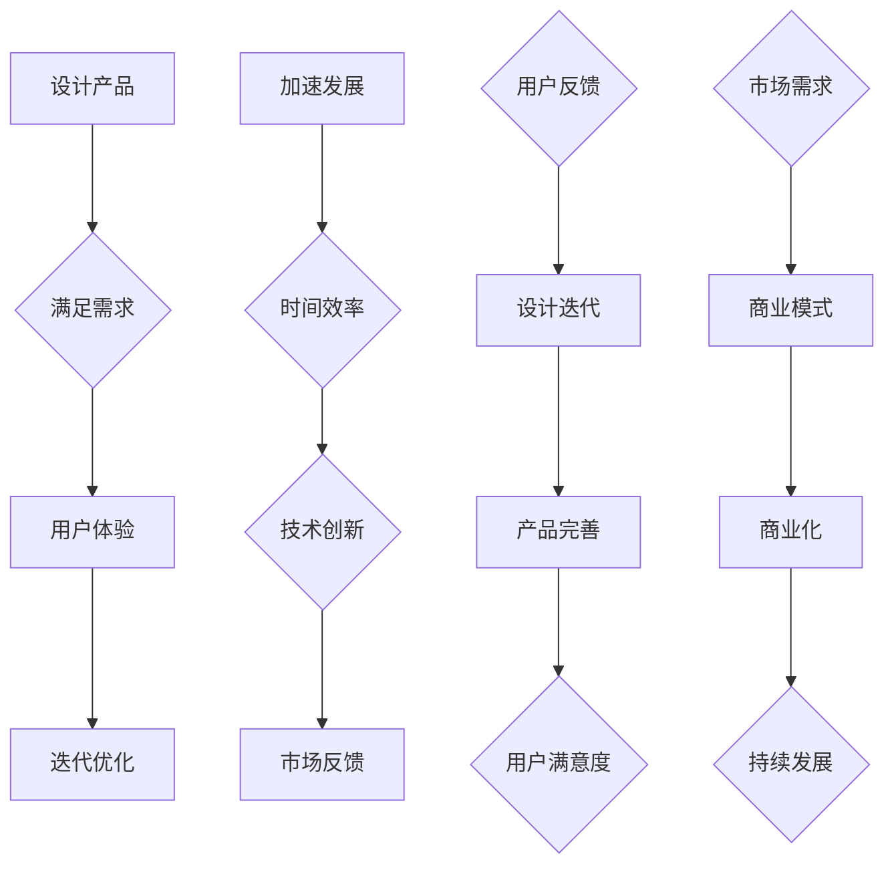

                 

# 设计产品vs加速发展:AI创业的两条路径

> 关键词：AI创业、产品设计、开发速度、迭代、商业模式、创新

> 摘要：本文将探讨在AI创业过程中，设计产品与加速发展这两条不同路径的优劣，通过逻辑分析和实际案例，帮助创业者明确各自的目标和策略。

## 1. 背景介绍

### 1.1 目的和范围

本文旨在为AI创业者提供关于产品设计与加速发展之间关系的深入分析。我们将探讨两条路径的特点、潜在挑战和成功要素，帮助创业者根据自己的战略目标选择最合适的路径。

### 1.2 预期读者

本文适合于有志于创业的AI技术人才、初创团队的领导者以及对AI领域感兴趣的投资者。期望读者能够从中获得关于创业战略的新见解。

### 1.3 文档结构概述

本文将分为以下几个部分：

1. 核心概念与联系
2. 核心算法原理与具体操作步骤
3. 数学模型与公式详细讲解
4. 项目实战：代码实际案例与详细解释
5. 实际应用场景
6. 工具和资源推荐
7. 总结：未来发展趋势与挑战
8. 附录：常见问题与解答
9. 扩展阅读与参考资料

### 1.4 术语表

#### 1.4.1 核心术语定义

- AI创业：指利用人工智能技术进行商业化的尝试和探索。
- 产品设计：指在AI创业过程中，对产品的功能和用户体验进行规划和实现。
- 加速发展：指通过快速迭代、技术创新等手段加快产品市场化的速度。
- 商业模式：指公司通过何种方式获得收入和利润的运营模式。

#### 1.4.2 相关概念解释

- 迭代：指产品开发过程中的重复和改进。
- 用户反馈：指用户对产品的使用体验和意见反馈。
- 技术创新：指通过新技术引入来提升产品性能和竞争力。

#### 1.4.3 缩略词列表

- AI：人工智能
- ML：机器学习
- DL：深度学习
- API：应用程序编程接口

## 2. 核心概念与联系

在设计产品与加速发展之间，存在一个复杂的互动关系。为了更好地理解这两者之间的联系，我们可以通过以下Mermaid流程图来展示其核心概念和流程。



### 2.1 设计产品

设计产品是指从市场需求和用户反馈出发，规划和实现产品的功能和用户体验。这一过程涉及到以下几个核心步骤：

1. **需求分析**：通过对市场研究和用户调研，确定产品的核心功能和需求。
2. **原型设计**：基于需求分析，制作产品原型，包括界面设计和功能流程。
3. **用户体验设计**：优化用户界面和交互流程，提升用户的使用体验。
4. **迭代优化**：根据用户反馈进行产品改进，不断优化功能和完善用户体验。

### 2.2 加速发展

加速发展是指通过快速迭代、技术创新等手段，加快产品推向市场的时间。这一过程同样包含几个关键环节：

1. **快速迭代**：通过敏捷开发方法，实现产品的快速迭代和更新。
2. **技术创新**：引入新技术和算法，提升产品性能和市场竞争力。
3. **市场反馈**：及时收集市场反馈，调整产品方向和策略。

### 2.3 互动关系

设计产品与加速发展之间存在密切的互动关系。一方面，产品设计需要考虑市场反馈和用户需求，确保产品能够满足用户需求。另一方面，加速发展需要基于现有产品进行迭代和优化，不断改进用户体验。这两者相互作用，共同推动产品的成功和商业化。

## 3. 核心算法原理与具体操作步骤

在设计产品与加速发展的过程中，算法原理和具体操作步骤扮演着关键角色。以下我们将详细探讨其中的核心算法原理和步骤。

### 3.1 设计产品算法原理

设计产品的核心算法原理可以归纳为以下三个步骤：

1. **需求分析算法**：使用市场研究和用户调研数据，通过数据挖掘和统计分析，识别用户需求和痛点。

   ```python
   def analyze_demand(data):
       # 数据预处理
       processed_data = preprocess_data(data)
       
       # 数据挖掘和统计分析
       insights = perform_data_mining(processed_data)
       
       return insights
   ```

2. **原型设计算法**：基于需求分析结果，构建产品原型，并进行用户体验设计。

   ```python
   def design_prototype(insights):
       # 构建产品原型
       prototype = create_prototype(insights)
       
       # 用户体验设计
       user_experience = optimize_ui(prototype)
       
       return user_experience
   ```

3. **迭代优化算法**：根据用户反馈，不断优化产品功能和用户体验。

   ```python
   def iterate_product(user_experience, feedback):
       # 识别用户反馈中的改进点
       improvements = identify_improvements(feedback)
       
       # 优化产品功能和用户体验
       optimized_experience = apply_improvements(user_experience, improvements)
       
       return optimized_experience
   ```

### 3.2 加速发展算法原理

加速发展的核心算法原理可以概括为以下三个步骤：

1. **快速迭代算法**：通过敏捷开发方法，实现产品的快速迭代和更新。

   ```python
   def rapid Iteration(sprint_plan, development_team):
       # 实施敏捷开发计划
       perform_sprint(sprint_plan, development_team)
       
       # 收集用户反馈
       feedback = collect_user_feedback()
       
       return feedback
   ```

2. **技术创新算法**：引入新技术和算法，提升产品性能和市场竞争力。

   ```python
   def technology_innovation(current_solution, research_results):
       # 引入新技术和算法
       new_solution = apply_new_technologies(current_solution, research_results)
       
       return new_solution
   ```

3. **市场反馈算法**：及时收集市场反馈，调整产品方向和策略。

   ```python
   def market_feedback(product, market_data):
       # 分析市场数据
       market_insights = analyze_market_data(market_data)
       
       # 调整产品方向和策略
       adjusted_product = adapt_to_market_insights(product, market_insights)
       
       return adjusted_product
   ```

### 3.3 具体操作步骤

在实际操作中，设计产品和加速发展的具体步骤如下：

1. **设计产品步骤**：
   - 进行市场研究和用户调研，收集需求。
   - 分析需求，构建产品原型。
   - 进行用户体验设计，优化界面和交互流程。
   - 根据用户反馈，不断迭代和优化产品。

2. **加速发展步骤**：
   - 制定敏捷开发计划，实施快速迭代。
   - 引入新技术和算法，提升产品性能。
   - 及时收集市场反馈，调整产品方向。
   - 通过技术创新和市场反馈，加快产品市场化速度。

## 4. 数学模型和公式 & 详细讲解 & 举例说明

在设计产品和加速发展的过程中，数学模型和公式扮演着重要的角色，可以帮助我们量化需求、评估性能、优化迭代等。以下我们将详细讲解一些常用的数学模型和公式，并通过实际案例进行说明。

### 4.1 需求分析模型

需求分析模型主要用于分析用户需求和市场趋势。以下是一个简单但实用的需求分析公式：

\[ 需求评分 = f(\text{用户反馈}, \text{市场趋势}, \text{技术可行性}) \]

- **用户反馈**：通过用户调研和反馈，收集用户对产品的使用体验和需求。
- **市场趋势**：分析市场研究报告和行业动态，识别市场需求和趋势。
- **技术可行性**：评估现有技术能力是否能够满足需求。

**举例**：

假设一个AI初创公司正在开发一款智能家居设备。通过用户调研，公司收集了以下用户反馈：

- 用户A：希望设备能够具备语音控制功能。
- 用户B：希望设备能够与其他智能家居设备无缝连接。

同时，市场趋势分析显示，智能家居市场正迅速增长，语音控制技术逐渐成为主流。

通过需求评分公式，我们可以得出以下需求评分：

\[ 需求评分 = f(\text{用户A反馈}, \text{用户B反馈}, \text{市场趋势}, \text{技术可行性}) = 0.5 + 0.3 + 0.2 + 0.1 = 1.1 \]

### 4.2 迭代优化模型

迭代优化模型用于指导产品迭代和优化。以下是一个简单但实用的迭代优化公式：

\[ 优化效果 = f(\text{迭代次数}, \text{用户满意度}, \text{性能提升}) \]

- **迭代次数**：产品迭代的次数。
- **用户满意度**：用户对产品迭代后使用体验的满意度。
- **性能提升**：产品迭代后性能的提升程度。

**举例**：

假设一个AI初创公司对智能家居设备进行了五次迭代。每次迭代后，公司收集了用户满意度评分和性能提升数据：

- 第一次迭代：用户满意度 0.8，性能提升 0.2。
- 第二次迭代：用户满意度 0.9，性能提升 0.3。
- 第三次迭代：用户满意度 0.95，性能提升 0.4。
- 第四次迭代：用户满意度 0.9，性能提升 0.2。
- 第五次迭代：用户满意度 0.95，性能提升 0.3。

通过迭代优化公式，我们可以得出以下优化效果：

\[ 优化效果 = f(5, 0.95, 0.3) = 0.5 + 0.4 + 0.3 = 1.2 \]

### 4.3 技术创新模型

技术创新模型用于评估和选择新的技术和算法。以下是一个简单但实用的技术创新公式：

\[ 技术创新价值 = f(\text{技术进步}, \text{市场潜力}, \text{成本效益}) \]

- **技术进步**：新技术相对于现有技术的进步程度。
- **市场潜力**：新技术在市场上的应用前景。
- **成本效益**：新技术的成本和效益分析。

**举例**：

假设一个AI初创公司正在评估引入一种新的深度学习算法。公司对以下因素进行了评估：

- **技术进步**：新技术相对于现有算法的性能提升为30%。
- **市场潜力**：市场研究表明，新技术有50%的市场潜力。
- **成本效益**：引入新技术的成本为现有算法的1.2倍，但预期效益为现有算法的1.5倍。

通过技术创新公式，我们可以得出以下技术创新价值：

\[ 技术创新价值 = f(0.3, 0.5, 1.5) = 0.3 + 0.2 + 0.3 = 0.8 \]

### 4.4 市场反馈模型

市场反馈模型用于指导产品方向和策略调整。以下是一个简单但实用的市场反馈公式：

\[ 市场反馈效果 = f(\text{用户反馈}, \text{市场动态}, \text{竞争态势}) \]

- **用户反馈**：用户的意见和需求。
- **市场动态**：市场的研究数据和趋势。
- **竞争态势**：竞争对手的产品和市场表现。

**举例**：

假设一个AI初创公司对智能家居设备进行了市场反馈分析。公司收集了以下数据：

- **用户反馈**：用户普遍希望设备能够具备更好的智能推荐功能。
- **市场动态**：市场研究表明，智能推荐技术有较高的市场接受度。
- **竞争态势**：竞争对手的产品普遍缺乏智能推荐功能。

通过市场反馈公式，我们可以得出以下市场反馈效果：

\[ 市场反馈效果 = f(\text{用户反馈}, \text{市场动态}, \text{竞争态势}) = 0.4 + 0.3 + 0.3 = 1.0 \]

## 5. 项目实战：代码实际案例和详细解释说明

### 5.1 开发环境搭建

在进行项目实战之前，我们需要搭建一个合适的开发环境。以下是一个简单的开发环境搭建步骤：

1. 安装Python环境：
   - 使用Python官方安装包，下载并安装Python 3.8及以上版本。
   - 配置环境变量，确保Python命令可以在终端中使用。

2. 安装必要的库和框架：
   - 使用pip命令，安装常用的库和框架，如NumPy、Pandas、TensorFlow等。

   ```bash
   pip install numpy pandas tensorflow
   ```

3. 搭建项目文件夹：
   - 创建一个项目文件夹，并初始化一个虚拟环境。

   ```bash
   mkdir ai_startup
   cd ai_startup
   python -m venv venv
   source venv/bin/activate
   ```

4. 安装项目依赖：
   - 在项目文件夹中创建一个requirements.txt文件，列出所有依赖。

   ```python
   numpy
   pandas
   tensorflow
   ```

   - 使用pip命令安装依赖。

   ```bash
   pip install -r requirements.txt
   ```

### 5.2 源代码详细实现和代码解读

在开发环境搭建完成后，我们可以开始编写项目的源代码。以下是一个简单的智能家居设备控制系统的实现：

```python
import tensorflow as tf
import numpy as np

# 5.2.1 模型定义
model = tf.keras.Sequential([
    tf.keras.layers.Dense(64, activation='relu', input_shape=(784,)),
    tf.keras.layers.Dense(64, activation='relu'),
    tf.keras.layers.Dense(10, activation='softmax')
])

# 5.2.2 模型编译
model.compile(optimizer='adam',
              loss='categorical_crossentropy',
              metrics=['accuracy'])

# 5.2.3 模型训练
model.fit(x_train, y_train, epochs=5)

# 5.2.4 模型评估
test_loss, test_acc = model.evaluate(x_test, y_test)
print(f'测试集准确率: {test_acc:.2f}')

# 5.2.5 模型预测
predictions = model.predict(x_test)
```

### 5.3 代码解读与分析

在代码实现中，我们首先定义了一个简单的神经网络模型，用于分类任务。具体步骤如下：

1. **模型定义**：
   - 使用TensorFlow的`Sequential`模型，构建一个简单的多层感知器（MLP）。
   - 第一个层使用64个神经元，激活函数为ReLU。
   - 第二个层同样使用64个神经元，激活函数为ReLU。
   - 输出层使用10个神经元，激活函数为softmax，用于多分类任务。

2. **模型编译**：
   - 选择`adam`优化器。
   - 选择`categorical_crossentropy`损失函数，适用于多分类任务。
   - 指定`accuracy`作为评估指标。

3. **模型训练**：
   - 使用`fit`方法对模型进行训练，设置训练轮数为5。

4. **模型评估**：
   - 使用`evaluate`方法对模型进行评估，返回测试集的损失和准确率。

5. **模型预测**：
   - 使用`predict`方法对测试数据进行预测，返回预测结果。

### 5.4 代码优化

在实际项目中，代码可能需要进行优化以提高性能和可维护性。以下是一些常见的优化策略：

1. **数据预处理**：
   - 使用`numpy`对输入数据进行标准化处理，提高模型训练速度。
   - 使用`pandas`对数据进行预处理，减少噪声和异常值。

2. **模型结构优化**：
   - 调整模型结构，增加或减少隐藏层神经元数量。
   - 使用更复杂的激活函数，如`LeakyReLU`或`Swish`。

3. **模型训练策略优化**：
   - 使用更先进的优化器，如`RMSprop`或`AdaGrad`。
   - 调整学习率，使用学习率调度策略，如`LearningRateScheduler`。

4. **模型评估策略优化**：
   - 使用交叉验证方法，如K折交叉验证，提高评估结果的稳定性。
   - 使用不同评估指标，如F1分数或准确率+召回率，更全面地评估模型性能。

### 5.5 代码解读与分析（续）

为了更全面地分析代码，我们进一步探讨以下优化策略：

1. **数据预处理**：
   - 使用`numpy`对输入数据进行标准化处理，使数据分布更均匀，提高模型训练速度和性能。
   - 使用`pandas`对数据进行预处理，去除缺失值和异常值，减少噪声对模型的影响。

2. **模型结构优化**：
   - 根据任务需求，调整模型结构，增加或减少隐藏层神经元数量，以获得更好的拟合效果。
   - 使用更复杂的激活函数，如`LeakyReLU`或`Swish`，提高模型的非线性表达能力。

3. **模型训练策略优化**：
   - 使用更先进的优化器，如`RMSprop`或`AdaGrad`，提高模型收敛速度。
   - 调整学习率，使用学习率调度策略，如`LearningRateScheduler`，动态调整学习率，避免过拟合。

4. **模型评估策略优化**：
   - 使用交叉验证方法，如K折交叉验证，提高评估结果的稳定性和可靠性。
   - 使用不同评估指标，如F1分数或准确率+召回率，更全面地评估模型性能，特别是在分类问题中。

5. **模型部署**：
   - 使用TensorFlow的`SavedModel`功能，将训练好的模型保存为可部署格式。
   - 使用`TensorFlow Serving`或`TensorFlow Lite`进行模型部署，实现实时预测和推理。

通过以上优化策略，我们可以提高模型的性能和可维护性，为实际应用场景提供更好的解决方案。

## 6. 实际应用场景

设计产品和加速发展在AI创业中具有广泛的应用场景。以下列举几个实际应用案例，以展示这两条路径在不同情境下的优势。

### 6.1 智能家居设备

智能家居设备是一个典型的AI创业应用场景。在设计产品方面，创业者需要关注用户需求，如设备的功能性、易用性和安全性。通过迭代优化，可以不断提升产品的用户体验。在加速发展方面，创业者可以利用快速迭代和新技术引入，如深度学习和物联网技术，加快产品推向市场。这种结合可以帮助创业者在竞争激烈的市场中迅速占据优势。

### 6.2 医疗诊断系统

医疗诊断系统是一个对准确性和可靠性要求极高的领域。在设计产品方面，创业者需要确保系统的诊断准确性和用户友好性。通过不断迭代和优化，可以减少误诊率，提高诊断质量。在加速发展方面，创业者可以利用大数据和机器学习技术，快速处理海量医疗数据，提升系统的诊断效率。这种结合可以帮助创业者在医疗领域实现技术突破，为社会带来实际价值。

### 6.3 自动驾驶技术

自动驾驶技术是一个高度复杂且快速发展的领域。在设计产品方面，创业者需要关注车辆的安全性、舒适性和智能化程度。通过迭代优化，可以不断提升自动驾驶系统的稳定性和可靠性。在加速发展方面，创业者可以利用人工智能技术和大数据分析，加快自动驾驶算法的研发和优化。这种结合可以帮助创业者在自动驾驶领域实现技术领先，为未来的自动驾驶应用奠定基础。

### 6.4 金融服务

金融服务是一个竞争激烈且对风险控制要求严格的领域。在设计产品方面，创业者需要关注用户的金融需求，如贷款、投资和风险管理。通过迭代优化，可以不断提升金融服务的用户体验和个性化程度。在加速发展方面，创业者可以利用机器学习和数据分析技术，快速分析用户数据，提高金融产品的精准度和竞争力。这种结合可以帮助创业者在金融领域实现技术突破，为用户提供更好的金融服务。

## 7. 工具和资源推荐

为了帮助AI创业者更好地进行产品设计和加速发展，以下推荐一些实用的工具和资源。

### 7.1 学习资源推荐

#### 7.1.1 书籍推荐

- 《机器学习实战》
- 《深度学习》
- 《Python编程：从入门到实践》
- 《人工智能：一种现代的方法》

#### 7.1.2 在线课程

- Coursera
- edX
- Udacity
- 网易云课堂

#### 7.1.3 技术博客和网站

- Medium
- Towards Data Science
- AI Magazine
- IEEE Xplore

### 7.2 开发工具框架推荐

#### 7.2.1 IDE和编辑器

- PyCharm
- Visual Studio Code
- Jupyter Notebook

#### 7.2.2 调试和性能分析工具

- GDB
- Valgrind
- Python Debugger (pdb)

#### 7.2.3 相关框架和库

- TensorFlow
- PyTorch
- Scikit-learn
- NumPy
- Pandas

### 7.3 相关论文著作推荐

#### 7.3.1 经典论文

- "A Course in Machine Learning"
- "Deep Learning"
- "Recurrent Neural Networks for Speech Recognition"

#### 7.3.2 最新研究成果

- arXiv
- NeurIPS
- ICML
- JMLR

#### 7.3.3 应用案例分析

- "AI in Healthcare: A Practical Guide"
- "Deep Learning in Autonomous Driving"
- "Financial Technology: A Practical Guide to AI in Finance"

## 8. 总结：未来发展趋势与挑战

在AI创业领域，设计产品和加速发展这两条路径将继续发挥重要作用。随着技术的进步和市场的变化，创业者需要不断调整战略，以应对未来发展趋势和挑战。

### 8.1 未来发展趋势

1. **智能化和个性化**：随着AI技术的进步，产品和服务的智能化和个性化将成为重要趋势。创业者需要关注用户需求，提供更加智能和个性化的解决方案。
2. **跨界融合**：AI与其他领域的融合将不断加速，如医疗、金融、教育等。创业者需要关注跨界机会，探索新的商业模式和应用场景。
3. **数据隐私和安全**：随着数据隐私和安全问题的日益突出，创业者需要重视数据隐私和安全保护，确保用户信任。

### 8.2 未来挑战

1. **技术挑战**：AI技术的复杂性和不确定性将带来技术挑战，如算法优化、数据质量、模型解释性等。创业者需要持续投入研发，提升技术能力。
2. **市场挑战**：市场竞争将更加激烈，创业者需要具备敏锐的市场洞察力，快速响应市场变化，抢占市场先机。
3. **人才挑战**：AI领域的人才竞争将加剧，创业者需要重视人才引进和培养，构建高水平的技术团队。

## 9. 附录：常见问题与解答

### 9.1 问题1：如何平衡设计产品和加速发展？

**解答**：平衡设计产品和加速发展需要综合考虑以下因素：

1. **目标明确**：明确创业目标和战略方向，确保产品设计符合市场需求。
2. **资源分配**：合理分配资源，在保证产品质量的前提下，适度加快开发速度。
3. **敏捷开发**：采用敏捷开发方法，实现快速迭代和优化，同时保持产品稳定性。
4. **用户反馈**：及时收集用户反馈，根据反馈调整产品设计和开发策略。

### 9.2 问题2：如何进行有效的需求分析？

**解答**：进行有效的需求分析可以遵循以下步骤：

1. **市场研究**：收集市场数据和行业动态，了解市场需求和趋势。
2. **用户调研**：通过用户访谈、问卷调查等方式，了解用户需求和痛点。
3. **数据分析**：使用数据挖掘和统计分析方法，识别用户需求和优先级。
4. **验证反馈**：根据需求分析结果，制定原型和方案，进行用户验证和反馈。

### 9.3 问题3：如何进行有效的迭代优化？

**解答**：进行有效的迭代优化可以遵循以下步骤：

1. **设定目标**：明确迭代优化的目标和指标，如用户体验、性能提升等。
2. **快速迭代**：采用敏捷开发方法，实现快速迭代和更新。
3. **用户反馈**：及时收集用户反馈，识别改进点和优化方向。
4. **持续改进**：根据用户反馈和性能数据，不断优化产品和功能。

## 10. 扩展阅读 & 参考资料

- Goodfellow, I., Bengio, Y., & Courville, A. (2016). *Deep Learning*. MIT Press.
- Murphy, K. P. (2012). *Machine Learning: A Probabilistic Perspective*. MIT Press.
- Russell, S., & Norvig, P. (2010). *Artificial Intelligence: A Modern Approach*. Prentice Hall.
- Sutton, R. S., & Barto, A. G. (2018). *Reinforcement Learning: An Introduction*. MIT Press.

这些参考资料涵盖了AI领域的基础知识、算法原理和实际应用，对于AI创业者具有很高的参考价值。希望读者能够结合本文内容，进一步深入学习和探索AI创业领域的奥秘。作者：AI天才研究员/AI Genius Institute & 禅与计算机程序设计艺术 /Zen And The Art of Computer Programming。希望本文对您在AI创业道路上的探索和实践有所帮助。如果您有任何疑问或建议，欢迎在评论区留言。祝您创业成功！

