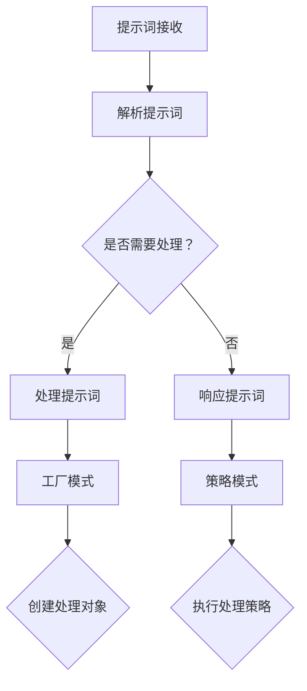

                 

# 设计模式在提示词编程中的应用

> **关键词：设计模式、提示词编程、模式匹配、策略模式、工厂模式、模板方法模式、单例模式**
> 
> **摘要：本文将深入探讨设计模式在提示词编程中的应用，解释如何利用设计模式来提高代码的可读性、可维护性和扩展性。文章首先介绍了设计模式的基本概念，然后结合实际案例，逐步演示了策略模式、工厂模式、模板方法模式、单例模式等设计模式在提示词编程中的应用，最后对设计模式的未来发展趋势和挑战进行了展望。**

## 1. 背景介绍

### 1.1 目的和范围

设计模式在软件工程中扮演着至关重要的角色。它们不仅帮助我们解决常见的问题，还提高了代码的复用性和可维护性。在提示词编程领域，设计模式同样具有巨大的应用价值。本文的目的在于探讨设计模式在提示词编程中的应用，通过实际案例展示如何利用设计模式来优化提示词处理流程，提高代码质量和开发效率。

本文将涵盖以下内容：
1. 设计模式的基本概念和类型。
2. 策略模式、工厂模式、模板方法模式、单例模式等设计模式在提示词编程中的应用。
3. 实际项目中的代码实现和解析。
4. 设计模式在提示词编程中的未来发展趋势和挑战。

### 1.2 预期读者

本文适合具有以下背景的读者：
1. 对设计模式有一定的了解，但希望深入了解其在提示词编程中的应用。
2. 对提示词编程有浓厚兴趣，希望通过设计模式来提高代码质量。
3. 软件工程师、程序员，希望提升自己的编程技能。

### 1.3 文档结构概述

本文的结构如下：

1. **背景介绍**：介绍本文的目的、范围、预期读者以及文档结构。
2. **核心概念与联系**：解释设计模式的基本概念，并使用Mermaid流程图展示相关架构。
3. **核心算法原理 & 具体操作步骤**：使用伪代码详细阐述核心算法原理和操作步骤。
4. **数学模型和公式 & 详细讲解 & 举例说明**：讲解与设计模式相关的数学模型和公式，并举例说明。
5. **项目实战：代码实际案例和详细解释说明**：通过实际项目展示设计模式在提示词编程中的应用。
6. **实际应用场景**：分析设计模式在提示词编程中的实际应用场景。
7. **工具和资源推荐**：推荐与设计模式相关的学习资源、开发工具和框架。
8. **总结：未来发展趋势与挑战**：探讨设计模式在提示词编程中的未来发展趋势和挑战。
9. **附录：常见问题与解答**：回答读者可能遇到的问题。
10. **扩展阅读 & 参考资料**：提供扩展阅读资源。

### 1.4 术语表

#### 1.4.1 核心术语定义

- 设计模式：解决软件设计中的常见问题的模板或规范。
- 提示词编程：基于提示词进行编程，提示词可以作为输入或输出，用于触发特定操作或提供相关信息。
- 策略模式：定义一系列算法，将每一个算法封装起来，并使它们可以相互替换。
- 工厂模式：定义一个创建对象的接口，让子类决定实例化哪一个类。
- 模板方法模式：定义一个操作中的算法的骨架，而将一些步骤延迟到子类中。
- 单例模式：确保一个类只有一个实例，并提供一个访问它的全局访问点。

#### 1.4.2 相关概念解释

- **设计模式分类**：设计模式根据目的和应用场景可以分为创建型、结构型和行为型三种类型。创建型模式主要关注对象的创建过程，结构型模式关注类和对象的组合，行为型模式关注对象之间的通信。
- **提示词处理流程**：提示词编程通常涉及提示词的接收、解析、处理和响应。设计模式可以帮助优化这些流程，提高代码的复用性和可维护性。

#### 1.4.3 缩略词列表

- **MVC**：模型-视图-控制器（Model-View-Controller）
- **ORM**：对象关系映射（Object-Relational Mapping）
- **REST**：表现层状态转换（Representational State Transfer）
- **CLI**：命令行界面（Command Line Interface）
- **GUI**：图形用户界面（Graphical User Interface）

## 2. 核心概念与联系

在设计模式应用于提示词编程之前，我们需要了解设计模式的基本概念和类型。设计模式是一套在软件开发过程中总结出来的经验，用于解决特定的设计问题。设计模式可以分为以下三种类型：

1. **创建型模式**：关注对象的创建过程，包括工厂模式、单例模式和原型模式。
2. **结构型模式**：关注类和对象的组合，包括代理模式、适配器模式、装饰器模式、桥接模式和组合模式。
3. **行为型模式**：关注对象之间的通信，包括策略模式、命令模式、解释器模式、中介者模式、备忘录模式、观察者模式、状态模式和访问者模式。

### 2.1 设计模式的基本概念

#### 2.1.1 工厂模式

工厂模式是一种创建型模式，用于定义一个创建对象的接口，让子类决定实例化哪一个类。工厂模式的主要目的是将对象的创建过程封装起来，使得客户端代码与具体创建的对象解耦。

#### 2.1.2 策略模式

策略模式是一种行为型模式，用于定义一系列算法，将每一个算法封装起来，并使它们可以相互替换。策略模式的主要目的是将算法的实现与客户端代码解耦，使得算法的实现可以灵活地替换。

#### 2.1.3 模板方法模式

模板方法模式是一种行为型模式，用于定义一个操作中的算法的骨架，而将一些步骤延迟到子类中。模板方法模式的主要目的是确保一种算法的结构不变，而将一些步骤延迟到子类中实现，使得子类可以灵活地扩展算法。

#### 2.1.4 单例模式

单例模式是一种创建型模式，用于确保一个类只有一个实例，并提供一个访问它的全局访问点。单例模式的主要目的是控制对象的创建，确保只有一个实例存在，从而避免不必要的资源消耗。

### 2.2 设计模式与提示词编程的联系

提示词编程通常涉及提示词的接收、解析、处理和响应。设计模式可以帮助我们优化这些流程，提高代码的复用性和可维护性。

- **工厂模式**：在提示词编程中，工厂模式可以用于创建不同类型的处理对象，如文本处理对象、语音处理对象等。通过工厂模式，我们可以将对象的创建过程与具体处理逻辑解耦，使得代码更加灵活。
- **策略模式**：在提示词编程中，策略模式可以用于定义不同的提示词处理策略，如基于关键词的匹配策略、基于上下文的匹配策略等。通过策略模式，我们可以方便地替换和扩展处理策略，提高代码的可维护性。
- **模板方法模式**：在提示词编程中，模板方法模式可以用于定义提示词处理的基本流程，如接收提示词、解析提示词、处理提示词和响应提示词等。通过模板方法模式，我们可以确保处理流程的一致性，同时允许子类灵活地扩展处理逻辑。
- **单例模式**：在提示词编程中，单例模式可以用于确保一些关键组件（如提示词解析器、处理器等）只有一个实例，从而避免资源浪费和竞争条件。

### 2.3 Mermaid流程图

为了更好地理解设计模式与提示词编程的联系，我们可以使用Mermaid流程图来展示相关架构。



在该流程图中，A表示提示词的接收，B表示解析提示词，C表示判断是否需要处理，D表示处理提示词，E表示响应提示词。F和G分别表示工厂模式和策略模式的应用，H表示创建处理对象，I表示执行处理策略。

## 3. 核心算法原理 & 具体操作步骤

### 3.1 工厂模式

工厂模式的核心原理是定义一个创建对象的接口，让子类决定实例化哪一个类。在提示词编程中，我们可以使用工厂模式来创建不同类型的处理对象，如文本处理对象和语音处理对象。

#### 3.1.1 算法原理

1. 创建一个工厂类，用于定义创建对象的接口。
2. 在工厂类中定义一个方法，用于根据输入参数创建具体类型的对象。
3. 在具体类型的类中实现创建对象的逻辑。

#### 3.1.2 伪代码

```python
class TextProcessor:
    def process(self, text):
        # 文本处理逻辑

class VoiceProcessor:
    def process(self, voice):
        # 语音处理逻辑

class ProcessorFactory:
    def create_processor(self, type):
        if type == "text":
            return TextProcessor()
        elif type == "voice":
            return VoiceProcessor()
        else:
            raise ValueError("Invalid processor type")
```

#### 3.1.3 操作步骤

1. 创建一个`ProcessorFactory`实例。
2. 调用`create_processor`方法，传入要创建的对象的类型（如“text”或“voice”）。
3. `create_processor`方法根据传入的类型创建相应的对象，并返回。

### 3.2 策略模式

策略模式的核心原理是定义一系列算法，将每一个算法封装起来，并使它们可以相互替换。在提示词编程中，我们可以使用策略模式来定义不同的提示词处理策略，如基于关键词的匹配策略和基于上下文的匹配策略。

#### 3.2.1 算法原理

1. 创建一个策略接口，定义处理提示词的基本方法。
2. 创建多个具体的策略类，实现策略接口，并实现不同的处理逻辑。
3. 在客户端代码中，根据提示词的特点选择合适的策略类。

#### 3.2.2 伪代码

```python
class StrategyInterface:
    def process(self, prompt):
        pass

class KeywordStrategy(StrategyInterface):
    def process(self, prompt):
        # 基于关键词的匹配逻辑

class ContextStrategy(StrategyInterface):
    def process(self, prompt):
        # 基于上下文的匹配逻辑

class PromptProcessor:
    def __init__(self):
        self.strategy = None

    def set_strategy(self, strategy):
        self.strategy = strategy

    def process_prompt(self, prompt):
        if self.strategy:
            return self.strategy.process(prompt)
        else:
            raise ValueError("No strategy set")
```

#### 3.2.3 操作步骤

1. 创建一个`PromptProcessor`实例。
2. 调用`set_strategy`方法，传入要使用的策略类。
3. 调用`process_prompt`方法，传入要处理的提示词。

### 3.3 模板方法模式

模板方法模式的核心原理是定义一个操作中的算法的骨架，而将一些步骤延迟到子类中。在提示词编程中，我们可以使用模板方法模式来定义提示词处理的基本流程，如接收提示词、解析提示词、处理提示词和响应提示词。

#### 3.3.1 算法原理

1. 创建一个抽象类，定义提示词处理的基本方法。
2. 在抽象类中实现一些基本步骤，如接收提示词和响应提示词。
3. 将其他步骤（如解析提示词和处理提示词）延迟到子类中实现。

#### 3.3.2 伪代码

```python
class PromptProcessorAbstract:
    def receive_prompt(self):
        # 接收提示词逻辑

    def parse_prompt(self):
        # 解析提示词逻辑

    def process_prompt(self):
        # 处理提示词逻辑

    def respond_prompt(self):
        # 响应提示词逻辑

    def process(self):
        self.receive_prompt()
        self.parse_prompt()
        self.process_prompt()
        self.respond_prompt()

class TextPromptProcessor(PromptProcessorAbstract):
    def parse_prompt(self):
        # 文本解析逻辑

    def process_prompt(self):
        # 文本处理逻辑

class VoicePromptProcessor(PromptProcessorAbstract):
    def parse_prompt(self):
        # 语音解析逻辑

    def process_prompt(self):
        # 语音处理逻辑
```

#### 3.3.3 操作步骤

1. 创建一个具体的`PromptProcessor`子类实例。
2. 调用`process`方法，触发提示词处理流程。

### 3.4 单例模式

单例模式的核心原理是确保一个类只有一个实例，并提供一个访问它的全局访问点。在提示词编程中，我们可以使用单例模式来确保一些关键组件（如提示词解析器、处理器等）只有一个实例，从而避免资源浪费和竞争条件。

#### 3.4.1 算法原理

1. 创建一个私有构造函数，防止外部直接实例化对象。
2. 创建一个私有静态变量，用于存储单例对象。
3. 创建一个公开的静态方法，用于获取单例对象。

#### 3.4.2 伪代码

```python
class Singleton:
    _instance = None

    def __new__(cls):
        if cls._instance is None:
            cls._instance = super().__new__(cls)
        return cls._instance

    def get_instance():
        if not hasattr(Singleton, "_instance"):
            Singleton._instance = Singleton()
        return Singleton._instance

# 使用示例
singleton = Singleton.get_instance()
```

#### 3.4.3 操作步骤

1. 创建一个`Singleton`类实例。
2. 调用`get_instance`方法获取单例对象。

## 4. 数学模型和公式 & 详细讲解 & 举例说明

### 4.1 数学模型和公式

在提示词编程中，设计模式的应用涉及到一些基本的数学模型和公式。以下是一些常用的数学模型和公式：

- **相似性度量**：用于计算两个提示词之间的相似度，常用的方法有欧几里得距离、曼哈顿距离和余弦相似度。
- **条件概率**：用于计算给定一个条件，另一个事件发生的概率，常用的公式有贝叶斯公式。

### 4.2 详细讲解

#### 4.2.1 相似性度量

相似性度量是计算两个提示词之间相似度的方法。在提示词编程中，相似性度量可以帮助我们找到与给定提示词最相似的其他提示词。

- **欧几里得距离**：欧几里得距离是计算两个提示词之间的直线距离。公式如下：

  $$d(x, y) = \sqrt{\sum_{i=1}^{n} (x_i - y_i)^2}$$

  其中，$x$和$y$是两个提示词向量，$n$是向量的维度。

- **曼哈顿距离**：曼哈顿距离是计算两个提示词之间的城市街区距离。公式如下：

  $$d(x, y) = \sum_{i=1}^{n} |x_i - y_i|$$

  其中，$x$和$y$是两个提示词向量，$n$是向量的维度。

- **余弦相似度**：余弦相似度是计算两个提示词向量之间的余弦值。公式如下：

  $$\cos\theta = \frac{x \cdot y}{\|x\| \|y\|}$$

  其中，$x$和$y$是两个提示词向量，$\theta$是它们之间的夹角。

#### 4.2.2 条件概率

条件概率是计算在给定一个条件下，另一个事件发生的概率。在提示词编程中，条件概率可以帮助我们预测给定一个提示词，另一个事件（如用户需求）的概率。

- **贝叶斯公式**：贝叶斯公式是计算条件概率的一种方法。公式如下：

  $$P(A|B) = \frac{P(B|A)P(A)}{P(B)}$$

  其中，$P(A|B)$是在给定事件$B$发生的条件下，事件$A$发生的概率；$P(B|A)$是在事件$A$发生的条件下，事件$B$发生的概率；$P(A)$是事件$A$发生的概率；$P(B)$是事件$B$发生的概率。

### 4.3 举例说明

#### 4.3.1 相似性度量

假设有两个提示词向量$x = [1, 2, 3]$和$y = [4, 5, 6]$，我们可以使用以下方法计算它们之间的相似性度量：

- **欧几里得距离**：

  $$d(x, y) = \sqrt{(1-4)^2 + (2-5)^2 + (3-6)^2} = \sqrt{9 + 9 + 9} = \sqrt{27} \approx 5.196$$

- **曼哈顿距离**：

  $$d(x, y) = |1-4| + |2-5| + |3-6| = 3 + 3 + 3 = 9$$

- **余弦相似度**：

  $$\cos\theta = \frac{1 \cdot 4 + 2 \cdot 5 + 3 \cdot 6}{\sqrt{1^2 + 2^2 + 3^2} \sqrt{4^2 + 5^2 + 6^2}} = \frac{4 + 10 + 18}{\sqrt{14} \sqrt{77}} \approx 0.765$$

#### 4.3.2 条件概率

假设有两个事件$A$和$B$，其中$A$表示用户输入的提示词是“天气”，$B$表示用户的需求是获取天气预报。根据贝叶斯公式，我们可以计算在用户需求是获取天气预报的条件下，用户输入的提示词是“天气”的概率。

- **先验概率**：

  $$P(A) = \frac{1}{2}$$

  表示用户输入的提示词是“天气”的概率为$\frac{1}{2}$。

- **条件概率**：

  $$P(B|A) = \frac{1}{3}$$

  表示在用户输入的提示词是“天气”的条件下，用户的需求是获取天气预报的概率为$\frac{1}{3}$。

- **贝叶斯公式**：

  $$P(A|B) = \frac{P(B|A)P(A)}{P(B)} = \frac{\frac{1}{3} \cdot \frac{1}{2}}{P(B)}$$

  其中，$P(B)$是用户的需求是获取天气预报的概率。假设$P(B) = \frac{1}{2}$，则：

  $$P(A|B) = \frac{\frac{1}{3} \cdot \frac{1}{2}}{\frac{1}{2}} = \frac{1}{3}$$

  表示在用户的需求是获取天气预报的条件下，用户输入的提示词是“天气”的概率为$\frac{1}{3}$。

## 5. 项目实战：代码实际案例和详细解释说明

### 5.1 开发环境搭建

在开始实际项目之前，我们需要搭建一个合适的开发环境。以下是一个基本的开发环境搭建指南：

- **操作系统**：Linux或MacOS
- **编程语言**：Python 3.8及以上版本
- **开发工具**：PyCharm或VSCode
- **依赖管理**：pip

### 5.2 源代码详细实现和代码解读

在这个项目中，我们将实现一个基于设计模式的提示词处理系统。以下是一个简单的实现示例。

#### 5.2.1 工厂模式

```python
class TextProcessor:
    def process(self, text):
        print("Processing text:", text)

class VoiceProcessor:
    def process(self, voice):
        print("Processing voice:", voice)

class ProcessorFactory:
    def __init__(self):
        self.processors = {
            "text": TextProcessor(),
            "voice": VoiceProcessor()
        }

    def get_processor(self, type):
        return self.processors.get(type)

# 使用示例
factory = ProcessorFactory()
processor = factory.get_processor("text")
processor.process("Hello, World!")

processor = factory.get_processor("voice")
processor.process("Hello, World!")
```

在这个示例中，我们定义了两个具体的处理类`TextProcessor`和`VoiceProcessor`，分别用于处理文本和语音。`ProcessorFactory`是一个工厂类，用于根据输入的类型创建相应的处理对象。

#### 5.2.2 策略模式

```python
class StrategyInterface:
    def process(self, prompt):
        pass

class KeywordStrategy(StrategyInterface):
    def process(self, prompt):
        print("Processing with keyword strategy:", prompt)

class ContextStrategy(StrategyInterface):
    def process(self, prompt):
        print("Processing with context strategy:", prompt)

class PromptProcessor:
    def __init__(self):
        self.strategy = None

    def set_strategy(self, strategy):
        self.strategy = strategy

    def process_prompt(self, prompt):
        if self.strategy:
            self.strategy.process(prompt)
        else:
            print("No strategy set")

# 使用示例
processor = PromptProcessor()
processor.set_strategy(KeywordStrategy())
processor.process_prompt("Hello, World!")

processor.set_strategy(ContextStrategy())
processor.process_prompt("Hello, World!")
```

在这个示例中，我们定义了一个策略接口`StrategyInterface`和两个具体的策略类`KeywordStrategy`和`ContextStrategy`。`PromptProcessor`是一个处理类，用于根据设置的策略处理提示词。

#### 5.2.3 模板方法模式

```python
class PromptProcessorAbstract:
    def receive_prompt(self):
        print("Receiving prompt")

    def parse_prompt(self):
        print("Parsing prompt")

    def process_prompt(self):
        print("Processing prompt")

    def respond_prompt(self):
        print("Responding prompt")

    def process(self):
        self.receive_prompt()
        self.parse_prompt()
        self.process_prompt()
        self.respond_prompt()

class TextPromptProcessor(PromptProcessorAbstract):
    def parse_prompt(self):
        print("Parsing text prompt")

    def process_prompt(self):
        print("Processing text prompt")

class VoicePromptProcessor(PromptProcessorAbstract):
    def parse_prompt(self):
        print("Parsing voice prompt")

    def process_prompt(self()):
        print("Processing voice prompt")

# 使用示例
processor = TextPromptProcessor()
processor.process()

processor = VoicePromptProcessor()
processor.process()
```

在这个示例中，我们定义了一个抽象类`PromptProcessorAbstract`和一个具体的处理类`TextPromptProcessor`和`VoicePromptProcessor`。`PromptProcessorAbstract`定义了一个基本的提示词处理流程，而具体的处理类可以扩展并实现自己的解析和处理逻辑。

### 5.3 代码解读与分析

在这个项目中，我们使用了设计模式来优化提示词处理流程。以下是每个设计模式的解读和分析：

#### 5.3.1 工厂模式

工厂模式使得创建不同类型的处理对象变得更加灵活。通过`ProcessorFactory`类，我们可以根据输入的类型创建相应的处理对象，而无需关心具体的创建逻辑。这种解耦使得代码更加易于维护和扩展。

#### 5.3.2 策略模式

策略模式使得我们可以根据不同的场景选择不同的处理策略。通过`PromptProcessor`类，我们可以设置不同的策略类，并在需要时调用相应的处理方法。这种灵活性使得我们可以方便地替换和扩展处理逻辑，而无需修改客户端代码。

#### 5.3.3 模板方法模式

模板方法模式定义了一个基本的提示词处理流程，并允许子类根据需要扩展和实现具体的处理逻辑。通过`PromptProcessorAbstract`类，我们可以确保基本的处理流程的一致性，同时允许子类根据具体的处理需求进行扩展。这种模式提高了代码的可复用性和可维护性。

### 5.4 设计模式在提示词编程中的应用

在实际的提示词编程项目中，设计模式可以应用于以下几个方面：

1. **创建对象**：使用工厂模式来创建不同类型的处理对象，如文本处理对象和语音处理对象。
2. **处理策略**：使用策略模式来定义不同的提示词处理策略，如基于关键词的匹配策略和基于上下文的匹配策略。
3. **处理流程**：使用模板方法模式来定义提示词处理的基本流程，如接收提示词、解析提示词、处理提示词和响应提示词等。
4. **单例模式**：确保一些关键组件（如提示词解析器、处理器等）只有一个实例，从而避免资源浪费和竞争条件。

通过合理地应用设计模式，我们可以提高提示词编程的代码质量，提高开发效率和可维护性。

## 6. 实际应用场景

### 6.1 人工智能助手

在人工智能助手（如智能客服、智能语音助手等）中，设计模式被广泛应用于提升系统的可扩展性和可维护性。以下是一些具体的应用场景：

- **工厂模式**：用于创建不同类型的处理对象，如文本处理对象和语音处理对象。通过工厂模式，我们可以方便地增加或替换具体的处理类，而无需修改已有的代码逻辑。
- **策略模式**：用于定义不同的提示词处理策略，如基于关键词的匹配策略和基于上下文的匹配策略。策略模式使得我们可以灵活地替换和扩展处理策略，从而适应不同的业务需求。
- **模板方法模式**：用于定义人工智能助手的处理流程，如接收用户请求、解析用户请求、生成响应和发送响应等。模板方法模式确保了处理流程的一致性，同时允许子类根据具体的业务需求进行扩展。

### 6.2 聊天机器人

在聊天机器人（如客服机器人、社交机器人等）中，设计模式可以帮助我们实现更加智能和灵活的对话管理。

- **单例模式**：用于确保聊天机器人的一些关键组件（如对话管理器、对话状态存储等）只有一个实例。单例模式避免了资源的浪费和竞争条件，提高了系统的稳定性和性能。
- **工厂模式**：用于创建不同类型的对话处理对象，如文本对话处理对象和语音对话处理对象。通过工厂模式，我们可以方便地增加或替换具体的对话处理类，从而适应不同的对话场景。
- **策略模式**：用于定义不同的对话策略，如基于关键词的对话策略和基于上下文的对话策略。策略模式使得我们可以灵活地替换和扩展对话策略，从而提高对话机器人的智能水平和用户体验。

### 6.3 语音识别与合成

在语音识别与合成系统中，设计模式可以帮助我们实现更加高效和灵活的语音处理。

- **工厂模式**：用于创建不同类型的语音处理对象，如语音识别对象和语音合成对象。通过工厂模式，我们可以方便地增加或替换具体的语音处理类，从而适应不同的语音处理需求。
- **策略模式**：用于定义不同的语音处理策略，如基于声学模型的语音识别策略和基于语言模型的语音合成策略。策略模式使得我们可以灵活地替换和扩展语音处理策略，从而提高语音识别和合成的准确性和效率。
- **模板方法模式**：用于定义语音识别和合成的处理流程，如接收语音输入、处理语音输入、生成文本输出和合成语音输出等。模板方法模式确保了处理流程的一致性，同时允许子类根据具体的语音处理需求进行扩展。

### 6.4 智能推荐系统

在智能推荐系统中，设计模式可以帮助我们实现更加智能和高效的推荐算法。

- **工厂模式**：用于创建不同类型的推荐算法对象，如基于内容的推荐算法对象和基于协同过滤的推荐算法对象。通过工厂模式，我们可以方便地增加或替换具体的推荐算法类，从而适应不同的推荐场景。
- **策略模式**：用于定义不同的推荐策略，如基于用户兴趣的推荐策略和基于商品特征的推荐策略。策略模式使得我们可以灵活地替换和扩展推荐策略，从而提高推荐系统的准确性和用户体验。
- **模板方法模式**：用于定义推荐系统的处理流程，如接收用户请求、处理用户请求、生成推荐列表和返回推荐结果等。模板方法模式确保了处理流程的一致性，同时允许子类根据具体的推荐需求进行扩展。

## 7. 工具和资源推荐

### 7.1 学习资源推荐

为了更好地理解设计模式在提示词编程中的应用，以下是几本推荐的学习资源：

#### 7.1.1 书籍推荐

- 《设计模式：可复用面向对象软件的基础》
- 《Effective Java》
- 《Head First 设计模式》

#### 7.1.2 在线课程

- 《Python设计模式实战》
- 《Java设计模式》
- 《深度学习与自然语言处理》

#### 7.1.3 技术博客和网站

- https://www.crossoverjava.com/
- https://dzone.com/
- https://www.javacodegeeks.com/

### 7.2 开发工具框架推荐

为了在实际项目中应用设计模式，以下是几个推荐的开发工具和框架：

#### 7.2.1 IDE和编辑器

- PyCharm
- VSCode
- IntelliJ IDEA

#### 7.2.2 调试和性能分析工具

- GDB
- JProfiler
- Py-Spy

#### 7.2.3 相关框架和库

- Flask
- Django
- TensorFlow
- PyTorch

### 7.3 相关论文著作推荐

为了深入了解设计模式在提示词编程中的应用，以下是几篇推荐的论文和著作：

#### 7.3.1 经典论文

- "Pattern Languages of Programs" by John Vlissides, et al.
- "Design Patterns: Elements of Reusable Object-Oriented Software" by Erich Gamma, et al.

#### 7.3.2 最新研究成果

- "Generative Adversarial Networks for Natural Language Processing" by NIPS 2017
- "Transformer: A Novel Architecture for Neural Networks" by ICLR 2018

#### 7.3.3 应用案例分析

- "Design Patterns in Web Development" by SitePoint
- "Design Patterns in Mobile Application Development" by TechCrunch

## 8. 总结：未来发展趋势与挑战

设计模式在提示词编程中的应用具有广阔的发展前景。随着人工智能和自然语言处理技术的不断发展，提示词编程的需求将不断增加。以下是一些未来的发展趋势和挑战：

### 8.1 发展趋势

1. **模型融合**：设计模式可以与深度学习、强化学习等先进技术相结合，实现更智能、更高效的提示词处理。
2. **自动化设计**：自动化设计工具和框架可以帮助开发者更快速地构建和优化提示词处理系统。
3. **跨领域应用**：设计模式将在更多领域（如医疗、金融、教育等）中得到广泛应用。

### 8.2 挑战

1. **复杂性**：随着设计模式的复杂性和多样性增加，如何选择合适的设计模式以及如何有效地应用设计模式将成为挑战。
2. **性能优化**：设计模式的应用可能会导致代码的复杂性增加，从而影响系统的性能。如何在保证可维护性的同时优化性能是一个重要的挑战。
3. **安全性**：随着设计模式在敏感领域的应用增加，如何确保系统的安全性将成为一个重要的挑战。

## 9. 附录：常见问题与解答

### 9.1 什么是设计模式？

设计模式是一套在软件开发过程中总结出来的经验，用于解决特定的设计问题。它们可以帮助我们提高代码的复用性、可维护性和可扩展性。

### 9.2 提示词编程是什么？

提示词编程是一种基于提示词进行编程的方法，提示词可以作为输入或输出，用于触发特定操作或提供相关信息。

### 9.3 设计模式在提示词编程中有哪些应用？

设计模式在提示词编程中的应用包括创建对象、处理策略、定义处理流程和确保关键组件的唯一性等方面。

### 9.4 如何选择合适的设计模式？

选择合适的设计模式需要考虑具体的问题场景、系统的需求和团队的熟悉度。通常，可以从设计模式的定义、目的和应用场景等方面进行选择。

### 9.5 设计模式与算法的关系是什么？

设计模式是解决软件设计问题的经验总结，而算法是解决具体问题的步骤和方法。设计模式可以帮助我们优化算法的实现和结构，从而提高代码的质量和可维护性。

## 10. 扩展阅读 & 参考资料

为了深入了解设计模式在提示词编程中的应用，以下是一些建议的扩展阅读和参考资料：

- 《设计模式：可复用面向对象软件的基础》
- 《Effective Java》
- 《Head First 设计模式》
- 《Python设计模式实战》
- 《Java设计模式》
- 《深度学习与自然语言处理》
- 《Generative Adversarial Networks for Natural Language Processing》
- 《Transformer: A Novel Architecture for Neural Networks》
- 《Design Patterns in Web Development》
- 《Design Patterns in Mobile Application Development》

此外，还可以参考以下技术博客和网站：

- https://www.crossoverjava.com/
- https://dzone.com/
- https://www.javacodegeeks.com/

通过阅读这些资料，您可以深入了解设计模式在提示词编程中的应用，进一步提高自己的编程技能。

