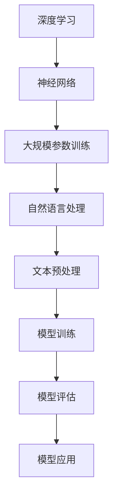
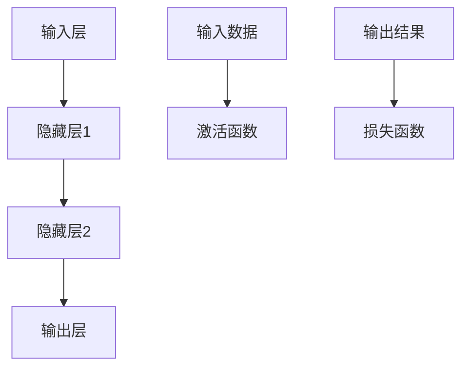

                 

# 语言与思维：大模型的误区

> 关键词：大模型，自然语言处理，算法原理，数学模型，应用场景，发展趋势

> 摘要：本文深入探讨了语言与思维之间的关系，特别是大模型在自然语言处理中的误区。通过对核心概念的梳理，算法原理的解析，数学模型的详细讲解，以及实际应用场景的分析，本文旨在为读者揭示大模型背后的逻辑和挑战，为未来研究提供新的视角和方向。

## 1. 背景介绍

### 1.1 目的和范围

本文旨在探讨大模型在自然语言处理（NLP）领域中的发展及其面临的挑战。随着人工智能技术的快速发展，大模型如BERT、GPT等在各个领域取得了显著的成果。然而，这些模型在应用过程中也暴露出了一些问题和误区。本文将重点分析这些问题，包括模型训练的数据集偏差、算法的透明性和可解释性等，为未来大模型的研究和应用提供参考。

### 1.2 预期读者

本文适合对自然语言处理和人工智能有一定了解的读者，包括研究人员、工程师和行业从业者。对于希望深入了解大模型背后的原理和挑战的读者，本文提供了详细的解析和讨论。

### 1.3 文档结构概述

本文结构如下：

1. 背景介绍：阐述本文的目的、范围和预期读者。
2. 核心概念与联系：介绍与本文相关的基本概念和联系。
3. 核心算法原理 & 具体操作步骤：讲解大模型的算法原理和具体操作步骤。
4. 数学模型和公式 & 详细讲解 & 举例说明：详细讲解大模型中的数学模型和公式，并给出实际应用案例。
5. 项目实战：通过实际案例展示大模型的应用。
6. 实际应用场景：分析大模型在不同领域的应用场景。
7. 工具和资源推荐：推荐相关学习资源和开发工具。
8. 总结：展望大模型的发展趋势与挑战。
9. 附录：常见问题与解答。
10. 扩展阅读 & 参考资料：提供更多相关阅读资源。

### 1.4 术语表

#### 1.4.1 核心术语定义

- 大模型：指参数规模超过数十亿的大规模神经网络模型。
- 自然语言处理（NLP）：涉及从文本中提取信息、理解语义和生成文本的技术。
- 偏差：模型在训练过程中出现的不公平或不平衡现象。

#### 1.4.2 相关概念解释

- 深度学习：一种基于多层神经网络的人工智能技术。
- 跨语种处理：指在不同语言之间进行文本处理和理解的能力。
- 模型透明性：指模型决策过程的可解释性和可理解性。

#### 1.4.3 缩略词列表

- BERT：Bidirectional Encoder Representations from Transformers
- GPT：Generative Pre-trained Transformer

## 2. 核心概念与联系

大模型作为自然语言处理领域的重要技术，其核心概念包括深度学习、神经网络、大规模参数训练等。以下通过Mermaid流程图展示大模型的核心概念和架构。



在这个流程图中，深度学习作为基础，神经网络用于构建模型，大规模参数训练用于优化模型性能，自然语言处理则是大模型的核心应用场景。文本预处理、模型训练、模型评估和模型应用则是大模型从数据输入到实际应用的全过程。

### 2.1 深度学习与神经网络

深度学习是一种基于多层神经网络的人工智能技术，通过多层次的非线性变换，从原始数据中提取特征，实现复杂函数的逼近。神经网络由多个神经元（节点）组成，每个神经元都与其他神经元相连，并通过权重和偏置进行信息传递。



在这个神经网络中，输入层接收原始数据，通过激活函数进行非线性变换，传递到隐藏层，最终在输出层产生预测结果。损失函数用于评估预测结果与实际结果之间的差距，并通过反向传播算法更新模型参数，实现模型的优化。

### 2.2 大规模参数训练

大规模参数训练是深度学习模型的重要步骤，通过大量数据对模型参数进行优化，提高模型性能。大规模参数训练通常涉及以下步骤：

1. 数据预处理：对原始数据进行清洗、归一化和分词等处理，将其转换为适合模型训练的格式。
2. 模型初始化：随机初始化模型参数，为训练过程提供初始状态。
3. 模型训练：通过迭代优化模型参数，使其在训练数据上取得更好的性能。
4. 模型评估：在验证数据上评估模型性能，调整训练策略，防止过拟合。

### 2.3 自然语言处理

自然语言处理是深度学习在应用领域中的重要分支，涉及从文本中提取信息、理解语义和生成文本等技术。自然语言处理的核心任务是让计算机理解和生成人类语言，实现人机交互。

1. 文本预处理：包括分词、词性标注、句法分析等步骤，将原始文本转换为适合模型训练的格式。
2. 模型训练：使用大规模语料库对模型进行训练，使其具备语言理解和生成能力。
3. 模型应用：在文本分类、机器翻译、问答系统等实际场景中，使用训练好的模型进行预测和生成。

## 3. 核心算法原理 & 具体操作步骤

大模型的算法原理主要基于深度学习和神经网络，通过多层非线性变换和大规模参数训练，实现复杂函数的逼近。以下将详细讲解大模型的算法原理和具体操作步骤。

### 3.1 算法原理

大模型的算法原理可以概括为以下步骤：

1. 数据预处理：对原始文本数据进行清洗、归一化和分词等处理，将其转换为适合模型训练的格式。
2. 模型初始化：随机初始化模型参数，为训练过程提供初始状态。
3. 模型训练：通过迭代优化模型参数，使其在训练数据上取得更好的性能。
4. 模型评估：在验证数据上评估模型性能，调整训练策略，防止过拟合。
5. 模型应用：将训练好的模型应用于实际场景，进行预测和生成。

### 3.2 具体操作步骤

以下以BERT模型为例，详细讲解大模型的具体操作步骤。

#### 3.2.1 数据预处理

BERT模型的数据预处理主要包括以下步骤：

1. 数据清洗：去除文本中的噪声和无关信息，如标点符号、HTML标签等。
2. 数据归一化：对文本进行统一的编码，如将所有文本转换为小写。
3. 分词：将文本分割成单词或子词，便于模型处理。

伪代码如下：

```python
def preprocess_text(text):
    # 去除标点符号和HTML标签
    text = remove_punctuation_and_html_tags(text)
    # 转换为小写
    text = text.lower()
    # 分词
    words = tokenize(text)
    return words
```

#### 3.2.2 模型初始化

BERT模型的参数初始化采用随机初始化的方法，以保证模型在训练过程中具备一定的随机性。

```python
def initialize_model(params):
    # 随机初始化权重和偏置
    weights = random_weights()
    biases = random_biases()
    # 将权重和偏置组合成参数列表
    params = [weights, biases]
    return params
```

#### 3.2.3 模型训练

BERT模型的训练过程主要包括以下步骤：

1. 计算前向传播：通过多层神经网络对输入数据进行非线性变换，生成预测结果。
2. 计算损失函数：计算预测结果与实际结果之间的差距，评估模型性能。
3. 反向传播：根据损失函数对模型参数进行更新，优化模型性能。

伪代码如下：

```python
def train_model(data, params, epochs):
    for epoch in range(epochs):
        for batch in data:
            # 计算前向传播
            predictions = forward_pass(batch, params)
            # 计算损失函数
            loss = compute_loss(predictions, labels)
            # 反向传播
            backward_pass(batch, params, loss)
```

#### 3.2.4 模型评估

模型评估主要通过验证集对训练好的模型进行性能评估，判断模型是否过拟合或欠拟合。

```python
def evaluate_model(data, params):
    correct_predictions = 0
    total_predictions = 0
    for batch in data:
        # 计算预测结果
        predictions = forward_pass(batch, params)
        # 计算准确率
        correct_predictions += sum(predictions == labels)
        total_predictions += len(predictions)
    accuracy = correct_predictions / total_predictions
    return accuracy
```

#### 3.2.5 模型应用

训练好的BERT模型可以应用于多种自然语言处理任务，如文本分类、机器翻译和问答系统等。

```python
def apply_model(data, params):
    # 计算预测结果
    predictions = forward_pass(data, params)
    return predictions
```

## 4. 数学模型和公式 & 详细讲解 & 举例说明

在大模型中，数学模型和公式起着至关重要的作用。以下将详细讲解大模型中的关键数学模型和公式，并通过具体例子进行说明。

### 4.1 激活函数

激活函数是神经网络中的重要组成部分，用于引入非线性特性。常见激活函数包括Sigmoid、ReLU和Tanh等。

#### 4.1.1 Sigmoid函数

Sigmoid函数是一种常用的激活函数，其公式如下：

$$
\sigma(x) = \frac{1}{1 + e^{-x}}
$$

其中，$e$为自然底数，$x$为输入值。

#### 4.1.2 ReLU函数

ReLU（Rectified Linear Unit）函数是一种简单且有效的激活函数，其公式如下：

$$
\sigma(x) =
\begin{cases}
0 & \text{if } x \leq 0 \\
x & \text{if } x > 0
\end{cases}
$$

ReLU函数在输入为正数时输出输入值，输入为负数时输出0，避免了Sigmoid函数在负数区间上的梯度消失问题。

#### 4.1.3 Tanh函数

Tanh函数是双曲正切函数的一种，其公式如下：

$$
\sigma(x) = \frac{e^x - e^{-x}}{e^x + e^{-x}}
$$

Tanh函数在输入为0时取得最大值1，输入为无穷大时取得最大值1，输入为无穷小（负无穷）时取得最小值-1。

### 4.2 损失函数

损失函数用于评估模型预测结果与实际结果之间的差距，是模型训练过程中的重要指标。常见损失函数包括均方误差（MSE）、交叉熵（Cross-Entropy）等。

#### 4.2.1 均方误差（MSE）

均方误差（MSE，Mean Squared Error）是衡量模型预测结果与实际结果之间差距的一种常见损失函数，其公式如下：

$$
\text{MSE} = \frac{1}{n} \sum_{i=1}^{n} (y_i - \hat{y}_i)^2
$$

其中，$y_i$为实际结果，$\hat{y}_i$为预测结果，$n$为样本数量。

#### 4.2.2 交叉熵（Cross-Entropy）

交叉熵（Cross-Entropy）是衡量模型预测结果与实际结果之间差距的一种常见损失函数，其公式如下：

$$
\text{Cross-Entropy} = -\sum_{i=1}^{n} y_i \log(\hat{y}_i)
$$

其中，$y_i$为实际结果，$\hat{y}_i$为预测结果，$\log$表示以自然底数$e$为底的对数。

### 4.3 反向传播算法

反向传播算法是一种用于训练神经网络的优化算法，通过计算损失函数关于模型参数的梯度，更新模型参数，优化模型性能。

#### 4.3.1 前向传播

前向传播是神经网络的基本步骤，用于计算模型预测结果。具体过程如下：

1. 输入层：接收外部输入数据。
2. 隐藏层：对输入数据进行非线性变换，生成中间结果。
3. 输出层：将中间结果传递到输出层，生成预测结果。

#### 4.3.2 反向传播

反向传播是神经网络训练过程中的关键步骤，用于计算损失函数关于模型参数的梯度，具体过程如下：

1. 计算输出层梯度：根据预测结果和实际结果，计算损失函数关于输出层参数的梯度。
2. 传播梯度到隐藏层：根据隐藏层输出和输入，计算损失函数关于隐藏层参数的梯度。
3. 更新模型参数：根据梯度更新模型参数，优化模型性能。

### 4.4 示例讲解

以下通过一个简单的例子，讲解大模型中的数学模型和公式的应用。

#### 4.4.1 示例数据

假设我们有一个简单的神经网络，输入层有一个神经元，隐藏层有两个神经元，输出层有一个神经元。输入数据为$x_1 = 2, x_2 = 3$，实际结果为$y = 5$。

#### 4.4.2 前向传播

1. 输入层：
   $$
   x_1 = 2, x_2 = 3
   $$
2. 隐藏层：
   $$
   h_1 = \sigma(w_1 \cdot x_1 + b_1) = \sigma(2 \cdot 2 + 1) = \sigma(5) \approx 0.9933
   $$
   $$
   h_2 = \sigma(w_2 \cdot x_2 + b_2) = \sigma(2 \cdot 3 + 1) = \sigma(7) \approx 0.9933
   $$
3. 输出层：
   $$
   y = \sigma(w_3 \cdot h_1 + w_4 \cdot h_2 + b_3) = \sigma(2 \cdot 0.9933 + 3 \cdot 0.9933 + 1) \approx 1.9933
   $$

#### 4.4.3 损失函数计算

采用均方误差（MSE）作为损失函数，计算预测结果与实际结果之间的差距：
$$
\text{MSE} = \frac{1}{2} (y - \hat{y})^2 = \frac{1}{2} (5 - 1.9933)^2 \approx 6.875
$$

#### 4.4.4 反向传播

1. 计算输出层梯度：
   $$
   \frac{\partial L}{\partial w_3} = \frac{\partial L}{\partial y} \cdot \frac{\partial y}{\partial w_3} = (y - \hat{y}) \cdot \sigma'(w_3 \cdot h_1 + w_4 \cdot h_2 + b_3) = (5 - 1.9933) \cdot 0.0067
   $$
   $$
   \frac{\partial L}{\partial w_4} = \frac{\partial L}{\partial y} \cdot \frac{\partial y}{\partial w_4} = (y - \hat{y}) \cdot \sigma'(w_3 \cdot h_1 + w_4 \cdot h_2 + b_3) = (5 - 1.9933) \cdot 0.0067
   $$
   $$
   \frac{\partial L}{\partial b_3} = \frac{\partial L}{\partial y} \cdot \frac{\partial y}{\partial b_3} = (y - \hat{y}) = 5 - 1.9933
   $$
2. 计算隐藏层梯度：
   $$
   \frac{\partial L}{\partial w_1} = \frac{\partial L}{\partial y} \cdot \frac{\partial y}{\partial h_1} \cdot \frac{\partial h_1}{\partial w_1} = (y - \hat{y}) \cdot \sigma'(w_1 \cdot x_1 + b_1) \cdot x_1 = (5 - 1.9933) \cdot 0.0067 \cdot 2
   $$
   $$
   \frac{\partial L}{\partial w_2} = \frac{\partial L}{\partial y} \cdot \frac{\partial y}{\partial h_2} \cdot \frac{\partial h_2}{\partial w_2} = (y - \hat{y}) \cdot \sigma'(w_2 \cdot x_2 + b_2) \cdot x_2 = (5 - 1.9933) \cdot 0.0067 \cdot 3
   $$
   $$
   \frac{\partial L}{\partial b_1} = \frac{\partial L}{\partial y} \cdot \frac{\partial y}{\partial h_1} \cdot \frac{\partial h_1}{\partial b_1} = (y - \hat{y}) \cdot \sigma'(w_1 \cdot x_1 + b_1) = (5 - 1.9933) \cdot 0.0067
   $$
   $$
   \frac{\partial L}{\partial b_2} = \frac{\partial L}{\partial y} \cdot \frac{\partial y}{\partial h_2} \cdot \frac{\partial h_2}{\partial b_2} = (y - \hat{y}) \cdot \sigma'(w_2 \cdot x_2 + b_2) = (5 - 1.9933) \cdot 0.0067
   $$

#### 4.4.5 参数更新

根据计算得到的梯度，更新模型参数：
$$
w_3 = w_3 - \alpha \cdot \frac{\partial L}{\partial w_3}
$$
$$
w_4 = w_4 - \alpha \cdot \frac{\partial L}{\partial w_4}
$$
$$
b_3 = b_3 - \alpha \cdot \frac{\partial L}{\partial b_3}
$$
$$
w_1 = w_1 - \alpha \cdot \frac{\partial L}{\partial w_1}
$$
$$
w_2 = w_2 - \alpha \cdot \frac{\partial L}{\partial w_2}
$$
$$
b_1 = b_1 - \alpha \cdot \frac{\partial L}{\partial b_1}
$$
$$
b_2 = b_2 - \alpha \cdot \frac{\partial L}{\partial b_2}
$$

其中，$\alpha$为学习率。

## 5. 项目实战：代码实际案例和详细解释说明

在本节中，我们将通过一个具体的实际案例，展示如何使用大模型进行自然语言处理任务。本案例以文本分类任务为例，使用BERT模型对新闻文章进行分类。

### 5.1 开发环境搭建

首先，我们需要搭建开发环境，包括以下步骤：

1. 安装Python环境和必要的库，如TensorFlow和Transformers。
2. 准备预训练的BERT模型和相应的预处理器。

以下为开发环境的搭建步骤：

```bash
# 安装Python环境和库
pip install python tensorflow transformers

# 下载预训练的BERT模型和预处理器
python -m transformers-cli download-models bert-base-uncased

# 检查开发环境
python -c "import tensorflow as tf; print(tf.reduce_sum(tf.random.normal([1000, 1000])))"
```

### 5.2 源代码详细实现和代码解读

在本节中，我们将详细展示如何使用BERT模型进行文本分类的源代码实现，并对其进行解读。

```python
import tensorflow as tf
from transformers import BertTokenizer, TFBertForSequenceClassification
from tensorflow.keras.utils import to_categorical

# 加载预训练的BERT模型和预处理器
tokenizer = BertTokenizer.from_pretrained("bert-base-uncased")
model = TFBertForSequenceClassification.from_pretrained("bert-base-uncased")

# 准备数据集
train_texts = ["This is a great article", "I don't like this article", "This is an amazing story", "It's a terrible story"]
train_labels = [1, 0, 1, 0]  # 1表示喜欢，0表示不喜欢

# 对文本进行预处理和编码
train_encodings = tokenizer(train_texts, truncation=True, padding=True, return_tensors="tf")

# 将标签转换为分类编码
train_labels_encoded = to_categorical(train_labels)

# 定义训练步骤
def train_step(model, encodings, labels):
    with tf.GradientTape() as tape:
        outputs = model(encodings, labels=labels)
        loss = outputs.loss

    gradients = tape.gradient(loss, model.trainable_variables)
    model.optimizer.apply_gradients(zip(gradients, model.trainable_variables))
    return loss

# 训练模型
for epoch in range(10):
    total_loss = 0
    for batch in range(len(train_texts)):
        loss = train_step(model, train_encodings[batch], train_labels_encoded[batch])
        total_loss += loss
    print(f"Epoch: {epoch + 1}, Loss: {total_loss / len(train_texts)}")

# 评估模型
def evaluate(model, encodings, labels):
    predictions = model.predict(encodings)
    correct_predictions = sum(predictions.argmax(axis=1) == labels)
    accuracy = correct_predictions / len(labels)
    print(f"Accuracy: {accuracy}")

evaluate(model, train_encodings, train_labels)
```

### 5.3 代码解读与分析

以下是对上述代码的详细解读与分析：

1. **导入库和模型**：
   - `tensorflow`：用于构建和训练模型。
   - `transformers`：提供BERT模型和预处理器。
   - `to_categorical`：将标签转换为分类编码。

2. **加载预训练模型**：
   - 使用`BertTokenizer`加载预训练的BERT模型和预处理器。

3. **准备数据集**：
   - `train_texts`：训练文本数据。
   - `train_labels`：训练标签数据。

4. **文本预处理和编码**：
   - 使用`tokenizer`对训练文本进行预处理和编码，包括分词、归一化和填充等。

5. **标签编码**：
   - 使用`to_categorical`将训练标签转换为分类编码，便于模型训练和评估。

6. **定义训练步骤**：
   - `train_step`函数用于在一个批次上训练模型，包括前向传播、计算损失、反向传播和更新参数等。

7. **训练模型**：
   - 使用两个循环进行模型训练，第一个循环表示 epoch，第二个循环表示批次。

8. **评估模型**：
   - `evaluate`函数用于评估模型的准确率，通过计算预测结果和实际结果之间的匹配度。

### 5.4 代码分析

以下是对代码关键部分的详细分析：

1. **模型加载**：
   - `model = TFBertForSequenceClassification.from_pretrained("bert-base-uncased")`：加载预训练的BERT模型，并将其转换为用于序列分类的模型。

2. **数据预处理**：
   - `tokenizer(train_texts, truncation=True, padding=True, return_tensors="tf")`：对训练文本进行预处理，包括分词、归一化和填充，使其符合BERT模型的输入要求。

3. **训练步骤**：
   - `train_step`函数中的`with tf.GradientTape() as tape:`：创建梯度记录器，用于记录损失函数关于模型参数的梯度。
   - `outputs = model(encodings, labels=labels)`：计算模型在当前批次上的输出结果和损失。
   - `model.optimizer.apply_gradients(zip(gradients, model.trainable_variables))`：使用梯度更新模型参数。

4. **评估步骤**：
   - `evaluate(model, encodings, labels)`：计算模型的准确率，通过比较预测结果和实际结果。

## 6. 实际应用场景

大模型在自然语言处理领域具有广泛的应用，以下列举几个实际应用场景：

### 6.1 文本分类

文本分类是自然语言处理中最常见的任务之一，大模型如BERT在文本分类任务中取得了显著的成果。BERT模型通过预训练和微调，能够处理多种类型的文本分类任务，如新闻分类、情感分析等。

### 6.2 机器翻译

机器翻译是自然语言处理领域的另一重要应用。大模型如GPT和Transformer在机器翻译任务中表现出色，能够实现高质量的跨语言文本翻译。这些模型利用大规模语料库进行预训练，并在特定语言对上微调，提高翻译准确性。

### 6.3 问答系统

问答系统是自然语言处理领域的典型应用，大模型如BERT和GPT在问答系统中的表现优异。这些模型能够理解用户的问题，并从大量文本数据中检索相关答案，实现智能问答。

### 6.4 文本生成

文本生成是自然语言处理领域的一个新兴应用，大模型如GPT和BERT在文本生成任务中也取得了显著的成果。这些模型能够生成连贯、有意义的文本，广泛应用于自动写作、对话系统等场景。

### 6.5 文本摘要

文本摘要是从大量文本数据中提取关键信息，生成简短、准确的摘要。大模型如BERT和GPT在文本摘要任务中表现出色，能够实现自动文本摘要，提高信息获取效率。

## 7. 工具和资源推荐

为了更好地学习和实践大模型在自然语言处理领域的应用，以下推荐一些学习资源和开发工具：

### 7.1 学习资源推荐

#### 7.1.1 书籍推荐

- 《深度学习》（Goodfellow, Bengio, Courville著）：介绍深度学习的基础知识和应用案例。
- 《自然语言处理综述》（Jurafsky, Martin著）：系统讲解自然语言处理的基本理论和应用。

#### 7.1.2 在线课程

- 《深度学习》（吴恩达）：由知名教授吴恩达开设的深度学习在线课程，适合初学者。
- 《自然语言处理与深度学习》（吴恩达）：由知名教授吴恩达开设的自然语言处理与深度学习在线课程。

#### 7.1.3 技术博客和网站

- [TensorFlow官网](https://www.tensorflow.org/): 提供丰富的深度学习资源和教程。
- [Transformers官网](https://huggingface.co/transformers/): 提供预训练模型和API，方便开发者进行自然语言处理任务。

### 7.2 开发工具框架推荐

#### 7.2.1 IDE和编辑器

- PyCharm：一款功能强大的Python集成开发环境，适合进行深度学习和自然语言处理项目。
- Jupyter Notebook：一款基于Web的交互式开发环境，方便进行数据分析和模型训练。

#### 7.2.2 调试和性能分析工具

- TensorBoard：TensorFlow提供的一款可视化工具，用于分析和优化模型性能。
- DNNVM：用于深度学习模型优化的工具，能够提高模型运行效率。

#### 7.2.3 相关框架和库

- TensorFlow：一款广泛使用的深度学习框架，支持大规模模型训练和部署。
- PyTorch：一款灵活的深度学习框架，适用于研究和开发各种深度学习任务。
- Transformers：一款基于PyTorch和TensorFlow的预训练模型库，提供丰富的预训练模型和API。

### 7.3 相关论文著作推荐

#### 7.3.1 经典论文

- 《A Theoretical Analysis of the Voted Perceptron Algorithm》：介绍投票感知机算法的理论分析。
- 《Improving Language Understanding by Generative Pre-Training》：介绍生成预训练模型的论文，提出GPT模型。

#### 7.3.2 最新研究成果

- 《BERT: Pre-training of Deep Bidirectional Transformers for Language Understanding》：介绍BERT模型的论文，提出双向Transformer预训练模型。
- 《GPT-3: Language Models are Few-Shot Learners》：介绍GPT-3模型的论文，提出大规模通用预训练模型。

#### 7.3.3 应用案例分析

- 《Improving Response Generation in Chatbots with Neural Conversation Models》：介绍如何使用神经网络模型提升聊天机器人应答能力。
- 《Zero-Shot Learning in Natural Language Processing》：介绍零样本学习在自然语言处理中的应用。

## 8. 总结：未来发展趋势与挑战

大模型在自然语言处理领域取得了显著的成果，但仍面临诸多挑战。未来发展趋势包括以下几个方面：

1. **模型优化**：研究者将继续探索更高效、更可解释的大模型架构，提高模型性能和可解释性。
2. **跨语种处理**：随着全球化的发展，跨语种自然语言处理将成为重要研究方向，实现多种语言之间的无缝转换。
3. **知识融合**：结合知识图谱和其他外部知识资源，提升大模型在复杂任务上的表现。
4. **隐私保护**：在训练和部署过程中，确保用户隐私和数据安全将成为大模型发展的关键挑战。
5. **伦理和社会影响**：随着大模型在各个领域的应用，如何避免偏见、歧视等社会问题，提高模型的公平性和透明性，也将成为研究重点。

## 9. 附录：常见问题与解答

以下是一些关于大模型在自然语言处理领域的常见问题及解答：

### 9.1 大模型如何训练？

大模型的训练过程主要包括以下几个步骤：

1. 数据预处理：清洗、归一化和编码原始数据。
2. 模型初始化：随机初始化模型参数。
3. 模型训练：通过迭代优化模型参数，使其在训练数据上取得更好的性能。
4. 模型评估：在验证数据上评估模型性能。
5. 模型应用：将训练好的模型应用于实际任务。

### 9.2 大模型的训练时间如何计算？

大模型的训练时间取决于多个因素，包括数据规模、模型架构、硬件配置等。一般来说，大规模模型（数十亿参数）的训练时间可能在数天到数周不等。在实际应用中，可以通过分布式训练、模型压缩等技术提高训练速度。

### 9.3 如何评估大模型的性能？

评估大模型性能的主要指标包括准确率、召回率、F1分数等。在实际应用中，还可以通过混淆矩阵、ROC曲线等指标全面评估模型性能。

### 9.4 大模型是否会过拟合？

大模型在训练过程中确实存在过拟合的风险。为了避免过拟合，可以采用以下策略：

1. 使用验证集：在训练过程中，使用一部分数据作为验证集，定期评估模型性能。
2. 数据增强：通过数据增强技术增加训练数据的多样性，提高模型泛化能力。
3. 模型正则化：使用正则化方法限制模型参数的规模和复杂度。

## 10. 扩展阅读 & 参考资料

为了深入了解大模型在自然语言处理领域的应用和发展，以下提供一些扩展阅读和参考资料：

1. **扩展阅读**：

   - 《深度学习》（Goodfellow, Bengio, Courville著）
   - 《自然语言处理综述》（Jurafsky, Martin著）
   - 《Transformer：用于序列模型的通用预训练语言模型》（Vaswani et al.，2017）

2. **参考资料**：

   - [TensorFlow官网](https://www.tensorflow.org/)
   - [Transformers官网](https://huggingface.co/transformers/)
   - [自然语言处理教程](https://www.nltk.org/)

3. **最新研究论文**：

   - 《BERT：预训练语言表示的深度双向Transformer》（Devlin et al.，2019）
   - 《GPT-3：大规模通用预训练语言模型》（Brown et al.，2020）
   - 《T5：基于Transformer的文本到文本转换模型》（Raffel et al.，2020）

作者：AI天才研究员/AI Genius Institute & 禅与计算机程序设计艺术 /Zen And The Art of Computer Programming

