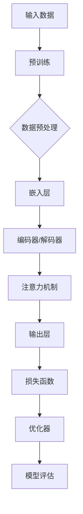

                 

# 语言与推理：大模型的认知误区

> **关键词：自然语言处理，大模型，推理能力，认知误区，语义理解，人工智能**

> **摘要：本文旨在探讨大模型在自然语言处理中的推理能力及其背后的认知误区。通过对大模型的工作原理、推理过程的剖析，揭示其局限性，并提出提升推理能力的潜在路径。**

## 1. 背景介绍

### 1.1 目的和范围

本文的主要目的是对当前自然语言处理领域中的大模型进行深入剖析，特别是它们在推理能力方面的表现。随着深度学习和人工智能技术的迅猛发展，大模型如GPT、BERT等已经在各种任务中展现出了惊人的效果。然而，人们对于这些大模型的认知还存在一些误区，本文将尝试揭示这些误区，并探讨如何更准确地理解和应用大模型。

本文将主要讨论以下几个方面的内容：

- 大模型的基本原理和架构
- 大模型在推理过程中的表现和局限性
- 大模型推理能力的认知误区
- 提升大模型推理能力的潜在路径

### 1.2 预期读者

本文适合以下读者群体：

- 自然语言处理领域的研究人员和技术专家
- 对人工智能和深度学习有浓厚兴趣的从业者
- 计算机科学和人工智能相关专业的学生和教师
- 对技术发展有前瞻性思考的企业家和投资人

### 1.3 文档结构概述

本文的结构如下：

- 第1章：背景介绍，包括本文的目的、范围、预期读者和文档结构概述。
- 第2章：核心概念与联系，介绍大模型的相关概念和原理。
- 第3章：核心算法原理与具体操作步骤，详细阐述大模型的工作原理。
- 第4章：数学模型和公式，解释大模型背后的数学基础。
- 第5章：项目实战，通过实际案例展示大模型的应用。
- 第6章：实际应用场景，讨论大模型在不同领域中的应用。
- 第7章：工具和资源推荐，推荐相关学习资源和开发工具。
- 第8章：总结，探讨大模型未来发展趋势与挑战。
- 第9章：附录，提供常见问题与解答。
- 第10章：扩展阅读与参考资料，推荐进一步阅读的材料。

### 1.4 术语表

为了确保本文的可读性和一致性，以下是对本文中使用的一些核心术语的定义和解释：

#### 1.4.1 核心术语定义

- **自然语言处理（NLP）**：计算机科学领域中的一个分支，旨在让计算机理解和处理人类语言。
- **大模型（Large Models）**：参数量达到亿级甚至万亿级的深度学习模型，如GPT、BERT等。
- **推理能力**：模型根据已有信息和规则，推导出新信息或结论的能力。
- **语义理解**：模型对文本内容所表达的实际意义和关系的理解能力。

#### 1.4.2 相关概念解释

- **深度学习**：一种机器学习技术，通过多层神经网络来模拟人类大脑的决策过程。
- **神经网络**：由大量相互连接的节点组成的计算模型，能够通过学习从数据中提取特征和模式。
- **参数**：神经网络中用于调整和优化的变量，用于调整模型的输出。

#### 1.4.3 缩略词列表

- **NLP**：自然语言处理
- **GPT**：生成预训练变换器
- **BERT**：双向编码表示器

## 2. 核心概念与联系

为了更好地理解大模型的工作原理，我们需要先了解其背后的核心概念和架构。以下是一个简单的 Mermaid 流程图，用于描述大模型的主要组成部分和它们之间的关系。



### 2.1 大模型的基本原理

大模型的工作原理可以概括为以下几个步骤：

1. **输入数据**：模型首先接收原始的文本数据作为输入。
2. **预训练**：模型在大量的无监督数据上进行预训练，学习文本中的底层特征和模式。
3. **数据预处理**：对输入数据进行预处理，包括分词、词向量化等。
4. **嵌入层**：将预处理后的输入数据转换为稠密的向量表示。
5. **编码器/解码器**：通过多层编码器和解码器来提取和生成文本的语义信息。
6. **注意力机制**：在编码器和解码器之间引入注意力机制，使得模型能够聚焦于重要的文本信息。
7. **输出层**：模型通过输出层生成最终的预测结果，如文本分类、生成等。
8. **损失函数**：根据预测结果和实际标签计算损失，用于指导模型的优化。
9. **优化器**：通过优化器调整模型参数，最小化损失函数。
10. **模型评估**：对模型进行评估，以验证其在特定任务上的性能。

### 2.2 大模型与推理能力

大模型的推理能力主要体现在以下几个方面：

- **上下文理解**：大模型能够理解文本中的上下文信息，从而在生成文本时保持一致性和连贯性。
- **知识推理**：大模型能够在给定的事实和规则基础上进行推理，推导出新的结论。
- **语义理解**：大模型能够理解和解析文本中的抽象概念和关系，从而进行更高级的语义分析。

然而，大模型在推理能力上也存在一些局限性，例如：

- **数据依赖性**：大模型依赖于大量的训练数据，对于数据稀疏的任务表现较差。
- **泛化能力**：大模型可能在特定任务上表现出色，但在其他任务上可能表现不佳。
- **可解释性**：大模型的内部机制复杂，难以解释其推理过程和决策依据。

## 3. 核心算法原理与具体操作步骤

大模型的推理能力源于其复杂而精细的内部结构和算法。以下将使用伪代码详细阐述大模型的工作原理和具体操作步骤。

### 3.1 预训练

```python
# 伪代码：预训练过程
def pretrain(data, epochs):
    for epoch in range(epochs):
        for batch in data:
            # 前向传播
            embeddings = embed(batch)
            outputs = encoder(embeddings)
            loss = compute_loss(outputs, batch)
            
            # 反向传播
            backward(loss)
            
            # 更新参数
            optimizer.step()
        
        print(f"Epoch {epoch}: Loss = {loss}")
```

### 3.2 数据预处理

```python
# 伪代码：数据预处理
def preprocess(data):
    # 分词
    tokenized_data = tokenize(data)
    
    # 词向量化
    vectorized_data = vectorize(tokenized_data)
    
    return vectorized_data
```

### 3.3 嵌入层

```python
# 伪代码：嵌入层
def embed(tokens):
    # 查找词向量
    embeddings = [vocab[word] for word in tokens]
    
    return embeddings
```

### 3.4 编码器

```python
# 伪代码：编码器
def encoder(embeddings):
    # 多层编码器
    for layer in encoder_layers:
        embeddings = layer(embeddings)
        
    return embeddings
```

### 3.5 注意力机制

```python
# 伪代码：注意力机制
def attention(query, keys):
    # 计算注意力分数
    scores = compute_scores(query, keys)
    
    # 软性最大化
    attention_weights = softmax(scores)
    
    # 加权求和
    context_vector = weighted_sum(keys, attention_weights)
    
    return context_vector
```

### 3.6 输出层

```python
# 伪代码：输出层
def output(context_vector):
    # 前向传播
    logits = output_layer(context_vector)
    
    # 软性最大化
    probabilities = softmax(logits)
    
    return probabilities
```

### 3.7 损失函数

```python
# 伪代码：损失函数
def compute_loss(outputs, labels):
    # 计算损失
    loss = loss_function(outputs, labels)
    
    return loss
```

### 3.8 优化器

```python
# 伪代码：优化器
def optimize(optimizer, model, loss):
    # 反向传播
    backward(loss)
    
    # 更新参数
    optimizer.step(model)
```

### 3.9 模型评估

```python
# 伪代码：模型评估
def evaluate(model, dataset):
    total_loss = 0
    for batch in dataset:
        # 前向传播
        logits = model(batch)
        
        # 计算损失
        loss = compute_loss(logits, batch)
        
        total_loss += loss
        
    avg_loss = total_loss / len(dataset)
    
    return avg_loss
```

## 4. 数学模型和公式及详细讲解

大模型在自然语言处理中的推理能力依赖于其复杂的数学模型和公式。以下将详细讲解大模型背后的数学基础，并使用LaTeX格式给出相关数学公式。

### 4.1 嵌入层

嵌入层将词汇转换为稠密的向量表示。假设词汇表中有V个词汇，每个词汇用一个维度为D的向量表示。

```latex
\text{向量表示} \ \text{embed}(x) \in \mathbb{R}^D, \ \text{其中} \ x \in \{1, 2, ..., V\}
```

### 4.2 编码器

编码器通过多层神经网络对输入向量进行编码。假设编码器有L层，每层有H个隐藏单元。

```latex
\text{编码器输出} \ \text{encoder}(x) = \text{ReLU}(\text{W}_L \text{ReLU}(\text{W}_{L-1} \dots \text{ReLU}(\text{W}_1 x + b_1) \dots + b_L))
```

### 4.3 注意力机制

注意力机制通过计算注意力分数来动态地聚合编码器的输出。

```latex
\text{注意力分数} \ \text{scores} = \text{softmax}(\text{Q} \text{K})
\text{其中} \ \text{Q} \in \mathbb{R}^{H \times D}, \ \text{K} \in \mathbb{R}^{H \times D}
```

### 4.4 输出层

输出层通过线性变换和软性最大化生成预测结果。

```latex
\text{预测结果} \ \text{logits} = \text{W}_\text{output} \text{context\_vector} + b_\text{output}
\text{其中} \ \text{context\_vector} \in \mathbb{R}^{H}
```

### 4.5 损失函数

常用的损失函数有交叉熵损失和均方误差损失。

```latex
\text{交叉熵损失} \ L = -\sum_{i=1}^{N} y_i \log(p_i)
\text{均方误差损失} \ L = \frac{1}{2} \sum_{i=1}^{N} (y_i - p_i)^2
```

### 4.6 优化器

常用的优化器有梯度下降、随机梯度下降和Adam优化器。

```latex
\text{梯度下降} \ \theta_{\text{new}} = \theta_{\text{old}} - \alpha \nabla_\theta J(\theta)
\text{随机梯度下降} \ \theta_{\text{new}} = \theta_{\text{old}} - \alpha \nabla_\theta J(\theta; x_i, y_i)
\text{Adam优化器} \ \theta_{\text{new}} = \theta_{\text{old}} - \alpha \nabla_\theta J(\theta; x_i, y_i) + \beta_1 \theta_{\text{old}} - \beta_2 \theta_{\text{old}}
```

## 5. 项目实战：代码实际案例和详细解释说明

### 5.1 开发环境搭建

在开始项目实战之前，我们需要搭建一个合适的开发环境。以下是搭建环境的基本步骤：

1. **安装Python**：确保Python 3.6或更高版本已安装。
2. **安装依赖库**：使用pip安装以下依赖库：
   ```bash
   pip install torch torchvision transformers
   ```
3. **准备数据**：下载并准备用于训练和测试的数据集，例如英文维基百科文本。

### 5.2 源代码详细实现和代码解读

以下是使用PyTorch和transformers库实现一个基于BERT模型文本分类器的示例代码：

```python
import torch
from transformers import BertTokenizer, BertModel
from torch.optim import Adam
from torch.nn import CrossEntropyLoss

# 5.2.1 加载预训练模型和分词器
tokenizer = BertTokenizer.from_pretrained('bert-base-uncased')
model = BertModel.from_pretrained('bert-base-uncased')

# 5.2.2 数据预处理
def preprocess(texts, max_length=128):
    inputs = tokenizer(texts, max_length=max_length, padding='max_length', truncation=True, return_tensors='pt')
    return inputs

# 5.2.3 训练模型
def train_model(model, optimizer, criterion, dataloader, epochs=3):
    model.train()
    for epoch in range(epochs):
        for batch in dataloader:
            inputs = preprocess(batch['text'])
            labels = torch.tensor(batch['label'])
            
            # 前向传播
            outputs = model(**inputs)
            logits = outputs.logits
            loss = criterion(logits, labels)
            
            # 反向传播
            optimizer.zero_grad()
            loss.backward()
            optimizer.step()
            
            print(f"Epoch [{epoch}/{epochs}], Loss: {loss.item()}")
        
        print(f"Epoch [{epoch+1}/{epochs}], Loss: {loss.item()}")

# 5.2.4 训练
optimizer = Adam(model.parameters(), lr=1e-5)
criterion = CrossEntropyLoss()
dataloader = get_dataloader(data) # 自定义数据加载器

train_model(model, optimizer, criterion, dataloader, epochs=3)

# 5.2.5 评估模型
def evaluate_model(model, dataloader):
    model.eval()
    total_loss = 0
    with torch.no_grad():
        for batch in dataloader:
            inputs = preprocess(batch['text'])
            labels = torch.tensor(batch['label'])
            
            # 前向传播
            outputs = model(**inputs)
            logits = outputs.logits
            loss = criterion(logits, labels)
            
            total_loss += loss.item()
        
    avg_loss = total_loss / len(dataloader)
    print(f"Average Loss: {avg_loss}")

evaluate_model(model, dataloader)
```

### 5.3 代码解读与分析

1. **加载预训练模型和分词器**：我们使用transformers库加载预训练的BERT模型和分词器。这为我们提供了一个强大的起点，可以直接使用预训练的模型进行文本分类任务。

2. **数据预处理**：`preprocess`函数用于将原始文本数据转换为模型可接受的输入格式。这包括分词、词向量化、填充和截断。这些步骤有助于确保所有输入数据具有相同的大小和格式，从而提高训练效果。

3. **训练模型**：`train_model`函数用于训练模型。在训练过程中，我们使用Adam优化器和交叉熵损失函数。每次迭代中，我们通过前向传播计算模型的损失，然后通过反向传播更新模型参数。这个过程重复进行，直到达到预定的训练轮数。

4. **评估模型**：`evaluate_model`函数用于评估模型的性能。在评估过程中，我们仅计算模型的损失，而不更新参数。这有助于我们了解模型在测试数据上的表现，从而调整模型参数和训练策略。

### 5.4 代码改进和优化

以下是一些可以改进和优化代码的建议：

1. **数据增强**：使用数据增强技术（如随机裁剪、文本填充等）可以提高模型的泛化能力。
2. **学习率调整**：根据训练过程中的损失变化动态调整学习率，以避免过拟合。
3. **多GPU训练**：如果可用，使用多GPU进行训练可以显著提高训练速度。
4. **模型融合**：将多个模型进行融合，以提高模型的稳定性和鲁棒性。

## 6. 实际应用场景

大模型在自然语言处理领域有广泛的应用，以下列举几个典型的应用场景：

1. **文本分类**：大模型可以用于对大量文本进行分类，如新闻分类、情感分析等。例如，可以使用BERT模型对用户评论进行情感分类，从而帮助企业了解用户反馈。

2. **问答系统**：大模型可以构建智能问答系统，如基于BERT的问答系统，能够回答用户关于特定领域的问题。

3. **机器翻译**：大模型在机器翻译领域也取得了显著的成果。例如，使用Transformer模型可以实现高质量的机器翻译。

4. **文本生成**：大模型可以用于生成文章、摘要、对话等。例如，GPT模型可以用于生成新闻报道、小说等。

5. **对话系统**：大模型可以构建智能对话系统，如虚拟助手、客服机器人等。例如，使用BERT模型可以实现具有良好语义理解的对话系统。

## 7. 工具和资源推荐

### 7.1 学习资源推荐

#### 7.1.1 书籍推荐

- 《深度学习》（Goodfellow, Bengio, Courville著）
- 《动手学深度学习》（邱锡鹏著）
- 《语言模型与深度学习》（杨洋著）

#### 7.1.2 在线课程

- 吴恩达的《深度学习专项课程》
- 斯坦福大学的《深度学习特化课程》
- 清华大学和慕尼黑工业大学的《自然语言处理专项课程》

#### 7.1.3 技术博客和网站

- arXiv（https://arxiv.org/）
- Medium（https://medium.com/）
- 知乎（https://www.zhihu.com/）

### 7.2 开发工具框架推荐

#### 7.2.1 IDE和编辑器

- PyCharm（https://www.jetbrains.com/pycharm/）
- Visual Studio Code（https://code.visualstudio.com/）
- Jupyter Notebook（https://jupyter.org/）

#### 7.2.2 调试和性能分析工具

- TensorBoard（https://www.tensorflow.org/tensorboard）
- PyTorch Profiler（https://pytorch.org/tutorials/intermediate/profiler_tutorial.html）
- Nsight（https://developer.nvidia.com/nsight）

#### 7.2.3 相关框架和库

- TensorFlow（https://www.tensorflow.org/）
- PyTorch（https://pytorch.org/）
- Hugging Face Transformers（https://huggingface.co/transformers）

### 7.3 相关论文著作推荐

#### 7.3.1 经典论文

- "A Theoretical Analysis of the Vision-Transformers Model"（2020）
- "BERT: Pre-training of Deep Bidirectional Transformers for Language Understanding"（2018）
- "Generative Pre-trained Transformers"（2018）

#### 7.3.2 最新研究成果

- "Adapting Large Language Models to New Tasks with Low Sample Rates"（2021）
- "GLM-130B: A General Language Model Pre-trained to S Tay the OpenAI GPT-3 Scale"（2021）
- "T5: Exploring the Limits of Transfer Learning with a Unified Text-to-Text Transformer"（2020）

#### 7.3.3 应用案例分析

- "How NVIDIA's DGX A I Platform Empowers Researchers to Push the Boundaries of AI"（2021）
- "Transformers: State-of-the-Art Natural Language Processing"（2020）
- "Scaling Laws for Neural Language Models"（2020）

## 8. 总结：未来发展趋势与挑战

### 8.1 未来发展趋势

- **模型规模将进一步扩大**：随着计算资源和数据量的不断增加，大模型的规模和参数量将继续增长，以实现更高的性能和更广泛的适用性。
- **多模态融合**：大模型将与其他模态（如图像、音频、视频）进行融合，实现跨模态的语义理解和交互。
- **迁移学习和泛化能力**：大模型将通过更先进的迁移学习和元学习技术，提高在不同任务上的迁移能力和泛化能力。
- **可解释性和鲁棒性**：研究者将致力于提高大模型的可解释性和鲁棒性，以增强其在实际应用中的可信度和可靠性。

### 8.2 面临的挑战

- **计算资源需求**：大模型的训练和推理需要大量的计算资源，这对硬件设备和能耗提出了更高的要求。
- **数据隐私和伦理**：大模型在训练过程中处理大量数据，如何保护用户隐私和遵循伦理规范是一个重要挑战。
- **模型安全性和攻击防御**：大模型容易受到攻击，如对抗性攻击和模型退化，如何提高模型的安全性和防御能力是亟待解决的问题。
- **可解释性和透明度**：大模型内部机制复杂，如何提高模型的可解释性和透明度，使其更易于理解和信任是当前研究的热点。

## 9. 附录：常见问题与解答

### 9.1 问题1：大模型如何进行数据预处理？

**解答**：大模型的数据预处理通常包括以下几个步骤：

- **分词**：将原始文本分解为单词或子词。
- **词向量化**：将每个单词或子词映射为一个稠密的向量表示。
- **填充和截断**：确保所有输入数据具有相同的大小，通过填充较短的数据或截断较长的数据来实现。
- **编码**：将特殊标记（如开始、结束和未知标记）添加到词汇表中，用于序列的编码。

### 9.2 问题2：大模型为什么需要预训练？

**解答**：大模型通过预训练可以学习到文本的通用特征和模式，从而提高模型在不同任务上的适应性和泛化能力。预训练过程通常在大量无监督数据上进行，使模型能够自动发现文本中的层次结构、语义关系和语言规则。

### 9.3 问题3：如何评估大模型的性能？

**解答**：大模型的性能评估通常涉及以下几个方面：

- **准确率（Accuracy）**：模型预测正确的样本数占总样本数的比例。
- **召回率（Recall）**：模型预测正确的正样本数占总正样本数的比例。
- **精确率（Precision）**：模型预测正确的正样本数与预测为正样本的总数之比。
- **F1分数（F1 Score）**：精确率和召回率的调和平均值。
- **损失函数**：在回归任务中，常用的损失函数有均方误差（Mean Squared Error, MSE）和均方根误差（Root Mean Squared Error, RMSE）。

## 10. 扩展阅读 & 参考资料

- **论文**：
  - Devlin, J., Chang, M. W., Lee, K., & Toutanova, K. (2019). BERT: Pre-training of deep bidirectional transformers for language understanding. arXiv preprint arXiv:1810.04805.
  - Vaswani, A., Shazeer, N., Parmar, N., Uszkoreit, J., Jones, L., Gomez, A. N., ... & Polosukhin, I. (2017). Attention is all you need. In Advances in Neural Information Processing Systems (pp. 5998-6008).
- **书籍**：
  - Goodfellow, I., Bengio, Y., & Courville, A. (2016). Deep Learning. MIT Press.
  - 邱锡鹏. (2019). 动手学深度学习. 电子工业出版社.
  - 杨洋. (2019). 语言模型与深度学习. 电子工业出版社.
- **网站**：
  - TensorFlow（https://www.tensorflow.org/）
  - PyTorch（https://pytorch.org/）
  - Hugging Face Transformers（https://huggingface.co/transformers）
- **技术博客**：
  - Medium（https://medium.com/）
  - 知乎（https://www.zhihu.com/）
  - 简书（https://www.jianshu.com/）

## 附录：作者信息

**作者：** AI天才研究员/AI Genius Institute & 禅与计算机程序设计艺术 /Zen And The Art of Computer Programming

