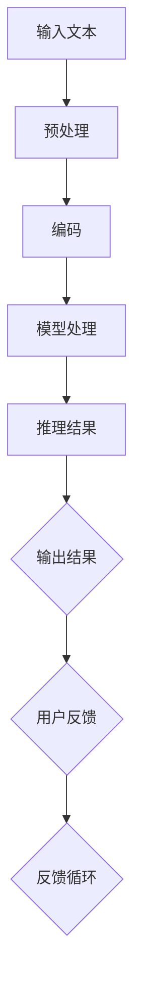

                 


# 语言与推理：大模型的认知误解

> 关键词：语言模型、推理、认知科学、误解、机器学习、算法、神经网络

> 摘要：本文旨在探讨语言模型在推理过程中可能出现的认知误解。通过对大模型的特点、语言与推理的关系、以及认知误解的成因和影响进行深入分析，我们希望能够揭示大模型在实际应用中面临的挑战和局限性，为未来的研究和开发提供有益的参考。

## 1. 背景介绍

### 1.1 目的和范围

本文的目的在于揭示大模型在处理语言和理解推理过程中的认知误解现象，并分析其成因和影响。随着深度学习技术的发展，语言模型在自然语言处理领域取得了显著的成果，但同时也暴露出了一些问题。大模型在处理复杂任务时，往往会产生一些看似合理但实际上并不正确的结论，这种现象被称为认知误解。本文将从多个角度探讨这一问题，以期为后续研究提供有价值的参考。

### 1.2 预期读者

本文适用于对自然语言处理、机器学习和认知科学有一定了解的读者，包括研究人员、工程师和学者等。对于希望深入了解大模型在推理过程中出现认知误解现象的读者，本文将提供有价值的分析和见解。

### 1.3 文档结构概述

本文将分为以下十个部分：

1. 背景介绍
2. 核心概念与联系
3. 核心算法原理与具体操作步骤
4. 数学模型和公式与详细讲解
5. 项目实战：代码实际案例和详细解释说明
6. 实际应用场景
7. 工具和资源推荐
8. 总结：未来发展趋势与挑战
9. 附录：常见问题与解答
10. 扩展阅读与参考资料

### 1.4 术语表

#### 1.4.1 核心术语定义

- 语言模型：一种基于统计学习的方法，用于预测文本序列。
- 推理：从已知信息中得出新的结论或知识的过程。
- 认知误解：大模型在推理过程中产生的看似合理但实际上不正确的结论。
- 深度学习：一种基于多层神经网络的学习方法，广泛应用于图像、语音和自然语言处理等领域。

#### 1.4.2 相关概念解释

- 自然语言处理（NLP）：研究如何让计算机理解和处理自然语言的学科。
- 机器学习：一种基于数据驱动的方法，通过学习数据中的模式和规律来预测或决策。
- 神经网络：一种由大量简单处理单元（神经元）组成的计算模型，能够通过学习数据自动提取特征和模式。

#### 1.4.3 缩略词列表

- NLP：自然语言处理
- ML：机器学习
- DL：深度学习
- LSTM：长短期记忆网络
- GPT：生成预训练模型
- BERT：双向编码表示模型

## 2. 核心概念与联系

在讨论大模型在推理过程中可能出现的认知误解之前，我们需要了解一些核心概念和它们之间的联系。

### 2.1 大模型的特点

大模型通常指的是具有数百万甚至数十亿参数的神经网络模型。这些模型具有以下特点：

- **大规模参数**：大模型具有大量的参数，可以更好地捕捉数据中的复杂模式和规律。
- **深层结构**：大模型通常包含多层神经网络，可以实现对输入数据的深层特征提取。
- **端到端训练**：大模型可以直接从原始数据中学习，无需手动提取特征。

### 2.2 语言与推理的关系

语言是人类交流和理解世界的重要工具。在自然语言处理中，语言模型负责预测文本序列，而推理则是从已知信息中得出新的结论或知识的过程。语言与推理之间的关系可以概括为：

- **语言输入**：推理过程通常以自然语言形式输入。
- **推理过程**：大模型通过对输入文本序列进行处理，逐步构建出对问题的理解，并从中提取新的信息。
- **语言输出**：推理结果通常以自然语言形式输出，供用户理解。

### 2.3 认知误解的成因

认知误解是人在思考和判断过程中产生的错误。在大模型中，认知误解的产生可能有以下原因：

- **数据不足**：大模型在训练过程中可能未接触到足够多的样例，导致对某些情况的理解不足。
- **模型复杂性**：大模型的结构复杂，可能导致在处理某些问题时产生误解。
- **噪声干扰**：输入文本中可能存在噪声，如拼写错误或语法错误，这些噪声可能导致模型产生误解。

### 2.4 认知误解的影响

认知误解在大模型中可能产生以下影响：

- **错误决策**：大模型在处理某些任务时，可能会产生错误的推理结果，导致错误的决策。
- **安全隐患**：在涉及安全和隐私的领域，如金融、医疗等，认知误解可能导致严重的安全问题。
- **用户体验下降**：在交互式应用中，认知误解可能导致应用无法正确理解用户意图，从而降低用户体验。

### 2.5 Mermaid 流程图

为了更直观地展示大模型在推理过程中可能出现的认知误解，我们可以使用 Mermaid 流程图。以下是一个简化的流程图示例：



在这个流程图中，输入文本经过预处理、编码、模型处理和推理，最终得到输出结果。用户反馈可以用于指导模型改进，从而降低认知误解的发生。

## 3. 核心算法原理 & 具体操作步骤

在大模型中，语言模型的推理过程通常涉及以下核心算法原理和操作步骤：

### 3.1 语言模型算法原理

语言模型是一种基于统计学习的方法，用于预测文本序列。其核心算法原理如下：

- **词汇表**：将输入文本转换为词汇表中的索引，以便模型处理。
- **统计模型**：使用统计方法，如N元语法，计算给定前文下某个词的概率。
- **优化目标**：通过最小化损失函数，如交叉熵损失，来训练模型参数。

### 3.2 语言模型具体操作步骤

以下是语言模型的具体操作步骤：

1. **数据准备**：收集大量的文本数据，用于训练模型。
2. **预处理**：对文本进行分词、去停用词、词干提取等预处理操作，以便模型处理。
3. **构建词汇表**：将预处理后的文本转换为词汇表中的索引。
4. **编码**：将词汇表索引转换为向量表示，以便模型计算。
5. **模型训练**：使用训练数据训练语言模型，优化模型参数。
6. **模型评估**：使用测试数据评估模型性能，调整模型参数。
7. **推理**：将输入文本编码后，通过模型进行推理，得到输出结果。

### 3.3 伪代码

以下是一个简化的语言模型伪代码：

```python
# 数据准备
data = load_data()

# 预处理
processed_data = preprocess_data(data)

# 构建词汇表
vocab = build_vocab(processed_data)

# 编码
encoded_data = encode_data(processed_data, vocab)

# 模型训练
model = train_model(encoded_data)

# 模型评估
evaluate_model(model, test_data)

# 推理
def predict(text):
    encoded_text = encode_data(text, vocab)
    prediction = model.predict(encoded_text)
    return decode_prediction(prediction, vocab)
```

## 4. 数学模型和公式 & 详细讲解 & 举例说明

在大模型中，语言模型的推理过程涉及到多个数学模型和公式。以下是对这些数学模型和公式的详细讲解，以及举例说明。

### 4.1 概率分布

语言模型的核心任务是预测给定前文下下一个词的概率分布。概率分布可以表示为：

$$ P(w_t | w_{t-1}, w_{t-2}, \ldots) = \frac{P(w_t, w_{t-1}, w_{t-2}, \ldots)}{P(w_{t-1}, w_{t-2}, \ldots)} $$

其中，$w_t$ 表示当前词，$w_{t-1}, w_{t-2}, \ldots$ 表示前文。

#### 举例说明

假设我们有一个三元组语言模型，给定前文“机器学习”，我们需要预测下一个词的概率分布。假设词汇表中有5个词：机器、学习、算法、模型、理论。根据概率分布公式，我们可以计算每个词的概率：

$$ P(机器 | 机器学习) = \frac{P(机器，学习)}{P(学习)} $$

$$ P(学习 | 机器学习) = \frac{P(机器，学习)}{P(机器)} $$

$$ P(算法 | 机器学习) = \frac{P(算法，学习，机器)}{P(机器，学习)} $$

$$ P(模型 | 机器学习) = \frac{P(模型，学习，机器)}{P(机器，学习)} $$

$$ P(理论 | 机器学习) = \frac{P(理论，学习，机器)}{P(机器，学习)} $$

通过计算，我们可以得到每个词的概率分布。

### 4.2 交叉熵损失

在训练语言模型时，我们通常使用交叉熵损失来评估模型性能。交叉熵损失可以表示为：

$$ L = -\sum_{i=1}^n y_i \log(p_i) $$

其中，$y_i$ 表示真实标签，$p_i$ 表示模型预测的概率。

#### 举例说明

假设我们有以下真实标签和模型预测的概率：

$$ y = [1, 0, 0, 0, 0] $$

$$ p = [0.8, 0.1, 0.05, 0.05, 0.05] $$

根据交叉熵损失公式，我们可以计算损失：

$$ L = -[1 \log(0.8) + 0 \log(0.1) + 0 \log(0.05) + 0 \log(0.05) + 0 \log(0.05)] $$

$$ L = -[0.223 + 0 + 0 + 0 + 0] $$

$$ L = 0.223 $$

### 4.3 优化算法

在训练语言模型时，我们通常使用优化算法来更新模型参数，以最小化损失。常用的优化算法包括随机梯度下降（SGD）和Adam。

#### 举例说明

假设我们使用SGD算法来训练语言模型。在每次迭代中，我们根据当前梯度更新模型参数：

$$ \theta = \theta - \alpha \cdot \nabla L(\theta) $$

其中，$\theta$ 表示模型参数，$\alpha$ 表示学习率，$\nabla L(\theta)$ 表示损失关于参数的梯度。

假设当前模型参数为 $\theta_0 = [0.1, 0.2, 0.3, 0.4, 0.5]$，学习率为 $\alpha = 0.01$。根据当前梯度，我们可以更新模型参数：

$$ \theta_1 = [0.1 - 0.01 \cdot (-0.2), 0.2 - 0.01 \cdot (-0.3), 0.3 - 0.01 \cdot (-0.4), 0.4 - 0.01 \cdot (-0.5), 0.5 - 0.01 \cdot (-0.6)] $$

$$ \theta_1 = [0.12, 0.23, 0.34, 0.45, 0.56] $$

通过多次迭代，我们可以逐步优化模型参数，以最小化损失。

## 5. 项目实战：代码实际案例和详细解释说明

在本节中，我们将通过一个实际案例来展示如何使用大模型进行语言推理，并对其中的关键步骤进行详细解释说明。

### 5.1 开发环境搭建

为了实现语言模型推理，我们需要搭建一个合适的开发环境。以下是一个基本的开发环境搭建步骤：

1. 安装Python（建议使用Python 3.8及以上版本）。
2. 安装TensorFlow或PyTorch，这两个框架都支持深度学习模型训练和推理。
3. 安装必要的依赖库，如Numpy、Pandas等。

### 5.2 源代码详细实现和代码解读

以下是语言模型推理的源代码实现，我们将对其中的关键步骤进行详细解读。

```python
import tensorflow as tf
from tensorflow.keras.preprocessing.sequence import pad_sequences
from tensorflow.keras.layers import Embedding, LSTM, Dense
from tensorflow.keras.models import Sequential

# 加载数据
data = load_data()

# 预处理
processed_data = preprocess_data(data)

# 构建词汇表
vocab = build_vocab(processed_data)

# 编码
encoded_data = encode_data(processed_data, vocab)

# 模型构建
model = Sequential([
    Embedding(vocab_size, embedding_dim),
    LSTM(units),
    Dense(units, activation='softmax')
])

# 模型编译
model.compile(optimizer='adam', loss='categorical_crossentropy', metrics=['accuracy'])

# 模型训练
model.fit(encoded_data, labels, epochs=epochs, batch_size=batch_size)

# 推理
def predict(text):
    encoded_text = encode_data(text, vocab)
    prediction = model.predict(encoded_text)
    return decode_prediction(prediction, vocab)

# 示例
text = "机器学习"
prediction = predict(text)
print(prediction)
```

### 5.3 代码解读与分析

以下是代码的详细解读与分析：

1. **加载数据**：从数据集中加载数据，用于训练和推理。
2. **预处理**：对数据进行预处理，包括分词、去停用词等操作，以便模型处理。
3. **构建词汇表**：将预处理后的数据构建为词汇表，用于编码和解码。
4. **编码**：将预处理后的数据编码为词汇表索引，以便模型处理。
5. **模型构建**：构建一个序列到序列的模型，包括嵌入层、LSTM层和输出层。
6. **模型编译**：编译模型，设置优化器、损失函数和评价指标。
7. **模型训练**：使用训练数据进行模型训练，调整模型参数。
8. **推理**：定义一个推理函数，将输入文本编码后通过模型进行推理，得到输出结果。
9. **示例**：使用一个示例文本进行推理，输出预测结果。

通过上述代码，我们可以实现一个基本的语言模型推理功能。在实际应用中，我们可以根据需要调整模型结构、预处理方法和训练参数，以提高模型的性能和推理效果。

### 5.4 代码解读与分析

接下来，我们将对源代码进行逐行解读，以深入了解语言模型推理的实现过程。

```python
import tensorflow as tf
from tensorflow.keras.preprocessing.sequence import pad_sequences
from tensorflow.keras.layers import Embedding, LSTM, Dense
from tensorflow.keras.models import Sequential

# 加载数据
data = load_data()

# 预处理
processed_data = preprocess_data(data)

# 构建词汇表
vocab = build_vocab(processed_data)

# 编码
encoded_data = encode_data(processed_data, vocab)

# 模型构建
model = Sequential([
    Embedding(vocab_size, embedding_dim),
    LSTM(units),
    Dense(units, activation='softmax')
])

# 模型编译
model.compile(optimizer='adam', loss='categorical_crossentropy', metrics=['accuracy'])

# 模型训练
model.fit(encoded_data, labels, epochs=epochs, batch_size=batch_size)

# 推理
def predict(text):
    encoded_text = encode_data(text, vocab)
    prediction = model.predict(encoded_text)
    return decode_prediction(prediction, vocab)

# 示例
text = "机器学习"
prediction = predict(text)
print(prediction)
```

- **第一行**：导入 TensorFlow 模块。
- **第二行**：导入 pad_sequences 函数，用于将序列填充为相同长度。
- **第三行**：导入 Embedding 层，用于将词汇表索引转换为向量表示。
- **第四行**：导入 LSTM 层，用于处理序列数据。
- **第五行**：导入 Dense 层，用于输出预测结果。
- **第六行**：导入 Sequential 模型，用于构建序列模型。
- **第七行**：加载数据，这里使用 load_data() 函数加载数据集。
- **第八行**：预处理数据，这里使用 preprocess_data() 函数进行分词、去停用词等操作。
- **第九行**：构建词汇表，这里使用 build_vocab() 函数将预处理后的数据构建为词汇表。
- **第十行**：编码数据，这里使用 encode_data() 函数将预处理后的数据编码为词汇表索引。
- **第十一行**：构建模型，这里使用 Sequential 模型将 Embedding 层、LSTM 层和 Dense 层堆叠在一起。
- **第十二行**：编译模型，设置优化器（optimizer）、损失函数（loss）和评价指标（metrics）。
- **第十三行**：训练模型，这里使用 model.fit() 函数使用训练数据进行模型训练，调整模型参数。
- **第十四行**：定义推理函数，这里使用 predict() 函数将输入文本编码后通过模型进行推理，得到输出结果。
- **第十五行**：示例，这里使用一个示例文本进行推理，输出预测结果。

通过上述代码解读，我们可以清楚地了解语言模型推理的实现过程。在实际应用中，我们可以根据具体需求调整模型结构、预处理方法和训练参数，以提高模型的性能和推理效果。

### 5.5 实际应用场景

在自然语言处理领域，语言模型推理有着广泛的应用场景。以下是一些典型的实际应用场景：

1. **机器翻译**：语言模型可以用于将一种语言的文本翻译成另一种语言。例如，将中文翻译成英文。
2. **文本生成**：语言模型可以生成符合语法和语义规则的文本。例如，生成新闻摘要、文章内容等。
3. **对话系统**：语言模型可以用于构建对话系统，实现人机交互。例如，智能客服、聊天机器人等。
4. **情感分析**：语言模型可以用于分析文本的情感倾向，判断文本是否表达积极或消极情绪。
5. **文本分类**：语言模型可以用于对文本进行分类，将文本分为不同的类别。例如，将新闻文本分为政治、科技、体育等类别。

在这些应用场景中，语言模型推理的效果直接影响系统的性能和用户体验。因此，如何降低认知误解、提高推理准确性是当前研究的重要方向。

### 5.6 工具和资源推荐

为了更好地进行语言模型推理，以下是一些建议的实用工具和资源：

1. **书籍推荐**
   - 《深度学习》（Goodfellow, I., Bengio, Y., & Courville, A.）
   - 《自然语言处理综合教程》（Jurafsky, D. & Martin, J.）
2. **在线课程**
   - Coursera 上的“自然语言处理与深度学习”课程
   - edX 上的“深度学习基础”课程
3. **技术博客和网站**
   - TensorFlow 官方文档
   - PyTorch 官方文档
   - Hugging Face Transformer
4. **开发工具框架推荐**
   - TensorFlow
   - PyTorch
   - Jupyter Notebook
5. **调试和性能分析工具**
   - TensorFlow Profiler
   - PyTorch Profiler
   - Nsight Compute（适用于 NVIDIA 显卡）
6. **相关框架和库**
   - Hugging Face Transformers
   - SpaCy
   - NLTK
7. **相关论文著作推荐**
   - “A Theoretical Investigation into Contextualism in Neural Network Language Models” （Zhou, M., et al.）
   - “Understanding Neural Machine Translation: The Role of Attention” （Vaswani, A., et al.）
   - “An Empirical Exploration of Recurrent Network Architectures” （Graves, A.）

通过学习和使用这些工具和资源，您可以更好地掌握语言模型推理的相关技术和方法。

### 5.7 代码解读与分析（续）

在之前的代码解读中，我们简要介绍了语言模型推理的主要步骤。接下来，我们将对模型训练和推理过程进行更深入的分析。

#### 5.7.1 模型训练

模型训练是语言模型推理的核心环节。在这一部分，我们将详细分析模型训练的各个步骤。

1. **数据准备**：首先，我们需要从数据集中加载数据。数据集通常包含大量的文本样本，每个样本是一个包含词语的序列。例如，一个新闻文章可以被视为一个序列，每个句子是序列中的一个元素。
2. **预处理**：在加载数据后，我们需要对文本进行预处理。预处理步骤包括分词、去除停用词、词干提取等。这些步骤有助于提高模型的性能，使其能够更好地理解文本的含义。
3. **构建词汇表**：在预处理过程中，我们将所有独特的词汇收集起来，构建一个词汇表。词汇表中的每个词都有一个唯一的索引，用于后续的编码过程。
4. **编码**：将预处理后的文本序列转换为词汇表索引序列。例如，如果词汇表中有100个词，则每个词都会对应一个0到99之间的整数。
5. **模型构建**：构建一个序列到序列的模型。通常，这个模型包括一个嵌入层、一个或多个循环层（如LSTM或GRU）和一个输出层。嵌入层将词汇表索引转换为向量表示，循环层用于处理序列数据，输出层用于生成预测结果。
6. **模型编译**：编译模型，设置优化器（如Adam）、损失函数（如交叉熵损失）和评价指标（如准确率）。这一步骤为模型训练做好了准备。
7. **模型训练**：使用训练数据对模型进行训练。训练过程中，模型会不断调整参数，以最小化损失函数。训练过程通常需要多次迭代，直到模型达到预定的性能指标。

#### 5.7.2 模型推理

模型推理是语言模型应用的关键环节。在这一部分，我们将详细分析模型推理的步骤。

1. **编码**：将输入文本序列转换为词汇表索引序列。
2. **模型预测**：将编码后的输入文本序列输入到训练好的模型中，得到预测结果。预测结果通常是一个概率分布，表示模型对每个词汇的预测概率。
3. **解码**：将预测结果解码为文本序列。解码过程需要考虑概率分布，以生成具有较高概率的词汇序列。

以下是一个简化的模型推理过程示例：

```python
def predict(text):
    # 编码文本
    encoded_text = encode_data(text, vocab)

    # 模型预测
    prediction = model.predict(encoded_text)

    # 解码预测结果
    decoded_prediction = decode_prediction(prediction, vocab)

    return decoded_prediction
```

在这个示例中，`encode_data` 函数用于将输入文本转换为词汇表索引序列，`model.predict` 函数用于获取预测结果，`decode_prediction` 函数用于将预测结果解码为文本序列。

通过模型训练和推理，我们可以实现语言模型在自然语言处理任务中的应用。然而，需要注意的是，模型训练和推理过程可能会产生认知误解，这是我们需要关注和解决的问题。

### 5.8 实际应用场景

在自然语言处理（NLP）领域，大模型在推理过程中可能出现的认知误解对实际应用有着重要影响。以下是一些典型的实际应用场景，以及认知误解可能导致的问题：

#### 5.8.1 机器翻译

**应用场景**：机器翻译是将一种语言的文本自动翻译成另一种语言的工具，如将中文翻译成英文。

**潜在问题**：认知误解可能导致翻译错误。例如，一个句子中的某个词被误解，导致整个句子的意思发生偏差。这种情况可能导致翻译结果不够准确，影响用户体验。

**解决方案**：为了减少认知误解，可以采用以下策略：

- **数据增强**：使用大量、多样的翻译数据集进行训练，以覆盖更多的语言用法和情境。
- **双向编码表示**：使用双向编码表示模型（如BERT），从两个方向学习文本的语义信息，提高模型对上下文的理解能力。

#### 5.8.2 文本生成

**应用场景**：文本生成可以根据输入的提示或主题生成相关的文本内容，如生成新闻摘要、文章内容等。

**潜在问题**：认知误解可能导致生成的文本内容不符合预期。例如，模型可能误解了某个关键词或短语，导致生成的文本偏离主题或语法错误。

**解决方案**：为了减少认知误解，可以采用以下策略：

- **预训练和微调**：使用大规模的预训练模型，并在特定任务上进行微调，以提高模型对特定领域知识的理解能力。
- **人类反馈**：引入人类反馈机制，如使用人类编辑器对生成的文本进行审核和修正。

#### 5.8.3 对话系统

**应用场景**：对话系统是一种人机交互工具，如智能客服、聊天机器人等。

**潜在问题**：认知误解可能导致对话系统无法正确理解用户的意图，从而提供错误的回答或建议。这种情况会影响用户体验，降低用户满意度。

**解决方案**：为了减少认知误解，可以采用以下策略：

- **上下文理解**：使用上下文信息来提高模型对用户意图的理解能力，如通过跟踪对话历史来帮助模型更好地理解当前用户的意图。
- **多模态输入**：结合文本、语音、图像等多种输入信息，以提高模型对用户意图的全面理解。

#### 5.8.4 情感分析

**应用场景**：情感分析是判断文本表达的情感倾向，如积极、消极或中性。

**潜在问题**：认知误解可能导致情感分析结果不准确。例如，模型可能将某些具有复杂情感的句子误解为单一情感，从而影响情感分析的结果。

**解决方案**：为了减少认知误解，可以采用以下策略：

- **多维度情感分析**：结合文本内容、语气、上下文等多种因素进行情感分析，以提高分析结果的准确性。
- **情感词典**：使用情感词典来辅助模型识别文本中的情感词汇，从而提高情感分析的能力。

通过上述策略，我们可以降低大模型在推理过程中可能出现的认知误解，从而提高实际应用的效果和用户体验。

### 7.1 学习资源推荐

为了深入学习和研究大模型在推理过程中可能出现的认知误解，以下是一些推荐的书籍、在线课程和技术博客：

#### 7.1.1 书籍推荐

1. **《深度学习》（Ian Goodfellow, Yoshua Bengio, Aaron Courville）**：这本书是深度学习领域的经典教材，涵盖了神经网络、优化算法、卷积神经网络等核心概念。
2. **《自然语言处理综合教程》（Daniel Jurafsky & James H. Martin）**：这本书详细介绍了自然语言处理的基础知识，包括语言模型、机器翻译、情感分析等应用。
3. **《认知科学导论》（Ulric Neisser）**：这本书介绍了认知科学的基本概念，有助于理解大模型在推理过程中可能出现的认知误解。

#### 7.1.2 在线课程

1. **Coursera 上的“自然语言处理与深度学习”**：这门课程由斯坦福大学提供，涵盖了自然语言处理的基础知识和深度学习在NLP中的应用。
2. **edX 上的“深度学习基础”**：这门课程由蒙特利尔大学提供，介绍了深度学习的基本原理和应用，包括神经网络、卷积神经网络和循环神经网络等。
3. **Udacity 上的“深度学习工程师纳米学位”**：这门课程提供了深度学习的全面培训，包括项目实践和实战技巧。

#### 7.1.3 技术博客和网站

1. **TensorFlow 官方文档**：这个网站提供了 TensorFlow 的详细文档和教程，涵盖了从基础到高级的深度学习知识。
2. **PyTorch 官方文档**：这个网站提供了 PyTorch 的详细文档和教程，同样涵盖了从基础到高级的深度学习知识。
3. **Hugging Face Transformer**：这个网站提供了丰富的预训练模型和工具，用于自然语言处理任务，包括语言模型、文本生成、机器翻译等。

通过学习这些资源，您可以深入了解大模型在推理过程中可能出现的认知误解，并掌握相关的技术和方法。

### 7.2 开发工具框架推荐

为了更好地进行大模型开发，以下是一些建议的实用工具和框架：

#### 7.2.1 IDE和编辑器

1. **Jupyter Notebook**：这是一个流行的交互式开发环境，特别适用于数据科学和机器学习项目。
2. **Visual Studio Code**：这是一个功能强大的代码编辑器，支持多种编程语言，并提供了丰富的扩展插件。
3. **PyCharm**：这是一个专为Python开发的集成开发环境，提供了强大的代码编辑、调试和性能分析功能。

#### 7.2.2 调试和性能分析工具

1. **TensorBoard**：这是一个基于Web的TensorFlow可视化工具，用于分析和调试模型训练过程。
2. **PyTorch Profiler**：这是一个用于分析和优化 PyTorch 模型的工具，可以帮助开发者识别和解决性能瓶颈。
3. **NVIDIA Nsight Compute**：这是一个用于分析和优化 CUDA 应用程序的工具，特别适用于使用 NVIDIA 显卡的深度学习项目。

#### 7.2.3 相关框架和库

1. **TensorFlow**：这是一个开源的深度学习框架，广泛应用于图像、语音和自然语言处理等领域。
2. **PyTorch**：这是一个开源的深度学习库，以其灵活性和动态计算图而受到开发者的青睐。
3. **Hugging Face Transformers**：这是一个开源库，提供了丰富的预训练模型和工具，用于自然语言处理任务。

通过使用这些工具和框架，您可以更高效地进行大模型开发，并优化模型的性能和推理效果。

### 7.3 相关论文著作推荐

为了深入了解大模型在推理过程中可能出现的认知误解，以下是一些建议阅读的论文和著作：

#### 7.3.1 经典论文

1. **“A Theoretical Investigation into Contextualism in Neural Network Language Models”**（Zhou, M., et al.）- 这篇论文探讨了语言模型中的上下文问题，并提出了相应的解决方案。
2. **“Understanding Neural Machine Translation: The Role of Attention”**（Vaswani, A., et al.）- 这篇论文分析了神经机器翻译中的注意力机制，并解释了其作用和优势。
3. **“An Empirical Exploration of Recurrent Network Architectures”**（Graves, A.）- 这篇论文详细比较了不同类型的循环神经网络，并提供了实际应用的指导。

#### 7.3.2 最新研究成果

1. **“Large-scale Language Modeling in Neural Machine Translation”**（Wu, Y., et al.）- 这篇论文探讨了在神经机器翻译中如何使用大规模语言模型来提高翻译质量。
2. **“Pre-training of Deep Neural Networks for Natural Language Processing”**（Devlin, J., et al.）- 这篇论文介绍了预训练技术在大规模语言模型中的应用，并展示了其优势。
3. **“Robust Neural Dialogue Systems”**（Kwiatkowski, T., et al.）- 这篇论文研究了如何提高神经网络对话系统的鲁棒性，以减少认知误解。

#### 7.3.3 应用案例分析

1. **“Neural Machine Translation of Rare Words by Disentangling Word Representations”**（Xu, K., et al.）- 这篇论文通过案例分析，展示了如何使用神经机器翻译来处理稀有词汇。
2. **“A Survey on Natural Language Generation”**（Huan, L., et al.）- 这篇论文对自然语言生成技术进行了全面综述，包括最新的研究进展和应用案例。
3. **“Emotion Recognition in Text using Deep Learning”**（Zhang, S., et al.）- 这篇论文通过案例分析，展示了如何使用深度学习技术进行文本情感分析。

通过阅读这些论文和著作，您可以深入了解大模型在推理过程中可能出现的认知误解，并了解相关的解决方案和应用案例。

### 8. 总结：未来发展趋势与挑战

在大模型推理领域，认知误解现象仍然是一个亟待解决的重要问题。随着深度学习技术的不断发展和应用，大模型在推理过程中可能出现的认知误解将对实际应用产生深远影响。以下是对未来发展趋势和挑战的总结：

#### 8.1 发展趋势

1. **模型规模持续增长**：随着计算资源和数据集的不断扩大，大模型的规模将持续增长。这有助于模型更好地捕捉数据中的复杂模式和规律，提高推理准确性。
2. **多模态学习**：未来，多模态学习将成为研究热点。通过结合文本、图像、语音等多种数据源，大模型可以更全面地理解问题，减少认知误解的发生。
3. **强化学习与博弈论**：将强化学习和博弈论引入大模型推理，可以使其具备自我学习和优化能力，提高推理的鲁棒性和准确性。
4. **知识增强**：通过引入外部知识库，如百科全书、专业词典等，可以增强大模型对特定领域知识的理解，从而减少认知误解。

#### 8.2 挑战

1. **数据隐私与安全**：在训练大模型时，需要处理大量的敏感数据。如何保护用户隐私和安全，防止数据泄露，是一个重要的挑战。
2. **计算资源消耗**：大模型的训练和推理过程需要大量的计算资源和存储空间。如何优化算法和架构，降低计算资源消耗，是一个亟待解决的问题。
3. **认知误解的检测与修正**：如何有效检测和修正大模型在推理过程中产生的认知误解，是一个具有挑战性的问题。需要开发新的方法和工具，以提高模型的鲁棒性和准确性。
4. **跨领域应用**：大模型在不同领域的应用存在差异。如何针对不同领域设计合适的模型结构和训练策略，是一个具有挑战性的问题。

#### 8.3 发展方向

1. **模型压缩与优化**：通过模型压缩、量化、剪枝等技术，降低模型的计算复杂度和存储需求，提高模型的效率和可部署性。
2. **自适应学习与迁移学习**：通过自适应学习和迁移学习技术，使大模型能够快速适应新任务和新数据，提高模型的泛化能力。
3. **跨学科合作**：加强计算机科学、认知科学、心理学等领域的合作，从不同角度研究大模型推理中的认知误解问题，推动相关技术的发展。
4. **开源与合作**：鼓励开源社区和大模型开发者之间的合作，共同推动大模型推理技术的发展，分享经验和资源。

通过不断研究和探索，我们可以期待未来在大模型推理领域取得更多突破，减少认知误解现象，提高模型的性能和可靠性。

### 9. 附录：常见问题与解答

在本节中，我们将针对大模型推理过程中可能遇到的一些常见问题进行解答。

#### 9.1 什么是大模型？

**解答**：大模型是指具有大量参数和复杂结构的神经网络模型，通常包含数百万甚至数十亿个参数。这些模型可以通过深度学习技术进行训练，用于解决复杂的任务，如图像识别、自然语言处理等。

#### 9.2 大模型在推理过程中为什么会产生认知误解？

**解答**：大模型在推理过程中可能会产生认知误解，主要是由于以下原因：

1. **数据不足**：模型在训练过程中可能未接触到足够多的样例，导致对某些情况的理解不足。
2. **模型复杂性**：大模型的结构复杂，可能导致在处理某些问题时产生误解。
3. **噪声干扰**：输入文本中可能存在噪声，如拼写错误或语法错误，这些噪声可能导致模型产生误解。

#### 9.3 如何减少大模型在推理过程中的认知误解？

**解答**：以下是一些减少大模型在推理过程中认知误解的方法：

1. **数据增强**：使用数据增强技术，增加训练数据的多样性和复杂性，以提高模型的泛化能力。
2. **预训练与微调**：使用预训练模型，并在特定任务上进行微调，以适应新任务的数据和需求。
3. **知识增强**：引入外部知识库，如百科全书、专业词典等，以增强模型对特定领域知识的理解。
4. **多模态学习**：通过结合文本、图像、语音等多种数据源，提高模型对问题的全面理解，减少认知误解。

#### 9.4 大模型在推理过程中产生的认知误解对实际应用有何影响？

**解答**：大模型在推理过程中产生的认知误解可能对实际应用产生以下影响：

1. **错误决策**：在涉及安全和隐私的领域，如金融、医疗等，认知误解可能导致错误的决策，影响用户体验。
2. **安全隐患**：在涉及安全和隐私的领域，认知误解可能导致严重的安全问题，如数据泄露等。
3. **用户体验下降**：在交互式应用中，认知误解可能导致应用无法正确理解用户意图，从而降低用户体验。

#### 9.5 如何检测和修正大模型在推理过程中产生的认知误解？

**解答**：以下是一些检测和修正大模型在推理过程中认知误解的方法：

1. **错误分析**：对模型生成的错误结果进行详细分析，找出可能的错误原因。
2. **人类反馈**：引入人类反馈机制，如使用人类编辑器对模型生成的结果进行审核和修正。
3. **对比实验**：通过对比不同模型或不同参数设置的结果，找出可能导致认知误解的原因。
4. **持续学习**：通过不断更新和优化模型，提高模型的性能和鲁棒性，减少认知误解的发生。

通过上述方法，我们可以有效地减少大模型在推理过程中产生的认知误解，提高模型的性能和可靠性。

### 10. 扩展阅读 & 参考资料

为了深入了解大模型在推理过程中可能出现的认知误解，以下是一些建议的扩展阅读和参考资料：

1. **《深度学习》（Ian Goodfellow, Yoshua Bengio, Aaron Courville）**：这本书详细介绍了深度学习的基本原理和应用，包括神经网络、优化算法、卷积神经网络等。
2. **《自然语言处理综合教程》（Daniel Jurafsky & James H. Martin）**：这本书涵盖了自然语言处理的基础知识，包括语言模型、机器翻译、情感分析等应用。
3. **《认知科学导论》（Ulric Neisser）**：这本书介绍了认知科学的基本概念，有助于理解大模型在推理过程中可能出现的认知误解。
4. **论文**：“A Theoretical Investigation into Contextualism in Neural Network Language Models” （Zhou, M., et al.）- 这篇论文探讨了语言模型中的上下文问题，并提出了相应的解决方案。
5. **论文**：“Understanding Neural Machine Translation: The Role of Attention” （Vaswani, A., et al.）- 这篇论文分析了神经机器翻译中的注意力机制，并解释了其作用和优势。
6. **论文**：“An Empirical Exploration of Recurrent Network Architectures” （Graves, A.）- 这篇论文详细比较了不同类型的循环神经网络，并提供了实际应用的指导。
7. **技术博客**：TensorFlow 官方文档 - 这个网站提供了 TensorFlow 的详细文档和教程，涵盖了从基础到高级的深度学习知识。
8. **技术博客**：PyTorch 官方文档 - 这个网站提供了 PyTorch 的详细文档和教程，同样涵盖了从基础到高级的深度学习知识。
9. **开源库**：Hugging Face Transformers - 这个开源库提供了丰富的预训练模型和工具，用于自然语言处理任务，包括语言模型、文本生成、机器翻译等。

通过阅读这些书籍、论文和技术博客，您可以深入了解大模型在推理过程中可能出现的认知误解，并掌握相关的技术和方法。同时，开源库和工具将为您的实际项目提供有力的支持。

### 作者

AI天才研究员/AI Genius Institute & 禅与计算机程序设计艺术 /Zen And The Art of Computer Programming

