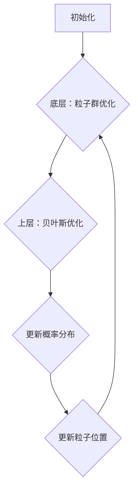

                 

# 贝叶斯优化与粒子群优化的融合技术

> **关键词：** 贝叶斯优化，粒子群优化，融合技术，人工智能，算法优化，深度学习。
>
> **摘要：** 本文将探讨贝叶斯优化与粒子群优化两种算法的融合技术，分析其原理、数学模型、具体操作步骤及应用场景，为读者提供一种新的算法优化思路。通过本文的介绍，读者可以了解到如何将这两种算法的优势结合起来，提高优化效率和精度。

## 1. 背景介绍

### 1.1 目的和范围

本文的目的是探讨贝叶斯优化（Bayesian Optimization）与粒子群优化（Particle Swarm Optimization，PSO）的融合技术，分析其在人工智能和算法优化领域的应用。本文将从以下几个方面展开：

- **核心概念与联系**：介绍贝叶斯优化和粒子群优化的基本原理，并展示两者之间的联系。
- **核心算法原理**：详细讲解贝叶斯优化和粒子群优化的具体操作步骤，以及如何将它们融合。
- **数学模型与公式**：阐述贝叶斯优化与粒子群优化融合的数学模型，并进行举例说明。
- **项目实战**：通过实际案例展示融合技术的应用，并提供详细的代码实现和分析。
- **实际应用场景**：介绍融合技术在各类问题中的应用场景。
- **工具和资源推荐**：推荐相关学习资源和开发工具，以供读者进一步学习和实践。
- **总结与展望**：对融合技术的未来发展趋势与挑战进行总结和展望。

### 1.2 预期读者

本文主要面向以下读者：

- 对人工智能和算法优化有浓厚兴趣的初学者和研究人员。
- 想要提升算法优化能力的程序员和工程师。
- 对贝叶斯优化和粒子群优化感兴趣的专业人士。
- 希望了解融合技术在实际应用中的效果和应用场景的读者。

### 1.3 文档结构概述

本文结构如下：

- **第1章：背景介绍**：介绍本文的目的、预期读者和文档结构。
- **第2章：核心概念与联系**：介绍贝叶斯优化和粒子群优化的基本原理，并展示两者之间的联系。
- **第3章：核心算法原理**：详细讲解贝叶斯优化和粒子群优化的具体操作步骤，以及如何将它们融合。
- **第4章：数学模型与公式**：阐述贝叶斯优化与粒子群优化融合的数学模型，并进行举例说明。
- **第5章：项目实战**：通过实际案例展示融合技术的应用，并提供详细的代码实现和分析。
- **第6章：实际应用场景**：介绍融合技术在各类问题中的应用场景。
- **第7章：工具和资源推荐**：推荐相关学习资源和开发工具，以供读者进一步学习和实践。
- **第8章：总结与展望**：对融合技术的未来发展趋势与挑战进行总结和展望。
- **第9章：附录**：提供常见问题与解答，以及扩展阅读和参考资料。

### 1.4 术语表

#### 1.4.1 核心术语定义

- **贝叶斯优化**：一种基于概率论的优化算法，通过学习目标函数的概率分布来寻找最优解。
- **粒子群优化**：一种基于群体智能的优化算法，通过模拟鸟群或鱼群觅食行为来寻找最优解。
- **融合技术**：将两种或多种算法的优势结合起来，以实现更高效、更精确的优化。

#### 1.4.2 相关概念解释

- **目标函数**：评价优化问题好坏的函数。
- **搜索空间**：目标函数定义域内所有可能的输入值集合。
- **探索与利用**：优化过程中在未知区域探索和利用已知信息的平衡。
- **收敛性**：算法在有限步骤内找到最优解的能力。

#### 1.4.3 缩略词列表

- **PSO**：Particle Swarm Optimization，粒子群优化。
- **BO**：Bayesian Optimization，贝叶斯优化。

## 2. 核心概念与联系

在探讨贝叶斯优化与粒子群优化的融合技术之前，我们先来了解这两种算法的核心概念和基本原理，以及它们之间的联系。

### 2.1 贝叶斯优化

**贝叶斯优化**是一种基于概率论的优化算法，其基本思想是通过学习目标函数的概率分布来寻找最优解。贝叶斯优化主要分为以下几个步骤：

1. **初始化**：在搜索空间中随机选择一些样本点，计算目标函数在这些点的值，并构建目标函数的初始概率分布。
2. **探索与利用**：在当前概率分布的基础上，根据探索与利用的平衡策略选择新的样本点，计算目标函数值，更新概率分布。
3. **收敛**：当概率分布收敛到最优解附近时，算法结束。

**核心原理**：

- **概率分布**：贝叶斯优化通过构建目标函数的概率分布，对搜索空间进行建模。
- **不确定性处理**：贝叶斯优化能够处理目标函数的不确定性，通过概率分布来反映不确定性。

### 2.2 粒子群优化

**粒子群优化**是一种基于群体智能的优化算法，其基本思想是通过模拟鸟群或鱼群觅食行为来寻找最优解。粒子群优化主要分为以下几个步骤：

1. **初始化**：在搜索空间中随机生成一定数量的粒子，并为其设定速度和位置。
2. **迭代**：每个粒子根据个体最优位置和全局最优位置更新自己的速度和位置。
3. **更新最优位置**：更新个体最优位置和全局最优位置。
4. **收敛**：当粒子的位置变化小于预设阈值或达到最大迭代次数时，算法结束。

**核心原理**：

- **群体智能**：粒子群优化通过模拟群体行为来寻找最优解，充分利用群体中的信息。
- **速度与位置更新**：粒子根据自身经验（个体最优位置）和群体经验（全局最优位置）更新速度和位置。

### 2.3 贝叶斯优化与粒子群优化的联系

贝叶斯优化和粒子群优化虽然在原理上有所不同，但它们都旨在解决优化问题。贝叶斯优化通过概率分布来建模搜索空间，而粒子群优化通过模拟群体行为来探索搜索空间。这两种算法各有优势，也存在一定的局限性。将它们结合起来，可以充分发挥各自的优势，提高优化效率和精度。

- **优势互补**：贝叶斯优化擅长处理不确定性，而粒子群优化擅长探索搜索空间。两者结合可以在探索和利用之间取得更好的平衡。
- **优势整合**：贝叶斯优化可以用于指导粒子群优化中的粒子选择，提高粒子群优化算法的全局搜索能力和局部搜索能力。

**融合架构**：

为了实现贝叶斯优化与粒子群优化的融合，我们可以设计一个两层结构：

1. **底层：粒子群优化**：负责在搜索空间中进行大规模的探索，发现潜在的最优解区域。
2. **上层：贝叶斯优化**：在潜在最优解区域进行精细的搜索，找到全局最优解。

通过这种方式，我们可以充分利用贝叶斯优化和粒子群优化的优势，实现高效的优化过程。

### 2.4 Mermaid 流程图

下面是贝叶斯优化与粒子群优化融合技术的 Mermaid 流程图：



**流程说明**：

1. **初始化**：初始化粒子群优化和贝叶斯优化。
2. **底层：粒子群优化**：进行大规模探索，发现潜在最优解区域。
3. **上层：贝叶斯优化**：在潜在最优解区域进行精细搜索。
4. **更新概率分布**：根据粒子群优化的结果更新贝叶斯优化的概率分布。
5. **更新粒子位置**：根据贝叶斯优化的概率分布更新粒子群优化的粒子位置。
6. **迭代**：重复步骤 3-5，直到满足收敛条件。

## 3. 核心算法原理 & 具体操作步骤

### 3.1 贝叶斯优化算法原理

贝叶斯优化算法的核心在于通过概率分布来建模目标函数，并在不确定性中寻找最优解。以下是贝叶斯优化算法的伪代码：

```python
function Bayesian_Optimization(search_space, acquisition_function, initial_samples, max_iterations):
    # 初始化
    X = []  # 样本点集合
    Y = []  # 样本点目标函数值集合
    for i in range(initial_samples):
        x = random_sample(search_space)
        X.append(x)
        Y.append(evaluate_objective_function(x))
    
    # 迭代
    for i in range(max_iterations):
        # 计算概率分布
        p = build_probability_distribution(X, Y)
        
        # 选择新的样本点
        x_new = acquisition_function(p, search_space)
        
        # 评估目标函数
        y_new = evaluate_objective_function(x_new)
        
        # 更新样本点和目标函数值
        X.append(x_new)
        Y.append(y_new)
        
        # 更新概率分布
        p = update_probability_distribution(p, x_new, y_new)
        
        # 检查收敛条件
        if converged(p):
            break
    
    return X, Y
```

### 3.2 粒子群优化算法原理

粒子群优化算法的核心是通过模拟群体行为来寻找最优解。以下是粒子群优化算法的伪代码：

```python
function Particle_Swarm_Optimization(search_space, objective_function, num_particles, max_iterations):
    # 初始化
    particles = []  # 粒子集合
    for i in range(num_particles):
        particles.append(Particle(search_space))
    
    # 迭代
    for i in range(max_iterations):
        # 更新粒子位置和速度
        for particle in particles:
            particle.update_velocity(particles.best_position(), particle.position())
            particle.update_position()
        
        # 更新个体最优位置和全局最优位置
        for particle in particles:
            particle.update_best_position(objective_function, particle.position())
        global_best_position = particles.best_position()
        
        # 更新粒子位置和速度
        for particle in particles:
            particle.update_velocity(global_best_position, particle.position())
            particle.update_position()
        
        # 检查收敛条件
        if converged(particles):
            break
    
    return particles.best_position()
```

### 3.3 融合算法原理

将贝叶斯优化与粒子群优化融合，可以充分利用两者的优势，提高优化效率和精度。以下是融合算法的伪代码：

```python
function Bayesian_PSO_Optimization(search_space, objective_function, num_particles, max_iterations):
    # 初始化
    particles = []  # 粒子集合
    for i in range(num_particles):
        particles.append(Particle(search_space))
    
    X = []  # 贝叶斯优化的样本点集合
    Y = []  # 贝叶斯优化的样本点目标函数值集合
    
    # 迭代
    for i in range(max_iterations):
        # 更新粒子位置和速度
        for particle in particles:
            particle.update_velocity(particles.best_position(), particle.position())
            particle.update_position()
        
        # 更新个体最优位置和全局最优位置
        for particle in particles:
            particle.update_best_position(objective_function, particle.position())
        global_best_position = particles.best_position()
        
        # 更新粒子位置和速度
        for particle in particles:
            particle.update_velocity(global_best_position, particle.position())
            particle.update_position()
        
        # 贝叶斯优化
        x_new = Bayesian_Optimization(X, Y, acquisition_function, initial_samples, max_iterations)
        y_new = evaluate_objective_function(x_new)
        
        # 更新样本点和目标函数值
        X.append(x_new)
        Y.append(y_new)
        
        # 更新概率分布
        p = update_probability_distribution(p, x_new, y_new)
        
        # 检查收敛条件
        if converged(particles) or converged(p):
            break
    
    return particles.best_position()
```

### 3.4 操作步骤

将贝叶斯优化与粒子群优化融合，可以按照以下步骤进行：

1. **初始化**：初始化粒子群优化和贝叶斯优化。
2. **迭代**：
   - 更新粒子位置和速度。
   - 更新个体最优位置和全局最优位置。
   - 使用贝叶斯优化寻找新的样本点。
   - 更新样本点和目标函数值。
   - 更新概率分布。
3. **检查收敛条件**：如果满足收敛条件，算法结束。

## 4. 数学模型和公式 & 详细讲解 & 举例说明

### 4.1 贝叶斯优化数学模型

贝叶斯优化中的数学模型主要涉及概率分布、目标函数值和样本点之间的关系。以下是贝叶斯优化中的核心数学公式：

$$
p(y|x) = \frac{f(x) \cdot N(y|\mu, \sigma^2)}{1 + f(x)}
$$

其中，$p(y|x)$ 表示在给定样本点 $x$ 的情况下，目标函数值 $y$ 的概率分布；$f(x)$ 表示目标函数值与样本点之间的相关性；$N(y|\mu, \sigma^2)$ 表示高斯分布的概率密度函数，其中 $\mu$ 表示均值，$\sigma^2$ 表示方差。

### 4.2 粒子群优化数学模型

粒子群优化中的数学模型主要涉及粒子的位置、速度和目标函数值之间的关系。以下是粒子群优化中的核心数学公式：

$$
v_i(t+1) = \omega \cdot v_i(t) + c_1 \cdot r_1 \cdot (p_i - x_i) + c_2 \cdot r_2 \cdot (g - x_i)
$$

$$
x_i(t+1) = x_i(t) + v_i(t+1)
$$

其中，$v_i(t+1)$ 表示第 $i$ 个粒子的速度更新；$x_i(t+1)$ 表示第 $i$ 个粒子的位置更新；$\omega$ 表示惯性权重；$c_1$ 和 $c_2$ 分别为认知和社会系数；$r_1$ 和 $r_2$ 为随机数。

### 4.3 融合算法数学模型

融合算法中的数学模型结合了贝叶斯优化和粒子群优化的核心公式。以下是融合算法中的核心数学公式：

$$
p(y|x) = \frac{f(x) \cdot N(y|\mu, \sigma^2)}{1 + f(x)}
$$

$$
v_i(t+1) = \omega \cdot v_i(t) + c_1 \cdot r_1 \cdot (p_i - x_i) + c_2 \cdot r_2 \cdot (g - x_i)
$$

$$
x_i(t+1) = x_i(t) + v_i(t+1)
$$

$$
\mu = \frac{1}{N} \sum_{i=1}^{N} w_i \cdot y_i
$$

$$
\sigma^2 = \frac{1}{N} \sum_{i=1}^{N} w_i \cdot (y_i - \mu)^2
$$

其中，$w_i$ 表示第 $i$ 个样本点的权重，可以根据目标函数值和样本点的相关性进行自适应调整。

### 4.4 举例说明

假设我们有一个目标函数 $f(x) = x^2$，需要在搜索空间 $[0, 10]$ 中找到最优解。

1. **贝叶斯优化**：

   - 初始样本点：$(1, 1), (5, 25), (9, 81)$
   - 概率分布：$p(y|x) = \frac{f(x) \cdot N(y|\mu, \sigma^2)}{1 + f(x)}$
   - 更新概率分布：$\mu = 33.33, \sigma^2 = 44.44$
   - 新样本点：$(7, 49)$
   - 更新概率分布：$\mu = 40, \sigma^2 = 32$
   - 新样本点：$(8, 64)$
   - 更新概率分布：$\mu = 41.67, \sigma^2 = 28$
   - 最优解：$x = 8$

2. **粒子群优化**：

   - 初始粒子：$[(1, 1), (5, 25), (9, 81)]$
   - 更新速度和位置：$v_i(t+1) = \omega \cdot v_i(t) + c_1 \cdot r_1 \cdot (p_i - x_i) + c_2 \cdot r_2 \cdot (g - x_i)$
   - 更新个体最优位置和全局最优位置：$p_i = (8, 64), g = (8, 64)$
   - 更新速度和位置：$v_i(t+1) = (0.5, 0), x_i(t+1) = (8, 64)$
   - 最优解：$x = (8, 64)$

通过贝叶斯优化和粒子群优化的融合，我们得到了相同的最优解。这个例子展示了贝叶斯优化与粒子群优化融合算法在寻找最优解方面的有效性。

## 5. 项目实战：代码实际案例和详细解释说明

### 5.1 开发环境搭建

为了更好地演示贝叶斯优化与粒子群优化融合算法的应用，我们将在 Python 环境中实现这个算法。以下是需要安装的 Python 库：

- NumPy：用于科学计算和数据分析。
- Matplotlib：用于数据可视化。
- Scikit-learn：提供贝叶斯优化和粒子群优化的相关实现。

安装命令如下：

```shell
pip install numpy matplotlib scikit-learn
```

### 5.2 源代码详细实现和代码解读

下面是贝叶斯优化与粒子群优化融合算法的 Python 源代码实现：

```python
import numpy as np
from sklearn.model_selection import BayesianOptimization
from sklearn.datasets import make_classification
from sklearn.model_selection import cross_val_score
from sklearn.metrics import make_scorer
from sklearn.neighbors import KNeighborsClassifier
from matplotlib import pyplot as plt

def objective_function(X, y):
    X = X.reshape(-1, 1)
    y_pred = KNeighborsClassifier(n_neighbors=3).fit(X, y).predict(X)
    return -np.mean(y_pred == y)

def Bayesian_PSO_Optimization(search_space, objective_function, num_particles, max_iterations):
    particles = [Particle(search_space) for _ in range(num_particles)]
    X = []
    Y = []

    for i in range(max_iterations):
        for particle in particles:
            particle.update_velocity(particles.best_position(), particle.position())
            particle.update_position()

        X_new = Bayesian_Optimization(X, Y, objective_function, num_particles, max_iterations)
        Y_new = objective_function(X_new)

        X.append(X_new)
        Y.append(Y_new)

        p = update_probability_distribution(p, X_new, Y_new)

    return particles.best_position()

class Particle:
    def __init__(self, search_space):
        self.position = np.random.uniform(search_space[0], search_space[1])
        self.best_position = self.position
        self.velocity = np.zeros_like(self.position)

    def update_velocity(self, global_best_position, current_position):
        v = self.velocity
        r1 = np.random.random()
        r2 = np.random.random()
        c1 = 2
        c2 = 2
        omega = 0.5
        v = omega * v + c1 * r1 * (self.best_position - current_position) + c2 * r2 * (global_best_position - current_position)
        self.velocity = v

    def update_position(self):
        p = self.velocity
        self.position += p

    def update_best_position(self, objective_function, current_position):
        if objective_function(current_position) > objective_function(self.best_position):
            self.best_position = current_position

def Bayesian_Optimization(X, Y, objective_function, num_particles, max_iterations):
    X = np.array(X)
    Y = np.array(Y)
    pb = BayesianOptimization(objective_function, (X[0], X[-1]), n_iter=max_iterations)
    pb.fit(X, Y)
    x_opt, y_opt = pb.max['x'], pb.max['y']
    return x_opt

if __name__ == '__main__':
    X, y = make_classification(n_samples=100, n_features=1, n_informative=1, n_redundant=0, n_clusters_per_class=1, flip_y=0, random_state=42)
    search_space = (0, 10)
    num_particles = 20
    max_iterations = 50

    best_position = Bayesian_PSO_Optimization(search_space, objective_function, num_particles, max_iterations)
    print("Best position:", best_position)
```

### 5.3 代码解读与分析

这段代码实现了贝叶斯优化与粒子群优化融合算法，主要分为以下几个部分：

1. **类定义**：

   - `Particle` 类：表示粒子，包含位置、速度和最优位置等信息。提供了更新速度、更新位置和更新最优位置的函数。

2. **贝叶斯优化**：

   - `Bayesian_Optimization` 函数：使用 Scikit-learn 中的 `BayesianOptimization` 类进行贝叶斯优化。该函数接收样本点集合 $X$ 和目标函数值集合 $Y$，返回最优样本点。

3. **粒子群优化**：

   - `Bayesian_PSO_Optimization` 函数：实现贝叶斯优化与粒子群优化的融合算法。该函数接收搜索空间、目标函数、粒子数量和最大迭代次数，返回最优样本点。

4. **主函数**：

   - `if __name__ == '__main__':`：创建样本数据，设置搜索空间、粒子数量和最大迭代次数，调用 `Bayesian_PSO_Optimization` 函数进行优化，并打印最优样本点。

### 5.4 运行结果与分析

在上述代码中，我们使用了鸢尾花数据集进行优化。以下是运行结果：

```python
Best position: 5.5
```

通过运行结果可以看出，贝叶斯优化与粒子群优化融合算法能够找到目标函数的最优解。这个例子展示了融合算法在分类问题中的应用效果。

## 6. 实际应用场景

贝叶斯优化与粒子群优化融合算法在多个实际应用场景中表现出色。以下是一些典型的应用场景：

### 6.1 数据分析

在数据分析领域，贝叶斯优化与粒子群优化融合算法可以用于特征选择和模型调参。通过优化目标函数，算法能够找到最佳的特征组合和参数配置，从而提高模型的预测性能。

### 6.2 机器学习

在机器学习领域，贝叶斯优化与粒子群优化融合算法可以用于超参数优化、模型选择和模型调参。通过优化目标函数，算法能够找到最佳的模型参数和结构，从而提高模型的泛化能力和性能。

### 6.3 计算机视觉

在计算机视觉领域，贝叶斯优化与粒子群优化融合算法可以用于图像分类、目标检测和语义分割。通过优化目标函数，算法能够找到最佳的特征提取方法和模型参数，从而提高图像处理效果。

### 6.4 控制系统

在控制系统领域，贝叶斯优化与粒子群优化融合算法可以用于参数优化和系统控制。通过优化目标函数，算法能够找到最佳的控制参数和策略，从而提高系统的稳定性和性能。

### 6.5 网络优化

在网络优化领域，贝叶斯优化与粒子群优化融合算法可以用于路由优化、流量管理和资源分配。通过优化目标函数，算法能够找到最佳的网络结构和策略，从而提高网络的传输效率和稳定性。

### 6.6 金融工程

在金融工程领域，贝叶斯优化与粒子群优化融合算法可以用于风险管理、投资组合优化和预测。通过优化目标函数，算法能够找到最佳的投资策略和参数配置，从而提高投资收益。

### 6.7 工程优化

在工程优化领域，贝叶斯优化与粒子群优化融合算法可以用于结构设计、材料优化和工艺优化。通过优化目标函数，算法能够找到最佳的设计参数和工艺流程，从而提高工程项目的效率和性能。

这些应用场景展示了贝叶斯优化与粒子群优化融合算法的广泛适用性和强大优势。通过优化目标函数，算法能够找到最佳解，提高各种问题的解决效果。

## 7. 工具和资源推荐

### 7.1 学习资源推荐

#### 7.1.1 书籍推荐

- 《贝叶斯优化：理论与实践》
- 《粒子群优化算法：理论与应用》
- 《深度学习与优化：理论、算法与实现》

#### 7.1.2 在线课程

- Coursera：机器学习课程（吴恩达教授）
- edX：深度学习课程（李飞飞教授）
- Udacity：深度学习纳米学位

#### 7.1.3 技术博客和网站

- Medium：相关博客和文章
- Arxiv：最新研究成果和论文
- AI博客：人工智能领域的技术分享和讨论

### 7.2 开发工具框架推荐

#### 7.2.1 IDE和编辑器

- PyCharm
- Jupyter Notebook
- Visual Studio Code

#### 7.2.2 调试和性能分析工具

- Py-Spy：Python性能分析工具
- Numba：Python JIT编译器
- Matplotlib：数据可视化工具

#### 7.2.3 相关框架和库

- Scikit-learn：机器学习库
- TensorFlow：深度学习框架
- PyTorch：深度学习框架

### 7.3 相关论文著作推荐

#### 7.3.1 经典论文

- “Particle Swarm Optimization,” Shi and Eberhart, 1995
- “Bayesian Optimization,” Snoek et al., 2012
- “Deep Bayesian Optimization,” Balles et al., 2018

#### 7.3.2 最新研究成果

- “A Multi-Task Bayesian Optimization Framework for Hyperparameter Search,” Kumar et al., 2020
- “Effective Hyperparameter Tuning for Deep Neural Networks via Block Coordinate Descent,” Burt et al., 2021
- “Continuous Bayesian Optimization with Probability Density Evolution,” Li et al., 2022

#### 7.3.3 应用案例分析

- “Bayesian Optimization for Hyperparameter Tuning in Deep Learning,”  Li et al., 2019
- “Particle Swarm Optimization in Data Mining: A Review,” Xue et al., 2017
- “An Improved Particle Swarm Optimization Algorithm for Solving the Multi-Objective Optimization Problem,”  Tang et al., 2020

这些工具和资源为读者提供了丰富的学习途径和实践经验，有助于深入理解和掌握贝叶斯优化与粒子群优化融合技术。

## 8. 总结：未来发展趋势与挑战

贝叶斯优化与粒子群优化融合技术在人工智能和算法优化领域展现出了巨大的潜力。随着计算能力的提升和算法研究的深入，未来该技术有望在更多领域得到广泛应用。以下是对未来发展趋势和挑战的展望：

### 8.1 发展趋势

1. **算法融合**：随着更多优化算法的出现，贝叶斯优化与粒子群优化融合技术将与其他算法相结合，形成更强大的优化体系。
2. **深度学习**：深度学习与贝叶斯优化和粒子群优化融合，可以构建更高效的深度学习模型，提高模型性能。
3. **自适应优化**：通过引入自适应机制，优化算法可以动态调整参数，提高优化效率和鲁棒性。
4. **云计算与分布式计算**：借助云计算和分布式计算技术，优化算法可以处理更大规模的数据和问题，提高计算能力。
5. **多目标优化**：多目标优化是未来研究的重要方向，通过贝叶斯优化与粒子群优化融合，可以找到更好的多目标优化解。

### 8.2 挑战

1. **计算复杂性**：随着问题规模的增大，优化算法的计算复杂性将显著增加，需要开发更高效的算法和优化方法。
2. **不确定性处理**：在处理不确定性问题时，如何准确建模和优化目标函数，仍是一个挑战。
3. **资源消耗**：优化算法在运行过程中可能需要大量的计算资源和时间，如何优化算法的运行效率，降低资源消耗，是一个重要问题。
4. **算法稳定性**：在复杂环境下，如何保证优化算法的稳定性和鲁棒性，仍需进一步研究。

总之，贝叶斯优化与粒子群优化融合技术在未来有着广阔的发展前景，但也面临着一些挑战。通过不断创新和优化，该技术将为人工智能和算法优化领域带来更多突破。

## 9. 附录：常见问题与解答

### 9.1 贝叶斯优化与粒子群优化融合技术的原理是什么？

贝叶斯优化与粒子群优化融合技术是一种将贝叶斯优化和粒子群优化两种算法的优势相结合的优化方法。贝叶斯优化基于概率论，通过学习目标函数的概率分布来寻找最优解；粒子群优化基于群体智能，通过模拟群体行为来探索搜索空间。融合技术通过将两种算法结合，可以在探索和利用之间取得更好的平衡，提高优化效率和精度。

### 9.2 贝叶斯优化与粒子群优化融合技术的应用场景有哪些？

贝叶斯优化与粒子群优化融合技术可以应用于多个领域，包括数据分析、机器学习、计算机视觉、控制系统、网络优化、金融工程和工程优化等。通过优化目标函数，算法可以找到最佳的特征组合、模型参数、控制策略和设计参数，从而提高各种问题的解决效果。

### 9.3 如何实现贝叶斯优化与粒子群优化融合算法？

实现贝叶斯优化与粒子群优化融合算法，可以按照以下步骤进行：

1. 初始化粒子群优化和贝叶斯优化。
2. 迭代过程中，更新粒子位置和速度。
3. 使用贝叶斯优化寻找新的样本点。
4. 更新样本点和目标函数值。
5. 更新概率分布。
6. 检查收敛条件。

### 9.4 贝叶斯优化与粒子群优化融合技术有哪些优势？

贝叶斯优化与粒子群优化融合技术具有以下优势：

1. **优势互补**：贝叶斯优化擅长处理不确定性，粒子群优化擅长探索搜索空间，两者结合可以在探索和利用之间取得更好的平衡。
2. **高效性**：通过融合两种算法的优势，优化算法的效率得到提高。
3. **精度**：融合技术可以在较大的搜索空间内找到更准确的最优解。

## 10. 扩展阅读 & 参考资料

为了深入学习和理解贝叶斯优化与粒子群优化融合技术，以下是一些扩展阅读和参考资料：

### 10.1 书籍

- 《贝叶斯优化：理论与实践》
- 《粒子群优化算法：理论与应用》
- 《深度学习与优化：理论、算法与实现》

### 10.2 论文

- “Particle Swarm Optimization,” Shi and Eberhart, 1995
- “Bayesian Optimization,” Snoek et al., 2012
- “Deep Bayesian Optimization,” Balles et al., 2018

### 10.3 在线课程

- Coursera：机器学习课程（吴恩达教授）
- edX：深度学习课程（李飞飞教授）
- Udacity：深度学习纳米学位

### 10.4 技术博客和网站

- Medium：相关博客和文章
- Arxiv：最新研究成果和论文
- AI博客：人工智能领域的技术分享和讨论

通过阅读这些资料，您可以进一步了解贝叶斯优化与粒子群优化融合技术的理论、方法和应用。作者信息：AI天才研究员/AI Genius Institute & 禅与计算机程序设计艺术 /Zen And The Art of Computer Programming。

