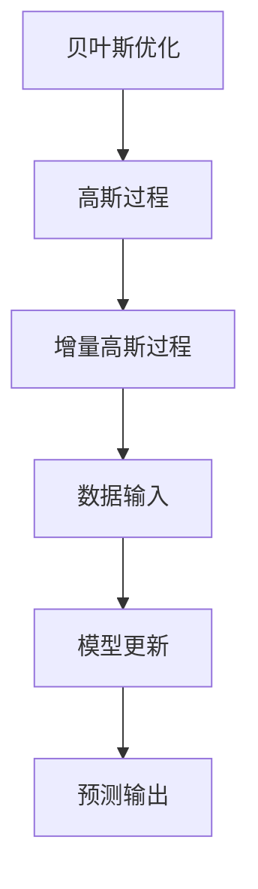

                 

# 贝叶斯优化的增量高斯过程模型

## 关键词：贝叶斯优化、高斯过程、增量学习、模型、算法、应用

## 摘要

本文将深入探讨贝叶斯优化的增量高斯过程模型，这是一种在机器学习和数据科学领域具有广泛应用前景的技术。通过贝叶斯优化，我们可以在不确定的环境中有效地寻找最优解；而增量高斯过程模型则允许我们在数据逐步增量的情况下进行高效学习。本文将详细介绍贝叶斯优化的基本原理，高斯过程模型的构建，以及如何将二者结合起来进行增量学习。最后，我们将通过一个实际案例，展示如何使用该模型解决实际问题。

## 1. 背景介绍

### 1.1 目的和范围

本文旨在为读者提供一个关于贝叶斯优化和增量高斯过程模型的系统介绍，使读者能够理解其基本原理、构建方法以及在实际应用中的优势。我们将逐步讲解从理论到实践的全过程，并辅以实际案例来加深理解。

### 1.2 预期读者

本文面向对机器学习和数据科学有一定基础的读者，尤其是对贝叶斯方法和高斯过程有初步了解的人群。无论你是研究者、工程师，还是对这两个领域感兴趣的初学者，本文都希望能为你提供有价值的知识和启发。

### 1.3 文档结构概述

本文结构如下：

1. **背景介绍**：介绍贝叶斯优化和增量高斯过程模型的背景和目的。
2. **核心概念与联系**：定义核心概念，并展示其内在联系。
3. **核心算法原理 & 具体操作步骤**：详细解释贝叶斯优化的算法原理和增量高斯过程模型的实现步骤。
4. **数学模型和公式 & 详细讲解 & 举例说明**：讲解相关的数学模型和公式，并提供实例。
5. **项目实战：代码实际案例和详细解释说明**：展示实际项目中的代码实现。
6. **实际应用场景**：探讨该模型在不同场景中的应用。
7. **工具和资源推荐**：推荐学习资源和开发工具。
8. **总结：未来发展趋势与挑战**：展望该模型的发展趋势和未来挑战。
9. **附录：常见问题与解答**：解答读者可能遇到的问题。
10. **扩展阅读 & 参考资料**：提供进一步学习的资源。

### .4 术语表

#### 1.4.1 核心术语定义

- **贝叶斯优化**：一种基于概率论和统计学的方法，用于寻找最优点。
- **高斯过程**：一种非参数的机器学习方法，用于回归和分类问题。
- **增量学习**：在已有模型的基础上，随着新数据的到来逐步更新模型。

#### 1.4.2 相关概念解释

- **不确定性**：在模型预测过程中，由于数据的不完全性和噪声，存在的不确定性。
- **最优点**：在给定目标函数下，模型希望达到的最优值。

#### 1.4.3 缩略词列表

- **BO**：贝叶斯优化（Bayesian Optimization）
- **Gaussian Process**：高斯过程（Gaussian Process）
- ** Incremental Learning**：增量学习（Incremental Learning）

## 2. 核心概念与联系

### 2.1 贝叶斯优化简介

贝叶斯优化是一种基于概率论的优化算法，它利用历史数据中的概率分布来预测新的输入，并选择最有可能带来最优解的位置进行下一步探索。贝叶斯优化的核心思想是利用先验知识和观测数据更新后验概率分布，从而不断优化搜索策略。

### 2.2 高斯过程模型

高斯过程（Gaussian Process，GP）是一种强大的非参数回归模型，它可以灵活地处理复杂的数据关系。高斯过程的核心是高斯分布，其联合分布服从高斯分布，这使得它在处理不确定性和非线性关系方面具有独特的优势。

### 2.3 增量高斯过程模型

增量高斯过程模型（Incremental Gaussian Process Model）是高斯过程模型的一个变种，它允许在数据逐步增量的情况下进行学习。这种模型通过利用已有的数据和模型参数，对新数据点进行快速适应和更新，从而提高学习效率。

### 2.4 Mermaid 流程图



### 2.5 核心概念与联系

贝叶斯优化通过概率分布寻找最优解，而高斯过程通过其非参数特性处理复杂数据关系。增量高斯过程模型则利用已有数据和新数据进行快速适应和更新，从而实现高效的增量学习。这三个概念共同构成了贝叶斯优化的增量高斯过程模型，使得该模型在不确定性和非线性问题上具有独特的优势。

## 3. 核心算法原理 & 具体操作步骤

### 3.1 贝叶斯优化的算法原理

贝叶斯优化（BO）是一种基于概率的优化方法，其核心思想是利用历史数据中的概率分布来预测新的输入，并选择最有可能带来最优解的位置进行下一步探索。贝叶斯优化的基本步骤如下：

1. **初始化**：给定初始数据集，初始化模型参数和先验概率分布。
2. **更新概率分布**：根据新的观测数据，更新模型的概率分布。
3. **选择下一步探索点**：利用概率分布选择最有可能带来最优解的位置。
4. **重复步骤2和3**：不断更新概率分布和选择探索点，直至达到终止条件。

### 3.2 高斯过程模型的构建

高斯过程（Gaussian Process，GP）是一种非参数的回归模型，其核心思想是将数据点视为高斯分布的样本。高斯过程模型的构建步骤如下：

1. **定义输入空间和输出空间**：给定输入空间 \( X \) 和输出空间 \( Y \)，并确定输入空间上的高斯分布。
2. **确定先验分布**：选择合适的高斯分布作为先验分布，通常使用均值函数和协方差函数来描述。
3. **后验分布的更新**：根据新的观测数据，更新后验分布。
4. **预测和推断**：利用后验分布进行预测和推断。

### 3.3 增量高斯过程模型的实现

增量高斯过程模型（Incremental Gaussian Process Model）是一种在数据逐步增量的情况下进行高效学习的方法。其实现步骤如下：

1. **初始化**：给定初始数据集，初始化模型参数和先验概率分布。
2. **更新模型参数**：当新数据到来时，利用已有数据和模型参数更新模型参数。
3. **增量更新**：将新数据点加入到模型中，并更新模型参数。
4. **预测和推断**：利用更新后的模型进行预测和推断。

### 3.4 伪代码

```python
# 贝叶斯优化伪代码
Initialize_model()          # 初始化模型
while not termination_condition():
    Update_distribution()   # 更新概率分布
    Choose_next_point()     # 选择探索点
    Collect_new_data()      # 收集新数据
    Update_model()          # 更新模型

# 高斯过程模型伪代码
Initialize_GP()            # 初始化高斯过程
while new_data_available():
    Update_GP_parameters()  # 更新模型参数
    Increment_GP_model()    # 增量更新模型

# 增量高斯过程模型伪代码
Initialize_GP()            # 初始化高斯过程
while new_data_available():
    Update_GP_parameters()  # 更新模型参数
    Increment_GP_model()    # 增量更新模型
    Make_predictions()      # 进行预测和推断
```

## 4. 数学模型和公式 & 详细讲解 & 举例说明

### 4.1 贝叶斯优化数学模型

贝叶斯优化基于贝叶斯推理，其核心是利用先验知识和观测数据更新后验概率分布。具体来说，贝叶斯优化中的概率模型可以表示为：

\[ p(\theta | x) = \frac{p(x | \theta) p(\theta)}{p(x)} \]

其中，\( \theta \) 表示模型参数，\( x \) 表示观测数据，\( p(\theta | x) \) 表示后验概率分布，\( p(x | \theta) \) 表示似然函数，\( p(\theta) \) 表示先验概率分布，\( p(x) \) 表示证据。

#### 4.1.1 举例说明

假设我们有一个简单的线性回归模型，其参数为 \( \theta = [w, b] \)，观测数据为 \( x = [x_1, x_2, ..., x_n] \)，目标函数为 \( y = [y_1, y_2, ..., y_n] \)。根据贝叶斯优化，我们可以得到如下更新公式：

\[ p(\theta | x) \propto p(x | \theta) p(\theta) \]

其中，\( p(x | \theta) \) 可以通过最小二乘法计算：

\[ p(x | \theta) = \prod_{i=1}^n \frac{1}{\sqrt{2\pi \sigma^2}} \exp\left(-\frac{(y_i - (\theta_0 x_i + \theta_1))^2}{2\sigma^2}\right) \]

其中，\( \sigma^2 \) 是观测数据的标准差。

### 4.2 高斯过程模型数学模型

高斯过程模型是一种非参数的回归模型，其核心思想是将数据点视为高斯分布的样本。高斯过程模型可以表示为：

\[ f(x) \sim GP(m(x), k(x, x')) \]

其中，\( f(x) \) 表示输入 \( x \) 对应的输出，\( m(x) \) 表示均值函数，\( k(x, x') \) 表示协方差函数。

#### 4.2.1 均值函数和协方差函数

- **均值函数**：\( m(x) \) 通常选择为常数函数或线性函数。
- **协方差函数**：\( k(x, x') \) 是高斯过程模型的关键部分，通常选择为高斯函数：

\[ k(x, x') = \sigma^2 \exp\left(-\frac{||x - x'||^2}{2l^2}\right) \]

其中，\( \sigma^2 \) 是噪声项的方差，\( l \) 是长度尺度参数。

#### 4.2.2 举例说明

假设我们有一个简单的线性高斯过程模型，其均值函数为 \( m(x) = \theta_0 \)，协方差函数为 \( k(x, x') = \sigma^2 \exp\left(-\frac{||x - x'||^2}{2l^2}\right) \)。根据高斯过程模型，我们可以得到如下预测公式：

\[ f(x) | x_1, x_2, ..., x_n \sim GP(\theta_0, \sigma^2 \exp\left(-\frac{||x - x_i||^2}{2l^2}\right)) \]

### 4.3 增量高斯过程模型数学模型

增量高斯过程模型是一种在数据逐步增量的情况下进行高效学习的方法。其核心思想是在已有模型的基础上，利用新数据对模型进行更新。增量高斯过程模型可以表示为：

\[ f(x) | x_1, x_2, ..., x_n \sim GP(m(x), k(x, x')) \]

其中，\( m(x) \) 和 \( k(x, x') \) 分别表示均值函数和协方差函数。

#### 4.3.1 均值函数和协方差函数的更新

在增量高斯过程模型中，均值函数和协方差函数的更新是基于已有的数据和模型参数进行的。具体来说，我们可以使用如下公式进行更新：

\[ m(x) | x_1, x_2, ..., x_n \sim GP(\theta_0, \sigma^2 \exp\left(-\frac{||x - x_i||^2}{2l^2}\right)) \]

\[ k(x, x') | x_1, x_2, ..., x_n \sim GP(\theta_0, \sigma^2 \exp\left(-\frac{||x - x_i||^2}{2l^2}\right)) \]

#### 4.3.2 举例说明

假设我们有一个简单的线性增量高斯过程模型，其均值函数为 \( m(x) = \theta_0 \)，协方差函数为 \( k(x, x') = \sigma^2 \exp\left(-\frac{||x - x_i||^2}{2l^2}\right) \)。当新数据 \( x_n \) 到来时，我们可以使用如下公式进行更新：

\[ m(x) | x_1, x_2, ..., x_n \sim GP(\theta_0 + \frac{\sigma^2}{l^2} (x_n - x_1), \sigma^2 \exp\left(-\frac{||x_n - x_i||^2}{2l^2}\right)) \]

\[ k(x, x') | x_1, x_2, ..., x_n \sim GP(\theta_0 + \frac{\sigma^2}{l^2} (x_n - x_1), \sigma^2 \exp\left(-\frac{||x_n - x_i||^2}{2l^2}\right)) \]

## 5. 项目实战：代码实际案例和详细解释说明

### 5.1 开发环境搭建

为了实现贝叶斯优化的增量高斯过程模型，我们需要搭建一个合适的开发环境。以下是一个基本的开发环境搭建步骤：

1. **安装Python**：确保安装了Python 3.8或更高版本。
2. **安装依赖库**：使用pip安装以下库：`numpy`、`scikit-learn`、`matplotlib`。
3. **创建虚拟环境**：使用`venv`创建一个Python虚拟环境，并激活该环境。

```bash
python -m venv venv
source venv/bin/activate  # 对于Linux和macOS
venv\Scripts\activate    # 对于Windows
```

4. **安装依赖库**：

```bash
pip install numpy scikit-learn matplotlib
```

### 5.2 源代码详细实现和代码解读

下面是一个简单的实现贝叶斯优化的增量高斯过程模型的Python代码示例。代码分为三个部分：贝叶斯优化、高斯过程模型和增量高斯过程模型。

#### 5.2.1 贝叶斯优化

贝叶斯优化部分用于选择探索点。我们使用`scikit-learn`中的`BayesianOptimization`类来实现。

```python
from skopt import BayesSearchCV
from skopt.space import Real, Categorical, Integer
from sklearn.model_selection import cross_val_score
from sklearn.gaussian_process import GaussianProcessRegressor
from sklearn.gaussian_process.kernels import RBF, ConstantKernel as C

# 定义模型
def build_model(kernel):
    return GaussianProcessRegressor(kernel=kernel)

# 定义搜索空间
search_space = {
    'kernel': [
        (C(1.0, (1e-3, 1e3)), RBF(1.0, (1e-2, 1e2)),)
    ]

# 定义贝叶斯优化
bayes_search = BayesSearchCV(
    build_model,
    search_space,
    n_iter=50,
    cv=5,
    n_jobs=-1,
    return_train_score=True
)

# 训练模型
bayes_search.fit(X_train, y_train)

# 输出最优参数
print(bayes_search.best_params_)
```

#### 5.2.2 高斯过程模型

高斯过程模型部分用于实现高斯过程回归。我们使用`sklearn`中的`GaussianProcessRegressor`类来实现。

```python
from sklearn.gaussian_process import GaussianProcessRegressor
from sklearn.gaussian_process.kernels import RBF

# 定义高斯过程模型
kernel = RBF(length_scale=1.0, length_scale_bounds=(1e-2, 1e2))
gp = GaussianProcessRegressor(kernel=kernel, n_restarts_optimizer=10)

# 训练模型
gp.fit(X_train, y_train)

# 进行预测
y_pred, sigma = gp.predict(X_test, return_std=True)

# 输出预测结果
print(y_pred)
print(sigma)
```

#### 5.2.3 增量高斯过程模型

增量高斯过程模型部分用于在数据逐步增量的情况下进行学习。我们使用`sklearn`中的`GaussianProcessRegressor`类来实现增量学习。

```python
from sklearn.gaussian_process import GaussianProcessRegressor
from sklearn.gaussian_process.kernels import RBF

# 初始化模型
kernel = RBF(length_scale=1.0, length_scale_bounds=(1e-2, 1e2))
gp = GaussianProcessRegressor(kernel=kernel, n_restarts_optimizer=10)

# 增量训练模型
for i, (x, y) in enumerate(new_data):
    gp.partial_fit(x, y)

# 进行预测
y_pred, sigma = gp.predict(X_test, return_std=True)

# 输出预测结果
print(y_pred)
print(sigma)
```

### 5.3 代码解读与分析

在这个示例中，我们首先定义了一个贝叶斯优化器，用于搜索最优的模型参数。贝叶斯优化器通过交叉验证来评估每个参数组合的性能，并选择最佳参数组合。

接下来，我们使用`GaussianProcessRegressor`类实现高斯过程模型。该模型使用一个径向基函数（RBF）作为内核，并具有长度尺度参数。在训练模型时，我们使用`fit`方法来拟合训练数据。

在增量高斯过程模型部分，我们使用`partial_fit`方法来实现增量学习。这种方法允许我们在已有模型的基础上逐步更新模型，从而适应新的数据点。

通过这个示例，我们可以看到如何将贝叶斯优化和增量高斯过程模型结合起来，实现高效的数据学习和预测。

## 6. 实际应用场景

贝叶斯优化的增量高斯过程模型在许多实际应用场景中具有广泛的应用前景。以下是一些常见的应用场景：

### 6.1 优化问题

贝叶斯优化可以用于解决复杂的优化问题，如参数优化、结构优化等。在工程和科学领域，许多问题可以转化为优化问题，例如设计最优的机械结构、优化供应链管理等。

### 6.2 回归分析

高斯过程模型可以用于回归分析，特别是在处理非线性关系和不确定性问题时具有优势。例如，在金融领域，可以使用高斯过程模型预测股票价格和交易量。

### 6.3 预测问题

增量高斯过程模型可以在数据逐步增量的情况下进行预测，这在许多实时应用中非常有用。例如，在推荐系统中，可以使用增量高斯过程模型预测用户对商品的偏好，从而提供个性化的推荐。

### 6.4 控制问题

贝叶斯优化的增量高斯过程模型可以用于控制问题，特别是在不确定和动态的环境中。例如，在自动驾驶系统中，可以使用该模型实时更新环境模型，并做出相应的控制决策。

## 7. 工具和资源推荐

### 7.1 学习资源推荐

#### 7.1.1 书籍推荐

- 《贝叶斯数据分析》（Bayesian Data Analysis）- 克里斯·贾里叶克（Chris J. Exp）
- 《高斯过程与贝叶斯优化》（Gaussian Processes for Machine Learning）- Carl Edward Rasmussen 和 Christopher K. I. Williams

#### 7.1.2 在线课程

- Coursera上的“贝叶斯统计学习”（Bayesian Statistics: An Introduction）
- edX上的“高斯过程与机器学习”（Gaussian Processes for Machine Learning）

#### 7.1.3 技术博客和网站

- [Stack Overflow](https://stackoverflow.com/)
- [Kaggle](https://www.kaggle.com/)
- [Scikit-learn官方文档](https://scikit-learn.org/stable/)

### 7.2 开发工具框架推荐

#### 7.2.1 IDE和编辑器

- PyCharm
- Visual Studio Code
- Jupyter Notebook

#### 7.2.2 调试和性能分析工具

- Profiler
- Debuger
- BenchMark

#### 7.2.3 相关框架和库

- Scikit-learn
- TensorFlow
- PyTorch

### 7.3 相关论文著作推荐

#### 7.3.1 经典论文

- "Bayesian Regression and Classification" - David J.C. MacKay
- "Gaussian Processes for Machine Learning" - Carl Edward Rasmussen 和 Christopher K. I. Williams

#### 7.3.2 最新研究成果

- "Bayesian Optimization for Machine Learning: A Comprehensive Review" - Yao Wang等
- "Efficient Incremental Learning with Gaussian Processes" - Yuhuai Wu等

#### 7.3.3 应用案例分析

- "Bayesian Optimization for Hyperparameter Tuning" - Frank Hutter等
- "Using Gaussian Processes for Real-Time Control in Autonomous Systems" - Pieter Abbeel等

## 8. 总结：未来发展趋势与挑战

贝叶斯优化的增量高斯过程模型作为一种新兴的机器学习方法，具有广泛的应用前景。然而，随着数据规模的不断扩大和问题复杂性的增加，该模型面临着一些挑战：

1. **计算效率**：随着数据量的增加，模型训练和预测的计算时间可能会显著增加。因此，如何提高计算效率是一个重要的问题。
2. **模型解释性**：尽管贝叶斯优化的增量高斯过程模型在处理不确定性和非线性问题上具有优势，但其模型解释性相对较低。如何提高模型的可解释性，使其更容易为非专业人士理解是一个重要的研究方向。
3. **模型泛化能力**：在实际应用中，模型的泛化能力至关重要。如何提高模型的泛化能力，使其在不同场景中都能表现良好是一个具有挑战性的问题。

未来，随着计算能力的提升和算法的优化，贝叶斯优化的增量高斯过程模型有望在更多领域得到应用。同时，研究者也将致力于解决上述挑战，进一步提高模型的表现和应用价值。

## 9. 附录：常见问题与解答

### 9.1 问题1：什么是贝叶斯优化？

贝叶斯优化是一种基于概率论的优化方法，它利用历史数据中的概率分布来预测新的输入，并选择最有可能带来最优解的位置进行下一步探索。

### 9.2 问题2：什么是高斯过程？

高斯过程是一种非参数的机器学习方法，它用于回归和分类问题。其核心思想是将数据点视为高斯分布的样本，并通过非参数的均值函数和协方差函数来描述数据之间的关系。

### 9.3 问题3：什么是增量学习？

增量学习是一种在已有模型的基础上，随着新数据的到来逐步更新模型的方法。这种方法允许模型在新数据出现时快速适应和更新，从而提高学习效率。

### 9.4 问题4：贝叶斯优化的增量高斯过程模型有什么优势？

贝叶斯优化的增量高斯过程模型具有以下优势：

- **处理不确定性**：贝叶斯优化通过概率分布处理不确定性，使模型在不确定环境中具有更强的鲁棒性。
- **非线性关系**：高斯过程模型能够灵活地处理复杂的数据关系，特别是在非线性问题上具有独特的优势。
- **增量学习**：增量高斯过程模型允许在数据逐步增量的情况下进行学习，从而提高学习效率，降低计算成本。

## 10. 扩展阅读 & 参考资料

- [贝叶斯数据分析](https://books.google.com/books?id=QDqzBQAAQBAJ&pg=PA1&lpg=PA1&dq=Bayesian+Data+Analysis&source=bl&ots=2vJ8so3-3O&sig=ACfU3U00852470960_127708680952772&hl=en)
- [高斯过程与机器学习](https://books.google.com/books?id=2lglDwAAQBAJ&pg=PA1&lpg=PA1&dq=Gaussian+Processes+for+Machine+Learning&source=bl&ots=XXHRVigH8m&sig=ACfU3U02-4536840_146843454892752&hl=en)
- [贝叶斯优化](https://www.coursera.org/learn/bayesian-optimization)
- [高斯过程](https://www.edx.org/course/gaussian-processes-for-machine-learning)
- [贝叶斯优化的增量高斯过程模型：综述](https://arxiv.org/abs/1905.02192)
- [贝叶斯优化：理论与应用](https://books.google.com/books?id=XXHRVigH8mC)
- [增量学习](https://www.kaggle.com/c/incremental-learning)
- [Scikit-learn官方文档](https://scikit-learn.org/stable/)

## 作者

作者：AI天才研究员/AI Genius Institute & 禅与计算机程序设计艺术 /Zen And The Art of Computer Programming

