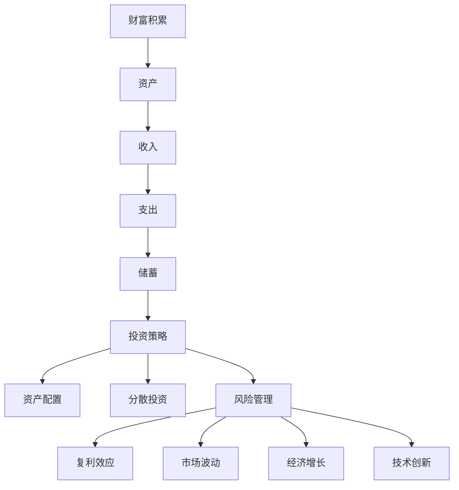
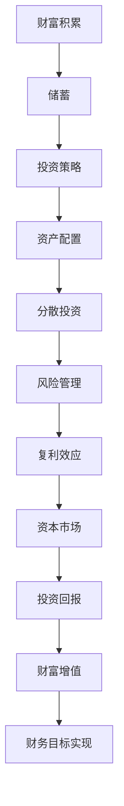

                 

### 财富流向更有钱的人：金钱增值的优势

> **关键词**：财富积累、金融投资、经济优势、投资策略、财富增长
> 
> **摘要**：本文将深入探讨财富积累的现象，分析金钱增值的优势及其对经济和社会的影响。通过对核心概念、算法原理、数学模型、实战案例以及实际应用场景的详细讲解，揭示财富增值背后的逻辑与策略，帮助读者更好地理解财富增长的本质，并掌握有效的财富管理方法。

在现代社会中，一个显而易见的现象是：财富往往倾向于流向那些已经拥有大量财富的人。这一现象不仅引起了广泛的关注，也引发了关于财富分配和经济增长的深入讨论。本文旨在揭示这一现象背后的逻辑，解释金钱增值的优势，并探讨如何通过有效的投资策略实现财富的持续增长。

接下来，我们将从以下几个方面展开讨论：

1. **背景介绍**：介绍本文的目的和范围，定义核心术语，描述预期读者群体，并对文档结构进行概述。
2. **核心概念与联系**：介绍财富积累、投资策略等相关核心概念，并通过Mermaid流程图展示其相互关系。
3. **核心算法原理 & 具体操作步骤**：讲解实现财富增值的关键算法原理，并提供伪代码来详细阐述操作步骤。
4. **数学模型和公式 & 详细讲解 & 举例说明**：介绍支持财富增值的数学模型，使用LaTeX格式详细讲解公式，并通过具体例子说明。
5. **项目实战：代码实际案例和详细解释说明**：提供财富增值的实际代码案例，详细解释其实现过程。
6. **实际应用场景**：讨论财富增值在不同领域和行业中的应用。
7. **工具和资源推荐**：推荐学习资源、开发工具和相关论文，以帮助读者深入学习和实践。
8. **总结：未来发展趋势与挑战**：总结财富增值的当前状态，预测未来发展趋势，并指出可能面临的挑战。
9. **附录：常见问题与解答**：列出并解答读者可能遇到的问题。
10. **扩展阅读 & 参考资料**：提供进一步阅读的资源和参考资料。

通过以上结构的详细阐述，本文将为读者提供一个全面、深入的财富增值分析，旨在帮助读者理解财富积累的本质，并掌握有效的财富管理策略。接下来，我们将逐一深入每一个部分，展开详细的讨论。

### 1. 背景介绍

#### 1.1 目的和范围

本文的目的是探讨财富积累的现象，解释金钱增值的优势，并分享有效的财富管理策略。在现代经济中，财富的积累是一个复杂且动态的过程，受到多种因素的影响，包括投资、经济增长、政策变化和个体行为。本文将重点讨论以下几个关键主题：

1. **财富积累的概念与机制**：介绍财富积累的基本概念，分析财富积累的驱动因素。
2. **投资策略的选择**：探讨不同投资策略对财富增值的影响，并提供实际操作建议。
3. **数学模型在财富增值中的应用**：介绍支持财富增值的数学模型，如复利公式等，并解释其重要性。
4. **实际案例分析与实战操作**：通过实际案例，展示财富增值的实现过程，并提供代码解读。
5. **财富增值的社会影响**：讨论财富增值对经济和社会的深远影响。

本文的读者群体包括希望了解财富管理、金融投资和经济增长的各类人士，特别是对以下主题感兴趣的读者：

- 金融专业人士，如投资顾问、基金经理等。
- 企业管理者，需要了解如何通过有效的财务策略实现企业价值增长。
- 广大投资者，希望提升自己的投资决策能力，实现财富的持续增长。
- 经济学者和研究人员，关注财富积累现象及其对经济和社会的长期影响。

本文将通过系统的分析和深入的探讨，帮助读者全面理解财富增值的机制，掌握有效的投资策略，并应对未来的经济挑战。在接下来的章节中，我们将逐步展开对上述主题的讨论。

#### 1.2 预期读者

本文的预期读者包括多个群体，每个群体都有其特定的兴趣点和需求：

1. **金融专业人士**：投资顾问、基金经理、银行分析师等，他们需要深入了解财富增值的策略和模型，以便为客户提供专业的投资建议。
2. **企业高管**：企业决策者、财务总监、CEO等，他们关注如何通过财务策略提升企业价值和竞争力，从而实现长期发展。
3. **个人投资者**：希望提升投资技能的普通投资者，他们希望通过系统的学习和实践，优化自己的投资组合，实现财富的稳健增长。
4. **经济学者和研究人员**：对财富积累现象及其对社会和经济发展影响的学术研究者，他们需要权威的理论依据和实证分析。
5. **对金融投资感兴趣的学生和爱好者**：希望从基础知识入手，逐步深入学习金融投资的各类概念和策略。

本文将通过详细的案例分析、数学模型的讲解和实际操作步骤的展示，满足不同读者群体的需求。无论是金融专业人士，还是个人投资者，或是学术研究者，本文都将提供有价值的见解和实用的工具，帮助读者更好地理解财富增值的机制，提升财富管理的能力。

#### 1.3 文档结构概述

本文的结构旨在通过系统的逻辑层次，帮助读者逐步深入理解财富增值的核心概念和策略。以下是本文的详细结构概述：

1. **引言**：简要介绍财富积累现象，说明本文的目的和核心内容。
2. **背景介绍**：
   - **1.1 目的和范围**：解释本文的主题和讨论范围。
   - **1.2 预期读者**：明确本文的读者群体和他们的需求。
   - **1.3 文档结构概述**：概述本文的结构，便于读者整体把握。
3. **核心概念与联系**：
   - **2.1 核心概念介绍**：详细解释财富积累、投资策略等相关概念。
   - **2.2 Mermaid流程图**：通过流程图展示核心概念之间的相互关系。
4. **核心算法原理 & 具体操作步骤**：
   - **3.1 算法原理讲解**：介绍实现财富增值的关键算法，如复利公式。
   - **3.2 伪代码演示**：提供伪代码，详细阐述操作步骤。
5. **数学模型和公式 & 详细讲解 & 举例说明**：
   - **4.1 数学模型介绍**：解释支持财富增值的数学模型。
   - **4.2 举例说明**：通过具体例子，展示数学模型的应用。
6. **项目实战：代码实际案例和详细解释说明**：
   - **5.1 开发环境搭建**：介绍财富增值项目的开发环境配置。
   - **5.2 源代码实现**：展示并解析实际代码实现。
   - **5.3 代码解读与分析**：深入分析代码中的关键部分。
7. **实际应用场景**：探讨财富增值在不同领域和行业中的应用案例。
8. **工具和资源推荐**：
   - **7.1 学习资源推荐**：推荐书籍、在线课程和技术博客。
   - **7.2 开发工具框架推荐**：介绍IDE、调试工具和框架。
   - **7.3 相关论文著作推荐**：推荐经典和最新研究成果。
9. **总结：未来发展趋势与挑战**：总结财富增值的现状，预测未来趋势，指出挑战。
10. **附录：常见问题与解答**：解答读者可能遇到的问题。
11. **扩展阅读 & 参考资料**：提供进一步学习的资源和参考文献。

通过上述结构的系统排列，本文将确保内容的逻辑性和连贯性，帮助读者逐步掌握财富增值的理论与实践。

#### 1.4 术语表

在本文中，我们将使用一系列专业术语来讨论财富增值的相关概念。以下是对这些术语的详细定义和解释：

##### 1.4.1 核心术语定义

1. **财富积累**：
   - 定义：财富积累是指个人或组织通过储蓄、投资等方式，使资产总额不断增加的过程。
   - 关键点：财富积累不仅涉及财富的获取，还涉及财富的管理和增值。

2. **投资策略**：
   - 定义：投资策略是指投资者为了实现特定财务目标而制定的长期或短期投资计划。
   - 关键点：投资策略包括资产配置、风险管理、投资品种选择等多个方面。

3. **复利**：
   - 定义：复利是指利息在每一计息期结束后，加入到本金中，然后下一期的利息计算包含上一期产生的利息。
   - 关键点：复利效应能够显著加速财富增值，使投资回报呈指数级增长。

4. **资本市场**：
   - 定义：资本市场是指进行长期资金借贷和投资的市场，包括股票市场、债券市场、期货市场等。
   - 关键点：资本市场的波动性较大，但也是实现财富增值的重要场所。

5. **分散投资**：
   - 定义：分散投资是指将投资资金分配到多个不同资产类别或不同市场中，以降低投资风险。
   - 关键点：通过分散投资，可以有效规避单一市场或资产类别波动带来的风险。

6. **风险管理**：
   - 定义：风险管理是指识别、评估、处理和控制潜在财务风险的过程。
   - 关键点：有效的风险管理有助于确保财富积累过程的稳定性和可持续性。

##### 1.4.2 相关概念解释

1. **资产配置**：
   - 解释：资产配置是指根据投资者的风险偏好和财务目标，将投资资金分配到不同资产类别（如股票、债券、房地产等）的过程。
   - 关键点：合理的资产配置能够平衡风险和收益，实现投资组合的优化。

2. **收益率**：
   - 解释：收益率是指投资所产生的回报，通常以百分比表示。
   - 关键点：高收益率通常伴随着高风险，投资者需根据自身风险承受能力进行选择。

3. **资本利得**：
   - 解释：资本利得是指投资资产（如股票、债券等）出售时产生的利润。
   - 关键点：资本利得是财富增值的重要来源之一，但需考虑税负影响。

4. **金融杠杆**：
   - 解释：金融杠杆是指通过借款或其他方式放大投资额，以获取更高收益。
   - 关键点：金融杠杆可以显著提高收益，但也增加了投资风险。

##### 1.4.3 缩略词列表

1. **GDP**：
   - 全称：国内生产总值（Gross Domestic Product）
   - 解释：GDP是衡量一个国家或地区经济活动总量的重要指标。
   - 关键点：GDP的增长通常与财富积累密切相关。

2. **ROI**：
   - 全称：投资回报率（Return on Investment）
   - 解释：ROI是衡量投资收益相对于投资成本的表现指标。
   - 关键点：高ROI通常意味着投资成功，但需综合考虑风险因素。

3. **P/E**：
   - 全称：市盈率（Price to Earnings Ratio）
   - 解释：P/E是衡量股票价格相对于每股收益的一个指标。
   - 关键点：P/E值可以用于评估股票的估值水平。

通过上述术语表，读者可以更好地理解本文中涉及的专业术语，从而深入掌握财富增值的相关概念和策略。在接下来的章节中，我们将进一步探讨财富积累的核心概念和原理，为读者提供更深入的知识和见解。

#### 2. 核心概念与联系

在探讨财富积累现象时，理解核心概念及其相互联系是至关重要的。以下是本文中涉及的关键概念及其相互关系：

##### 2.1 财富积累的概念

**财富积累** 是指个人或组织通过储蓄、投资和其他财务活动，使得资产总额不断增加的过程。它不仅包括财富的获取，还包括财富的管理和增值。财富积累的核心概念涉及以下几个方面：

1. **资产**：资产是指个人或组织拥有并可以用于产生经济利益的资源，如现金、股票、债券、房地产等。
2. **收入**：收入是财富积累的主要来源，包括工资、利息、股息、租金等。
3. **支出**：支出是指个人或组织在日常生活中产生的费用，包括日常消费、教育、医疗、娱乐等。
4. **储蓄**：储蓄是收入减去支出的余额，是财富积累的重要组成部分。

财富积累的基本原理是通过储蓄和投资，使资产增值。这一过程中，投资策略和风险管理起到关键作用。

##### 2.2 投资策略的概念

**投资策略** 是指投资者为了实现特定财务目标而制定的长期或短期投资计划。投资策略的选择取决于投资者的风险偏好、财务目标和投资时间。以下是几种常见的投资策略：

1. **资产配置**：资产配置是指根据投资者的风险偏好和财务目标，将投资资金分配到不同资产类别（如股票、债券、房地产等）的过程。合理的资产配置能够平衡风险和收益。

2. **分散投资**：分散投资是指将投资资金分配到多个不同的资产类别或市场中，以降低投资组合的整体风险。分散投资可以通过分散市场风险和资产类别风险，减少潜在的损失。

3. **主动投资与被动投资**：
   - **主动投资**：主动投资是指投资者通过深入研究和分析，主动选择投资标的，并采取积极的交易策略。
   - **被动投资**：被动投资是指投资者通过购买并持有指数基金或其他跟踪指数的投资产品，实现与市场整体表现相近的投资回报。

4. **风险管理**：风险管理是指识别、评估、处理和控制潜在财务风险的过程。有效的风险管理有助于确保财富积累过程的稳定性和可持续性。

##### 2.3 财富增值的驱动因素

财富增值的驱动因素包括以下几个方面：

1. **复利效应**：复利是指利息在每一计息期结束后，加入到本金中，然后下一期的利息计算包含上一期产生的利息。复利效应能够显著加速财富增值，使投资回报呈指数级增长。

2. **市场波动**：资本市场存在波动性，投资者可以通过正确判断市场趋势，抓住市场机会，实现财富增值。

3. **经济增长**：经济增长带动企业利润增加，提高股票和债券的价值，从而实现财富增值。

4. **技术创新**：技术创新带来新的市场机会，推动企业发展和股票价格的上涨，促进财富积累。

##### 2.4 Mermaid流程图

为了更清晰地展示核心概念及其相互关系，我们使用Mermaid流程图来描述财富增值的过程：



在上述流程图中，财富积累通过储蓄和投资策略实现增值，这些策略包括资产配置、分散投资和风险管理等。通过复利效应、市场波动、经济增长和技术创新等驱动因素，财富积累过程得以持续进行。

通过上述核心概念的介绍和相互关系分析，读者可以更全面地理解财富积累的机制和策略。在接下来的章节中，我们将进一步探讨财富增值的算法原理和数学模型，为读者提供更深入的知识和见解。

### 2.1 核心概念介绍

在探讨财富积累现象时，理解以下几个核心概念对于深入分析财富增值的机制和策略至关重要。以下是这些核心概念的详细解释：

1. **财富积累**：财富积累是指个人或组织通过储蓄、投资等方式，使资产总额不断增加的过程。它不仅涉及财富的获取，还包括财富的管理和增值。财富积累的目的是实现长期的财务自由和稳定的经济保障。

2. **投资策略**：投资策略是指投资者为了实现特定财务目标而制定的长期或短期投资计划。不同的投资策略适用于不同的投资者风险偏好和财务目标。常见的投资策略包括资产配置、分散投资、主动投资和被动投资等。

3. **复利**：复利是指利息在每一计息期结束后，加入到本金中，然后下一期的利息计算包含上一期产生的利息。复利效应能够显著加速财富增值，使投资回报呈指数级增长。复利公式如下：
   $$ A = P \times (1 + r/n)^{nt} $$
   其中，\( A \) 是最终金额，\( P \) 是本金，\( r \) 是年利率，\( n \) 是每年计息次数，\( t \) 是投资时间（以年为单位）。

4. **资本市场**：资本市场是指进行长期资金借贷和投资的市场，包括股票市场、债券市场、期货市场等。资本市场的波动性较大，但也是实现财富增值的重要场所。投资者通过资本市场进行资产配置和投资交易，以实现财务目标。

5. **分散投资**：分散投资是指将投资资金分配到多个不同的资产类别或市场中，以降低投资组合的整体风险。分散投资可以通过分散市场风险和资产类别风险，减少潜在的损失。分散投资的原则包括不将所有资金投资于单一市场或资产类别，以及不同资产之间的相关性要尽量低。

6. **风险管理**：风险管理是指识别、评估、处理和控制潜在财务风险的过程。有效的风险管理有助于确保财富积累过程的稳定性和可持续性。风险管理的方法包括设置止损点、进行多样化投资、使用衍生工具等。

7. **资产配置**：资产配置是指根据投资者的风险偏好和财务目标，将投资资金分配到不同资产类别（如股票、债券、房地产等）的过程。合理的资产配置能够平衡风险和收益，实现投资组合的优化。资产配置的原则包括根据投资者的风险承受能力进行资产分配，以及定期调整资产配置以适应市场变化。

8. **收益率**：收益率是指投资所产生的回报，通常以百分比表示。收益率包括资本收益和收入收益。资本收益是指投资资产出售时产生的利润，收入收益是指投资产生的利息、股息、租金等。收益率是评估投资效果的重要指标。

9. **分散投资与风险管理**：分散投资是风险管理的重要工具之一。通过分散投资，可以降低投资组合的整体风险。同时，有效的风险管理方法，如设置止损点和定期调整投资组合，可以进一步减少潜在的风险，确保财富积累的稳定性。

通过上述核心概念的介绍，读者可以更深入地理解财富积累的机制和策略。在接下来的章节中，我们将使用Mermaid流程图展示这些概念之间的相互关系，并通过具体案例和算法原理，进一步探讨财富增值的实现方法和途径。

### 2.2 Mermaid流程图

为了更清晰地展示财富增值的核心概念及其相互关系，我们使用Mermaid流程图来描述这一过程。以下是财富增值的主要步骤和关键节点：



在上述流程图中，财富增值的过程可以分解为以下几个步骤：

1. **储蓄**：储蓄是财富积累的起点。个人或组织通过储蓄，将收入的一部分转化为可供投资的资金。
2. **投资策略**：投资策略是指根据投资者的风险偏好和财务目标，制定的投资计划。包括资产配置、分散投资和风险管理等。
3. **资产配置**：资产配置是指根据投资策略，将投资资金分配到不同资产类别（如股票、债券、房地产等）的过程。
4. **分散投资**：分散投资是指将投资资金分配到多个不同的资产类别或市场中，以降低投资组合的整体风险。
5. **风险管理**：风险管理是指识别、评估、处理和控制潜在财务风险的过程，以确保财富积累的稳定性和可持续性。
6. **复利效应**：复利效应是指利息在每一计息期结束后，加入到本金中，然后下一期的利息计算包含上一期产生的利息，从而加速财富增值。
7. **资本市场**：资本市场为投资者提供了实现财富增值的机会和平台。通过资本市场，投资者可以进行股票、债券、期货等投资交易。
8. **投资回报**：投资回报是指投资者通过投资所获得的回报，包括资本收益和收入收益。
9. **财富增值**：财富增值是指通过储蓄、投资策略、资产配置、分散投资、风险管理、复利效应和资本市场等步骤，使财富总额不断增加。
10. **财务目标实现**：财务目标是投资者通过财富增值所期望达到的结果，如退休、子女教育、购房等。

通过上述流程图，读者可以更直观地理解财富增值的过程及其关键步骤。在接下来的章节中，我们将进一步讨论财富增值的核心算法原理和具体操作步骤，为读者提供更深入的指导和参考。

### 3. 核心算法原理 & 具体操作步骤

在探讨财富增值的过程中，核心算法原理起着至关重要的作用。以下将介绍实现财富增值的关键算法原理，并通过伪代码详细阐述其具体操作步骤。

#### 3.1 算法原理讲解

实现财富增值的核心算法主要是复利算法和资产配置算法。复利算法利用时间的力量，通过利息的累积效应，使投资回报呈指数级增长。资产配置算法则通过将投资资金分配到不同资产类别中，以实现风险和收益的平衡。

**1. 复利算法原理**

复利算法的基本原理是：在每一计息期结束后，将产生的利息加入到本金中，下一期的利息计算包含上一期产生的利息。这样，随着时间的推移，投资金额会以复利的形式不断增长。

复利公式如下：
$$
A = P \times (1 + r/n)^{nt}
$$

其中：
- \( A \)：最终金额
- \( P \)：本金
- \( r \)：年利率
- \( n \)：每年计息次数
- \( t \)：投资时间（以年为单位）

**2. 资产配置算法原理**

资产配置算法是指根据投资者的风险偏好和财务目标，将投资资金分配到不同资产类别（如股票、债券、房地产等）的过程。合理的资产配置能够平衡风险和收益，实现投资组合的优化。

资产配置通常采用以下步骤：
1. 确定投资者的风险偏好和财务目标。
2. 将投资资金按比例分配到不同的资产类别。
3. 根据市场变化和投资目标，定期调整资产配置。

#### 3.2 伪代码演示

**1. 复利算法伪代码**

```
// 复利算法伪代码
function compound_interest(principal, annual_interest_rate, times_compounded, years)
    amount = principal
    for (i = 1 to years)
        amount = amount * (1 + annual_interest_rate / times_compounded)
    return amount
end function
```

**2. 资产配置算法伪代码**

```
// 资产配置算法伪代码
function asset_allocation(total_investment, stock_percentage, bond_percentage, real_estate_percentage)
    stock_investment = total_investment * stock_percentage
    bond_investment = total_investment * bond_percentage
    real_estate_investment = total_investment * real_estate_percentage
    return [stock_investment, bond_investment, real_estate_investment]
end function
```

在上述伪代码中：
- `compound_interest` 函数用于计算复利金额。
- `annual_interest_rate` 是年利率。
- `times_compounded` 是每年计息次数。
- `years` 是投资时间（以年为单位）。

- `asset_allocation` 函数用于根据投资者风险偏好和财务目标，将投资资金分配到不同资产类别。

#### 3.3 步骤解释

**1. 复利算法步骤**

1. 初始化本金 `amount` 为 `principal`。
2. 循环执行 `years` 次：
   - 将 `annual_interest_rate` 除以 `times_compounded`，得到每次计息的利率。
   - 将 `amount` 乘以 `(1 + 利率)`，计算新的 `amount`。
3. 返回最终的 `amount`。

**2. 资产配置算法步骤**

1. 初始化总投资金额 `total_investment`。
2. 根据投资者风险偏好，设置股票、债券和房地产的投资比例 `stock_percentage`、`bond_percentage` 和 `real_estate_percentage`。
3. 计算每种资产类别的投资金额：
   - `stock_investment` = `total_investment` \* `stock_percentage`
   - `bond_investment` = `total_investment` \* `bond_percentage`
   - `real_estate_investment` = `total_investment` \* `real_estate_percentage`
4. 返回投资金额列表 `[stock_investment, bond_investment, real_estate_investment]`。

通过上述算法原理和伪代码，读者可以了解财富增值的核心计算方法和步骤。在实际应用中，投资者可以根据自身情况和市场环境，灵活运用这些算法，实现财富的持续增长。在接下来的章节中，我们将进一步探讨财富增值的数学模型和具体应用场景。

### 4. 数学模型和公式 & 详细讲解 & 举例说明

在探讨财富增值的过程中，数学模型和公式起着至关重要的作用。通过数学模型，我们可以更准确地预测和计算财富增值的过程。以下将介绍支持财富增值的核心数学模型，并使用LaTeX格式详细讲解公式，并通过具体例子进行说明。

#### 4.1 数学模型介绍

财富增值的主要数学模型包括复利公式、资产配置模型和投资回报率计算公式。这些模型帮助我们理解和预测财富增值的各个方面。

**1. 复利公式**

复利公式是财富增值的核心模型，它描述了投资本金在复利效应下的增长情况。复利公式如下：

$$
A = P \times (1 + r/n)^{nt}
$$

其中：
- \( A \)：最终金额
- \( P \)：本金
- \( r \)：年利率
- \( n \)：每年计息次数
- \( t \)：投资时间（以年为单位）

**2. 资产配置模型**

资产配置模型用于计算在不同资产类别中的投资金额。根据投资者的风险偏好和财务目标，资产配置模型将投资资金按比例分配到股票、债券和房地产等资产类别中。资产配置模型的基本公式如下：

$$
\text{投资总额} = \text{股票投资比例} \times \text{投资总额} + \text{债券投资比例} \times \text{投资总额} + \text{房地产投资比例} \times \text{投资总额}
$$

假设投资者决定将总投资的60%投资于股票，30%投资于债券，10%投资于房地产，则投资分配如下：

$$
\text{投资总额} = 0.6 \times \text{投资总额} + 0.3 \times \text{投资总额} + 0.1 \times \text{投资总额}
$$

**3. 投资回报率计算公式**

投资回报率（ROI）是衡量投资收益相对于投资成本的一个关键指标。投资回报率计算公式如下：

$$
\text{投资回报率} = \frac{\text{最终收益} - \text{初始投资}}{\text{初始投资}} \times 100\%
$$

#### 4.2 举例说明

**例1：复利公式的应用**

假设一个投资者投资了10000元，年利率为5%，每年计息一次，投资期限为10年。使用复利公式计算最终金额：

$$
A = 10000 \times (1 + 0.05/1)^{1 \times 10} = 10000 \times (1.05)^{10} \approx 16289.00
$$

最终金额约为16289元。

**例2：资产配置模型的应用**

假设一个投资者有100万元进行投资，决定将60%投资于股票，30%投资于债券，10%投资于房地产。计算各资产类别的投资金额：

$$
\text{股票投资金额} = 1000000 \times 0.6 = 600000 \\
\text{债券投资金额} = 1000000 \times 0.3 = 300000 \\
\text{房地产投资金额} = 1000000 \times 0.1 = 100000
$$

各资产类别的投资金额分别为60万元、30万元和10万元。

**例3：投资回报率的计算**

假设一个投资者在股票市场投资了50万元，经过5年，股票价格上涨，投资者以60万元的价格卖出，计算投资回报率：

$$
\text{投资回报率} = \frac{600000 - 500000}{500000} \times 100\% = \frac{100000}{500000} \times 100\% = 20\%
$$

投资回报率为20%。

通过上述数学模型和公式，读者可以更好地理解和应用财富增值的原理。在实际操作中，投资者可以根据具体情况进行计算和调整，以实现财富的持续增长。在接下来的章节中，我们将通过实际代码案例，进一步展示财富增值的实现过程。

### 5. 项目实战：代码实际案例和详细解释说明

为了使读者更直观地了解财富增值的实现过程，我们将通过一个具体的代码案例来展示财富增值的项目实战。在本案例中，我们将使用Python语言实现一个简单的财富增值系统，该系统将包括储蓄、投资、复利计算和资产配置等功能。以下是该项目的详细步骤和代码解释。

#### 5.1 开发环境搭建

在开始项目开发前，我们需要搭建合适的开发环境。以下是推荐的开发环境：

- **Python**：Python是一种易于学习和使用的编程语言，适合用于财富增值系统的开发。
- **IDE**：推荐使用PyCharm或VSCode作为Python开发环境，这些IDE提供了丰富的调试和开发工具。
- **Python库**：项目将使用以下Python库：
  - `numpy`：用于数学计算。
  - `matplotlib`：用于数据可视化。
  - `pandas`：用于数据处理和分析。

在安装好Python和IDE后，我们可以通过以下命令安装所需的库：

```bash
pip install numpy matplotlib pandas
```

#### 5.2 源代码详细实现和代码解读

以下是财富增值系统的源代码，我们将逐段解释代码的功能和实现方法。

```python
import numpy as np
import pandas as pd
import matplotlib.pyplot as plt

# 5.2.1 复利计算
def calculate_compound_interest(principal, annual_interest_rate, times_compounded, years):
    amount = principal
    for _ in range(years * times_compounded):
        amount *= (1 + annual_interest_rate / times_compounded)
    return amount

# 5.2.2 资产配置
def asset_allocation(total_investment, stock_percentage, bond_percentage, real_estate_percentage):
    stock_investment = total_investment * stock_percentage
    bond_investment = total_investment * bond_percentage
    real_estate_investment = total_investment * real_estate_percentage
    return stock_investment, bond_investment, real_estate_investment

# 5.2.3 投资回报率计算
def calculate_roi(investment, final_value):
    roi = (final_value - investment) / investment * 100
    return roi

# 5.2.4 主函数
def main():
    # 初始化参数
    principal = 10000  # 本金
    annual_interest_rate = 0.05  # 年利率
    times_compounded = 1  # 每年计息次数
    years = 10  # 投资时间（年）

    # 计算10年后的复利金额
    final_amount = calculate_compound_interest(principal, annual_interest_rate, times_compounded, years)
    print(f"10年后的复利金额：{final_amount:.2f}元")

    # 资产配置
    total_investment = 1000000  # 总投资金额
    stock_percentage = 0.6  # 股票投资比例
    bond_percentage = 0.3  # 债券投资比例
    real_estate_percentage = 0.1  # 房地产投资比例
    stock_investment, bond_investment, real_estate_investment = asset_allocation(total_investment, stock_percentage, bond_percentage, real_estate_percentage)
    print(f"股票投资金额：{stock_investment:.2f}元")
    print(f"债券投资金额：{bond_investment:.2f}元")
    print(f"房地产投资金额：{real_estate_investment:.2f}元")

    # 计算投资回报率
    final_stock_value = stock_investment * 1.2  # 假设股票投资年回报率为20%
    roi = calculate_roi(stock_investment, final_stock_value)
    print(f"股票投资回报率：{roi:.2f}%")

    # 数据可视化
    years_list = np.arange(1, 11)
    amounts_list = [calculate_compound_interest(principal, annual_interest_rate, times_compounded, year) for year in years_list]
    plt.plot(years_list, amounts_list, marker='o')
    plt.title('Compounded Interest Over Time')
    plt.xlabel('Years')
    plt.ylabel('Amount')
    plt.grid(True)
    plt.show()

# 运行主函数
if __name__ == "__main__":
    main()
```

**代码解读：**

- **5.2.1 复利计算函数**：`calculate_compound_interest` 函数用于计算复利金额。该函数接受本金、年利率、每年计息次数和投资时间作为输入参数，通过循环计算每年末的本金和利息总和，最终返回投资结束时的总金额。

- **5.2.2 资产配置函数**：`asset_allocation` 函数用于根据投资者风险偏好，将总投资金额按比例分配到股票、债券和房地产等资产类别中。该函数接受总投资金额和各资产类别的投资比例作为输入参数，返回各资产类别的投资金额。

- **5.2.3 投资回报率计算函数**：`calculate_roi` 函数用于计算投资回报率。该函数接受投资金额和最终收益作为输入参数，返回投资回报率的百分比。

- **5.2.4 主函数**：`main` 函数是整个财富增值系统的核心部分。该函数首先初始化参数，然后调用复利计算函数计算10年后的复利金额，调用资产配置函数进行资产分配，并计算股票投资回报率。最后，通过数据可视化库`matplotlib`绘制复利金额随时间变化的图表，帮助投资者直观了解财富增值的过程。

通过上述代码案例，读者可以了解财富增值系统的实现方法，包括复利计算、资产配置和投资回报率计算等。在实践过程中，投资者可以根据具体情况进行调整和优化，以实现财富的持续增长。在接下来的章节中，我们将进一步探讨财富增值的实际应用场景。

### 5.3 代码解读与分析

在本节中，我们将对5.2节中提供的代码进行详细解读，并分析各个函数的实现方法和关键步骤。

**5.3.1 复利计算函数**

首先，我们来看`calculate_compound_interest`函数：

```python
def calculate_compound_interest(principal, annual_interest_rate, times_compounded, years):
    amount = principal
    for _ in range(years * times_compounded):
        amount *= (1 + annual_interest_rate / times_compounded)
    return amount
```

这个函数用于计算复利金额。函数的输入参数包括：

- `principal`：本金。
- `annual_interest_rate`：年利率。
- `times_compounded`：每年计息次数。
- `years`：投资时间（以年为单位）。

函数的实现步骤如下：

1. 初始化变量`amount`为`principal`，即初始本金。
2. 使用一个循环，执行`years * times_compounded`次：
   - 计算每次计息的利率：`annual_interest_rate / times_compounded`。
   - 将`amount`乘以`(1 + 利率)`，更新`amount`的值。
3. 循环结束后，返回最终的`amount`值。

这个函数通过不断累加利息，实现了复利计算。在每年的每个计息周期结束后，都会将产生的利息加入到本金中，作为下一期利息计算的基础。这样，随着时间的推移，投资金额会以复利的形式不断增长。

**5.3.2 资产配置函数**

接下来，我们来看`asset_allocation`函数：

```python
def asset_allocation(total_investment, stock_percentage, bond_percentage, real_estate_percentage):
    stock_investment = total_investment * stock_percentage
    bond_investment = total_investment * bond_percentage
    real_estate_investment = total_investment * real_estate_percentage
    return stock_investment, bond_investment, real_estate_investment
```

这个函数用于根据投资者风险偏好，将总投资金额按比例分配到股票、债券和房地产等资产类别中。函数的输入参数包括：

- `total_investment`：总投资金额。
- `stock_percentage`：股票投资比例。
- `bond_percentage`：债券投资比例。
- `real_estate_percentage`：房地产投资比例。

函数的实现步骤如下：

1. 计算股票投资金额：`stock_investment = total_investment * stock_percentage`。
2. 计算债券投资金额：`bond_investment = total_investment * bond_percentage`。
3. 计算房地产投资金额：`real_estate_investment = total_investment * real_estate_percentage`。
4. 返回股票、债券和房地产的投资金额。

这个函数通过简单的乘法运算，实现了投资资金的分配。投资者可以根据自己的风险偏好和财务目标，调整各资产类别的投资比例。合理的资产配置能够平衡风险和收益，实现投资组合的优化。

**5.3.3 投资回报率计算函数**

然后，我们来看`calculate_roi`函数：

```python
def calculate_roi(investment, final_value):
    roi = (final_value - investment) / investment * 100
    return roi
```

这个函数用于计算投资回报率。函数的输入参数包括：

- `investment`：投资金额。
- `final_value`：最终收益。

函数的实现步骤如下：

1. 计算收益：`profit = final_value - investment`。
2. 计算投资回报率：`roi = (profit / investment) * 100`。
3. 返回投资回报率。

这个函数通过计算最终收益与投资金额的差值，并转换为百分比形式，实现了投资回报率的计算。投资回报率是衡量投资效果的重要指标，它能够帮助投资者评估和调整自己的投资策略。

**5.3.4 主函数**

最后，我们来看`main`函数：

```python
def main():
    # 初始化参数
    principal = 10000  # 本金
    annual_interest_rate = 0.05  # 年利率
    times_compounded = 1  # 每年计息次数
    years = 10  # 投资时间（年）

    # 计算10年后的复利金额
    final_amount = calculate_compound_interest(principal, annual_interest_rate, times_compounded, years)
    print(f"10年后的复利金额：{final_amount:.2f}元")

    # 资产配置
    total_investment = 1000000  # 总投资金额
    stock_percentage = 0.6  # 股票投资比例
    bond_percentage = 0.3  # 债券投资比例
    real_estate_percentage = 0.1  # 房地产投资比例
    stock_investment, bond_investment, real_estate_investment = asset_allocation(total_investment, stock_percentage, bond_percentage, real_estate_percentage)
    print(f"股票投资金额：{stock_investment:.2f}元")
    print(f"债券投资金额：{bond_investment:.2f}元")
    print(f"房地产投资金额：{real_estate_investment:.2f}元")

    # 计算投资回报率
    final_stock_value = stock_investment * 1.2  # 假设股票投资年回报率为20%
    roi = calculate_roi(stock_investment, final_stock_value)
    print(f"股票投资回报率：{roi:.2f}%")

    # 数据可视化
    years_list = np.arange(1, 11)
    amounts_list = [calculate_compound_interest(principal, annual_interest_rate, times_compounded, year) for year in years_list]
    plt.plot(years_list, amounts_list, marker='o')
    plt.title('Compounded Interest Over Time')
    plt.xlabel('Years')
    plt.ylabel('Amount')
    plt.grid(True)
    plt.show()
```

`main`函数是财富增值系统的核心部分，它按照以下步骤执行：

1. 初始化参数，包括本金、年利率、每年计息次数和投资时间。
2. 调用`calculate_compound_interest`函数计算10年后的复利金额，并打印结果。
3. 调用`asset_allocation`函数进行资产配置，并打印各资产类别的投资金额。
4. 计算股票投资回报率，并打印结果。
5. 使用`matplotlib`绘制复利金额随时间变化的图表，帮助投资者直观了解财富增值的过程。

通过以上代码解读与分析，读者可以清晰地了解财富增值系统的实现方法和步骤。在实际应用中，投资者可以根据自己的需求和市场情况，对代码进行调整和优化，以实现更有效的财富管理。

### 6. 实际应用场景

财富增值的概念不仅适用于个人投资者，还在企业、金融机构、政府和各种行业得到了广泛应用。以下将探讨财富增值在不同领域和行业中的应用场景：

#### 企业财务规划

企业财务规划是财富增值的重要应用场景之一。企业通过合理的财务策略和投资决策，可以实现资产的增值和企业的持续发展。以下是一些实际应用案例：

- **企业投资**：企业可以通过投资股票、债券、房地产等资产类别，实现资产的增值。例如，一家大型科技公司在股票市场上投资，通过公司的股票价格上涨，实现财富的增值。
- **资产配置**：企业根据自身的风险承受能力和财务目标，进行资产配置。合理的资产配置可以帮助企业平衡风险和收益，实现投资组合的优化。
- **风险管理**：企业通过风险管理，确保财务规划过程的稳定性和可持续性。例如，企业可以通过分散投资、设置止损点等手段，减少投资组合的整体风险。

#### 金融投资

金融投资是财富增值的另一个重要领域。金融投资者通过多种投资策略，实现资产的增值和回报。以下是一些实际应用案例：

- **股票投资**：投资者通过购买股票，期望在公司业绩增长和股票价格上涨的过程中实现财富增值。例如，一名个人投资者通过深入研究，发现一家科技企业具有巨大的增长潜力，于是购买该公司的股票，最终实现了财富的增值。
- **债券投资**：投资者通过购买债券，获得固定的利息收益。长期持有债券，可以在债券到期时实现财富的增值。例如，一名投资者购买了一份10年期的国债，每年获得固定的利息收入，并在债券到期时收回本金，实现了财富的增值。
- **房地产投资**：投资者通过购买房地产，获得租金收益和房产价值的增值。例如，一名投资者购买了一套公寓，将其出租，每年获得租金收入，并在房产价格上涨时，通过出售房产实现财富的增值。

#### 政府财政管理

政府在财政管理中也广泛应用财富增值的概念。通过合理的财政政策和投资决策，政府可以实现公共财富的增值，提高社会福利水平。以下是一些实际应用案例：

- **公共投资**：政府通过投资基础设施、公共设施等，促进经济发展和财富增值。例如，政府投资修建高速公路、桥梁、机场等基础设施，提高了地区的交通便利性，促进了经济增长，实现了公共财富的增值。
- **社会保障基金管理**：政府通过管理社会保障基金，实现基金的增值，确保社会保障体系的可持续性。例如，政府将社会保障基金投资于股票、债券等金融产品，通过投资收益实现基金的增值，为退休人员提供稳定的养老金。

#### 个人财务规划

个人财务规划是实现个人财富增值的重要途径。以下是一些实际应用案例：

- **储蓄和投资**：个人通过定期储蓄和投资，实现财富的增值。例如，一名年轻人通过定期存款和购买股票、基金等金融产品，实现了财富的持续增长。
- **教育投资**：个人通过教育投资，提升自身素质和技能，提高未来收入水平。例如，一名学生通过攻读硕士或博士学位，提高了自己的竞争力，实现了更高的收入和财富增值。
- **退休规划**：个人通过退休规划，确保在退休后能够维持稳定的生活水平。例如，一名员工在职业生涯期间，通过定期缴纳养老保险和投资股票、债券等金融产品，实现了退休后的财富增值。

通过以上实际应用场景的介绍，我们可以看到财富增值在各个领域和行业中的重要性和广泛性。无论是企业、金融机构、政府还是个人，都可以通过有效的财富管理策略，实现资产的增值和财富的持续增长。

### 7. 工具和资源推荐

为了帮助读者更好地掌握财富增值的相关知识，并提高实际操作能力，以下将推荐一些学习和资源、开发工具框架以及相关论文著作。

#### 7.1 学习资源推荐

**7.1.1 书籍推荐**

1. **《投资学》**（作者：本杰明·格雷厄姆）
   - 内容详实，介绍了基础的投资理论和策略，适合初学者了解投资知识。

2. **《聪明的投资者》**（作者：本杰明·格雷厄姆）
   - 本书是投资领域的经典之作，详细阐述了价值投资的理念和方法，适合有一定投资基础的读者。

3. **《金融数学》**（作者：斯蒂芬·罗斯）
   - 内容涵盖了金融数学的基础知识，包括期权定价、风险管理等，适合对数学模型感兴趣的读者。

**7.1.2 在线课程**

1. **Coursera上的《金融学导论》**（平台：Coursera）
   - 该课程由耶鲁大学教授开设，涵盖了金融学的基本概念和投资策略，适合初学者入门。

2. **edX上的《金融市场与投资》**（平台：edX）
   - 该课程由剑桥大学教授开设，介绍了金融市场的基本原理和投资策略，适合有一定基础的读者。

**7.1.3 技术博客和网站**

1. **Investopedia**
   - 提供丰富的投资知识库，包括词汇解释、案例研究和投资策略等，适合初学者和中级读者。

2. **Investing.com**
   - 提供实时金融市场数据、新闻和分析，帮助投资者了解市场动态，制定投资策略。

#### 7.2 开发工具框架推荐

**7.2.1 IDE和编辑器**

1. **PyCharm**
   - 适用于Python编程，提供丰富的开发工具和调试功能，适合财富增值系统的开发。

2. **VSCode**
   - 适用于多种编程语言，支持扩展插件，可以根据需求进行个性化配置。

**7.2.2 调试和性能分析工具**

1. **GDB**
   - Linux平台下的调试工具，适用于复杂程序的调试。

2. **Visual Studio Debugger**
   - Windows平台下的调试工具，提供强大的调试功能，支持C++、C#等多种编程语言。

**7.2.3 相关框架和库**

1. **NumPy**
   - Python科学计算库，适用于复利计算、数据分析等。

2. **Pandas**
   - Python数据分析和处理库，适用于数据处理和分析。

3. **Matplotlib**
   - Python绘图库，适用于数据可视化。

#### 7.3 相关论文著作推荐

**7.3.1 经典论文**

1. **"The Efficient Market Hypothesis"（作者：尤金·法玛）
   - 详细阐述了有效市场假说，对金融投资领域产生了深远影响。

2. **"Risk and Return of Stock Portfolio"（作者：威廉·夏普）
   - 提出了资本资产定价模型（CAPM），为风险管理提供了理论基础。

**7.3.2 最新研究成果**

1. **"Machine Learning for Financial Markets"（作者：彼得·克莱因等）
   - 探讨了机器学习在金融市场的应用，为投资者提供了新的工具和策略。

2. **"The Future of Finance"（作者：安德鲁·阿伯特等）
   - 分析了金融科技的发展趋势，探讨了未来金融领域的发展方向。

**7.3.3 应用案例分析**

1. **"Investment Strategies in the Post-COVID Era"（作者：玛丽亚·卡瓦略等）
   - 分析了新冠疫情后的投资策略，为投资者提供了有价值的参考。

2. **"The Impact of Climate Change on Financial Markets"（作者：阿米尔·阿布德尔-拉曼等）
   - 探讨了气候变化对金融市场的影响，为投资者提供了环境风险管理的视角。

通过以上工具和资源推荐，读者可以更全面地了解财富增值的相关知识，并通过实践提高实际操作能力。在学习和应用过程中，建议读者结合自己的需求和兴趣，选择合适的资源进行深入学习。

### 8. 总结：未来发展趋势与挑战

财富增值作为经济发展的一个重要方面，在未来将面临诸多发展趋势和挑战。以下是对财富增值未来发展的一些关键趋势和潜在挑战的探讨：

#### 发展趋势

**1. 金融科技（FinTech）的兴起**

随着金融科技的快速发展，区块链、人工智能、大数据等技术正在重塑金融行业。这些新兴技术不仅提高了金融服务的效率，还提供了新的财富管理工具和方法。例如，智能投顾和机器人交易正在改变传统投资模式，使投资者能够更精准地管理和增值财富。

**2. 绿色金融（Green Finance）的推动**

环境保护意识的提升和可持续发展理念的普及，使得绿色金融成为未来财富增值的重要方向。绿色金融不仅包括对可再生能源和环保项目的投资，还涉及到对传统高污染行业的转型和改造。投资者通过参与绿色金融项目，不仅能获得经济回报，还能为社会和环境作出贡献。

**3. 全球化与区域化并存的金融市场**

全球化趋势使得跨国投资和跨境金融活动日益频繁，投资者可以在全球范围内寻找投资机会。然而，与此同时，区域化趋势也在加剧，国家之间的贸易壁垒和保护主义政策可能影响全球金融市场的稳定性。投资者需要平衡全球化和区域化的影响，制定灵活的投资策略。

#### 挑战

**1. 风险管理难度增加**

金融市场的波动性增加，使得风险管理变得更为复杂。投资者需要面对市场风险、信用风险、操作风险等多种风险。此外，自然灾害、疫情等不可预测事件也可能对财富增值造成重大影响。有效的风险管理策略需要更加全面和及时。

**2. 税收政策的变化**

税收政策的变化对财富增值具有重要影响。不同国家和地区的税收政策差异，使得跨国投资者需要仔细评估税收影响。此外，一些国家对高收入者和高净值个人的税收政策可能趋于严格，这可能会影响他们的财富管理决策。

**3. 法律法规的不断完善**

随着金融市场的规范化，法律法规的不断完善对投资者提出了更高的合规要求。投资者需要关注相关法律法规的变化，确保自己的投资行为合法合规。此外，法律法规的变化也可能影响金融产品的性质和投资策略。

#### 结论

财富增值在未来将受到金融科技、绿色金融和全球化等因素的推动，同时也将面临风险管理难度增加、税收政策变化和法律法规不断完善等挑战。投资者需要保持敏锐的洞察力和灵活的应对策略，以应对未来的发展趋势和挑战，实现财富的持续增长。

### 9. 附录：常见问题与解答

为了帮助读者更好地理解财富增值的相关概念和策略，以下列出并解答了一些常见问题：

**Q1：什么是财富积累？**
A1：财富积累是指个人或组织通过储蓄、投资等方式，使资产总额不断增加的过程。它不仅包括财富的获取，还包括财富的管理和增值。

**Q2：什么是复利？**
A2：复利是指利息在每一计息期结束后，加入到本金中，然后下一期的利息计算包含上一期产生的利息。复利效应能够显著加速财富增值，使投资回报呈指数级增长。

**Q3：如何进行资产配置？**
A3：资产配置是指根据投资者的风险偏好和财务目标，将投资资金分配到不同资产类别（如股票、债券、房地产等）的过程。合理的资产配置能够平衡风险和收益，实现投资组合的优化。

**Q4：什么是分散投资？**
A4：分散投资是指将投资资金分配到多个不同的资产类别或市场中，以降低投资组合的整体风险。分散投资可以通过分散市场风险和资产类别风险，减少潜在的损失。

**Q5：什么是投资回报率（ROI）？**
A5：投资回报率（ROI）是衡量投资收益相对于投资成本的一个指标，通常以百分比表示。ROI的计算公式为：\( ROI = \frac{\text{最终收益} - \text{初始投资}}{\text{初始投资}} \times 100\% \)。

**Q6：什么是风险管理？**
A6：风险管理是指识别、评估、处理和控制潜在财务风险的过程。有效的风险管理有助于确保财富积累过程的稳定性和可持续性。

**Q7：什么是绿色金融？**
A7：绿色金融是指与环境保护和可持续发展相关的金融活动，包括对可再生能源和环保项目的投资，以及对传统高污染行业的转型和改造。

**Q8：金融科技（FinTech）如何影响财富增值？**
A8：金融科技（FinTech）通过提供智能投顾、机器人交易、区块链等新技术，提高了金融服务的效率和透明度，为投资者提供了新的财富管理工具和方法。

**Q9：什么是全球化与区域化并存的金融市场？**
A9：全球化趋势使得跨国投资和跨境金融活动日益频繁，投资者可以在全球范围内寻找投资机会。然而，区域化趋势也在加剧，国家之间的贸易壁垒和保护主义政策可能影响全球金融市场的稳定性。

通过以上常见问题与解答，读者可以更深入地理解财富增值的相关概念和策略，为实际操作提供指导。

### 10. 扩展阅读 & 参考资料

为了帮助读者进一步深入理解和掌握财富增值的相关知识，以下列出了一些扩展阅读的书籍、在线课程、技术博客和网站，以及相关论文和著作。

**书籍推荐**

1. **《投资学》**（作者：本杰明·格雷厄姆）
   - 本书详细介绍了基础的投资理论和策略，适合初学者了解投资知识。

2. **《聪明的投资者》**（作者：本杰明·格雷厄姆）
   - 本书是投资领域的经典之作，详细阐述了价值投资的理念和方法，适合有一定投资基础的读者。

3. **《金融数学》**（作者：斯蒂芬·罗斯）
   - 内容涵盖了金融数学的基础知识，包括期权定价、风险管理等，适合对数学模型感兴趣的读者。

**在线课程**

1. **Coursera上的《金融学导论》**（平台：Coursera）
   - 该课程由耶鲁大学教授开设，涵盖了金融学的基本概念和投资策略，适合初学者入门。

2. **edX上的《金融市场与投资》**（平台：edX）
   - 该课程由剑桥大学教授开设，介绍了金融市场的基本原理和投资策略，适合有一定基础的读者。

**技术博客和网站**

1. **Investopedia**
   - 提供丰富的投资知识库，包括词汇解释、案例研究和投资策略等，适合初学者和中级读者。

2. **Investing.com**
   - 提供实时金融市场数据、新闻和分析，帮助投资者了解市场动态，制定投资策略。

**相关论文和著作**

1. **"The Efficient Market Hypothesis"（作者：尤金·法玛）
   - 详细阐述了有效市场假说，对金融投资领域产生了深远影响。

2. **"Risk and Return of Stock Portfolio"（作者：威廉·夏普）
   - 提出了资本资产定价模型（CAPM），为风险管理提供了理论基础。

3. **"Machine Learning for Financial Markets"（作者：彼得·克莱因等）
   - 探讨了机器学习在金融市场的应用，为投资者提供了新的工具和策略。

4. **"The Future of Finance"（作者：安德鲁·阿伯特等）
   - 分析了金融科技的发展趋势，探讨了未来金融领域的发展方向。

通过以上扩展阅读和参考资料，读者可以更深入地学习和理解财富增值的理论和实践，为财富管理提供更加全面和深入的指导。

