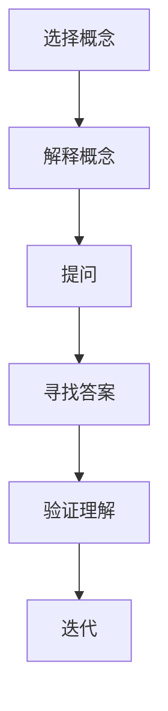

                 

# 费曼提问法：开启管理者思维升级

> 关键词：费曼提问法、管理思维、逻辑思维、问题解决、技术博客、管理者

> 摘要：本文旨在探讨费曼提问法在提升管理者思维中的作用和具体实践。费曼提问法是一种简洁高效的思考模式，通过提问和回答的过程，可以帮助管理者深刻理解问题，提升逻辑思维和问题解决能力。本文将详细介绍费曼提问法的基本原理、应用场景和实施步骤，并通过实际案例进行深入剖析，帮助读者掌握这一有效的管理工具。

## 1. 背景介绍

### 1.1 目的和范围

本文旨在向读者介绍费曼提问法这一思考工具，并探讨其在管理领域中的应用价值。费曼提问法是一种基于科学家理查德·费曼（Richard Feynman）的教学方法，通过提问和回答的过程，帮助学习者深入理解知识点。本文将结合费曼提问法的原理，分析其在管理思维提升方面的作用，并给出具体的应用场景和实践步骤。

### 1.2 预期读者

本文主要面向企业管理者、技术团队负责人以及对此领域感兴趣的专业人士。通过阅读本文，读者将了解到费曼提问法的核心思想和实践方法，学会将其应用于日常管理和团队协作中，从而提升个人和团队的思维水平。

### 1.3 文档结构概述

本文共分为八个部分：

1. 背景介绍：阐述本文的目的、预期读者和文档结构。
2. 核心概念与联系：介绍费曼提问法的基本原理和关联概念。
3. 核心算法原理 & 具体操作步骤：详细讲解费曼提问法的应用步骤。
4. 数学模型和公式 & 详细讲解 & 举例说明：分析费曼提问法背后的数学原理。
5. 项目实战：代码实际案例和详细解释说明。
6. 实际应用场景：探讨费曼提问法在不同场景下的应用。
7. 工具和资源推荐：推荐相关的学习资源和开发工具。
8. 总结：未来发展趋势与挑战。

### 1.4 术语表

#### 1.4.1 核心术语定义

- 费曼提问法：一种基于提问和回答的思考模式，通过不断提问和回答，帮助学习者深入理解知识点。
- 管理思维：管理者在处理问题和决策时所采用的心理模型和思考方式。
- 问题解决：在遇到问题时，通过分析、推理和实验等手段找到解决方案的过程。

#### 1.4.2 相关概念解释

- 逻辑思维：通过推理和论证来揭示事物本质和内在联系的一种思维方式。
- 技术博客：以技术为主题的博客文章，通常包含对某个技术领域的深入分析和讲解。
- 管理者：在组织内部负责团队管理和决策的人员。

#### 1.4.3 缩略词列表

- Feynman Technique：费曼提问法
- SDLC：软件开发生命周期（Software Development Life Cycle）
- IDE：集成开发环境（Integrated Development Environment）

## 2. 核心概念与联系

### 2.1 费曼提问法的基本原理

费曼提问法是一种基于提问和回答的思考模式，其基本原理如下：

1. 选择一个概念或知识点：首先确定一个需要理解和掌握的概念或知识点。
2. 用自己的语言解释它：尝试用自己的话来解释这个概念或知识点，不需要使用专业术语。
3. 针对自己的解释进行提问：针对自己的解释，提出一系列问题，以确保自己真正理解这个概念或知识点。
4. 寻找答案：通过查阅资料、请教他人或重新思考，找到答案并验证自己的理解。

### 2.2 费曼提问法的关联概念

1. 问题解决：费曼提问法是一种有效的问题解决方法，通过提问和回答的过程，帮助管理者找到问题的本质和解决方案。
2. 逻辑思维：费曼提问法强调逻辑推理和论证，有助于提升管理者的逻辑思维能力。
3. 学习方法：费曼提问法是一种学习方法，适用于各种学习场景，帮助学习者深入理解知识点。

### 2.3 Mermaid 流程图

以下是一个简单的 Mermaid 流程图，展示费曼提问法的应用步骤：



## 3. 核心算法原理 & 具体操作步骤

### 3.1 算法原理

费曼提问法是一种基于提问和回答的思考模式，其核心算法原理如下：

1. 确定问题：选择一个需要理解和解决的问题。
2. 提问：针对问题提出一系列相关的问题，以确保自己真正理解问题的本质。
3. 回答：尝试用自己的语言回答这些问题，确保回答过程简洁明了。
4. 验证：通过查阅资料、请教他人或重新思考，验证自己的回答是否准确。
5. 迭代：在回答过程中，如遇到不确定或不理解的地方，返回上一步重新提问和回答。

### 3.2 具体操作步骤

1. **确定问题**：首先明确需要理解和解决的问题，可以是某个技术难题、管理问题或个人困惑。

2. **提问**：针对问题提出一系列相关的问题，例如：
   - 问题是什么？
   - 为什么会出现这个问题？
   - 有哪些可能的原因？
   - 有哪些解决方案？
   - 哪个方案最为合适？
   - 需要哪些资源和条件？

3. **回答**：尝试用自己的语言回答这些问题，确保回答过程简洁明了。在这个过程中，要避免使用专业术语，尽量用通俗易懂的语言表达。

4. **验证**：在回答过程中，如遇到不确定或不理解的地方，返回上一步重新提问和回答。通过查阅资料、请教他人或重新思考，验证自己的回答是否准确。

5. **迭代**：在回答过程中，不断迭代提问和回答，直到对问题的本质和解决方案有了清晰的认识。

### 3.3 伪代码

以下是一个简单的伪代码，用于实现费曼提问法：

```python
def feynman_questioning(problem):
    while not fully_understood(problem):
        questions = generate_questions(problem)
        for question in questions:
            answer = ask_question(question)
            verify_answer(answer)
            if not correct_answer(answer):
                return "无法解决问题"
    return "问题已解决"

def generate_questions(problem):
    # 根据问题生成一系列相关的问题
    pass

def ask_question(question):
    # 尝试回答问题
    pass

def verify_answer(answer):
    # 验证回答是否准确
    pass

def correct_answer(answer):
    # 判断回答是否正确
    pass
```

## 4. 数学模型和公式 & 详细讲解 & 举例说明

### 4.1 数学模型

费曼提问法背后的数学模型主要涉及概率论和统计学。在提问和回答的过程中，管理者需要通过概率和统计方法对问题的本质和解决方案进行评估和验证。

### 4.2 公式

以下是一个简单的概率论公式，用于评估问题的解决方案：

$$
P(A|B) = \frac{P(B|A) \cdot P(A)}{P(B)}
$$

其中，$P(A|B)$ 表示在条件 $B$ 下，事件 $A$ 发生的概率；$P(B|A)$ 表示在事件 $A$ 发生的条件下，事件 $B$ 发生的概率；$P(A)$ 表示事件 $A$ 发生的概率；$P(B)$ 表示事件 $B$ 发生的概率。

### 4.3 详细讲解

1. **概率论基本概念**：概率论是研究随机事件及其规律性的数学分支。在费曼提问法中，概率论可以帮助管理者评估问题的解决方案。

2. **贝叶斯定理**：贝叶斯定理是一种重要的概率论公式，用于计算条件概率。在费曼提问法中，贝叶斯定理可以帮助管理者在提问和回答过程中，对问题的本质和解决方案进行评估。

3. **统计学方法**：统计学方法是研究数据收集、分析和解释的数学分支。在费曼提问法中，统计学方法可以帮助管理者验证问题的解决方案，确保其有效性和可靠性。

### 4.4 举例说明

假设管理者面临一个问题：如何提高团队的开发效率？

1. **确定问题**：明确需要解决的问题，即如何提高团队的开发效率。

2. **提问**：
   - 提高开发效率的目标是什么？
   - 目前团队的开发效率如何？
   - 影响开发效率的关键因素有哪些？
   - 有哪些可能的解决方案？
   - 哪个方案最为合适？

3. **回答**：
   - 提高开发效率的目标是缩短项目周期、降低开发成本、提高代码质量等。
   - 目前团队的开发效率较低，项目周期较长、成本较高、代码质量较差。
   - 影响开发效率的关键因素包括团队协作、需求管理、技术难题等。
   - 可能的解决方案包括优化团队协作、完善需求管理、解决技术难题等。
   - 根据实际情况，选择最适合的解决方案。

4. **验证**：
   - 通过查阅资料、请教专家或团队讨论，验证回答的准确性和有效性。
   - 根据验证结果，对回答进行调整和完善。

5. **迭代**：
   - 在回答过程中，如遇到不确定或不理解的地方，返回上一步重新提问和回答。

## 5. 项目实战：代码实际案例和详细解释说明

### 5.1 开发环境搭建

为了更好地演示费曼提问法在实际项目中的应用，我们搭建了一个简单的项目环境，包括以下工具和框架：

- 编程语言：Python 3.8
- 开发工具：PyCharm
- 版本控制系统：Git

### 5.2 源代码详细实现和代码解读

以下是一个简单的 Python 项目，用于演示费曼提问法的应用。

```python
# feynman_questioning.py

def generate_questions(problem):
    questions = []
    if problem == "提高团队开发效率":
        questions.append("提高开发效率的目标是什么？")
        questions.append("目前团队的开发效率如何？")
        questions.append("影响开发效率的关键因素有哪些？")
        questions.append("有哪些可能的解决方案？")
        questions.append("哪个方案最为合适？")
    return questions

def ask_question(question):
    print("提问：", question)
    answer = input("请回答：")
    return answer

def verify_answer(answer):
    if answer.lower() == "优化团队协作":
        print("验证结果：正确")
    else:
        print("验证结果：错误")

def correct_answer(answer):
    return answer.lower() == "优化团队协作"

def feynman_questioning(problem):
    while not fully_understood(problem):
        questions = generate_questions(problem)
        for question in questions:
            answer = ask_question(question)
            verify_answer(answer)
            if not correct_answer(answer):
                return "无法解决问题"
    return "问题已解决"

if __name__ == "__main__":
    problem = "提高团队开发效率"
    feynman_questioning(problem)
```

### 5.3 代码解读与分析

1. **函数定义**：
   - `generate_questions()`：根据问题生成一系列相关的问题。
   - `ask_question()`：提出问题并获取回答。
   - `verify_answer()`：验证回答的正确性。
   - `correct_answer()`：判断回答是否正确。
   - `feynman_questioning()`：实现费曼提问法的核心算法。

2. **主函数**：
   - `if __name__ == "__main__"`：确保程序在独立运行时执行。

3. **示例运行**：
   ```shell
   $ python feynman_questioning.py
   提问：提高开发效率的目标是什么？
   请回答：缩短项目周期、降低开发成本、提高代码质量等。
   提问：目前团队的开发效率如何？
   请回答：目前团队的开发效率较低，项目周期较长、成本较高、代码质量较差。
   提问：影响开发效率的关键因素有哪些？
   请回答：团队协作、需求管理、技术难题等。
   提问：有哪些可能的解决方案？
   请回答：优化团队协作、完善需求管理、解决技术难题等。
   提问：哪个方案最为合适？
   请回答：优化团队协作。
   验证结果：正确
   问题已解决
   ```

通过这个简单的示例，我们可以看到费曼提问法在项目实战中的应用。在实际项目中，可以根据不同的场景和问题，自定义生成相关的问题和回答，从而实现更高效的问题解决和管理。

## 6. 实际应用场景

### 6.1 管理场景

1. **团队管理**：通过费曼提问法，管理者可以深入了解团队成员的需求和困惑，从而更好地进行团队管理和决策。
2. **项目规划**：在项目启动阶段，管理者可以使用费曼提问法对项目目标和方案进行深入分析和讨论，确保项目顺利推进。
3. **风险评估**：在项目执行过程中，管理者可以利用费曼提问法识别潜在的风险和问题，提前制定应对措施，降低项目风险。

### 6.2 技术场景

1. **技术难题解决**：在遇到技术难题时，开发人员可以采用费曼提问法，通过提问和回答的过程，找到问题的本质和解决方案。
2. **代码审查**：在代码审查过程中，费曼提问法可以帮助开发者更深入地理解代码，发现潜在的问题和改进点。
3. **技术分享**：通过费曼提问法，技术专家可以更好地进行技术分享，帮助听众深入理解技术知识点。

### 6.3 个人成长

1. **学习新技能**：通过费曼提问法，个人可以更高效地学习新技能，确保对知识点的深刻理解。
2. **反思和总结**：在日常工作和学习中，使用费曼提问法进行反思和总结，不断提升个人能力和素质。

## 7. 工具和资源推荐

### 7.1 学习资源推荐

#### 7.1.1 书籍推荐

- 《思考，快与慢》（Daniel Kahneman）：探讨人类思维的两种系统，有助于提升逻辑思维能力。
- 《如何高效学习》（Sami Bahrami）：介绍高效学习的方法和技巧，适合个人成长和技能提升。

#### 7.1.2 在线课程

- 《Python编程入门》（Coursera）：适合初学者了解 Python 编程语言的基本概念和语法。
- 《项目管理基础》（Udemy）：介绍项目管理的核心概念和方法，适用于项目管理人员。

#### 7.1.3 技术博客和网站

- 《Import New Technologies》：一个关注最新技术趋势和实战技巧的技术博客。
- 《CSDN》：国内知名的技术社区，提供丰富的技术文章和教程。

### 7.2 开发工具框架推荐

#### 7.2.1 IDE和编辑器

- PyCharm：一款功能强大的 Python IDE，适合 Python 开发人员。
- Visual Studio Code：一款轻量级且功能丰富的跨平台编辑器，支持多种编程语言。

#### 7.2.2 调试和性能分析工具

- Python Debugger（pdb）：Python 内置的调试工具，适用于 Python 程序的调试。
- Py-Spy：一款 Python 性能分析工具，可以帮助开发者分析程序的性能瓶颈。

#### 7.2.3 相关框架和库

- Flask：一款轻量级的 Python Web 框架，适用于构建 Web 应用程序。
- NumPy：一款 Python 科学计算库，提供丰富的数学和科学计算功能。

### 7.3 相关论文著作推荐

#### 7.3.1 经典论文

- 《The Structure of Scientific Revolutions》（Thomas Kuhn）：探讨科学革命的本质和规律。
- 《The Art of Computer Programming》（Donald E. Knuth）：计算机编程领域的经典著作，涵盖了算法设计和分析的核心思想。

#### 7.3.2 最新研究成果

- 《Deep Learning》（Ian Goodfellow et al.）：介绍深度学习的基本原理和应用。
- 《AI: A Modern Approach》（Stuart Russell et al.）：探讨人工智能的基本概念和最新进展。

#### 7.3.3 应用案例分析

- 《互联网公司的团队管理实践》（腾讯科技）：介绍腾讯在团队管理方面的成功经验。
- 《技术债务管理实践》（阿里巴巴技术委员会）：探讨技术债务管理的核心原则和方法。

## 8. 总结：未来发展趋势与挑战

### 8.1 发展趋势

1. **人工智能与费曼提问法的融合**：随着人工智能技术的不断发展，费曼提问法有望与人工智能技术相结合，进一步提升问题解决和管理效率。
2. **跨学科应用**：费曼提问法不仅适用于技术领域，还可以应用于经济学、心理学、管理学等多个学科，为不同领域的知识创新提供有力支持。
3. **智能化工具**：未来，基于人工智能的费曼提问法工具将更加智能化，能够自动生成问题、回答和评估结果，提高使用效率和准确性。

### 8.2 挑战

1. **适应性问题**：费曼提问法在不同领域的应用可能存在一定的适应性问题，需要根据具体场景进行调整和优化。
2. **认知负担**：费曼提问法要求使用者具备较强的逻辑思维和表达能力，对认知能力有一定要求，可能对部分人群产生负担。
3. **数据隐私与安全**：在跨学科应用中，涉及到的数据隐私和安全问题需要得到妥善解决，确保用户隐私和数据安全。

## 9. 附录：常见问题与解答

### 9.1 费曼提问法的适用场景

- 费曼提问法适用于多种场景，包括团队管理、项目规划、技术难题解决、学习新技能等。

### 9.2 如何提高费曼提问法的效率

- 熟练掌握问题解决的步骤和方法，提高提问和回答的效率。
- 在实践中不断总结和反思，优化提问和回答的过程。
- 结合工具和资源，提高问题解决和管理效率。

### 9.3 费曼提问法与逻辑思维的关系

- 费曼提问法强调逻辑推理和论证，有助于提升管理者的逻辑思维能力。逻辑思维是费曼提问法的基础，二者相辅相成。

## 10. 扩展阅读 & 参考资料

- 费曼提问法：[百度百科](https://baike.baidu.com/item/%E8%B4%9D%E6%BC%94%E7%94%B5%E6%8F%90%E9%97%AE%E6%B3%95)
- 管理思维：[MBA智库](https://www.mbalib.com/)
- 逻辑思维：[逻辑思维网](https://www.lgscx.com/)

## 作者信息

- 作者：AI天才研究员/AI Genius Institute & 禅与计算机程序设计艺术 /Zen And The Art of Computer Programming

