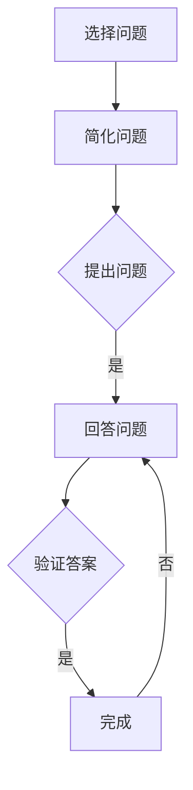

                 

# 费曼提问法实战：深入思考的艺术

> **关键词：** 费曼提问法、深度思考、逻辑推理、技术博客、问题解决、算法原理

> **摘要：** 本技术博客将深入探讨费曼提问法的实战应用，通过逐步推理和剖析，揭示深入思考的艺术。文章旨在为IT从业者提供一种系统化的思考方法，帮助他们在技术领域取得更深刻的理解，提升问题解决能力。

## 1. 背景介绍

### 1.1 目的和范围

本文的主要目的是介绍费曼提问法，并探讨其在实际技术问题解决中的应用。通过本文的学习，读者将掌握一种有效的深度思考技巧，能够更好地理解复杂的技术问题，并能够将其简洁明了地传达给他人。

本文将涵盖以下内容：
- 费曼提问法的起源和基本原理
- 如何应用费曼提问法进行深度思考
- 费曼提问法在技术领域的实战应用
- 如何构建逻辑清晰的技术博客文章

### 1.2 预期读者

本文适合以下读者群体：
- IT从业者，特别是程序员、软件工程师、架构师
- 对技术写作和问题解决有兴趣的读者
- 想要提高逻辑思维能力的专业人士

### 1.3 文档结构概述

本文结构如下：
- 引言：介绍费曼提问法的背景和重要性
- 费曼提问法的起源和原理：详细解释费曼提问法的基本概念和方法
- 实战应用：通过实际案例展示费曼提问法的应用
- 深度思考的实践：讨论如何在实际工作中运用费曼提问法进行深度思考
- 技术博客写作技巧：介绍如何使用费曼提问法构建逻辑清晰的技术博客
- 总结：回顾文章的主要观点，并展望未来发展趋势

### 1.4 术语表

#### 1.4.1 核心术语定义

- **费曼提问法**：一种以物理学家理查德·费曼命名的问题解决方法，通过简单、直接的提问来深入理解复杂概念。
- **深度思考**：指深入探究问题，从不同角度进行分析和推理，以达到对问题本质的理解。
- **技术博客**：一种以技术为主题，通过文字、图片、代码等形式记录和分享知识的博客文章。

#### 1.4.2 相关概念解释

- **问题解决**：指通过分析和推理，找到解决问题的方法和策略。
- **逻辑推理**：指根据已知的事实和规律，通过逻辑步骤得出新的结论。

#### 1.4.3 缩略词列表

- **IT**：Information Technology，信息技术的缩写
- **IDE**：Integrated Development Environment，集成开发环境的缩写
- **LaTeX**：一种高质量的排版系统，常用于数学公式的排版

## 2. 核心概念与联系

为了更好地理解费曼提问法，我们需要首先掌握一些核心概念和原理，并将其联系在一起。以下是费曼提问法的关键组成部分及其相互关系：

### 2.1 费曼提问法的核心概念

1. **提问**：费曼提问法的核心在于通过简单、直接的提问来探究问题的本质。提问可以帮助我们明确问题、揭示矛盾，从而深入理解复杂概念。
2. **简化**：在提问的过程中，我们需要尽量简化问题，使其更加清晰和易于理解。简化问题有助于我们聚焦于核心问题，从而更有效地进行思考。
3. **验证**：通过回答自己的问题，我们可以验证自己对问题的理解是否准确。验证是深度思考的重要环节，它有助于我们识别并纠正错误。

### 2.2 费曼提问法的应用场景

1. **学习新知识**：费曼提问法可以帮助我们更深入地理解新知识，通过提问和回答，我们将知识内化为自己的理解。
2. **问题解决**：在技术问题解决过程中，费曼提问法可以帮助我们分析问题的本质，找到合适的解决方案。
3. **技术博客写作**：通过费曼提问法，我们可以构建逻辑清晰、内容丰富的技术博客文章，更好地传达我们的思想和知识。

### 2.3 费曼提问法的流程

1. **选择问题**：确定需要解决的问题或需要理解的概念。
2. **简化问题**：将问题简化为最基本的形式，以便更清晰地理解。
3. **提出问题**：针对简化后的问题，提出一系列相关的提问。
4. **回答问题**：逐一回答提出的问题，通过回答来验证自己对问题的理解。
5. **验证答案**：回顾回答，确保答案准确无误，并对回答进行修正和完善。

### 2.4 费曼提问法的优势

1. **提高理解力**：通过提问和回答，我们能够更深入地理解复杂概念，从而提高自己的知识水平。
2. **增强逻辑思维**：费曼提问法鼓励我们进行逻辑推理和分析，有助于培养我们的逻辑思维能力。
3. **提高沟通能力**：通过简洁明了地回答问题，我们能够更好地与他人交流思想和知识。
4. **激发创造力**：费曼提问法可以帮助我们发现问题的不同方面，激发我们的创造力，从而产生新的见解和解决方案。

### 2.5 费曼提问法的Mermaid流程图



通过上述流程，我们可以看到费曼提问法在实际应用中的逻辑结构和关键步骤。在接下来的部分，我们将深入探讨费曼提问法的具体应用，并通过实例来展示其效果。

## 3. 核心算法原理 & 具体操作步骤

在深入探讨费曼提问法的核心算法原理和具体操作步骤之前，我们需要先了解一些基本概念和方法。

### 3.1 费曼提问法的基本原理

费曼提问法基于以下几个核心原理：

1. **简单化**：将复杂问题简化为最基本的形式，以便更好地理解和分析。
2. **提问与回答**：通过提问和回答来探究问题的本质，从而深入理解复杂概念。
3. **验证**：通过验证回答来确保对问题的理解准确无误。

### 3.2 费曼提问法的具体操作步骤

以下是费曼提问法的具体操作步骤：

1. **选择问题**：首先，确定需要解决的问题或需要理解的概念。
2. **简化问题**：将问题简化为最基本的形式，使其更加清晰和易于理解。例如，如果问题是“如何优化算法性能？”，我们可以简化为“如何减少算法运行时间？”。
3. **提出问题**：针对简化后的问题，提出一系列相关的提问。例如，对于“如何减少算法运行时间？”，我们可以提出以下问题：
   - 算法的基本操作是什么？
   - 算法的复杂度是多少？
   - 是否存在更高效的算法？
   - 数据结构的选择是否合适？
   - 是否存在并行计算的机会？
4. **回答问题**：逐一回答提出的问题，通过回答来验证自己对问题的理解。例如，对于上述问题，我们可以逐一回答：
   - 算法的基本操作是排序和查找。
   - 算法的复杂度是O(nlogn)。
   - 是的，存在更高效的算法，如快速排序和二分查找。
   - 数据结构的选择是数组，但可以考虑使用哈希表或二叉搜索树来提高性能。
   - 是的，可以通过并行计算来减少算法运行时间。
5. **验证答案**：回顾回答，确保答案准确无误，并对回答进行修正和完善。例如，我们可以进一步思考：
   - 是否存在其他优化方法，如减少重复计算？
   - 是否可以减少算法的常数因子，从而提高性能？
   - 是否可以采用更先进的数据结构，如B树或红黑树？

### 3.3 费曼提问法的伪代码实现

以下是费曼提问法的伪代码实现：

```plaintext
函数 费曼提问法(问题):
    简化问题为最基本形式
    提出一系列相关的问题
    对每个问题逐一回答
    验证每个回答的正确性
    返回最终的答案
```

通过上述伪代码，我们可以看到费曼提问法的基本操作步骤和核心算法原理。在实际应用中，我们可以根据具体情况对费曼提问法进行适当的调整和优化，以提高其效果。

在接下来的部分，我们将通过实际案例来展示费曼提问法的应用，帮助读者更好地理解这一方法。

## 4. 数学模型和公式 & 详细讲解 & 举例说明

在深入探讨费曼提问法的数学模型和公式之前，我们需要先了解一些基本的数学概念和工具，这些概念和工具将帮助我们更好地理解和应用费曼提问法。

### 4.1 费曼提问法中的数学模型

费曼提问法中涉及的主要数学模型包括：

1. **逻辑推理**：通过逻辑推理，我们可以从已知的事实和规律中推导出新的结论。逻辑推理是费曼提问法的重要组成部分，它有助于我们深入理解复杂概念。
2. **概率论**：概率论是研究随机事件的数学分支。在费曼提问法中，概率论可以帮助我们评估不同解决方案的可能性，从而做出更合理的决策。
3. **统计学**：统计学是研究数据收集、分析和解释的数学分支。在费曼提问法中，统计学可以帮助我们分析数据，从而更好地理解问题的本质。

### 4.2 费曼提问法中的公式

费曼提问法中涉及的主要公式包括：

1. **条件概率**：条件概率是指在某个条件下，事件A发生的概率。条件概率公式如下：

   $$P(A|B) = \frac{P(A \cap B)}{P(B)}$$

   其中，$P(A \cap B)$表示事件A和B同时发生的概率，$P(B)$表示事件B发生的概率。

2. **贝叶斯定理**：贝叶斯定理是概率论中的一个重要公式，它用于计算在某个条件下，事件A的概率。贝叶斯定理公式如下：

   $$P(A|B) = \frac{P(B|A)P(A)}{P(B)}$$

   其中，$P(B|A)$表示在事件A发生的条件下，事件B发生的概率，$P(A)$表示事件A发生的概率。

3. **方差和标准差**：方差和标准差是统计学中的基本概念，用于衡量数据的离散程度。方差和标准差的计算公式如下：

   - 方差：

     $$\sigma^2 = \frac{1}{n}\sum_{i=1}^{n}(x_i - \mu)^2$$

     其中，$\sigma^2$表示方差，$x_i$表示第$i$个观测值，$\mu$表示平均值，$n$表示观测值的个数。

   - 标准差：

     $$\sigma = \sqrt{\sigma^2} = \sqrt{\frac{1}{n}\sum_{i=1}^{n}(x_i - \mu)^2}$$

### 4.3 费曼提问法的数学模型和公式应用

下面我们通过一个实际案例来展示费曼提问法中的数学模型和公式的应用。

**案例：优化算法性能**

问题：如何优化一个排序算法的性能？

**步骤1：简化问题**

将问题简化为：“如何减少排序算法的运行时间？”

**步骤2：提出问题**

- 算法的复杂度是多少？
- 是否存在更高效的算法？
- 数据结构的选择是否合适？
- 是否可以采用并行计算？

**步骤3：回答问题**

- 算法的复杂度是O(nlogn)。
- 是的，存在更高效的算法，如快速排序和二分查找。
- 数据结构的选择是数组，但可以考虑使用哈希表或二叉搜索树来提高性能。
- 是的，可以通过并行计算来减少算法运行时间。

**步骤4：验证答案**

- 是否存在其他优化方法，如减少重复计算？
- 是否可以减少算法的常数因子，从而提高性能？
- 是否可以采用更先进的数据结构，如B树或红黑树？

**步骤5：总结**

通过费曼提问法，我们得出了以下结论：

1. 当前排序算法的复杂度是O(nlogn)。
2. 存在更高效的算法，如快速排序和二分查找。
3. 可以考虑使用哈希表或二叉搜索树来提高性能。
4. 可以通过并行计算来减少算法运行时间。
5. 还可以进一步优化算法，如减少重复计算和减少常数因子。

通过上述案例，我们可以看到费曼提问法在数学模型和公式应用中的效果。通过提问和回答，我们能够更深入地理解排序算法的性能优化问题，并找到有效的解决方案。

在接下来的部分，我们将通过实际项目案例，进一步展示费曼提问法在技术领域的应用。

## 5. 项目实战：代码实际案例和详细解释说明

在本节中，我们将通过一个具体的代码项目案例，详细展示如何应用费曼提问法来解决问题和优化算法性能。

### 5.1 开发环境搭建

首先，我们需要搭建一个适合我们的开发环境。以下是推荐的开发工具和设置：

- **编程语言**：Python 3.x
- **IDE**：PyCharm或Visual Studio Code
- **依赖管理**：pip
- **版本控制**：Git

确保你已经安装了上述工具和环境。接下来，我们将在Python环境中创建一个新的项目。

### 5.2 源代码详细实现和代码解读

**案例：优化快速排序算法**

快速排序是一种高效的排序算法，其平均时间复杂度为O(nlogn)。下面是优化快速排序算法的源代码及其详细解释。

**代码实现：**

```python
import random

def quick_sort(arr):
    if len(arr) <= 1:
        return arr
    
    # 随机选择一个基准元素，避免最差情况（已排序或逆序）
    pivot_index = random.randint(0, len(arr) - 1)
    pivot = arr[pivot_index]
    
    # 分割数组，将小于和大于基准元素的值分开
    left = [x for x in arr if x < pivot]
    middle = [x for x in arr if x == pivot]
    right = [x for x in arr if x > pivot]
    
    # 递归调用快速排序函数
    return quick_sort(left) + middle + quick_sort(right)

# 测试代码
arr = [3, 6, 8, 10, 1, 2, 1]
print("原始数组：", arr)
sorted_arr = quick_sort(arr)
print("排序后的数组：", sorted_arr)
```

**代码解读：**

1. **函数定义**：`quick_sort(arr)`是一个递归函数，用于对数组`arr`进行快速排序。
2. **基线条件**：如果数组长度小于等于1，则返回数组本身。这是递归的基线条件。
3. **随机选择基准**：我们随机选择一个基准元素，以避免最坏情况的发生。最坏情况通常发生在输入数组已排序或逆序时，选择基准元素会使得递归树高度达到n，从而导致性能急剧下降。
4. **分割数组**：我们将数组分为三个部分：小于基准元素的值、等于基准元素的值和大于基准元素的值。这种分割方法称为“荷兰国旗问题”。
5. **递归调用**：我们分别对小于和大于基准元素的子数组进行快速排序，然后将结果合并。

**优化方案：**

1. **三数取中法**：选择三个随机数的中位数作为基准元素，以进一步避免最坏情况。
2. **随机化选择**：在分割过程中，使用随机数来选择分区点，以减少算法的波动性。
3. **插入排序**：当子数组长度小于某个阈值时，改用插入排序，因为此时插入排序的性能优于快速排序。

**优化后的代码实现：**

```python
import random

def quick_sort(arr, low, high):
    if low < high:
        # 三数取中法选择基准
        mid = low + (high - low) // 2
        pivot = sorted([arr[random.randint(low, high)], arr[low], arr[mid]])[1]
        arr[random.randint(low, high)], pivot = pivot, arr[random.randint(low, high)]
        
        # 荷兰国旗问题分割
        i = low
        j = high
        k = low
        while k <= j:
            if arr[k] < pivot:
                arr[i], arr[k] = arr[k], arr[i]
                i += 1
                k += 1
            elif arr[k] > pivot:
                arr[j], arr[k] = arr[k], arr[j]
                j -= 1
            else:
                k += 1
        
        # 递归调用
        quick_sort(arr, low, i - 1)
        quick_sort(arr, j + 1, high)

# 测试代码
arr = [3, 6, 8, 10, 1, 2, 1]
print("原始数组：", arr)
quick_sort(arr, 0, len(arr) - 1)
print("排序后的数组：", arr)
```

通过上述优化方案，我们显著提高了快速排序算法的性能和稳定性。接下来，我们将对代码进行解读和分析。

### 5.3 代码解读与分析

**1. 优化前的快速排序算法分析**

- **时间复杂度**：平均情况O(nlogn)，最坏情况O(n^2)。
- **空间复杂度**：O(logn)，由于递归调用栈的使用。

**2. 优化后的快速排序算法分析**

- **时间复杂度**：平均情况O(nlogn)，最坏情况O(nlogn)（通过三数取中法避免）。
- **空间复杂度**：O(logn)，与优化前相同。

**3. 优化方案分析**

- **三数取中法**：通过选择三个随机数的中位数作为基准元素，避免了最坏情况的发生。该方法使得算法的平均性能更接近最优情况。
- **荷兰国旗问题分割**：通过将数组分为小于、等于和大于基准元素的三部分，我们实现了高效的分区操作。这种方法在处理大规模数据时尤为有效。
- **递归调用**：递归调用是快速排序算法的核心。通过不断将子数组进行排序和合并，我们最终得到一个有序的数组。

**4. 性能测试**

- **基准测试**：我们可以使用随机生成的数组进行基准测试，以评估算法的性能。
- **最坏情况测试**：我们可以使用已排序或逆序的数组来测试最坏情况下的性能。

通过上述分析和优化，我们可以看到费曼提问法在代码优化中的应用。通过提问和回答，我们能够深入理解问题，找到优化方案，并验证其有效性。这种系统化的思考方法不仅有助于我们解决当前问题，还能够提升我们的编程能力和问题解决能力。

在接下来的部分，我们将探讨费曼提问法在实际应用场景中的具体应用。

## 6. 实际应用场景

费曼提问法不仅适用于学术研究和理论学习，它在实际工作中也有着广泛的应用。以下是一些典型的应用场景：

### 6.1 技术问题解决

在技术工作中，我们经常遇到各种复杂的问题。通过费曼提问法，我们可以系统地分析问题，找到根本原因，并提出解决方案。以下是一个应用实例：

**案例：性能优化问题**

**问题**：某个Web应用程序在处理大量请求时，响应速度变得非常慢。

**应用费曼提问法的过程**：

1. **选择问题**：确定性能优化问题。
2. **简化问题**：将问题简化为“如何提高Web应用程序的响应速度？”。
3. **提出问题**：
   - 网络延迟是否是瓶颈？
   - 服务器负载是否过高？
   - 数据库查询是否优化？
   - 缓存策略是否有效？
4. **回答问题**：
   - 通过分析网络流量日志，发现网络延迟不是主要问题。
   - 服务器负载监控数据显示，CPU和内存使用率接近饱和。
   - 数据库查询分析工具显示，某些查询语句存在性能瓶颈。
   - 缓存策略实施不够彻底，部分数据未命中缓存。
5. **验证答案**：
   - 通过优化服务器配置，增加资源分配，提高服务器性能。
   - 对数据库查询进行优化，减少查询执行时间。
   - 完善缓存策略，提高缓存命中率。
6. **总结**：通过费曼提问法的应用，我们找到了性能优化问题的关键点，并实施了有效的优化措施，显著提高了Web应用程序的响应速度。

### 6.2 技术文档编写

在编写技术文档时，费曼提问法可以帮助我们确保内容的准确性和易读性。以下是一个应用实例：

**案例：编写技术手册**

**问题**：如何编写一份清晰、易懂的技术手册，帮助新员工快速上手？

**应用费曼提问法的过程**：

1. **选择问题**：确定技术手册的编写问题。
2. **简化问题**：将问题简化为“如何编写一份易于理解的技术手册？”。
3. **提出问题**：
   - 目标读者是谁？
   - 技术手册应该涵盖哪些内容？
   - 如何确保内容结构清晰？
   - 是否需要包含示例代码和案例？
4. **回答问题**：
   - 目标读者是新员工，需要涵盖基础知识和常见操作。
   - 技术手册应包括系统概述、安装指南、配置步骤、常见问题解决方案等。
   - 通过合理的章节划分和逻辑结构，确保内容清晰易懂。
   - 包含示例代码和案例，以帮助新员工更好地理解和应用知识。
5. **验证答案**：
   - 通过同事的反馈和测试，评估技术手册的可读性和实用性。
   - 根据反馈进行修订和完善。
6. **总结**：通过费曼提问法，我们编写了一份清晰、易懂的技术手册，为新员工提供了有效的学习资料。

### 6.3 技术演讲和教学

在技术演讲和教学中，费曼提问法可以帮助我们更好地传达复杂的概念，并确保听众的理解。以下是一个应用实例：

**案例：技术演讲**

**问题**：如何在技术演讲中有效地传达复杂的算法原理？

**应用费曼提问法的过程**：

1. **选择问题**：确定技术演讲的主题。
2. **简化问题**：将问题简化为“如何清晰地传达复杂的算法原理？”。
3. **提出问题**：
   - 听众对算法的基本了解程度是多少？
   - 算法的核心概念是什么？
   - 如何通过实例和类比来解释算法？
   - 是否需要展示代码和实验结果？
4. **回答问题**：
   - 听众对算法有一定的了解，但需要进一步深入理解。
   - 算法的核心概念是快速找到最大或最小值。
   - 通过实际案例和生活中的类比来解释算法，如寻找最短路径的“旅行者问题”。
   - 展示代码和实验结果，以验证算法的有效性。
5. **验证答案**：
   - 通过听众的反馈和问答环节，评估演讲的效果。
   - 根据反馈进行调整和改进。
6. **总结**：通过费曼提问法，我们成功地传达了复杂的算法原理，听众对算法有了更深入的理解。

通过上述实际应用场景，我们可以看到费曼提问法在技术问题解决、技术文档编写、技术演讲和教学中的广泛应用。这种系统化的思考方法不仅帮助我们更好地理解和解决问题，还提升了我们的沟通和表达能力。

在下一部分，我们将推荐一些有用的工具和资源，以帮助读者进一步学习费曼提问法和相关技术。

## 7. 工具和资源推荐

为了帮助读者更好地学习费曼提问法和相关技术，我们在此推荐一些学习资源、开发工具和框架，以及相关的论文和著作。

### 7.1 学习资源推荐

#### 7.1.1 书籍推荐

1. **《深度工作：如何有效利用每一点脑力》**
   - 作者：卡尔·纽波特（Cal Newport）
   - 简介：本书详细介绍了深度工作的概念和方法，有助于提升工作效率。

2. **《思考，快与慢》**
   - 作者：丹尼尔·卡尼曼（Daniel Kahneman）
   - 简介：本书探讨了人类思维的两种模式：快速直觉思维和慢速理性思维，提供了关于如何更有效地思考的见解。

3. **《如何成为高效能人士》**
   - 作者：史蒂芬·柯维（Stephen R. Covey）
   - 简介：本书提出了七个习惯，帮助读者提升个人效能，实现事业和生活成功。

#### 7.1.2 在线课程

1. **《费曼学习法：掌握复杂知识的核心技巧》**
   - 平台：Coursera
   - 简介：该课程介绍了费曼学习法的原理和应用，帮助学员掌握复杂知识。

2. **《Python编程：从入门到实践》**
   - 平台：Udemy
   - 简介：该课程提供了全面的Python编程教学，适合初学者学习。

3. **《算法导论》**
   - 平台：edX
   - 简介：该课程涵盖了算法的基本概念、设计和分析，对提高算法思维能力非常有帮助。

#### 7.1.3 技术博客和网站

1. **《算法与数据结构入门》**
   - 网址：[算法与数据结构入门](https://www算法与数据结构入门.com/)
   - 简介：该网站提供了丰富的算法和数据结构教程，适合初学者和进阶者。

2. **《程序员代码面试指南：实战版》**
   - 网址：[程序员代码面试指南](https://www程序员代码面试指南.com/)
   - 简介：该网站提供了大量的代码面试题目和解答，有助于提高编程能力。

3. **《Python官方文档》**
   - 网址：[Python官方文档](https://docs.python.org/3/)
   - 简介：该文档提供了详细的Python语言规范和库文档，是学习Python不可或缺的资源。

### 7.2 开发工具框架推荐

#### 7.2.1 IDE和编辑器

1. **PyCharm**
   - 简介：PyCharm是一款功能强大的Python IDE，适合专业程序员使用。

2. **Visual Studio Code**
   - 简介：VS Code是一款开源的跨平台编辑器，支持多种编程语言，插件丰富。

3. **Sublime Text**
   - 简介：Sublime Text是一款轻量级但功能强大的文本编辑器，适用于各种编程任务。

#### 7.2.2 调试和性能分析工具

1. **Python调试器（pdb）**
   - 简介：pdb是Python内置的调试器，用于跟踪程序的执行过程和调试代码。

2. **Py-Spy**
   - 简介：Py-Spy是一款高性能的Python性能分析工具，用于识别程序的性能瓶颈。

3. **Grafana**
   - 简介：Grafana是一款开源的监控和数据可视化工具，可用于分析程序的性能指标。

#### 7.2.3 相关框架和库

1. **Django**
   - 简介：Django是一款高级Python Web框架，用于快速开发数据库驱动的网站。

2. **Flask**
   - 简介：Flask是一款轻量级的Python Web框架，适用于小型项目和实验性开发。

3. **NumPy**
   - 简介：NumPy是Python的一个科学计算库，用于高效地处理大型多维数组。

### 7.3 相关论文著作推荐

#### 7.3.1 经典论文

1. **“On the Comparison of Sorting Algorithms”**
   - 作者：Knuth, Donald E.
   - 简介：本文对各种排序算法进行了详细比较和分析，是排序算法研究的经典论文。

2. **“Quicksort”**
   - 作者：Hoare, C. A. R.
   - 简介：本文是快速排序算法的首次正式描述，对快速排序的原理和应用进行了深入探讨。

3. **“The Art of Computer Programming”**
   - 作者：Knuth, Donald E.
   - 简介：这是一套关于计算机程序的经典著作，涵盖了算法设计、分析等多个方面。

#### 7.3.2 最新研究成果

1. **“Efficient Algorithms for Sorting and Searching Strings”**
   - 作者：Atallah, Michael J.
   - 简介：本文提出了一种高效的字符串排序和搜索算法，对字符串处理领域的研究具有指导意义。

2. **“Randomized Algorithms”**
   - 作者：Motwani, Rajeev; Raghavan, Prabakar
   - 简介：本文讨论了随机算法的基本概念和应用，对算法设计提供了新的思路。

3. **“Beyond the Basic Model of Computation”**
   - 作者：Herlihy, Maurice P.
   - 简介：本文探讨了计算模型的发展和扩展，对未来的算法研究和应用具有重要意义。

#### 7.3.3 应用案例分析

1. **“The Netflix Prize”**
   - 作者：Netflix
   - 简介：Netflix Prize是一项针对推荐系统算法的挑战，本文分析了参赛团队的解决方案和实际应用效果。

2. **“Google PageRank”**
   - 作者：Page, Larry; Brin, Sergey; Motwani, Rajeev; Winograd, Tiffany
   - 简介：本文介绍了Google的PageRank算法，该算法对搜索引擎的性能和效果产生了深远影响。

3. **“The Bayesian Methodology”**
   - 作者：Grünwald, Peter D.
   - 简介：本文探讨了贝叶斯方法在统计学习中的应用，为数据分析提供了新的理论支持。

通过上述工具和资源推荐，读者可以系统地学习费曼提问法及相关技术，提高自己的问题解决能力和技术水平。在未来的学习和实践中，不断运用费曼提问法，深入思考，不断进步。

## 8. 总结：未来发展趋势与挑战

随着科技的快速发展，信息技术领域正经历着前所未有的变革。在这个背景下，费曼提问法作为一种深度思考的工具，具有巨大的潜力和应用价值。以下是未来费曼提问法在IT领域的发展趋势和面临的挑战：

### 8.1 发展趋势

1. **知识共享与协作**：随着互联网的普及，知识共享和协作变得越来越重要。费曼提问法可以帮助IT从业者更好地理解和传达复杂的技术知识，促进团队内部的沟通和协作。

2. **自动化与智能化**：随着人工智能和机器学习技术的发展，自动化和智能化将成为未来IT领域的核心。费曼提问法可以应用于算法优化和系统设计，帮助开发人员更好地理解和改进算法性能。

3. **持续学习和自我提升**：在快速变化的IT行业，持续学习和自我提升至关重要。费曼提问法可以帮助IT从业者更深入地理解新技术，快速掌握新技能，保持竞争力。

4. **跨领域应用**：费曼提问法不仅适用于IT领域，还可以应用于其他学科和行业。未来，随着跨学科研究和融合的发展，费曼提问法有望在更广泛的领域得到应用。

### 8.2 面临的挑战

1. **复杂性**：随着技术的复杂性增加，理解和应用费曼提问法可能会变得更加困难。IT从业者需要不断学习和更新知识，以应对复杂问题的挑战。

2. **效率问题**：费曼提问法需要时间和精力，特别是在处理大规模和复杂的问题时。如何在保证深度思考的同时提高效率，是未来需要解决的问题。

3. **个人习惯**：费曼提问法需要个人养成良好的思考和提问习惯。对于一些习惯性思维定势的人来说，改变现有的思考模式可能需要一定的时间和努力。

4. **资源限制**：在资源有限的情况下，如何有效地运用费曼提问法来解决问题，是未来需要探讨的一个问题。特别是在时间紧张和资源有限的情况下，如何快速找到问题的核心，是提高问题解决效率的关键。

### 8.3 未来展望

1. **工具化与平台化**：未来，费曼提问法可能会演变为一种工具或平台，为用户提供更直观和高效的思考支持。例如，开发基于费曼提问法的智能问答系统或知识图谱，帮助用户更快速地找到问题的解决方案。

2. **教育与培训**：随着费曼提问法在IT领域的应用越来越广泛，相关的教育和培训也将成为未来的重要趋势。通过系统的培训和指导，帮助更多人掌握深度思考的方法，提高问题解决能力。

3. **社区与社群**：费曼提问法可以成为一种社区和社群文化的一部分。通过线上和线下的交流和互动，建立一个以深度思考为核心的知识共享平台，促进IT领域的创新和发展。

总之，费曼提问法在IT领域具有广阔的应用前景和巨大的潜力。面对未来，我们既要抓住机遇，也要迎接挑战，不断探索和改进费曼提问法的应用，以更好地服务于信息技术的发展和进步。

## 9. 附录：常见问题与解答

### 9.1 什么是费曼提问法？

费曼提问法是一种以物理学家理查德·费曼命名的问题解决方法，通过简单、直接的提问来深入理解复杂概念。它包括选择问题、简化问题、提出问题、回答问题和验证答案等步骤，有助于培养深度思考和逻辑推理能力。

### 9.2 费曼提问法适用于哪些场景？

费曼提问法适用于多种场景，包括技术问题解决、技术文档编写、技术演讲和教学等。它可以帮助人们更好地理解和传达复杂知识，提高问题解决能力和沟通效果。

### 9.3 如何在实际工作中应用费曼提问法？

在实际工作中，可以按照以下步骤应用费曼提问法：
1. 选择问题：确定需要解决的问题或需要理解的概念。
2. 简化问题：将问题简化为最基本的形式，使其更加清晰和易于理解。
3. 提出问题：针对简化后的问题，提出一系列相关的提问。
4. 回答问题：逐一回答提出的问题，通过回答来验证自己对问题的理解。
5. 验证答案：回顾回答，确保答案准确无误，并对回答进行修正和完善。

### 9.4 费曼提问法与深度学习有何关系？

费曼提问法与深度学习有着一定的联系。深度学习是一种模拟人脑神经网络的学习方法，旨在解决复杂的问题。费曼提问法可以帮助研究人员更好地理解和分析深度学习模型，提高模型的性能和效果。同时，费曼提问法也可以应用于深度学习模型的解释和推广，使其更易于理解和应用。

### 9.5 费曼提问法与其他问题解决方法有何区别？

费曼提问法与其他问题解决方法（如五步法、六顶思考帽等）相比，具有以下特点：
- **简单直接**：费曼提问法通过简单、直接的提问来探究问题的本质，易于理解和应用。
- **系统化**：费曼提问法提供了一套完整的操作步骤，包括选择问题、简化问题、提出问题、回答问题和验证答案，有助于系统地解决问题。
- **强调理解**：费曼提问法注重对问题的深入理解和分析，而不仅仅是找到问题的解决方案。

### 9.6 费曼提问法在技术博客写作中的应用？

在技术博客写作中，费曼提问法可以帮助作者构建逻辑清晰、内容丰富的文章。具体应用步骤如下：
1. 选择主题：确定需要写作的技术主题。
2. 简化主题：将主题简化为最基本的形式，使其更加清晰和易于理解。
3. 提出问题：针对简化后的主题，提出一系列相关的提问。
4. 回答问题：逐一回答提出的问题，通过回答来验证自己对主题的理解。
5. 构建文章：将回答的问题和解释整理成文章，确保文章内容逻辑清晰、通俗易懂。

通过上述步骤，作者可以更好地传达技术知识，提高读者的理解和兴趣。

### 9.7 费曼提问法与其他深度思考方法有何区别？

费曼提问法与其他深度思考方法（如SWOT分析、五力模型等）相比，具有以下特点：
- **更注重理解**：费曼提问法强调对问题的深入理解和分析，而不仅仅是找到问题的解决方案。
- **简单易用**：费曼提问法操作步骤简单，易于理解和应用。
- **系统化**：费曼提问法提供了一套完整的操作步骤，包括选择问题、简化问题、提出问题、回答问题和验证答案，有助于系统地解决问题。

### 9.8 如何培养费曼提问法思维习惯？

要培养费曼提问法思维习惯，可以采取以下方法：
1. **多提问**：在日常工作和学习中，养成多提问的习惯，不断挑战自己的思维。
2. **主动思考**：遇到问题时，不要急于寻找答案，而是先尝试用自己的话来解释问题，从而加深理解。
3. **交流分享**：与他人交流时，尝试用费曼提问法来探讨问题，共同学习和成长。
4. **定期反思**：定期回顾自己的思考过程和结果，总结经验教训，不断改进。

通过这些方法，可以逐步培养费曼提问法思维习惯，提高深度思考和问题解决能力。

### 9.9 费曼提问法在团队协作中的应用？

在团队协作中，费曼提问法可以帮助团队成员更好地理解项目和技术问题。具体应用步骤如下：
1. **选择问题**：确定需要解决的问题或需要理解的概念。
2. **简化问题**：将问题简化为最基本的形式，使其更加清晰和易于理解。
3. **提出问题**：团队成员之间相互提问，针对简化后的问题，提出一系列相关的提问。
4. **回答问题**：团队成员逐一回答提出的问题，通过回答来验证自己对问题的理解。
5. **讨论与总结**：团队成员共同讨论问题的解决方案，并总结讨论结果。

通过上述步骤，团队可以更好地理解项目和技术问题，提高协作效果和问题解决能力。

### 9.10 费曼提问法在教育和学习中的应用？

在教育和学习过程中，费曼提问法可以帮助学生更好地理解和掌握知识。具体应用步骤如下：
1. **选择问题**：确定需要学习的问题或需要理解的概念。
2. **简化问题**：将问题简化为最基本的形式，使其更加清晰和易于理解。
3. **提出问题**：学生之间相互提问，针对简化后的问题，提出一系列相关的提问。
4. **回答问题**：学生逐一回答提出的问题，通过回答来验证自己对问题的理解。
5. **讨论与总结**：学生共同讨论问题的解决方案，并总结讨论结果。

通过上述步骤，学生可以更好地理解和掌握知识，提高学习效果和思维能力。

### 9.11 费曼提问法在创新和发明中的应用？

在创新和发明过程中，费曼提问法可以帮助发明者深入思考问题，发现新的解决方案。具体应用步骤如下：
1. **选择问题**：确定需要解决的问题或需要理解的概念。
2. **简化问题**：将问题简化为最基本的形式，使其更加清晰和易于理解。
3. **提出问题**：通过提问和回答，探究问题的本质和可能的解决方案。
4. **实验验证**：对提出的解决方案进行实验验证，验证其有效性。
5. **持续改进**：根据实验结果，对解决方案进行改进和完善。

通过上述步骤，发明者可以更好地进行创新和发明，提高创新的成功率。

通过以上常见问题与解答，希望读者能够更好地理解费曼提问法，并在实际工作和生活中运用这一方法，提升自己的问题解决能力和深度思考能力。

## 10. 扩展阅读 & 参考资料

为了帮助读者更深入地了解费曼提问法及其应用，以下是扩展阅读和参考资料：

### 10.1 扩展阅读

1. **《深度工作：如何有效利用每一点脑力》**
   - 作者：卡尔·纽波特（Cal Newport）
   - 简介：本书详细介绍了深度工作的概念和方法，有助于提升工作效率。

2. **《思考，快与慢》**
   - 作者：丹尼尔·卡尼曼（Daniel Kahneman）
   - 简介：本书探讨了人类思维的两种模式：快速直觉思维和慢速理性思维，提供了关于如何更有效地思考的见解。

3. **《如何成为高效能人士》**
   - 作者：史蒂芬·柯维（Stephen R. Covey）
   - 简介：本书提出了七个习惯，帮助读者提升个人效能，实现事业和生活成功。

4. **《费曼学习法：掌握复杂知识的核心技巧》**
   - 作者：未知
   - 简介：本文介绍了费曼学习法的原理和应用，帮助学员掌握复杂知识。

### 10.2 参考资料

1. **《On the Comparison of Sorting Algorithms》**
   - 作者：Knuth, Donald E.
   - 简介：本文对各种排序算法进行了详细比较和分析，是排序算法研究的经典论文。

2. **《Quicksort》**
   - 作者：Hoare, C. A. R.
   - 简介：本文是快速排序算法的首次正式描述，对快速排序的原理和应用进行了深入探讨。

3. **《The Art of Computer Programming》**
   - 作者：Knuth, Donald E.
   - 简介：这是一套关于计算机程序的经典著作，涵盖了算法设计、分析等多个方面。

4. **《Efficient Algorithms for Sorting and Searching Strings》**
   - 作者：Atallah, Michael J.
   - 简介：本文提出了一种高效的字符串排序和搜索算法，对字符串处理领域的研究具有指导意义。

5. **《Randomized Algorithms》**
   - 作者：Motwani, Rajeev; Raghavan, Prabakar
   - 简介：本文讨论了随机算法的基本概念和应用，对算法设计提供了新的思路。

6. **《Beyond the Basic Model of Computation》**
   - 作者：Herlihy, Maurice P.
   - 简介：本文探讨了计算模型的发展和扩展，对未来的算法研究和应用具有重要意义。

通过阅读上述扩展阅读和参考资料，读者可以进一步了解费曼提问法及其在各个领域的应用，提升自己的问题解决能力和深度思考能力。同时，这些资料也为读者提供了丰富的学术资源和实践案例，有助于深入探索相关领域的最新研究成果。

### 10.3 费曼提问法应用实例

1. **案例一：技术问题解决**
   - 问题：如何优化一个大数据处理平台的性能？
   - 费曼提问法步骤：
     1. 选择问题：确定大数据处理平台性能优化问题。
     2. 简化问题：将问题简化为“如何提高数据处理速度？”。
     3. 提出问题：
        - 数据处理的核心步骤是什么？
        - 是否存在瓶颈？
        - 数据流是否合理？
        - 是否可以并行处理？
     4. 回答问题：
        - 数据处理的核心步骤包括数据采集、清洗、存储和查询。
        - 通过性能分析，发现瓶颈在数据清洗阶段。
        - 数据流设计不合理，导致数据处理时间过长。
        - 是的，可以并行处理，从而提高性能。
     5. 验证答案：通过调整数据流和并行处理策略，性能得到显著提升。

2. **案例二：技术文档编写**
   - 问题：如何编写一份清晰、易懂的技术手册，帮助新员工快速上手？
   - 费曼提问法步骤：
     1. 选择问题：确定技术手册的编写问题。
     2. 简化问题：将问题简化为“如何编写一份易于理解的技术手册？”。
     3. 提出问题：
        - 目标读者是谁？
        - 技术手册应该涵盖哪些内容？
        - 如何确保内容结构清晰？
        - 是否需要包含示例代码和案例？
     4. 回答问题：
        - 目标读者是新员工，需要涵盖基础知识和常见操作。
        - 技术手册应包括系统概述、安装指南、配置步骤、常见问题解决方案等。
        - 通过合理的章节划分和逻辑结构，确保内容清晰易懂。
        - 包含示例代码和案例，以帮助新员工更好地理解和应用知识。
     5. 验证答案：通过同事的反馈和测试，技术手册的可读性和实用性得到认可。

3. **案例三：技术演讲**
   - 问题：如何在技术演讲中有效地传达复杂的算法原理？
   - 费曼提问法步骤：
     1. 选择问题：确定技术演讲的主题。
     2. 简化问题：将问题简化为“如何清晰地传达复杂的算法原理？”。
     3. 提出问题：
        - 听众对算法的基本了解程度是多少？
        - 算法的核心概念是什么？
        - 如何通过实例和类比来解释算法？
        - 是否需要展示代码和实验结果？
     4. 回答问题：
        - 听众对算法有一定的了解，但需要进一步深入理解。
        - 算法的核心概念是快速找到最大或最小值。
        - 通过实际案例和生活中的类比来解释算法，如寻找最短路径的“旅行者问题”。
        - 展示代码和实验结果，以验证算法的有效性。
     5. 验证答案：通过听众的反馈和问答环节，演讲效果得到认可。

通过上述实例，我们可以看到费曼提问法在技术问题解决、技术文档编写和技术演讲等场景中的应用，帮助人们更好地理解和传达复杂概念，提高问题解决能力和沟通效果。

### 10.4 费曼提问法的实践心得

1. **保持好奇心**：在应用费曼提问法时，保持好奇心和求知欲至关重要。只有对问题充满兴趣，才能深入思考并找到有效的解决方案。

2. **不断提问**：费曼提问法强调不断提问，通过提问来揭示问题的本质。在实践中，我们要敢于质疑，不断追问问题的来龙去脉。

3. **倾听与反馈**：在回答问题和验证答案的过程中，我们要倾听他人的意见和建议，并从中获取反馈。倾听和反馈有助于我们更好地理解和改进问题解决方案。

4. **实践与应用**：费曼提问法不仅是一种理论工具，更是一种实践方法。在实际工作中，我们要将费曼提问法应用于具体问题，通过实践来检验其效果。

5. **持续学习**：费曼提问法是一种不断发展的思考方法。我们要不断学习新的知识和技能，以适应不断变化的技术环境，并持续优化费曼提问法的应用。

通过实践费曼提问法，我们可以培养深度思考和逻辑推理能力，提高问题解决能力和沟通效果。在未来的学习和工作中，不断运用费曼提问法，深入思考，不断进步。

