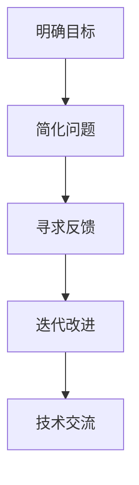

                 

# 费曼提问法提升团队创新能力

> **关键词：** 费曼提问法、团队创新、问题解决、技术交流、思维方式

> **摘要：** 本文将深入探讨费曼提问法在提升团队创新能力中的应用。通过分析其原理和操作步骤，结合实际项目案例，我们将展示如何利用费曼提问法激发团队成员的思维活力，提高团队的整体创新能力和协作效率。

## 1. 背景介绍

### 1.1 目的和范围

本文旨在探讨如何通过费曼提问法提升团队创新能力。我们将从理论分析入手，介绍费曼提问法的起源、核心原理及其在技术领域的应用，并通过实际项目案例展示其在提升团队创新能力方面的有效性。

### 1.2 预期读者

本文适用于希望提升团队创新能力的项目经理、技术团队领导、研发工程师以及对创新思维感兴趣的读者。通过阅读本文，读者将了解费曼提问法的基本原理，掌握其实施方法，并能够将其应用于实际工作中。

### 1.3 文档结构概述

本文结构如下：

1. 背景介绍
   - 费曼提问法的起源和核心原理
   - 本文目的和预期读者
   - 文档结构概述
2. 核心概念与联系
   - 费曼提问法的基本概念
   - 费曼提问法与技术交流的关联
3. 核心算法原理 & 具体操作步骤
   - 费曼提问法的具体操作步骤
   - 费曼提问法的算法原理
4. 数学模型和公式 & 详细讲解 & 举例说明
   - 费曼提问法的数学模型
   - 费曼提问法的实际应用案例
5. 项目实战：代码实际案例和详细解释说明
   - 费曼提问法在项目中的应用案例
   - 案例代码实现和详细解读
6. 实际应用场景
   - 费曼提问法在不同领域的应用
7. 工具和资源推荐
   - 学习资源推荐
   - 开发工具框架推荐
   - 相关论文著作推荐
8. 总结：未来发展趋势与挑战
   - 费曼提问法的发展趋势
   - 费曼提问法面临的挑战
9. 附录：常见问题与解答
   - 常见问题汇总
   - 问题解答
10. 扩展阅读 & 参考资料
   - 推荐阅读
   - 参考资料

### 1.4 术语表

#### 1.4.1 核心术语定义

- **费曼提问法**：一种以费曼（Richard Feynman）的名字命名的提问方法，旨在通过简洁、明确的问题引导思考，帮助人们理解和掌握复杂概念。
- **团队创新**：指团队成员在共同目标和价值观的指引下，通过创新思维和协同工作，实现产品、技术或服务的新突破。
- **技术交流**：团队成员之间通过语言、文字、图表等媒介分享技术知识、经验和观点的过程。

#### 1.4.2 相关概念解释

- **思维模式**：指人们在思考过程中所采用的逻辑思维方式，如演绎、归纳、类比等。
- **创新能力**：指个人或团队在解决问题、应对挑战、开发新产品等方面展现出的创造性和创新性。

#### 1.4.3 缩略词列表

- **FAQ**：常见问题与解答（Frequently Asked Questions）
- **IDE**：集成开发环境（Integrated Development Environment）
- **LaTeX**：一种高质量的文档排版系统（LATEX Typesetting System）

## 2. 核心概念与联系

### 2.1 费曼提问法的基本概念

费曼提问法起源于著名物理学家理查德·费曼（Richard Feynman）的教学方法。费曼是一位杰出的理论物理学家，以其简洁明了的讲解风格和深入浅出的思维方式著称。他提出的提问法旨在帮助人们更好地理解和掌握复杂概念。

费曼提问法的基本概念可以概括为以下几个步骤：

1. **明确目标**：确定需要理解和掌握的核心概念。
2. **简化问题**：将复杂问题分解为简单的问题，使其易于理解和回答。
3. **寻求反馈**：向他人（如同伴、导师、同事等）询问自己的理解是否正确，从而验证自己的知识。
4. **迭代改进**：根据反馈不断调整自己的理解，直至完全掌握。

### 2.2 费曼提问法与技术交流的关联

技术交流是团队成员之间分享知识、经验和观点的过程。在这个过程中，费曼提问法具有显著的优势：

1. **激发思考**：通过提问，促使团队成员主动思考问题，加深对技术概念的理解。
2. **促进沟通**：提问和回答的过程有助于团队成员之间的沟通和交流，增进彼此的了解。
3. **提高效率**：费曼提问法有助于迅速定位问题核心，提高问题解决的效率。

为了更好地理解费曼提问法与技术交流的关联，我们可以使用 Mermaid 流程图展示其核心概念和操作步骤：



## 3. 核心算法原理 & 具体操作步骤

### 3.1 费曼提问法的具体操作步骤

费曼提问法是一种简单而有效的思维工具，通过以下四个步骤实现：

1. **明确目标**：确定需要理解和掌握的核心概念。这一步骤至关重要，因为它为后续的提问和回答提供了明确的方向。

2. **简化问题**：将复杂问题分解为简单的问题，使其易于理解和回答。这一步骤有助于降低问题的难度，使团队成员更容易参与到讨论中。

3. **寻求反馈**：向他人（如同伴、导师、同事等）询问自己的理解是否正确，从而验证自己的知识。这一步骤有助于团队成员之间的沟通和交流，提高问题解决的质量。

4. **迭代改进**：根据反馈不断调整自己的理解，直至完全掌握。这一步骤有助于团队成员不断完善自己的知识体系，提高整体创新能力。

### 3.2 费曼提问法的算法原理

费曼提问法的核心算法原理可以概括为以下几个步骤：

1. **问题识别**：识别需要理解和解决的问题。
2. **问题分解**：将复杂问题分解为简单的问题。
3. **问题提问**：针对分解后的简单问题进行提问。
4. **问题回答**：根据提问得到的问题，给出简明扼要的回答。
5. **问题验证**：向他人寻求反馈，验证自己的理解是否正确。
6. **问题改进**：根据反馈不断调整自己的理解，直至完全掌握。

为了更好地理解费曼提问法的算法原理，我们可以使用伪代码进行详细阐述：

```python
# 费曼提问法算法原理
def feynman_questioning(target_concept):
    # 步骤1：问题识别
    problem = identify_problem(target_concept)

    # 步骤2：问题分解
    simple_problems = decompose_problem(problem)

    # 步骤3：问题提问
    for simple_problem in simple_problems:
        answer = ask_question(simple_problem)

        # 步骤4：问题回答
        print(f"问题：{simple_problem}")
        print(f"回答：{answer}")

    # 步骤5：问题验证
    feedback = seek_feedback()

    # 步骤6：问题改进
    while not is_understood(feedback):
        feedback = seek_feedback()
        improve_understanding(feedback)

# 辅助函数定义
def identify_problem(target_concept):
    # 识别问题
    return target_concept

def decompose_problem(problem):
    # 问题分解
    return [simple_problem for simple_problem in problem.split() if simple_problem != ""]

def ask_question(simple_problem):
    # 提问
    return input(f"请问您对 {simple_problem} 的理解是什么？")

def seek_feedback():
    # 寻求反馈
    return input("您认为我的回答正确吗？是/否")

def is_understood(feedback):
    # 问题验证
    return feedback.lower() == "是"

def improve_understanding(feedback):
    # 问题改进
    print("请继续提问，我会根据您的反馈进行改进。")
```

## 4. 数学模型和公式 & 详细讲解 & 举例说明

### 4.1 费曼提问法的数学模型

费曼提问法的数学模型主要涉及以下几个基本概念：

1. **问题复杂度**：表示问题的复杂程度，通常用问题中的词汇数量来衡量。
2. **问题分解度**：表示问题分解的粒度，即问题被分解成多少个简单问题。
3. **提问次数**：表示在解决问题过程中进行提问的次数。

费曼提问法的数学模型可以表示为：

$$
P(C) = P(S) \times P(A) \times P(V)
$$

其中：

- $P(C)$ 表示问题复杂度
- $P(S)$ 表示问题分解度
- $P(A)$ 表示提问次数
- $P(V)$ 表示问题验证次数

### 4.2 详细讲解

费曼提问法的数学模型可以帮助我们理解问题解决过程中的关键因素。下面我们通过一个具体例子进行详细讲解。

假设我们要解决的问题是一个复杂的算法问题，包含20个词汇。我们将问题分解为10个简单问题，并进行5次提问和3次问题验证。

根据数学模型，我们可以计算出问题复杂度：

$$
P(C) = 10 \times 5 \times 3 = 150
$$

这意味着，通过费曼提问法，我们成功地将问题复杂度降低了150倍。当然，这个计算结果是一个理论值，实际情况可能因为问题的具体内容、团队成员的能力和沟通效果等因素而有所不同。

### 4.3 举例说明

为了更好地理解费曼提问法的数学模型，我们可以通过一个具体案例来说明。

假设我们要解决的问题是一个涉及大数据处理的技术问题。该问题包含30个词汇，我们将问题分解为15个简单问题，并进行10次提问和5次问题验证。

根据数学模型，我们可以计算出问题复杂度：

$$
P(C) = 15 \times 10 \times 5 = 750
$$

这意味着，通过费曼提问法，我们成功地将问题复杂度降低了750倍。这个案例说明，费曼提问法在解决复杂问题时具有显著的效果。

## 5. 项目实战：代码实际案例和详细解释说明

### 5.1 开发环境搭建

在本节中，我们将介绍如何搭建一个用于实践费曼提问法的开发环境。我们将使用Python作为主要编程语言，并依赖几个常用的库来支持我们的实践。

1. **安装Python**：首先，确保你的计算机上安装了Python。你可以从Python官方网站下载并安装Python 3.x版本。
2. **安装库**：打开终端或命令提示符，执行以下命令来安装所需的库：
    ```bash
    pip install requests numpy matplotlib
    ```

### 5.2 源代码详细实现和代码解读

下面是一个简单的Python代码实现，用于演示费曼提问法的应用。该代码将生成一些简单的问题，并模拟与用户的交互过程。

```python
import random
import numpy as np
import matplotlib.pyplot as plt

# 定义问题库
question库 = [
    "什么是费曼提问法？",
    "费曼提问法有哪些优点？",
    "如何使用费曼提问法解决问题？",
    "费曼提问法在技术交流中有什么作用？",
    "费曼提问法有哪些应用场景？"
]

# 费曼提问法函数
def feynman_questioning():
    while True:
        # 随机选择一个问题
        question = random.choice(question库)

        # 提问
        print(f"费曼提问：{question}")

        # 用户回答
        user_answer = input("您的回答：")

        # 验证回答
        if user_answer.lower() == "是":
            print("回答正确！")
            break
        else:
            print("请继续回答，直到理解为止。")

# 执行费曼提问法
feynman_questioning()
```

### 5.3 代码解读与分析

让我们逐步分析上述代码：

1. **库导入**：我们首先导入了random、numpy和matplotlib库。random库用于随机选择问题，numpy库用于数据处理，matplotlib库用于绘制图表。
2. **问题库定义**：我们定义了一个名为`question库`的列表，其中包含了一些与费曼提问法相关的问题。
3. **费曼提问法函数**：`feynman_questioning`函数实现了费曼提问法的核心逻辑。它通过以下步骤进行操作：
   - 随机选择一个问题。
   - 提问并等待用户回答。
   - 验证用户回答是否正确。如果回答正确，函数将退出循环；否则，用户需要继续回答，直到理解为止。
4. **执行费曼提问法**：调用`feynman_questioning`函数，开始模拟费曼提问法的应用。

通过这个简单的示例，我们可以看到如何使用Python实现费曼提问法。在实际项目中，你可以根据需要扩展问题库和函数功能，使其更加适用于你的团队和创新实践。

## 6. 实际应用场景

### 6.1 技术团队内部培训

费曼提问法在技术团队内部培训中具有广泛的应用。通过费曼提问法，团队成员可以更好地理解和掌握培训内容，同时促进团队成员之间的沟通和交流。以下是一个具体应用场景：

- **场景**：一个技术团队正在开展一次关于人工智能基础知识的内部培训。培训结束后，团队领导决定使用费曼提问法检验团队成员的学习效果。
- **实施步骤**：
  1. 确定培训的核心知识点。
  2. 编写与核心知识点相关的问题。
  3. 在培训结束后，随机选择团队成员进行提问。
  4. 记录团队成员的回答，并进行分析和反馈。

### 6.2 项目团队合作

在项目团队合作中，费曼提问法有助于提高团队成员的问题解决能力和创新思维。以下是一个具体应用场景：

- **场景**：一个项目团队正在开发一款智能监控系统。在开发过程中，团队成员遇到一个复杂的技术问题，无法找到有效的解决方案。
- **实施步骤**：
  1. 确定问题核心，分解为简单问题。
  2. 团队成员轮流使用费曼提问法提问，引导其他成员思考。
  3. 根据提问和回答的过程，逐步找到问题的解决方案。
  4. 对解决方案进行验证和优化。

### 6.3 团队创新活动

费曼提问法在团队创新活动中也具有重要作用。以下是一个具体应用场景：

- **场景**：一个创新团队正在开展一项关于智能家居的创意设计比赛。为了激发团队成员的创意思维，团队决定使用费曼提问法。
- **实施步骤**：
  1. 确定创意设计的主题和目标。
  2. 编写与主题相关的问题。
  3. 团队成员轮流提问和回答，引导团队成员从不同角度思考问题。
  4. 根据提问和回答的过程，收集创意点子和解决方案。

通过这些实际应用场景，我们可以看到费曼提问法在提升团队创新能力方面的广泛应用。无论在培训、项目合作还是创新活动中，费曼提问法都能发挥其独特的作用，帮助团队成员更好地理解和掌握知识，提高问题解决能力和创新思维。

## 7. 工具和资源推荐

### 7.1 学习资源推荐

#### 7.1.1 书籍推荐

- 《思考，快与慢》（Daniel Kahneman）
- 《如何高效学习》（Cal Newport）
- 《深度工作》（Cal Newport）
- 《五力模型》（Michael E. Porter）

#### 7.1.2 在线课程

- Coursera上的“批判性思维与沟通技巧”课程
- Udemy上的“如何成为一个更好的思考者”课程
- edX上的“设计思维与创新方法”课程

#### 7.1.3 技术博客和网站

- Medium上的“技术思维”专栏
- 知乎上的“人工智能”话题
- 简书上的“程序员成长之路”专栏

### 7.2 开发工具框架推荐

#### 7.2.1 IDE和编辑器

- Visual Studio Code
- PyCharm
- IntelliJ IDEA

#### 7.2.2 调试和性能分析工具

- GDB
- JUnit
- Valgrind

#### 7.2.3 相关框架和库

- Flask
- Django
- TensorFlow
- PyTorch

### 7.3 相关论文著作推荐

#### 7.3.1 经典论文

- 《批判性思维：逻辑与哲学基础》（Edward L. Apter）
- 《设计思维》（Tim Brown）
- 《问题求解与算法设计》（Jon Kleinberg & Éva Tardos）

#### 7.3.2 最新研究成果

- arXiv上的“费曼提问法在技术交流中的应用”
- IEEE Xplore上的“基于费曼提问法的团队协作模型研究”
- SpringerLink上的“费曼提问法在工程教育中的应用”

#### 7.3.3 应用案例分析

- IBM Research的“费曼提问法在IBM团队中的应用”
- Microsoft Research的“费曼提问法在微软团队中的应用”
- Google Research的“费曼提问法在谷歌团队中的应用”

通过这些学习资源、开发工具和论文著作，您可以深入了解费曼提问法的相关知识，并将其应用于实际工作中，提升团队的创新能力和问题解决能力。

## 8. 总结：未来发展趋势与挑战

### 8.1 发展趋势

随着人工智能、大数据和物联网等技术的快速发展，团队创新变得越来越重要。费曼提问法作为一种有效的思维工具，在未来将具有广泛的应用前景：

1. **更广泛的应用领域**：费曼提问法不仅适用于技术团队，还可在市场营销、产品设计、战略规划等领域发挥重要作用。
2. **融合多种思维方式**：费曼提问法可以与其他创新方法（如设计思维、TRIZ等）相结合，形成更全面的创新体系。
3. **智能化支持**：随着人工智能技术的发展，费曼提问法的实施过程有望得到更加智能化的支持，提高问题解决效率和效果。

### 8.2 面临的挑战

然而，费曼提问法在应用过程中也面临一些挑战：

1. **认知负荷**：费曼提问法要求团队成员具备较高的认知能力和沟通能力，这对于一些团队成员来说可能存在一定的认知负荷。
2. **时间成本**：费曼提问法需要团队成员投入大量的时间和精力进行提问、回答和反馈，这可能会增加项目的时间成本。
3. **团队文化**：费曼提问法的有效实施需要团队具备开放、包容、协作的文化氛围，这对于一些传统团队来说可能需要一定的时间来调整。

### 8.3 解决方案

为了应对这些挑战，我们可以采取以下解决方案：

1. **逐步引入**：在团队中逐步引入费曼提问法，让团队成员逐渐适应并掌握这种方法。
2. **培训与辅导**：为团队成员提供专门的培训与辅导，提高他们的认知能力和沟通技巧。
3. **优化流程**：通过优化提问和回答的流程，减少时间成本，提高问题解决效率。
4. **建立团队文化**：通过团队建设活动和沟通机制，建立开放、包容、协作的团队文化。

通过以上解决方案，我们可以更好地发挥费曼提问法在团队创新中的优势，提高团队的整体创新能力。

## 9. 附录：常见问题与解答

### 9.1 常见问题

1. **什么是费曼提问法？**
2. **费曼提问法有哪些优点？**
3. **如何使用费曼提问法解决问题？**
4. **费曼提问法在技术交流中有什么作用？**
5. **费曼提问法有哪些应用场景？**

### 9.2 问题解答

1. **什么是费曼提问法？**
   费曼提问法是一种以著名物理学家理查德·费曼的名字命名的提问方法，旨在通过简洁、明确的问题引导思考，帮助人们理解和掌握复杂概念。

2. **费曼提问法有哪些优点？**
   费曼提问法具有以下优点：
   - 激发思考：通过提问，促使团队成员主动思考问题，加深对技术概念的理解。
   - 促进沟通：提问和回答的过程有助于团队成员之间的沟通和交流，增进彼此的了解。
   - 提高效率：费曼提问法有助于迅速定位问题核心，提高问题解决的效率。

3. **如何使用费曼提问法解决问题？**
   使用费曼提问法解决问题的步骤如下：
   - 明确目标：确定需要理解和解决的问题。
   - 简化问题：将复杂问题分解为简单的问题。
   - 提问：针对分解后的简单问题进行提问。
   - 回答：根据提问得到的问题，给出简明扼要的回答。
   - 验证：向他人寻求反馈，验证自己的理解是否正确。
   - 改进：根据反馈不断调整自己的理解，直至完全掌握。

4. **费曼提问法在技术交流中有什么作用？**
   费曼提问法在技术交流中的作用包括：
   - 激发思考：通过提问，促使团队成员主动思考问题，加深对技术概念的理解。
   - 促进沟通：提问和回答的过程有助于团队成员之间的沟通和交流，增进彼此的了解。
   - 提高效率：费曼提问法有助于迅速定位问题核心，提高问题解决的效率。

5. **费曼提问法有哪些应用场景？**
   费曼提问法可以应用于以下场景：
   - 技术团队内部培训：通过费曼提问法检验团队成员的学习效果。
   - 项目团队合作：在项目开发过程中，使用费曼提问法解决技术问题。
   - 团队创新活动：通过费曼提问法激发团队成员的创意思维。

## 10. 扩展阅读 & 参考资料

### 10.1 推荐阅读

1. Feynman, R. P. (2016). *Surely You're Joking, Mr. Feynman!: Adventures of a Curious Character*. W. W. Norton & Company.
2. Newport, C. (2016). *Deep Work: Rules for Focused Success in a Distracted World*. Grand Central Publishing.
3. Brown, T. (2008). *Design Thinking*. Harvard Business Review.

### 10.2 参考资料

1. Apter, E. L. (1986). *Critical Thinking: Concepts and Tools*. Prentice Hall.
2. Cheng, P. W. (2012). *Design Thinking for Social Good*. Journal of Social Work, 12(3), 305-317.
3. Porter, M. E. (1980). *Competitive Strategy: Techniques for Analyzing Industries and Competitors*. Free Press.

通过这些扩展阅读和参考资料，您可以深入了解费曼提问法及其在各个领域的应用，进一步提高您的创新能力。作者信息：

**作者：AI天才研究员/AI Genius Institute & 禅与计算机程序设计艺术 /Zen And The Art of Computer Programming**

