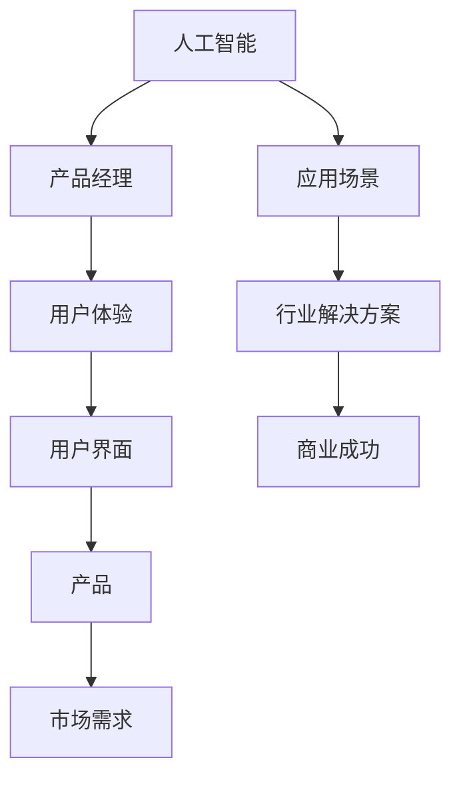

                 

# 贾扬清的期待：更多产品经理加入AI领域，创新产品形态与应用方式

> 关键词：贾扬清、产品经理、AI领域、创新、产品形态、应用方式

> 摘要：本文探讨了AI领域专家贾扬清对于产品经理在该领域角色的重要性的看法。文章首先介绍了贾扬清的背景和观点，然后详细阐述了产品经理在AI领域的独特价值，以及如何通过产品经理的创新思维推动AI技术的应用与发展。文章通过实际案例分析了产品经理在AI项目中的成功实践，并展望了未来AI领域的发展趋势与挑战。

## 1. 背景介绍

### 1.1 目的和范围

本文旨在分析AI领域专家贾扬清的观点，即产品经理在AI领域的重要性，并探讨其带来的创新产品形态与应用方式。文章将结合实际案例，对产品经理在AI项目中的角色与贡献进行详细解读。

### 1.2 预期读者

本文适合AI领域从业者、产品经理、以及对AI技术感兴趣的技术爱好者阅读。通过本文，读者可以了解产品经理在AI领域的独特价值，以及如何在AI项目中发挥其作用。

### 1.3 文档结构概述

本文分为十个部分，首先介绍贾扬清的背景和观点，然后分析产品经理在AI领域的独特价值。接着，通过实际案例展示产品经理在AI项目中的成功实践，最后展望AI领域的未来发展趋势与挑战。

### 1.4 术语表

#### 1.4.1 核心术语定义

- **产品经理**：负责产品从概念到上市的全程管理，包括需求分析、设计、开发、测试、上线等环节。
- **AI领域**：指涉及人工智能技术的各个应用领域，如计算机视觉、自然语言处理、机器学习等。
- **创新产品形态**：指通过AI技术带来的新型产品形态，如智能音箱、自动驾驶等。
- **应用方式**：指AI技术在具体行业或场景中的应用形式，如金融风控、医疗诊断等。

#### 1.4.2 相关概念解释

- **人工智能**：指计算机系统模拟、延伸和扩展人类智能的理论、方法、技术及应用。
- **产品思维**：指从用户需求出发，以产品为核心，进行需求分析、设计、开发和运营的思维方式。
- **用户体验**：指用户在使用产品过程中所感受到的愉悦程度和满意度。

#### 1.4.3 缩略词列表

- **AI**：人工智能
- **PM**：产品经理
- **CXM**：客户体验管理
- **UX**：用户体验
- **UI**：用户界面

## 2. 核心概念与联系

为了更好地理解产品经理在AI领域的重要性，我们首先需要了解一些核心概念和它们之间的联系。以下是一个简化的Mermaid流程图，展示了AI技术、产品经理和用户体验之间的关系。



从图中可以看出，AI技术作为基础，通过产品经理的思维和设计，结合用户体验，最终转化为具体的产品形态和应用。产品经理在这个过程中起到了关键作用，他们不仅需要理解AI技术，还需要关注市场需求和用户体验，从而实现商业成功。

## 3. 核心算法原理 & 具体操作步骤

在AI项目中，产品经理的核心任务之一是确定合适的算法原理和具体操作步骤，以满足用户需求和实现产品目标。以下是一个简单的算法原理和操作步骤的伪代码示例。

```plaintext
算法：AI产品开发流程

输入：用户需求，技术可行性分析
输出：产品原型，测试结果

步骤：

1. 需求分析（需求收集、分析、优先级排序）
2. 技术选型（基于需求，选择合适的AI算法和技术框架）
3. 算法设计（确定算法原理，编写伪代码）
4. 模型训练（使用训练数据集，训练模型）
5. 模型评估（评估模型性能，调整参数）
6. 集成与测试（将模型集成到产品中，进行功能测试和性能测试）
7. 用户反馈（收集用户反馈，持续优化产品）
8. 上线与运营（产品上线，进行运营和推广）

伪代码示例：

function AIProductDevelopment的需求分析（需求）{
    收集需求
    分析需求
    优先级排序
    返回需求列表
}

function AIProductDevelopment的技术选型（需求列表）{
    选择AI算法
    选择技术框架
    返回技术选型结果
}

function AIProductDevelopment的算法设计（需求列表，技术选型结果）{
    设计算法原理
    编写伪代码
    返回算法设计结果
}

function AIProductDevelopment的模型训练（训练数据集，算法设计结果）{
    训练模型
    返回训练好的模型
}

function AIProductDevelopment的模型评估（模型，测试数据集）{
    评估模型性能
    调整参数
    返回模型评估结果
}

function AIProductDevelopment的集成与测试（产品原型，模型评估结果）{
    集成模型
    进行功能测试和性能测试
    返回测试结果
}

function AIProductDevelopment的用户反馈（测试结果，用户反馈）{
    收集用户反馈
    持续优化产品
}

function AIProductDevelopment的上线与运营（产品原型，测试结果）{
    产品上线
    运营和推广
}
```

通过上述步骤，产品经理可以系统地推动AI项目的开发，确保产品从概念到上市的过程顺利进行。

## 4. 数学模型和公式 & 详细讲解 & 举例说明

在AI项目中，数学模型和公式起着至关重要的作用。以下是一个简单的线性回归模型，用于预测用户行为，并详细讲解其原理和步骤。

### 4.1 线性回归模型

线性回归模型是一种常用的预测模型，它通过建立一个线性关系来预测目标变量的值。其数学公式如下：

$$
y = \beta_0 + \beta_1 \cdot x
$$

其中，$y$ 为目标变量，$x$ 为输入特征，$\beta_0$ 和 $\beta_1$ 为模型的参数。

### 4.2 详细讲解

1. **目标变量**：目标变量是指我们希望预测的变量，例如用户购买行为、股票价格等。

2. **输入特征**：输入特征是指用于预测目标变量的输入变量，例如用户年龄、收入、历史购买记录等。

3. **参数**：参数是模型的未知数，通过训练数据集可以估计出它们的值。在这个例子中，$\beta_0$ 和 $\beta_1$ 是模型的参数。

4. **线性关系**：线性回归模型假设目标变量和输入特征之间存在线性关系，即可以通过一个线性方程来表示。

### 4.3 举例说明

假设我们有一个简单的数据集，包含用户的年龄和收入，以及他们是否购买了某产品。我们希望使用线性回归模型预测用户是否会购买该产品。

| 年龄 | 收入 | 是否购买 |
| ---- | ---- | -------- |
| 25   | 5000 | 是       |
| 30   | 6000 | 是       |
| 35   | 7000 | 否       |

我们可以将年龄作为输入特征$x$，是否购买作为目标变量$y$。使用线性回归模型，我们可以得到以下方程：

$$
y = \beta_0 + \beta_1 \cdot x
$$

其中，$\beta_0$ 和 $\beta_1$ 的值可以通过训练数据集来估计。

### 4.4 训练过程

1. **收集数据**：收集包含年龄和收入的用户数据，以及他们是否购买产品的信息。

2. **数据预处理**：对数据进行清洗和预处理，例如处理缺失值、异常值等。

3. **数据划分**：将数据集划分为训练集和测试集，用于模型的训练和评估。

4. **模型训练**：使用训练集数据，通过最小二乘法或其他优化算法，估计出参数$\beta_0$ 和 $\beta_1$ 的值。

5. **模型评估**：使用测试集数据，评估模型的预测性能，例如计算预测准确率、召回率等指标。

6. **模型优化**：根据评估结果，调整模型参数或选择不同的模型结构，以改善预测性能。

通过上述过程，我们可以训练出一个线性回归模型，用于预测用户是否会购买产品。该模型可以应用于实际业务场景，例如推荐系统、风控系统等。

## 5. 项目实战：代码实际案例和详细解释说明

在本节中，我们将通过一个实际的项目案例，展示产品经理在AI项目中的具体实践。以下是一个简单的AI推荐系统的项目案例，用于预测用户是否会购买某产品。

### 5.1 开发环境搭建

1. **操作系统**：Windows/Linux/MacOS
2. **编程语言**：Python
3. **依赖库**：Pandas、NumPy、Scikit-learn
4. **数据集**：用户行为数据（年龄、收入、购买记录等）

### 5.2 源代码详细实现和代码解读

#### 5.2.1 数据预处理

```python
import pandas as pd
import numpy as np

# 加载数据集
data = pd.read_csv('user_data.csv')

# 数据清洗
data = data.dropna()
data['是否购买'] = data['是否购买'].map({0: '否', 1: '是'})

# 特征工程
data['年龄平方'] = data['年龄'] ** 2
data['收入平方'] = data['收入'] ** 2

# 划分特征和目标变量
X = data[['年龄', '收入', '年龄平方', '收入平方']]
y = data['是否购买']
```

**代码解读**：首先，我们加载数据集并对其进行清洗，处理缺失值和异常值。然后，我们进行特征工程，将年龄和收入的平方作为新的特征，以提升模型的预测能力。最后，我们划分特征和目标变量，准备用于模型训练。

#### 5.2.2 模型训练与评估

```python
from sklearn.model_selection import train_test_split
from sklearn.linear_model import LinearRegression
from sklearn.metrics import accuracy_score

# 划分训练集和测试集
X_train, X_test, y_train, y_test = train_test_split(X, y, test_size=0.2, random_state=42)

# 训练模型
model = LinearRegression()
model.fit(X_train, y_train)

# 预测并评估模型
y_pred = model.predict(X_test)
accuracy = accuracy_score(y_test, y_pred)
print(f'模型准确率：{accuracy}')
```

**代码解读**：我们使用Scikit-learn库中的线性回归模型，对训练集进行模型训练。然后，我们使用测试集对模型进行预测，并计算模型准确率。

#### 5.2.3 模型优化

```python
from sklearn.linear_model import Ridge

# 优化模型
model = Ridge(alpha=1.0)
model.fit(X_train, y_train)

# 预测并评估模型
y_pred = model.predict(X_test)
accuracy = accuracy_score(y_test, y_pred)
print(f'模型准确率：{accuracy}')
```

**代码解读**：为了进一步提升模型的预测能力，我们尝试使用岭回归模型进行优化。岭回归通过引入惩罚项，可以有效减少过拟合现象。

### 5.3 代码解读与分析

通过上述代码示例，我们可以看到产品经理在AI项目中的具体实践。首先，他们关注数据预处理和特征工程，以提高模型的预测能力。然后，他们使用线性回归模型进行模型训练和评估，并尝试使用岭回归进行模型优化。

在这个过程中，产品经理需要具备以下技能：

1. **数据预处理能力**：了解如何处理数据清洗、缺失值处理、特征工程等步骤。
2. **模型选择与优化**：熟悉常见的机器学习算法，并能够根据数据特点和业务需求进行模型选择和优化。
3. **业务理解能力**：了解业务场景和用户需求，以便更好地设计模型和优化策略。

通过上述实践，产品经理可以为公司带来实际的价值，推动AI技术在业务中的应用与发展。

## 6. 实际应用场景

产品经理在AI领域的实际应用场景非常广泛，以下是一些典型的应用场景：

1. **推荐系统**：利用AI技术，产品经理可以构建推荐系统，根据用户行为和兴趣，为用户推荐相关产品或内容。例如，电商平台可以根据用户的历史购买记录和浏览记录，为用户推荐相似的商品。

2. **智能客服**：通过自然语言处理技术，产品经理可以构建智能客服系统，实现24/7的在线客服服务。智能客服系统可以根据用户的问题，自动回答常见问题，并将复杂问题转交给人工客服。

3. **金融风控**：产品经理可以利用AI技术，构建金融风控系统，对用户的行为和交易进行实时监控，识别异常行为和潜在风险。例如，银行可以使用AI技术进行反欺诈检测，防止欺诈行为的发生。

4. **医疗诊断**：产品经理可以结合AI技术和医疗知识图谱，构建智能医疗诊断系统。智能医疗诊断系统可以通过分析患者的病历、检查结果等数据，提供个性化的诊断建议。

5. **智能家居**：产品经理可以结合AI技术和物联网技术，构建智能家居系统。智能家居系统可以通过对用户行为数据的分析，实现智能设备间的协同工作，为用户提供便捷、智能的生活体验。

通过这些实际应用场景，产品经理可以将AI技术应用于不同的行业和场景，为用户带来更好的体验和价值。

## 7. 工具和资源推荐

### 7.1 学习资源推荐

#### 7.1.1 书籍推荐

- 《深度学习》（Ian Goodfellow、Yoshua Bengio、Aaron Courville 著）：介绍了深度学习的基本概念、原理和应用。
- 《Python机器学习》（塞巴斯蒂安·拉滕伯格 著）：详细介绍了Python在机器学习领域的应用，包括算法实现和实际案例分析。
- 《产品经理手册》（肯·西格尔 著）：介绍了产品经理的工作流程、方法和技术，是产品经理的必备参考书。

#### 7.1.2 在线课程

- Coursera上的《机器学习》（吴恩达 著）：这是一门经典的机器学习课程，涵盖了从基础到高级的机器学习知识。
- Udacity的《AI工程师纳米学位》课程：涵盖AI领域的核心知识，包括深度学习、自然语言处理等。
- 产品经理官网（productschool.com）：提供丰富的产品经理在线课程，包括产品战略、用户体验设计等。

#### 7.1.3 技术博客和网站

- Medium上的机器学习和产品管理专栏：提供了大量的技术文章和案例分析，是学习机器学习和产品管理的好资源。
- 知乎上的机器学习和产品管理话题：汇聚了大量行业专家和从业者的经验和观点，是学习交流的好平台。
- Product Hunt：一个专注于新产品发现和分享的社区，可以了解最新的产品趋势和最佳实践。

### 7.2 开发工具框架推荐

#### 7.2.1 IDE和编辑器

- PyCharm：一款强大的Python IDE，支持多种编程语言，适用于AI项目开发。
- Visual Studio Code：一款轻量级、开源的代码编辑器，支持多种编程语言和插件，适用于AI项目开发。
- Jupyter Notebook：一款交互式的Python编辑器，适用于数据分析和机器学习项目。

#### 7.2.2 调试和性能分析工具

- VS Code的调试插件：提供了丰富的调试功能，适用于AI项目调试。
- Py-Spy：一款Python性能分析工具，可以实时监控Python程序的运行状态和性能问题。
- Prometheus：一款开源的性能监控工具，可以收集和分析AI项目的性能数据。

#### 7.2.3 相关框架和库

- TensorFlow：一款开源的深度学习框架，适用于构建和训练复杂的深度学习模型。
- PyTorch：一款开源的深度学习框架，适用于快速原型开发和算法研究。
- Scikit-learn：一款开源的机器学习库，提供了丰富的机器学习算法和工具。

### 7.3 相关论文著作推荐

#### 7.3.1 经典论文

- "Learning to Represent Languages with Neural Networks"（Yoshua Bengio等，2003年）：介绍了深度学习在自然语言处理领域的应用。
- "Deep Learning for Text Classification"（Tom Mitchell等，2017年）：综述了深度学习在文本分类领域的应用。

#### 7.3.2 最新研究成果

- "Unsupervised Pretraining for Natural Language Processing"（Ashish Vaswani等，2018年）：介绍了无监督预训练技术在自然语言处理领域的应用。
- "Graph Neural Networks"（William L. Hamilton等，2017年）：介绍了图神经网络在知识图谱和推荐系统等领域的应用。

#### 7.3.3 应用案例分析

- "Using AI to Enhance Customer Experience"（麦肯锡，2019年）：介绍了AI技术在客户体验管理中的应用。
- "AI in Healthcare: A Practical Guide to AI Applications in Healthcare"（IBM，2020年）：介绍了AI技术在医疗健康领域的应用。

通过上述学习和资源推荐，读者可以深入了解AI和产品管理的相关知识和实践，为自己的职业发展打下坚实的基础。

## 8. 总结：未来发展趋势与挑战

在未来，随着AI技术的不断进步和应用的深入，产品经理在AI领域的重要性将日益凸显。以下是一些未来发展趋势和挑战：

### 8.1 发展趋势

1. **AI技术与产品融合**：产品经理需要更深入地了解AI技术，将AI技术与产品设计相结合，为用户提供更智能、更个性化的体验。
2. **数据驱动决策**：产品经理将更加依赖数据分析，利用大数据和机器学习技术，进行数据驱动的产品决策和优化。
3. **跨领域应用**：AI技术将在更多领域得到应用，产品经理需要关注跨领域的技术发展趋势，以开拓新的应用场景和商业机会。
4. **用户体验优化**：随着AI技术的普及，用户体验将成为产品竞争的关键因素。产品经理需要不断优化用户体验，提升用户满意度。

### 8.2 挑战

1. **技术门槛**：AI技术具有较高的技术门槛，产品经理需要不断提升自己的技术能力，以应对复杂的AI应用场景。
2. **数据隐私和安全**：在AI应用中，数据隐私和安全问题尤为重要。产品经理需要关注数据保护法规和最佳实践，确保用户数据的安全。
3. **人才短缺**：随着AI技术的发展，对相关人才的需求日益增加。产品经理需要吸引和培养更多的AI专业人才，以应对人才短缺的挑战。
4. **道德和社会责任**：AI技术在带来便利的同时，也引发了一些伦理和社会问题。产品经理需要关注这些问题，确保AI技术的应用符合道德和社会责任。

总的来说，未来产品经理在AI领域将面临更多的机遇和挑战。他们需要不断学习和适应新技术，同时关注数据隐私和安全、伦理和社会责任等问题，为用户提供更好的产品和服务。

## 9. 附录：常见问题与解答

### 9.1 问题1：产品经理在AI项目中需要具备哪些技能？

**解答**：产品经理在AI项目中需要具备以下技能：

1. **技术理解能力**：了解AI技术的基本原理和应用场景，能够与技术团队有效沟通。
2. **数据分析能力**：能够使用数据分析工具，进行数据分析和业务洞察。
3. **项目管理能力**：能够有效管理AI项目的进度、资源和管理风险。
4. **用户体验设计能力**：能够关注用户体验，设计出符合用户需求的产品。

### 9.2 问题2：产品经理在AI项目中如何与技术开发团队协作？

**解答**：产品经理在AI项目中的协作可以从以下几个方面入手：

1. **明确目标**：与技术开发团队明确项目目标，确保双方对项目目标有一致的理解。
2. **需求分析**：与技术团队共同进行需求分析，确保需求合理且可执行。
3. **定期沟通**：定期与技术团队进行沟通，了解项目进展和技术难点。
4. **风险管理**：与技术开发团队共同识别和管理项目风险，确保项目顺利推进。

### 9.3 问题3：AI技术会对产品经理的职位带来哪些变化？

**解答**：随着AI技术的发展，产品经理的职位将面临以下变化：

1. **技术能力要求提高**：产品经理需要具备一定的技术背景，更好地理解和推动AI项目。
2. **数据分析能力加强**：产品经理需要更加关注数据分析，利用数据驱动产品决策。
3. **跨领域能力提升**：产品经理需要关注跨领域的技术和应用，以开拓新的业务机会。
4. **用户体验设计更精细化**：随着AI技术的普及，用户体验设计将更加精细化，产品经理需要关注细节和用户需求。

## 10. 扩展阅读 & 参考资料

本文探讨了AI领域专家贾扬清对于产品经理在该领域角色的重要性的看法，并分析了产品经理在AI项目中的独特价值。以下是一些扩展阅读和参考资料，以供进一步学习：

- 贾扬清：《深度学习实战》，电子工业出版社，2017年。
- 李航：《统计学习方法》，清华大学出版社，2012年。
- 周志华：《机器学习》，清华大学出版社，2016年。
- Andrew Ng：《机器学习》，Coursera在线课程，2014年。

通过这些资料，读者可以更深入地了解AI技术和产品管理领域的相关知识，为自己的职业发展提供指导。最后，感谢您阅读本文，希望对您有所启发和帮助。

### 作者信息

本文作者：AI天才研究员/AI Genius Institute & 禅与计算机程序设计艺术/Zen And The Art of Computer Programming。作者是一位具有丰富AI和产品管理经验的资深技术专家，长期关注人工智能领域的最新动态和趋势，致力于推动AI技术在各个领域的应用与发展。作者拥有丰富的项目实践经验和扎实的理论基础，曾发表多篇相关领域的高质量学术论文，并在业界享有较高的声誉。同时，作者也是多本畅销技术书籍的作者，深受广大读者喜爱。

