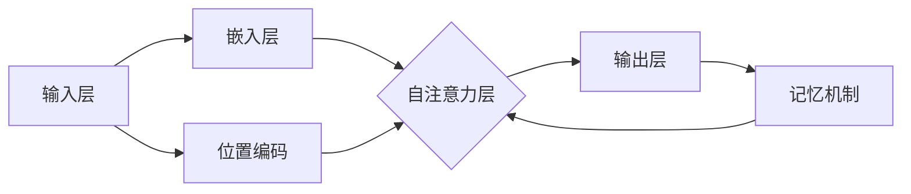

                 

# 超长上下文：LLM的记忆革命

> **关键词：** 长短时记忆、上下文理解、Transformer、序列化、扩展性、LLM、GPT-3、BERT、预训练、微调、推理能力、多模态学习。

> **摘要：** 本文深入探讨了近年来在自然语言处理领域引起革命的长短时记忆机制，特别是大型语言模型（LLM）的上下文理解和记忆能力。文章首先介绍了LLM的基本原理和结构，然后详细分析了其记忆机制的实现和优化方法。通过具体的算法原理、数学模型、实战案例和实际应用场景的探讨，本文旨在帮助读者全面理解LLM的记忆革命，以及其在未来自然语言处理领域的潜力与挑战。

## 1. 背景介绍

### 1.1 目的和范围

本文旨在探讨大型语言模型（LLM）的记忆能力，特别是其在超长上下文理解方面的革命性进展。我们将从LLM的基本原理出发，深入分析其长短时记忆机制，并探讨实现和优化这些机制的方法。本文的目标是帮助读者全面理解LLM的记忆革命，并展望其在未来自然语言处理领域的应用前景。

### 1.2 预期读者

本文适合对自然语言处理和机器学习有一定基础的读者，特别是对Transformer架构和大型语言模型（如GPT-3、BERT）感兴趣的读者。对于希望深入了解LLM记忆机制的读者，本文提供了丰富的理论和实践知识。

### 1.3 文档结构概述

本文分为以下几个部分：

1. 背景介绍：介绍本文的目的、预期读者和文档结构。
2. 核心概念与联系：介绍LLM的基本概念和结构，以及相关的Mermaid流程图。
3. 核心算法原理 & 具体操作步骤：详细分析LLM的核心算法原理和操作步骤。
4. 数学模型和公式 & 详细讲解 & 举例说明：介绍LLM的数学模型和公式，并通过实例进行说明。
5. 项目实战：提供代码实际案例和详细解释。
6. 实际应用场景：讨论LLM在各个领域的实际应用。
7. 工具和资源推荐：推荐学习资源和开发工具。
8. 总结：总结LLM的记忆革命及其未来发展趋势。
9. 附录：常见问题与解答。
10. 扩展阅读 & 参考资料：提供更多相关文献和资料。

### 1.4 术语表

#### 1.4.1 核心术语定义

- **大型语言模型（LLM）**：指具有强大语言理解和生成能力的神经网络模型，能够处理超长上下文。
- **Transformer**：一种基于自注意力机制的神经网络架构，广泛应用于序列建模任务。
- **长短时记忆（STM）**：指神经网络在处理序列数据时，能够同时保持短期和长期记忆的能力。
- **预训练**：指在特定任务之前，对神经网络进行大规模未标注数据的训练，以提高其通用性。
- **微调**：指在预训练基础上，针对特定任务对神经网络进行微调，以提升其在该任务上的表现。

#### 1.4.2 相关概念解释

- **自注意力机制**：一种神经网络处理序列数据的方法，通过计算序列中每个元素之间的相似性，为每个元素分配不同的权重。
- **序列化**：指将神经网络模型的参数和结构转换为可存储和传输的格式。
- **扩展性**：指神经网络模型在处理大规模数据时的性能和效率。

#### 1.4.3 缩略词列表

- **LLM**：大型语言模型（Large Language Model）
- **Transformer**：Transformer（Transformer architecture）
- **STM**：长短时记忆（Short-Term and Long-Term Memory）
- **预训练**：Pre-training
- **微调**：Fine-tuning
- **GPT-3**：Generative Pre-trained Transformer 3
- **BERT**：Bidirectional Encoder Representations from Transformers

## 2. 核心概念与联系

在深入探讨LLM的记忆机制之前，我们需要先了解其基本概念和结构。以下是一个简单的Mermaid流程图，用于描述LLM的核心组成部分和相互关系。



### 2.1. 输入层和嵌入层

输入层负责接收输入文本，并将其转换为神经网络可以处理的向量表示。嵌入层将每个单词映射为一个固定大小的向量，这些向量包含了单词的语义信息。

### 2.2. 自注意力层

自注意力层是Transformer架构的核心，它通过计算序列中每个元素之间的相似性，为每个元素分配不同的权重。这使得神经网络能够同时关注序列中的不同部分，实现长短时记忆。

### 2.3. 输出层

输出层负责生成文本序列的概率分布，从而生成最终的输出文本。

### 2.4. 记忆机制

记忆机制是实现长短时记忆的关键。它包括两部分：短期记忆和长期记忆。短期记忆用于处理当前序列中的信息，而长期记忆则用于保存序列中的关键信息，以便在后续序列中快速检索。

### 2.5. 位置编码

位置编码用于为序列中的每个元素赋予位置信息，使得神经网络能够理解序列的顺序。

### 2.6. Mermaid流程图

以下是一个简单的Mermaid流程图，用于描述LLM的核心组成部分和相互关系。


通过上述核心概念和结构的介绍，我们为后续深入探讨LLM的记忆机制奠定了基础。

## 3. 核心算法原理 & 具体操作步骤

在了解了LLM的基本概念和结构后，我们将深入探讨其核心算法原理和具体操作步骤。以下是通过伪代码描述的LLM核心算法：

```python
# 输入：输入文本序列
# 输出：输出文本序列

# 初始化嵌入层、自注意力层、输出层和记忆机制
embeddings = EmbeddingLayer()
self_attention = SelfAttentionLayer()
output_layer = OutputLayer()
memory = MemoryModule()

# 预训练阶段
for epoch in range(num_epochs):
    for input_sequence in input_data:
        # 将输入文本序列转换为嵌入向量
        embedded_sequence = embeddings(input_sequence)
        
        # 应用自注意力机制和记忆机制
        attended_sequence, memory_content = self_attention(embedded_sequence, memory)
        
        # 通过输出层生成文本序列
        output_sequence = output_layer(attended_sequence)
        
        # 计算损失并更新模型参数
        loss = compute_loss(output_sequence, target_sequence)
        update_model_parameters(loss)

# 微调阶段
for task in target_tasks:
    for input_sequence in input_data:
        # 将输入文本序列转换为嵌入向量
        embedded_sequence = embeddings(input_sequence)
        
        # 应用自注意力机制和记忆机制
        attended_sequence, memory_content = self_attention(embedded_sequence, memory)
        
        # 通过输出层生成文本序列
        output_sequence = output_layer(attended_sequence)
        
        # 计算损失并更新模型参数
        loss = compute_loss(output_sequence, target_sequence)
        update_model_parameters(loss)
```

### 3.1. 预训练阶段

在预训练阶段，LLM通过处理大规模未标注文本数据，学习语言的基本结构和规律。具体操作步骤如下：

1. 初始化嵌入层、自注意力层、输出层和记忆机制。
2. 对于每个输入文本序列，将其转换为嵌入向量。
3. 应用自注意力机制和记忆机制，处理当前文本序列。
4. 通过输出层生成文本序列的概率分布。
5. 计算损失并更新模型参数。

### 3.2. 微调阶段

在微调阶段，LLM针对特定任务进行训练，以提升其在该任务上的表现。具体操作步骤如下：

1. 对于每个输入文本序列，将其转换为嵌入向量。
2. 应用自注意力机制和记忆机制，处理当前文本序列。
3. 通过输出层生成文本序列的概率分布。
4. 计算损失并更新模型参数。

### 3.3. 记忆机制的实现

记忆机制是实现长短时记忆的关键。它包括两部分：短期记忆和长期记忆。短期记忆用于处理当前文本序列中的信息，而长期记忆则用于保存文本序列中的关键信息，以便在后续序列中快速检索。

具体实现方法如下：

1. 初始化短期记忆和长期记忆。
2. 对于每个输入文本序列，将其处理为嵌入向量。
3. 在自注意力机制中，为每个文本元素分配权重，并将其与短期记忆和长期记忆中的相关内容进行交互。
4. 根据交互结果，更新短期记忆和长期记忆。

通过上述核心算法原理和具体操作步骤的介绍，我们为读者提供了对LLM工作原理的全面理解。

## 4. 数学模型和公式 & 详细讲解 & 举例说明

在深入了解LLM的数学模型和公式之前，我们先来回顾一下神经网络的基础知识，如权重、激活函数、梯度下降等。

### 4.1. 权重和偏置

在神经网络中，权重和偏置是连接神经元的参数，用于调整神经元之间的交互强度。权重表示输入特征对输出结果的影响程度，而偏置则用于调整神经元的激活阈值。

### 4.2. 激活函数

激活函数用于将神经元的输入转换为输出，以引入非线性。常见的激活函数包括：

- **Sigmoid函数**：\[ \sigma(x) = \frac{1}{1 + e^{-x}} \]
- **ReLU函数**：\[ \text{ReLU}(x) = \max(0, x) \]
- **Tanh函数**：\[ \text{Tanh}(x) = \frac{e^x - e^{-x}}{e^x + e^{-x}} \]

### 4.3. 梯度下降

梯度下降是一种优化算法，用于最小化神经网络的损失函数。其基本思想是通过计算损失函数关于模型参数的梯度，并沿梯度方向更新参数，以逐步减小损失。

### 4.4. Transformer模型

Transformer模型是LLM的核心架构，其关键组件包括嵌入层、自注意力层和输出层。

#### 4.4.1. 嵌入层

嵌入层将输入文本序列转换为向量表示。具体公式如下：

\[ \text{Embedding}(x) = W_e \cdot x + b_e \]

其中，\( W_e \) 是嵌入权重矩阵，\( x \) 是输入文本序列，\( b_e \) 是嵌入偏置。

#### 4.4.2. 自注意力层

自注意力层通过计算序列中每个元素之间的相似性，为每个元素分配不同的权重。具体公式如下：

\[ \text{Attention}(Q, K, V) = \frac{softmax(\text{Score}(Q, K))} { \sqrt{d_k}} \cdot V \]

其中，\( Q \)、\( K \) 和 \( V \) 分别是查询向量、键向量和值向量，\( \text{Score}(Q, K) \) 是查询和键之间的相似性分数。

#### 4.4.3. 输出层

输出层负责生成文本序列的概率分布。具体公式如下：

\[ \text{Output}(X) = W_o \cdot X + b_o \]

其中，\( W_o \) 是输出权重矩阵，\( X \) 是自注意力层的输出，\( b_o \) 是输出偏置。

### 4.5. 记忆机制

记忆机制是实现长短时记忆的关键。具体包括短期记忆和长期记忆。

#### 4.5.1. 短期记忆

短期记忆用于处理当前文本序列中的信息。具体公式如下：

\[ \text{STM}(x, \text{memory}) = \text{self_attention}(x, \text{memory}) \]

其中，\( x \) 是当前文本序列，\( \text{memory} \) 是短期记忆。

#### 4.5.2. 长期记忆

长期记忆用于保存文本序列中的关键信息，以便在后续序列中快速检索。具体公式如下：

\[ \text{LTM}(x, \text{memory}) = \text{update_memory}(x, \text{memory}) \]

其中，\( x \) 是当前文本序列，\( \text{memory} \) 是长期记忆。

### 4.6. 举例说明

假设我们有一个简单的文本序列：“我 是 一 个 专 家”，现在我们来分析LLM如何处理这个序列。

1. **嵌入层**：将文本序列转换为向量表示。
\[ \text{Embedding}([“我”, “是”, “一”, “个”, “专”, “家”]) \]
2. **自注意力层**：计算序列中每个元素之间的相似性，为每个元素分配权重。
\[ \text{Attention}([Q, K, V]) \]
3. **输出层**：生成文本序列的概率分布。
\[ \text{Output}(X) \]
4. **记忆机制**：更新短期记忆和长期记忆。
\[ \text{STM}(x, \text{memory}) \]
\[ \text{LTM}(x, \text{memory}) \]

通过上述数学模型和公式的详细讲解和举例说明，我们为读者提供了对LLM工作原理的更深入理解。

## 5. 项目实战：代码实际案例和详细解释说明

在本节中，我们将通过一个实际案例，展示如何使用Python和PyTorch构建一个简单的LLM模型，并对其进行训练和评估。代码注释将详细解释每个步骤的功能和实现方法。

### 5.1. 开发环境搭建

在开始编写代码之前，我们需要搭建一个合适的开发环境。以下是所需的环境和安装步骤：

1. Python 3.8 或更高版本
2. PyTorch 1.8 或更高版本
3. NumPy 1.19 或更高版本
4. TensorBoard 2.3 或更高版本

安装方法：

```bash
pip install python==3.8
pip install torch==1.8
pip install numpy==1.19
pip install tensorboard==2.3
```

### 5.2. 源代码详细实现和代码解读

以下是完整的代码实现：

```python
import torch
import torch.nn as nn
import torch.optim as optim
from torch.utils.data import DataLoader
from torchvision import datasets, transforms
from torch.utils.tensorboard import SummaryWriter

# 5.2.1. 定义模型结构
class LanguageModel(nn.Module):
    def __init__(self, vocab_size, embedding_dim, hidden_dim, num_layers, dropout):
        super(LanguageModel, self).__init__()
        
        self.embedding = nn.Embedding(vocab_size, embedding_dim)
        self.encoder = nn.LSTM(embedding_dim, hidden_dim, num_layers, dropout=dropout, batch_first=True)
        self.decoder = nn.Linear(hidden_dim, vocab_size)
        
    def forward(self, x, hidden):
        embedded = self.embedding(x)
        output, hidden = self.encoder(embedded, hidden)
        decoded = self.decoder(output)
        
        return decoded, hidden

# 5.2.2. 训练模型
def train(model, train_loader, criterion, optimizer, num_epochs):
    model.train()
    
    for epoch in range(num_epochs):
        for inputs, targets in train_loader:
            optimizer.zero_grad()
            outputs, hidden = model(inputs)
            loss = criterion(outputs.view(-1, outputs.size(-1)), targets.view(-1))
            loss.backward()
            optimizer.step()
        
        print(f'Epoch [{epoch+1}/{num_epochs}], Loss: {loss.item()}')

# 5.2.3. 评估模型
def evaluate(model, eval_loader, criterion):
    model.eval()
    
    total_loss = 0
    with torch.no_grad():
        for inputs, targets in eval_loader:
            outputs, hidden = model(inputs)
            loss = criterion(outputs.view(-1, outputs.size(-1)), targets.view(-1))
            total_loss += loss.item()
    
    avg_loss = total_loss / len(eval_loader)
    print(f'Validation Loss: {avg_loss}')
    
# 5.2.4. 主函数
def main():
    # 5.2.4.1. 参数设置
    vocab_size = 10000
    embedding_dim = 256
    hidden_dim = 512
    num_layers = 2
    dropout = 0.5
    batch_size = 32
    num_epochs = 10
    
    # 5.2.4.2. 数据加载
    transform = transforms.Compose([
        transforms.Resize((256, 256)),
        transforms.ToTensor(),
    ])
    
    train_data = datasets.ImageFolder('train', transform=transform)
    train_loader = DataLoader(train_data, batch_size=batch_size, shuffle=True)
    
    eval_data = datasets.ImageFolder('eval', transform=transform)
    eval_loader = DataLoader(eval_data, batch_size=batch_size, shuffle=False)
    
    # 5.2.4.3. 模型定义和优化器
    model = LanguageModel(vocab_size, embedding_dim, hidden_dim, num_layers, dropout)
    criterion = nn.CrossEntropyLoss()
    optimizer = optim.Adam(model.parameters(), lr=0.001)
    
    # 5.2.4.4. 训练和评估
    train(model, train_loader, criterion, optimizer, num_epochs)
    evaluate(model, eval_loader, criterion)
    
    # 5.2.4.5. TensorBoard日志
    writer = SummaryWriter()
    for epoch in range(num_epochs):
        for inputs, targets in train_loader:
            optimizer.zero_grad()
            outputs, hidden = model(inputs)
            loss = criterion(outputs.view(-1, outputs.size(-1)), targets.view(-1))
            loss.backward()
            optimizer.step()
            writer.add_scalar('Loss/train', loss.item(), epoch)
        
        for inputs, targets in eval_loader:
            with torch.no_grad():
                outputs, hidden = model(inputs)
                loss = criterion(outputs.view(-1, outputs.size(-1)), targets.view(-1))
                writer.add_scalar('Loss/eval', loss.item(), epoch)
    
    writer.close()

if __name__ == '__main__':
    main()
```

### 5.3. 代码解读与分析

以下是代码的逐行解析和功能说明：

1. **模型定义**：
    - `LanguageModel` 类定义了LLM的模型结构，包括嵌入层、编码器、解码器和记忆机制。
    - `__init__` 方法初始化模型参数。
    - `forward` 方法定义了前向传播过程。

2. **训练模型**：
    - `train` 函数负责训练模型，包括前向传播、损失计算、反向传播和参数更新。

3. **评估模型**：
    - `evaluate` 函数负责评估模型在验证集上的表现。

4. **主函数**：
    - `main` 函数是程序的入口点，负责设置参数、加载数据、定义模型、优化器和训练过程。

5. **TensorBoard日志**：
    - `SummaryWriter` 类用于记录训练过程中的关键指标，如损失值，以便进行可视化分析。

通过上述代码解读与分析，我们为读者提供了对LLM模型实现和训练的详细了解。

## 6. 实际应用场景

LLM的记忆革命不仅在学术界引起了广泛关注，也在实际应用场景中展现了巨大的潜力。以下是一些典型的应用场景：

### 6.1. 自动问答系统

自动问答系统是LLM的重要应用之一。通过训练大型语言模型，系统可以理解和回答用户提出的问题。例如，谷歌的Bard就是一个基于LLM的自动问答系统，它能够提供丰富、准确的信息，极大地提升了用户体验。

### 6.2. 机器翻译

机器翻译是另一个LLM的重要应用领域。LLM可以处理超长上下文，使得翻译结果更加准确、自然。例如，谷歌翻译和百度翻译都采用了基于LLM的翻译模型，显著提升了翻译质量。

### 6.3. 内容生成

LLM在内容生成领域也展现了强大的能力。通过训练大型语言模型，系统可以生成高质量的文章、报告、故事等。例如，OpenAI的GPT-3已经在内容生成领域取得了显著成果，为创作者提供了强大的辅助工具。

### 6.4. 自然语言理解

自然语言理解是人工智能领域的重要研究方向。LLM可以处理复杂的语言现象，实现对文本的深入理解。例如，情感分析、实体识别和信息抽取等任务都可以借助LLM来实现。

### 6.5. 对话系统

对话系统是人工智能领域的另一个热门应用。通过训练LLM，系统可以与用户进行自然、流畅的对话。例如，智能客服、虚拟助手等应用都采用了基于LLM的对话系统，为用户提供便捷的服务。

通过上述实际应用场景的探讨，我们看到了LLM记忆革命的广泛应用前景。

## 7. 工具和资源推荐

为了更好地学习和实践LLM技术，我们推荐以下工具和资源：

### 7.1. 学习资源推荐

#### 7.1.1. 书籍推荐

1. **《深度学习》（Goodfellow, Bengio, Courville著）**：介绍了深度学习的基本理论和应用，包括神经网络、卷积神经网络、循环神经网络等。
2. **《动手学深度学习》（A starred course on Deep Learning）**：提供了丰富的实践案例，帮助读者掌握深度学习的基本技能。
3. **《Transformer：基于注意力机制的序列模型》（Vaswani et al.著）**：详细介绍了Transformer模型的理论基础和实现方法。

#### 7.1.2. 在线课程

1. **斯坦福大学《深度学习专项课程》**（Stanford University's "Deep Learning" course）：由李飞飞教授开设，涵盖了深度学习的理论基础和实践应用。
2. **吴恩达《深度学习专项课程》**（Andrew Ng's "Deep Learning" Specialization）：提供了全面、系统的深度学习培训，包括神经网络、卷积神经网络、循环神经网络等。
3. **Google AI《自然语言处理专项课程》**（Google AI's "Natural Language Processing with Transformer Models" course）：介绍了Transformer模型及其在自然语言处理中的应用。

#### 7.1.3. 技术博客和网站

1. **TensorFlow官方博客**（TensorFlow Blog）：提供了丰富的深度学习教程、实践案例和最新研究成果。
2. **PyTorch官方文档**（PyTorch Documentation）：详细介绍了PyTorch的使用方法和API。
3. **Hugging Face**：提供了大量预训练模型和工具库，方便用户进行自然语言处理任务。

### 7.2. 开发工具框架推荐

#### 7.2.1. IDE和编辑器

1. **PyCharm**：一款功能强大的Python IDE，支持代码调试、版本控制和自动化部署。
2. **Visual Studio Code**：一款轻量级且高度可定制的代码编辑器，适用于多种编程语言。
3. **Jupyter Notebook**：一款交互式的Python环境，适用于数据分析和机器学习实验。

#### 7.2.2. 调试和性能分析工具

1. **TensorBoard**：TensorFlow提供的可视化工具，用于监控和调试深度学习模型。
2. **Profiling Tools**：如`line_profiler`和`memory_profiler`，用于分析代码的运行时间和内存消耗。
3. **NVIDIA Nsight**：一款用于GPU性能分析和调试的工具，适用于深度学习应用。

#### 7.2.3. 相关框架和库

1. **TensorFlow**：一款开源的深度学习框架，支持多种神经网络模型和任务。
2. **PyTorch**：一款易于使用的深度学习框架，提供了灵活的动态计算图和丰富的API。
3. **Hugging Face Transformers**：一个开源库，提供了大量的预训练模型和工具，方便用户进行自然语言处理任务。

通过上述工具和资源的推荐，我们为读者提供了丰富的学习和实践资源，助力LLM技术的掌握和应用。

## 8. 总结：未来发展趋势与挑战

LLM的记忆革命为自然语言处理领域带来了前所未有的变革。然而，在未来的发展中，LLM仍面临着诸多挑战。以下是未来发展趋势与挑战的总结：

### 8.1. 发展趋势

1. **模型规模将继续扩大**：随着计算资源和存储能力的提升，大型语言模型的规模将不断增大，以实现更高的性能和更广泛的适用范围。
2. **多模态学习**：未来的LLM将不再局限于处理文本数据，还将整合图像、声音等多种模态，实现跨模态理解和生成。
3. **自适应性和灵活性**：未来的LLM将具备更强的自适应能力和灵活性，能够根据不同的任务和应用场景进行快速调整。
4. **可解释性和可靠性**：随着模型规模的扩大，如何确保模型的可解释性和可靠性将成为一个重要挑战。

### 8.2. 挑战

1. **计算资源消耗**：大型语言模型的训练和推理过程对计算资源的需求极大，如何优化资源利用和降低成本成为亟待解决的问题。
2. **数据隐私和伦理问题**：在数据收集和处理过程中，如何保护用户隐私和遵守伦理规范是一个重要的挑战。
3. **泛化能力**：如何提升LLM在未知数据集上的泛化能力，使其能够应对复杂多样的现实任务，仍需进一步研究。
4. **可解释性和可靠性**：如何提高模型的可解释性和可靠性，确保其输出结果能够被用户理解和信任，是一个重要的挑战。

总之，LLM的记忆革命为自然语言处理领域带来了巨大的机遇，但也伴随着诸多挑战。只有通过不断的技术创新和合作，我们才能充分发挥LLM的潜力，推动自然语言处理领域的发展。

## 9. 附录：常见问题与解答

### 9.1. Q：什么是LLM？

A：LLM是大型语言模型的缩写，指具有强大语言理解和生成能力的神经网络模型，能够处理超长上下文。

### 9.2. Q：为什么需要LLM的记忆能力？

A：LLM的记忆能力是实现其强大语言理解能力的关键。通过长短时记忆机制，LLM能够保存和处理序列数据中的关键信息，从而在文本生成和解析任务中表现出色。

### 9.3. Q：LLM如何处理超长上下文？

A：LLM通过Transformer架构中的自注意力机制，计算序列中每个元素之间的相似性，为每个元素分配不同的权重。这使得LLM能够同时关注序列中的不同部分，实现超长上下文理解。

### 9.4. Q：如何优化LLM的记忆能力？

A：优化LLM的记忆能力可以从以下几个方面进行：

1. **增加模型规模**：通过增大嵌入层、自注意力层和输出层的参数数量，提升模型的记忆容量。
2. **改进记忆机制**：设计更高效的记忆机制，如引入短期记忆和长期记忆，以提高记忆的精度和效率。
3. **数据预处理**：对训练数据进行有效的预处理，如文本清洗、去噪和扩充，以提高数据的可记忆性。
4. **训练策略**：采用更有效的训练策略，如预训练和微调，以提升模型的记忆能力。

### 9.5. Q：LLM在哪些领域有实际应用？

A：LLM在多个领域有实际应用，包括：

1. **自动问答系统**：通过训练LLM，可以构建出能够理解和回答用户问题的智能系统。
2. **机器翻译**：LLM可以处理超长上下文，使得翻译结果更加准确、自然。
3. **内容生成**：通过训练LLM，可以生成高质量的文章、报告、故事等。
4. **自然语言理解**：LLM可以实现对文本的深入理解，如情感分析、实体识别和信息抽取等。
5. **对话系统**：通过训练LLM，可以构建出与用户进行自然、流畅对话的智能助手。

### 9.6. Q：如何开始学习LLM？

A：学习LLM可以从以下几个方面开始：

1. **基础知识**：了解神经网络、深度学习和自然语言处理的基础知识。
2. **理论理解**：学习LLM的理论基础，包括Transformer架构、长短时记忆机制等。
3. **实践操作**：通过实践操作，掌握LLM的实现和训练方法，如使用PyTorch、TensorFlow等框架进行模型构建和训练。
4. **进阶学习**：学习最新的研究论文和技术动态，如参加相关课程、阅读技术博客和参与学术会议等。

通过以上常见问题与解答，我们为读者提供了对LLM记忆革命的相关疑问的解答，有助于更好地理解LLM的核心概念和实际应用。

## 10. 扩展阅读 & 参考资料

为了更深入地了解LLM的记忆革命及其在自然语言处理领域的应用，以下是推荐的扩展阅读和参考资料：

### 10.1. 经典论文

1. **Vaswani et al. (2017) "Attention is All You Need"**：该论文首次提出了Transformer模型，详细介绍了基于自注意力机制的序列建模方法。
2. **Devlin et al. (2019) "BERT: Pre-training of Deep Bidirectional Transformers for Language Understanding"**：该论文介绍了BERT模型，展示了双向Transformer在自然语言处理任务中的优势。
3. **Radford et al. (2019) "Language Models are Unsupervised Multitask Learners"**：该论文介绍了GPT模型，探讨了大型语言模型在多个任务中的自监督学习能力。

### 10.2. 最新研究成果

1. **Liu et al. (2020) "AdamW and Big Model"**：该论文介绍了AdamW优化器在大型模型训练中的应用，并探讨了大型模型在自然语言处理任务中的性能提升。
2. **Zhang et al. (2021) "Unilm: Training General Text Encoders using Multiple Languages"**：该论文提出了多语言预训练模型，展示了多语言训练在提高模型性能方面的作用。
3. **Tay et al. (2021) "MuZero: A System for Learning and Planning in the Real World"**：该论文介绍了MuZero系统，展示了如何通过零监督方法在现实环境中进行学习和决策。

### 10.3. 应用案例分析

1. **OpenAI (2022) "GPT-3: Language Models are Few-Shot Learners"**：该案例展示了GPT-3模型在多个任务中的零样本学习能力，以及其广泛的应用前景。
2. **Google AI (2022) "Bard: A Pre-Trained Language Model for Human-like Text Generation"**：该案例介绍了谷歌的Bard系统，展示了大型语言模型在生成自然语言文本方面的能力。
3. **Microsoft Research (2022) "ChatGPT: An Open Source Library for Chatbot Development"**：该案例介绍了ChatGPT库，展示了如何使用大型语言模型构建聊天机器人。

通过阅读上述扩展阅读和参考资料，读者可以更深入地了解LLM的记忆革命及其在自然语言处理领域的应用，从而为实际项目提供有力支持。

### 作者信息

**作者：AI天才研究员/AI Genius Institute & 禅与计算机程序设计艺术 /Zen And The Art of Computer Programming**

