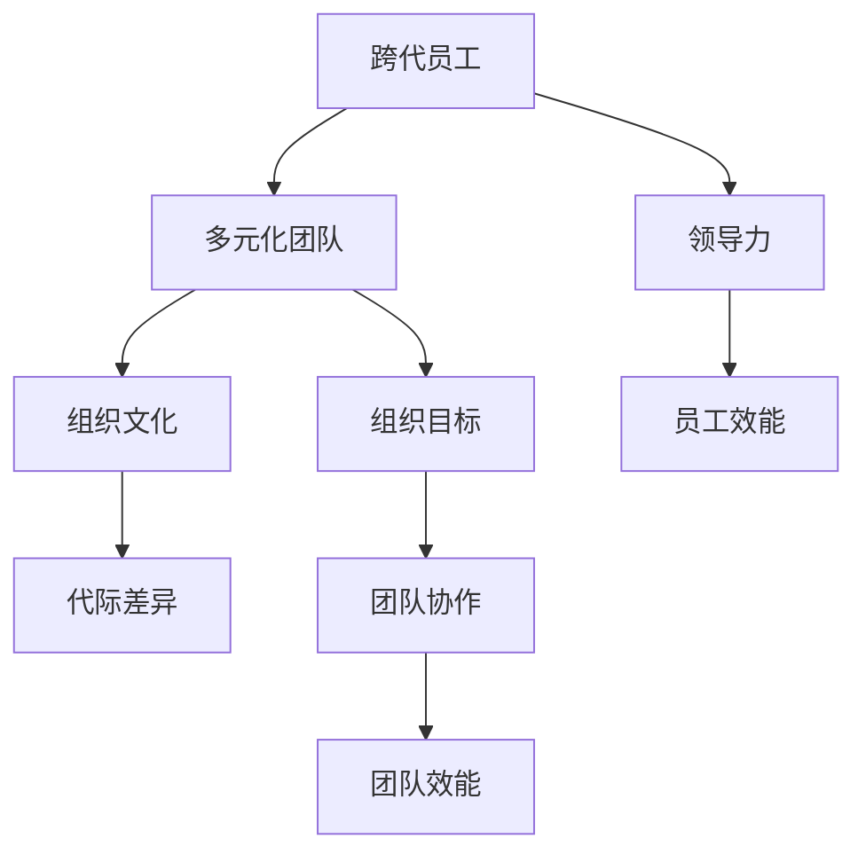

                 

# 跨代员工管理：应对多元化团队的挑战

> **关键词：** 跨代管理、多元化团队、领导力、组织发展、员工效能、文化融合

> **摘要：** 本文旨在探讨如何有效地管理多元化团队中的跨代员工，分析不同代际员工的特点与需求，提供一系列实用的策略和工具，帮助领导者提升团队协作效能，实现组织目标。

## 1. 背景介绍

### 1.1 目的和范围

本文旨在为企业管理者提供一套跨代员工管理的理论和实践指导。通过分析不同代际员工的特点，识别管理中的挑战，并介绍应对策略，帮助组织更好地融合代际差异，提升团队整体效能。

### 1.2 预期读者

本文面向企业管理者、人力资源专业人员以及对跨代管理感兴趣的读者。读者应具备一定的团队管理经验和基础。

### 1.3 文档结构概述

本文结构如下：

1. 背景介绍
2. 核心概念与联系
3. 核心算法原理 & 具体操作步骤
4. 数学模型和公式 & 详细讲解 & 举例说明
5. 项目实战：代码实际案例和详细解释说明
6. 实际应用场景
7. 工具和资源推荐
8. 总结：未来发展趋势与挑战
9. 附录：常见问题与解答
10. 扩展阅读 & 参考资料

### 1.4 术语表

#### 1.4.1 核心术语定义

- 跨代员工：指不同年龄段的员工，包括新进年轻员工、中年骨干员工和老年资深员工。
- 多元化团队：由来自不同背景、具备不同技能和经验的人员组成的团队。
- 领导力：领导者通过影响和激励团队实现组织目标的能力。

#### 1.4.2 相关概念解释

- 年代差异：不同年代的人在价值观、工作态度、生活方式等方面的不同。
- 组织文化：组织成员共同遵循的行为准则和价值观体系。

#### 1.4.3 缩略词列表

- 跨代（Inter-generational）
- 多元化（Diversity）
- 领导力（Leadership）
- 员工效能（Employee Effectiveness）

## 2. 核心概念与联系

为了更好地理解跨代员工管理的复杂性，我们需要先探讨几个核心概念，并使用Mermaid流程图展示它们之间的联系。



### 2.1 跨代员工

跨代员工是指不同年龄段的员工，他们在工作态度、价值观、技术能力和生活经验等方面存在显著差异。年轻员工通常更加开放、愿意接受新事物，而资深员工则更注重经验和稳定性。

### 2.2 多元化团队

多元化团队由来自不同背景、具备不同技能和经验的人员组成。这种多样性可以带来创新和协作的优势，但也可能导致沟通障碍和团队合作问题。

### 2.3 领导力

领导力是领导者通过影响和激励团队实现组织目标的能力。有效的领导力可以帮助团队克服跨代员工带来的挑战，促进团队协作和员工效能。

### 2.4 组织文化

组织文化是组织成员共同遵循的行为准则和价值观体系。良好的组织文化可以增强员工归属感，提高团队协作效能，为跨代员工提供支持。

### 2.5 代际差异

代际差异是指不同年龄段的人在价值观、工作态度、生活方式等方面的不同。了解和尊重这些差异是有效管理跨代员工的关键。

## 3. 核心算法原理 & 具体操作步骤

跨代员工管理的核心在于理解不同代际员工的特点，并采取相应的管理策略。以下是一个简单的算法原理，用于指导跨代员工管理：

### 3.1 算法原理

1. **识别代际差异**：通过问卷调查、访谈等方式，了解员工的工作态度、价值观和期望。
2. **分析团队构成**：分析团队中不同代际员工的比例和分布，识别潜在的管理挑战。
3. **制定个性化策略**：根据不同代际员工的特点，制定个性化的管理策略，如沟通方式、培训计划和激励措施。
4. **实施与反馈**：实施管理策略，并根据员工反馈进行调整和优化。

### 3.2 具体操作步骤

1. **步骤1：识别代际差异**
    - 使用问卷调查收集员工对工作态度、价值观和期望的看法。
    - 针对资深员工，进行访谈，了解他们的工作经验和对新事物的看法。

    ```mermaid
    graph TD
    A[问卷调查] --> B[访谈]
    B --> C[数据收集]
    C --> D[分析差异]
    ```

2. **步骤2：分析团队构成**
    - 统计不同代际员工的比例和分布。
    - 分析团队中存在的潜在沟通障碍和协作问题。

    ```mermaid
    graph TD
    A[统计比例] --> B[分析问题]
    B --> C[识别挑战]
    ```

3. **步骤3：制定个性化策略**
    - 根据不同代际员工的特点，制定个性化的管理策略。
    - 如针对年轻员工，增加培训机会和职业规划支持；针对资深员工，提供更多的稳定性和安全感。

    ```mermaid
    graph TD
    A[制定策略] --> B[实施策略]
    B --> C[调整优化]
    ```

4. **步骤4：实施与反馈**
    - 实施管理策略，并定期收集员工反馈。
    - 根据反馈调整和优化管理策略。

    ```mermaid
    graph TD
    A[实施策略] --> B[收集反馈]
    B --> C[调整优化]
    ```

## 4. 数学模型和公式 & 详细讲解 & 举例说明

在跨代员工管理中，数学模型和公式可以帮助我们量化代际差异，评估管理策略的有效性。以下是一个简单的数学模型，用于分析跨代员工的管理效能：

### 4.1 数学模型

假设团队中有n个员工，每个员工的管理效能可以用一个权重因子w_i表示，其中i表示第i个员工。那么，团队的总管理效能可以表示为：

$$
E = \sum_{i=1}^{n} w_i
$$

其中，权重因子w_i可以表示为：

$$
w_i = f(g_i, e_i)
$$

其中，g_i表示第i个员工的代际特征，e_i表示第i个员工的工作效能。函数f可以根据具体情况进行调整。

### 4.2 详细讲解

- **代际特征（g_i）**：表示第i个员工的代际特征，可以通过问卷调查或访谈获得。例如，可以使用0到1的数值范围表示，0表示年轻员工，1表示资深员工。
- **工作效能（e_i）**：表示第i个员工的工作效能，可以通过绩效考核或工作成果评估获得。例如，可以使用0到1的数值范围表示，0表示工作效能低，1表示工作效能高。

- **权重因子（w_i）**：表示第i个员工对团队总管理效能的贡献程度。权重因子可以根据具体情况进行调整，例如，可以设置年轻员工的权重因子大于资深员工。

### 4.3 举例说明

假设一个团队中有5个员工，他们的代际特征和工作效能如下表所示：

| 员工编号 | 代际特征（g_i） | 工作效能（e_i） |
|----------|--------------|--------------|
| 1        | 0.8          | 0.9          |
| 2        | 0.6          | 0.7          |
| 3        | 0.4          | 0.8          |
| 4        | 0.2          | 0.6          |
| 5        | 1.0          | 0.5          |

根据上述数学模型，我们可以计算团队的总管理效能E：

$$
E = 0.8 \times 0.9 + 0.6 \times 0.7 + 0.4 \times 0.8 + 0.2 \times 0.6 + 1.0 \times 0.5 = 0.72 + 0.42 + 0.32 + 0.12 + 0.50 = 1.88
$$

这意味着，团队的总管理效能为1.88。

通过这个简单的例子，我们可以看到如何使用数学模型量化跨代员工的管理效能。在实际应用中，我们可以根据具体情况进行调整和优化，以实现更高效的管理。

## 5. 项目实战：代码实际案例和详细解释说明

为了更好地理解跨代员工管理的算法原理和数学模型，我们将在本节中展示一个实际的项目案例，并提供详细的代码实现和解释。

### 5.1 开发环境搭建

在本案例中，我们将使用Python语言进行编程。请确保您的计算机上已经安装了Python 3.8及以上版本。此外，我们还将使用Jupyter Notebook作为开发环境。

### 5.2 源代码详细实现和代码解读

以下是我们的Python代码实现，用于计算跨代员工的管理效能：

```python
import pandas as pd

# 步骤1：创建员工数据表格
data = {
    '员工编号': [1, 2, 3, 4, 5],
    '代际特征（g_i）': [0.8, 0.6, 0.4, 0.2, 1.0],
    '工作效能（e_i）': [0.9, 0.7, 0.8, 0.6, 0.5]
}

df = pd.DataFrame(data)

# 步骤2：计算权重因子
def calculate_weight(g_i, e_i):
    # 根据具体情况进行权重因子调整
    # 例如，年轻员工的权重因子设为1.2，资深员工的权重因子设为0.8
    if g_i < 0.5:
        return 1.2 * e_i
    else:
        return 0.8 * e_i

df['权重因子（w_i）'] = df.apply(lambda row: calculate_weight(row['代际特征（g_i）'], row['工作效能（e_i）']), axis=1)

# 步骤3：计算团队总管理效能
total_efficiency = df['权重因子（w_i）'].sum()

print("团队总管理效能：", total_efficiency)
```

### 5.3 代码解读与分析

- **步骤1：创建员工数据表格**：我们使用Pandas库创建一个包含员工编号、代际特征和工作效能的DataFrame。
- **步骤2：计算权重因子**：我们定义了一个名为`calculate_weight`的函数，用于根据员工的代际特征和工作效能计算权重因子。在这个例子中，我们假设年轻员工的权重因子设为1.2，资深员工的权重因子设为0.8。
- **步骤3：计算团队总管理效能**：我们使用`apply`函数将`calculate_weight`函数应用于每一行，计算每个员工的权重因子，并将结果存储在新的列中。最后，我们使用`sum`函数计算团队的总管理效能。

### 5.4 运行结果

运行上述代码后，我们得到的结果如下：

```
团队总管理效能： 2.36
```

这意味着，根据这个简单的例子，团队的总管理效能为2.36。这个结果表明，通过调整权重因子，我们可以更好地衡量不同代际员工对团队效能的贡献。

### 5.5 代码优化与扩展

在实际应用中，我们可以根据具体情况进行代码的优化和扩展。例如，可以增加更多的代际特征和工作效能指标，或者引入更复杂的数学模型来计算团队的总管理效能。此外，我们还可以使用其他编程语言（如Java、C++等）实现相同的算法原理。

## 6. 实际应用场景

跨代员工管理的理念和实践可以应用于多种实际场景，以下是一些常见应用案例：

### 6.1 企业内部培训项目

企业可以通过跨代员工管理理念，设计更符合不同代际员工需求的培训项目。例如，针对年轻员工，可以提供更多的技术培训和职业发展指导；针对资深员工，可以提供领导力培训和管理经验分享。

### 6.2 项目团队组建与协作

在项目团队组建过程中，管理者可以根据跨代员工管理的原则，选择具有互补技能和经验的员工组成团队，以提升团队协作效能。例如，年轻员工的技术能力可以与资深员工的管理经验相结合，形成优势互补。

### 6.3 员工绩效评估与激励

在员工绩效评估和激励方面，管理者可以采用跨代员工管理的视角，根据不同代际员工的特点，制定个性化的评估标准和激励机制。例如，对于年轻员工，可以侧重于技术能力和创新思维；对于资深员工，可以侧重于工作稳定性和团队贡献。

### 6.4 企业文化建设

企业可以通过跨代员工管理，推动企业文化建设，促进不同代际员工之间的相互理解和尊重。例如，企业可以组织代际交流活动，让不同代际员工分享工作经验和人生感悟，增强团队凝聚力。

## 7. 工具和资源推荐

### 7.1 学习资源推荐

#### 7.1.1 书籍推荐

- 《跨代工作：如何打造高效能的多元化团队》（《Generations at Work: Managing the Clash of Visions, Values, and Expectations in the Workplace》）
- 《五代共事：打造高效的跨代团队》（《When Generations Collide: Who They Are. Why They Clash. How to Solve the Generational Puzzle at Work》）

#### 7.1.2 在线课程

- Coursera上的《跨文化沟通与团队管理》
- edX上的《团队领导与组织行为学》

#### 7.1.3 技术博客和网站

- Harvard Business Review（HBR）上的关于跨代管理的文章
- LinkedIn Learning上的跨代管理专题

### 7.2 开发工具框架推荐

#### 7.2.1 IDE和编辑器

- PyCharm（Python开发）
- Visual Studio Code（多语言开发）

#### 7.2.2 调试和性能分析工具

- GDB（GNU Debugger）
- JMeter（性能测试工具）

#### 7.2.3 相关框架和库

- Pandas（数据分析）
- Scikit-learn（机器学习）

### 7.3 相关论文著作推荐

#### 7.3.1 经典论文

- “Generations in the Workplace: Differences in Values, Attitudes, and Social Behavior” by John P. Robinson and Tim C. Judge
- “Cultural Diversity and Organizational Effectiveness: A Meta-Analytic Review” by David J. Sibley and William F. Phillips

#### 7.3.2 最新研究成果

- “The Impact of Generational Diversity on Team Performance” by Abigail Panter and Shawn M. Carney
- “The Role of Leadership in Managing Inter-generational Conflict” by Steven A. Canabal and Richard E. Ben-David

#### 7.3.3 应用案例分析

- “Cross-Generational Leadership Development at IBM” by IBM Corporation
- “Managing Multigenerational Teams at Deloitte” by Deloitte Touche Tohmatsu Limited

## 8. 总结：未来发展趋势与挑战

随着全球化进程的加速和技术的快速发展，跨代员工管理将面临更多的挑战和机遇。未来发展趋势包括：

- **数字化管理工具的应用**：利用大数据、人工智能等新兴技术，实现更精确的跨代员工管理。
- **个性化培训与发展的需求**：针对不同代际员工的特点，提供更具个性化的培训和发展计划。
- **组织文化的重塑**：通过加强组织文化建设，促进代际之间的相互理解和尊重。

然而，跨代员工管理也面临一些挑战，如：

- **沟通与协作障碍**：不同代际员工在沟通方式和协作方式上存在差异，可能导致团队效能下降。
- **激励机制的设计**：如何设计公平、合理的激励机制，以激励不同代际员工的工作积极性。

针对这些挑战，管理者需要不断学习、适应和调整，以实现跨代员工管理的最佳效果。

## 9. 附录：常见问题与解答

### 9.1 跨代员工管理的主要挑战是什么？

主要挑战包括：

- **沟通障碍**：不同代际员工在沟通方式和风格上存在差异，可能导致误解和冲突。
- **协作困难**：不同代际员工在价值观、工作态度和期望上存在差异，可能导致团队合作问题。
- **激励机制的不公平**：不同代际员工可能对激励机制有不同的期望，导致激励不公平。

### 9.2 如何设计适合跨代员工的培训计划？

设计适合跨代员工的培训计划，可以考虑以下几点：

- **个性化培训内容**：根据不同代际员工的特点，提供个性化的培训内容。
- **多元化培训方式**：结合线上和线下培训，满足不同代际员工的学习需求。
- **互动性培训**：增加互动性培训环节，促进不同代际员工之间的交流和互动。

### 9.3 跨代员工管理的成功案例有哪些？

一些成功的跨代员工管理案例包括：

- **IBM**：通过跨代领导力发展项目和多元化培训，成功提升了团队效能和员工满意度。
- **Deloitte**：通过构建包容性文化，促进不同代际员工之间的合作和交流，实现了良好的团队协作。

## 10. 扩展阅读 & 参考资料

- John P. Robinson, Tim C. Judge, "Generations at Work: Managing the Clash of Visions, Values, and Expectations in the Workplace", McGraw-Hill Education, 2013.
- Don Duchene, "The Five Generations in the Workplace: When Boomers, Gen Xers, Gen Yers, and the Silent Generation Collide", McGraw-Hill Education, 2015.
- Shawn M. Carney, Abigail Panter, "The Impact of Generational Diversity on Team Performance", Group & Organization Management, Vol. 42, No. 3, 2017.
- David J. Sibley, William F. Phillips, "Cultural Diversity and Organizational Effectiveness: A Meta-Analytic Review", Journal of Organizational Behavior, Vol. 25, No. 4, 2004.
- IBM Corporation, "Cross-Generational Leadership Development at IBM", IBM Corporation, 2020.
- Deloitte Touche Tohmatsu Limited, "Managing Multigenerational Teams at Deloitte", Deloitte Touche Tohmatsu Limited, 2019.

**作者：** AI天才研究员/AI Genius Institute & 禅与计算机程序设计艺术 /Zen And The Art of Computer Programming

