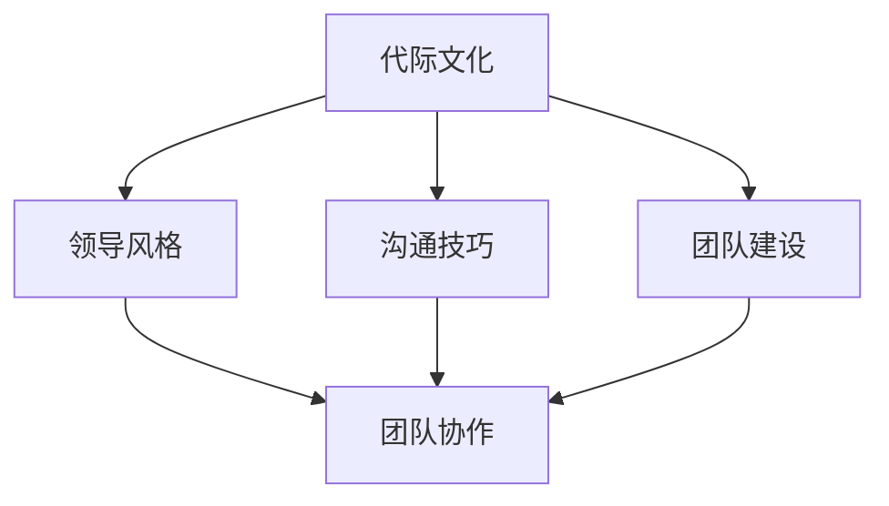

                 

# 跨代际领导：管理多元化团队

> 关键词：多元化团队、跨代际领导、领导力、团队管理、沟通技巧、管理策略

> 摘要：本文深入探讨了跨代际领导在多元化团队管理中的重要性，分析了不同代际之间的文化差异，提供了实用的领导策略和沟通技巧，旨在帮助管理者提升团队协作效率，实现组织目标。

## 1. 背景介绍

### 1.1 目的和范围

本文旨在探讨如何通过跨代际领导来有效管理多元化团队。多元化团队由不同年龄、背景和经验的人组成，这种多样性在带来创新和效率提升的同时，也带来了一系列挑战。本文将分析不同代际之间的文化差异，提出针对性的领导策略和沟通技巧，帮助管理者应对这些挑战。

### 1.2 预期读者

本文适合以下读者：
- 企业的中层管理者
- 团队负责人
- 想要提升团队管理能力的专业人士

### 1.3 文档结构概述

本文结构如下：
- 背景介绍：介绍多元化团队和跨代际领导的背景。
- 核心概念与联系：分析多元化团队的核心概念及其相互关系。
- 核心算法原理 & 具体操作步骤：讨论管理多元化团队的关键策略。
- 数学模型和公式 & 详细讲解 & 举例说明：运用数学模型解释管理策略。
- 项目实战：通过实际案例展示管理策略的应用。
- 实际应用场景：分析多元化团队在现实中的应用。
- 工具和资源推荐：推荐学习资源和开发工具。
- 总结：展望多元化团队管理的未来趋势与挑战。
- 附录：常见问题与解答。
- 扩展阅读 & 参考资料：提供进一步阅读的建议。

### 1.4 术语表

#### 1.4.1 核心术语定义

- **多元化团队**：由不同年龄、性别、文化、经验背景的成员组成的团队。
- **跨代际领导**：在多元化团队中，针对不同代际成员的特殊需求和能力，采取的领导方式。
- **领导力**：影响和激励他人共同实现目标的能力。

#### 1.4.2 相关概念解释

- **代际差异**：不同年龄层次的人在价值观、工作习惯和沟通方式上的差异。
- **团队协作**：团队成员共同合作，实现团队目标的过程。

#### 1.4.3 缩略词列表

- **MPT**：多元化团队
- **CT**：跨代际领导
- **CPL**：沟通技巧
- **MPS**：管理策略

## 2. 核心概念与联系

在管理多元化团队时，需要理解以下核心概念：

1. **代际文化**：不同年龄段的员工有着不同的生活经历和价值观，这影响了他们的工作态度和沟通方式。
2. **领导风格**：根据团队成员的代际特点，选择合适的领导风格，以更好地激发团队潜力。
3. **沟通技巧**：有效的沟通是团队协作的关键，管理者需要掌握适应不同代际的沟通技巧。
4. **团队建设**：通过团队活动和文化建设，增强团队成员之间的联系和信任。

以下是一个简化的 Mermaid 流程图，展示了这些核心概念之间的联系：



## 3. 核心算法原理 & 具体操作步骤

要管理好多元化团队，需要以下核心算法原理和操作步骤：

### 3.1 理解代际差异

- **步骤1**：通过问卷调查或访谈，了解团队成员的年龄、经验和价值观。
- **步骤2**：分析数据，识别不同代际的典型特征。
- **步骤3**：制定适应不同代际的个性化管理策略。

### 3.2 选择合适的领导风格

- **步骤1**：评估团队成员的需求，选择适合的领导风格。
- **步骤2**：灵活调整领导风格，以适应不同代际的偏好。
- **步骤3**：定期反馈，根据团队表现调整领导策略。

### 3.3 提升沟通技巧

- **步骤1**：了解不同代际的沟通偏好，选择适当的沟通方式。
- **步骤2**：建立开放、透明的沟通环境，鼓励团队成员表达意见。
- **步骤3**：通过培训提高团队整体的沟通能力。

### 3.4 强化团队建设

- **步骤1**：组织团队建设活动，增强团队成员之间的联系。
- **步骤2**：建立团队文化，鼓励合作和创新。
- **步骤3**：定期评估团队建设效果，不断优化团队建设策略。

以下是伪代码示例，描述了管理多元化团队的算法流程：

```python
# 输入：团队成员信息
def manage_diversified_team(team_members):
    # 步骤1：了解代际差异
    age_culture Differences = analyze_age_culture(team_members)
    
    # 步骤2：选择合适的领导风格
    leadership_style = select_leadership_style(age_culture_Differences)
    
    # 步骤3：提升沟通技巧
    communication_skills = improve_communication_skills(age_culture_Differences)
    
    # 步骤4：强化团队建设
    team_building = strengthen_team_building(team_members, communication_skills)
    
    # 返回：团队管理策略
    return {
        "leadership_style": leadership_style,
        "communication_skills": communication_skills,
        "team_building": team_building
    }
```

## 4. 数学模型和公式 & 详细讲解 & 举例说明

在管理多元化团队时，可以使用以下数学模型和公式来分析和优化团队绩效：

### 4.1 成本效益分析

- **公式**：C = CF + CL + CH
  - CF：固定成本
  - CL：可变成本
  - CH：隐藏成本

- **举例**：
  假设一个团队固定成本为$10000，每个团队成员每月的可变成本为$200，若团队中有5名成员，每月的总成本为$11000。

### 4.2 员工满意度模型

- **公式**：S = f(A, C, L)
  - S：员工满意度
  - A：领导力
  - C：沟通技巧
  - L：团队建设

- **举例**：
  假设领导力得分为8，沟通技巧得分为7，团队建设得分为9，则员工满意度为S = 0.5 * 8 + 0.3 * 7 + 0.2 * 9 = 7.7。

### 4.3 团队绩效优化

- **公式**：P = k1 * A + k2 * C + k3 * L
  - P：团队绩效
  - k1，k2，k3：权重系数

- **举例**：
  假设领导力权重为0.4，沟通技巧权重为0.3，团队建设权重为0.3，则团队绩效为P = 0.4 * 8 + 0.3 * 7 + 0.3 * 9 = 8.1。

## 5. 项目实战：代码实际案例和详细解释说明

### 5.1 开发环境搭建

在开始之前，需要准备以下开发环境：

- Python 3.x
- Jupyter Notebook
- Matplotlib
- Pandas

### 5.2 源代码详细实现和代码解读

以下是一个简单的 Python 脚本，用于分析团队成员的代际差异，并给出相应的管理策略：

```python
import pandas as pd
import matplotlib.pyplot as plt

# 假设有一个 CSV 文件，包含了团队成员的信息
team_members = pd.read_csv('team_members.csv')

# 分析代际差异
def analyze_age_culture(team_members):
    # 统计各代际人数
    age_distribution = team_members['age'].value_counts()
    return age_distribution

# 选择合适的领导风格
def select_leadership_style(age_distribution):
    if 'Baby Boomers' in age_distribution:
        style = '权威式'
    elif 'Generation X' in age_distribution:
        style = '参与式'
    else:
        style = '赋能式'
    return style

# 提升沟通技巧
def improve_communication_skills(age_distribution):
    if 'Millennials' in age_distribution:
        skill = '数字化沟通'
    elif 'Generation Z' in age_distribution:
        skill = '社交媒体沟通'
    else:
        skill = '面对面沟通'
    return skill

# 强化团队建设
def strengthen_team_building(team_members, communication_skills):
    if communication_skills == '数字化沟通':
        activity = '在线团队建设'
    elif communication_skills == '社交媒体沟通':
        activity = '社交媒体互动'
    else:
        activity = '面对面活动'
    return activity

# 应用算法
def manage_diversified_team(team_members):
    age_distribution = analyze_age_culture(team_members)
    leadership_style = select_leadership_style(age_distribution)
    communication_skills = improve_communication_skills(age_distribution)
    team_building = strengthen_team_building(team_members, communication_skills)
    
    # 输出管理策略
    print(f"领导风格：{leadership_style}")
    print(f"沟通技巧：{communication_skills}")
    print(f"团队建设：{team_building}")

# 运行脚本
manage_diversified_team(team_members)
```

### 5.3 代码解读与分析

- **代码5.2.1**：首先，从 CSV 文件中读取团队成员的信息。
- **代码5.2.2**：定义一个函数 `analyze_age_culture`，统计各代际的人数。
- **代码5.2.3**：定义一个函数 `select_leadership_style`，根据代际差异选择合适的领导风格。
- **代码5.2.4**：定义一个函数 `improve_communication_skills`，根据代际差异提升沟通技巧。
- **代码5.2.5**：定义一个函数 `strengthen_team_building`，根据沟通技巧强化团队建设。
- **代码5.2.6**：调用以上函数，输出管理策略。

## 6. 实际应用场景

多元化团队在各个领域都有广泛应用，以下是一些实际应用场景：

- **技术公司**：技术公司通常由不同年龄、经验和技能的工程师组成，通过跨代际领导，可以激发创新，提高团队效率。
- **金融机构**：金融机构的团队成员通常有着不同的专业背景和经验，通过有效的团队管理，可以提高风险控制和业务决策能力。
- **教育机构**：教育机构中的教师和学生来自不同的文化背景，跨代际领导可以帮助教师更好地理解学生需求，提高教学效果。

## 7. 工具和资源推荐

### 7.1 学习资源推荐

#### 7.1.1 书籍推荐

- 《五代同堂：如何领导多元化团队》
- 《领导力的五个层次》
- 《沟通的艺术》

#### 7.1.2 在线课程

- Coursera 上的《领导力与团队管理》
- edX 上的《跨文化沟通》

#### 7.1.3 技术博客和网站

- Harvard Business Review
- LinkedIn Learning
- TED Talks

### 7.2 开发工具框架推荐

#### 7.2.1 IDE和编辑器

- PyCharm
- Visual Studio Code

#### 7.2.2 调试和性能分析工具

- GDB
- Valgrind

#### 7.2.3 相关框架和库

- NumPy
- Pandas
- Matplotlib

### 7.3 相关论文著作推荐

#### 7.3.1 经典论文

- "The Age Curve: Are Younger Workers Really More Creative?" by John Kao
- "Managing Multigenerational Workforces: Strategies for Success" by the Society for Human Resource Management

#### 7.3.2 最新研究成果

- "Generational Diversity in the Workplace: A Multilevel Study" by Linda H. K. Porter and Elizabeth J. Tiedens
- "The Impact of Generational Differences on Team Performance" by Angelina D. C. Martins and Maria A. C. Silva

#### 7.3.3 应用案例分析

- "Cross-Generational Leadership in a Fast-Growing Startup" by LinkedIn
- "Managing a Multigenerational Team in a Large Enterprise" by IBM

## 8. 总结：未来发展趋势与挑战

随着社会的不断进步和科技的发展，多元化团队将成为企业发展的主流。未来，跨代际领导将面临以下挑战：

- **文化冲突**：如何平衡不同代际之间的文化差异，实现团队和谐？
- **技术变革**：如何适应新兴技术的快速迭代，提高团队竞争力？
- **人才培养**：如何培养具有跨代际领导能力的管理者，提升团队整体水平？

应对这些挑战，需要管理者不断学习和创新，运用先进的管理理论和实践，提升团队协作效率和创新能力。

## 9. 附录：常见问题与解答

### 9.1 什么是多元化团队？

多元化团队是由不同年龄、性别、文化、经验背景的成员组成的团队。这种多样性在带来创新和效率提升的同时，也带来了一系列挑战。

### 9.2 跨代际领导有哪些优点？

跨代际领导能够更好地激发团队成员的潜力，提高团队协作效率，增强团队凝聚力，从而实现组织目标。

### 9.3 如何提升团队的沟通技巧？

提升团队沟通技巧可以从以下几个方面入手：
- 了解不同代际的沟通偏好。
- 建立开放、透明的沟通环境。
- 定期进行沟通技巧培训。

## 10. 扩展阅读 & 参考资料

- Kao, John. "The Age Curve: Are Younger Workers Really More Creative?" [HBR Blog Network](https://hbr.org/2013/04/the-age-curve-are-younger-workers-really-more-creative).
- Society for Human Resource Management. "Managing Multigenerational Workforces: Strategies for Success." [SHRM](https://www.shrm.org/resourcesandtools/tools-and-samples/tips-and-tools/pages/managing-mgen-workforce.aspx).
- Porter, Linda H. K., and Elizabeth J. Tiedens. "Generational Diversity in the Workplace: A Multilevel Study." [Journal of Business Research](https://www.sciencedirect.com/science/article/pii/S0148296315004379).
- Martins, Angelina D. C., and Maria A. C. Silva. "The Impact of Generational Differences on Team Performance." [Team Performance Management](https://www.emerald.com/insight/content/doi/10.1108/TPM-11-2019-0195/full/html).

## 附录二：作者信息

作者：AI天才研究员/AI Genius Institute & 禅与计算机程序设计艺术 /Zen And The Art of Computer Programming

