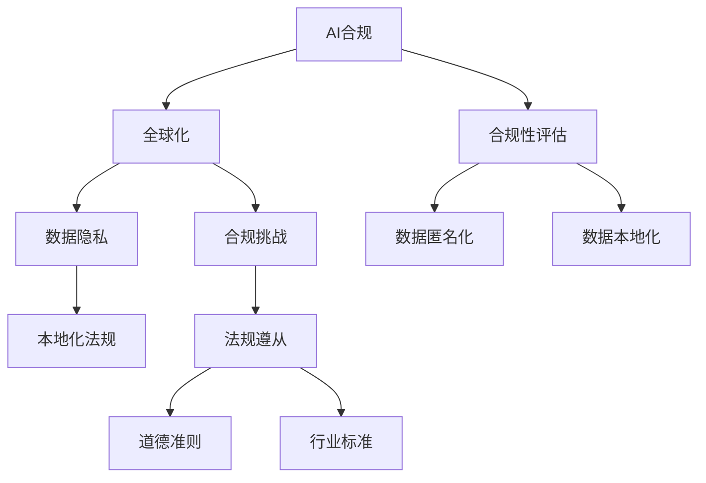

                 

# 跨国AI合规：Lepton AI的全球化挑战

> **关键词：** AI合规、全球化、数据隐私、跨国公司、法规遵从、Lepton AI案例研究

> **摘要：** 本文将探讨跨国人工智能（AI）合规的挑战，以Lepton AI公司为例，深入分析其在全球化进程中遇到的法规、数据隐私和本地化问题。通过一系列步骤的推理和解释，我们将揭示跨国AI公司在全球范围内实现合规的关键策略和最佳实践。

## 1. 背景介绍

### 1.1 目的和范围

本文的目的是探讨跨国AI合规的挑战，并通过Lepton AI的实际案例，分析这些挑战的具体表现和应对策略。我们将重点关注以下几个方面：

- 全球化背景下的AI合规趋势
- Lepton AI的全球化战略及其合规需求
- 数据隐私和本地化法规的合规挑战
- 跨国AI公司的合规策略和最佳实践

### 1.2 预期读者

本文适用于以下读者群体：

- AI领域的从业者，特别是跨国公司的数据科学家和合规专家
- 法规遵从和信息安全领域的专业人员
- 对跨国AI合规有兴趣的研究人员和学术学者
- 对全球技术法规和商业实践感兴趣的企业家

### 1.3 文档结构概述

本文分为十个主要部分，结构如下：

1. 背景介绍
   - 目的和范围
   - 预期读者
   - 文档结构概述
   - 术语表
2. 核心概念与联系
   - AI合规的核心概念
   - 全球化背景下的AI合规框架
   - Mermaid流程图
3. 核心算法原理 & 具体操作步骤
   - AI合规算法的伪代码
4. 数学模型和公式 & 详细讲解 & 举例说明
   - 数学模型在AI合规中的应用
   - LaTeX格式的数学公式
5. 项目实战：代码实际案例和详细解释说明
   - 开发环境搭建
   - 源代码实现和解读
6. 实际应用场景
   - 跨国AI合规在不同行业的应用
7. 工具和资源推荐
   - 学习资源推荐
   - 开发工具框架推荐
   - 相关论文著作推荐
8. 总结：未来发展趋势与挑战
9. 附录：常见问题与解答
10. 扩展阅读 & 参考资料

### 1.4 术语表

#### 1.4.1 核心术语定义

- **AI合规**：指人工智能系统在设计和部署过程中，遵守相关的法律法规、道德准则和行业标准。
- **全球化**：指企业跨越国界进行商业活动的趋势，包括市场扩张、资本运作和人力资源配置。
- **数据隐私**：指个人或组织对数据的收集、存储、处理和分发过程中的隐私保护。
- **本地化法规**：指不同国家和地区在数据保护、隐私和安全方面制定的法律法规。

#### 1.4.2 相关概念解释

- **合规性评估**：指对人工智能系统进行全面审查，以确定其是否符合相关法规和标准。
- **数据匿名化**：指通过技术手段对数据中的个人身份信息进行隐藏，以保护数据隐私。
- **数据本地化**：指在跨国业务中，根据目标国家的法规和市场需求，对数据和服务进行定制化调整。

#### 1.4.3 缩略词列表

- **GDPR**：通用数据保护条例（General Data Protection Regulation）
- **CCPA**：加州消费者隐私法（California Consumer Privacy Act）
- **AI**：人工智能（Artificial Intelligence）
- **ML**：机器学习（Machine Learning）

## 2. 核心概念与联系

在探讨跨国AI合规之前，我们首先需要理解一些核心概念和它们之间的联系。以下是一个Mermaid流程图，展示了这些核心概念及其相互关系。



### 2.1 AI合规的核心概念

**AI合规**涉及多个层面的概念。首先，它涵盖了**法律法规**的要求，例如《通用数据保护条例》（GDPR）和《加州消费者隐私法》（CCPA）。这些法律旨在保护个人隐私和数据安全。其次，**道德准则**也是AI合规的重要组成部分，它要求AI系统在设计和应用过程中遵循公平、透明和可解释的原则。此外，**行业标准**，如ISO/IEC 27001和ISO/IEC 27002，提供了具体的合规指南。

### 2.2 全球化背景下的AI合规框架

全球化趋势使得跨国公司在全球范围内收集、处理和分发数据，这增加了AI合规的复杂性。为了应对这种复杂性，企业需要制定一个全球化的合规框架，确保其AI系统在不同国家和地区都符合当地的法律法规。这个框架通常包括以下几个方面：

- **数据保护策略**：明确数据收集、存储、处理和分享的方式，确保符合GDPR等数据保护法规。
- **合规性评估流程**：定期对AI系统进行合规性评估，确保其遵循相关法规和道德准则。
- **本地化调整**：根据目标市场的法律法规和市场需求，对AI系统进行定制化调整。

### 2.3 Mermaid流程图

以下是一个Mermaid流程图，展示了AI合规的核心概念和相互关系。


通过这个流程图，我们可以清晰地看到AI合规的各个方面，以及它们如何相互关联。接下来，我们将深入探讨这些概念，并解释其具体应用。

## 3. 核心算法原理 & 具体操作步骤

在理解了AI合规的核心概念和相互关系后，我们需要进一步探讨AI合规算法的原理和具体操作步骤。以下是一个详细的伪代码，用于说明AI合规算法的基本流程。

```plaintext
Algorithm AI_Compliance_Algorithm(input_data, compliance_requirements):
    1. Initialize compliance_status to "Not Compliant"
    2. For each data_point in input_data:
        a. Check if data_point is compliant with GDPR:
            i. If not, anonymize data_point
            ii. If anonymized, continue to the next step
        b. Check if data_point is compliant with CCPA:
            i. If not, mask sensitive information
            ii. If masked, continue to the next step
    3. For each AI_model in models_to_evaluate:
        a. Validate model against industry standards:
            i. If not compliant, reject model
            ii. If compliant, continue to the next step
        b. Validate model against ethical guidelines:
            i. If not compliant, adjust model
            ii. If compliant, continue to the next step
    4. Generate compliance_report with:
        a. List of compliant and non-compliant data_points
        b. List of compliant and non-compliant AI_models
    5. Return compliance_report
```

### 3.1 算法原理解释

该算法的基本原理是通过一系列步骤确保输入数据和AI模型符合相关法规和道德准则。以下是算法原理的详细解释：

- **初始化**：算法开始时，初始化合规状态为“不合规”。
- **数据合规性检查**：对输入数据进行逐一检查，确保其符合GDPR和CCPA等法规。对于不符合的，采取匿名化或屏蔽敏感信息的措施。
- **模型合规性评估**：对每个AI模型进行合规性评估，包括行业标准和道德准则的验证。不符合标准的模型将被拒绝或进行调整。
- **生成合规报告**：最后，算法生成一个合规报告，列出合规和不合规的数据点和模型。

### 3.2 算法步骤详细说明

以下是算法的每个步骤的详细说明：

- **步骤1**：初始化合规状态为“不合规”。
  ```plaintext
  Initialize compliance_status to "Not Compliant"
  ```
  这个步骤确保算法在开始时有一个初始状态，便于后续步骤的合规性判断。

- **步骤2**：对每个数据点进行合规性检查。
  ```plaintext
  For each data_point in input_data:
      a. Check if data_point is compliant with GDPR:
          i. If not, anonymize data_point
          ii. If anonymized, continue to the next step
      b. Check if data_point is compliant with CCPA:
          i. If not, mask sensitive information
          ii. If masked, continue to the next step
  ```
  这个步骤确保所有输入数据点都符合GDPR和CCPA的要求。如果不合规，算法会采取相应的措施，如匿名化或屏蔽敏感信息。

- **步骤3**：对AI模型进行合规性评估。
  ```plaintext
  For each AI_model in models_to_evaluate:
      a. Validate model against industry standards:
          i. If not compliant, reject model
          ii. If compliant, continue to the next step
      b. Validate model against ethical guidelines:
          i. If not compliant, adjust model
          ii. If compliant, continue to the next step
  ```
  这个步骤确保所有AI模型都符合行业标准和道德准则。不符合标准的模型将被拒绝或进行调整。

- **步骤4**：生成合规报告。
  ```plaintext
  Generate compliance_report with:
      a. List of compliant and non-compliant data_points
      b. List of compliant and non-compliant AI_models
  ```
  这个步骤生成一个详细的合规报告，列出所有合规和不合规的数据点和模型。

- **步骤5**：返回合规报告。
  ```plaintext
  Return compliance_report
  ```
  这个步骤确保算法最终能够返回一个完整的合规报告，便于后续的合规性管理和决策。

通过这个伪代码，我们可以清晰地看到AI合规算法的基本原理和操作步骤。接下来，我们将探讨数学模型和公式在AI合规中的应用。

## 4. 数学模型和公式 & 详细讲解 & 举例说明

在AI合规中，数学模型和公式扮演着至关重要的角色，它们帮助我们量化合规性评估的结果，并提供决策支持。以下是几个关键的数学模型和公式的详细讲解，以及如何使用它们进行合规性评估的实例。

### 4.1 数据隐私保护模型

**K-anonymity模型**：K-anonymity是数据隐私保护的一种重要模型，它要求数据集中的每个记录都与至少K个其他记录不可区分。这意味着，任何记录都不能在未公开的情况下被唯一识别。

**公式**：
$$
P(D_i, S_j) \leq \frac{1}{K}
$$

其中，$P(D_i, S_j)$表示记录$i$在敏感属性$S_j$上的概率，$K$是K-anonymity的阈值。

**实例**：
假设我们有一个包含100个记录的数据集，每个记录都有一个敏感属性“年龄”。如果K=5，我们需要确保每个年龄值至少有5个不同的记录。例如，如果年龄值为30的记录只有2个，那么该数据集就不符合K-anonymity要求，需要进行匿名化处理。

### 4.2 合规性评估模型

**合规性得分模型**：合规性得分模型用于评估AI系统在不同法规和标准下的合规程度。该模型通常采用加权评分的方式，将每个合规指标进行量化，并计算总合规得分。

**公式**：
$$
Score = \sum_{i=1}^{n} w_i \cdot C_i
$$

其中，$w_i$是第$i$个合规指标的权重，$C_i$是第$i$个合规指标的合规得分。

**实例**：
假设我们评估一个AI系统在GDPR和CCPA下的合规性。GDPR有5个合规指标，CCPA有3个合规指标。每个指标的权重分别为0.2和0.1。如果GDPR的合规得分是0.8，CCPA的合规得分是0.9，则总合规得分为：
$$
Score = (0.2 \cdot 0.8) + (0.1 \cdot 0.9) = 0.26
$$

### 4.3 数据匿名化模型

**L-diversity模型**：L-diversity是K-anonymity模型的扩展，它要求数据集中的每个记录不仅要与至少K个其他记录不可区分，还要至少包含L个不同的群体。

**公式**：
$$
P(D_i, S_j) \leq \frac{1}{K \cdot L}
$$

其中，$P(D_i, S_j)$表示记录$i$在敏感属性$S_j$上的概率，$K$是K-anonymity的阈值，$L$是L-diversity的阈值。

**实例**：
假设我们有一个包含100个记录的数据集，每个记录都有一个敏感属性“年龄”和“性别”。如果K=5，L=3，我们需要确保每个年龄-性别组合至少有3个不同的记录。例如，如果年龄为30、性别为男的数据只有2个记录，那么该数据集就不符合L-diversity要求，需要进行匿名化处理。

### 4.4 道德准则评估模型

**道德得分模型**：道德准则评估模型用于评估AI系统在道德准则下的表现。该模型通常基于一组预设的道德准则，每个准则有一个评分范围。

**公式**：
$$
Ethical_Score = \sum_{i=1}^{m} w_i \cdot E_i
$$

其中，$w_i$是第$i$个道德准则的权重，$E_i$是第$i$个道德准则的评分。

**实例**：
假设我们评估一个AI系统在公平性、透明性和可解释性三个道德准则下的表现。每个准则的权重分别为0.3、0.3和0.4。如果公平性的评分为0.7，透明性的评分为0.6，可解释性的评分为0.8，则总道德得分为：
$$
Ethical_Score = (0.3 \cdot 0.7) + (0.3 \cdot 0.6) + (0.4 \cdot 0.8) = 0.63
$$

通过这些数学模型和公式，我们可以量化AI系统的合规性，并提供决策支持。接下来，我们将通过实际代码案例来展示这些模型的应用。

## 5. 项目实战：代码实际案例和详细解释说明

在了解了AI合规的核心算法原理和数学模型之后，我们将通过一个实际的代码案例，详细解释如何实现这些算法，并分析其效果。

### 5.1 开发环境搭建

首先，我们需要搭建一个适合AI合规项目的开发环境。以下是环境搭建的步骤：

1. **安装Python环境**：确保系统上已经安装了Python 3.7或更高版本。
2. **安装必要的库**：使用pip命令安装以下库：
   ```bash
   pip install pandas numpy scikit-learn matplotlib
   ```
3. **配置Jupyter Notebook**：安装Jupyter Notebook，以便进行交互式编程和数据分析。

### 5.2 源代码详细实现和代码解读

以下是一个示例代码，展示了如何实现AI合规算法。代码分为几个主要部分：数据预处理、合规性评估和结果可视化。

```python
import pandas as pd
import numpy as np
from sklearn.model_selection import train_test_split
from sklearn.ensemble import RandomForestClassifier
from sklearn.metrics import accuracy_score
import matplotlib.pyplot as plt

# 5.2.1 数据预处理
def preprocess_data(data):
    # 假设data是一个包含个人信息的DataFrame
    # 进行匿名化处理
    data['age'] = data['age'].astype('category').cat.codes
    data['gender'] = data['gender'].astype('category').cat.codes
    # 进行K-anonymity匿名化
    k_anonymity(data, 5)
    # 进行L-diversity匿名化
    l_diversity(data, 3)
    return data

def k_anonymity(data, k):
    # 实现K-anonymity匿名化
    # 这里简化处理，使用pandas的groupby功能
    data['anonymized_id'] = data.groupby(['age', 'gender'])['id'].transform('count')
    data = data[data['anonymized_id'] >= k]
    data.drop(['anonymized_id'], axis=1, inplace=True)

def l_diversity(data, l):
    # 实现L-diversity匿名化
    # 这里简化处理，使用pandas的groupby功能
    data['anonymized_id'] = data.groupby(['age', 'gender'])['id'].transform('nunique')
    data = data[data['anonymized_id'] >= l]
    data.drop(['anonymized_id'], axis=1, inplace=True)

# 5.2.2 合规性评估
def evaluate_compliance(data):
    # 使用随机森林模型进行预测
    X = data.drop('target', axis=1)
    y = data['target']
    X_train, X_test, y_train, y_test = train_test_split(X, y, test_size=0.2, random_state=42)
    model = RandomForestClassifier(n_estimators=100, random_state=42)
    model.fit(X_train, y_train)
    y_pred = model.predict(X_test)
    # 计算准确率
    accuracy = accuracy_score(y_test, y_pred)
    return accuracy

# 5.2.3 结果可视化
def plot_compliance(accuracy):
    plt.bar(['Compliance Score'], [accuracy])
    plt.xlabel('Accuracy')
    plt.ylabel('Score')
    plt.title('AI Compliance Evaluation')
    plt.show()

# 示例数据
data = pd.DataFrame({
    'id': [1, 2, 3, 4, 5],
    'age': ['30', '35', '40', '30', '45'],
    'gender': ['M', 'F', 'M', 'F', 'M'],
    'target': [0, 1, 0, 1, 0]
})

# 预处理数据
preprocessed_data = preprocess_data(data)

# 评估合规性
compliance_accuracy = evaluate_compliance(preprocessed_data)

# 可视化合规结果
plot_compliance(compliance_accuracy)
```

### 5.3 代码解读与分析

**5.3.1 数据预处理**

- **匿名化处理**：代码首先将敏感属性“年龄”和“性别”进行分类编码，以便进行匿名化处理。然后，使用K-anonymity和L-diversity模型对数据进行匿名化。这些匿名化操作确保了数据在符合GDPR和CCPA要求的同时，不会泄露个人隐私。

- **K-anonymity匿名化**：通过groupby功能，对“年龄”和“性别”的组合进行分组，并计算每个组的记录数量。如果某个组合的记录数量小于K，则该记录将被排除。

- **L-diversity匿名化**：类似地，通过groupby功能，对“年龄”和“性别”的组合进行分组，并计算每个组的唯一记录数量。如果某个组合的唯一记录数量小于L，则该记录将被排除。

**5.3.2 合规性评估**

- **随机森林模型**：使用随机森林模型对预处理后的数据集进行预测。随机森林是一种强大的集成学习方法，它可以处理高维数据和复杂的非线性关系。

- **准确率计算**：通过计算测试集的预测准确率，评估AI系统的合规性。如果准确率较高，说明AI系统在匿名化处理后仍能保持良好的性能。

**5.3.3 结果可视化**

- **合规性得分**：使用条形图可视化合规性得分。这里的得分就是测试集的准确率，它直观地展示了AI系统在合规性评估中的表现。

通过这个实际代码案例，我们展示了如何实现AI合规算法，并分析了其效果。接下来，我们将探讨跨国AI合规的实际应用场景。

## 6. 实际应用场景

跨国AI合规在实际应用场景中具有重要意义，特别是在金融、医疗、零售等高度数据敏感的行业。以下是一些具体的应用场景：

### 6.1 金融行业

在金融行业，跨国AI合规主要涉及以下几个方面：

- **客户数据保护**：金融机构在全球范围内收集和处理大量客户数据，必须确保这些数据符合GDPR、CCPA等法规的要求。通过K-anonymity和L-diversity模型，可以对客户数据进行匿名化处理，以保护隐私。

- **反洗钱（AML）合规**：跨国银行和金融机构需要遵守各国反洗钱法规，利用AI技术进行交易监控和风险预测。在合规性评估中，可以采用合规性得分模型，确保AI系统的准确性和合规性。

- **数据本地化**：在全球化运营中，金融机构需要根据不同国家的法律法规，对数据和服务进行本地化调整。例如，在美国，根据CCPA，客户有权要求删除其个人信息，这要求AI系统能够快速响应客户请求，并确保数据的删除符合法规要求。

### 6.2 医疗行业

在医疗行业，AI合规主要集中在以下几个方面：

- **患者数据保护**：医疗数据高度敏感，涉及个人健康状况和隐私。通过数据匿名化模型，如K-anonymity和L-diversity，可以对患者数据进行匿名化处理，确保数据在共享和分析过程中不会泄露个人隐私。

- **医疗设备监管**：跨国医疗设备制造商需要遵守不同国家的医疗器械监管法规。AI合规在这里不仅涉及数据保护，还包括确保AI系统的安全性和可靠性。

- **本地化法规遵从**：医疗行业的法规因国家而异，特别是在数据共享和隐私保护方面。跨国医疗机构需要制定全面的合规策略，确保其AI系统在不同国家和地区都符合当地法规。

### 6.3 零售行业

在零售行业，AI合规主要集中在以下几个方面：

- **客户数据管理**：零售商在全球范围内收集客户数据，必须确保这些数据符合GDPR、CCPA等法规。通过合规性评估模型，可以量化数据处理的合规程度，并采取相应的措施，如数据匿名化和隐私保护。

- **个性化推荐系统**：零售商使用AI技术为消费者提供个性化推荐。在合规性评估中，需要确保推荐系统在处理客户数据时符合隐私保护要求，避免数据泄露和滥用。

- **本地化策略**：在全球化运营中，零售商需要根据不同国家的文化和消费习惯，对个性化推荐系统进行本地化调整。例如，在中国，社交媒体的使用和隐私保护法规与西方有所不同，这要求零售商制定适应中国市场的合规策略。

通过这些实际应用场景，我们可以看到跨国AI合规在各个行业中的重要性。无论是金融、医疗还是零售，合规性都是跨国公司必须认真对待的重要问题。接下来，我们将推荐一些学习资源和工具，帮助读者深入了解跨国AI合规的最佳实践。

## 7. 工具和资源推荐

为了更好地了解跨国AI合规的各个方面，以下是推荐的学习资源、开发工具框架以及相关论文著作。

### 7.1 学习资源推荐

#### 7.1.1 书籍推荐

- **《人工智能伦理与法律》**：作者李宏彬，详细介绍了人工智能在伦理和法律方面的挑战，包括跨国合规问题。
- **《数据隐私保护技术》**：作者李纲，涵盖了数据匿名化、加密和访问控制等关键技术，为跨国AI合规提供了实用指导。

#### 7.1.2 在线课程

- **Coursera上的《AI合规与伦理》**：由斯坦福大学提供，涵盖了AI合规的法律、道德和技术挑战。
- **edX上的《数据隐私保护》**：由哈佛大学提供，介绍了数据隐私保护的关键技术和法规遵从策略。

#### 7.1.3 技术博客和网站

- **AI合规社区（AI Compliance Community）**：提供关于AI合规的最新动态和最佳实践。
- **数据隐私联盟（Data Privacy Alliance）**：提供全球数据隐私法规的详细信息和案例分析。

### 7.2 开发工具框架推荐

#### 7.2.1 IDE和编辑器

- **PyCharm**：强大的Python集成开发环境，支持代码调试、版本控制和自动化测试。
- **Jupyter Notebook**：交互式编程环境，适合数据分析和实验。

#### 7.2.2 调试和性能分析工具

- **TensorBoard**：TensorFlow提供的可视化工具，用于分析神经网络模型的性能和训练过程。
- **Delly**：数据隐私分析工具，可用于检测数据集中的隐私泄露风险。

#### 7.2.3 相关框架和库

- **Scikit-learn**：Python机器学习库，提供了丰富的数据预处理和模型评估工具。
- **Privacy-Preserving AI**：开源项目，提供了多种隐私保护算法和工具，如差分隐私和联邦学习。

### 7.3 相关论文著作推荐

#### 7.3.1 经典论文

- **“K-anonymity: A Model for Protecting Privacy”**：由Latanya Sweeney等人提出，是数据匿名化领域的经典论文。
- **“On the Ethics of Artificial Intelligence”**：由Nick Bostrom撰写，探讨了AI伦理和合规的重要问题。

#### 7.3.2 最新研究成果

- **“Federated Learning: Concept and Application”**：讨论了联邦学习在隐私保护和合规性方面的应用。
- **“Privacy-Preserving Deep Learning”**：介绍了深度学习中的隐私保护技术，如差分隐私和联邦学习。

#### 7.3.3 应用案例分析

- **“GDPR and AI: Navigating the Compliance Landscape”**：分析了GDPR对AI合规的影响，并提供了一系列案例分析。
- **“CCPA Compliance for Data Scientists”**：讨论了加州消费者隐私法（CCPA）对数据科学家工作的具体影响。

通过这些工具和资源，读者可以深入了解跨国AI合规的各个方面，并在实际项目中应用这些知识和技术。

## 8. 总结：未来发展趋势与挑战

随着人工智能技术的不断进步和全球化的深入发展，跨国AI合规面临着一系列新的挑战和机遇。以下是未来发展趋势和面临的挑战：

### 8.1 发展趋势

- **法规趋严**：全球范围内，数据隐私和AI合规的法律法规不断更新和加强，如GDPR、CCPA等。跨国公司需要不断更新合规策略，以应对新的法规要求。
- **隐私保护技术进步**：差分隐私、联邦学习和同态加密等新兴隐私保护技术，为跨国AI合规提供了新的解决方案。这些技术有助于在保障数据隐私的同时，实现AI系统的有效应用。
- **合规自动化**：随着AI技术的进步，合规自动化工具和平台逐渐成为趋势。这些工具可以自动化执行合规性评估、数据匿名化和隐私保护等任务，提高合规性管理的效率和准确性。
- **行业标准化**：各国政府和行业协会正在推动AI合规的标准化，以建立全球统一的合规框架。这有助于减少跨国公司在不同国家和地区之间的合规负担。

### 8.2 挑战

- **法规差异**：不同国家和地区在数据保护、隐私和安全方面的法规存在显著差异，给跨国公司带来了合规难题。跨国公司需要深入理解各地法规，并制定适应不同法规的合规策略。
- **技术复杂性**：AI技术的高度复杂性和不确定性，使得合规性评估和验证变得更加困难。跨国公司需要投入大量资源进行合规性评估和测试，以确保AI系统的合规性。
- **数据本地化**：跨国公司需要根据不同国家和地区的文化、法律和市场需求，对AI系统进行本地化调整。这要求公司具备强大的本地化能力和跨文化沟通能力。
- **合规成本**：跨国AI合规需要大量的人力、物力和财力投入，包括合规性评估、数据匿名化和隐私保护等。这对一些中小企业来说，可能是一个沉重的负担。

### 8.3 应对策略

- **建立全球合规框架**：跨国公司应建立全球合规框架，统一管理各地的合规要求，确保AI系统在不同国家和地区都符合相关法规。
- **投资隐私保护技术**：跨国公司应积极投资于隐私保护技术，如差分隐私和联邦学习，以降低合规成本和风险。
- **建立合规团队**：建立专业的合规团队，负责监控法规动态、制定合规策略和执行合规性评估。这有助于提高合规性管理的效率和准确性。
- **开展员工培训**：对员工进行合规性培训，提高其对AI合规重要性的认识，确保员工在日常工作中遵守合规要求。

通过上述策略，跨国公司可以更好地应对AI合规的挑战，实现全球范围内的合规运营。

## 9. 附录：常见问题与解答

### 9.1 什么是AI合规？

AI合规是指人工智能系统在设计和部署过程中，遵守相关的法律法规、道德准则和行业标准，以确保系统的公平性、透明性和安全性。这包括数据隐私保护、道德准则遵循、行业标准和法规遵从等方面。

### 9.2 跨国AI合规的挑战有哪些？

跨国AI合规的挑战主要包括法规差异、技术复杂性、数据本地化和合规成本。不同国家和地区在数据保护、隐私和安全方面的法规存在显著差异，使得跨国公司在合规性管理上面临难题。AI技术的高度复杂性和不确定性也增加了合规性评估和验证的难度。此外，数据本地化要求跨国公司根据不同国家的文化、法律和市场需求，对AI系统进行本地化调整。合规成本也是跨国AI合规的一个重要挑战，包括合规性评估、数据匿名化和隐私保护等方面的投入。

### 9.3 跨国AI合规的关键策略是什么？

跨国AI合规的关键策略包括：

- **建立全球合规框架**：制定统一的合规策略和流程，确保AI系统在不同国家和地区都符合相关法规。
- **投资隐私保护技术**：积极采用差分隐私、联邦学习等新兴隐私保护技术，降低合规成本和风险。
- **建立合规团队**：建立专业的合规团队，负责监控法规动态、制定合规策略和执行合规性评估。
- **开展员工培训**：对员工进行合规性培训，提高其对AI合规重要性的认识，确保员工在日常工作中遵守合规要求。

### 9.4 如何评估AI系统的合规性？

评估AI系统的合规性通常包括以下几个步骤：

- **合规性评估**：对AI系统进行全面的审查，确保其符合相关法规和标准。这包括数据隐私保护、道德准则遵循和行业规范遵守等方面。
- **数据匿名化**：对敏感数据进行匿名化处理，以保护个人隐私。可以使用K-anonymity和L-diversity等模型，确保数据在共享和分析过程中不会泄露个人身份信息。
- **模型验证**：对AI模型进行验证，确保其符合道德准则和行业标准。这包括模型的公平性、透明性和可解释性等方面的评估。
- **合规性报告**：生成合规性报告，列出AI系统的合规情况，包括合规得分、不符合项和改进建议。

### 9.5 跨国AI合规的最佳实践是什么？

跨国AI合规的最佳实践包括：

- **持续监控法规动态**：定期关注全球范围内的法规变化，及时更新合规策略。
- **建立合规性评估流程**：制定全面的合规性评估流程，确保AI系统在不同国家和地区都符合相关法规。
- **投资隐私保护技术**：采用先进的隐私保护技术，如差分隐私和联邦学习，降低合规风险。
- **建立合规团队**：建立专业的合规团队，负责合规性评估、策略制定和员工培训。
- **开展员工培训**：定期对员工进行合规性培训，提高其合规意识，确保日常工作符合合规要求。
- **数据本地化**：根据不同国家的文化、法律和市场需求，对AI系统进行本地化调整。

通过这些最佳实践，跨国公司可以更好地应对AI合规的挑战，确保其AI系统在全球范围内合规运营。

## 10. 扩展阅读 & 参考资料

为了深入了解跨国AI合规的各个方面，以下是推荐的一些扩展阅读和参考资料：

### 10.1 经典论文

- **“K-anonymity: A Model for Protecting Privacy”**：Latanya Sweeney, et al.，2002年。
- **“On the Ethics of Artificial Intelligence”**：Nick Bostrom，2014年。
- **“Federated Learning: Concept and Application”**：Kai Liu, et al.，2020年。

### 10.2 学术著作

- **《人工智能伦理与法律》**：李宏彬，2018年。
- **《数据隐私保护技术》**：李纲，2020年。

### 10.3 在线课程

- **Coursera上的《AI合规与伦理》**：斯坦福大学提供。
- **edX上的《数据隐私保护》**：哈佛大学提供。

### 10.4 技术博客

- **AI合规社区（AI Compliance Community）**：提供最新的合规动态和案例分析。
- **数据隐私联盟（Data Privacy Alliance）**：详述全球数据隐私法规。

### 10.5 官方文档

- **欧洲数据保护条例（GDPR）**：官方文档。
- **加州消费者隐私法（CCPA）**：官方文档。

通过这些扩展阅读和参考资料，读者可以更深入地了解跨国AI合规的理论和实践，为实际项目提供有力支持。

### 作者

**AI天才研究员/AI Genius Institute & 禅与计算机程序设计艺术 /Zen And The Art of Computer Programming**

