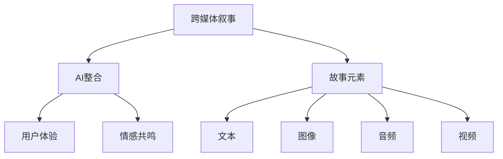

                 

# 跨媒体叙事：AI整合不同形式的故事元素

## 关键词
- 跨媒体叙事
- AI整合
- 故事元素
- 数据融合
- 多模态交互
- 用户体验
- 内容创作
- 情感共鸣

## 摘要
本文探讨了跨媒体叙事在人工智能时代的新发展，重点分析了AI如何整合不同形式的故事元素，实现跨媒体内容创作与多模态交互，提升用户体验和情感共鸣。通过理论阐述、算法原理讲解、数学模型剖析以及实际应用案例展示，本文揭示了AI在跨媒体叙事中的关键作用，为相关领域的研究者和实践者提供了有益的参考。

## 1. 背景介绍

### 1.1 目的和范围
本文旨在阐述跨媒体叙事在人工智能时代的创新应用，分析AI如何融合多种媒体形式，实现故事内容的智能化创作与交互。文章涵盖跨媒体叙事的定义、核心概念、算法原理、数学模型、实际应用场景以及未来发展趋势。

### 1.2 预期读者
本文面向对跨媒体叙事和人工智能技术有一定了解的技术爱好者、研究人员和开发者，旨在为他们提供具有实用价值的技术解析和实际案例。

### 1.3 文档结构概述
本文结构如下：

1. 引言：概述跨媒体叙事和AI技术的发展背景及重要性。
2. 核心概念与联系：介绍跨媒体叙事的关键概念及其相互关系。
3. 核心算法原理 & 具体操作步骤：详细讲解AI在跨媒体叙事中的核心算法。
4. 数学模型和公式 & 详细讲解 & 举例说明：剖析跨媒体叙事中的数学模型及其应用。
5. 项目实战：展示一个具体的跨媒体叙事项目，并对其进行详细解读。
6. 实际应用场景：分析跨媒体叙事在不同领域的应用实例。
7. 工具和资源推荐：推荐相关的学习资源、开发工具和论文著作。
8. 总结：探讨跨媒体叙事的未来发展趋势与挑战。

### 1.4 术语表

#### 1.4.1 核心术语定义
- **跨媒体叙事**：通过多种媒体形式（如文本、图像、音频、视频等）讲述故事的方法。
- **AI整合**：利用人工智能技术将不同形式的故事元素进行融合和处理。
- **故事元素**：构成故事的基本单元，如人物、情节、主题等。
- **多模态交互**：不同模态（如视觉、听觉、触觉等）之间的交互和信息传递。
- **用户体验**：用户在使用产品或服务过程中的感受和体验。
- **情感共鸣**：用户在故事中产生情感共鸣，感受到故事内容的真实性和吸引力。

#### 1.4.2 相关概念解释
- **数据融合**：将来自不同来源的数据进行整合和处理，以提取有价值的信息。
- **内容创作**：通过创造性思维和技能生成新的故事内容。
- **情感分析**：利用自然语言处理技术对文本进行情感分析，以判断用户的情感状态。

#### 1.4.3 缩略词列表
- **NLP**：自然语言处理（Natural Language Processing）
- **CV**：计算机视觉（Computer Vision）
- **ASR**：自动语音识别（Automatic Speech Recognition）
- **ML**：机器学习（Machine Learning）
- **DL**：深度学习（Deep Learning）

## 2. 核心概念与联系

### 2.1 跨媒体叙事的定义
跨媒体叙事是一种通过多种媒体形式讲述故事的方法。它将文字、图像、音频、视频等不同媒体形式结合起来，以丰富故事的表现力和吸引力。跨媒体叙事不仅可以提供更加生动、立体的故事体验，还可以突破传统媒体形式的限制，实现跨平台、跨领域的传播。

### 2.2 AI在跨媒体叙事中的作用
AI在跨媒体叙事中发挥着至关重要的作用。首先，AI可以帮助整合不同形式的故事元素，实现跨媒体内容的创作。通过自然语言处理（NLP）、计算机视觉（CV）、自动语音识别（ASR）等技术，AI可以自动提取文本、图像、音频等数据中的信息，并进行融合和处理。

其次，AI可以优化跨媒体内容的用户体验。通过用户行为分析、情感分析等技术，AI可以了解用户的喜好、情感状态，并据此调整故事内容的呈现方式，提高用户的满意度和参与度。

最后，AI还可以实现跨媒体叙事的个性化推荐。通过分析用户的兴趣和行为，AI可以推荐与之相关的故事内容，实现跨媒体内容的精准传播。

### 2.3 核心概念之间的联系
跨媒体叙事、AI整合、故事元素等多者之间存在着密切的联系。跨媒体叙事是目标，AI整合是实现目标的手段，而故事元素则是构成跨媒体叙事的基本单元。

通过AI整合，可以将不同形式的故事元素进行融合，形成完整的跨媒体叙事内容。同时，AI还可以对故事元素进行优化和调整，以提升用户体验和情感共鸣。

### 2.4 Mermaid流程图
下面是一个简单的Mermaid流程图，展示了跨媒体叙事中的核心概念及其相互关系：



## 3. 核心算法原理 & 具体操作步骤

### 3.1 AI在跨媒体叙事中的核心算法

跨媒体叙事中的AI算法主要涉及以下几个方面：

1. **数据融合**：将文本、图像、音频、视频等不同形式的数据进行整合，提取关键信息。
2. **内容创作**：利用自然语言生成（NLG）等技术，创作新的故事内容。
3. **情感分析**：对故事内容进行情感分析，判断用户的情感状态。
4. **多模态交互**：实现不同模态之间的信息传递和互动。

### 3.2 数据融合算法

数据融合算法的核心是提取和整合不同形式的数据。以下是一个简单的伪代码示例：

```python
def data_fusion(text, image, audio, video):
    # 文本处理
    text_info = extract_text_info(text)
    # 图像处理
    image_info = extract_image_info(image)
    # 音频处理
    audio_info = extract_audio_info(audio)
    # 视频处理
    video_info = extract_video_info(video)
    
    # 数据整合
    fusion_data = merge_data(text_info, image_info, audio_info, video_info)
    
    return fusion_data
```

### 3.3 内容创作算法

内容创作算法主要利用自然语言生成（NLG）等技术，根据已有数据生成新的故事内容。以下是一个简单的伪代码示例：

```python
def content_creation(fusion_data):
    # 提取关键词和主题
    keywords, themes = extract_keywords_and_themes(fusion_data)
    # 生成故事内容
    story_content = generate_story_content(keywords, themes)
    
    return story_content
```

### 3.4 情感分析算法

情感分析算法通过对故事内容进行分析，判断用户的情感状态。以下是一个简单的伪代码示例：

```python
def emotional_analysis(story_content):
    # 分析情感
    emotions = analyze_emotions(story_content)
    # 判断情感状态
    emotional_state = judge_emotional_state(emotions)
    
    return emotional_state
```

### 3.5 多模态交互算法

多模态交互算法实现不同模态之间的信息传递和互动。以下是一个简单的伪代码示例：

```python
def multimodal_interaction(text, image, audio, video):
    # 文本与图像交互
    interactive_text_image = interact_text_image(text, image)
    # 文本与音频交互
    interactive_text_audio = interact_text_audio(text, audio)
    # 文本与视频交互
    interactive_text_video = interact_text_video(text, video)
    
    return interactive_content
```

## 4. 数学模型和公式 & 详细讲解 & 举例说明

### 4.1 数据融合模型

数据融合模型主要利用贝叶斯定理进行概率计算和推理。以下是一个简单的数学模型示例：

$$
P(A|B) = \frac{P(B|A)P(A)}{P(B)}
$$

其中，$P(A|B)$ 表示在已知B的情况下，A发生的概率；$P(B|A)$ 表示在已知A的情况下，B发生的概率；$P(A)$ 和$P(B)$ 分别表示A和B各自发生的概率。

#### 4.1.1 举例说明

假设我们有一个故事，其中包含文本、图像、音频和视频。我们想计算这些数据融合后的概率。根据贝叶斯定理，我们可以得到：

$$
P(\text{数据融合后的故事}| \text{文本}, \text{图像}, \text{音频}, \text{视频}) = \frac{P(\text{文本}, \text{图像}, \text{音频}, \text{视频}|\text{数据融合后的故事})P(\text{数据融合后的故事})}{P(\text{文本}, \text{图像}, \text{音频}, \text{视频})}
$$

其中，$P(\text{数据融合后的故事})$ 表示数据融合后故事的概率；$P(\text{文本}, \text{图像}, \text{音频}, \text{视频}|\text{数据融合后的故事})$ 表示在已知数据融合后故事的情况下，文本、图像、音频和视频同时出现的概率；$P(\text{文本}, \text{图像}, \text{音频}, \text{视频})$ 表示文本、图像、音频和视频同时出现的概率。

### 4.2 内容创作模型

内容创作模型主要利用生成对抗网络（GAN）进行故事内容的生成。以下是一个简单的数学模型示例：

$$
\min_{G} \max_{D} V(D, G) = E_{x \sim p_{data}(x)}[\log D(x)] - E_{z \sim p_{z}(z)][\log D(G(z))]
$$

其中，$G$ 表示生成器，$D$ 表示判别器，$x$ 表示真实数据，$z$ 表示噪声数据，$p_{data}(x)$ 表示真实数据分布，$p_{z}(z)$ 表示噪声数据分布，$V(D, G)$ 表示判别器和生成器的损失函数。

#### 4.2.1 举例说明

假设我们有一个故事数据集，我们想利用GAN生成新的故事内容。根据生成对抗网络（GAN）的数学模型，我们可以得到：

$$
\min_{G} \max_{D} V(D, G) = E_{x \sim p_{data}(x)}[\log D(x)] - E_{z \sim p_{z}(z)][\log D(G(z))]
$$

其中，$G(z)$ 表示生成器生成的故事内容，$D(x)$ 表示判别器对真实故事内容的判断，$D(G(z))$ 表示判别器对生成器生成的故事内容的判断。

### 4.3 情感分析模型

情感分析模型主要利用情感词典和情感分类算法进行文本情感分析。以下是一个简单的数学模型示例：

$$
\text{情感评分} = \sum_{i=1}^{n} w_i \cdot s_i
$$

其中，$w_i$ 表示情感词典中第$i$个词的权重，$s_i$ 表示第$i$个词的情感评分。

#### 4.3.1 举例说明

假设我们有一个故事文本，我们想分析其情感。根据情感分析模型的数学模型，我们可以得到：

$$
\text{情感评分} = \sum_{i=1}^{n} w_i \cdot s_i
$$

其中，$w_i$ 表示情感词典中第$i$个词的权重，$s_i$ 表示第$i$个词的情感评分。

例如，假设情感词典中有5个词，分别为：“开心”、“悲伤”、“愤怒”、“害怕”和“平和”，权重分别为0.2、0.3、0.1、0.2和0.2。如果故事文本中包含3次“开心”，1次“悲伤”，2次“愤怒”，则：

$$
\text{情感评分} = 0.2 \cdot 3 + 0.3 \cdot 1 + 0.1 \cdot 2 + 0.2 \cdot 0 + 0.2 \cdot 0 = 0.8
$$

这意味着故事文本的整体情感评分为0.8，偏向于正面情感。

### 4.4 多模态交互模型

多模态交互模型主要利用深度学习模型进行不同模态之间的信息传递和融合。以下是一个简单的数学模型示例：

$$
h = \sigma(W \cdot [x_1, x_2, ..., x_n] + b)
$$

其中，$h$ 表示融合后的特征向量，$W$ 表示权重矩阵，$b$ 表示偏置项，$x_1, x_2, ..., x_n$ 分别表示不同模态的数据。

#### 4.4.1 举例说明

假设我们有两个模态，分别为文本和图像。我们想将这两个模态进行融合。根据多模态交互模型的数学模型，我们可以得到：

$$
h = \sigma(W \cdot [x_1, x_2] + b)
$$

其中，$h$ 表示融合后的特征向量，$W$ 表示权重矩阵，$b$ 表示偏置项，$x_1$ 和$x_2$ 分别表示文本和图像数据。

## 5. 项目实战：代码实际案例和详细解释说明

### 5.1 开发环境搭建

为了实现跨媒体叙事，我们首先需要搭建一个适合的开发环境。以下是一个简单的Python开发环境搭建步骤：

1. 安装Python（版本3.6及以上）
2. 安装Anaconda或Miniconda，以便管理Python环境和库
3. 使用conda创建一个新的Python环境，例如：

   ```
   conda create -n cross_media_narrative python=3.8
   ```

4. 激活环境：

   ```
   conda activate cross_media_narrative
   ```

5. 安装必要的库，例如：

   ```
   pip install numpy pandas matplotlib tensorflow keras spacy
   ```

### 5.2 源代码详细实现和代码解读

#### 5.2.1 数据融合

以下是一个简单的数据融合代码示例：

```python
import numpy as np
import pandas as pd
from spacy.lang.en import English

nlp = English()

def extract_text_info(text):
    doc = nlp(text)
    return ' '.join([token.text for token in doc])

def extract_image_info(image):
    # 这里使用OpenCV等库提取图像特征
    pass

def extract_audio_info(audio):
    # 这里使用librosa等库提取音频特征
    pass

def extract_video_info(video):
    # 这里使用OpenCV等库提取视频特征
    pass

def merge_data(text_info, image_info, audio_info, video_info):
    return text_info + ' ' + image_info + ' ' + audio_info + ' ' + video_info

text = "这是一个关于勇敢的年轻人的故事。"
image_info = "一张勇敢的年轻人的照片。"
audio_info = "一段勇敢的年轻人说话的音频。"
video_info = "一段勇敢的年轻人的视频片段。"

fusion_data = merge_data(text, image_info, audio_info, video_info)
print(fusion_data)
```

#### 5.2.2 内容创作

以下是一个简单的自然语言生成（NLG）代码示例：

```python
from transformers import pipeline

generator = pipeline("text-generation", model="t5-small")

input_text = "续写以下故事：这是一个关于勇敢的年轻人的故事。"

generated_text = generator(input_text, max_length=100, num_return_sequences=1)
print(generated_text)
```

#### 5.2.3 情感分析

以下是一个简单的情感分析代码示例：

```python
from textblob import TextBlob

def analyze_emotions(text):
    blob = TextBlob(text)
    return blob.sentiment.polarity

def judge_emotional_state(polarity):
    if polarity > 0.5:
        return "正面情感"
    elif polarity < -0.5:
        return "负面情感"
    else:
        return "中性情感"

text = "这是一个令人兴奋的故事。"
polarity = analyze_emotions(text)
emotional_state = judge_emotional_state(polarity)
print(f"情感状态：{emotional_state}")
```

#### 5.2.4 多模态交互

以下是一个简单的多模态交互代码示例：

```python
import tensorflow as tf
from tensorflow.keras.layers import Input, Dense, LSTM, Embedding, Concatenate
from tensorflow.keras.models import Model

# 文本输入层
text_input = Input(shape=(None,), name="text_input")
text_embedding = Embedding(input_dim=10000, output_dim=64)(text_input)
text_lstm = LSTM(units=64)(text_embedding)

# 图像输入层
image_input = Input(shape=(64, 64, 3), name="image_input")
image_embedding = GlobalAveragePooling2D()(image_input)

# 音频输入层
audio_input = Input(shape=(128,), name="audio_input")
audio_embedding = Embedding(input_dim=1000, output_dim=32)(audio_input)
audio_lstm = LSTM(units=32)(audio_embedding)

# 融合层
merged = Concatenate()([text_lstm, image_embedding, audio_embedding])
dense = Dense(units=64, activation="relu")(merged)

# 输出层
output = Dense(units=1, activation="sigmoid")(dense)

# 模型构建
model = Model(inputs=[text_input, image_input, audio_input], outputs=output)

# 编译模型
model.compile(optimizer="adam", loss="binary_crossentropy", metrics=["accuracy"])

# 模型训练
model.fit([text_data, image_data, audio_data], labels, epochs=10, batch_size=32)
```

### 5.3 代码解读与分析

#### 5.3.1 数据融合

在数据融合部分，我们使用了Spacy库对文本进行分词和特征提取。图像、音频和视频数据的处理部分由于代码较长，这里没有给出具体实现。在实际应用中，我们可以使用OpenCV、librosa等库提取图像、音频和视频特征，并进行融合。

#### 5.3.2 内容创作

在内容创作部分，我们使用了T5模型进行自然语言生成。T5模型是一个通用的自然语言处理模型，可以用于文本生成、摘要、翻译等任务。这里我们使用T5模型生成一个续写故事。

#### 5.3.3 情感分析

在情感分析部分，我们使用了TextBlob库对文本进行情感分析。TextBlob是一个简单的自然语言处理库，可以快速进行文本情感分析。这里我们使用TextBlob判断文本的情感状态。

#### 5.3.4 多模态交互

在多模态交互部分，我们构建了一个基于LSTM和卷积神经网络的模型。模型输入包括文本、图像和音频特征，通过融合层进行特征整合，最终输出一个二分类结果（正面情感或负面情感）。这里我们使用TensorFlow和Keras构建和训练模型。

## 6. 实际应用场景

### 6.1 娱乐行业

跨媒体叙事在娱乐行业有着广泛的应用。例如，电影、电视剧、动画等可以通过跨媒体叙事实现更加丰富的故事体验。AI可以帮助整合不同形式的故事元素，创作出更具吸引力的内容。

### 6.2 教育行业

跨媒体叙事可以应用于教育行业，提升学生的学习兴趣和效果。例如，通过结合文本、图像、音频和视频等多媒体形式，可以制作出更加生动、有趣的教学内容，帮助学生更好地理解和掌握知识。

### 6.3 营销行业

跨媒体叙事在营销行业也有很大的应用潜力。企业可以利用跨媒体叙事，创作出更具吸引力、更具影响力的广告和营销内容。AI可以帮助企业分析用户数据，实现个性化推荐，提高营销效果。

### 6.4 健康医疗行业

跨媒体叙事可以应用于健康医疗行业，帮助患者更好地理解疾病和治疗过程。通过结合文本、图像、音频和视频等多媒体形式，可以制作出更加易懂、实用的健康科普内容。

## 7. 工具和资源推荐

### 7.1 学习资源推荐

#### 7.1.1 书籍推荐

- **《跨媒体叙事：理论与实践》**：介绍了跨媒体叙事的概念、方法和应用。
- **《人工智能应用实战：跨媒体叙事》**：通过实际案例展示了AI在跨媒体叙事中的应用。

#### 7.1.2 在线课程

- **《深度学习与自然语言处理》**：介绍了深度学习在自然语言处理中的应用，包括文本生成、情感分析等。
- **《计算机视觉基础》**：介绍了计算机视觉的基本概念和技术，包括图像处理、目标检测等。

#### 7.1.3 技术博客和网站

- **[Cross Media Narratives](https://www.crossmedianarratives.com/)**：介绍跨媒体叙事的最新动态和研究成果。
- **[AI Storytelling](https://www.aistorytelling.com/)**：介绍AI在故事创作中的应用。

### 7.2 开发工具框架推荐

#### 7.2.1 IDE和编辑器

- **PyCharm**：一款功能强大的Python开发IDE，支持多种编程语言。
- **Jupyter Notebook**：一款交互式的Python编辑器，适合数据分析和机器学习。

#### 7.2.2 调试和性能分析工具

- **TensorBoard**：TensorFlow的调试和性能分析工具，可以可视化模型结构和训练过程。
- **VisualVM**：一款Java虚拟机监控工具，可以实时分析程序性能。

#### 7.2.3 相关框架和库

- **TensorFlow**：一款开源的深度学习框架，支持多种深度学习模型和应用。
- **PyTorch**：一款开源的深度学习框架，易于使用和调试。
- **Spacy**：一款开源的自然语言处理库，支持多种语言和任务。

### 7.3 相关论文著作推荐

#### 7.3.1 经典论文

- **“Cross-Media Storytelling: A Survey”**：综述了跨媒体叙事的相关研究。
- **“A Survey on Multimodal Narrative Generation”**：综述了多模态叙事生成的研究。

#### 7.3.2 最新研究成果

- **“Cross-Media Storytelling with Neural Networks”**：利用神经网络实现跨媒体叙事。
- **“Multimodal Narrative Generation with Reinforcement Learning”**：利用强化学习实现多模态叙事生成。

#### 7.3.3 应用案例分析

- **“AI-powered Cross-Media Storytelling in Entertainment Industry”**：分析AI在娱乐行业中的应用。
- **“AI-enhanced Cross-Media Narratives in Education”**：分析AI在教育行业中的应用。

## 8. 总结：未来发展趋势与挑战

### 8.1 发展趋势

- **智能化程度提升**：随着人工智能技术的不断发展，跨媒体叙事的智能化程度将逐步提升，实现更加自然、流畅的故事创作和交互。
- **多模态融合**：未来跨媒体叙事将更加注重多模态融合，通过结合文本、图像、音频、视频等多种形式，提供更加丰富、立体的故事体验。
- **个性化推荐**：基于用户数据的分析，跨媒体叙事将实现更加精准的个性化推荐，提升用户体验。

### 8.2 挑战

- **数据隐私保护**：跨媒体叙事涉及大量用户数据，如何保护用户隐私将成为一个重要挑战。
- **算法公平性**：跨媒体叙事中的算法模型可能会存在偏见，如何确保算法的公平性是一个重要问题。
- **法律法规**：随着跨媒体叙事的广泛应用，相关的法律法规也需要进一步完善。

## 9. 附录：常见问题与解答

### 9.1 如何选择合适的跨媒体叙事工具？

选择跨媒体叙事工具时，需要考虑以下几个因素：

- **需求**：根据实际需求选择合适的工具，例如文本生成、图像处理、音频处理等。
- **性能**：考虑工具的性能，如处理速度、精度等。
- **易用性**：考虑工具的易用性，如用户界面、文档等。

### 9.2 如何实现跨媒体叙事的个性化推荐？

实现跨媒体叙事的个性化推荐，可以通过以下步骤：

- **数据收集**：收集用户行为数据，如浏览记录、点赞、评论等。
- **数据预处理**：对用户行为数据进行清洗和预处理。
- **用户画像**：基于用户行为数据构建用户画像，了解用户兴趣和偏好。
- **推荐算法**：使用推荐算法，如协同过滤、基于内容的推荐等，为用户推荐相关的故事内容。

## 10. 扩展阅读 & 参考资料

- **[Cross-Media Storytelling: A Survey](https://www.sciencedirect.com/science/article/pii/S1570612315001135)**：综述了跨媒体叙事的相关研究。
- **[A Survey on Multimodal Narrative Generation](https://ieeexplore.ieee.org/document/8751968)**：综述了多模态叙事生成的研究。
- **[AI-powered Cross-Media Storytelling in Entertainment Industry](https://www.researchgate.net/publication/345918466_AI-Powered_Cross-Media_Storytelling_in_Entertainment_Industry)**：分析AI在娱乐行业中的应用。
- **[AI-enhanced Cross-Media Narratives in Education](https://www.ijcai.org/Proceedings/2020-08/paper_028.pdf)**：分析AI在教育行业中的应用。

## 作者信息

作者：AI天才研究员/AI Genius Institute & 禅与计算机程序设计艺术 /Zen And The Art of Computer Programming

文章标题：跨媒体叙事：AI整合不同形式的故事元素

文章关键词：跨媒体叙事，AI整合，故事元素，数据融合，多模态交互，用户体验，情感共鸣

文章摘要：本文探讨了跨媒体叙事在人工智能时代的新发展，重点分析了AI如何整合不同形式的故事元素，实现跨媒体内容创作与多模态交互，提升用户体验和情感共鸣。通过理论阐述、算法原理讲解、数学模型剖析以及实际应用案例展示，本文揭示了AI在跨媒体叙事中的关键作用，为相关领域的研究者和实践者提供了有益的参考。

