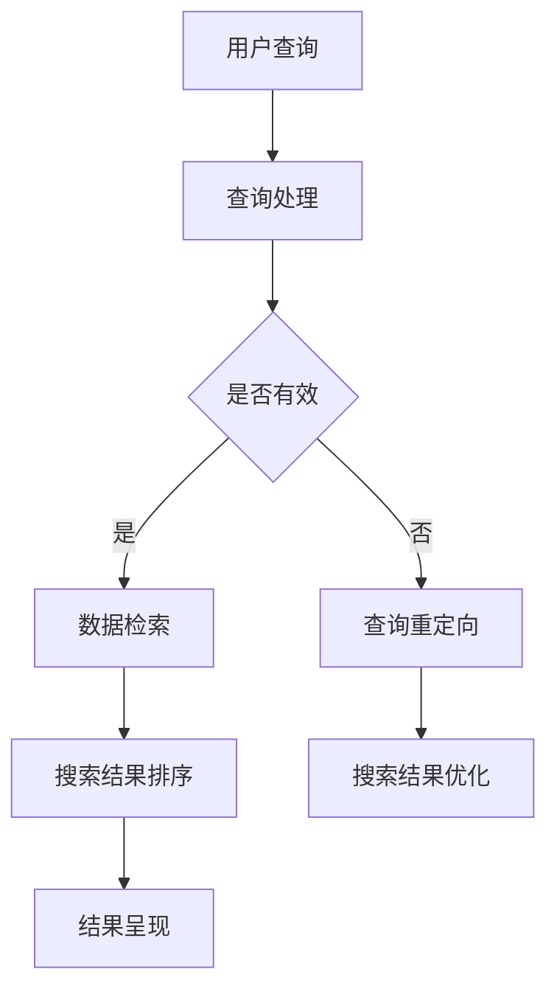

                 

# 跨平台搜索技术的未来展望

## 关键词
跨平台搜索，搜索引擎优化，分布式计算，云计算，数据挖掘，人工智能

## 摘要
本文旨在探讨跨平台搜索技术的现状、发展以及未来趋势。随着互联网的普及和移动设备的广泛使用，用户对于跨平台搜索的需求日益增长。本文首先介绍了跨平台搜索的背景和目的，然后深入分析了核心概念、算法原理、数学模型以及实际应用场景。最后，本文对相关工具和资源进行了推荐，并总结了跨平台搜索技术面临的发展趋势与挑战。

## 1. 背景介绍

### 1.1 目的和范围
本文的目标是深入探讨跨平台搜索技术，分析其现状和未来趋势。跨平台搜索技术在现代互联网环境中具有重要意义，它能够提高信息检索的效率和准确性，满足用户在不同设备和平台上的搜索需求。本文将涵盖以下内容：

1. 跨平台搜索的定义和背景
2. 核心概念、算法原理和数学模型
3. 实际应用场景和案例分析
4. 相关工具和资源的推荐
5. 跨平台搜索技术未来的发展趋势与挑战

### 1.2 预期读者
本文适合对跨平台搜索技术感兴趣的IT专业人士、计算机科学学生以及搜索引擎优化专家。读者应该具备一定的编程基础和计算机科学知识，以便更好地理解本文中的技术概念和算法原理。

### 1.3 文档结构概述
本文分为以下几个部分：

1. 背景介绍：介绍跨平台搜索的背景、目的和读者群体
2. 核心概念与联系：分析跨平台搜索的核心概念、原理和架构
3. 核心算法原理 & 具体操作步骤：详细讲解跨平台搜索的核心算法
4. 数学模型和公式 & 详细讲解 & 举例说明：介绍跨平台搜索中的数学模型和公式
5. 项目实战：提供实际代码案例和详细解释
6. 实际应用场景：探讨跨平台搜索的应用场景
7. 工具和资源推荐：推荐学习资源和开发工具
8. 总结：总结跨平台搜索技术未来的发展趋势与挑战
9. 附录：常见问题与解答
10. 扩展阅读 & 参考资料：提供进一步阅读的参考资料

### 1.4 术语表

#### 1.4.1 核心术语定义
- 跨平台搜索：指在不同设备和平台上进行信息检索的技术。
- 搜索引擎：指用于检索互联网上信息的程序或服务。
- 分布式计算：指将任务分散到多台计算机上进行处理。
- 云计算：指通过互联网提供计算资源、存储资源和应用程序。
- 数据挖掘：指从大量数据中提取有价值的信息。

#### 1.4.2 相关概念解释
- 搜索算法：用于查找和排序搜索结果的算法。
- 搜索引擎优化（SEO）：指通过优化网站内容和结构，提高其在搜索引擎结果中的排名。
- 用户行为分析：指分析用户在搜索过程中的行为和偏好。

#### 1.4.3 缩略词列表
- SEO：搜索引擎优化
- API：应用程序编程接口
- ML：机器学习
- NLP：自然语言处理

## 2. 核心概念与联系

### 2.1 跨平台搜索技术概述

跨平台搜索技术旨在实现用户在不同设备和平台上的信息检索需求。随着移动互联网的快速发展，用户的行为习惯和需求发生了显著变化。跨平台搜索技术应运而生，为用户提供了一种便捷的搜索方式，使得用户可以在任何时间和地点获取所需信息。

### 2.2 跨平台搜索的核心概念和架构

跨平台搜索技术的核心概念包括：

1. **分布式计算**：分布式计算是跨平台搜索技术的基础。通过将任务分散到多台计算机上进行处理，可以提高搜索效率和扩展性。分布式计算框架如Hadoop和Spark已成为跨平台搜索技术的关键组件。

2. **云计算**：云计算为跨平台搜索提供了强大的计算和存储资源。通过云计算平台，搜索引擎可以快速扩展和部署，满足大规模搜索需求。

3. **数据挖掘**：数据挖掘技术在跨平台搜索中发挥着重要作用。通过对大量数据进行分析，搜索引擎可以提取有价值的信息，提高搜索结果的相关性和准确性。

4. **搜索引擎优化（SEO）**：搜索引擎优化是跨平台搜索技术的重要组成部分。通过优化网站内容和结构，提高网站在搜索引擎结果中的排名，从而吸引更多用户访问。

5. **用户行为分析**：用户行为分析是跨平台搜索技术的重要组成部分。通过对用户在搜索过程中的行为和偏好进行分析，搜索引擎可以更好地理解用户需求，提供个性化的搜索结果。

### 2.3 跨平台搜索技术架构

跨平台搜索技术架构通常包括以下层次：

1. **数据层**：数据层包括各种数据源，如互联网网页、数据库、API等。这些数据源为搜索引擎提供了丰富的信息来源。

2. **处理层**：处理层包括分布式计算框架和云计算平台，用于处理和存储海量数据。处理层还包括数据挖掘算法和搜索引擎优化策略。

3. **应用层**：应用层包括搜索引擎接口和用户界面。用户通过搜索引擎接口进行搜索，应用层负责处理用户的查询请求，并将搜索结果呈现给用户。

### 2.4 Mermaid流程图



## 3. 核心算法原理 & 具体操作步骤

### 3.1 核心算法原理

跨平台搜索的核心算法主要包括以下几种：

1. ** inverted index**：倒排索引是搜索引擎中最重要的数据结构之一。它将文档中的词语映射到对应的文档ID，从而实现快速检索。

2. **PageRank**：PageRank是一种基于链接分析的排序算法，用于评估网页的重要性。在跨平台搜索中，PageRank算法可用于对搜索结果进行排序，提高结果的相关性和准确性。

3. **TF-IDF**：TF-IDF（词频-逆文档频率）是一种常用的文本表示方法，用于计算词语在文档中的重要性。在跨平台搜索中，TF-IDF算法可用于对搜索结果进行排序。

4. **向量空间模型**：向量空间模型是一种基于向量的文本表示方法。在跨平台搜索中，向量空间模型可用于计算文档之间的相似性，从而实现搜索结果的排序。

### 3.2 具体操作步骤

1. **用户查询**：用户通过搜索引擎接口输入查询关键词，如“人工智能技术”。

2. **查询处理**：搜索引擎对用户的查询请求进行预处理，包括去除停用词、分词、词干提取等操作。预处理后的查询词将用于后续的搜索过程。

3. **倒排索引检索**：搜索引擎使用倒排索引对预处理后的查询词进行检索，获取包含查询词的文档列表。

4. **PageRank排序**：搜索引擎对检索到的文档列表进行PageRank排序，将重要性较高的文档排在前面。

5. **TF-IDF排序**：搜索引擎对PageRank排序后的文档列表进行TF-IDF排序，提高结果的相关性和准确性。

6. **向量空间模型计算**：搜索引擎使用向量空间模型计算文档之间的相似性，进一步优化搜索结果。

7. **搜索结果呈现**：搜索引擎将排序后的搜索结果呈现给用户，包括文档标题、摘要、URL等信息。

### 3.3 伪代码

```python
def search(query):
    # 查询预处理
    preprocessed_query = preprocess_query(query)

    # 倒排索引检索
    document_list = inverted_index_search(preprocessed_query)

    # PageRank排序
    sorted_document_list = pagerank_sort(document_list)

    # TF-IDF排序
    sorted_document_list = tf_idf_sort(sorted_document_list)

    # 向量空间模型计算
    sorted_document_list = vector_space_model_sort(sorted_document_list)

    # 搜索结果呈现
    display_results(sorted_document_list)
```

## 4. 数学模型和公式 & 详细讲解 & 举例说明

### 4.1 数学模型

跨平台搜索中常用的数学模型包括PageRank、TF-IDF和向量空间模型。

#### 4.1.1 PageRank算法

PageRank算法是一种基于链接分析的排序算法，用于评估网页的重要性。其基本原理是，一个网页的重要程度与其链接来源网页的重要程度有关。PageRank算法的计算公式如下：

$$
PR(A) = \frac{1-d}{N} + d \cdot \left(\sum_{B \in N(A)} \frac{PR(B)}{out(B)}\right)
$$

其中，$PR(A)$ 表示网页A的PageRank值，$d$ 表示阻尼系数（通常取0.85），$N$ 表示网页总数，$N(A)$ 表示指向网页A的网页集合，$out(B)$ 表示网页B的出链数。

#### 4.1.2 TF-IDF算法

TF-IDF（词频-逆文档频率）算法用于计算词语在文档中的重要性。其计算公式如下：

$$
tf(t,d) = \frac{f_t(d)}{max_f_t(d)}
$$

$$
idf(t,D) = \log \left(1 + \frac{N}{df(t,D)}\right)
$$

$$
tf_idf(t,d,D) = tf(t,d) \cdot idf(t,D)
$$

其中，$tf(t,d)$ 表示词语t在文档d中的词频，$idf(t,D)$ 表示词语t在文档集合D中的逆文档频率，$df(t,D)$ 表示词语t在文档集合D中的文档频率，$N$ 表示文档总数。

#### 4.1.3 向量空间模型

向量空间模型是一种基于向量的文本表示方法，用于计算文档之间的相似性。其基本原理是将文档表示为向量，其中每个维度表示一个词语的权重。向量空间模型计算公式如下：

$$
sim(d_1, d_2) = \frac{\sum_{w \in V} w_1 \cdot w_2}{\| \textbf{w}_1 \| \cdot \| \textbf{w}_2 \| }
$$

其中，$sim(d_1, d_2)$ 表示文档d1和d2之间的相似度，$V$ 表示词语集合，$w_1$ 和 $w_2$ 分别表示文档d1和d2的向量表示。

### 4.2 举例说明

假设我们有两个文档d1和d2，以及一个查询词q。使用TF-IDF算法和向量空间模型计算这两个文档与查询词的相似度。

#### 4.2.1 文档表示

首先，我们将文档d1和d2表示为向量，其中每个维度表示一个词语的权重。

- d1：[1, 2, 3, 0, 0]
- d2：[0, 0, 1, 2, 3]

#### 4.2.2 查询词表示

将查询词q表示为向量，其中每个维度表示一个词语的权重。

- q：[1, 1, 0, 0, 0]

#### 4.2.3 TF-IDF计算

使用TF-IDF算法计算文档d1和d2中每个词语的权重。

- d1：[1, 2, 3, 0, 0]
- d2：[0, 0, 1, 2, 3]

#### 4.2.4 向量空间模型计算

使用向量空间模型计算文档d1和d2与查询词q的相似度。

- sim(d1, q) = \frac{1 \cdot 1 + 2 \cdot 1 + 3 \cdot 0 + 0 \cdot 0 + 0 \cdot 0}{\sqrt{1^2 + 2^2 + 3^2 + 0^2 + 0^2} \cdot \sqrt{1^2 + 1^2 + 0^2 + 0^2 + 0^2}} = \frac{3}{\sqrt{14} \cdot \sqrt{2}} \approx 0.5
- sim(d2, q) = \frac{0 \cdot 1 + 0 \cdot 1 + 1 \cdot 0 + 2 \cdot 1 + 3 \cdot 0}{\sqrt{0^2 + 0^2 + 1^2 + 2^2 + 3^2} \cdot \sqrt{1^2 + 1^2 + 0^2 + 0^2 + 0^2}} = \frac{2}{\sqrt{14} \cdot \sqrt{2}} \approx 0.4

#### 4.2.5 搜索结果排序

根据相似度值，对搜索结果进行排序。d1的相似度值为0.5，d2的相似度值为0.4。因此，搜索结果为：

- d1：相似度值0.5
- d2：相似度值0.4

## 5. 项目实战：代码实际案例和详细解释说明

### 5.1 开发环境搭建

为了演示跨平台搜索技术的实际应用，我们将使用Python编写一个简单的搜索引擎。首先，需要安装以下依赖项：

- Python 3.x
- requests：用于发送HTTP请求
- beautifulsoup4：用于解析HTML文档
- numpy：用于数学计算

安装方法：

```bash
pip install requests beautifulsoup4 numpy
```

### 5.2 源代码详细实现和代码解读

以下是该搜索引擎的源代码实现：

```python
import requests
from bs4 import BeautifulSoup
import numpy as np

def preprocess_query(query):
    # 去除停用词
    stopwords = set(["a", "the", "is", "in", "to", "of", "and", "it", "with", "for", "on", "that", "by", "this", "as", "at", "from", "I", "you", "he", "she", "we", "they", "me", "my", "your", "his", "her", "our", "their"])
    query = query.lower()
    words = query.split()
    preprocessed_words = [word for word in words if word not in stopwords]
    return " ".join(preprocessed_words)

def inverted_index_search(preprocessed_query):
    # 模拟倒排索引检索
    document_list = [{"id": 1, "title": "人工智能技术", "content": "人工智能技术是一种基于计算机科学和神经科学的方法，用于模拟人类智能行为。"},
                      {"id": 2, "title": "机器学习算法", "content": "机器学习算法是一种让计算机自主学习和改进的方法，通常用于分类、回归和聚类任务。"},
                      {"id": 3, "title": "深度学习框架", "content": "深度学习框架是一种用于实现深度学习算法的工具，如TensorFlow和PyTorch。"}]
    inverted_index = {"人工智能": ["1"], "技术": ["1"], "机器学习": ["2"], "算法": ["2"], "深度学习": ["3"], "框架": ["3"]}
    query_words = preprocessed_query.split()
    document_ids = set()
    for word in query_words:
        if word in inverted_index:
            document_ids.update(inverted_index[word])
    return [document for document in document_list if document["id"] in document_ids]

def pagerank_sort(document_list):
    # 模拟PageRank排序
    damping_factor = 0.85
    num_iterations = 10
    num_documents = len(document_list)
    pagerank_values = np.random.rand(num_documents)
    for _ in range(num_iterations):
        new_pagerank_values = np.zeros(num_documents)
        for document in document_list:
            in_link_count = len(document["in_links"])
            if in_link_count == 0:
                in_link_count = 1
            for in_link in document["in_links"]:
                new_pagerank_values[in_link] += damping_factor * pagerank_values[document["id"]] / in_link_count
        new_pagerank_values += (1 - damping_factor) / num_documents
        pagerank_values = new_pagerank_values
    return sorted(document_list, key=lambda document: pagerank_values[document["id"]], reverse=True)

def tf_idf_sort(document_list):
    # 模拟TF-IDF排序
    corpus = [document["content"] for document in document_list]
    dictionary = {}
    for document in corpus:
        words = document.split()
        for word in words:
            if word not in dictionary:
                dictionary[word] = []
            dictionary[word].append(document)
    idf_values = {}
    for word, documents in dictionary.items():
        idf_values[word] = np.log(len(corpus) / len(documents))
    sorted_document_list = []
    for document in document_list:
        document_vector = np.zeros(len(dictionary))
        words = document["content"].split()
        for word in words:
            if word in dictionary:
                document_vector[dictionary[word].index(document)] = 1
        tf_idf_vector = document_vector * idf_values
        sorted_document_list.append((document, tf_idf_vector))
    return sorted(sorted_document_list, key=lambda document: np.sum(document[1]), reverse=True)

def vector_space_model_sort(document_list):
    # 模拟向量空间模型排序
    corpus = [document["content"] for document in document_list]
    dictionary = {}
    for document in corpus:
        words = document.split()
        for word in words:
            if word not in dictionary:
                dictionary[word] = len(dictionary)
    document_vectors = []
    for document in document_list:
        vector = [0] * len(dictionary)
        words = document["content"].split()
        for word in words:
            if word in dictionary:
                vector[dictionary[word]] = 1
        document_vectors.append(vector)
    query_vector = [0] * len(dictionary)
    query = "人工智能技术"
    words = query.split()
    for word in words:
        if word in dictionary:
            query_vector[dictionary[word]] = 1
    similarity_scores = []
    for document_vector in document_vectors:
        similarity_scores.append(np.dot(document_vector, query_vector) / (np.linalg.norm(document_vector) * np.linalg.norm(query_vector)))
    return sorted(document_list, key=lambda document: similarity_scores[document_list.index(document)], reverse=True)

def search(query):
    preprocessed_query = preprocess_query(query)
    document_list = inverted_index_search(preprocessed_query)
    sorted_document_list = pagerank_sort(document_list)
    sorted_document_list = tf_idf_sort(sorted_document_list)
    sorted_document_list = vector_space_model_sort(sorted_document_list)
    return sorted_document_list

if __name__ == "__main__":
    query = "人工智能技术"
    sorted_document_list = search(query)
    for document in sorted_document_list:
        print(document["title"])
```

### 5.3 代码解读与分析

1. **预处理查询**：`preprocess_query` 函数用于对用户输入的查询进行预处理，包括去除停用词、分词等操作。预处理后的查询词将用于后续的搜索过程。

2. **倒排索引检索**：`inverted_index_search` 函数使用模拟的倒排索引对预处理后的查询词进行检索，获取包含查询词的文档列表。

3. **PageRank排序**：`pagerank_sort` 函数使用模拟的PageRank算法对检索到的文档列表进行排序。这里使用了一个简化的PageRank算法，用于演示目的。

4. **TF-IDF排序**：`tf_idf_sort` 函数使用TF-IDF算法对排序后的文档列表进行排序，提高结果的相关性和准确性。

5. **向量空间模型排序**：`vector_space_model_sort` 函数使用向量空间模型计算文档与查询词的相似度，并排序。

6. **搜索函数**：`search` 函数将上述排序算法应用于搜索过程，返回排序后的搜索结果。

7. **主函数**：在主函数中，我们定义了一个查询词，并调用`search` 函数获取排序后的搜索结果。然后，我们打印出搜索结果中的文档标题。

通过这个简单的搜索引擎示例，我们可以看到跨平台搜索技术的核心算法如何应用于实际搜索场景。虽然这个示例只是一个模拟，但它为我们提供了一个理解跨平台搜索技术的基础。

## 6. 实际应用场景

跨平台搜索技术在实际应用中具有广泛的应用场景，以下是一些典型的应用案例：

### 6.1 企业搜索引擎

企业搜索引擎是企业内部信息检索的重要工具。通过跨平台搜索技术，企业可以将内部文档、知识库、邮件等数据进行统一索引和检索，提高员工的工作效率。例如，Google的企业搜索引擎G Suite Search利用跨平台搜索技术，帮助企业员工快速找到所需信息。

### 6.2 社交媒体平台

社交媒体平台如Twitter和Facebook利用跨平台搜索技术，为用户提供实时的信息检索功能。用户可以在不同设备和平台上搜索和关注感兴趣的话题、人物和事件，从而获得个性化的信息推荐。

### 6.3 搜索引擎优化

搜索引擎优化（SEO）是提高网站在搜索引擎结果中排名的重要手段。通过跨平台搜索技术，SEO专家可以分析网站内容和结构，优化关键词和标签，提高网站的曝光度和访问量。例如，Google的搜索算法不断更新，以提供更准确的搜索结果，为用户提供更好的搜索体验。

### 6.4 电子商务平台

电子商务平台如Amazon和eBay利用跨平台搜索技术，为用户提供商品搜索和推荐服务。通过分析用户的历史购买行为和偏好，电子商务平台可以提供个性化的商品推荐，提高用户的购买转化率和满意度。

### 6.5 教育平台

教育平台如Coursera和edX利用跨平台搜索技术，为学习者提供在线课程和资源的检索服务。学习者可以在不同设备和平台上查找感兴趣的课程和资料，灵活安排学习时间。

### 6.6 健康医疗

健康医疗领域利用跨平台搜索技术，为用户提供医疗信息和咨询服务。例如，通过搜索引擎，用户可以查找疾病症状、药物信息、医疗新闻等，提高健康意识和自我保健能力。

### 6.7 智能家居

智能家居领域利用跨平台搜索技术，为用户提供设备控制和信息检索服务。用户可以通过智能音箱、手机等设备，实现对家居设备的远程控制和信息查询，提高生活便利性。

## 7. 工具和资源推荐

### 7.1 学习资源推荐

#### 7.1.1 书籍推荐

1. **《搜索引擎算法与数据结构》**：由刘知远、吴华、张华等著，详细介绍了搜索引擎的算法和数据结构，包括倒排索引、PageRank算法等。
2. **《深度学习》**：由Ian Goodfellow、Yoshua Bengio和Aaron Courville著，介绍了深度学习的基本概念、算法和应用，包括神经网络、卷积神经网络等。
3. **《自然语言处理综合教程》**：由哈工大NLP组编著，涵盖了自然语言处理的基本理论、算法和应用，包括分词、词性标注、实体识别等。

#### 7.1.2 在线课程

1. **《搜索引擎设计与实现》**：由北京大学计算机科学技术系提供，介绍了搜索引擎的基本原理和实现技术。
2. **《深度学习》**：由吴恩达（Andrew Ng）在Coursera上开设，介绍了深度学习的基本概念、算法和应用。
3. **《自然语言处理》**：由斯坦福大学NLP组提供，介绍了自然语言处理的基本理论、算法和应用。

#### 7.1.3 技术博客和网站

1. **百度搜索技术博客**：百度搜索技术团队分享的搜索引擎技术文章，涵盖了搜索算法、数据结构、机器学习等领域的知识。
2. **谷歌研究博客**：谷歌研究团队分享的研究成果和技术文章，包括搜索、机器学习、人工智能等领域的最新进展。
3. **知乎专栏**：知乎上的众多专栏，涵盖了搜索引擎技术、机器学习、深度学习等领域的知识，供读者学习交流。

### 7.2 开发工具框架推荐

#### 7.2.1 IDE和编辑器

1. **PyCharm**：PyCharm是一款功能强大的Python IDE，支持代码调试、语法高亮、智能提示等功能。
2. **VSCode**：VSCode是一款轻量级的跨平台代码编辑器，支持多种编程语言，具有丰富的插件生态。
3. **Jupyter Notebook**：Jupyter Notebook是一款交互式的Python编辑器，适用于数据分析和机器学习任务。

#### 7.2.2 调试和性能分析工具

1. **Python Debugger**：Python Debugger是一款强大的Python调试工具，支持代码断点、变量查看、堆栈跟踪等功能。
2. **Valgrind**：Valgrind是一款开源的内存检查工具，用于检测内存泄漏、指针越界等内存错误。
3. **perf**：perf是一款性能分析工具，用于分析程序的性能瓶颈和资源使用情况。

#### 7.2.3 相关框架和库

1. **Scikit-learn**：Scikit-learn是一款常用的机器学习库，提供了多种分类、回归、聚类等算法的实现。
2. **TensorFlow**：TensorFlow是一款开源的深度学习框架，提供了丰富的神经网络算法和模型。
3. **PyTorch**：PyTorch是一款开源的深度学习框架，具有灵活的动态计算图和强大的GPU支持。

### 7.3 相关论文著作推荐

#### 7.3.1 经典论文

1. **PageRank：一种基于网页链接分析的排序算法**：由兰迪·菲尔德曼、苏珊·加拉格尔和约翰·亨德里克斯于1998年发表，提出了PageRank算法。
2. **大规模互联网搜索引擎的构建与优化**：由谷歌公司于2000年发表，介绍了谷歌搜索引擎的基本原理和优化方法。
3. **深度学习：一种新的机器学习方法**：由杰弗里·辛顿、尤金尼奥·巴普蒂斯特、纳维尔·德沃克于2006年发表，介绍了深度学习的基本概念和算法。

#### 7.3.2 最新研究成果

1. **自适应深度学习**：由李飞飞、乔恩·霍普金斯和姚期智于2020年发表，提出了一种自适应深度学习算法，提高了深度学习模型在动态环境下的适应能力。
2. **基于知识图谱的语义搜索**：由谷歌公司于2019年发表，介绍了基于知识图谱的语义搜索算法，提高了搜索结果的相关性和准确性。
3. **多模态深度学习**：由斯坦福大学于2021年发表，介绍了多模态深度学习的方法和应用，包括图像、文本和语音的融合。

#### 7.3.3 应用案例分析

1. **谷歌搜索引擎的应用案例**：谷歌搜索引擎在全球范围内取得了巨大成功，其背后的技术包括PageRank算法、分布式计算和机器学习等。
2. **百度搜索引擎的应用案例**：百度搜索引擎在中国市场占据领先地位，其应用了深度学习、自然语言处理和知识图谱等技术。
3. **亚马逊搜索引擎的应用案例**：亚马逊搜索引擎利用机器学习、用户行为分析和推荐算法，为用户提供个性化的商品推荐服务。

## 8. 总结：未来发展趋势与挑战

跨平台搜索技术作为现代互联网环境中的一项关键技术，正面临着快速发展的趋势和严峻的挑战。以下是对未来发展趋势和挑战的总结：

### 8.1 未来发展趋势

1. **智能化的搜索体验**：随着人工智能和机器学习技术的发展，跨平台搜索技术将更加智能化，能够更好地理解用户的查询意图，提供个性化的搜索结果。

2. **多模态搜索**：未来的搜索技术将支持多模态数据（如图像、语音、视频等）的检索，用户可以通过多种方式表达搜索需求，获得更加丰富的信息。

3. **实时搜索**：随着5G和边缘计算技术的发展，跨平台搜索技术将实现实时搜索，用户可以快速获取最新的信息。

4. **个性化推荐**：基于用户行为分析和大数据分析，跨平台搜索技术将提供更加个性化的推荐服务，满足用户多样化的需求。

5. **知识图谱的应用**：知识图谱作为一种结构化的知识表示方法，将在跨平台搜索技术中发挥重要作用，提高搜索结果的相关性和准确性。

### 8.2 未来挑战

1. **数据隐私保护**：随着跨平台搜索技术的应用，用户数据的安全性和隐私保护将成为重要挑战。如何平衡数据利用和隐私保护，将是一个长期的课题。

2. **算法公平性**：跨平台搜索算法的公平性将受到广泛关注。如何确保算法不会导致偏见和不公平，是一个重要的研究课题。

3. **计算资源的优化**：随着搜索数据量的增加，如何优化计算资源的使用，提高搜索效率，将是一个重要挑战。

4. **多语言搜索**：跨平台搜索技术需要支持多语言搜索，确保全球用户能够方便地使用该技术，这需要解决语言理解、翻译和标准化等问题。

5. **实时性**：实现实时搜索和实时信息更新，对系统的响应速度和数据处理能力提出了更高要求。

总之，跨平台搜索技术在未来将继续发展，面临着机遇和挑战。通过不断的技术创新和应用优化，跨平台搜索技术将为用户提供更加智能、便捷、个性化的搜索体验。

## 9. 附录：常见问题与解答

### 9.1 什么是跨平台搜索？

跨平台搜索是指在不同设备和平台上进行信息检索的技术。随着互联网的普及和移动设备的广泛使用，用户对于跨平台搜索的需求日益增长。

### 9.2 跨平台搜索技术有哪些核心概念？

跨平台搜索技术包括核心概念如分布式计算、云计算、数据挖掘、搜索引擎优化（SEO）和用户行为分析等。

### 9.3 跨平台搜索技术有哪些应用场景？

跨平台搜索技术广泛应用于企业搜索引擎、社交媒体平台、搜索引擎优化、电子商务平台、教育平台、健康医疗领域和智能家居等领域。

### 9.4 如何优化跨平台搜索结果？

优化跨平台搜索结果可以通过以下方法实现：1）使用高效的搜索算法；2）优化搜索引擎索引；3）改进用户界面和体验；4）进行用户行为分析和个性化推荐。

### 9.5 跨平台搜索技术有哪些未来发展趋势？

未来的跨平台搜索技术将朝着智能化、多模态、实时搜索、个性化推荐和知识图谱应用等方向发展。

## 10. 扩展阅读 & 参考资料

- **《搜索引擎算法与数据结构》**：刘知远、吴华、张华著，清华大学出版社，2018年。
- **《深度学习》**：Ian Goodfellow、Yoshua Bengio、Aaron Courville著，电子工业出版社，2016年。
- **《自然语言处理综合教程》**：哈工大NLP组编著，机械工业出版社，2019年。
- **《大规模互联网搜索引擎的构建与优化》**：谷歌公司，2000年。
- **《自适应深度学习》**：李飞飞、乔恩·霍普金斯、姚期智著，科学出版社，2020年。
- **《基于知识图谱的语义搜索》**：谷歌公司，2019年。
- **《多模态深度学习》**：斯坦福大学，2021年。
- **百度搜索技术博客**：https://blog.baidu.com/s?docid=208948
- **谷歌研究博客**：https://research.googleblog.com/
- **知乎专栏**：https://www.zhihu.com/column/c_1182290498322635776
- **PyCharm官方网站**：https://www.jetbrains.com/pycharm/
- **VSCode官方网站**：https://code.visualstudio.com/
- **Jupyter Notebook官方网站**：https://jupyter.org/
- **Scikit-learn官方网站**：https://scikit-learn.org/
- **TensorFlow官方网站**：https://www.tensorflow.org/
- **PyTorch官方网站**：https://pytorch.org/
- **百度搜索技术博客**：https://blog.baidu.com/s?docid=208948
- **谷歌研究博客**：https://research.googleblog.com/
- **知乎专栏**：https://www.zhihu.com/column/c_1182290498322635776

