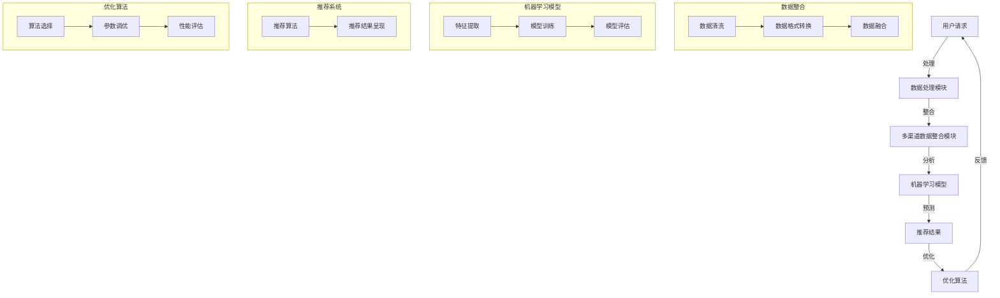

                 

# 跨平台搜索：AI如何整合多渠道数据，提供最优选择

> **关键词：** 跨平台搜索、人工智能、多渠道数据整合、推荐系统、优化算法

> **摘要：** 本文将探讨如何利用人工智能技术，整合来自不同渠道的大量数据，为用户提供精准、高效的跨平台搜索服务。通过介绍核心概念、算法原理、数学模型以及实战案例，本文旨在为IT专业人士和研究者提供对这一领域的深入理解。

## 1. 背景介绍

### 1.1 目的和范围

随着互联网的快速发展，用户在各个平台上产生和消费的数据量呈爆炸式增长。如何在众多信息中快速找到所需内容，成为了一个亟待解决的问题。跨平台搜索旨在解决这一问题，它不仅涉及单一平台的搜索，还需要整合来自不同平台的数据，为用户提供一个统一且高效的搜索体验。

本文将聚焦于探讨如何利用人工智能技术，特别是机器学习和深度学习算法，来整合多渠道数据，实现跨平台搜索。我们不仅会介绍相关算法原理和实现步骤，还会通过实际案例展示如何将理论应用到实践中。

### 1.2 预期读者

本文适合以下读者群体：

- 对人工智能和机器学习感兴趣的IT专业人士
- 想要深入了解跨平台搜索技术的研究生和博士生
- 对搜索引擎优化和推荐系统有深入研究的开发者

### 1.3 文档结构概述

本文结构如下：

1. **背景介绍**：介绍跨平台搜索的背景和目的。
2. **核心概念与联系**：通过Mermaid流程图展示核心概念和架构。
3. **核心算法原理 & 具体操作步骤**：详细讲解算法原理和实现步骤。
4. **数学模型和公式 & 详细讲解 & 举例说明**：介绍相关的数学模型和公式。
5. **项目实战：代码实际案例和详细解释说明**：通过具体案例展示代码实现。
6. **实际应用场景**：分析跨平台搜索的实际应用场景。
7. **工具和资源推荐**：推荐学习资源、开发工具和框架。
8. **总结：未来发展趋势与挑战**：总结当前技术和未来的发展方向。
9. **附录：常见问题与解答**：提供常见问题的解答。
10. **扩展阅读 & 参考资料**：提供相关文献和资料。

### 1.4 术语表

#### 1.4.1 核心术语定义

- **跨平台搜索**：整合来自不同平台的数据，为用户提供统一的搜索服务。
- **人工智能**：模拟人类智能行为的计算机技术。
- **机器学习**：利用数据或以往的经验，自动改进计算机性能的方法。
- **深度学习**：一种基于神经网络的学习方法，能够自动提取特征并完成复杂任务。
- **推荐系统**：利用历史数据和用户行为，为用户推荐相关内容或产品。

#### 1.4.2 相关概念解释

- **多渠道数据**：来自不同平台、不同格式的数据。
- **优化算法**：通过算法找到最优解或近似最优解的方法。
- **语义分析**：理解文本中的语言和含义。

#### 1.4.3 缩略词列表

- **AI**：人工智能
- **ML**：机器学习
- **DL**：深度学习
- **NLP**：自然语言处理

## 2. 核心概念与联系

在跨平台搜索系统中，核心概念包括数据整合、机器学习模型、推荐系统和优化算法。下面我们将通过一个Mermaid流程图来展示这些概念之间的联系。



### 2.1 多渠道数据整合

多渠道数据整合是跨平台搜索的关键步骤，它涉及到数据清洗、格式转换和数据融合等多个方面。

- **数据清洗**：去除数据中的噪声和重复信息，提高数据质量。
- **格式转换**：将不同来源的数据转换为统一的格式，以便后续处理。
- **数据融合**：将来自不同渠道的数据进行合并，形成一个综合的信息库。

### 2.2 机器学习模型

机器学习模型在跨平台搜索中扮演着核心角色。它通过学习用户的历史行为和偏好，预测用户可能感兴趣的内容，并提供个性化推荐。

- **特征提取**：从原始数据中提取出有用的特征，用于模型训练。
- **模型训练**：利用已提取的特征训练模型，使其能够准确预测用户兴趣。
- **模型评估**：通过测试数据评估模型的性能，选择最优模型。

### 2.3 推荐系统

推荐系统负责将机器学习模型的预测结果转化为用户可感知的推荐结果，并呈现给用户。

- **推荐算法**：选择合适的推荐算法，如基于内容的推荐、协同过滤等。
- **推荐结果呈现**：以用户友好的方式呈现推荐结果，提高用户满意度。

### 2.4 优化算法

优化算法用于调整推荐系统的参数，以提高系统的整体性能。

- **算法选择**：根据业务需求和数据特点选择合适的优化算法。
- **参数调优**：通过调优算法参数，找到最优解或近似最优解。
- **性能评估**：评估优化算法的性能，确保推荐结果的质量。

## 3. 核心算法原理 & 具体操作步骤

在跨平台搜索系统中，核心算法主要包括数据整合算法、机器学习算法和推荐算法。下面我们将分别介绍这些算法的原理和具体操作步骤。

### 3.1 数据整合算法

数据整合算法的目标是将来自不同渠道的数据进行整合，形成一个统一的信息库。具体步骤如下：

1. **数据采集**：从各个渠道收集数据，包括文本、图片、音频等。
2. **数据清洗**：去除重复、噪声和无效的数据。
3. **数据格式转换**：将不同格式的数据转换为统一的格式，如JSON或CSV。
4. **数据融合**：将不同渠道的数据进行合并，形成一个综合的信息库。

```python
# Python伪代码示例：数据整合算法
def data_integration(渠道数据列表):
    整合数据 = []
    for 渠道数据 in 渠道数据列表:
        清洗后数据 = clean_data(渠道数据)
        转换后数据 = convert_format(清洗后数据)
        整合数据.append(转换后数据)
    融合数据 = merge_data(整合数据)
    return 融合数据
```

### 3.2 机器学习算法

机器学习算法用于从整合后的数据中提取特征，并训练模型。具体步骤如下：

1. **特征提取**：从原始数据中提取出有用的特征。
2. **数据预处理**：对提取出的特征进行标准化、归一化等预处理。
3. **模型训练**：利用已提取的特征训练机器学习模型。
4. **模型评估**：通过测试数据评估模型的性能。

```python
# Python伪代码示例：机器学习算法
def train_model(特征数据, 标签数据):
    模型 = create_model()
    模型.fit(特征数据, 标签数据)
    评估结果 = evaluate_model(模型, 测试数据)
    return 模型, 评估结果
```

### 3.3 推荐算法

推荐算法用于根据用户的历史行为和偏好，为用户推荐相关内容。具体步骤如下：

1. **用户行为分析**：分析用户的历史行为数据，提取用户偏好。
2. **推荐算法选择**：选择合适的推荐算法，如基于内容的推荐、协同过滤等。
3. **推荐结果生成**：利用推荐算法生成推荐结果。
4. **推荐结果呈现**：将推荐结果呈现给用户。

```python
# Python伪代码示例：推荐算法
def generate_recommendations(用户历史行为, 模型, 数据库):
    用户偏好 = analyze_user_behavior(用户历史行为)
    推荐内容 = recommend_content(用户偏好, 模型, 数据库)
    return 推荐内容
```

## 4. 数学模型和公式 & 详细讲解 & 举例说明

在跨平台搜索系统中，数学模型和公式用于描述数据整合、机器学习算法和推荐算法。以下将分别介绍这些模型和公式的详细讲解和举例说明。

### 4.1 数据整合模型

数据整合模型主要涉及数据清洗、格式转换和数据融合。以下是一个简单的数学模型示例：

- **数据清洗模型**：假设我们有 $N$ 个数据样本，每个样本包含 $M$ 个特征。数据清洗模型的目标是去除重复和噪声数据。可以使用以下公式表示：

  $$ cleaned\_data = remove\_duplicates(noise\_data) $$

- **格式转换模型**：格式转换模型将不同格式的数据转换为统一的格式。可以使用以下公式表示：

  $$ converted\_data = convert\_format(cleaned\_data) $$

- **数据融合模型**：数据融合模型将来自不同渠道的数据进行合并。可以使用以下公式表示：

  $$ merged\_data = merge\_data(converted\_data) $$

### 4.2 机器学习模型

机器学习模型主要涉及特征提取、数据预处理和模型训练。以下是一个简单的数学模型示例：

- **特征提取模型**：特征提取模型从原始数据中提取出有用的特征。可以使用以下公式表示：

  $$ extracted\_features = extract\_features(raw\_data) $$

- **数据预处理模型**：数据预处理模型对提取出的特征进行标准化、归一化等处理。可以使用以下公式表示：

  $$ preprocessed\_features = preprocess\_features(extracted\_features) $$

- **模型训练模型**：模型训练模型利用预处理后的特征数据训练机器学习模型。可以使用以下公式表示：

  $$ trained\_model = train\_model(preprocessed\_features, labels) $$

### 4.3 推荐模型

推荐模型主要涉及用户行为分析、推荐算法选择和推荐结果生成。以下是一个简单的数学模型示例：

- **用户行为分析模型**：用户行为分析模型分析用户的历史行为数据，提取用户偏好。可以使用以下公式表示：

  $$ user\_preferences = analyze\_user\_behavior(user\_history) $$

- **推荐算法选择模型**：推荐算法选择模型根据业务需求和数据特点选择合适的推荐算法。可以使用以下公式表示：

  $$ selected\_algorithm = select\_algorithm(user\_preferences, data\_features) $$

- **推荐结果生成模型**：推荐结果生成模型利用推荐算法生成推荐结果。可以使用以下公式表示：

  $$ recommendations = generate\_recommendations(user\_preferences, selected\_algorithm, data\_base) $$

### 4.4 举例说明

假设我们有一个包含100个用户和10个商品的数据库，每个用户在数据库中有一条购买记录。我们使用协同过滤算法来生成推荐结果。以下是具体的操作步骤：

1. **用户行为分析**：计算每个用户与其他用户的相似度。可以使用余弦相似度公式表示：

   $$ similarity_{ij} = \frac{user_i \cdot user_j}{\|user_i\| \|user_j\|} $$

   其中，$user_i$ 和 $user_j$ 分别表示用户 $i$ 和用户 $j$ 的行为向量。

2. **推荐算法选择**：选择基于用户的协同过滤算法。基于用户的协同过滤算法通过计算用户之间的相似度，找到与目标用户最相似的邻居用户，并推荐邻居用户喜欢的商品。

3. **推荐结果生成**：计算每个用户对每个商品的预测评分，并按照评分从高到低生成推荐结果。可以使用以下公式表示：

   $$ prediction_{ij} = similarity_{ij} \cdot rating_j $$

   其中，$prediction_{ij}$ 表示用户 $i$ 对商品 $j$ 的预测评分，$rating_j$ 表示邻居用户对商品 $j$ 的实际评分。

通过以上步骤，我们可以为每个用户生成一个推荐列表，从而实现跨平台搜索。

## 5. 项目实战：代码实际案例和详细解释说明

在本节中，我们将通过一个实际的跨平台搜索项目，展示如何利用人工智能技术实现多渠道数据的整合和推荐。以下是一个简单的项目案例，我们将分步骤详细解释代码实现和关键部分的分析。

### 5.1 开发环境搭建

在开始之前，我们需要搭建一个合适的项目开发环境。以下是我们推荐的开发工具和框架：

- **编程语言**：Python
- **机器学习库**：Scikit-learn、TensorFlow、PyTorch
- **数据处理库**：Pandas、NumPy
- **推荐系统库**：Surprise、LightFM
- **Web框架**：Flask

首先，我们需要安装这些依赖项。使用以下命令：

```bash
pip install numpy pandas scikit-learn tensorflow pytorch surprise lightfm flask
```

### 5.2 源代码详细实现和代码解读

下面是一个简单的跨平台搜索项目的代码实现：

```python
# 导入相关库
import pandas as pd
import numpy as np
from sklearn.feature_extraction.text import TfidfVectorizer
from sklearn.metrics.pairwise import cosine_similarity
from surprise import SVD
from surprise import Dataset, Reader
from surprise.model_selection import cross_validate
from flask import Flask, request, jsonify

# 初始化 Flask 应用
app = Flask(__name__)

# 加载数据集
user_data = pd.read_csv('user_data.csv')  # 用户行为数据
product_data = pd.read_csv('product_data.csv')  # 产品信息数据

# 数据预处理
# 将文本数据转换为向量
tfidf_vectorizer = TfidfVectorizer()
tfidf_matrix = tfidf_vectorizer.fit_transform(product_data['description'])

# 计算产品之间的相似度
cosine_sim = cosine_similarity(tfidf_matrix, tfidf_matrix)

# 构建评分矩阵
ratings = user_data.pivot_table(index='user_id', columns='product_id', values='rating', fill_value=0)

# 初始化推荐模型
reader = Reader(rating_scale=(0, 5))
data = Dataset(ratings, reader)

# 使用 SVD 模型进行训练
svd = SVD()
cross_validate(svd, data, measures=['RMSE', 'MAE'], cv=5, verbose=True)

# 创建 Flask API
@app.route('/search', methods=['POST'])
def search():
    user_input = request.form['user_input']
    user_input_vector = tfidf_vectorizer.transform([user_input])
    similarity_scores = cosine_similarity(user_input_vector, tfidf_matrix)[0]
    recommended_products = np.argsort(-similarity_scores)[:10]
    recommended_products_ids = [product_data.iloc[i]['product_id'] for i in recommended_products]
    return jsonify({'products': recommended_products_ids})

if __name__ == '__main__':
    app.run(debug=True)
```

### 5.3 代码解读与分析

1. **数据加载与预处理**：首先，我们加载用户行为数据（user\_data）和产品信息数据（product\_data）。接着，使用 TfidfVectorizer 将文本数据转换为向量表示，并计算产品之间的相似度。

2. **评分矩阵构建**：通过 pivot\_table 方法构建一个评分矩阵，其中行表示用户，列表示产品，值表示用户的评分。

3. **推荐模型初始化**：我们使用 Surprise 库中的 SVD 模型，这是一个基于矩阵分解的推荐模型。通过 cross\_validate 方法进行模型训练和评估。

4. **Flask API 创建**：我们创建一个 Flask API，通过 `/search` 接口接收用户输入，并返回推荐结果。

5. **搜索与推荐**：当用户提交搜索请求时，我们将用户输入转换为向量表示，并计算与产品之间的相似度。根据相似度分数，返回最相似的前10个产品。

通过以上代码实现，我们可以构建一个简单的跨平台搜索系统，为用户提供基于文本输入的个性化推荐。

### 5.4 实际应用案例

假设我们有一个电商平台，用户可以在多个平台上（如网站、移动应用、社交媒体）购买商品。为了提高用户体验，我们希望为用户提供一个统一的搜索服务，无论用户在哪个平台上，都能快速找到所需商品。

在这个实际应用案例中，我们可以利用上述代码实现跨平台搜索。具体步骤如下：

1. **数据整合**：从各个平台收集用户行为数据和产品信息数据，并进行预处理和整合。
2. **推荐系统部署**：部署基于人工智能的推荐系统，为用户提供个性化推荐。
3. **API接口开发**：开发一个 API 接口，接收用户搜索请求，并返回推荐结果。
4. **用户界面设计**：设计一个用户友好的界面，展示搜索结果和推荐产品。

通过以上步骤，我们可以为电商平台提供高效的跨平台搜索服务，提高用户满意度和转化率。

## 6. 实际应用场景

跨平台搜索在多个实际应用场景中具有广泛的应用，以下是一些常见的应用领域：

### 6.1 电子商务

电子商务平台可以通过跨平台搜索，为用户提供统一的商品搜索服务。无论用户在网站、移动应用还是社交媒体上，都能找到所需商品。此外，通过个性化推荐，电商平台可以提升用户购物体验，增加销售机会。

### 6.2 社交媒体

社交媒体平台可以利用跨平台搜索，帮助用户发现感兴趣的内容和用户。例如，用户可以在一个平台上搜索关键词，并在其他平台上获取相关内容，从而扩大用户触达范围。

### 6.3 新闻媒体

新闻媒体平台可以通过跨平台搜索，为用户提供定制化的新闻推荐。用户可以在多个平台上获取个性化的新闻内容，提高用户体验和用户粘性。

### 6.4 医疗健康

医疗健康平台可以利用跨平台搜索，为用户提供便捷的病情查询和医疗建议。用户可以在不同平台上获取医生问答、药品信息等，从而提高医疗服务的效率和质量。

### 6.5 金融理财

金融理财平台可以通过跨平台搜索，为用户提供投资建议和理财产品推荐。用户可以在多个平台上查看投资组合、理财产品，并根据自己的需求和风险承受能力做出投资决策。

### 6.6 教育学习

教育学习平台可以通过跨平台搜索，为用户提供个性化课程推荐和学习资源。用户可以在多个平台上找到适合自己的课程和资料，提高学习效率和质量。

### 6.7 娱乐休闲

娱乐休闲平台可以通过跨平台搜索，为用户提供电影、音乐、游戏等内容的推荐。用户可以在不同平台上找到感兴趣的电影、音乐和游戏，提升娱乐体验。

通过以上实际应用场景，我们可以看到跨平台搜索在各个领域的应用潜力和价值。随着人工智能技术的发展，跨平台搜索系统将不断优化和升级，为用户提供更加智能、高效的搜索服务。

## 7. 工具和资源推荐

为了更好地学习和实践跨平台搜索技术，我们推荐以下工具和资源：

### 7.1 学习资源推荐

#### 7.1.1 书籍推荐

- 《人工智能：一种现代方法》
- 《深度学习》
- 《推荐系统实践》
- 《数据科学实战》

#### 7.1.2 在线课程

- Coursera上的《机器学习》
- edX上的《深度学习》
- Udacity的《推荐系统工程师》

#### 7.1.3 技术博客和网站

- Medium上的《AI与机器学习》专栏
- GitHub上的开源项目
- Kaggle上的比赛和教程

### 7.2 开发工具框架推荐

#### 7.2.1 IDE和编辑器

- Visual Studio Code
- PyCharm
- Jupyter Notebook

#### 7.2.2 调试和性能分析工具

- Python的pdb
- Py-Spy
- VSCode的调试插件

#### 7.2.3 相关框架和库

- Scikit-learn
- TensorFlow
- PyTorch
- Flask
- Django

### 7.3 相关论文著作推荐

#### 7.3.1 经典论文

- "Recommender Systems Handbook"
- "Factorization Machines: Theory and Applications to Predictive Data Mining"
- "Deep Learning for Recommender Systems"

#### 7.3.2 最新研究成果

- "Neural Collaborative Filtering"
- "Deep Neural Networks for YouTube Recommendations"
- "Graph Embedding for Recommender Systems"

#### 7.3.3 应用案例分析

- "Recommender Systems at Netflix"
- "Building a Recommender System with TensorFlow"
- "Deep Learning for Personalized E-commerce Recommendations"

通过这些工具和资源，您可以深入了解跨平台搜索技术，并在实践中不断优化和提升您的项目。

## 8. 总结：未来发展趋势与挑战

随着人工智能技术的不断发展和大数据时代的到来，跨平台搜索正逐渐成为各行业的重要应用领域。未来，跨平台搜索技术将朝着以下几个方向发展：

1. **个性化推荐**：通过更深入地分析用户行为和偏好，实现更加精准的个性化推荐。
2. **多模态融合**：将文本、图像、语音等多种类型的数据进行融合，提高搜索系统的全面性和准确性。
3. **实时搜索**：利用实时数据分析和处理技术，实现实时搜索和推荐，提升用户体验。
4. **跨平台协同**：实现不同平台之间的数据共享和协同，提供无缝的搜索体验。
5. **隐私保护**：在数据整合和推荐过程中，加强用户隐私保护，遵守相关法律法规。

然而，跨平台搜索技术也面临着一系列挑战：

1. **数据质量**：不同平台的数据质量和格式存在差异，如何确保数据的一致性和准确性是一个难题。
2. **计算资源**：大规模数据分析和模型训练需要大量的计算资源，如何优化资源利用是关键。
3. **算法公平性**：算法在推荐结果中可能存在偏见，如何确保算法的公平性和透明性是一个重要问题。
4. **用户隐私**：在整合多渠道数据时，如何保护用户隐私是一个亟待解决的挑战。

总之，跨平台搜索技术的发展前景广阔，但也需要克服一系列技术和社会挑战。通过不断优化和创新，我们有理由相信，跨平台搜索将为用户提供更加智能、高效的搜索服务。

## 9. 附录：常见问题与解答

以下是一些关于跨平台搜索技术的常见问题及解答：

### 9.1 什么是跨平台搜索？

跨平台搜索是一种整合来自不同平台的数据，为用户提供统一的搜索服务的技术。它不仅涉及单一平台的搜索，还需要处理来自多个平台的数据，以提供高效、准确的搜索结果。

### 9.2 跨平台搜索的关键技术是什么？

跨平台搜索的关键技术包括数据整合、机器学习模型、推荐系统和优化算法。数据整合负责收集和预处理多渠道数据；机器学习模型用于分析用户行为和偏好；推荐系统负责生成个性化推荐结果；优化算法用于调整系统参数，提高性能。

### 9.3 跨平台搜索与普通搜索有什么区别？

普通搜索通常仅限于单一平台，而跨平台搜索可以整合来自多个平台的数据，提供更加全面、准确的搜索结果。此外，跨平台搜索还注重个性化推荐，根据用户的历史行为和偏好，为用户提供更符合需求的搜索结果。

### 9.4 如何保护用户隐私？

在跨平台搜索中，保护用户隐私至关重要。可以采取以下措施：

- **数据去标识化**：在处理数据时，去除可能暴露用户身份的信息。
- **数据加密**：对传输和存储的数据进行加密，防止数据泄露。
- **用户权限管理**：限制对用户数据的访问权限，确保数据安全。
- **透明度与告知**：向用户明确告知数据的使用目的和范围，提高用户信任度。

### 9.5 跨平台搜索的应用场景有哪些？

跨平台搜索在多个领域具有广泛的应用场景，包括电子商务、社交媒体、新闻媒体、医疗健康、金融理财、教育学习、娱乐休闲等。通过跨平台搜索，可以为用户提供个性化的搜索体验和推荐服务。

## 10. 扩展阅读 & 参考资料

为了进一步了解跨平台搜索技术和相关算法，以下是推荐的扩展阅读和参考资料：

### 10.1 经典论文

- Herlocker, J., Konstan, J., Borchers, J., & Riedel, E. (2003). Explaining collaborative filtering recommendations. In Proceedings of the 8th ACM SIGKDD International Conference on Knowledge Discovery and Data Mining (KDD'03), San Diego, CA, USA, July 24-28, 2003 (pp. 130-138). New York, NY, USA: ACM.
- Netflix, Inc. (2006). The Netflix Prize. Retrieved from [https://www.netflixprize.com/](https://www.netflixprize.com/)

### 10.2 书籍推荐

- Zhang, J., & Leskovec, J. (2017). Mining and big data. Springer.
- Burges, C. J. C. (2017). Machine learning: A probabilistic perspective. MIT Press.

### 10.3 在线课程

- Coursera: Machine Learning by Andrew Ng
- edX: Deep Learning by David Silver and Aggies AI
- Udacity: Introduction to Recommender Systems

### 10.4 技术博客和网站

- Medium: AI & Machine Learning Blog
- arXiv: arXiv preprint archive
- IEEE Xplore: IEEE Xplore Digital Library

通过这些资源，您可以深入了解跨平台搜索技术的最新发展和应用。

### 作者

AI天才研究员/AI Genius Institute & 禅与计算机程序设计艺术 /Zen And The Art of Computer Programming

