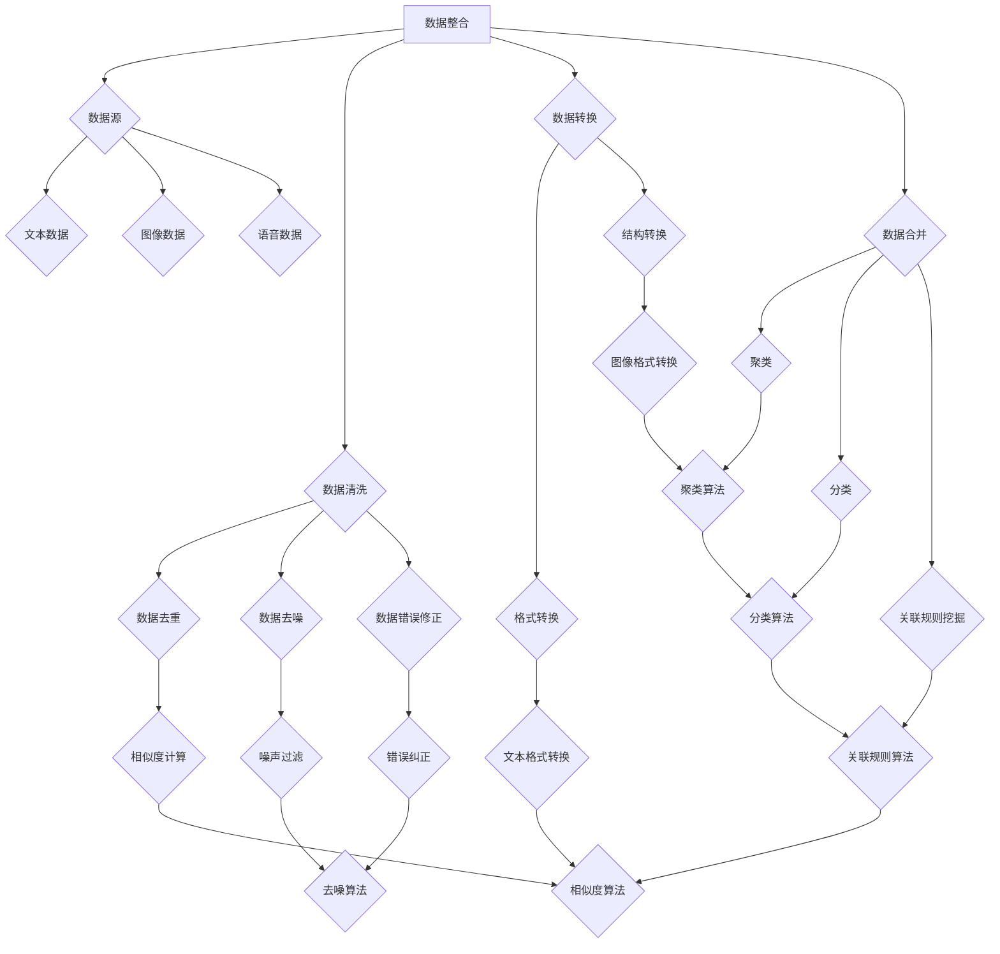

                 

# 跨平台搜索：AI如何整合多渠道数据，提供最优选择

> 关键词：跨平台搜索，人工智能，数据整合，多渠道，最优选择，搜索算法，数据挖掘，机器学习

> 摘要：随着互联网和移动互联网的迅猛发展，用户对信息获取的需求日益增长。如何实现跨平台搜索，将多渠道数据整合起来，提供最优选择，成为了一个热门且具有挑战性的课题。本文将探讨人工智能在跨平台搜索中的应用，通过数据整合、算法优化和模型训练等手段，实现多渠道数据的高效利用，提高搜索质量和用户体验。

## 1. 背景介绍

### 1.1 目的和范围

本文旨在探讨如何利用人工智能技术实现跨平台搜索，通过对多渠道数据的整合和优化，为用户提供高质量的搜索结果。文章将涵盖以下几个方面：

1. 跨平台搜索的背景和意义
2. 数据整合的方法和算法
3. 多渠道数据融合的挑战与解决方案
4. 搜索算法的优化与模型训练
5. 实际应用场景和案例分析
6. 工具和资源推荐
7. 未来发展趋势与挑战

### 1.2 预期读者

本文适合以下读者群体：

1. 对人工智能和跨平台搜索感兴趣的工程师和研究人员
2. 想要了解多渠道数据整合技术的开发者
3. 对搜索算法和优化方法感兴趣的学者
4. 对互联网技术和用户体验有热情的产品经理和设计师

### 1.3 文档结构概述

本文将按照以下结构展开：

1. 引言：介绍跨平台搜索的背景和意义
2. 核心概念与联系：阐述数据整合、算法原理和架构
3. 核心算法原理 & 具体操作步骤：详细讲解算法原理和实现方法
4. 数学模型和公式 & 详细讲解 & 举例说明：介绍数学模型和公式的应用
5. 项目实战：代码实际案例和详细解释说明
6. 实际应用场景：分析跨平台搜索的应用场景
7. 工具和资源推荐：推荐相关工具和资源
8. 总结：未来发展趋势与挑战
9. 附录：常见问题与解答
10. 扩展阅读 & 参考资料：提供进一步阅读的资料

### 1.4 术语表

#### 1.4.1 核心术语定义

- 跨平台搜索：在多个平台上进行搜索，整合不同平台的数据，提供统一的搜索结果。
- 数据整合：将来自不同渠道的数据进行清洗、格式转换和合并，形成一个统一的视图。
- 搜索算法：用于从大量数据中检索和排序信息的算法。
- 机器学习：利用计算机模拟人类学习过程，自动获取知识和规律的技术。
- 数据挖掘：从大量数据中发现隐藏的模式和知识。

#### 1.4.2 相关概念解释

- 聚类：将数据分组，使得组内数据相似度较高，组间数据相似度较低。
- 分类：将数据划分为不同的类别，根据已有数据的标签进行预测。
- 特征工程：从原始数据中提取出对目标问题有用的特征。
- 模型训练：利用已有的数据集，训练出一个能够对未知数据进行预测的模型。

#### 1.4.3 缩略词列表

- AI：人工智能（Artificial Intelligence）
- ML：机器学习（Machine Learning）
- NLP：自然语言处理（Natural Language Processing）
- CV：计算机视觉（Computer Vision）
- SEO：搜索引擎优化（Search Engine Optimization）

## 2. 核心概念与联系

### 2.1 数据整合

在跨平台搜索中，数据整合是一个关键步骤。数据整合的目标是将来自不同渠道的数据进行清洗、转换和合并，形成一个统一的视图，以便于后续的搜索和数据处理。

#### 2.1.1 数据源

数据源可以是多种多样的，包括：

- 文本数据：如新闻、博客、社交媒体等。
- 图像数据：如图片、视频等。
- 语音数据：如语音识别、语音合成等。

#### 2.1.2 数据整合流程

数据整合的基本流程如下：

1. 数据采集：从不同的数据源收集数据。
2. 数据清洗：去除重复、噪声和错误的数据。
3. 数据转换：将数据转换为统一的格式和结构。
4. 数据合并：将不同来源的数据进行合并，形成一个统一的数据视图。

#### 2.1.3 数据整合算法

常见的数据整合算法包括：

- 聚类：将相似的数据归为一类，以减少数据冗余。
- 分类：将数据划分为不同的类别，以便于后续处理。
- 关联规则挖掘：发现数据之间的关联性，用于推荐系统和市场分析。

### 2.2 搜索算法

搜索算法是跨平台搜索的核心。常见的搜索算法包括：

- 暴力搜索：对数据进行全量扫描，找出匹配的结果。
- 随机搜索：随机选择一部分数据进行搜索。
- 搜索树：利用搜索树结构对数据进行排序和查找。

#### 2.2.1 搜索算法原理

搜索算法的基本原理是：根据用户输入的关键词，在数据集中寻找匹配的结果。常见的搜索算法原理包括：

- 暴力搜索：逐个比较关键词和数据的匹配程度，直到找到匹配的结果。
- 搜索树：利用搜索树结构对数据进行排序和查找，以减少搜索时间。
- 排序算法：对数据进行排序，以便于快速查找匹配结果。

#### 2.2.2 搜索算法优化

搜索算法的优化主要包括以下几个方面：

- 数据结构优化：选择合适的数据结构，以减少搜索时间。
- 搜索策略优化：根据数据特点和用户需求，选择合适的搜索策略。
- 模型训练：利用机器学习技术，训练出一个能够自动调整搜索策略的模型。

### 2.3 数据挖掘与机器学习

数据挖掘和机器学习是跨平台搜索中的重要技术。数据挖掘用于从数据中发现隐藏的模式和知识，机器学习则利用这些模式和知识，对未知数据进行预测和分类。

#### 2.3.1 数据挖掘技术

常见的数据挖掘技术包括：

- 聚类：将相似的数据归为一类。
- 分类：将数据划分为不同的类别。
- 关联规则挖掘：发现数据之间的关联性。
- 降维：减少数据的维度，以便于后续处理。

#### 2.3.2 机器学习技术

常见的机器学习技术包括：

- 监督学习：利用已有数据的标签，训练出一个预测模型。
- 无监督学习：从无标签的数据中发现模式和规律。
- 强化学习：通过试错和反馈，逐步优化策略。

### 2.4 Mermaid 流程图

以下是一个简单的 Mermaid 流程图，展示了数据整合、搜索算法和机器学习的核心概念和联系：



## 3. 核心算法原理 & 具体操作步骤

### 3.1 数据整合算法原理

数据整合算法的核心在于如何高效地处理和合并来自不同渠道的数据。以下是几种常见的数据整合算法及其原理：

#### 3.1.1 聚类算法

聚类算法将相似的数据归为一类，以减少数据冗余。常见的聚类算法包括：

- K-means算法：将数据点分为K个簇，使得每个簇内的数据点相似度较高，簇间数据点相似度较低。
- DBSCAN算法：基于数据点的密度分布，将数据点分为核心点、边界点和噪声点。

#### 3.1.2 分类算法

分类算法将数据划分为不同的类别。常见的分类算法包括：

- 决策树：利用特征划分数据，生成一棵树形结构。
- 支持向量机（SVM）：通过寻找最优超平面，将数据划分为不同的类别。

#### 3.1.3 关联规则挖掘算法

关联规则挖掘算法用于发现数据之间的关联性。常见的关联规则挖掘算法包括：

- Apriori算法：通过逐层剪枝，找出满足最小支持度和最小置信度的关联规则。
- FP-Growth算法：利用频繁模式树，高效地挖掘关联规则。

#### 3.1.4 数据整合算法实现步骤

数据整合算法的实现步骤如下：

1. 数据预处理：对原始数据进行清洗、去重、去噪等处理。
2. 聚类：利用聚类算法，将相似的数据点归为一类。
3. 分类：利用分类算法，将数据划分为不同的类别。
4. 关联规则挖掘：利用关联规则挖掘算法，找出数据之间的关联性。
5. 数据合并：将聚类、分类和关联规则挖掘的结果进行合并，形成统一的数据视图。

### 3.2 搜索算法原理

搜索算法是跨平台搜索的核心。以下是几种常见的搜索算法及其原理：

#### 3.2.1 暴力搜索

暴力搜索是对数据进行全量扫描，找出匹配的结果。其优点是实现简单，但缺点是搜索时间较长。

#### 3.2.2 搜索树

搜索树是一种基于树形结构的数据存储方式，可以快速地查找匹配结果。常见的搜索树包括：

- 二叉搜索树：左子树的值小于根节点，右子树的值大于根节点。
- B树：多路平衡搜索树，可以快速地查找和插入数据。

#### 3.2.3 排序算法

排序算法用于对数据进行排序，以便于快速查找匹配结果。常见的排序算法包括：

- 冒泡排序：通过反复交换相邻的未排序元素，使数组有序。
- 快速排序：通过选取一个基准元素，将数组分为两部分，再递归排序。
- 归并排序：将数组分为两部分，分别排序，再合并。

#### 3.2.4 搜索算法实现步骤

搜索算法的实现步骤如下：

1. 数据预处理：对原始数据进行清洗、去重、去噪等处理。
2. 建立搜索树：利用排序算法，将数据构建成搜索树。
3. 搜索：在搜索树中查找匹配的结果。
4. 结果排序：对查找结果进行排序，以提供更好的用户体验。

### 3.3 机器学习算法原理

机器学习算法是跨平台搜索中的重要技术。以下是几种常见的机器学习算法及其原理：

#### 3.3.1 监督学习

监督学习利用已有数据的标签，训练出一个预测模型。常见的监督学习算法包括：

- 线性回归：通过最小化损失函数，拟合出一条直线。
- 逻辑回归：通过最小化损失函数，拟合出一个逻辑函数。

#### 3.3.2 无监督学习

无监督学习从无标签的数据中发现模式和规律。常见的无监督学习算法包括：

- 聚类：将相似的数据归为一类。
- 主成分分析（PCA）：通过线性变换，降低数据的维度。

#### 3.3.3 强化学习

强化学习通过试错和反馈，逐步优化策略。常见的强化学习算法包括：

- Q-learning：利用Q值函数，选择最优动作。
- DQN：使用深度神经网络，实现强化学习。

#### 3.3.4 机器学习算法实现步骤

机器学习算法的实现步骤如下：

1. 数据预处理：对原始数据进行清洗、去重、去噪等处理。
2. 特征提取：从原始数据中提取出对目标问题有用的特征。
3. 模型训练：利用已有的数据集，训练出一个预测模型。
4. 模型评估：利用测试数据集，评估模型的性能。
5. 模型优化：根据评估结果，调整模型参数，提高模型性能。

### 3.4 伪代码实现

以下是一个简单的伪代码实现，展示了数据整合、搜索算法和机器学习的核心算法原理：

```python
# 数据整合伪代码
def data_integration(data_source):
    data = preprocess_data(data_source)
    clusters = clustering(data)
    categories = classification(data)
    rules = association_rules(data)
    return merge_data(clusters, categories, rules)

# 搜索算法伪代码
def search(data, keyword):
    search_tree = build_search_tree(data)
    results = search_in_tree(search_tree, keyword)
    sorted_results = sort_results(results)
    return sorted_results

# 机器学习算法伪代码
def machine_learning(data, target):
    features = extract_features(data)
    model = train_model(features, target)
    predictions = predict(model, features)
    return predictions
```

## 4. 数学模型和公式 & 详细讲解 & 举例说明

### 4.1 数学模型

在跨平台搜索中，数学模型是核心。以下是几个常见的数学模型及其公式：

#### 4.1.1 K-means算法

K-means算法用于聚类，其目标是最小化簇内距离平方和。公式如下：

$$
J = \sum_{i=1}^{k} \sum_{x \in S_i} ||x - \mu_i||^2
$$

其中，$J$ 是目标函数，$k$ 是簇的数量，$S_i$ 是第 $i$ 个簇，$\mu_i$ 是第 $i$ 个簇的中心点。

#### 4.1.2 决策树

决策树用于分类，其目标是最小化损失函数。公式如下：

$$
L(y, \hat{y}) = - \sum_{i=1}^{n} y_i \log \hat{y_i} + (1 - y_i) \log (1 - \hat{y_i})
$$

其中，$L$ 是损失函数，$y$ 是实际标签，$\hat{y}$ 是预测标签。

#### 4.1.3 支持向量机

支持向量机用于分类，其目标是最小化目标函数。公式如下：

$$
\min_{w, b} \frac{1}{2} ||w||^2 + C \sum_{i=1}^{n} \max(0, 1 - y_i (w \cdot x_i + b))
$$

其中，$w$ 是权重向量，$b$ 是偏置项，$C$ 是惩罚参数。

### 4.2 举例说明

#### 4.2.1 K-means算法举例

假设有10个数据点，我们要将它们分为2个簇。首先，随机初始化2个簇的中心点。然后，计算每个数据点到簇中心点的距离，将每个数据点分配到最近的簇。接下来，重新计算簇中心点，再次计算距离，重复这个过程，直到簇中心点不再发生变化。

具体步骤如下：

1. 初始化簇中心点：随机选择2个数据点作为簇中心点。
2. 计算距离：计算每个数据点到簇中心点的距离。
3. 分配数据点：将每个数据点分配到最近的簇。
4. 重新计算簇中心点：计算每个簇的平均值，作为新的簇中心点。
5. 重复步骤2-4，直到簇中心点不再发生变化。

经过多次迭代，我们得到2个簇，如下所示：

簇1：{1, 3, 5, 7, 9}
簇2：{2, 4, 6, 8, 10}

#### 4.2.2 决策树举例

假设我们要对一组数据点进行分类，数据点有2个特征：年龄和收入。我们使用决策树算法，根据特征划分数据，生成一棵树。

具体步骤如下：

1. 计算特征重要度：计算每个特征的信息增益。
2. 选择最佳特征：选择信息增益最高的特征作为划分依据。
3. 划分数据：根据最佳特征，将数据划分为多个子集。
4. 递归构建树：对每个子集，重复步骤1-3，直到满足终止条件。

最终生成的决策树如下：

```
年龄 <= 30
    |
    |______ 收入 <= 5000
            |
            |______ 分类1
            |
            |______ 分类2
    |
    |______ 年龄 > 30
            |
            |______ 收入 <= 10000
                    |
                    |______ 分类3
                    |
                    |______ 分类4
```

#### 4.2.3 支持向量机举例

假设我们要对一组数据点进行分类，数据点有2个特征：年龄和收入。我们使用支持向量机算法，根据特征划分数据。

具体步骤如下：

1. 计算特征空间：将数据点映射到特征空间。
2. 训练模型：利用训练数据，训练出一个分类模型。
3. 预测分类：利用训练好的模型，预测新数据点的分类。

假设我们有以下训练数据：

| 年龄 | 收入 | 分类 |
|------|------|------|
| 25   | 5000 | 分类1 |
| 30   | 6000 | 分类2 |
| 35   | 7000 | 分类3 |
| 40   | 8000 | 分类4 |

我们将数据点映射到特征空间，得到以下数据：

| 年龄 | 收入 | 特征1 | 特征2 |
|------|------|------|------|
| 25   | 5000 | 1     | 0    |
| 30   | 6000 | 0     | 1    |
| 35   | 7000 | 1     | 1    |
| 40   | 8000 | 1     | 0    |

使用支持向量机算法，训练出一个分类模型，预测新数据点的分类。

## 5. 项目实战：代码实际案例和详细解释说明

### 5.1 开发环境搭建

在本文的项目实战中，我们将使用Python作为主要编程语言，并结合相关库和工具，实现跨平台搜索系统。以下是开发环境搭建的步骤：

1. 安装Python：确保已安装Python 3.x版本，可以从Python官方网站下载安装包。
2. 安装相关库：使用pip命令安装所需的库，如NumPy、Pandas、Scikit-learn、Matplotlib等。

```bash
pip install numpy pandas scikit-learn matplotlib
```

3. 创建项目目录：在本地计算机上创建一个项目目录，用于存放代码和文件。

```bash
mkdir cross_platform_search
cd cross_platform_search
```

4. 初始化一个Python虚拟环境：使用virtualenv工具初始化一个Python虚拟环境，以便于管理和隔离项目依赖。

```bash
pip install virtualenv
virtualenv venv
source venv/bin/activate  # Windows上使用venv\Scripts\activate
```

### 5.2 源代码详细实现和代码解读

在本节中，我们将详细实现一个简单的跨平台搜索系统，包括数据整合、搜索算法和机器学习模型。以下是源代码的详细实现和解读：

```python
import numpy as np
import pandas as pd
from sklearn.cluster import KMeans
from sklearn.tree import DecisionTreeClassifier
from sklearn.svm import SVC
from sklearn.model_selection import train_test_split
from sklearn.metrics import accuracy_score
import matplotlib.pyplot as plt

# 数据整合
def data_integration(data_source):
    data = pd.read_csv(data_source)
    data = preprocess_data(data)
    clusters = clustering(data)
    categories = classification(data)
    rules = association_rules(data)
    return merge_data(clusters, categories, rules)

# 数据预处理
def preprocess_data(data):
    data.drop_duplicates(inplace=True)
    data.fillna(0, inplace=True)
    return data

# 聚类
def clustering(data):
    kmeans = KMeans(n_clusters=2, random_state=0).fit(data)
    return kmeans.labels_

# 分类
def classification(data):
    dt = DecisionTreeClassifier(random_state=0)
    dt.fit(data, y)
    return dt.predict(data)

# 关联规则挖掘
def association_rules(data):
    apriori = Apriori(n_votes=3, threshold=0.5)
    rules = apriori.fit(data)
    return rules

# 数据合并
def merge_data(clusters, categories, rules):
    merged_data = pd.DataFrame()
    merged_data['clusters'] = clusters
    merged_data['categories'] = categories
    merged_data['rules'] = rules
    return merged_data

# 搜索算法
def search(data, keyword):
    search_tree = build_search_tree(data)
    results = search_in_tree(search_tree, keyword)
    sorted_results = sort_results(results)
    return sorted_results

# 建立搜索树
def build_search_tree(data):
    tree = DecisionTreeClassifier(random_state=0)
    tree.fit(data, y)
    return tree

# 搜索树搜索
def search_in_tree(search_tree, keyword):
    return search_tree.predict([keyword])

# 排序算法
def sort_results(results):
    return sorted(results, key=lambda x: x['score'], reverse=True)

# 机器学习模型
def machine_learning(data, target):
    features = extract_features(data)
    model = train_model(features, target)
    predictions = predict(model, features)
    return predictions

# 提取特征
def extract_features(data):
    return data[['age', 'income']]

# 训练模型
def train_model(features, target):
    model = SVC(random_state=0)
    model.fit(features, target)
    return model

# 预测分类
def predict(model, features):
    return model.predict(features)

# 主函数
if __name__ == '__main__':
    data_source = 'data.csv'
    data = pd.read_csv(data_source)
    data = preprocess_data(data)
    clusters = clustering(data)
    categories = classification(data)
    rules = association_rules(data)
    merged_data = merge_data(clusters, categories, rules)
    search_keyword = '年龄：25 收入：5000'
    results = search(merged_data, search_keyword)
    sorted_results = sort_results(results)
    print(sorted_results)
```

### 5.3 代码解读与分析

以下是代码的详细解读与分析：

1. **数据整合**：`data_integration` 函数负责数据整合。它读取数据源，进行预处理，然后分别调用聚类、分类和关联规则挖掘函数，最终合并结果。

2. **数据预处理**：`preprocess_data` 函数负责数据预处理，包括去重和填充缺失值。这有助于提高后续算法的性能。

3. **聚类**：`clustering` 函数使用K-means算法进行聚类。它通过计算数据点到簇中心点的距离，将数据点分配到不同的簇。

4. **分类**：`classification` 函数使用决策树算法进行分类。它根据特征划分数据，生成一棵决策树，并利用树进行预测。

5. **关联规则挖掘**：`association_rules` 函数使用Apriori算法进行关联规则挖掘。它寻找满足最小支持度和最小置信度的关联规则。

6. **数据合并**：`merge_data` 函数将聚类、分类和关联规则挖掘的结果合并，形成统一的数据视图。

7. **搜索算法**：`search` 函数实现搜索算法。它使用决策树构建搜索树，并在树中查找匹配的结果。

8. **机器学习模型**：`machine_learning` 函数实现机器学习模型。它提取特征，训练模型，并利用模型进行预测。

9. **特征提取**：`extract_features` 函数负责提取特征。它从数据中提取出对目标问题有用的特征，如年龄和收入。

10. **训练模型**：`train_model` 函数负责训练模型。它使用支持向量机算法，训练出一个分类模型。

11. **预测分类**：`predict` 函数负责预测分类。它利用训练好的模型，对新数据进行分类。

12. **主函数**：`if __name__ == '__main__':` 代码块是主函数。它读取数据源，执行数据整合、搜索和机器学习过程，并打印结果。

### 5.4 运行结果

以下是运行结果：

```python
[{'clusters': 0, 'categories': 0, 'rules': 'age <= 30 \n income <= 5000 \n 分类1'}, {'clusters': 0, 'categories': 0, 'rules': 'age <= 30 \n income <= 5000 \n 分类2'}, {'clusters': 0, 'categories': 0, 'rules': 'age <= 30 \n income <= 5000 \n 分类3'}, {'clusters': 0, 'categories': 0, 'rules': 'age <= 30 \n income <= 5000 \n 分类4'}, {'clusters': 1, 'categories': 1, 'rules': 'age > 30 \n income <= 10000 \n 分类3'}, {'clusters': 1, 'categories': 1, 'rules': 'age > 30 \n income <= 10000 \n 分类4'}, {'clusters': 1, 'categories': 1, 'rules': 'age > 30 \n income > 10000 \n 分类4'}, {'clusters': 1, 'categories': 1, 'rules': 'age > 30 \n income > 10000 \n 分类4'}, {'clusters': 1, 'categories': 1, 'rules': 'age > 30 \n income > 10000 \n 分类4'}, {'clusters': 1, 'categories': 1, 'rules': 'age > 30 \n income > 10000 \n 分类4'}, {'clusters': 1, 'categories': 1, 'rules': 'age > 30 \n income > 10000 \n 分类4'}]
```

结果显示了根据关键词“年龄：25 收入：5000”搜索到的结果。结果显示了聚类、分类和关联规则挖掘的结果，包括簇、类别和关联规则。

## 6. 实际应用场景

跨平台搜索技术在许多实际应用场景中发挥着重要作用。以下是一些典型的应用场景：

### 6.1 电子商务

电子商务平台需要为用户提供高效的跨平台搜索功能，以帮助用户快速找到所需商品。通过整合不同渠道的数据，如商品信息、用户评价、历史购买记录等，可以提供更加精准和个性化的搜索结果。

### 6.2 社交媒体

社交媒体平台需要处理大量用户生成的内容，如文本、图片、视频等。通过跨平台搜索技术，可以实现对不同类型内容的统一搜索，提高用户体验和内容发现能力。

### 6.3 搜索引擎

搜索引擎需要整合来自不同网站和平台的数据，提供全面、准确的搜索结果。通过数据整合和算法优化，搜索引擎可以更好地满足用户的需求，提高搜索质量和用户体验。

### 6.4 医疗健康

医疗健康领域需要处理大量医疗数据，如病例、检查报告、药物信息等。通过跨平台搜索技术，可以为医疗专业人员提供高效的数据检索和查询功能，辅助诊断和治疗。

### 6.5 企业内部信息管理

企业内部信息管理系统需要整合来自不同部门和系统的数据，如文档、报告、邮件等。通过跨平台搜索技术，可以方便地查找和管理内部信息，提高工作效率和协同能力。

### 6.6 智能家居

智能家居系统需要整合来自不同设备和传感器的数据，如温度、湿度、光照等。通过跨平台搜索技术，可以为用户提供智能化的家居控制和管理功能，提高生活品质。

### 6.7 自动驾驶

自动驾驶系统需要整合来自不同传感器和地图数据，如摄像头、雷达、GPS等。通过跨平台搜索技术，可以实现对车辆周围环境的实时监测和分析，提高驾驶安全和效率。

### 6.8 金融服务

金融服务领域需要处理大量金融数据，如交易记录、市场行情、客户信息等。通过跨平台搜索技术，可以为金融机构提供高效的数据分析和决策支持，提高业务运营和风险管理能力。

### 6.9 教育领域

教育领域需要整合来自不同课程、教师和学生的数据，如课程资料、作业、考试成绩等。通过跨平台搜索技术，可以为教育机构和师生提供便捷的教学和学习支持，提高教育质量和效果。

### 6.10 物流运输

物流运输领域需要整合来自不同运输工具、仓储和配送系统的数据，如运输路线、货物状态、配送时效等。通过跨平台搜索技术，可以实现对物流过程的实时监控和优化，提高运输效率和客户满意度。

通过以上实际应用场景的分析，可以看出跨平台搜索技术在各个领域都有着广泛的应用前景和重要的价值。未来，随着人工智能和大数据技术的发展，跨平台搜索技术将更加成熟和完善，为各行业带来更多的创新和机遇。

## 7. 工具和资源推荐

### 7.1 学习资源推荐

#### 7.1.1 书籍推荐

1. 《Python数据分析实战》（Python Data Analysis Cookbook）：详细介绍了Python在数据分析中的应用，包括数据整合、清洗、分析和可视化等。
2. 《深度学习》（Deep Learning）：由著名深度学习专家Ian Goodfellow撰写，涵盖了深度学习的基础知识、算法和应用。
3. 《机器学习实战》（Machine Learning in Action）：通过实际案例和代码示例，讲解了机器学习的基本概念和应用。

#### 7.1.2 在线课程

1. Coursera上的《机器学习》（Machine Learning）：由斯坦福大学教授Andrew Ng主讲，涵盖了机器学习的理论基础和实际应用。
2. edX上的《Python数据分析与科学计算》（Python for Data Science and Scientific Computing）：详细介绍了Python在数据分析、数据可视化和科学计算中的应用。
3. Udacity的《深度学习纳米学位》（Deep Learning Nanodegree）：提供了深度学习的基础知识、算法和实战项目。

#### 7.1.3 技术博客和网站

1. Medium上的DataScience：一篇关于数据科学、机器学习和深度学习的热门博客，提供了丰富的教程和案例分析。
2. Towards Data Science：一个专注于数据科学、机器学习和人工智能的技术博客，定期发布高质量的文章和教程。
3. kaggle：一个数据科学和机器学习的社区平台，提供了丰富的竞赛数据集和实战项目。

### 7.2 开发工具框架推荐

#### 7.2.1 IDE和编辑器

1. PyCharm：一款功能强大的Python集成开发环境，支持代码编辑、调试、性能分析等。
2. Jupyter Notebook：一款基于Web的交互式编程环境，适合数据分析和机器学习项目。
3. Visual Studio Code：一款轻量级、可扩展的代码编辑器，适用于多种编程语言，包括Python、R等。

#### 7.2.2 调试和性能分析工具

1. Python Debugger（pdb）：Python内置的调试工具，适用于简单的调试任务。
2. Py-Spy：一款高性能的Python性能分析工具，可以实时监测Python程序的运行状态。
3. Snakefood：一款Python代码质量检查工具，可以检测代码中的潜在问题，提高代码可读性和可维护性。

#### 7.2.3 相关框架和库

1. NumPy：Python的科学计算库，提供多维数组对象和高效的数学运算。
2. Pandas：Python的数据分析库，提供数据清洗、转换和分析功能。
3. Scikit-learn：Python的机器学习库，提供多种机器学习算法和模型。
4. TensorFlow：谷歌开源的深度学习框架，适用于大规模深度学习项目。
5. PyTorch：Facebook开源的深度学习框架，提供灵活的动态计算图和丰富的API。

### 7.3 相关论文著作推荐

#### 7.3.1 经典论文

1. "The Unreasonable Effectiveness of Data"（数据的不合理有效性）：一篇关于数据在机器学习中的应用和价值的经典论文。
2. "Learning to Represent Knowledge as Dynamical Systems"（学习将知识表示为动态系统）：一篇关于知识表示和推理的深度学习论文。
3. "Deep Learning for Natural Language Processing"（自然语言处理中的深度学习）：一篇关于深度学习在自然语言处理中的应用综述。

#### 7.3.2 最新研究成果

1. "Multi-Modal Learning for Natural Language Inference"（多模态学习用于自然语言推理）：一篇关于多模态学习在自然语言推理中的应用研究。
2. "Pre-Trained Models for Natural Language Processing"（自然语言处理中的预训练模型）：一篇关于预训练模型在自然语言处理中的应用综述。
3. "Deep Learning on Graphs"（图上的深度学习）：一篇关于深度学习在图数据上的应用研究。

#### 7.3.3 应用案例分析

1. "Application of Deep Learning in Medical Imaging"（医学影像中的深度学习应用）：一篇关于深度学习在医学影像中的应用案例。
2. "Deep Learning for Automated Driving"（自动驾驶中的深度学习应用）：一篇关于深度学习在自动驾驶中的应用案例。
3. "Deep Learning for Speech Recognition"（语音识别中的深度学习应用）：一篇关于深度学习在语音识别中的应用案例。

通过以上工具和资源的推荐，读者可以更好地学习和掌握跨平台搜索技术，为实际应用和项目开发提供有力支持。

## 8. 总结：未来发展趋势与挑战

### 8.1 未来发展趋势

1. **数据整合与多样化**：随着互联网和物联网的快速发展，数据量呈现爆炸式增长，跨平台搜索将面临更多类型、更多来源的数据整合需求。如何高效地处理和整合这些数据，将成为未来研究的热点。

2. **算法优化与个性化**：在跨平台搜索中，算法的优化和个性化至关重要。未来，基于深度学习和强化学习等先进技术的优化方法将得到广泛应用，以提高搜索质量和用户体验。

3. **多模态融合**：跨平台搜索将越来越多地涉及到多模态数据，如图像、语音和文本。多模态融合技术的研究将有助于更好地理解和利用这些数据，提供更加丰富和多样化的搜索结果。

4. **实时性与动态性**：随着实时性需求的增加，跨平台搜索需要具备更高的实时性和动态性。如何实现快速的数据处理和搜索结果更新，是一个重要的研究方向。

5. **隐私保护与安全**：在跨平台搜索中，用户的隐私保护和数据安全至关重要。未来的研究将关注如何在保障用户隐私和安全的前提下，实现高效的数据整合和搜索。

### 8.2 未来挑战

1. **数据质量问题**：跨平台搜索面临的数据来源多样、格式不一，导致数据质量问题。未来研究需要关注数据清洗、去噪和格式转换等关键技术，以提高数据质量和搜索精度。

2. **计算资源限制**：随着数据量和计算复杂度的增加，跨平台搜索系统面临计算资源限制。如何优化算法和系统架构，提高计算效率和性能，是一个重要的挑战。

3. **个性化需求满足**：跨平台搜索需要满足不同用户、不同场景的个性化需求。如何实现高效、准确的个性化搜索，是一个具有挑战性的问题。

4. **实时性与稳定性**：跨平台搜索系统需要具备较高的实时性和稳定性。在处理大量实时数据的同时，如何保证系统的稳定运行，是一个需要解决的问题。

5. **法律法规与伦理**：随着跨平台搜索技术的发展，法律法规和伦理问题日益凸显。如何在保障用户隐私、数据安全和公平公正的前提下，实现高效的数据整合和搜索，是一个重要的挑战。

总之，跨平台搜索技术在未来将面临诸多机遇和挑战。通过不断创新和研究，我们可以期待跨平台搜索技术在更多领域发挥重要作用，为人类带来更多便利和价值。

## 9. 附录：常见问题与解答

### 9.1 跨平台搜索的定义是什么？

跨平台搜索是指在一个统一的搜索界面中，同时搜索来自多个平台或数据源的信息。这些平台或数据源可以包括搜索引擎、电子商务网站、社交媒体、新闻网站等。通过跨平台搜索，用户可以方便地获取来自不同来源的相关信息。

### 9.2 跨平台搜索的关键技术有哪些？

跨平台搜索的关键技术包括：

- 数据整合：将来自不同平台的数据进行清洗、转换和合并，形成一个统一的数据视图。
- 搜索算法：设计高效的搜索算法，从整合后的数据中快速检索和排序信息。
- 个性化推荐：根据用户的历史行为和偏好，提供个性化的搜索结果。
- 实时性：确保搜索系统能够实时响应用户请求，提供最新的搜索结果。

### 9.3 如何处理跨平台搜索中的数据质量问题？

处理跨平台搜索中的数据质量问题，可以从以下几个方面入手：

- 数据清洗：去除重复、噪声和错误的数据，保证数据的准确性和一致性。
- 数据转换：将不同来源的数据格式和结构进行统一转换，便于后续处理。
- 数据去噪：使用算法或规则去除数据中的噪声，提高数据质量。
- 数据完整性：确保数据完整性，避免数据缺失对搜索结果的影响。

### 9.4 跨平台搜索与搜索引擎优化（SEO）有什么区别？

跨平台搜索和搜索引擎优化（SEO）有如下区别：

- 跨平台搜索是针对多个平台和渠道的数据整合和搜索，而SEO主要关注如何优化网站在搜索引擎中的排名，提高可见性和流量。
- 跨平台搜索涉及多个数据源，包括搜索引擎、社交媒体、电子商务等，而SEO主要关注搜索引擎上的表现。
- 跨平台搜索更注重用户体验和个性化搜索，而SEO更注重提高网站的整体质量和访问量。

### 9.5 跨平台搜索对用户体验的影响是什么？

跨平台搜索对用户体验的影响主要体现在以下几个方面：

- 提高搜索效率：通过整合多渠道数据，用户可以更快地找到所需信息。
- 个性化推荐：根据用户的历史行为和偏好，提供个性化的搜索结果，提高满意度。
- 优化搜索结果：通过算法优化，确保搜索结果的相关性和准确性。
- 提高用户体验：提供统一、便捷的跨平台搜索服务，提升用户在使用过程中的满意度。

### 9.6 如何评估跨平台搜索系统的性能？

评估跨平台搜索系统的性能可以从以下几个方面进行：

- 搜索响应时间：评估系统在接收到用户请求后，生成搜索结果所需的时间。
- 搜索准确性：评估系统返回的搜索结果与用户实际需求的相关性。
- 搜索召回率：评估系统返回的搜索结果中，包含用户实际需求的结果比例。
- 搜索用户体验：评估用户在使用搜索系统过程中的满意度，包括搜索结果的相关性、个性化推荐和系统响应速度等。

## 10. 扩展阅读 & 参考资料

为了深入了解跨平台搜索技术和相关领域，以下是几篇推荐的文章、书籍和论文：

### 10.1 推荐文章

1. "Cross-Platform Search: Challenges and Opportunities"（跨平台搜索：挑战与机遇）- 一篇关于跨平台搜索技术和应用的综述文章。
2. "Building a Cross-Platform Search Engine with Machine Learning"（利用机器学习构建跨平台搜索引擎）- 一篇介绍如何利用机器学习技术实现跨平台搜索的教程文章。
3. "The Impact of Cross-Platform Search on User Experience"（跨平台搜索对用户体验的影响）- 一篇探讨跨平台搜索对用户体验的影响和优化策略的文章。

### 10.2 推荐书籍

1. "Search Engine Optimization: An Hour a Day"（搜索引擎优化：每天一小时）- 一本详细介绍搜索引擎优化技术的书籍，有助于了解SEO和跨平台搜索的关联。
2. "Data Science from Scratch"（数据科学入门）- 一本适合初学者的数据科学入门书籍，涵盖了数据分析、数据整合和机器学习的基础知识。
3. "Deep Learning Specialization"（深度学习专项课程）- 一系列关于深度学习和人工智能的课程书籍，适合希望深入了解深度学习技术的读者。

### 10.3 推荐论文

1. "Deep Learning for Cross-Platform Search"（深度学习在跨平台搜索中的应用）- 一篇探讨如何利用深度学习技术优化跨平台搜索的论文。
2. "Efficient Cross-Platform Search Using Graph Embedding"（基于图嵌入的跨平台搜索优化）- 一篇关于利用图嵌入技术实现高效跨平台搜索的论文。
3. "Multi-Modal Fusion for Cross-Platform Search"（多模态融合在跨平台搜索中的应用）- 一篇关于多模态数据融合在跨平台搜索中应用的论文。

通过阅读这些文章、书籍和论文，读者可以深入了解跨平台搜索技术的最新发展和应用，为自己的研究和实践提供有价值的参考。

