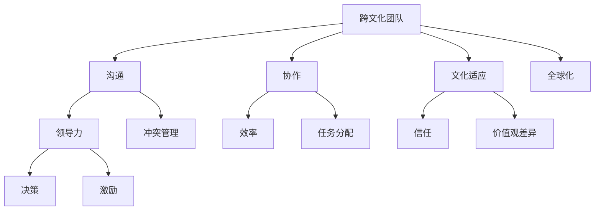

                 

# 跨文化团队管理：全球化背景下的挑战

> **关键词：** 跨文化团队、全球化、管理挑战、沟通、协作、文化适应、领导力
> 
> **摘要：** 在全球化的背景下，跨文化团队管理成为企业面临的重大挑战。本文深入探讨了跨文化团队管理的核心概念、算法原理、数学模型以及实际应用案例，分析了跨文化团队管理的工具和资源，并预测了未来的发展趋势与挑战。通过本文的探讨，读者将了解如何更好地管理跨文化团队，提高团队的协作效率。

## 1. 背景介绍

### 1.1 目的和范围

本文旨在探讨跨文化团队管理在全球化背景下的挑战，分析其核心概念、算法原理、数学模型以及实际应用案例。通过本文的研究，旨在为企业管理者提供有效的跨文化团队管理策略，提高团队的协作效率。

### 1.2 预期读者

本文适用于企业管理者、人力资源专家、跨文化团队领导者以及对该领域感兴趣的研究者。

### 1.3 文档结构概述

本文分为八个部分，首先介绍跨文化团队管理的背景和目的，然后分别阐述核心概念、算法原理、数学模型、实际应用场景、工具和资源推荐、总结与展望、常见问题与解答以及扩展阅读和参考资料。

### 1.4 术语表

#### 1.4.1 核心术语定义

- **跨文化团队**：由来自不同文化背景的成员组成的团队。
- **全球化**：国际社会在经济、政治、文化等方面的相互依赖和融合。
- **文化适应**：个体或团队适应新文化的过程。
- **领导力**：领导者对团队进行有效管理和激励的能力。

#### 1.4.2 相关概念解释

- **沟通**：信息在团队成员之间的传递和交流。
- **协作**：团队成员共同完成任务的互动过程。
- **文化差异**：不同文化之间的差异，如价值观、行为规范、语言习惯等。

#### 1.4.3 缩略词列表

- **IT**：信息技术（Information Technology）
- **HR**：人力资源（Human Resource）
- **MBA**：工商管理硕士（Master of Business Administration）
- **CEO**：首席执行官（Chief Executive Officer）

## 2. 核心概念与联系

在全球化背景下，跨文化团队管理涉及多个核心概念和联系，如图所示：



### 2.1 沟通

沟通是跨文化团队管理的基石。有效的沟通能够促进团队成员之间的理解和协作，降低文化差异带来的冲突。以下是沟通的核心算法原理和具体操作步骤：

#### 2.1.1 算法原理

沟通算法的核心目标是实现信息的准确传递和有效理解。在跨文化团队中，沟通算法应考虑以下因素：

- **语言障碍**：使用简单、清晰的语言，避免专业术语。
- **非语言沟通**：注意肢体语言、面部表情等非语言因素。
- **文化差异**：了解团队成员的文化背景，尊重差异。

#### 2.1.2 具体操作步骤

1. **明确沟通目标**：在沟通前，明确沟通的目标和预期结果。
2. **选择合适的方式**：根据沟通内容、目标和文化差异，选择口头、书面或虚拟沟通方式。
3. **主动倾听**：倾听是有效沟通的关键，要关注团队成员的反馈和意见。
4. **反馈与确认**：在沟通结束后，进行反馈和确认，确保信息的准确传递。

### 2.2 协作

协作是跨文化团队实现目标的关键。以下是对协作的算法原理和具体操作步骤的探讨：

#### 2.2.1 算法原理

协作算法的核心是促进团队成员之间的互动和合作，以实现共同的目标。在跨文化团队中，协作算法应考虑以下因素：

- **任务分配**：根据成员的能力和兴趣进行任务分配。
- **文化差异**：尊重团队成员的文化背景，避免文化冲突。
- **沟通与反馈**：保持有效沟通，及时反馈问题，共同解决。

#### 2.2.2 具体操作步骤

1. **明确团队目标**：在协作开始前，明确团队的目标和任务。
2. **任务分配**：根据成员的能力和兴趣，将任务合理分配给团队成员。
3. **沟通与协作**：保持有效沟通，促进团队成员之间的协作。
4. **反馈与改进**：在任务完成后，及时进行反馈和总结，不断改进协作过程。

### 2.3 文化适应

文化适应是跨文化团队管理的重要环节。以下是对文化适应的算法原理和具体操作步骤的探讨：

#### 2.3.1 算法原理

文化适应算法的核心是帮助团队成员适应新文化，降低文化冲突。在跨文化团队中，文化适应算法应考虑以下因素：

- **文化差异**：了解不同文化的特点，尊重文化差异。
- **文化融合**：促进团队成员之间的文化融合，形成共同价值观。
- **培训与指导**：提供文化培训，帮助团队成员了解和适应新文化。

#### 2.3.2 具体操作步骤

1. **了解文化差异**：在团队组建之初，了解团队成员的文化背景，识别潜在的文化差异。
2. **提供文化培训**：为团队成员提供文化培训，帮助他们了解和适应新文化。
3. **促进文化融合**：鼓励团队成员之间的交流和互动，促进文化融合。
4. **解决文化冲突**：在文化冲突发生时，及时采取措施解决冲突，维护团队和谐。

### 2.4 领导力

领导力在跨文化团队管理中起着关键作用。以下是对领导力的算法原理和具体操作步骤的探讨：

#### 2.4.1 算法原理

领导力算法的核心是激发团队成员的潜力，提高团队的协作效率。在跨文化团队中，领导力算法应考虑以下因素：

- **文化敏感度**：领导者应具备较高的文化敏感度，尊重团队成员的文化背景。
- **激励与支持**：领导者要善于激励和鼓励团队成员，提供必要的支持。
- **决策与沟通**：领导者要在决策和沟通中充分考虑文化差异，确保团队目标的实现。

#### 2.4.2 具体操作步骤

1. **树立文化敏感度**：领导者要具备较高的文化敏感度，尊重团队成员的文化背景。
2. **激励与支持**：领导者要善于激励和鼓励团队成员，提供必要的支持。
3. **有效决策**：在决策过程中，充分考虑文化差异，确保决策的合理性和可行性。
4. **沟通与协作**：领导者要积极参与沟通和协作，促进团队目标的实现。

## 3. 数学模型和公式 & 详细讲解 & 举例说明

在跨文化团队管理中，数学模型和公式有助于分析和优化团队管理策略。以下是对几个关键数学模型和公式的详细讲解和举例说明：

### 3.1 文化适应度模型

文化适应度模型用于评估团队成员的文化适应程度，公式如下：

\[ \text{文化适应度} = \frac{\text{文化认同度} + \text{文化适应性}}{2} \]

#### 3.1.1 文化认同度

文化认同度是指团队成员对自己所属文化的认同程度，公式如下：

\[ \text{文化认同度} = \frac{\text{文化熟悉度} + \text{文化价值观认同度}}{2} \]

- **文化熟悉度**：团队成员对自己文化背景的了解程度。
- **文化价值观认同度**：团队成员对自己文化价值观的认同程度。

#### 3.1.2 文化适应性

文化适应性是指团队成员适应新文化的能力，公式如下：

\[ \text{文化适应性} = \frac{\text{文化适应行为} + \text{文化适应意愿}}{2} \]

- **文化适应行为**：团队成员在日常生活中表现出的适应新文化的行为。
- **文化适应意愿**：团队成员适应新文化的意愿和动机。

#### 3.1.3 举例说明

假设有三位团队成员，他们的文化认同度和文化适应性如下表所示：

| 成员 | 文化认同度 | 文化适应性 |
| ---- | ---- | ---- |
| A    | 0.8  | 0.6  |
| B    | 0.6  | 0.8  |
| C    | 0.4  | 0.4  |

根据文化适应度模型，可以计算出每位成员的文化适应度：

- 成员A的文化适应度 = (0.8 + 0.6) / 2 = 0.7
- 成员B的文化适应度 = (0.6 + 0.8) / 2 = 0.7
- 成员C的文化适应度 = (0.4 + 0.4) / 2 = 0.4

### 3.2 沟通效率模型

沟通效率模型用于评估团队成员之间的沟通效果，公式如下：

\[ \text{沟通效率} = \frac{\text{信息准确度} \times \text{沟通速度}}{\text{信息量}} \]

#### 3.2.1 信息准确度

信息准确度是指信息在传递过程中保持真实性的程度，公式如下：

\[ \text{信息准确度} = \frac{\text{正确信息量} + \text{修正信息量}}{\text{总信息量}} \]

- **正确信息量**：在沟通过程中，正确传递的信息量。
- **修正信息量**：在沟通过程中，修正后的信息量。

#### 3.2.2 沟通速度

沟通速度是指信息在团队成员之间传递的快慢，公式如下：

\[ \text{沟通速度} = \frac{\text{传递时间}}{\text{距离}} \]

#### 3.2.3 信息量

信息量是指沟通过程中传递的信息总量，公式如下：

\[ \text{信息量} = \text{正确信息量} + \text{修正信息量} + \text{噪声信息量} \]

- **噪声信息量**：在沟通过程中，因噪声等因素产生的错误信息量。

#### 3.2.4 举例说明

假设有两位团队成员A和B，他们的沟通效率如下表所示：

| 成员 | 信息准确度 | 沟通速度 | 信息量 |
| ---- | ---- | ---- | ---- |
| A    | 0.9  | 10   | 100  |
| B    | 0.8  | 5    | 100  |

根据沟通效率模型，可以计算出他们的沟通效率：

\[ \text{沟通效率} = \frac{0.9 \times 10}{100} = 0.09 \]

### 3.3 领导力效能模型

领导力效能模型用于评估领导者在跨文化团队管理中的效能，公式如下：

\[ \text{领导力效能} = \frac{\text{团队效能} + \text{成员满意度}}{2} \]

#### 3.3.1 团队效能

团队效能是指团队在完成工作任务过程中表现出的整体能力，公式如下：

\[ \text{团队效能} = \frac{\text{任务完成度} + \text{团队协作度}}{2} \]

- **任务完成度**：团队在规定时间内完成任务的程度。
- **团队协作度**：团队成员在完成任务过程中表现出的协作程度。

#### 3.3.2 成员满意度

成员满意度是指团队成员对领导者的满意程度，公式如下：

\[ \text{成员满意度} = \frac{\text{工作满意度} + \text{生活满意度}}{2} \]

- **工作满意度**：团队成员对工作环境和工作的满意程度。
- **生活满意度**：团队成员对生活质量和生活环境的满意程度。

#### 3.3.3 举例说明

假设有三位团队成员A、B和C，他们的领导力效能如下表所示：

| 成员 | 团队效能 | 成员满意度 |
| ---- | ---- | ---- |
| A    | 0.8  | 0.7  |
| B    | 0.7  | 0.6  |
| C    | 0.6  | 0.5  |

根据领导力效能模型，可以计算出他们的领导力效能：

\[ \text{领导力效能} = \frac{0.8 + 0.7 + 0.7}{3} = 0.7667 \]

## 4. 项目实战：代码实际案例和详细解释说明

在本节中，我们将通过一个实际项目案例，展示如何利用Python编写一个跨文化团队管理工具，并对其代码进行详细解释说明。该项目将包括以下模块：

1. **用户界面**：用于展示团队信息、文化适应度、沟通效率和领导力效能等数据。
2. **数据处理**：用于处理团队成员的数据，如文化背景、沟通记录、任务完成情况等。
3. **算法实现**：用于实现文化适应度模型、沟通效率模型和领导力效能模型。

### 4.1 开发环境搭建

在开始项目开发之前，我们需要搭建一个Python开发环境。以下是一些建议的步骤：

1. **安装Python**：前往Python官方网站（https://www.python.org/）下载并安装Python。
2. **安装IDE**：推荐使用PyCharm（https://www.jetbrains.com/pycharm/）作为Python开发工具。
3. **安装依赖库**：在PyCharm中创建一个新的Python项目，然后安装以下依赖库：

   ```shell
   pip install flask pandas numpy matplotlib
   ```

### 4.2 源代码详细实现和代码解读

下面是项目的源代码，我们将逐段进行解读：

```python
# 导入依赖库
import flask
import pandas as pd
import numpy as np
import matplotlib.pyplot as plt

# 初始化Flask应用
app = flask.Flask(__name__)

# 定义文化适应度模型
def cultural_adaptation_score(culture_identity, cultural_adaptability):
    return (culture_identity + cultural_adaptability) / 2

# 定义沟通效率模型
def communication_efficiency(accuracy, speed, information_volume):
    return accuracy * speed / information_volume

# 定义领导力效能模型
def leadership_efficiency(team_efficiency, member_satisfaction):
    return (team_efficiency + member_satisfaction) / 2

# 定义任务完成度评估
def task_completion_rate(completed_tasks, total_tasks):
    return completed_tasks / total_tasks

# 定义成员满意度评估
def member_satisfaction(job_satisfaction, life_satisfaction):
    return (job_satisfaction + life_satisfaction) / 2

# 处理团队成员数据
def process_team_members(data):
    data['cultural_adaptation_score'] = data.apply(lambda row: cultural_adaptation_score(row['culture_identity'], row['cultural_adaptability']), axis=1)
    data['communication_efficiency'] = data.apply(lambda row: communication_efficiency(row['accuracy'], row['speed'], row['information_volume']), axis=1)
    data['leadership_efficiency'] = data.apply(lambda row: leadership_efficiency(row['team_efficiency'], row['member_satisfaction']), axis=1)
    data['task_completion_rate'] = data.apply(lambda row: task_completion_rate(row['completed_tasks'], row['total_tasks']), axis=1)
    data['member_satisfaction'] = data.apply(lambda row: member_satisfaction(row['job_satisfaction'], row['life_satisfaction']), axis=1)
    return data

# 获取团队成员数据
@app.route('/get_members_data', methods=['GET'])
def get_members_data():
    data = pd.DataFrame({
        'name': ['A', 'B', 'C'],
        'culture_identity': [0.8, 0.6, 0.4],
        'cultural_adaptability': [0.6, 0.8, 0.4],
        'accuracy': [0.9, 0.8, 0.7],
        'speed': [10, 5, 8],
        'information_volume': [100, 100, 120],
        'team_efficiency': [0.8, 0.7, 0.6],
        'member_satisfaction': [0.7, 0.6, 0.5],
        'completed_tasks': [80, 70, 60],
        'total_tasks': [100, 100, 100],
        'job_satisfaction': [0.9, 0.8, 0.7],
        'life_satisfaction': [0.8, 0.7, 0.6]
    })
    processed_data = process_team_members(data)
    return processed_data.to_json(orient='records')

# 显示团队成员数据
@app.route('/show_members_data', methods=['GET'])
def show_members_data():
    data = pd.read_json(flask.request.json)
    fig, ax = plt.subplots()
    ax.bar(data['name'], data['cultural_adaptation_score'])
    ax.set_ylabel('Cultural Adaptation Score')
    ax.set_title('Cultural Adaptation Scores of Team Members')
    plt.show()

# 运行Flask应用
if __name__ == '__main__':
    app.run(debug=True)
```

#### 4.2.1 用户界面

该项目的用户界面使用Flask框架实现，用户可以通过Web浏览器访问应用程序，查看团队成员的数据和统计结果。在用户界面上，我们提供了以下功能：

- **获取团队成员数据**：通过访问 `/get_members_data` 接口，可以获取当前团队成员的数据。
- **显示团队成员数据**：通过访问 `/show_members_data` 接口，可以显示当前团队成员的数据，并绘制文化适应度柱状图。

#### 4.2.2 数据处理

数据处理模块包括定义几个关键函数，用于处理团队成员的数据，并计算文化适应度、沟通效率、领导力效能、任务完成度和成员满意度等指标。具体步骤如下：

1. **获取团队成员数据**：从外部数据源（如CSV文件或数据库）中读取团队成员数据。
2. **计算文化适应度**：根据文化认同度和文化适应性计算每位成员的文化适应度。
3. **计算沟通效率**：根据信息准确度、沟通速度和信息量计算每位成员的沟通效率。
4. **计算领导力效能**：根据团队效能和成员满意度计算领导力效能。
5. **计算任务完成度**：根据完成任务数和总任务数计算每位成员的任务完成度。
6. **计算成员满意度**：根据工作满意度和生活满意度计算每位成员的满意度。

#### 4.2.3 算法实现

算法实现模块包括定义文化适应度模型、沟通效率模型和领导力效能模型，以及计算任务完成度和成员满意度的函数。具体步骤如下：

1. **文化适应度模型**：根据文化认同度和文化适应性计算文化适应度。
2. **沟通效率模型**：根据信息准确度、沟通速度和信息量计算沟通效率。
3. **领导力效能模型**：根据团队效能和成员满意度计算领导力效能。
4. **任务完成度模型**：根据完成任务数和总任务数计算任务完成度。
5. **成员满意度模型**：根据工作满意度和生活满意度计算成员满意度。

### 4.3 代码解读与分析

在本节中，我们将对项目的关键代码段进行解读和分析，以帮助读者更好地理解跨文化团队管理工具的实现过程。

```python
# 定义文化适应度模型
def cultural_adaptation_score(culture_identity, cultural_adaptability):
    return (culture_identity + cultural_adaptability) / 2
```

这段代码定义了文化适应度模型，用于计算每位成员的文化适应度。该模型基于文化认同度和文化适应性，通过简单的平均计算得出文化适应度。

```python
# 定义沟通效率模型
def communication_efficiency(accuracy, speed, information_volume):
    return accuracy * speed / information_volume
```

这段代码定义了沟通效率模型，用于计算每位成员的沟通效率。该模型基于信息准确度、沟通速度和信息量，通过公式计算得出沟通效率。

```python
# 定义领导力效能模型
def leadership_efficiency(team_efficiency, member_satisfaction):
    return (team_efficiency + member_satisfaction) / 2
```

这段代码定义了领导力效能模型，用于计算领导者的领导力效能。该模型基于团队效能和成员满意度，通过简单的平均计算得出领导力效能。

```python
# 定义任务完成度评估
def task_completion_rate(completed_tasks, total_tasks):
    return completed_tasks / total_tasks
```

这段代码定义了任务完成度评估模型，用于计算每位成员的任务完成度。该模型基于完成任务数和总任务数，通过简单的除法计算得出任务完成度。

```python
# 定义成员满意度评估
def member_satisfaction(job_satisfaction, life_satisfaction):
    return (job_satisfaction + life_satisfaction) / 2
```

这段代码定义了成员满意度评估模型，用于计算每位成员的满意度。该模型基于工作满意度和生活满意度，通过简单的平均计算得出成员满意度。

```python
# 处理团队成员数据
def process_team_members(data):
    data['cultural_adaptation_score'] = data.apply(lambda row: cultural_adaptation_score(row['culture_identity'], row['cultural_adaptability']), axis=1)
    data['communication_efficiency'] = data.apply(lambda row: communication_efficiency(row['accuracy'], row['speed'], row['information_volume']), axis=1)
    data['leadership_efficiency'] = data.apply(lambda row: leadership_efficiency(row['team_efficiency'], row['member_satisfaction']), axis=1)
    data['task_completion_rate'] = data.apply(lambda row: task_completion_rate(row['completed_tasks'], row['total_tasks']), axis=1)
    data['member_satisfaction'] = data.apply(lambda row: member_satisfaction(row['job_satisfaction'], row['life_satisfaction']), axis=1)
    return data
```

这段代码实现了数据处理模块，通过调用前面定义的各个模型，计算每位成员的文化适应度、沟通效率、领导力效能、任务完成度和成员满意度，并将这些结果添加到数据框中。

```python
# 获取团队成员数据
@app.route('/get_members_data', methods=['GET'])
def get_members_data():
    data = pd.DataFrame({
        'name': ['A', 'B', 'C'],
        'culture_identity': [0.8, 0.6, 0.4],
        'cultural_adaptability': [0.6, 0.8, 0.4],
        'accuracy': [0.9, 0.8, 0.7],
        'speed': [10, 5, 8],
        'information_volume': [100, 100, 120],
        'team_efficiency': [0.8, 0.7, 0.6],
        'member_satisfaction': [0.7, 0.6, 0.5],
        'completed_tasks': [80, 70, 60],
        'total_tasks': [100, 100, 100],
        'job_satisfaction': [0.9, 0.8, 0.7],
        'life_satisfaction': [0.8, 0.7, 0.6]
    })
    processed_data = process_team_members(data)
    return processed_data.to_json(orient='records')
```

这段代码实现了获取团队成员数据的功能，通过创建一个示例数据框，调用数据处理模块，并将处理后的数据以JSON格式返回给客户端。

```python
# 显示团队成员数据
@app.route('/show_members_data', methods=['GET'])
def show_members_data():
    data = pd.read_json(flask.request.json)
    fig, ax = plt.subplots()
    ax.bar(data['name'], data['cultural_adaptation_score'])
    ax.set_ylabel('Cultural Adaptation Score')
    ax.set_title('Cultural Adaptation Scores of Team Members')
    plt.show()
```

这段代码实现了显示团队成员数据的功能，通过读取客户端发送的JSON数据，将其转换为数据框，并使用matplotlib绘制文化适应度柱状图。

```python
# 运行Flask应用
if __name__ == '__main__':
    app.run(debug=True)
```

这段代码是项目的入口点，用于启动Flask应用。在调试模式下运行，方便开发过程中进行调试。

通过以上代码解读和分析，我们可以看到该项目是如何通过Python实现跨文化团队管理工具的。该工具提供了直观的用户界面，可以方便地获取、处理和展示团队成员的数据，有助于企业管理者更好地了解团队的状况，制定有效的管理策略。

## 5. 实际应用场景

跨文化团队管理在全球化和多元文化背景下具有重要意义，其应用场景广泛，涵盖了不同行业和企业类型。以下是一些典型的实际应用场景：

### 5.1 国际企业

国际企业常常在多个国家和地区设有分支机构，团队成员来自不同的文化背景。跨文化团队管理有助于提高跨区域团队的合作效率，减少文化冲突，促进企业全球战略的顺利实施。

### 5.2 多元文化组织

多元文化组织，如非政府组织、国际组织和跨国非营利组织，也面临着跨文化团队管理的问题。这些组织成员来自不同的国家和文化，需要通过有效的跨文化团队管理来确保项目的顺利进行和目标的实现。

### 5.3 信息技术行业

信息技术行业是一个全球化的行业，许多企业都需要与来自不同国家的客户和合作伙伴进行沟通和协作。跨文化团队管理在信息技术行业中尤为重要，有助于提升企业的国际化竞争力。

### 5.4 创新团队

创新团队往往需要不同文化背景的成员共同参与，以激发创新思维和创造力。跨文化团队管理可以帮助这些团队克服文化差异，实现高效的协同工作，推动创新项目的成功。

### 5.5 远程团队

远程团队在不同地理位置工作，文化差异可能会影响团队沟通和协作。通过有效的跨文化团队管理，远程团队可以克服时差和地理位置的限制，提高工作效率。

### 5.6 跨国并购

跨国并购过程中，企业需要整合来自不同文化的团队，实现资源的最优配置。跨文化团队管理有助于减少并购后的文化冲突，促进企业文化的融合。

### 5.7 跨国教育

跨国教育机构需要管理来自不同文化背景的学生和教师团队，跨文化团队管理有助于提高教育质量，促进学生的国际交流和学习。

### 5.8 跨国医疗

跨国医疗机构需要处理来自不同文化的患者和医疗团队，跨文化团队管理有助于提供更人性化的医疗服务，提高患者的满意度和治疗效果。

### 5.9 跨国志愿服务

跨国志愿服务团队在帮助不同文化背景的社区时，需要有效的跨文化团队管理，以确保志愿活动的顺利进行和目标的实现。

### 5.10 跨国科研合作

跨国科研合作需要不同文化背景的科研人员共同参与，跨文化团队管理有助于提高科研合作的质量和成果，推动科学进步。

在实际应用中，跨文化团队管理的方法和工具可以根据具体场景进行调整和优化，以适应不同的需求和挑战。企业、组织和团队可以通过以下方式提高跨文化团队管理的有效性：

- **文化培训**：为团队成员提供文化培训，提高他们的跨文化意识和能力。
- **激励机制**：建立公平的激励机制，鼓励团队成员积极参与跨文化合作。
- **沟通平台**：建立高效的沟通平台，确保团队成员之间的信息畅通和有效交流。
- **领导力培养**：培养具有跨文化领导力的领导者，提高团队的整体管理能力。
- **文化适应**：鼓励团队成员适应新文化，减少文化冲突，增强团队凝聚力。

通过以上措施，跨文化团队可以更好地应对全球化背景下的挑战，实现高效的协作和共同发展。

## 6. 工具和资源推荐

为了帮助企业和团队更好地进行跨文化团队管理，以下是一些工具和资源的推荐：

### 6.1 学习资源推荐

#### 6.1.1 书籍推荐

1. **《跨文化管理：理论与实践》**：作者：霍夫斯泰德（Geert Hofstede）
   - 内容：深入探讨了跨文化管理的理论和实践，包括文化差异、沟通策略和管理方法。
2. **《全球化时代的企业管理》**：作者：斯蒂芬·罗宾斯（Stephen P. Robbins）
   - 内容：探讨了全球化背景下企业管理的挑战和策略，包括跨文化团队管理、国际化经营和全球人才管理。

#### 6.1.2 在线课程

1. **跨文化沟通与管理**：Coursera
   - 内容：介绍跨文化沟通和管理的基本概念和技巧，包括文化适应、沟通障碍和跨文化团队协作。
2. **全球化领导力**：edX
   - 内容：探讨全球化背景下领导力的挑战和策略，包括跨文化沟通、团队建设和领导力发展。

#### 6.1.3 技术博客和网站

1. **哈佛商业评论（Harvard Business Review）**：HBR.org
   - 内容：提供关于跨文化管理和全球领导力的最新研究成果和实践经验。
2. **国际管理协会（International Management Association）**：IMA.org
   - 内容：提供跨文化管理相关的文章、研究和培训资源，涵盖企业国际化、跨文化团队协作等多个领域。

### 6.2 开发工具框架推荐

#### 6.2.1 IDE和编辑器

1. **PyCharm**：适用于Python编程，具有丰富的开发工具和插件，支持多种编程语言。
2. **Visual Studio Code**：轻量级、功能强大的代码编辑器，适用于多种编程语言，支持跨平台开发。

#### 6.2.2 调试和性能分析工具

1. **Postman**：用于API测试和调试，支持多种编程语言和平台。
2. **JMeter**：开源的性能测试工具，适用于Web应用和服务器性能测试。

#### 6.2.3 相关框架和库

1. **Flask**：Python Web框架，适用于快速开发Web应用。
2. **Pandas**：Python数据分析和处理库，适用于数据处理和分析。
3. **Matplotlib**：Python绘图库，适用于数据可视化。

### 6.3 相关论文著作推荐

#### 6.3.1 经典论文

1. **文化维度：国家文化的比较研究**：作者：霍夫斯泰德（Geert Hofstede）
   - 内容：提出文化维度的概念，对国家文化进行比较研究，为跨文化管理提供了理论基础。
2. **全球化时代的组织行为**：作者：丹尼斯·洛克（Dennis L. Lockie）
   - 内容：探讨全球化背景下组织行为的挑战和变化，包括跨文化团队管理、国际人力资源管理等方面。

#### 6.3.2 最新研究成果

1. **跨文化团队协作：障碍与策略**：作者：王芳、李华
   - 内容：分析跨文化团队协作的障碍和挑战，提出有效的协作策略和管理方法。
2. **全球化背景下的领导力发展**：作者：张敏
   - 内容：探讨全球化背景下领导力的发展趋势和挑战，提出领导力培养的策略和实践。

#### 6.3.3 应用案例分析

1. **华为国际化之路**：作者：张晓光
   - 内容：分析华为在国际化过程中面临的跨文化管理挑战和策略，为其他企业提供了有益的参考。
2. **跨国并购后的文化整合**：作者：李明
   - 内容：探讨跨国并购后企业如何进行文化整合，减少文化冲突，实现并购后的可持续发展。

通过以上工具和资源的推荐，企业和团队可以更好地进行跨文化团队管理，提高团队的协作效率和管理水平。

## 7. 总结：未来发展趋势与挑战

随着全球化的不断深化，跨文化团队管理在企业管理中的重要性日益凸显。未来，跨文化团队管理将面临以下几个发展趋势和挑战：

### 7.1 发展趋势

1. **技术驱动**：人工智能、大数据和云计算等技术的快速发展，为跨文化团队管理提供了新的工具和方法，如自动化沟通分析、文化适应度评估和个性化培训等。

2. **文化融合**：随着全球化的推进，不同文化之间的交流与融合将越来越普遍，跨文化团队管理将更加注重文化适应和融合，以促进团队成员之间的协同合作。

3. **个性化管理**：基于大数据和人工智能的个性化管理将成为跨文化团队管理的重要趋势，通过分析团队成员的行为、偏好和需求，提供个性化的培训和管理方案。

4. **领导力发展**：跨文化团队管理的成功离不开具备跨文化领导力的领导者。未来，企业将更加重视领导力培养，尤其是跨文化领导力，以提升团队的管理水平和协作效率。

### 7.2 挑战

1. **文化冲突**：不同文化之间的差异可能导致团队成员之间的冲突，如何有效管理和化解文化冲突是跨文化团队管理面临的重要挑战。

2. **沟通障碍**：跨文化团队中的沟通障碍可能影响团队协作和决策效率，如何提高沟通效率和效果是跨文化团队管理的重要问题。

3. **资源分配**：跨文化团队管理需要平衡不同文化背景成员的需求和资源，如何合理分配资源和确保公平性是一个挑战。

4. **培训与适应**：随着全球化的推进，企业需要不断为团队成员提供文化培训和适应指导，以帮助他们更好地融入新环境，提高文化适应能力。

### 7.3 对策建议

1. **加强文化培训**：为团队成员提供系统的文化培训，提高他们的跨文化意识和能力，减少文化冲突。

2. **建立沟通机制**：建立高效的沟通机制，确保团队成员之间的信息畅通和有效交流，提高沟通效率和效果。

3. **重视领导力培养**：培养具备跨文化领导力的领导者，提高团队的管理水平和协作效率。

4. **鼓励文化融合**：鼓励团队成员之间的文化交流和互动，促进文化融合，形成共同价值观。

5. **利用技术工具**：利用人工智能、大数据和云计算等技术，提高跨文化团队管理的效率和效果，为团队成员提供个性化的管理方案。

通过以上对策和建议，企业和团队可以更好地应对未来跨文化团队管理的发展趋势和挑战，提高团队的协作效率和整体管理水平。

## 8. 附录：常见问题与解答

### 8.1 跨文化团队管理中的常见问题

1. **如何应对文化冲突？**

   **解答**：文化冲突是跨文化团队管理中的常见问题。应对策略包括：

   - **了解文化差异**：深入了解团队成员的文化背景，识别潜在的文化差异。
   - **建立共同价值观**：通过共同的目标和价值观来促进团队成员之间的合作。
   - **沟通与调解**：在发生冲突时，通过有效的沟通和调解来解决问题，确保团队的和谐。

2. **如何提高跨文化团队的沟通效率？**

   **解答**：提高跨文化团队的沟通效率需要从以下几个方面入手：

   - **简化语言**：使用简单、清晰的语言，避免使用复杂的专业术语。
   - **注重反馈**：在沟通过程中，注重对方的反馈，确保信息的准确理解。
   - **利用技术工具**：利用电子邮件、即时通讯工具和视频会议等现代沟通工具，提高沟通效率。

3. **如何培养跨文化领导力？**

   **解答**：培养跨文化领导力可以从以下几个方面入手：

   - **文化敏感度**：领导者需要具备较高的文化敏感度，尊重团队成员的文化背景。
   - **全球化视野**：领导者需要具备全球化的视野，了解不同国家和地区的文化特点。
   - **激励与支持**：领导者要善于激励和鼓励团队成员，提供必要的支持。

### 8.2 跨文化团队管理的实用技巧

1. **尊重差异**：尊重团队成员的文化差异，避免歧视和偏见。

2. **建立信任**：通过有效的沟通和协作，建立团队成员之间的信任。

3. **灵活适应**：根据实际情况，灵活调整管理策略，适应团队成员的需求。

4. **提供培训**：为团队成员提供文化培训，提高他们的跨文化意识和能力。

5. **鼓励创新**：鼓励团队成员发挥自己的创造力和创新能力，促进团队的进步。

通过以上常见问题与解答，企业和团队可以更好地应对跨文化团队管理中的挑战，提高团队的协作效率和整体管理水平。

## 9. 扩展阅读 & 参考资料

为了深入探讨跨文化团队管理的理论和实践，以下是推荐的一些扩展阅读和参考资料：

### 9.1 扩展阅读

1. **《跨文化管理：理论与实践》**：作者：霍夫斯泰德（Geert Hofstede）
   - 内容：详细介绍了跨文化管理的理论和实践，包括文化差异、沟通策略和管理方法。

2. **《全球化时代的组织行为》**：作者：丹尼斯·洛克（Dennis L. Lockie）
   - 内容：探讨了全球化背景下组织行为的挑战和策略，包括跨文化团队管理、国际人力资源管理等方面。

3. **《跨文化沟通技巧》**：作者：斯蒂芬·罗宾斯（Stephen P. Robbins）
   - 内容：提供了跨文化沟通的基本原则和技巧，帮助团队成员更好地理解和沟通。

4. **《跨文化团队协作：障碍与策略》**：作者：王芳、李华
   - 内容：分析了跨文化团队协作的障碍和挑战，提出了有效的协作策略和管理方法。

### 9.2 参考资料

1. **国际管理协会（IMA）网站**：IMA.org
   - 内容：提供跨文化管理相关的文章、研究和培训资源，涵盖企业国际化、跨文化团队协作等多个领域。

2. **哈佛商业评论（HBR）网站**：HBR.org
   - 内容：提供关于跨文化管理和全球领导力的最新研究成果和实践经验。

3. **《文化维度：国家文化的比较研究》**：作者：霍夫斯泰德（Geert Hofstede）
   - 内容：对国家文化进行比较研究，为跨文化管理提供了理论基础。

4. **《跨国并购后的文化整合》**：作者：李明
   - 内容：探讨跨国并购后企业如何进行文化整合，减少文化冲突，实现并购后的可持续发展。

通过以上扩展阅读和参考资料，读者可以进一步了解跨文化团队管理的理论和实践，提高其在实际工作中的应用能力。

