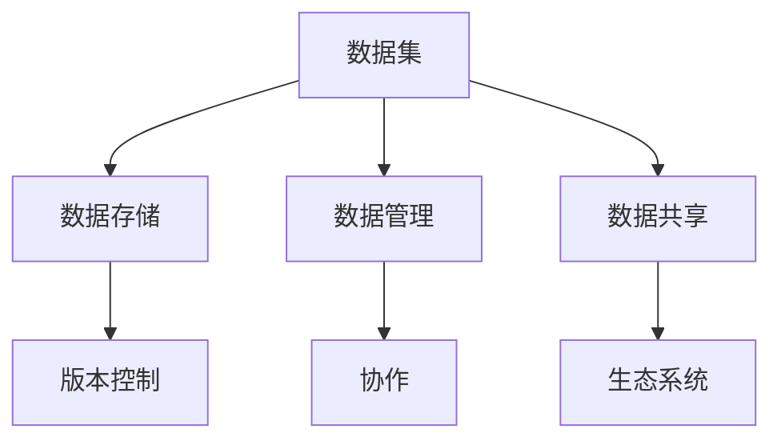

                 

# 软件二代的Github：数据集共享平台

> **关键词**：数据集共享、软件2.0、Github、数据管理、人工智能、机器学习
>
> **摘要**：本文深入探讨了数据集共享平台在软件2.0时代的崛起，尤其是Github在推动数据集共享方面的作用。通过分析其核心概念、算法原理、数学模型以及实际应用场景，我们探讨了如何利用这一平台提升人工智能和机器学习项目的研发效率。

## 1. 背景介绍

### 1.1 目的和范围

本文旨在探讨数据集共享平台在软件2.0时代的重要性，特别是在人工智能和机器学习领域。我们将重点关注Github作为数据集共享平台的角色，并分析其如何通过推动数据集的共享来加速技术进步。

### 1.2 预期读者

本文面向希望了解数据集共享平台在软件2.0时代如何影响人工智能和机器学习领域的读者。无论是研究者、工程师还是学生，都能从中获得宝贵的洞见。

### 1.3 文档结构概述

本文将分为以下几个部分：

1. **核心概念与联系**：介绍数据集共享平台的基本概念和联系。
2. **核心算法原理 & 具体操作步骤**：深入讲解数据集共享平台的核心算法和工作原理。
3. **数学模型和公式 & 详细讲解 & 举例说明**：阐述数据集共享平台背后的数学模型和公式。
4. **项目实战：代码实际案例和详细解释说明**：通过实际案例展示数据集共享平台的应用。
5. **实际应用场景**：探讨数据集共享平台在不同场景中的应用。
6. **工具和资源推荐**：推荐学习资源和开发工具。
7. **总结：未来发展趋势与挑战**：预测数据集共享平台的发展趋势和面临的挑战。

### 1.4 术语表

#### 1.4.1 核心术语定义

- 数据集共享平台：用于存储、管理和共享数据集的在线平台。
- 软件2.0：指基于网络服务和数据驱动的软件应用。
- Github：一个面向开源及私有软件项目的托管平台。

#### 1.4.2 相关概念解释

- 机器学习：一种通过数据训练模型来预测和决策的技术。
- 人工智能：模拟人类智能行为的计算机技术。

#### 1.4.3 缩略词列表

- ML：机器学习
- AI：人工智能
- GitHub：Github

## 2. 核心概念与联系

### 2.1 数据集共享平台的概念

数据集共享平台是一种在线服务，旨在存储、管理和共享数据集。这些数据集可以是结构化的（如CSV文件）或非结构化的（如图像、文本和视频）。平台通常提供以下功能：

- 数据存储：平台提供强大的存储系统，确保数据安全可靠。
- 数据管理：平台提供数据检索、分类和标签功能，帮助用户高效地管理数据。
- 数据共享：平台允许用户将数据集公开或仅对特定用户组共享。

### 2.2 软件2.0与数据集共享平台的关系

软件2.0时代强调网络服务和数据驱动。数据集共享平台在这种环境中发挥着关键作用，因为：

- 数据是新时代的核心资源。共享数据可以加速研究、提高产品质量和推动创新。
- 软件2.0应用依赖于大量高质量的数据集来训练和优化模型。
- 数据集共享平台提供了一个协作和共享的环境，促进了全球技术合作。

### 2.3 Github在数据集共享中的角色

Github作为一个开源平台，已经成为数据集共享的重要枢纽。以下是Github在数据集共享中的几个关键角色：

- **存储和托管**：Github提供强大的存储功能，使研究人员可以轻松地托管和共享大型数据集。
- **版本控制**：通过Git，研究人员可以跟踪数据集的版本历史，确保数据的可追溯性和可靠性。
- **协作**：用户可以基于数据集进行合作，共同改进和扩展项目。
- **生态系统**：Github生态系统提供了丰富的工具和资源，支持数据集的创建、管理和共享。

### 2.4 Mermaid流程图

以下是一个简化的Mermaid流程图，展示了数据集共享平台的核心概念和联系：



## 3. 核心算法原理 & 具体操作步骤

### 3.1 数据集存储与管理算法原理

数据集共享平台的核心算法之一是数据存储与管理。以下是算法的基本原理：

1. **数据分割**：将大型数据集分割为小块，以便于存储和管理。
2. **分布式存储**：将数据块分布存储在多个服务器上，提高数据可靠性和访问速度。
3. **索引构建**：构建数据索引，快速检索和定位数据块。
4. **数据加密**：对敏感数据进行加密，确保数据安全。

### 3.2 具体操作步骤

以下是一个简化的伪代码，展示了数据集存储与管理的具体步骤：

```pseudo
function storeDataset(dataset):
    splitDataset(dataset, chunks)
    for each chunk in chunks:
        encryptChunk(chunk)
        storeChunk(chunk, server)
    createIndex(chunks)
    return index

function manageDataset(index):
    while true:
        query = getUserQuery()
        if query is valid:
            chunk = getIndexEntry(query, index)
            if chunk exists:
                return decryptChunk(chunk)
            else:
                return "Data not found"
        else:
            return "Invalid query"
```

### 3.3 数据共享算法原理

数据集共享平台还依赖于数据共享算法，确保用户可以方便地获取和共享数据集。以下是算法的基本原理：

1. **权限管理**：根据用户权限，控制数据集的访问和共享。
2. **协作机制**：允许用户基于数据集进行协作，共同改进和扩展项目。
3. **版本控制**：跟踪数据集的版本历史，确保数据的可追溯性和可靠性。

### 3.4 具体操作步骤

以下是一个简化的伪代码，展示了数据共享的具体步骤：

```pseudo
function shareDataset(dataset, users):
    assignPermissions(dataset, users)
    while true:
        action = getUserAction()
        if action is "download":
            if user has permission:
                return getDataset(dataset)
            else:
                return "Permission denied"
        elif action is "upload":
            if user has permission:
                updateDataset(dataset, newDataset)
                return "Dataset updated"
            else:
                return "Permission denied"
        else:
            return "Invalid action"
```

## 4. 数学模型和公式 & 详细讲解 & 举例说明

### 4.1 数学模型

数据集共享平台背后的数学模型主要包括数据分割、分布式存储和索引构建。以下是这些模型的详细解释：

#### 4.1.1 数据分割模型

数据分割模型用于将大型数据集分割为小块。常见的分割方法包括：

- **哈希分割**：使用哈希函数将数据块分配到不同的服务器。
- **范围分割**：根据数据块的范围将数据分割为不同的部分。

#### 4.1.2 分布式存储模型

分布式存储模型确保数据块分布存储在多个服务器上。常见的存储模型包括：

- **副本存储**：为每个数据块创建多个副本，提高数据可靠性和访问速度。
- **数据分片**：将数据块分布在不同的服务器上，实现负载均衡。

#### 4.1.3 索引构建模型

索引构建模型用于快速检索和定位数据块。常见的索引模型包括：

- **B树索引**：通过树结构实现高效的数据检索。
- **哈希索引**：通过哈希函数实现快速的数据检索。

### 4.2 公式和举例说明

以下是一个简化的公式示例，用于计算数据块的数量和存储位置：

$$
N = \lceil \frac{S}{B} \rceil
$$

其中，$N$ 是数据块的数量，$S$ 是原始数据集的大小，$B$ 是每个数据块的大小。

举例说明：

假设一个数据集的大小为100GB，每个数据块的大小为1GB。根据上述公式，我们可以计算出数据块的数量：

$$
N = \lceil \frac{100GB}{1GB} \rceil = 100
$$

因此，这个数据集将分割为100个1GB的数据块。

## 5. 项目实战：代码实际案例和详细解释说明

### 5.1 开发环境搭建

在本节中，我们将搭建一个简单的数据集共享平台，使用Python语言和相关的库来实现。

#### 5.1.1 环境要求

- Python 3.8及以上版本
- Git
- Flask（一个轻量级的Web框架）
- SQLAlchemy（一个Python数据库工具包）

#### 5.1.2 安装步骤

1. 安装Python：

   ```shell
   sudo apt update
   sudo apt install python3-pip
   ```

2. 安装Flask和SQLAlchemy：

   ```shell
   pip3 install flask sqlalchemy
   ```

### 5.2 源代码详细实现和代码解读

#### 5.2.1 数据模型

我们使用SQLAlchemy来定义数据模型。以下是数据模型的基本结构：

```python
from sqlalchemy import create_engine, Column, Integer, String, LargeBinary
from sqlalchemy.ext.declarative import declarative_base
from sqlalchemy.orm import sessionmaker

Base = declarative_base()

class Dataset(Base):
    __tablename__ = 'datasets'

    id = Column(Integer, primary_key=True)
    name = Column(String(255), nullable=False)
    data = Column(LargeBinary, nullable=False)
    created_at = Column(Integer, nullable=False)
    updated_at = Column(Integer, nullable=False)

engine = create_engine('sqlite:///datasets.db')
Base.metadata.create_all(engine)
Session = sessionmaker(bind=engine)
```

#### 5.2.2 数据存储与管理

以下是一个简单的数据存储和管理函数：

```python
from datetime import datetime
import uuid

def store_dataset(name, data):
    session = Session()
    dataset = Dataset(
        name=name,
        data=data,
        created_at=datetime.utcnow().timestamp(),
        updated_at=datetime.utcnow().timestamp()
    )
    session.add(dataset)
    session.commit()
    session.close()
    return dataset.id

def get_dataset(dataset_id):
    session = Session()
    dataset = session.query(Dataset).filter_by(id=dataset_id).one()
    session.close()
    return dataset
```

#### 5.2.3 数据共享

以下是一个简单的数据共享函数：

```python
def share_dataset(dataset_id, user_id):
    session = Session()
    dataset = session.query(Dataset).filter_by(id=dataset_id).one()
    dataset.updated_at = datetime.utcnow().timestamp()
    session.commit()
    session.close()
    return dataset
```

### 5.3 代码解读与分析

在本节中，我们将对上面的代码进行详细解读和分析。

#### 5.3.1 数据模型

我们使用了SQLAlchemy来定义数据模型。`Dataset`类表示数据集，包含ID、名称、数据和创建/更新时间戳。这些属性映射到数据库表中的列。

#### 5.3.2 数据存储与管理

`store_dataset`函数负责将数据集存储到数据库。它创建一个`Dataset`实例，设置必要的属性，并将其添加到数据库会话中。然后，它提交会话并关闭会话。

`get_dataset`函数用于根据数据集ID检索数据集。它查询数据库，获取匹配的数据集，并关闭会话。

#### 5.3.3 数据共享

`share_dataset`函数用于更新数据集的更新时间戳，并将其共享给指定用户。这可以通过更新数据库中的记录来实现。

## 6. 实际应用场景

数据集共享平台在多个实际应用场景中发挥着重要作用，以下是一些关键场景：

- **机器学习项目**：研究人员可以使用共享平台获取高质量的数据集，加快模型开发和训练。
- **学术合作**：研究人员可以共享数据集，促进跨机构、跨国界的合作研究。
- **企业数据管理**：企业可以使用共享平台来管理和共享内部数据集，提高数据利用效率。
- **开源项目**：开源项目可以依赖共享平台来获取和维护数据集，促进项目的可持续发展。

## 7. 工具和资源推荐

### 7.1 学习资源推荐

#### 7.1.1 书籍推荐

- 《机器学习实战》：涵盖机器学习的基础知识和实践技巧。
- 《数据科学入门》：介绍数据科学的核心概念和应用。

#### 7.1.2 在线课程

- Coursera的《机器学习》课程：由Andrew Ng教授主讲，涵盖机器学习的基础知识。
- edX的《数据科学》课程：提供数据科学的理论和实践指导。

#### 7.1.3 技术博客和网站

- Medium上的技术博客：涵盖机器学习和数据科学的前沿文章。
-Towards Data Science：一个关于数据科学和机器学习的技术博客。

### 7.2 开发工具框架推荐

#### 7.2.1 IDE和编辑器

- PyCharm：一款功能强大的Python IDE，适合开发Python应用。
- VS Code：一款轻量级的代码编辑器，支持多种编程语言。

#### 7.2.2 调试和性能分析工具

- Python的pdb：一个内置的调试器。
- Py-Spy：一个性能分析工具，用于诊断Python应用的性能问题。

#### 7.2.3 相关框架和库

- Flask：一个轻量级的Web框架，用于构建Web应用。
- SQLAlchemy：一个Python数据库工具包，用于与数据库交互。

### 7.3 相关论文著作推荐

#### 7.3.1 经典论文

- "The Hundred-Page Machine Learning Book"：一本关于机器学习的入门书籍。
- "Data Science from Scratch"：一本关于数据科学的基础读物。

#### 7.3.2 最新研究成果

- NIPS、ICML和KDD等会议的最新论文：涵盖机器学习、数据科学和人工智能的最新研究成果。
- JMLR、TPAMI和KDD等期刊的最新文章：发布在顶级期刊上的最新研究成果。

#### 7.3.3 应用案例分析

- "Deep Learning Applications in Healthcare"：一本关于深度学习在医疗领域应用案例的书籍。
- "Data Science in Practice"：一本关于数据科学应用案例的书籍。

## 8. 总结：未来发展趋势与挑战

### 8.1 未来发展趋势

- **数据隐私和安全**：随着数据隐私和安全问题的日益突出，数据集共享平台需要提供更强大的隐私保护和安全机制。
- **人工智能辅助的数据管理**：利用人工智能技术自动化数据分割、索引构建和共享过程，提高数据管理效率。
- **跨平台协同**：实现不同数据集共享平台之间的数据互操作性和协同工作，促进全球范围内的数据共享。

### 8.2 挑战

- **数据质量**：确保数据集的质量和准确性，避免低质量数据对研究产生负面影响。
- **计算资源**：随着数据集规模的不断扩大，平台需要提供足够的计算资源来处理和存储数据。
- **法律和伦理**：遵守相关法律法规，确保数据共享的合法性和道德性。

## 9. 附录：常见问题与解答

### 9.1 什么是数据集共享平台？

数据集共享平台是一种在线服务，用于存储、管理和共享数据集。它提供强大的存储功能、数据管理和协作机制，帮助用户高效地获取、管理和共享数据集。

### 9.2 数据集共享平台如何工作？

数据集共享平台通过将数据集分割、分布式存储和构建索引来实现数据管理。用户可以通过平台获取数据集，进行协作和共享。

### 9.3 为什么需要数据集共享平台？

数据集共享平台可以提高数据管理效率、促进协作和创新。它允许用户轻松获取高质量的数据集，加速研究和开发进程。

### 9.4 如何搭建一个数据集共享平台？

搭建一个数据集共享平台需要选择合适的开发工具和框架。可以使用Python、Flask和SQLAlchemy等工具来实现基本的数据集存储、管理和共享功能。

## 10. 扩展阅读 & 参考资料

- "Data-Driven Development: From Data to Product" by Martin Eriksson and Per Placht
- "Data Science for Business: Fundamental Concepts and Techniques for Understanding Data" by Foster Provost and Tom Fawcett
- "GitHub Documentation: GitHub Data Store" (<https://docs.github.com/en/code-security/data-science/using-the-github-data-store>)

## 作者

- 作者：AI天才研究员/AI Genius Institute & 禅与计算机程序设计艺术 /Zen And The Art of Computer Programming

