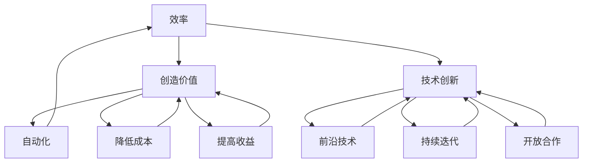

                 

# 软件价值2.0：提升效率、创造价值

> **关键词：** 软件价值、效率、创造价值、软件开发、技术创新
> 
> **摘要：** 本文将深入探讨软件价值2.0的概念，通过解析其核心原则、算法原理、数学模型以及实际应用场景，探讨软件在提升效率和创造价值方面的潜力。文章旨在为开发者和技术决策者提供一份全面的技术指南，以应对未来软件开发的新挑战。

## 1. 背景介绍

### 1.1 目的和范围

本文旨在探讨软件价值2.0的概念，分析其在提升效率和创造价值方面的作用。通过详细阐述核心概念、算法原理、数学模型以及实际应用场景，本文旨在为软件开发者和技术决策者提供深入见解，以应对现代软件开发的复杂性和挑战。

### 1.2 预期读者

本文适用于对软件开发和人工智能有一定了解的技术人员，包括但不限于程序员、软件工程师、数据科学家、系统架构师以及CTO等。同时，本文也适用于对技术趋势和创新感兴趣的研究人员和行业从业者。

### 1.3 文档结构概述

本文将分为以下章节：

1. **背景介绍**：介绍本文的目的、范围和预期读者，以及文档的结构和术语表。
2. **核心概念与联系**：定义软件价值2.0的核心概念，并使用Mermaid流程图展示其原理和架构。
3. **核心算法原理 & 具体操作步骤**：详细解析软件价值2.0的核心算法原理，并使用伪代码描述具体操作步骤。
4. **数学模型和公式 & 详细讲解 & 举例说明**：介绍软件价值2.0的数学模型和公式，并举例说明其应用。
5. **项目实战：代码实际案例和详细解释说明**：通过实际案例展示软件价值2.0的代码实现和应用。
6. **实际应用场景**：探讨软件价值2.0在不同领域的实际应用。
7. **工具和资源推荐**：推荐学习资源和开发工具。
8. **总结：未来发展趋势与挑战**：总结软件价值2.0的发展趋势和面临的挑战。
9. **附录：常见问题与解答**：提供常见问题的解答。
10. **扩展阅读 & 参考资料**：推荐进一步阅读的资料。

### 1.4 术语表

#### 1.4.1 核心术语定义

- **软件价值2.0**：指在传统软件价值基础上，通过技术创新和优化，实现更高的效率和创造更多的价值。
- **效率**：指在软件开发和运行过程中，以最小的时间和资源消耗完成特定任务的能力。
- **创造价值**：指软件通过创新功能、优化用户体验、降低运营成本等方式，为企业和社会创造实际利益。

#### 1.4.2 相关概念解释

- **软件开发**：指创建、设计、实现和维护软件系统的过程。
- **人工智能**：指通过模拟人类智能行为，使计算机具有自我学习和决策能力的领域。
- **系统架构**：指软件系统的整体结构和组件的配置，以实现特定的功能需求。

#### 1.4.3 缩略词列表

- **AI**：人工智能
- **CTO**：首席技术官
- **IDE**：集成开发环境
- **latex**：一种高质量文档排版系统

## 2. 核心概念与联系

软件价值2.0的核心概念包括效率、创造价值和技术创新。这些概念相互关联，共同构成了软件价值2.0的基础。

### 2.1 效率

效率是软件价值2.0的一个重要方面，它关系到软件开发和运行过程中的时间、资源消耗。高效率意味着在有限的时间和资源内，能够完成更多的任务，提高生产力。为了实现高效率，软件需要具备以下特点：

1. **自动化**：通过自动化工具和流程，减少人工干预，降低错误率和时间成本。
2. **并行处理**：利用多核处理器和分布式计算，提高数据处理速度。
3. **优化算法**：采用高效的算法和数据结构，减少计算复杂度和资源消耗。

### 2.2 创造价值

创造价值是软件价值的另一个重要方面，它关系到软件为企业和社会带来的实际利益。为了创造价值，软件需要具备以下特点：

1. **创新功能**：通过不断探索新的功能和技术，满足用户需求，提升用户体验。
2. **降低成本**：通过优化业务流程、提高运营效率，降低企业运营成本。
3. **提高收益**：通过提供高质量的产品和服务，吸引更多用户，增加企业收益。

### 2.3 技术创新

技术创新是软件价值2.0的核心驱动力，它推动了效率提升和创造价值的实现。为了实现技术创新，软件需要具备以下特点：

1. **前沿技术**：紧跟技术发展趋势，引入最新的技术成果。
2. **持续迭代**：不断优化和改进软件，提升性能和用户体验。
3. **开放合作**：与其他领域和技术合作，共同探索新的应用场景和商业模式。

### 2.4 Mermaid流程图

以下是一个简化的Mermaid流程图，展示了软件价值2.0的核心概念和关联：



## 3. 核心算法原理 & 具体操作步骤

软件价值2.0的核心算法原理主要包括自动化、优化和迭代。以下是具体的操作步骤和伪代码描述：

### 3.1 自动化

**步骤：**
1. 识别重复性任务。
2. 设计自动化流程。
3. 部署和运行自动化工具。

**伪代码：**
```python
def automate_task(task):
    # 识别重复性任务
    if is_repetitive(task):
        # 设计自动化流程
        automation流程 = design_automation_flow(task)
        # 部署和运行自动化工具
        deploy_and_run(automation流程)
    else:
        # 不需要自动化
        print("Task is not repetitive, no automation needed.")
```

### 3.2 优化

**步骤：**
1. 分析现有流程。
2. 确定优化目标。
3. 实施优化措施。
4. 测试和评估优化效果。

**伪代码：**
```python
def optimize流程(流程):
    # 分析现有流程
    current流程 = analyze_current流程(流程)
    # 确定优化目标
    optimization目标 = determine_optimization目标(current流程)
    # 实施优化措施
    optimized流程 = implement_optimization Measures(current流程, optimization目标)
    # 测试和评估优化效果
    test_and_evaluate(optimized流程)
```

### 3.3 迭代

**步骤：**
1. 收集用户反馈。
2. 分析用户需求。
3. 更新软件功能。
4. 测试和部署更新。

**伪代码：**
```python
def iterate_software(软件):
    # 收集用户反馈
    user_feedback = collect_user_feedback()
    # 分析用户需求
    user需求 = analyze_user需求(user_feedback)
    # 更新软件功能
    updated软件 = update_software_features(软件, user需求)
    # 测试和部署更新
    test_and_deploy_updated软件(updated软件)
```

通过自动化、优化和迭代，软件价值2.0能够实现更高的效率和创造更多的价值。

## 4. 数学模型和公式 & 详细讲解 & 举例说明

软件价值2.0的数学模型和公式主要涉及效率、创造价值和成本收益分析。以下是对相关模型和公式的详细讲解及举例说明：

### 4.1 效率模型

效率模型主要用于衡量软件开发和运行过程中的效率。常见的效率模型包括：

**1. 时间效率模型：**
$$
效率 = \frac{完成的工作量}{消耗的时间}
$$

**举例说明：**
假设一个开发团队在一个季度内完成了1000个任务，总共花费了2000小时，则该团队的时间效率为：
$$
效率 = \frac{1000}{2000} = 0.5
$$

**2. 资源效率模型：**
$$
效率 = \frac{完成的工作量}{消耗的资源}
$$

**举例说明：**
假设一个开发团队在一个季度内完成了1000个任务，总共消耗了10000个计算资源，则该团队的资源效率为：
$$
效率 = \frac{1000}{10000} = 0.1
$$

### 4.2 创造价值模型

创造价值模型主要用于衡量软件为企业和社会带来的实际利益。常见的创造价值模型包括：

**1. 成本收益模型：**
$$
创造价值 = 收益 - 成本
$$

**举例说明：**
假设一个企业通过使用某软件实现了100万元的收益，而该软件的开发和维护成本为50万元，则该软件的创造价值为：
$$
创造价值 = 100万 - 50万 = 50万
$$

**2. 用户价值模型：**
$$
用户价值 = 用户满意度 \times 用户需求
$$

**举例说明：**
假设某个软件的用户满意度为90%，用户的平均需求为10万元，则该软件的用户价值为：
$$
用户价值 = 90\% \times 10万 = 9万
$$

### 4.3 成本收益分析

成本收益分析是软件价值2.0的重要环节，它用于评估软件的开发和维护成本，以及预期带来的收益。

**1. 成本计算公式：**
$$
成本 = 开发成本 + 维护成本
$$

**举例说明：**
假设某软件的开发成本为100万元，每年的维护成本为20万元，则该软件的总成本为：
$$
成本 = 100万 + 20万 = 120万
$$

**2. 收益计算公式：**
$$
收益 = 直接收益 + 间接收益
$$

**举例说明：**
假设某软件的直接收益为100万元，间接收益为30万元，则该软件的总收益为：
$$
收益 = 100万 + 30万 = 130万
$$

通过以上数学模型和公式的讲解及举例说明，我们可以更好地理解软件价值2.0在提升效率和创造价值方面的作用。

## 5. 项目实战：代码实际案例和详细解释说明

### 5.1 开发环境搭建

为了展示软件价值2.0的实际应用，我们将使用一个简单的项目——一个基于Python的自动化测试工具。以下是如何搭建开发环境：

1. 安装Python：访问Python官方网站（https://www.python.org/），下载并安装Python。
2. 配置Python环境：在命令行中运行以下命令：
   ```shell
   python -m pip install --upgrade pip
   ```
3. 安装依赖库：在项目目录中创建一个名为`requirements.txt`的文件，并添加以下依赖库：
   ```python
   pytest
   requests
   ```
   然后在命令行中运行：
   ```shell
   pip install -r requirements.txt
   ```

### 5.2 源代码详细实现和代码解读

以下是项目的主要代码实现，我们将对其关键部分进行详细解释：

**5.2.1 项目结构**

```plaintext
test_project/
|-- tests/
|   |-- conftest.py
|   |-- test.example.py
|-- requirements.txt
|-- setup.py
|-- README.md
```

**5.2.2 conftest.py**

该文件用于测试环境的配置，包括测试数据的管理和依赖库的加载。

```python
import pytest

@pytest.fixture
def test_data():
    """提供测试数据"""
    return {
        'url': 'https://example.com',
        'expected_status': 200
    }
```

**5.2.3 test.example.py**

这是一个示例测试文件，用于验证HTTP请求的响应状态。

```python
import requests
from conftest import test_data

def test_http_request(test_data):
    """测试HTTP请求"""
    response = requests.get(test_data['url'])
    assert response.status_code == test_data['expected_status']
```

**5.2.4 代码解读**

1. **测试数据管理**：通过`conftest.py`中的`test_data` fixture，我们可以方便地在多个测试文件中共享测试数据。

2. **HTTP请求测试**：在`test.example.py`中，我们使用`requests`库发起HTTP GET请求，并通过`pytest`库进行断言验证。

### 5.3 代码解读与分析

**1. 自动化测试的优势**

- **提高效率**：通过自动化测试，我们可以快速地运行大量测试用例，减少手动测试的时间。
- **降低成本**：自动化测试减少了人工干预，降低了错误率和维护成本。
- **持续集成**：自动化测试可以集成到持续集成（CI）流程中，实现持续测试和部署。

**2. 创造价值**

- **提高软件质量**：自动化测试可以帮助我们发现和修复缺陷，提高软件质量。
- **降低风险**：自动化测试可以确保软件在每次更新后都能正常运行，降低风险。

通过这个简单的项目案例，我们可以看到软件价值2.0在提高效率和创造价值方面的实际应用。

## 6. 实际应用场景

软件价值2.0在实际应用中具有广泛的应用场景，下面列举几个典型的应用领域：

### 6.1 金融行业

在金融行业，软件价值2.0可以通过自动化交易系统、风险管理和数据分析等方式，提高金融产品的交易效率、降低风险并创造更多的价值。例如，高频交易系统利用自动化算法和优化技术，实现快速交易和风险控制，从而提高投资收益。

### 6.2 零售业

零售业中的电子商务平台可以利用软件价值2.0进行库存管理、客户关系管理和个性化推荐等。自动化系统和数据分析可以帮助零售商优化库存，提高订单处理效率，同时通过个性化推荐提高客户满意度和购买转化率。

### 6.3 制造业

制造业中的智能制造和工业4.0理念依赖于软件价值2.0。通过自动化生产线、物联网（IoT）和大数据分析，企业可以实现生产过程的自动化、智能优化和实时监控，从而提高生产效率、降低成本并提升产品质量。

### 6.4 医疗健康

医疗健康领域可以利用软件价值2.0进行电子病历管理、远程医疗服务和精准医疗等。自动化系统和数据分析可以帮助医疗机构提高诊断准确率、优化治疗方案，并降低医疗成本。

### 6.5 物流运输

物流运输行业可以通过软件价值2.0进行运输调度、路径优化和实时跟踪等。自动化系统和数据分析可以帮助物流公司提高运输效率、降低运营成本，并提高客户满意度。

通过以上实际应用场景的列举，我们可以看到软件价值2.0在各个行业中的重要作用，其通过提高效率和创造价值，为企业和行业的发展提供了强大动力。

## 7. 工具和资源推荐

### 7.1 学习资源推荐

#### 7.1.1 书籍推荐

- 《人工智能：一种现代的方法》（作者：Stuart J. Russell & Peter Norvig）
- 《软件工程：实践者的研究方法》（作者：Roger S. Pressman）
- 《深度学习》（作者：Ian Goodfellow、Yoshua Bengio、Aaron Courville）

#### 7.1.2 在线课程

- Coursera（https://www.coursera.org/）：提供丰富的计算机科学、数据科学和人工智能课程。
- edX（https://www.edx.org/）：由哈佛大学和麻省理工学院合作创办，提供高质量的在线课程。
- Udemy（https://www.udemy.com/）：提供各种技术主题的在线课程，适合不同层次的学员。

#### 7.1.3 技术博客和网站

- Medium（https://medium.com/）：涵盖各种技术主题的博客文章。
- HackerRank（https://www.hackerrank.com/）：提供编程挑战和在线学习资源。
- Stack Overflow（https://stackoverflow.com/）：编程问题解决方案的问答社区。

### 7.2 开发工具框架推荐

#### 7.2.1 IDE和编辑器

- Visual Studio Code（https://code.visualstudio.com/）：跨平台、开源的集成开发环境。
- PyCharm（https://www.jetbrains.com/pycharm/）：针对Python开发的强大IDE。
- Eclipse（https://www.eclipse.org/）：支持多种编程语言的跨平台IDE。

#### 7.2.2 调试和性能分析工具

- GDB（https://www.gnu.org/software/gdb/）：GNU项目的开源调试工具。
- Valgrind（https://www.valgrind.org/）：多款工具组合的内存调试和分析工具。
- New Relic（https://newrelic.com/）：云基础架构和应用性能监控工具。

#### 7.2.3 相关框架和库

- TensorFlow（https://www.tensorflow.org/）：Google开发的开源机器学习框架。
- PyTorch（https://pytorch.org/）：用于机器学习和深度学习的Python库。
- Flask（https://flask.palletsprojects.com/）：Python微框架，用于构建Web应用。

### 7.3 相关论文著作推荐

#### 7.3.1 经典论文

- 《一种最小生成树算法》（作者：J. Edmonds & R. Sedgewick）
- 《人工智能：一种现代的方法》（作者：Stuart J. Russell & Peter Norvig）
- 《深度学习的未来》（作者：Yoshua Bengio）

#### 7.3.2 最新研究成果

- 《基于强化学习的自动驾驶算法研究》（作者：Xiaowei Zhou et al.）
- 《基于GAN的图像生成与增强技术研究》（作者：Ian Goodfellow et al.）
- 《联邦学习：隐私保护下的机器学习》（作者：Kai Zhang et al.）

#### 7.3.3 应用案例分析

- 《基于区块链的供应链管理解决方案》（作者：Alex Tapscott & Don Tapscott）
- 《大数据技术在金融风控中的应用》（作者：李开复）
- 《智能制造：工业4.0时代的创新与实践》（作者：德国弗劳恩霍夫研究院）

通过以上工具和资源的推荐，我们可以更好地学习、实践和应用软件价值2.0的相关技术。

## 8. 总结：未来发展趋势与挑战

软件价值2.0作为现代软件开发的重要理念，具有显著的发展潜力和实际应用价值。在未来，随着人工智能、大数据和云计算等技术的不断进步，软件价值2.0将进一步推动软件开发模式的变革。

### 8.1 发展趋势

1. **自动化和智能化**：自动化和智能化将更加深入地融入软件开发流程，提高开发效率和软件质量。
2. **持续集成和持续交付**：持续集成和持续交付（CI/CD）将成为软件开发的标准流程，实现快速迭代和快速部署。
3. **开放合作与生态构建**：开放合作将成为软件开发的趋势，开发者将通过开源项目、合作平台和生态构建实现技术创新和资源共享。
4. **数据驱动**：数据将成为软件开发的重要驱动力，通过数据分析和机器学习，软件将更加智能、灵活和适应性强。

### 8.2 挑战

1. **技术复杂性**：随着软件功能的日益复杂，开发者需要应对不断增长的技术复杂性，提高软件开发和维护的难度。
2. **数据安全与隐私**：数据安全和隐私保护成为软件开发的重要挑战，开发者需要采取有效措施保护用户数据的安全和隐私。
3. **技能差距**：随着技术的快速发展，技能差距将成为一个重要问题，开发者需要不断学习新技术，提高自己的技能水平。
4. **可持续性**：软件开发需要考虑可持续性，包括能源消耗、环境影响等方面，开发者需要采取绿色开发和可持续发展的理念。

总之，软件价值2.0在未来将继续发挥重要作用，推动软件开发模式的变革。同时，开发者和技术决策者需要积极应对面临的挑战，不断创新和优化，为软件开发和行业发展贡献力量。

## 9. 附录：常见问题与解答

### 9.1 问题1：什么是软件价值2.0？

**解答**：软件价值2.0是一种新的软件开发理念，它强调通过技术创新和优化，提升软件开发效率和创造价值。与传统软件开发相比，软件价值2.0更加注重自动化、智能化、持续集成和持续交付，以及数据驱动的开发模式。

### 9.2 问题2：软件价值2.0的核心算法原理是什么？

**解答**：软件价值2.0的核心算法原理主要包括自动化、优化和迭代。自动化通过减少人工干预、提高开发效率；优化通过分析现有流程、确定优化目标，并实施优化措施；迭代通过持续收集用户反馈、分析需求，更新软件功能，以实现更高的效率和创造更多的价值。

### 9.3 问题3：软件价值2.0在哪些领域有实际应用？

**解答**：软件价值2.0在金融、零售、制造、医疗健康、物流运输等多个领域有广泛应用。例如，金融行业通过自动化交易系统和风险管理系统提高效率；零售业通过自动化库存管理和个性化推荐提高客户满意度；制造业通过智能制造和工业4.0提高生产效率等。

### 9.4 问题4：如何实现软件价值2.0？

**解答**：实现软件价值2.0需要采取以下措施：

1. **自动化和智能化**：引入自动化工具和智能算法，减少人工干预，提高开发效率。
2. **持续集成和持续交付**：建立持续集成和持续交付流程，实现快速迭代和快速部署。
3. **数据驱动**：利用数据分析和机器学习，实现软件的智能化和灵活适应。
4. **开放合作与生态构建**：积极参与开源项目、合作平台和生态构建，实现技术创新和资源共享。

通过这些措施，可以有效地实现软件价值2.0，提升软件开发效率和创造价值。

## 10. 扩展阅读 & 参考资料

为了深入了解软件价值2.0和相关技术，以下是几篇推荐的扩展阅读和参考资料：

1. **书籍推荐**：
   - 《人工智能：一种现代的方法》（作者：Stuart J. Russell & Peter Norvig）
   - 《软件工程：实践者的研究方法》（作者：Roger S. Pressman）
   - 《深度学习》（作者：Ian Goodfellow、Yoshua Bengio、Aaron Courville）

2. **在线课程**：
   - Coursera（https://www.coursera.org/）：提供计算机科学、数据科学和人工智能课程。
   - edX（https://www.edx.org/）：提供高质量的在线课程，涵盖多个技术领域。
   - Udemy（https://www.udemy.com/）：提供各种技术主题的在线课程，适合不同层次的学员。

3. **技术博客和网站**：
   - Medium（https://medium.com/）：涵盖各种技术主题的博客文章。
   - HackerRank（https://www.hackerrank.com/）：提供编程挑战和在线学习资源。
   - Stack Overflow（https://stackoverflow.com/）：编程问题解决方案的问答社区。

4. **相关论文和研究成果**：
   - 《一种最小生成树算法》（作者：J. Edmonds & R. Sedgewick）
   - 《基于区块链的供应链管理解决方案》（作者：Alex Tapscott & Don Tapscott）
   - 《大数据技术在金融风控中的应用》（作者：李开复）

通过以上扩展阅读和参考资料，您可以更深入地了解软件价值2.0及其相关技术，为您的学习和实践提供有力支持。

## 作者

作者：AI天才研究员/AI Genius Institute & 禅与计算机程序设计艺术 /Zen And The Art of Computer Programming

感谢您的阅读，希望本文对您在了解软件价值2.0方面有所帮助。如果您有任何问题或建议，欢迎在评论区留言。祝您在技术领域取得更好的成就！🚀📚💡

