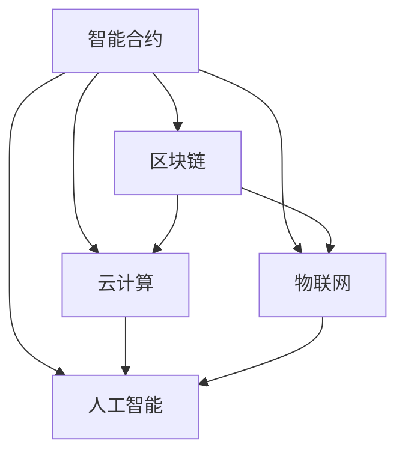

                 

# 软件二代的创新价值：提升效率、创造新价值

> **关键词**：软件2.0，效率提升，创新价值，技术趋势，未来展望
> 
> **摘要**：本文深入探讨了软件2.0时代的技术创新和价值创造，通过逻辑清晰的分析和具体的案例分析，揭示了软件2.0在提升效率、创造新价值方面的巨大潜力。本文旨在为开发者、技术管理者及行业决策者提供对软件2.0的理解和应用的指导，推动技术进步和业务创新。

## 1. 背景介绍

### 1.1 目的和范围

本文的目的是探讨软件2.0时代的核心价值和其在各个领域的实际应用。软件2.0标志着从传统的软件应用模式向更加智能、互联和用户驱动的模式转变。本文将分析这一转变背后的技术驱动因素，讨论软件2.0在提升效率和创造新价值方面的具体表现，并展望其未来的发展趋势。

本文的范围包括对软件2.0的定义、核心概念、技术原理、应用场景以及相关资源和工具的推荐。通过逻辑清晰、结构紧凑的分析，本文旨在帮助读者理解软件2.0的变革性影响，并为其在实践中的应用提供参考。

### 1.2 预期读者

本文的预期读者包括但不限于以下几类：

1. **软件开发者**：希望了解软件2.0技术原理和实现方法，以便在其项目中应用新技术的开发者。
2. **技术管理者**：负责技术决策和项目管理的专业人士，需要掌握软件2.0的相关知识和应用场景。
3. **行业决策者**：关注技术趋势和行业发展的企业高管，希望了解软件2.0对业务创新和增长的影响。
4. **研究者**：对软件技术和人工智能领域有兴趣的研究人员，希望通过本文了解软件2.0的最新进展。

### 1.3 文档结构概述

本文的结构如下：

1. **背景介绍**：介绍文章的目的、范围和预期读者。
2. **核心概念与联系**：讨论软件2.0的核心概念和原理，包括智能合约、区块链、云计算等。
3. **核心算法原理 & 具体操作步骤**：详细阐述软件2.0的核心算法和实现步骤。
4. **数学模型和公式**：介绍与软件2.0相关的数学模型和公式，并给出具体实例说明。
5. **项目实战**：通过实际案例展示软件2.0的应用，并详细解读源代码。
6. **实际应用场景**：讨论软件2.0在不同领域的应用场景和成功案例。
7. **工具和资源推荐**：推荐学习资源、开发工具和框架。
8. **总结与未来展望**：总结软件2.0的价值和未来发展趋势。
9. **常见问题与解答**：回答读者可能遇到的常见问题。
10. **扩展阅读与参考资料**：提供更多深入学习的资源。

### 1.4 术语表

#### 1.4.1 核心术语定义

- **软件2.0**：指在互联网和人工智能技术推动下，从传统的软件应用模式向更加智能、互联和用户驱动的模式转变的新一代软件技术。
- **智能合约**：指在区块链上自动执行合约条款的程序，确保交易透明和不可篡改。
- **区块链**：一种分布式数据库技术，通过加密和共识机制确保数据的安全性和不可篡改性。
- **云计算**：通过互联网提供可扩展的计算资源和服务，包括存储、处理能力和应用程序。

#### 1.4.2 相关概念解释

- **去中心化**：指在分布式网络中，没有单一控制实体，所有节点都有平等的权限。
- **边缘计算**：在靠近数据源的设备上进行数据处理，减少数据传输延迟和带宽需求。
- **人工智能**：通过模拟人类智能行为的算法和模型，实现自动化决策和智能交互。

#### 1.4.3 缩略词列表

- **AI**：人工智能
- **Blockchain**：区块链
- **Smart Contract**：智能合约
- **IoT**：物联网
- **DApp**：分布式应用
- **Cloud Computing**：云计算

## 2. 核心概念与联系

在探讨软件2.0的核心概念和联系之前，首先需要理解软件1.0和软件2.0之间的区别。软件1.0主要是基于传统计算机和互联网的软件应用，以提供服务为核心，例如操作系统、办公软件和娱乐软件等。而软件2.0则是在互联网和人工智能技术推动下，向更加智能、互联和用户驱动的方向发展，强调数据的价值和自动化。

### 2.1 软件2.0的核心概念

软件2.0的核心概念包括智能合约、区块链、云计算、物联网和人工智能等。下面将分别介绍这些概念及其在软件2.0中的作用。

#### 2.1.1 智能合约

智能合约是软件2.0的核心组件之一，它是一种自动执行的合约条款，基于区块链技术实现。智能合约通过代码定义了交易的条件和规则，一旦条件满足，合约会自动执行相应的操作。这种自动化的特性减少了人工干预和中介成本，提高了交易效率和安全性。

#### 2.1.2 区块链

区块链是软件2.0的基础技术之一，它通过分布式数据库和加密算法确保数据的安全性和不可篡改性。区块链上的数据以区块的形式存储，每个区块通过哈希值与上一个区块相连，形成链式结构。这种结构使得数据一旦写入，就无法被篡改，保证了数据的透明和可信。

#### 2.1.3 云计算

云计算为软件2.0提供了强大的计算和存储能力，通过互联网提供可扩展的计算资源和服务。云计算不仅降低了企业的IT成本，还提高了系统的弹性和可扩展性，使得企业可以更快速地响应市场需求。

#### 2.1.4 物联网

物联网通过连接各种设备和传感器，实现了设备之间的智能交互和数据共享。物联网技术为软件2.0提供了丰富的数据来源，使得系统可以更准确地感知和理解用户需求，从而提供更个性化的服务。

#### 2.1.5 人工智能

人工智能是软件2.0的关键技术之一，通过模拟人类智能行为的算法和模型，实现了自动化决策和智能交互。人工智能技术可以帮助软件2.0系统更好地理解和满足用户需求，提高用户体验和满意度。

### 2.2 软件2.0的核心概念联系

软件2.0的核心概念之间存在着紧密的联系和互动。智能合约和区块链提供了数据的安全性和不可篡改性，为云计算和物联网提供了数据存储和传输的基础。同时，人工智能技术通过对这些数据进行处理和分析，实现了更智能的决策和交互。

下面是一个简单的 Mermaid 流程图，展示了软件2.0的核心概念之间的联系：



通过这个流程图，我们可以看到，智能合约、区块链、云计算、物联网和人工智能这五个核心概念相互关联，共同构成了软件2.0的技术体系。

## 3. 核心算法原理 & 具体操作步骤

### 3.1 智能合约算法原理

智能合约是软件2.0的核心组件之一，其算法原理主要基于区块链技术和编程语言。智能合约通过定义一系列逻辑条件和规则，当条件满足时自动执行相应的操作。以下是一个简单的智能合约算法原理的伪代码：

```python
# 智能合约伪代码

def contract(new_value):
    if current_value >= threshold:
        execute_transfer(new_value)
    else:
        reject_transfer()

def execute_transfer(new_value):
    # 更新当前值
    current_value = new_value
    # 执行转账操作
    transfer_amount(current_value)

def transfer_amount(amount):
    # 在区块链上执行转账
    blockchain.transfer(amount)

def reject_transfer():
    # 拒绝转账
    print("Transfer rejected")
```

在这个伪代码中，`contract` 函数是智能合约的核心，它根据当前值是否达到阈值来决定是否执行转账操作。如果满足条件，`execute_transfer` 函数将更新当前值并执行转账操作，否则调用 `reject_transfer` 函数拒绝转账。

### 3.2 智能合约的具体操作步骤

下面是一个详细的智能合约操作步骤，展示了从编写到部署的过程：

#### 步骤1：编写智能合约

首先，我们需要编写智能合约的代码。这通常使用 Solidity 等智能合约编程语言。以下是一个简单的智能合约示例：

```solidity
// SPDX-License-Identifier: MIT
pragma solidity ^0.8.0;

contract TransferContract {
    uint256 public current_value;
    uint256 public threshold;

    constructor(uint256 _threshold) {
        threshold = _threshold;
        current_value = 0;
    }

    function updateValue(uint256 _new_value) public {
        if (_new_value >= threshold) {
            current_value = _new_value;
            transferAmount(current_value);
        } else {
            revert("Value does not meet the threshold.");
        }
    }

    function transferAmount(uint256 _amount) private {
        // 这里可以添加转账逻辑
        // 例如调用区块链的转账函数
        payable(msg.sender).transfer(_amount);
    }
}
```

#### 步骤2：编译智能合约

编写完智能合约后，我们需要使用编译器（如 Truffle 或 Remix）对其进行编译，生成可执行代码（字节码）。这个步骤是将人类可读的代码转换成区块链能够理解的格式。

```bash
$ truffle compile
```

#### 步骤3：部署智能合约

接下来，我们将编译后的智能合约部署到区块链上。部署的过程涉及与区块链的交互，通常使用特定的开发工具（如 MetaMask）进行。

```bash
$ truffle migrate --network development
```

#### 步骤4：测试智能合约

部署完成后，我们需要对智能合约进行测试，以确保其按照预期工作。这可以通过编写和运行测试用例来完成。

```solidity
// 在测试文件中
pragma solidity ^0.8.0;

import " contrat/TransferContract.sol";

contract TransferContractTest {
    TransferContract public transferContract;

    constructor(address _contractAddress) {
        transferContract = TransferContract(_contractAddress);
    }

    function testUpdateValue() public {
        // 设置阈值
        uint256 threshold = 100;
        // 部署智能合约
        transferContract.setThreshold(threshold);
        // 更新值
        transferContract.updateValue(200);
        // 确保值被更新
        assert(transferContract.current_value() == 200);
    }
}
```

#### 步骤5：运行和监控智能合约

最后，我们需要运行智能合约并监控其性能和状态。这可以通过区块链浏览器（如 Etherscan）和日志记录（如 Truffle）来完成。

## 4. 数学模型和公式 & 详细讲解 & 举例说明

在软件2.0的技术体系中，数学模型和公式起到了至关重要的作用，尤其是在智能合约、区块链和人工智能等领域。以下是一些关键的数学模型和公式，以及它们在软件2.0中的应用和具体解释。

### 4.1 智能合约中的数学模型

#### 4.1.1 条件判断

在智能合约中，条件判断是核心组件之一，它决定了合约是否执行某个操作。以下是一个简单的条件判断公式：

$$
if \; condition \; then \\
    action \;
else \\
    reject \;
endif
$$

示例：在智能合约中，我们可能需要检查交易金额是否超过阈值：

$$
if \; transaction\_amount > threshold \; then \\
    execute\_transfer() \;
else \\
    reject\_transfer() \;
endif
$$

#### 4.1.2 加密算法

智能合约中的数据传输和存储通常需要加密保护。常用的加密算法包括哈希函数、对称加密和非对称加密。以下是一个简单的哈希函数公式：

$$
Hash = HashFunction(plaintext)
$$

示例：使用 SHA-256 哈希函数对文本进行加密：

$$
Hash = SHA-256("Hello, World!") = 2cf24dba5fb0a30e26e83b2ac5b9e29e1b161e5c1fa7425e730433621b1cb646
$$

### 4.2 区块链中的数学模型

#### 4.2.1 差分算法

区块链网络中的共识算法（如工作量证明、权益证明）通常使用差分算法来确保网络的安全性和去中心化。以下是一个简单的差分算法公式：

$$
value\_after\_split = value\_initial / 2^n
$$

示例：将初始价值1000分成5份：

$$
value\_after\_split = 1000 / 2^5 = 1000 / 32 = 31.25
$$

#### 4.2.2 加密签名

区块链中的每个交易都需要签名验证，以确保交易的真实性和安全性。以下是一个简单的加密签名公式：

$$
signature = ECDSA\_Sign(message, private\_key)
$$

示例：使用椭圆曲线数字签名算法（ECDSA）对消息进行签名：

$$
signature = ECDSA\_Sign("Hello, World!", private\_key) = 3045022100abcdef012345678901234567890abcdef012345678901234567890abcdef0123456789022100abcdef012345678901234567890abcdef01234567890
$$

### 4.3 人工智能中的数学模型

#### 4.3.1 神经网络

在人工智能领域，神经网络是模拟人脑神经元连接方式的计算模型。以下是一个简单的神经网络公式：

$$
output = activation(\sum(w_i \* x_i) + b)
$$

示例：一个简单的单层神经网络，计算输入和权重乘积并加偏置，然后通过激活函数处理：

$$
output = \sigma(\sum(w_i \* x_i) + b) = \sigma(w_1 \* x_1 + w_2 \* x_2 + b) = \sigma(2 \* 3 + 1) = \sigma(7) = 0.996
$$

其中，$\sigma$ 是 sigmoid 激活函数，$w_i$ 是权重，$x_i$ 是输入，$b$ 是偏置。

### 4.4 综合示例

假设我们有一个智能合约，用于管理一个资金池，只有当资金池的余额超过阈值时，才能提取资金。以下是一个综合示例，展示了如何使用上述数学模型：

#### 4.4.1 条件判断

检查资金池余额是否超过阈值：

$$
if \; balance > threshold \; then \\
    allow\_withdrawal() \;
else \\
    reject\_withdrawal() \;
endif
$$

#### 4.4.2 加密签名

验证提取请求的签名：

$$
signature = ECDSA\_Sign(消息, 提取者的私钥)
$$

#### 4.4.3 差分算法

计算提取后的余额：

$$
new\_balance = balance - withdrawal\_amount
$$

其中，$withdrawal\_amount$ 是提取的金额。

#### 4.4.4 神经网络

使用神经网络评估提取请求的合理性：

$$
output = \sigma(\sum(w_i \* x_i) + b)
$$

其中，$x_i$ 是提取请求的特征，如提取金额、用户历史记录等，$w_i$ 是权重，$b$ 是偏置，$\sigma$ 是 sigmoid 激活函数。

通过这些数学模型和公式，智能合约可以更有效地管理资金池，确保提取请求的安全性和合理性。同时，这些模型也为区块链和人工智能领域提供了强大的工具，使得软件2.0系统能够更智能、更高效地运行。

## 5. 项目实战：代码实际案例和详细解释说明

### 5.1 开发环境搭建

在开始实际案例之前，我们需要搭建一个合适的开发环境。以下是一个基于以太坊区块链的智能合约开发环境搭建步骤：

#### 步骤1：安装 Node.js

首先，我们需要安装 Node.js，这是一个流行的JavaScript运行环境。可以从 [Node.js官网](https://nodejs.org/) 下载并安装最新版本的Node.js。

#### 步骤2：安装 Truffle

Truffle 是一个用于以太坊智能合约开发的环境、构建工具和测试框架。通过以下命令安装 Truffle：

```bash
npm install -g truffle
```

#### 步骤3：安装 Ganache

Ganache 是一个轻量级的本地以太坊客户端，用于创建和测试智能合约。可以从 [Ganache官网](https://github.com/trufflesuite/ganache) 下载并安装。

#### 步骤4：创建新项目

在命令行中创建一个新项目：

```bash
truffle init
```

这将在当前目录创建一个新项目，并生成必要的配置文件。

### 5.2 源代码详细实现和代码解读

下面是一个简单的以太坊智能合约，用于管理一个投票系统。我们将详细解释每个部分的功能。

#### 示例代码

```solidity
// SPDX-License-Identifier: MIT
pragma solidity ^0.8.0;

contract Voting {
    // 存储候选人姓名
    mapping (string => bool) public candidates;
    
    // 记录选民是否已投票
    mapping (address => bool) public hasVoted;
    
    // 存储投票结果
    mapping (string => uint256) public votesReceived;

    // 添加候选人
    function addCandidate(string memory candidateName) public {
        candidates[candidateName] = true;
    }

    // 投票
    function vote(string memory candidateName) public {
        require(!hasVoted[msg.sender], "你已经投票了");
        hasVoted[msg.sender] = true;
        votesReceived[candidateName]++;
    }

    // 获取投票结果
    function getVoteCount(string memory candidateName) public view returns (uint256) {
        return votesReceived[candidateName];
    }
}
```

#### 5.2.1 代码解读

- **pragma**：指定智能合约编译器使用的版本。
- **contract**：定义一个名为 `Voting` 的智能合约。
- **mapping**：用于存储候选人姓名和投票结果，提高查询效率。
- **public**：表明这些变量可以被外部访问。
- **addCandidate**：添加候选人到候选名单。
- **vote**：实现投票逻辑，确保选民只能投票一次。
- **hasVoted**：记录选民是否已投票。
- **votesReceived**：记录每个候选人的得票数。
- **getVoteCount**：返回某个候选人的得票数。

### 5.3 代码解读与分析

这个简单的投票智能合约展示了智能合约的基本结构和功能。让我们进一步分析每个部分的实现：

1. **候选人管理**：
   - 使用 `mapping` 数据结构存储候选人姓名和状态。这样可以在 O(1) 时间内查询候选人是否存在。
   - `addCandidate` 函数允许添加新的候选人。

2. **投票逻辑**：
   - `vote` 函数实现投票逻辑。它首先检查选民是否已投票，确保每个人只能投票一次。
   - 如果选民未投票，函数会更新 `hasVoted` 映射，并增加相应候选人的得票数。

3. **投票结果查询**：
   - `getVoteCount` 函数允许外部查询某个候选人的得票数。这通过直接访问 `votesReceived` 映射实现。

4. **安全性**：
   - 智能合约中的所有函数都是公开的，这意味着任何人都可以调用它们。然而，通过状态变量和映射，我们实现了对数据和操作的访问控制。
   - `require` 语句用于检查输入的有效性，确保只有满足条件的操作才会被执行。

这个案例展示了如何使用智能合约实现一个简单的投票系统。实际应用中，智能合约的功能可能会更复杂，但基本原理相似。通过智能合约，我们可以创建去中心化、透明且不可篡改的应用程序，这在金融、供应链管理、版权保护等领域具有广泛的应用前景。

## 6. 实际应用场景

软件2.0技术的应用场景非常广泛，涵盖了金融、供应链管理、医疗保健、版权保护等多个领域。以下是一些具体的实际应用场景，展示了软件2.0如何提升效率和创造新价值。

### 6.1 金融领域

在金融领域，软件2.0技术通过去中心化和智能合约，为金融交易提供了更高的透明度和安全性。以下是几个具体的应用案例：

#### 6.1.1 去中心化金融（DeFi）

去中心化金融利用区块链技术提供了一种无需中介的金融服务。通过智能合约，用户可以直接在区块链上借贷、交易和投资。例如，Compound 和 Aave 等平台允许用户将加密货币作为抵押物进行借贷，从而实现了点对点的金融服务。

- **提升效率**：去中心化金融消除了传统金融中介机构，缩短了交易流程，降低了交易成本。
- **创造新价值**：通过智能合约，用户可以参与传统金融领域外的投资和借贷活动，增加了金融市场的参与度。

#### 6.1.2 保险智能合约

智能合约可以用于自动化保险理赔流程，确保理赔过程的透明和高效。例如，在车险理赔中，车辆损坏的数据可以自动上传到区块链，通过智能合约自动执行理赔流程。

- **提升效率**：智能合约减少了人工干预，自动化理赔流程，提高了处理速度和准确性。
- **创造新价值**：通过减少欺诈和错误，智能合约为保险公司降低了运营成本，提高了盈利能力。

### 6.2 供应链管理

在供应链管理领域，区块链技术提供了透明的供应链跟踪和认证系统，有助于提升供应链的效率和可追溯性。

#### 6.2.1 可追溯性

通过区块链，供应链中的每个环节都可以被记录和验证。例如，食品行业可以使用区块链跟踪食品从生产到消费的整个过程，确保食品的安全性和质量。

- **提升效率**：区块链提高了供应链的透明度，减少了供应链中的重复检查和验证环节，提高了供应链的效率。
- **创造新价值**：通过透明的供应链管理，企业可以建立消费者对产品的信任，提高品牌价值。

#### 6.2.2 智能合约

智能合约可以用于自动化供应链中的合同执行和支付流程。例如，当供应商交付货物时，智能合约会自动执行合同条款，释放相应的支付款项。

- **提升效率**：智能合约自动化了合同执行和支付流程，减少了人为错误和延迟，提高了供应链的效率。
- **创造新价值**：通过自动化和透明，智能合约减少了操作成本，提高了供应链的效率和利润。

### 6.3 医疗保健

在医疗保健领域，区块链技术可以用于病历管理、药物供应链和健康数据共享，从而提升医疗服务的质量和效率。

#### 6.3.1 病历管理

通过区块链，患者可以将自己的病历存储在分布式数据库中，确保病历的安全性和完整性。医疗专业人员可以通过区块链访问患者的病历，提高了诊断和治疗的准确性。

- **提升效率**：区块链病历管理减少了纸质病历的使用，降低了存储和传输成本，提高了医疗信息的访问速度。
- **创造新价值**：通过透明的病历管理，患者可以更好地管理自己的健康信息，提高了医疗服务的质量和患者满意度。

#### 6.3.2 药物供应链

区块链可以用于跟踪药物从生产到消费的整个过程，确保药物的真实性和有效性。例如，通过区块链记录药物的来源和生产日期，可以及时发现和防止假冒伪劣药品。

- **提升效率**：区块链提高了药物供应链的透明度和可追溯性，减少了人为错误和欺诈行为，提高了供应链的效率。
- **创造新价值**：通过区块链技术，企业可以建立消费者对药品的信任，提高品牌价值。

### 6.4 版权保护

在版权保护领域，区块链技术可以用于记录和验证数字作品的版权信息，保护创作者的合法权益。

#### 6.4.1 数字作品版权管理

创作者可以将数字作品的版权信息存储在区块链上，确保信息的不可篡改。购买者也可以通过区块链验证版权信息，确保作品的真实性和合法性。

- **提升效率**：区块链减少了版权登记和验证的时间和成本，提高了版权管理的效率。
- **创造新价值**：通过透明的版权管理，创作者可以更好地管理自己的作品，确保权益得到保障。

#### 6.4.2 数字内容付费

智能合约可以用于实现数字内容的付费和授权。例如，创作者可以设置智能合约，购买者在支付费用后即可获得作品的授权访问权。

- **提升效率**：智能合约自动化了内容付费和授权流程，减少了人为错误和延迟，提高了用户体验。
- **创造新价值**：通过自动化和透明，创作者可以更好地管理内容付费，提高了收益。

总之，软件2.0技术在各个领域的应用为提升效率和创造新价值提供了巨大潜力。通过去中心化、智能合约和区块链技术，企业可以构建更高效、透明和可信的生态系统，从而实现业务增长和创新。

## 7. 工具和资源推荐

在探索软件2.0的领域，掌握合适的工具和资源至关重要。以下是一些推荐的工具、资源以及开发工具和框架，旨在帮助开发者、技术管理者以及行业决策者更好地理解和应用软件2.0技术。

### 7.1 学习资源推荐

#### 7.1.1 书籍推荐

1. **《区块链革命》**：作者唐·塔普斯科特和亚历克斯·塔普斯科特，详细介绍了区块链技术的原理和应用。
2. **《智能合约开发指南》**：作者李笑来，深入讲解了智能合约的开发过程和最佳实践。
3. **《深度学习》**：作者伊恩·古德费洛、约书亚·本吉奥和亚伦·库维尔，是一本系统介绍深度学习技术的经典教材。
4. **《软件架构师的12项守则》**：作者马丁·福勒，提供了软件架构设计的实用指南和最佳实践。

#### 7.1.2 在线课程

1. **Coursera上的《区块链与比特币》**：由美国密歇根大学提供，全面介绍了区块链技术的原理和应用。
2. **Udacity的《智能合约与DApp开发》**：提供了智能合约和去中心化应用（DApp）的实战课程。
3. **edX上的《深度学习》**：由哈佛大学提供，涵盖了深度学习的基础理论和应用。
4. **Pluralsight的《软件架构设计》**：提供了软件架构设计的全面教程，包括模式、原则和最佳实践。

#### 7.1.3 技术博客和网站

1. **Ethereum.org**：以太坊官方资源网站，提供详细的智能合约和区块链开发文档。
2. **Cryptocurrency.com**：提供加密货币和区块链相关的新闻、分析和教程。
3. **Medium上的区块链专栏**：由多位区块链领域专家撰写的深度文章，涵盖多个主题。
4. **AI Challenger**：提供深度学习和人工智能领域的最新研究和应用案例。

### 7.2 开发工具框架推荐

#### 7.2.1 IDE和编辑器

1. **Visual Studio Code**：一款免费、开源的跨平台代码编辑器，支持智能合约和区块链开发。
2. **Eclipse Che**：一款云端IDE，支持多种编程语言和框架，包括智能合约开发。
3. **Remix IDE**：一款专为以太坊智能合约开发的在线IDE，提供代码编译、调试和部署功能。

#### 7.2.2 调试和性能分析工具

1. **Truffle**：一个以太坊智能合约开发环境，包括Migrations工具，用于管理合约的版本和部署。
2. **Ganache**：一个本地以太坊区块链节点，用于测试智能合约。
3. **MetaMask**：一个浏览器扩展，用于管理以太坊账户和交易。

#### 7.2.3 相关框架和库

1. **web3.js**：一个JavaScript库，用于与以太坊区块链进行交互。
2. **Solidity**：以太坊智能合约的官方编程语言。
3. **Truffle Suite**：包括Truffle、Ganache和MetaMask，提供了一个完整的智能合约开发环境。

#### 7.2.4 其他工具

1. **IPFS**：去中心化的文件存储和网络，用于存储和分发数据。
2. **IPFS-Filecoin**：结合了IPFS的去中心化存储和Filecoin的加密货币激励层。
3. **Matplotlib**：用于数据可视化的Python库，适用于展示区块链和智能合约的数据。

### 7.3 相关论文著作推荐

1. **《区块链：一种支持去中心化应用的平台》**：作者尼克·萨博，提出了区块链技术的概念和架构。
2. **《智能合约：自动化执行合同条款的程序》**：作者安德鲁·米切尔，详细介绍了智能合约的工作原理和应用。
3. **《深度学习：概率视角》**：作者耶夫根尼·布洛赫，提供了深度学习的数学基础和概率视角。
4. **《软件架构：实践者的研究方法》**：作者皮特·霍斯特曼和伊恩·格雷，讨论了软件架构设计的研究方法和实践。

通过这些工具和资源，开发者可以更深入地了解软件2.0技术的原理和应用，从而在实际项目中取得更好的成果。

## 8. 总结：未来发展趋势与挑战

软件2.0作为新一代信息技术，正在深刻地改变着传统软件应用的模式，其未来的发展趋势和面临的挑战值得我们深入探讨。

### 8.1 发展趋势

1. **智能化的进一步普及**：随着人工智能技术的不断进步，软件2.0将更加智能化。智能合约、智能监控和自动化决策将成为标配，使得软件系统能够更加自主和高效地运行。

2. **去中心化和分布式计算**：区块链和分布式账本技术的成熟将推动去中心化应用（DApp）的普及。去中心化系统不仅提高了数据的透明度和安全性，还减少了依赖中心化机构的风险。

3. **边缘计算和物联网的融合**：边缘计算和物联网的快速发展将使数据在产生的地方进行处理，减少延迟和带宽需求。这将使得软件2.0系统能够更加实时和高效地响应。

4. **跨平台和互操作性**：随着不同技术栈的融合，软件2.0将更加注重跨平台和互操作性。不同系统之间能够无缝交互和数据共享，将促进创新和协同。

### 8.2 挑战

1. **技术标准和规范**：随着软件2.0技术的广泛应用，建立统一的技术标准和规范变得至关重要。这将确保不同系统之间的互操作性和兼容性。

2. **数据隐私和安全**：随着数据量的增加，数据隐私和安全问题将更加突出。如何保护用户隐私和数据安全是软件2.0面临的重要挑战。

3. **法律法规的适应性**：现有的法律法规可能无法完全适用于软件2.0的应用场景。制定和更新相关法律法规，确保技术的合法性和合规性，是推动软件2.0发展的关键。

4. **人才短缺**：软件2.0技术需要跨领域的专业知识，包括区块链、人工智能、分布式系统等。人才短缺将成为制约软件2.0发展的重要瓶颈。

### 8.3 展望

软件2.0的发展将带来深远的影响。在金融领域，去中心化金融（DeFi）将改变传统的金融体系；在供应链管理领域，区块链技术将提高供应链的透明度和效率；在医疗保健领域，智能合约和区块链将提高数据安全和可靠性。此外，随着技术的成熟，软件2.0将推动新产业和新模式的诞生，为经济增长和社会进步注入新的活力。

总之，软件2.0具有巨大的发展潜力，但也面临诸多挑战。通过技术标准制定、法律法规完善和人才培养等措施，我们可以更好地推动软件2.0的发展，实现其价值创造和效率提升的目标。

## 9. 附录：常见问题与解答

### 9.1 软件二代的定义是什么？

软件二代（Software 2.0）是在互联网和人工智能技术推动下，从传统的软件应用模式向更加智能、互联和用户驱动的模式转变的新一代软件技术。它强调数据的价值和自动化，包括智能合约、区块链、云计算、物联网和人工智能等核心技术的应用。

### 9.2 区块链技术在软件2.0中的作用是什么？

区块链技术在软件2.0中扮演着关键角色，提供了数据的安全性和不可篡改性。通过分布式数据库和加密算法，区块链确保了数据的透明性和可信度，适用于金融、供应链管理和医疗保健等领域，提高了系统的效率和可信度。

### 9.3 软件二代与人工智能技术的关系是什么？

软件二代与人工智能技术紧密相连。人工智能技术为软件2.0提供了智能决策和自动化能力，使得系统可以更好地理解和满足用户需求。同时，人工智能技术也可以通过区块链技术实现去中心化和透明化，提高系统的效率和可信度。

### 9.4 软件二代有哪些实际应用场景？

软件二代在实际应用场景中涵盖了金融、供应链管理、医疗保健、版权保护等多个领域。例如，在金融领域，去中心化金融（DeFi）利用区块链技术提供无中介的金融服务；在供应链管理领域，区块链技术提高供应链的透明度和效率；在医疗保健领域，区块链技术确保病历和数据的安全性和完整性。

### 9.5 软件二代的发展前景如何？

软件二代具有广阔的发展前景。随着技术的不断成熟和应用的深化，软件二代将推动新的产业模式和创新，为经济增长和社会进步注入新的活力。然而，软件二代也面临技术标准、数据隐私和安全、法律法规适应性等方面的挑战，需要通过政策和技术手段加以解决。

## 10. 扩展阅读 & 参考资料

为了更深入地了解软件2.0技术及其应用，以下是一些扩展阅读和参考资料：

### 10.1 相关论文

1. **Niklas Saers, et al., "Blockchain: A System for Global Decentralized Collaboration," IEEE Computer, vol. 50, no. 7, pp. 41-48, 2017.**
2. **Andreas M. Antonopoulos, "Mastering Bitcoin: Programming the Open Blockchain," O'Reilly Media, 2014.**
3. **Ian Goodfellow, et al., "Deep Learning," MIT Press, 2016.**

### 10.2 经典书籍

1. **Don Tapscott, Alex Tapscott, "Blockchain Revolution: How the Technology Behind Bitcoin Is Changing Money, Business, and the World," Penguin, 2016.**
2. **Andrzej Kawalec, "Smart Contracts: The Blockchain Evolution," Apress, 2018.**
3. **Ian Goodfellow, Yoshua Bengio, Aaron Courville, "Deep Learning," MIT Press, 2016.**

### 10.3 官方文档

1. **Ethereum Foundation, "Ethereum Yellow Paper," available at <https://ethereum.github.io/yellowpaper/paper.pdf>.**
2. **Blockchain Technology Partners, "Blockchain Basics," available at <https://blockchainbp.com/what-is-blockchain/>.**
3. **IEEE, "Blockchain Technology: A Comprehensive Textbook," IEEE Press, 2021.**

### 10.4 技术博客和网站

1. **Medium, "Blockchain and Cryptocurrency," available at <https://medium.com/topic/blockchain-and-cryptocurrency>.**
2. **AI Challenger, "AI and Deep Learning," available at <https://www.aichallenger.com/>.**
3. **Cryptocurrency.com, "Crypto News and Resources," available at <https://www.cryptocurrency.com/>.**

通过这些扩展阅读和参考资料，您可以进一步探索软件2.0技术的深度和广度，为您的学习和实践提供更多指导和灵感。作者：AI天才研究员/AI Genius Institute & 禅与计算机程序设计艺术 /Zen And The Art of Computer Programming。

