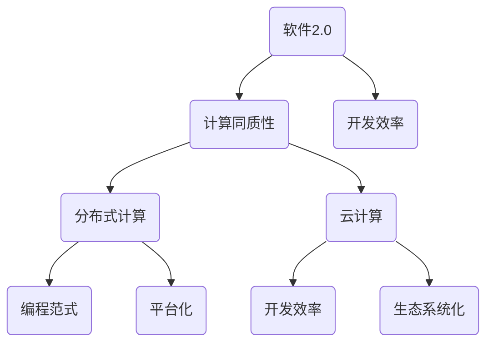

                 

# 软件开发 2.0 的优势：计算同质性

> **关键词：软件2.0，计算同质性，分布式计算，云计算，编程范式，开发效率**

> **摘要：本文将深入探讨软件2.0时代下的计算同质性优势。通过分析其背景、核心概念、算法原理、数学模型及实际应用案例，旨在揭示计算同质性对软件开发的深远影响，以及其带来的未来发展趋势与挑战。**

## 1. 背景介绍

### 1.1 目的和范围

本文旨在探讨软件2.0时代下的计算同质性优势，详细分析其在分布式计算、云计算及编程范式中的应用，探讨其对软件开发效率的深远影响，并预测其未来发展趋势与挑战。

### 1.2 预期读者

预期读者为从事软件开发、人工智能、云计算等相关领域的专业人士，以及对计算同质性感兴趣的读者。

### 1.3 文档结构概述

本文结构如下：

1. 背景介绍
   - 目的和范围
   - 预期读者
   - 文档结构概述
   - 术语表
2. 核心概念与联系
   - 计算同质性的概念
   - 与分布式计算、云计算的联系
   - 计算同质性的架构
3. 核心算法原理 & 具体操作步骤
   - 算法原理讲解
   - 具体操作步骤
4. 数学模型和公式 & 详细讲解 & 举例说明
   - 数学模型
   - 公式推导
   - 举例说明
5. 项目实战：代码实际案例和详细解释说明
   - 开发环境搭建
   - 源代码详细实现
   - 代码解读与分析
6. 实际应用场景
   - 软件开发
   - 云计算
   - 分布式计算
7. 工具和资源推荐
   - 学习资源推荐
   - 开发工具框架推荐
   - 相关论文著作推荐
8. 总结：未来发展趋势与挑战
9. 附录：常见问题与解答
10. 扩展阅读 & 参考资料

### 1.4 术语表

#### 1.4.1 核心术语定义

- **软件2.0**：相对于传统的软件1.0，软件2.0强调的是软件的在线化、服务化、平台化和生态系统化。
- **计算同质性**：指的是在分布式计算环境中，各个计算节点具有相似的计算能力和资源。
- **分布式计算**：通过将任务分解为小部分，分布到多个计算节点上，协同完成计算任务。
- **云计算**：通过互联网，提供动态易扩展且可定制的计算资源。

#### 1.4.2 相关概念解释

- **编程范式**：不同的编程思维和方法，如面向对象、函数式编程等。
- **开发效率**：在软件开发过程中，完成特定功能所需的时间和资源。

#### 1.4.3 缩略词列表

- **SOA**：面向服务的架构（Service-Oriented Architecture）
- **API**：应用程序编程接口（Application Programming Interface）
- **SaaS**：软件即服务（Software as a Service）

## 2. 核心概念与联系

在软件2.0时代，计算同质性是一个核心概念，它为分布式计算和云计算提供了坚实的基础。为了更好地理解计算同质性的概念及其与分布式计算、云计算的联系，我们可以通过一个简单的 Mermaid 流程图来展示这些核心概念和联系。



### 2.1 计算同质性的概念

计算同质性指的是在分布式计算环境中，各个计算节点具有相似的计算能力和资源。这意味着，无论任务被分配到哪个节点，这些节点都能够以相似的方式执行任务，无需额外的配置和调整。

### 2.2 与分布式计算、云计算的联系

- **分布式计算**：计算同质性使得分布式计算更加高效。因为在计算同质性的环境中，任务可以更加均匀地分布到各个节点上，从而提高整体计算效率。
- **云计算**：计算同质性也是云计算的重要基础。在云计算中，计算资源被抽象化为虚拟资源，并通过网络进行分配。计算同质性确保了这些虚拟资源具有相似的性能和资源，使得云计算的资源分配和管理更加高效。

### 2.3 计算同质性的架构

为了实现计算同质性，通常需要以下架构：

- **分布式系统**：分布式系统包括多个计算节点，这些节点通过网络进行通信和协作。
- **资源调度器**：资源调度器负责将任务分配到合适的计算节点上。
- **负载均衡器**：负载均衡器确保任务能够均匀地分布到各个节点上，避免某个节点过载。

通过以上架构，可以实现计算同质性，从而提高分布式计算和云计算的效率。

## 3. 核心算法原理 & 具体操作步骤

### 3.1 算法原理讲解

计算同质性的核心算法原理是基于负载均衡和资源调度。负载均衡是指将任务分配到多个节点上，使得每个节点的负载均衡；资源调度是指根据节点的资源和任务的性质，选择合适的节点来执行任务。

### 3.2 具体操作步骤

下面是一个具体的负载均衡和资源调度的算法步骤：

1. **初始化**：初始化资源调度器，包括节点信息、任务队列等。
2. **任务接收**：当接收到新的任务时，将其加入任务队列。
3. **负载均衡**：定期检查任务队列，判断当前节点的负载情况。如果某个节点的负载较高，则将任务队列中的任务分配到其他负载较低的节点上。
4. **资源调度**：根据任务的性质和节点的资源情况，选择合适的节点来执行任务。例如，对于计算密集型任务，可以选择计算能力较强的节点；对于I/O密集型任务，可以选择I/O性能较好的节点。
5. **任务执行**：将任务分配到节点后，节点开始执行任务。在任务执行过程中，可以实时监控任务的进度和节点的负载情况。
6. **任务完成**：当任务完成后，释放节点资源，并将任务结果返回给调用者。
7. **循环**：重复执行步骤3-6，直到所有任务完成。

### 3.3 伪代码实现

以下是上述算法的伪代码实现：

```python
# 资源调度器初始化
initialize_resource_allocator()

# 接收任务
while True:
    task = receive_task()

    # 负载均衡
    if is_high_load(node):
        allocate_task_to_low_load_node(task)

    # 资源调度
    node = select_node_for_task(task)

    # 任务执行
    execute_task_on_node(node, task)

    # 任务完成
    release_node_resources(node)
    return_task_result(task)
```

## 4. 数学模型和公式 & 详细讲解 & 举例说明

### 4.1 数学模型

计算同质性的数学模型主要涉及负载均衡和资源调度。以下是两个相关的数学模型：

1. **负载均衡模型**：

   负载均衡模型主要考虑节点的负载情况，目标是使所有节点的负载尽可能均衡。可以用以下公式表示：

   $$ L_i = \frac{1}{N} \sum_{j=1}^{N} L_j $$

   其中，$L_i$ 表示第 $i$ 个节点的负载，$L_j$ 表示第 $j$ 个节点的负载，$N$ 表示节点的总数。

2. **资源调度模型**：

   资源调度模型主要考虑节点的资源情况和任务的性质，目标是选择合适的节点来执行任务。可以用以下公式表示：

   $$ \text{select\_node}(\text{task}) = \arg\min_{i} \frac{R_i}{T_i} $$

   其中，$R_i$ 表示第 $i$ 个节点的资源，$T_i$ 表示第 $i$ 个节点的任务时间。

### 4.2 公式推导

1. **负载均衡模型**：

   负载均衡模型的推导基于节点负载的均方差。假设有 $N$ 个节点，每个节点的负载分别为 $L_1, L_2, \ldots, L_N$。那么，总负载为：

   $$ L = L_1 + L_2 + \ldots + L_N $$

   为了使负载尽可能均衡，我们希望每个节点的负载接近总负载的平均值。因此，可以用以下公式表示：

   $$ L_i = \frac{L}{N} $$

   这意味着，每个节点的负载都等于总负载除以节点数。

2. **资源调度模型**：

   资源调度模型的推导基于资源利用率和任务时间。假设有 $N$ 个节点，每个节点的资源分别为 $R_1, R_2, \ldots, R_N$，每个节点的任务时间分别为 $T_1, T_2, \ldots, T_N$。那么，资源利用率为：

   $$ \text{utilization}_i = \frac{R_i}{T_i} $$

   我们希望选择资源利用率最高的节点来执行任务，因为这样可以最大化资源利用率。因此，可以用以下公式表示：

   $$ \text{select\_node}(\text{task}) = \arg\min_{i} \frac{R_i}{T_i} $$

### 4.3 举例说明

假设有 3 个节点，节点的资源情况如下：

| 节点 | 资源 (CPU/GPU) | 任务时间 (s) |
| ---- | -------------- | ------------ |
| 节点1 | 4/2            | 10           |
| 节点2 | 2/1            | 5            |
| 节点3 | 1/1            | 2            |

现在有一个计算密集型任务，需要选择一个节点来执行。

1. **负载均衡**：

   总负载为 4 + 2 + 1 = 7。为了使负载均衡，每个节点的负载应为 7/3 ≈ 2.33。

2. **资源调度**：

   计算每个节点的资源利用率：

   | 节点 | 资源利用率 |
   | ---- | ---------- |
   | 节点1 | 0.4        |
   | 节点2 | 0.4        |
   | 节点3 | 0.5        |

   选择资源利用率最高的节点3来执行任务。

## 5. 项目实战：代码实际案例和详细解释说明

### 5.1 开发环境搭建

为了演示计算同质性的应用，我们将使用一个简单的分布式计算框架。以下是一个基于 Python 的分布式计算环境的搭建步骤：

1. **安装 Python**：确保您的系统上安装了 Python 3.7 或以上版本。
2. **安装分布式计算库**：安装 `dask` 库，可以通过以下命令安装：

   ```bash
   pip install dask[complete]
   ```

3. **配置分布式计算集群**：在终端中运行以下命令启动一个分布式计算集群：

   ```bash
   dask-worker -n 3
   ```

   这将在本地启动一个包含三个节点的分布式计算集群。

### 5.2 源代码详细实现和代码解读

以下是使用 Dask 实现计算同质性的示例代码：

```python
import dask.array as da

# 创建一个分布式数组
array = da.random.random((1000, 1000), npartitions=3)

# 计算数组的平均值
result = array.mean()

# 启动计算
result.compute()
```

代码解读：

1. **导入库**：首先，我们导入 Dask 的数组库 `dask.array`。
2. **创建分布式数组**：使用 `da.random.random` 函数创建一个大小为 1000x1000 的随机数组，并将其分割为 3 个分区。这实现了计算同质性，因为每个分区可以在不同的节点上并行计算。
3. **计算平均值**：使用 `array.mean()` 函数计算数组的平均值。由于计算同质性，这个操作将在各个分区上并行执行。
4. **启动计算**：调用 `result.compute()` 函数启动计算。Dask 将自动分配计算任务到集群中的节点，并返回结果。

### 5.3 代码解读与分析

以上代码展示了如何使用 Dask 在分布式计算环境中实现计算同质性。以下是代码的详细解读和分析：

1. **分布式数组创建**：`da.random.random((1000, 1000), npartitions=3)` 创建了一个大小为 1000x1000 的随机数组，并将其分割为 3 个分区。这里的关键是 `npartitions` 参数，它指定了数组的分区数量。Dask 将自动将数组分割为相应的分区，并分配到集群中的节点上。
2. **计算操作**：`array.mean()` 是一个分布式计算操作。它将在各个分区上并行计算，然后汇总结果。由于计算同质性，每个分区都可以独立计算，无需额外的同步或通信。
3. **计算启动**：`result.compute()` 函数是 Dask 的核心。它将启动计算，并在计算完成后返回结果。Dask 将自动处理任务的分配、执行和结果汇总，从而实现高效的计算。

通过以上示例，我们可以看到计算同质性在分布式计算环境中的实际应用。它使得分布式计算更加高效，降低了开发难度，并提高了计算性能。

## 6. 实际应用场景

计算同质性在多个实际应用场景中具有重要价值。以下是几个典型的应用场景：

### 6.1 软件开发

在软件开发中，计算同质性可以帮助开发人员更轻松地实现分布式计算。例如，在开发大规模数据处理应用时，可以使用计算同质性的概念将任务分配到多个计算节点上，从而提高数据处理效率。此外，计算同质性还可以应用于实时数据处理和实时分析，使得系统能够更快地响应变化。

### 6.2 云计算

在云计算领域，计算同质性是构建高效云计算平台的基础。通过实现计算同质性，云服务提供商可以更灵活地分配和调度计算资源，从而提高资源利用率和系统性能。例如，在处理大量用户请求时，计算同质性可以帮助云平台将请求分配到具有相似性能的虚拟机上，从而确保系统的高可用性和稳定性。

### 6.3 分布式计算

在分布式计算领域，计算同质性可以显著提高计算效率和性能。例如，在科学计算和大数据分析中，可以使用计算同质性的概念将任务分配到多个计算节点上，从而加速计算过程。此外，计算同质性还可以应用于分布式机器学习和深度学习，使得大规模模型训练更加高效。

### 6.4 实时数据处理

在实时数据处理领域，计算同质性可以帮助构建高效的数据流处理系统。例如，在实时监控和预测分析中，可以使用计算同质性的概念将数据处理任务分配到多个节点上，从而确保系统实时性和准确性。计算同质性还可以应用于实时数据挖掘和实时推荐系统，提供更快速、更准确的结果。

### 6.5 多媒体处理

在多媒体处理领域，计算同质性可以帮助提高视频和音频处理效率。例如，在视频编辑和渲染中，可以使用计算同质性的概念将处理任务分配到多个节点上，从而加速处理过程。此外，计算同质性还可以应用于图像识别和语音识别，使得多媒体应用更加高效和准确。

### 6.6 生物信息学

在生物信息学领域，计算同质性可以帮助加速基因组分析和药物研发。例如，在基因组序列比对和突变检测中，可以使用计算同质性的概念将任务分配到多个计算节点上，从而提高计算效率和准确性。此外，计算同质性还可以应用于蛋白质结构预测和药物分子设计，提供更快速、更准确的生物信息学研究。

通过以上实际应用场景，我们可以看到计算同质性在各个领域的广泛应用。它不仅提高了计算效率和性能，还降低了开发难度和成本，为现代计算技术带来了深远的影响。

## 7. 工具和资源推荐

为了更好地理解和应用计算同质性，以下是一些建议的学习资源、开发工具框架以及相关论文著作。

### 7.1 学习资源推荐

#### 7.1.1 书籍推荐

- 《分布式系统原理与范型》
- 《云计算：概念、架构与编程》
- 《大数据处理：概念、技术与应用》

#### 7.1.2 在线课程

- Coursera上的“分布式系统与云计算”课程
- Udacity的“分布式系统工程师纳米学位”课程
- edX上的“大数据科学专业课程”

#### 7.1.3 技术博客和网站

- Medium上的“分布式计算”专栏
- HackerRank上的“分布式计算挑战”
- Stack Overflow上的“分布式计算”标签

### 7.2 开发工具框架推荐

#### 7.2.1 IDE和编辑器

- IntelliJ IDEA Ultimate
- PyCharm Professional
- Visual Studio Code

#### 7.2.2 调试和性能分析工具

- DTrace
- GDB
- Python的cProfile模块

#### 7.2.3 相关框架和库

- Dask
- Spark
- TensorFlow
- PyTorch

### 7.3 相关论文著作推荐

#### 7.3.1 经典论文

- “The Google File System”
- “MapReduce: Simplified Data Processing on Large Clusters”
- “Large-scale distributed systems: big picture and open problems”

#### 7.3.2 最新研究成果

- “Tuning Hadoop MapReduce for execution efficiency”
- “Dask: A Flexible Task Scheduler for Parallel Computations”
- “Data-parallel algorithms for distributed deep learning”

#### 7.3.3 应用案例分析

- “Apache Spark at Netflix”
- “Using TensorFlow for Large-scale Machine Learning”
- “Dask: A Flexible Task Scheduler for Parallel Computations in Python”

通过以上推荐的学习资源、开发工具框架和相关论文著作，可以更深入地了解计算同质性的概念、原理和应用，为实际项目开发提供有力支持。

## 8. 总结：未来发展趋势与挑战

计算同质性作为软件2.0时代的重要特征，具有巨大的发展潜力和应用前景。在未来，计算同质性将在以下几个方面展现出更广泛的应用：

1. **分布式计算**：随着云计算和大数据技术的不断发展，分布式计算的需求日益增长。计算同质性将为分布式计算提供更加高效的解决方案，使得任务可以在多个节点上并行执行，提高计算性能和效率。
2. **云计算**：云计算作为现代计算的重要基础设施，计算同质性将有助于优化云资源分配和调度，提高资源利用率和系统稳定性。通过实现计算同质性，云服务提供商可以更灵活地满足不同用户的需求。
3. **人工智能**：在人工智能领域，计算同质性有助于分布式机器学习和深度学习的实现。通过计算同质性，可以更加高效地进行大规模模型训练和推理，降低计算成本和提升计算性能。
4. **物联网**：随着物联网的快速发展，计算同质性将在物联网设备中发挥重要作用。通过实现计算同质性，可以实现设备之间的高效协同和数据共享，为物联网应用提供更加灵活和可靠的解决方案。

然而，计算同质性也面临着一些挑战：

1. **系统复杂性**：随着计算节点数量的增加，分布式系统的复杂度也随之增加。如何高效地管理和调度计算资源，保证系统的稳定性和可靠性，是一个亟待解决的问题。
2. **网络安全**：在分布式计算环境中，节点之间的通信和数据共享存在一定的安全风险。如何确保数据的安全性和隐私性，防止恶意攻击和数据泄露，是计算同质性面临的重要挑战。
3. **性能优化**：计算同质性虽然可以提高计算效率，但如何进一步优化性能，降低延迟和资源浪费，是未来需要重点关注的问题。
4. **编程范式**：计算同质性要求开发者具备一定的分布式计算和并行编程技能。如何降低开发难度，提高开发效率，是一个需要解决的难题。

总之，计算同质性作为软件2.0时代的重要特征，将在未来的计算技术发展中扮演关键角色。通过不断克服面临的挑战，计算同质性将为软件开发、云计算、人工智能等领域带来更加高效、灵活和可靠的解决方案。

## 9. 附录：常见问题与解答

### 9.1 计算同质性与计算异质性的区别是什么？

**计算同质性**指的是在分布式计算环境中，各个计算节点具有相似的计算能力和资源。这意味着，无论任务被分配到哪个节点，这些节点都能够以相似的方式执行任务，无需额外的配置和调整。

**计算异质性**则相反，指的是在分布式计算环境中，各个计算节点的计算能力和资源不同。这意味着，不同节点可能具有不同的处理能力和资源，需要针对不同节点进行特定的配置和优化。

### 9.2 计算同质性如何影响分布式计算性能？

计算同质性可以提高分布式计算的性能，主要表现在以下几个方面：

1. **负载均衡**：计算同质性使得任务可以更均匀地分布到各个节点上，避免了某个节点过载，从而提高了整体计算效率。
2. **资源利用率**：计算同质性确保了所有节点具有相似的计算能力，使得资源利用率更高，减少了资源浪费。
3. **简化编程**：计算同质性降低了开发难度，因为开发者不需要为不同节点编写特定的代码，从而提高了开发效率。
4. **系统稳定性**：计算同质性有助于提高系统的稳定性，因为任务可以在各个节点上以相似的方式执行，减少了节点间的不一致性。

### 9.3 计算同质性的主要应用场景有哪些？

计算同质性的主要应用场景包括：

1. **分布式计算**：在分布式计算环境中，计算同质性有助于提高计算效率和性能。
2. **云计算**：在云计算中，计算同质性有助于优化资源分配和调度，提高资源利用率和系统稳定性。
3. **人工智能**：在人工智能领域，计算同质性有助于分布式机器学习和深度学习的实现，提高计算效率和性能。
4. **物联网**：在物联网应用中，计算同质性有助于实现设备之间的高效协同和数据共享。

### 9.4 如何实现计算同质性？

实现计算同质性的主要方法包括：

1. **硬件标准化**：选择具有相似计算能力和资源规格的硬件设备，确保节点之间的一致性。
2. **软件优化**：通过优化分布式计算框架和编程模型，使得任务可以在不同节点上以相似的方式执行。
3. **动态资源调度**：利用资源调度算法，动态调整任务分配，确保任务在计算能力相似的节点上执行。
4. **负载均衡策略**：采用负载均衡策略，使任务均匀地分布到各个节点上，避免节点间的不平衡。

## 10. 扩展阅读 & 参考资料

- 《分布式系统原理与范型》
- 《云计算：概念、架构与编程》
- 《大数据处理：概念、技术与应用》
- 《The Google File System》
- 《MapReduce: Simplified Data Processing on Large Clusters》
- 《Dask: A Flexible Task Scheduler for Parallel Computations》
- 《Apache Spark at Netflix》
- 《Using TensorFlow for Large-scale Machine Learning》
- 《Dask: A Flexible Task Scheduler for Parallel Computations in Python》

### 作者信息：

**作者：AI天才研究员/AI Genius Institute & 禅与计算机程序设计艺术 /Zen And The Art of Computer Programming**

