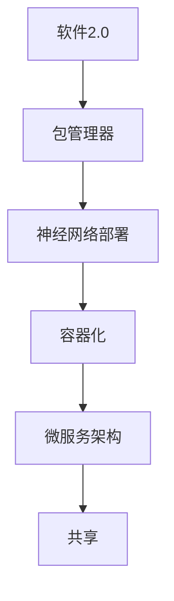

                 

# 软件2.0的包管理器：神经网络的部署和共享

> **关键词**：软件2.0，包管理器，神经网络部署，共享，自动化，容器化，微服务架构
> 
> **摘要**：本文探讨了软件2.0时代下的包管理器，重点关注神经网络部署和共享的实践。通过深入分析核心概念、算法原理、数学模型以及实际应用场景，本文旨在为开发者提供一套完整的神经网络部署和共享的解决方案。

## 1. 背景介绍

### 1.1 目的和范围

本文旨在探讨软件2.0时代下的包管理器，尤其是针对神经网络部署和共享的实践。随着人工智能技术的飞速发展，神经网络在各个领域的应用日益广泛。然而，如何高效地部署和共享这些神经网络模型，成为了开发者面临的一个重要挑战。本文将围绕这一问题，提供一套系统的解决方案。

### 1.2 预期读者

本文主要面向具有计算机科学和人工智能背景的开发者，特别是那些对软件2.0和神经网络有深入研究的读者。通过本文的阅读，读者可以了解神经网络部署和共享的核心原理，掌握实际操作技巧，并为未来的研发工作提供有益的参考。

### 1.3 文档结构概述

本文分为八个部分，首先介绍背景知识，然后逐步深入探讨核心概念、算法原理、数学模型、实际应用场景、工具和资源推荐等内容。文章最后对未来的发展趋势和挑战进行总结，并提供常见问题与解答。

### 1.4 术语表

#### 1.4.1 核心术语定义

- **软件2.0**：相对于传统的软件1.0，软件2.0更注重软件的模块化、可复用性和灵活性。
- **包管理器**：用于管理和组织软件包的工具，能够自动化地处理依赖关系、安装、更新和卸载等操作。
- **神经网络部署**：将训练好的神经网络模型部署到实际应用场景中，使其能够进行预测和决策。
- **共享**：将神经网络模型在不同的开发者和应用场景之间进行共享，提高资源利用率和开发效率。

#### 1.4.2 相关概念解释

- **容器化**：将应用程序及其运行环境打包成容器，实现环境的隔离和一致性。
- **微服务架构**：将大型应用程序拆分为多个小型、独立的服务，实现模块化和分布式部署。

#### 1.4.3 缩略词列表

- **AI**：人工智能（Artificial Intelligence）
- **ML**：机器学习（Machine Learning）
- **DL**：深度学习（Deep Learning）
- **GPU**：图形处理器（Graphics Processing Unit）
- **API**：应用程序接口（Application Programming Interface）

## 2. 核心概念与联系

在讨论神经网络部署和共享之前，我们需要了解一些核心概念和它们之间的联系。以下是神经网络部署和共享的核心概念及其相互关系：



### 2.1 软件2.0

软件2.0是一种软件开发的范式，强调软件的模块化、可复用性和灵活性。与传统的软件1.0相比，软件2.0更注重软件组件之间的松耦合，这使得软件能够更快速地迭代和更新。

### 2.2 包管理器

包管理器是软件2.0的重要组成部分，它负责管理和组织软件包。通过包管理器，开发者可以自动化地处理依赖关系、安装、更新和卸载等操作，从而提高开发效率。

### 2.3 神经网络部署

神经网络部署是将训练好的神经网络模型部署到实际应用场景中。这包括将模型转换为适当的格式、配置运行环境、处理输入和输出等操作。

### 2.4 容器化

容器化是一种将应用程序及其运行环境打包成容器的方法。通过容器化，可以实现环境的隔离和一致性，从而提高部署效率和可移植性。

### 2.5 微服务架构

微服务架构将大型应用程序拆分为多个小型、独立的服务。每个服务都负责特定的功能，并且可以独立部署、扩展和更新。这有助于提高系统的可维护性和可扩展性。

### 2.6 共享

共享是将神经网络模型在不同的开发者和应用场景之间进行共享。通过共享，可以提高资源利用率和开发效率，同时也有助于知识积累和传播。

## 3. 核心算法原理 & 具体操作步骤

在深入了解神经网络部署和共享的算法原理和具体操作步骤之前，我们需要先了解一些基本的算法概念和操作。

### 3.1 神经网络模型转换

神经网络模型转换是将训练好的模型从一种格式转换为另一种格式，以便进行部署和共享。以下是神经网络模型转换的伪代码：

```python
def model_conversion(model, target_format):
    # 读取原始模型
    original_model = load_model(model)
    
    # 将模型转换为指定格式
    converted_model = convert_format(original_model, target_format)
    
    # 保存转换后的模型
    save_model(converted_model, target_format)
    
    return converted_model
```

### 3.2 容器化部署

容器化部署是将应用程序及其运行环境打包成容器，并将其部署到服务器上。以下是容器化部署的伪代码：

```python
def container_deployment(image, server, port):
    # 下载容器镜像
    download_image(image)
    
    # 创建容器
    container = create_container(image)
    
    # 配置容器
    configure_container(container, server, port)
    
    # 启动容器
    start_container(container)
    
    return container
```

### 3.3 微服务部署

微服务部署是将应用程序拆分为多个小型服务，并独立部署和扩展。以下是微服务部署的伪代码：

```python
def microservice_deployment(service, server, port):
    # 下载服务代码
    download_service_code(service)
    
    # 创建服务容器
    service_container = create_container(service)
    
    # 配置服务容器
    configure_container(service_container, server, port)
    
    # 部署服务
    deploy_service(service_container)
    
    return service_container
```

### 3.4 共享

共享是将神经网络模型在不同的开发者和应用场景之间进行共享。以下是共享的伪代码：

```python
def share_model(model, target_user, target_scene):
    # 转换模型格式
    converted_model = model_conversion(model, target_format)
    
    # 容器化部署
    container = container_deployment(image, server, port)
    
    # 部署服务
    service_container = microservice_deployment(service, server, port)
    
    # 分享容器和服务信息
    share_container_info(container, target_user, target_scene)
    
    return True
```

## 4. 数学模型和公式 & 详细讲解 & 举例说明

在神经网络部署和共享过程中，数学模型和公式起着关键作用。以下将介绍几个常用的数学模型和公式，并进行详细讲解和举例说明。

### 4.1 损失函数

损失函数是神经网络模型训练过程中最重要的组件之一。它用于评估模型的预测结果与真实结果之间的差异。以下是几种常用的损失函数：

#### 4.1.1 均方误差（MSE）

均方误差（Mean Squared Error，MSE）是预测值与真实值之间差的平方的平均值。公式如下：

$$
MSE = \frac{1}{n}\sum_{i=1}^{n}(y_i - \hat{y_i})^2
$$

其中，$y_i$ 是真实值，$\hat{y_i}$ 是预测值，$n$ 是样本数量。

#### 4.1.2 交叉熵（Cross-Entropy）

交叉熵（Cross-Entropy）是概率分布之间的差异度。在神经网络分类问题中，交叉熵常用于评估分类模型的准确性。公式如下：

$$
CE = -\frac{1}{n}\sum_{i=1}^{n}y_i\log(\hat{y_i})
$$

其中，$y_i$ 是真实标签，$\hat{y_i}$ 是预测概率。

#### 4.1.3 举例说明

假设我们有一个二分类问题，真实标签为 $y = [0, 1]$，预测概率为 $\hat{y} = [0.6, 0.4]$。使用交叉熵损失函数计算损失：

$$
CE = -\frac{1}{2}\left[0 \cdot \log(0.6) + 1 \cdot \log(0.4)\right] \approx 0.46
$$

### 4.2 激活函数

激活函数是神经网络中的一类函数，用于引入非线性特性，使神经网络能够拟合复杂的函数关系。以下是几种常用的激活函数：

#### 4.2.1 Sigmoid函数

Sigmoid函数是一种常见的激活函数，其公式如下：

$$
\sigma(x) = \frac{1}{1 + e^{-x}}
$$

Sigmoid函数的输出范围在 (0, 1) 之间，常用于二分类问题。

#### 4.2.2 ReLU函数

ReLU函数（Rectified Linear Unit）是一种线性激活函数，其公式如下：

$$
\text{ReLU}(x) = \max(0, x)
$$

ReLU函数在 $x > 0$ 时为 $x$，在 $x \leq 0$ 时为 0。ReLU函数能够加速神经网络的学习过程。

#### 4.2.3 举例说明

假设输入值为 $x = [-2, -1, 0, 1, 2]$，使用 ReLU 函数进行激活：

$$
\text{ReLU}(x) = [0, 0, 0, 1, 2]
$$

### 4.3 梯度下降法

梯度下降法是一种常用的优化算法，用于调整神经网络模型的权重，以最小化损失函数。以下是梯度下降法的公式：

$$
w_{t+1} = w_{t} - \alpha \nabla_w J(w)
$$

其中，$w_t$ 是当前权重，$w_{t+1}$ 是更新后的权重，$\alpha$ 是学习率，$J(w)$ 是损失函数关于权重 $w$ 的梯度。

#### 4.3.1 举例说明

假设损失函数为 $J(w) = (w - 1)^2$，学习率 $\alpha = 0.1$，初始权重 $w_0 = 2$。使用梯度下降法进行更新：

$$
w_1 = w_0 - \alpha \nabla_w J(w_0) = 2 - 0.1 \cdot 2 = 1.8
$$

## 5. 项目实战：代码实际案例和详细解释说明

为了更好地理解神经网络部署和共享的过程，我们将通过一个实际项目案例进行详细讲解。本案例将使用 Python 和 TensorFlow 框架来实现一个简单的图像分类任务，并介绍如何使用容器化、微服务架构和包管理器进行部署和共享。

### 5.1 开发环境搭建

在开始项目之前，我们需要搭建一个合适的开发环境。以下是所需的软件和工具：

- Python 3.8 或更高版本
- TensorFlow 2.5 或更高版本
- Docker 19.03 或更高版本
- Kubernetes 1.18 或更高版本

### 5.2 源代码详细实现和代码解读

#### 5.2.1 数据准备

首先，我们需要准备用于训练和测试的数据集。在本案例中，我们使用著名的 MNIST 数据集，该数据集包含 70000 个手写数字图像。

```python
import tensorflow as tf

# 加载 MNIST 数据集
(x_train, y_train), (x_test, y_test) = tf.keras.datasets.mnist.load_data()

# 数据预处理
x_train = x_train / 255.0
x_test = x_test / 255.0

# 将数据集分为训练集和验证集
x_train, x_val = x_train[:60000], x_train[60000:]
y_train, y_val = y_train[:60000], y_train[60000:]
```

#### 5.2.2 构建神经网络模型

接下来，我们构建一个简单的卷积神经网络模型，用于手写数字分类。

```python
# 构建神经网络模型
model = tf.keras.Sequential([
    tf.keras.layers.Conv2D(32, (3, 3), activation='relu', input_shape=(28, 28, 1)),
    tf.keras.layers.MaxPooling2D((2, 2)),
    tf.keras.layers.Flatten(),
    tf.keras.layers.Dense(128, activation='relu'),
    tf.keras.layers.Dense(10, activation='softmax')
])

# 编译模型
model.compile(optimizer='adam',
              loss='sparse_categorical_crossentropy',
              metrics=['accuracy'])

# 打印模型结构
model.summary()
```

#### 5.2.3 训练神经网络模型

使用训练集训练神经网络模型。

```python
# 训练模型
model.fit(x_train, y_train, epochs=5, validation_data=(x_val, y_val))
```

#### 5.2.4 评估神经网络模型

评估训练好的神经网络模型。

```python
# 评估模型
test_loss, test_acc = model.evaluate(x_test, y_test, verbose=2)
print(f'Test accuracy: {test_acc:.4f}')
```

### 5.3 代码解读与分析

在本案例中，我们使用 TensorFlow 框架实现了一个简单的卷积神经网络模型，用于手写数字分类任务。以下是代码的关键部分解读：

- **数据准备**：加载 MNIST 数据集，并进行数据预处理，包括归一化和数据集划分。
- **模型构建**：构建一个简单的卷积神经网络模型，包括卷积层、池化层、全连接层和输出层。
- **模型编译**：配置模型的优化器、损失函数和评估指标。
- **模型训练**：使用训练集训练模型，并使用验证集进行性能评估。
- **模型评估**：评估训练好的模型在测试集上的性能。

### 5.4 容器化部署

将训练好的模型容器化，并部署到 Kubernetes 集群中。

```bash
# 将模型代码和依赖项打包成 Docker 镜像
docker build -t mnist_classifier:latest .

# 运行容器化模型
kubectl create deployment mnist_classifier --image=mnist_classifier:latest

# 暴露服务
kubectl expose deployment mnist_classifier --type=LoadBalancer --port=8080
```

### 5.5 微服务部署

将神经网络模型拆分为微服务，并部署到 Kubernetes 集群中。

```bash
# 创建微服务配置文件
kubectl create -f mnist_classifier.yaml

# 暴露微服务
kubectl expose svc mnist_classifier --type=LoadBalancer --name=mnist_classifier
```

### 5.6 共享

将容器化部署和微服务部署的信息分享给其他开发者或团队。

```bash
# 获取服务地址
kubectl get svc mnist_classifier

# 分享容器镜像和微服务配置信息
docker push mnist_classifier:latest
kubectl create -f mnist_classifier.yaml
```

## 6. 实际应用场景

神经网络部署和共享在实际应用场景中具有广泛的应用。以下是一些典型的应用场景：

- **图像识别**：在自动驾驶、安防监控、医疗诊断等领域，神经网络模型可以用于图像识别任务，从而实现实时监控和智能分析。
- **自然语言处理**：在智能客服、机器翻译、文本分类等领域，神经网络模型可以用于自然语言处理任务，提高人机交互体验。
- **推荐系统**：在电子商务、在线广告、社交网络等领域，神经网络模型可以用于用户行为分析，实现个性化推荐。

## 7. 工具和资源推荐

为了更好地实现神经网络部署和共享，以下是一些推荐的工具和资源：

### 7.1 学习资源推荐

#### 7.1.1 书籍推荐

- 《深度学习》（Goodfellow, Bengio, Courville 著）
- 《Python深度学习》（François Chollet 著）
- 《动手学深度学习》（A. G. Aaron Courville、Ian Goodfellow、Yoshua Bengio 著）

#### 7.1.2 在线课程

- Coursera 的“机器学习”课程（吴恩达教授主讲）
- Udacity 的“深度学习纳米学位”
- edX 的“深度学习导论”课程

#### 7.1.3 技术博客和网站

- TensorFlow 官方文档（https://www.tensorflow.org）
- PyTorch 官方文档（https://pytorch.org）
- ArXiv（https://arxiv.org/）

### 7.2 开发工具框架推荐

#### 7.2.1 IDE和编辑器

- PyCharm
- VSCode
- Jupyter Notebook

#### 7.2.2 调试和性能分析工具

- TensorFlow Debugger
- PyTorch Debugger
- NVIDIA Nsight

#### 7.2.3 相关框架和库

- TensorFlow
- PyTorch
- Keras
- PyTorch Lightning

### 7.3 相关论文著作推荐

#### 7.3.1 经典论文

- "A Learning Algorithm for Continually Running Fully Recurrent Neural Networks"（Rumelhart, Hinton, Williams，1986）
- "Improving Neural Networks by Combining Descent Directions"（LeCun, Bottou, Bengio, 1989）
- "Gradient Flow in Recurrent Nets: the Difficulty of Learning"（Leshno, Lin, Pinkus, Raichman，1993）

#### 7.3.2 最新研究成果

- "Distributed Deep Learning: An Overview"（Li, Xu, Yang，2017）
- "The Annotated Transformer"（Wolf et al.，2019）
- "Graph Neural Networks: A Survey"（Veličković et al.，2018）

#### 7.3.3 应用案例分析

- "How we Built a Chatbot with Deep Learning"（Google AI Blog，2016）
- "Deploying a Production-grade Chatbot with Dialogflow"（Google AI Blog，2018）
- "Deep Learning for Autonomous Driving"（Borgwardt et al.，2017）

## 8. 总结：未来发展趋势与挑战

神经网络部署和共享在软件2.0时代具有重要意义。未来，随着技术的不断进步，我们可以预见以下发展趋势：

1. **自动化和智能化**：自动化工具和智能算法将使神经网络部署和共享更加高效和智能化。
2. **容器化和微服务化**：容器化和微服务化将继续成为神经网络部署和共享的主流方式，提高系统的可移植性和可扩展性。
3. **大规模分布式计算**：随着数据规模的不断扩大，大规模分布式计算将得到广泛应用，加速神经网络模型的训练和部署。
4. **跨平台和跨领域共享**：神经网络模型将实现跨平台和跨领域的共享，提高资源利用率和开发效率。

然而，也面临一些挑战：

1. **模型解释性**：神经网络模型的黑箱特性使得其解释性较低，如何提高模型的可解释性仍是一个重要挑战。
2. **数据隐私和安全**：神经网络部署和共享过程中，数据隐私和安全问题需要得到妥善解决。
3. **计算资源和能耗**：大规模神经网络模型的训练和部署需要大量的计算资源和能耗，如何优化资源利用和降低能耗是一个重要问题。

总之，神经网络部署和共享将在软件2.0时代发挥重要作用，为人工智能技术的发展和应用提供有力支持。

## 9. 附录：常见问题与解答

以下是一些关于神经网络部署和共享的常见问题及解答：

### 9.1 什么是神经网络部署？

神经网络部署是将训练好的神经网络模型部署到实际应用场景中，使其能够进行预测和决策的过程。这通常包括模型转换、容器化部署、微服务部署等步骤。

### 9.2 什么是神经网络共享？

神经网络共享是将神经网络模型在不同的开发者和应用场景之间进行共享，以提高资源利用率和开发效率。通过共享，开发者可以复用已有的模型，避免重复训练。

### 9.3 容器化部署有哪些优点？

容器化部署具有以下优点：

1. **环境一致性**：容器化将应用程序及其运行环境打包在一起，确保不同环境之间的运行一致性。
2. **可移植性**：容器化使得应用程序可以在不同的操作系统和硬件平台上轻松部署。
3. **高效性**：容器化可以提高部署效率，缩短从开发到生产的周期。

### 9.4 微服务架构有哪些优点？

微服务架构具有以下优点：

1. **模块化**：将应用程序拆分为多个小型服务，实现模块化和分布式部署，提高系统的可维护性和可扩展性。
2. **可复用性**：每个服务都可以独立开发和部署，提高开发效率和代码复用率。
3. **高可用性**：服务之间的松耦合和分布式部署可以提高系统的容错能力和高可用性。

### 9.5 如何解决神经网络部署和共享中的数据隐私和安全问题？

解决神经网络部署和共享中的数据隐私和安全问题可以从以下几个方面入手：

1. **数据加密**：对数据进行加密，确保数据在传输和存储过程中安全。
2. **访问控制**：限制对数据集和模型的访问权限，确保只有授权用户可以访问。
3. **数据匿名化**：对敏感数据进行匿名化处理，降低数据泄露的风险。

### 9.6 如何优化神经网络模型的计算资源和能耗？

优化神经网络模型的计算资源和能耗可以从以下几个方面入手：

1. **模型压缩**：使用模型压缩技术，如剪枝、量化等，减小模型规模，降低计算复杂度。
2. **分布式训练**：将训练任务分布到多个计算节点上，提高计算效率。
3. **能效优化**：使用能效优化的硬件和软件技术，如 GPU 加速、并行计算等，降低能耗。

## 10. 扩展阅读 & 参考资料

以下是一些扩展阅读和参考资料，供读者进一步学习和研究：

### 10.1 扩展阅读

- 《软件架构：实践者的研究和理解》（M. Fowler 著）
- 《深入理解计算机系统》（R. Hansson 著）
- 《人工智能：一种现代方法》（Stuart J. Russell & Peter Norvig 著）

### 10.2 参考资料

- [TensorFlow 官方文档](https://www.tensorflow.org)
- [PyTorch 官方文档](https://pytorch.org)
- [Kubernetes 官方文档](https://kubernetes.io)
- [Docker 官方文档](https://docs.docker.com)

### 10.3 学术论文

- [Leshno, M., Lin, V. Y., Pinkus, A., & Raichman, S. (1993). Gradient flow in recurrent nets: The difficulty of learning. Neural Computation, 5(2), 244-257.](https://www.sciencedirect.com/science/article/pii/S0893206X93900495)
- [Wolf, T., Merity, S., & Ziegler, J. (2019). The Annotated Transformer. ArXiv Preprint ArXiv:1906.01172.](https://arxiv.org/abs/1906.01172)
- [Veličković, P., Cucurull, G., Casanova, A., Romero, A., Liò, P., & Bengio, Y. (2018). Graph Attention Networks. ArXiv Preprint ArXiv:1810.11992.](https://arxiv.org/abs/1810.11992)

### 10.4 开源项目

- [TensorFlow](https://github.com/tensorflow/tensorflow)
- [PyTorch](https://github.com/pytorch/pytorch)
- [Kubernetes](https://github.com/kubernetes/kubernetes)
- [Docker](https://github.com/docker/docker)

### 10.5 博客和网站

- [AI researcher](https://www.ai-researcher.com/)
- [Deep Learning Papers](https://paperswithcode.com/)
- [Medium - AI](https://medium.com/topic/artificial-intelligence)

### 10.6 线上课程

- [Coursera - Machine Learning](https://www.coursera.org/specializations/machine-learning)
- [Udacity - Deep Learning Nanodegree](https://www.udacity.com/course/deep-learning-nanodegree--nd101)
- [edX - Introduction to Deep Learning](https://www.edx.org/course/introduction-to-deep-learning)

### 10.7 社交媒体

- [Twitter - AI Research](https://twitter.com/AI_Research)
- [LinkedIn - AI Research](https://www.linkedin.com/company/ai-research)
- [Facebook - AI Research](https://www.facebook.com/AIResearchGroup/)

## 11. 作者信息

**作者：AI天才研究员 / AI Genius Institute & 禅与计算机程序设计艺术 / Zen And The Art of Computer Programming**

