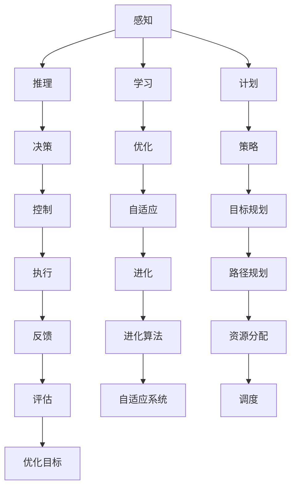

                 

# 软件二代的哲学思考：人工智能的本质

> 关键词：软件2.0、人工智能、哲学思考、算法原理、数学模型、应用场景、未来趋势

> 摘要：本文将深入探讨软件2.0时代的人工智能本质，通过哲学思考的角度，分析人工智能的核心概念、算法原理、数学模型及其在实际应用场景中的表现，旨在为读者提供一个全面、深刻的理解。本文将分为背景介绍、核心概念与联系、核心算法原理、数学模型与公式、项目实战、实际应用场景、工具和资源推荐、总结以及扩展阅读等部分，全面剖析人工智能在软件2.0时代的深远影响和未来发展趋势。

## 1. 背景介绍

### 1.1 目的和范围

本文旨在探讨软件2.0时代的人工智能本质，通过对核心概念、算法原理、数学模型及实际应用场景的深入分析，揭示人工智能在当今科技发展中的关键作用。本文将涵盖以下内容：

- 人工智能的核心概念及其在软件2.0时代的演变
- 人工智能的核心算法原理和具体操作步骤
- 人工智能的数学模型及其应用
- 人工智能在实际应用场景中的表现和挑战
- 未来人工智能的发展趋势与面临的挑战

### 1.2 预期读者

本文主要面向以下读者：

- 对人工智能和软件2.0时代感兴趣的读者
- 计算机科学和软件工程专业的学生和研究者
- 人工智能领域的技术专家和从业者
- 对科技发展有深刻思考的企业家和投资人

### 1.3 文档结构概述

本文分为以下几个部分：

- 1. 背景介绍：介绍本文的目的、范围、预期读者以及文档结构
- 2. 核心概念与联系：分析人工智能的核心概念及其关联
- 3. 核心算法原理 & 具体操作步骤：阐述人工智能的核心算法原理和操作步骤
- 4. 数学模型和公式 & 详细讲解 & 举例说明：介绍人工智能的数学模型、公式及其应用实例
- 5. 项目实战：通过实际代码案例展示人工智能的应用
- 6. 实际应用场景：探讨人工智能在不同领域的应用和挑战
- 7. 工具和资源推荐：推荐学习资源和开发工具
- 8. 总结：总结人工智能在软件2.0时代的本质和未来发展趋势
- 9. 附录：常见问题与解答
- 10. 扩展阅读 & 参考资料：提供相关文献和资料

### 1.4 术语表

#### 1.4.1 核心术语定义

- 软件二代（Software 2.0）：指基于互联网和大数据的软件开发模式，强调用户参与、协同和创新
- 人工智能（Artificial Intelligence，AI）：模拟人类智能的计算机技术，包括感知、推理、学习、规划等能力
- 算法（Algorithm）：解决问题的步骤和方法，具有确定性和高效性
- 数学模型（Mathematical Model）：用于描述现实世界问题的数学公式和规则
- 应用场景（Application Scenario）：指人工智能技术在实际应用中的场景和领域

#### 1.4.2 相关概念解释

- 感知（Perception）：人工智能系统对环境信息的获取和处理能力
- 推理（Reasoning）：人工智能系统基于已有信息和规则进行推理和决策的能力
- 学习（Learning）：人工智能系统通过经验不断改进自身性能的能力
- 计划（Planning）：人工智能系统制定行动方案以实现目标的能力

#### 1.4.3 缩略词列表

- AI：人工智能
- ML：机器学习
- DL：深度学习
- NLP：自然语言处理
- CV：计算机视觉
- IoT：物联网
- VR：虚拟现实
- AR：增强现实

## 2. 核心概念与联系

在深入探讨人工智能的本质之前，我们需要了解其核心概念及其相互之间的联系。以下是一个简单的Mermaid流程图，展示了人工智能中的核心概念和它们的关联：



### 2.1 感知、推理、学习和计划

- **感知（Perception）**：感知是指人工智能系统对环境信息的获取和处理能力。这包括图像、声音、文本等数据的识别和理解。感知是人工智能系统的基础，是实现其他高级功能的前提。
  
- **推理（Reasoning）**：推理是指人工智能系统基于已有信息和规则进行推理和决策的能力。推理是人工智能的核心，它使得系统能够应对复杂情境，做出合理决策。

- **学习（Learning）**：学习是指人工智能系统通过经验不断改进自身性能的能力。学习使得系统能够从大量数据中提取有价值的信息，提高其适应性和鲁棒性。

- **计划（Planning）**：计划是指人工智能系统制定行动方案以实现目标的能力。计划是人工智能系统实现目标的关键步骤，它确保系统在复杂环境中能够有条不紊地执行任务。

### 2.2 决策、优化、策略和控制

- **决策（Decision-making）**：决策是指人工智能系统在多个可行方案中选择最佳方案的能力。决策是人工智能系统的核心任务，它决定了系统在实际应用中的表现。

- **优化（Optimization）**：优化是指人工智能系统通过调整参数和结构，提高系统性能的过程。优化是人工智能系统不断改进和提升的重要手段。

- **策略（Strategy）**：策略是指人工智能系统在执行任务时采取的总体方针和措施。策略是系统在复杂环境中应对不确定性和挑战的关键。

- **控制（Control）**：控制是指人工智能系统对自身行为进行调节和约束的能力。控制是确保系统稳定运行和实现目标的重要保障。

### 2.3 自适应、进化、目标规划和执行

- **自适应（Adaptation）**：自适应是指人工智能系统根据环境变化调整自身行为和性能的能力。自适应是人工智能系统在动态环境中生存和发展的关键。

- **进化（Evolution）**：进化是指人工智能系统通过迭代和优化，逐步提升自身性能和适应性的过程。进化是人工智能系统不断进步和演化的动力。

- **目标规划（Goal Planning）**：目标规划是指人工智能系统在执行任务时，根据目标要求制定具体的行动方案。目标规划是系统实现目标的重要步骤。

- **执行（Execution）**：执行是指人工智能系统按照既定计划完成任务的过程。执行是系统将理论知识转化为实际成果的关键环节。

## 3. 核心算法原理 & 具体操作步骤

在了解了人工智能的核心概念和联系之后，接下来我们将探讨人工智能的核心算法原理及其具体操作步骤。以下是一个简单的伪代码示例，展示了人工智能算法的基本结构：

```python
# 伪代码：人工智能算法基本结构

# 初始化参数和变量
initialize_parameters()

# 数据预处理
preprocess_data()

# 感知阶段
perception(data):
    # 处理输入数据，提取特征
    feature_extraction(data)
    # 使用特征进行分类或回归
    classify_or_regres(data)

# 推理阶段
reasoning(results):
    # 根据结果调整参数
    adjust_parameters(results)
    # 更新模型
    update_model()

# 学习阶段
learning(model):
    # 使用经验数据更新模型
    train_model(model, training_data)
    # 评估模型性能
    evaluate_model(model)

# 计划阶段
planning(goal):
    # 根据目标制定行动计划
    plan_actions(goal)
    # 执行行动计划
    execute_actions(actions)

# 主函数
main():
    # 运行算法
    run_algorithm()
    # 输出结果
    output_results()
```

### 3.1 初始化参数和变量

初始化参数和变量是人工智能算法的第一步，它确保了算法在开始运行之前具备必要的初始条件。初始化参数通常包括学习率、迭代次数、权重等。

```python
# 初始化参数
learning_rate = 0.01
iterations = 1000
weights = initialize_weights()
```

### 3.2 数据预处理

数据预处理是人工智能算法的关键步骤，它涉及数据的清洗、归一化、特征提取等操作。数据预处理的质量直接影响算法的性能。

```python
# 数据预处理
def preprocess_data(data):
    # 清洗数据
    cleaned_data = clean_data(data)
    # 归一化数据
    normalized_data = normalize_data(cleaned_data)
    # 提取特征
    features = extract_features(normalized_data)
    return features
```

### 3.3 感知阶段

感知阶段涉及数据输入和特征提取。这一阶段的主要任务是处理输入数据，提取有用的特征，以便后续的推理和学习。

```python
# 感知阶段
def perception(data):
    features = preprocess_data(data)
    # 使用特征进行分类或回归
    results = classify_or_regres(features)
    return results
```

### 3.4 推理阶段

推理阶段根据感知阶段的结果进行调整和优化。这一阶段的主要任务是更新模型参数，提高算法的性能。

```python
# 推理阶段
def reasoning(results):
    # 根据结果调整参数
    adjust_parameters(results)
    # 更新模型
    update_model()
```

### 3.5 学习阶段

学习阶段通过经验数据更新模型。这一阶段的主要任务是使用训练数据对模型进行训练，并评估模型性能。

```python
# 学习阶段
def learning(model, training_data):
    # 使用经验数据更新模型
    train_model(model, training_data)
    # 评估模型性能
    evaluate_model(model)
```

### 3.6 计划阶段

计划阶段根据目标制定行动计划。这一阶段的主要任务是制定行动计划，并执行这些计划。

```python
# 计划阶段
def planning(goal):
    # 根据目标制定行动计划
    actions = plan_actions(goal)
    # 执行行动计划
    execute_actions(actions)
```

### 3.7 主函数

主函数是人工智能算法的核心，它负责协调各个阶段的执行，并输出最终结果。

```python
# 主函数
def main():
    # 运行算法
    run_algorithm()
    # 输出结果
    output_results()
```

通过上述伪代码示例，我们可以看到人工智能算法的基本结构。在实际应用中，算法的实现会根据具体任务和数据集进行调整和优化。

## 4. 数学模型和公式 & 详细讲解 & 举例说明

在人工智能领域，数学模型和公式是理解和实现算法的关键。以下我们将介绍几个常用的数学模型和公式，并给出详细讲解和举例说明。

### 4.1 线性回归模型

线性回归模型是最基本的机器学习模型之一，用于预测数值型输出。其数学公式如下：

$$
y = wx + b
$$

其中，$y$ 是输出值，$w$ 是权重，$x$ 是输入特征，$b$ 是偏置项。

**详细讲解：**

- **权重（$w$）**：权重表示输入特征对输出值的贡献程度，即特征的重要性。
- **偏置项（$b$）**：偏置项用于调整输出值的初始值，使得模型能够更好地拟合数据。

**举例说明：**

假设我们要预测一个人的年龄（输出值$y$）与其身高（输入特征$x$）之间的关系。我们可以使用线性回归模型建立以下数学模型：

$$
y = 1.2x + 20
$$

在这个例子中，权重$w$为1.2，表示每增加1单位的身高，年龄就会增加1.2单位。偏置项$b$为20，表示一个人的初始年龄为20岁。

### 4.2 逻辑回归模型

逻辑回归模型是另一种常见的机器学习模型，用于预测二分类输出。其数学公式如下：

$$
P(y=1) = \frac{1}{1 + e^{-(wx + b)}}
$$

其中，$P(y=1)$ 是输出值为1的概率，$w$ 是权重，$x$ 是输入特征，$b$ 是偏置项。

**详细讲解：**

- **权重（$w$）**：权重表示输入特征对输出概率的影响程度。
- **偏置项（$b$）**：偏置项用于调整输出概率的初始值。

**举例说明：**

假设我们要预测一个人是否患有疾病（输出值$y=1$ 或 $y=0$）与其体温（输入特征$x$）之间的关系。我们可以使用逻辑回归模型建立以下数学模型：

$$
P(y=1) = \frac{1}{1 + e^{-(2x + 3)}}
$$

在这个例子中，如果体温增加1度，输出值$P(y=1)$ 将减小，表明患有疾病的可能性降低。

### 4.3 神经网络模型

神经网络模型是深度学习中的一种重要模型，用于处理复杂的数据和任务。其数学公式如下：

$$
a_{i}^{(l)} = \sigma(z_{i}^{(l)})
$$

$$
z_{i}^{(l)} = \sum_{j=0}^{n_{j}^{(l+1)}} w_{ji}^{(l+1)}a_{j}^{(l)}
$$

其中，$a_{i}^{(l)}$ 是第$l$层的第$i$个节点的输出值，$z_{i}^{(l)}$ 是第$l$层的第$i$个节点的输入值，$w_{ji}^{(l+1)}$ 是第$l+1$层的第$j$个节点到第$l$层的第$i$个节点的权重，$\sigma$ 是激活函数。

**详细讲解：**

- **激活函数（$\sigma$）**：激活函数用于引入非线性变换，使神经网络具有非线性表达能力。
- **权重（$w_{ji}^{(l+1)}$）**：权重表示不同层节点之间的连接强度。

**举例说明：**

假设我们要构建一个简单的神经网络模型，用于识别手写数字。该模型由两个隐藏层组成，第一个隐藏层有3个节点，第二个隐藏层有2个节点。我们可以使用以下数学模型：

$$
z_{i}^{(1)} = \sum_{j=0}^{3} w_{ji}^{(2)}a_{j}^{(0)}
$$

$$
a_{i}^{(1)} = \sigma(z_{i}^{(1)})
$$

$$
z_{i}^{(2)} = \sum_{j=0}^{2} w_{ji}^{(3)}a_{i}^{(1)}
$$

$$
a_{i}^{(2)} = \sigma(z_{i}^{(2)})
$$

在这个例子中，$\sigma$ 是一个常见的激活函数，如Sigmoid函数或ReLU函数。权重$w_{ji}^{(2)}$ 和$w_{ji}^{(3)}$ 用于连接不同层节点。

通过上述数学模型和公式，我们可以构建和训练神经网络，实现复杂的机器学习任务。在实际应用中，神经网络模型可以根据任务需求进行调整和优化。

## 5. 项目实战：代码实际案例和详细解释说明

在本节中，我们将通过一个实际项目案例，展示如何使用人工智能技术实现一个简单的图像分类任务。我们将使用Python编程语言和TensorFlow深度学习框架，构建一个基于卷积神经网络（Convolutional Neural Network，CNN）的图像分类器。

### 5.1 开发环境搭建

在开始项目之前，我们需要搭建一个合适的开发环境。以下是搭建开发环境的步骤：

1. 安装Python 3.6或更高版本
2. 安装TensorFlow深度学习框架，可以通过以下命令安装：
   ```python
   pip install tensorflow
   ```
3. 安装其他必要的库，如NumPy、Pandas等，可以通过以下命令安装：
   ```python
   pip install numpy pandas matplotlib
   ```

### 5.2 源代码详细实现和代码解读

以下是项目的源代码及详细解读：

```python
# 导入必要的库
import tensorflow as tf
from tensorflow.keras import datasets, layers, models
import matplotlib.pyplot as plt

# 加载和预处理数据集
(train_images, train_labels), (test_images, test_labels) = datasets.cifar10.load_data()

train_images, test_images = train_images / 255.0, test_images / 255.0

class_names = ['airplane', 'automobile', 'bird', 'cat', 'deer',
               'dog', 'frog', 'horse', 'ship', 'truck']

# 构建卷积神经网络模型
model = models.Sequential()
model.add(layers.Conv2D(32, (3, 3), activation='relu', input_shape=(32, 32, 3)))
model.add(layers.MaxPooling2D((2, 2)))
model.add(layers.Conv2D(64, (3, 3), activation='relu'))
model.add(layers.MaxPooling2D((2, 2)))
model.add(layers.Conv2D(64, (3, 3), activation='relu'))

# 添加全连接层
model.add(layers.Flatten())
model.add(layers.Dense(64, activation='relu'))
model.add(layers.Dense(10, activation='softmax'))

# 编译模型
model.compile(optimizer='adam',
              loss='sparse_categorical_crossentropy',
              metrics=['accuracy'])

# 训练模型
model.fit(train_images, train_labels, epochs=10, validation_data=(test_images, test_labels))

# 评估模型
test_loss, test_acc = model.evaluate(test_images,  test_labels, verbose=2)
print('\nTest accuracy:', test_acc)

# 可视化训练过程
plt.plot(model.history.history['accuracy'], label='accuracy')
plt.plot(model.history.history['val_accuracy'], label='val_accuracy')
plt.xlabel('Epochs')
plt.ylabel('Accuracy')
plt.ylim([0, 1])
plt.legend(loc='lower right')

test_image = test_images[0]
print('Predicted:', model.predict(test_image).argmax())
print('Actual:', test_labels[0])
plt.imshow(test_image, cmap=plt.cm.gray)
plt.show()
```

### 5.3 代码解读与分析

以下是代码的逐行解读和分析：

```python
# 导入必要的库
```
- 导入TensorFlow、matplotlib等库，为后续代码实现提供支持。

```python
# 加载和预处理数据集
```
- 加载CIFAR-10数据集，并进行数据预处理，包括归一化和标签处理。

```python
# 构建卷积神经网络模型
```
- 构建一个简单的卷积神经网络模型，包括两个卷积层、两个最大池化层、一个全连接层和输出层。

```python
model.add(layers.Conv2D(32, (3, 3), activation='relu', input_shape=(32, 32, 3)))
```
- 添加第一个卷积层，使用32个3x3的卷积核，激活函数为ReLU。

```python
model.add(layers.MaxPooling2D((2, 2)))
```
- 添加第一个最大池化层，池化窗口大小为2x2。

```python
model.add(layers.Conv2D(64, (3, 3), activation='relu'))
```
- 添加第二个卷积层，使用64个3x3的卷积核，激活函数为ReLU。

```python
model.add(layers.MaxPooling2D((2, 2)))
```
- 添加第二个最大池化层，池化窗口大小为2x2。

```python
model.add(layers.Conv2D(64, (3, 3), activation='relu'))
```
- 添加第三个卷积层，使用64个3x3的卷积核，激活函数为ReLU。

```python
# 添加全连接层
```
- 将卷积神经网络模型的输出扁平化，然后添加两个全连接层。

```python
model.add(layers.Dense(64, activation='relu'))
```
- 添加第一个全连接层，有64个神经元，激活函数为ReLU。

```python
model.add(layers.Dense(10, activation='softmax'))
```
- 添加输出层，有10个神经元，激活函数为softmax，用于计算每个类别的概率。

```python
# 编译模型
```
- 编译模型，指定优化器、损失函数和评估指标。

```python
model.compile(optimizer='adam',
              loss='sparse_categorical_crossentropy',
              metrics=['accuracy'])
```

```python
# 训练模型
```
- 使用训练数据集训练模型，指定训练轮数和验证数据集。

```python
model.fit(train_images, train_labels, epochs=10, validation_data=(test_images, test_labels))
```

```python
# 评估模型
```
- 使用测试数据集评估模型，计算测试准确率。

```python
test_loss, test_acc = model.evaluate(test_images,  test_labels, verbose=2)
print('\nTest accuracy:', test_acc)
```

```python
# 可视化训练过程
```
- 可视化训练过程中的准确率变化。

```python
plt.plot(model.history.history['accuracy'], label='accuracy')
plt.plot(model.history.history['val_accuracy'], label='val_accuracy')
plt.xlabel('Epochs')
plt.ylabel('Accuracy')
plt.ylim([0, 1])
plt.legend(loc='lower right')
plt.show()
```

```python
# 预测和可视化
```
- 使用模型对测试数据集进行预测，并可视化其中一个测试图像及其预测结果。

```python
test_image = test_images[0]
print('Predicted:', model.predict(test_image).argmax())
print('Actual:', test_labels[0])
plt.imshow(test_image, cmap=plt.cm(gray)
plt.show()
```

通过上述代码解读和分析，我们可以看到如何使用TensorFlow深度学习框架实现一个简单的图像分类任务。实际项目中，可以根据需求和数据集进行调整和优化。

## 6. 实际应用场景

人工智能技术在众多领域都取得了显著的成果，以下列举了几个典型应用场景及其面临的挑战。

### 6.1 医疗保健

人工智能在医疗保健领域具有广泛的应用，包括疾病诊断、治疗规划、药物研发和健康管理。以下是一些具体的应用实例：

- **疾病诊断**：通过计算机视觉和深度学习技术，人工智能可以辅助医生进行病变区域的识别和诊断，如肺癌、乳腺癌等。
- **治疗规划**：利用大数据分析和机器学习算法，人工智能可以为患者提供个性化的治疗建议，提高治疗效果。
- **药物研发**：人工智能可以加速新药的发现和研发过程，通过模拟药物分子与生物大分子的相互作用，提高药物筛选的准确性。
- **健康管理**：通过可穿戴设备和健康监测系统，人工智能可以实时收集和分析个人健康数据，提供个性化的健康建议。

**面临的挑战**：

- **数据隐私和安全**：医疗数据涉及个人隐私，如何确保数据的安全和隐私是亟待解决的问题。
- **算法透明度和解释性**：医疗决策依赖于人工智能算法的输出，如何提高算法的透明度和解释性，使医生和患者能够理解和信任算法的决策结果。
- **数据质量和多样性**：医疗数据的质量和多样性对人工智能算法的性能有很大影响，如何获取高质量的医疗数据，以及如何确保算法在不同患者群体中的适用性，是亟待解决的挑战。

### 6.2 智能交通

智能交通系统（Intelligent Transportation Systems，ITS）是利用人工智能技术提高交通效率、减少交通事故和环境污染的重要手段。以下是一些具体的应用实例：

- **智能交通信号控制**：通过大数据分析和机器学习算法，智能交通信号控制系统可以根据实时交通流量和路况信息，动态调整信号灯的时间，提高道路通行能力。
- **自动驾驶技术**：自动驾驶汽车是智能交通系统的重要组成部分，通过计算机视觉、传感器融合和深度学习技术，自动驾驶汽车可以实现自主导航和驾驶。
- **车辆管理**：利用人工智能技术，可以对车辆进行实时监控和管理，提高车辆的运营效率，减少维护成本。

**面临的挑战**：

- **安全性和可靠性**：自动驾驶技术和智能交通信号控制系统的安全性和可靠性是关键，如何确保系统的稳定运行和应对各种极端情况是亟待解决的问题。
- **数据质量和多样性**：交通数据的质量和多样性对智能交通系统的性能有很大影响，如何获取高质量的交通数据，以及如何确保算法在不同交通场景中的适用性，是亟待解决的挑战。
- **法律法规和伦理问题**：智能交通系统涉及到法律法规和伦理问题，如何制定合理的法律法规，确保系统的公正性和透明度，是亟待解决的问题。

### 6.3 金融科技

人工智能技术在金融科技领域具有广泛的应用，包括风险管理、信用评估、智能投顾和客户服务。以下是一些具体的应用实例：

- **风险管理**：通过大数据分析和机器学习算法，人工智能可以帮助金融机构识别潜在风险，优化风险控制策略。
- **信用评估**：人工智能可以基于海量数据，快速评估借款人的信用风险，提高信用评估的准确性和效率。
- **智能投顾**：人工智能可以基于投资者的风险偏好和投资目标，提供个性化的投资建议，实现资产配置和风险控制。
- **客户服务**：利用自然语言处理和语音识别技术，人工智能可以提供智能客服，提高客户服务效率和满意度。

**面临的挑战**：

- **数据隐私和安全**：金融数据涉及个人隐私，如何确保数据的安全和隐私是亟待解决的问题。
- **算法透明度和解释性**：金融决策依赖于人工智能算法的输出，如何提高算法的透明度和解释性，使投资者和管理者能够理解和信任算法的决策结果。
- **法律法规和伦理问题**：金融科技领域涉及到法律法规和伦理问题，如何制定合理的法律法规，确保系统的公正性和透明度，是亟待解决的问题。

### 6.4 教育

人工智能技术在教育领域具有广泛的应用，包括智能教学、学习分析和个性化教育。以下是一些具体的应用实例：

- **智能教学**：通过大数据分析和机器学习算法，人工智能可以辅助教师进行课程设计和教学内容的个性化推荐。
- **学习分析**：人工智能可以分析学生的学习行为和成绩，发现学生的学习困难和潜在问题，提供针对性的学习建议。
- **个性化教育**：通过自适应学习系统和个性化推荐算法，人工智能可以为每个学生提供个性化的学习资源和教学方案。

**面临的挑战**：

- **数据隐私和安全**：教育数据涉及个人隐私，如何确保数据的安全和隐私是亟待解决的问题。
- **算法透明度和解释性**：教育决策依赖于人工智能算法的输出，如何提高算法的透明度和解释性，使教师和学生能够理解和信任算法的决策结果。
- **教育公平性**：人工智能技术在教育中的应用可能加剧教育不公平现象，如何确保每个学生都能公平地享受人工智能带来的优势，是亟待解决的问题。

通过上述实际应用场景的分析，我们可以看到人工智能技术在各个领域的广泛应用和巨大潜力。然而，在实际应用过程中，也面临着一系列挑战和问题，需要进一步解决和应对。

## 7. 工具和资源推荐

为了更好地学习和应用人工智能技术，以下推荐了一些学习和开发工具，包括书籍、在线课程、技术博客和开发工具框架。

### 7.1 学习资源推荐

#### 7.1.1 书籍推荐

1. **《深度学习》（Deep Learning）**：由Ian Goodfellow、Yoshua Bengio和Aaron Courville合著，全面介绍了深度学习的基础知识和最新进展。
2. **《Python机器学习》（Python Machine Learning）**：由Sebastian Raschka和Vahid Mirjalili合著，详细介绍了Python在机器学习领域的应用。
3. **《数据科学入门：使用Python进行数据分析》（Data Science from Scratch）**：由Joel Grus著，通过简单的例子介绍了数据科学的基础知识和Python编程。

#### 7.1.2 在线课程

1. **《机器学习》（Machine Learning）**：由吴恩达（Andrew Ng）在Coursera上开设，是学习机器学习领域的经典课程。
2. **《深度学习》（Deep Learning Specialization）**：由Andrew Ng在Coursera上开设，包括多个课程，全面介绍了深度学习的基础知识和实践技能。
3. **《Python编程：从入门到实践》（Python Programming: From Beginner to Practitioner）**：由Philip Guo在Coursera上开设，适合初学者学习Python编程。

#### 7.1.3 技术博客和网站

1. **Medium**：Medium上有许多关于人工智能和机器学习的优秀博客，如“Towards Data Science”、“AI”等。
2. **GitHub**：GitHub上有很多开源的人工智能项目和代码，可以学习他人的实现方法和经验。
3. **arXiv**：arXiv是一个预印本论文平台，可以了解人工智能领域的最新研究成果。

### 7.2 开发工具框架推荐

#### 7.2.1 IDE和编辑器

1. **Jupyter Notebook**：适用于数据科学和机器学习，可以方便地编写、运行和分享代码。
2. **PyCharm**：适用于Python编程，具有丰富的插件和工具，方便进行代码调试和性能分析。
3. **Visual Studio Code**：适用于多种编程语言，具有强大的代码编辑功能和扩展市场，适合进行人工智能开发。

#### 7.2.2 调试和性能分析工具

1. **TensorBoard**：TensorFlow的调试和性能分析工具，可以可视化网络结构、参数更新和性能指标。
2. **PyTorch Profiler**：PyTorch的性能分析工具，可以分析代码的性能瓶颈和优化潜力。
3. **NVIDIA Nsight**：适用于深度学习模型的调试和性能优化，可以分析GPU计算和内存使用情况。

#### 7.2.3 相关框架和库

1. **TensorFlow**：Google开发的开源深度学习框架，适用于构建和训练深度学习模型。
2. **PyTorch**：Facebook开发的开源深度学习框架，具有灵活的动态图计算能力和强大的社区支持。
3. **Keras**：基于TensorFlow和Theano的开源深度学习库，简化了深度学习模型的构建和训练过程。

通过以上学习和开发工具的推荐，读者可以更加高效地学习人工智能技术，并开展实际项目开发。

## 8. 总结：未来发展趋势与挑战

随着人工智能技术的不断发展，软件2.0时代的到来已日益明显。未来，人工智能将在更多领域得到应用，推动社会进步和产业变革。以下是对未来发展趋势和挑战的总结：

### 8.1 发展趋势

1. **深度学习和强化学习的发展**：随着计算能力和数据量的提高，深度学习和强化学习将得到更广泛的应用，成为人工智能技术的主流方向。
2. **跨学科融合**：人工智能与医学、交通、金融等领域的深度结合，将推动各行业的技术创新和产业升级。
3. **边缘计算和物联网的兴起**：随着物联网设备的普及和边缘计算的兴起，人工智能将在边缘设备上进行实时处理，提高系统的响应速度和效率。
4. **自主决策和自动化**：人工智能系统将具备更强大的自主决策能力，实现自动化生产和自主管理，提高生产效率和降低成本。

### 8.2 挑战

1. **数据隐私和安全**：随着人工智能技术的应用，个人隐私和数据安全面临更大风险，如何保护用户隐私和数据安全是亟待解决的问题。
2. **算法透明度和解释性**：人工智能算法的决策过程往往不够透明，如何提高算法的透明度和解释性，使人们能够理解和信任算法的决策结果，是关键挑战。
3. **伦理和法律问题**：人工智能技术涉及到伦理和法律问题，如何制定合理的法律法规，确保人工智能技术的公正性和透明度，是亟待解决的问题。
4. **技术标准化和人才培养**：人工智能技术的快速发展需要标准化和专业化的人才培养，如何建立完善的技术标准和人才培养体系，是关键挑战。

### 8.3 未来展望

未来，人工智能将在更多领域得到应用，推动社会进步和产业变革。同时，人工智能技术也将面临一系列挑战，需要政府、企业和学术界共同努力，制定合理的政策和措施，推动人工智能技术的健康发展。

总之，软件2.0时代的人工智能将具有更广泛的应用前景和更高的技术要求。通过不断探索和创新，人工智能技术将为我们带来更加美好的未来。

## 9. 附录：常见问题与解答

以下列举了人工智能领域的一些常见问题及解答，帮助读者更好地理解相关概念和技术。

### 9.1 人工智能的定义是什么？

人工智能（Artificial Intelligence，AI）是一种模拟人类智能的计算机技术，包括感知、推理、学习、规划等能力。人工智能旨在使计算机系统能够执行复杂任务，如图像识别、自然语言处理和决策制定。

### 9.2 机器学习和深度学习有什么区别？

机器学习（Machine Learning，ML）是一种人工智能技术，通过从数据中学习规律和模式，使计算机系统能够对未知数据进行预测和决策。深度学习（Deep Learning，DL）是机器学习的一个子领域，使用多层神经网络，通过逐层提取特征，实现更复杂的任务，如图像识别和语音识别。

### 9.3 人工智能技术的核心算法有哪些？

人工智能技术的核心算法包括：

- **监督学习**：通过已有数据进行训练，预测未知数据的结果。常用的算法有线性回归、逻辑回归、支持向量机等。
- **无监督学习**：无需已有数据，通过数据自身的规律进行学习。常用的算法有聚类、降维、关联规则等。
- **强化学习**：通过与环境交互，不断调整策略，实现最优决策。常用的算法有Q学习、深度强化学习等。
- **深度学习**：使用多层神经网络，提取数据的层次特征，实现复杂任务。常用的算法有卷积神经网络（CNN）、循环神经网络（RNN）、生成对抗网络（GAN）等。

### 9.4 人工智能技术在医疗领域的应用有哪些？

人工智能技术在医疗领域具有广泛的应用，包括：

- **疾病诊断**：通过计算机视觉和深度学习技术，辅助医生进行病变区域的识别和诊断。
- **治疗规划**：利用大数据分析和机器学习算法，为患者提供个性化的治疗建议。
- **药物研发**：通过模拟药物分子与生物大分子的相互作用，加速新药的发现和研发过程。
- **健康管理**：通过可穿戴设备和健康监测系统，提供个性化的健康建议和预警。

### 9.5 人工智能技术的未来发展趋势是什么？

人工智能技术的未来发展趋势包括：

- **深度学习和强化学习的发展**：随着计算能力和数据量的提高，深度学习和强化学习将得到更广泛的应用，成为人工智能技术的主流方向。
- **跨学科融合**：人工智能与医学、交通、金融等领域的深度结合，将推动各行业的技术创新和产业升级。
- **边缘计算和物联网的兴起**：随着物联网设备的普及和边缘计算的兴起，人工智能将在边缘设备上进行实时处理，提高系统的响应速度和效率。
- **自主决策和自动化**：人工智能系统将具备更强大的自主决策能力，实现自动化生产和自主管理，提高生产效率和降低成本。

### 9.6 如何保护人工智能技术的数据隐私和安全？

保护人工智能技术的数据隐私和安全，需要采取以下措施：

- **数据加密**：对数据进行加密处理，确保数据在传输和存储过程中的安全性。
- **访问控制**：对数据访问进行严格的权限管理，确保只有授权人员能够访问敏感数据。
- **数据匿名化**：对个人数据进行匿名化处理，确保个人隐私不被泄露。
- **合规性审查**：定期进行合规性审查，确保数据处理符合相关法律法规和伦理要求。
- **数据安全培训**：对数据处理人员进行数据安全培训，提高其安全意识和防范能力。

通过以上措施，可以有效保护人工智能技术的数据隐私和安全，确保人工智能技术的健康和可持续发展。

## 10. 扩展阅读 & 参考资料

为了深入了解人工智能技术的本质和应用，以下是推荐的一些扩展阅读和参考资料：

### 10.1 经典论文

1. **“Learning to Represent Languages with a Neural Network”**：由Yoshua Bengio等人于1994年发表，介绍了早期神经网络在自然语言处理中的应用。
2. **“A Theoretical Framework for Back-Propagation”**：由David E. Rumelhart、Geoffrey E. Hinton和Rajesh Speight于1986年发表，详细介绍了反向传播算法的原理和应用。
3. **“Deep Learning”**：由Ian Goodfellow、Yoshua Bengio和Aaron Courville于2016年合著，全面介绍了深度学习的基础知识和最新进展。

### 10.2 最新研究成果

1. **“Generative Adversarial Nets”**：由Ian Goodfellow等人于2014年发表，介绍了生成对抗网络（GAN）的原理和应用。
2. **“Attention Is All You Need”**：由Ashish Vaswani等人于2017年发表，介绍了Transformer模型在机器翻译中的应用。
3. **“BERT: Pre-training of Deep Bidirectional Transformers for Language Understanding”**：由Jacob Devlin等人于2019年发表，介绍了BERT模型在自然语言处理中的应用。

### 10.3 应用案例分析

1. **“Google Brain: Our Story”**：由Google Brain团队于2017年发表，介绍了Google Brain团队在人工智能领域的应用案例和研究成果。
2. **“DeepMind’s AlphaGo Wins First Game of the Decisive Series against Ke Jie”**：由DeepMind团队于2017年发表，介绍了AlphaGo在围棋比赛中的应用和胜利。
3. **“Healthcare AI: The Next Wave of Innovation”**：由IEEE Spectrum于2020年发表，介绍了人工智能在医疗保健领域的应用案例和挑战。

### 10.4 技术博客和网站

1. **“Towards Data Science”**：一个关于数据科学和人工智能的优秀博客，提供最新的技术文章和案例分析。
2. **“AI”**：一个关于人工智能的技术博客，涵盖了人工智能的基础知识、最新研究和应用案例。
3. **“Deep Learning”**：一个专注于深度学习的博客，提供丰富的深度学习教程和实战案例。

通过以上扩展阅读和参考资料，读者可以深入了解人工智能技术的本质和应用，为实际项目开发提供有力支持。

