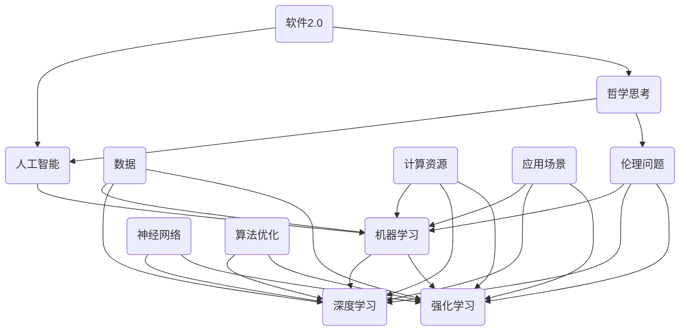

                 

# 软件二代的哲学思考：人工智能的本质

> 关键词：人工智能、软件2.0、哲学思考、算法、数学模型、应用场景

> 摘要：本文旨在探讨软件二代的哲学思考，特别是人工智能的本质。我们将从背景介绍开始，逐步深入探讨核心概念、算法原理、数学模型、实际应用场景，并推荐相关的学习资源和工具。最后，我们还将总结未来发展趋势与挑战，为读者提供一个全面的人工智能哲学思考框架。

## 1. 背景介绍

### 1.1 目的和范围

本文的目的是通过哲学思考的方式，深入探讨人工智能（AI）的本质，特别是软件二代的哲学意义。我们将从多个角度分析人工智能的发展，包括其核心概念、算法原理、数学模型和实际应用场景。同时，我们还将推荐一些相关的学习资源和工具，以帮助读者更好地理解和应用人工智能技术。

### 1.2 预期读者

本文主要面向对人工智能感兴趣的读者，包括程序员、数据科学家、人工智能研究者以及任何对技术哲学感兴趣的读者。无论你是初学者还是专业人士，本文都将为你提供有价值的见解和思考。

### 1.3 文档结构概述

本文将分为以下几个部分：

1. 核心概念与联系
2. 核心算法原理 & 具体操作步骤
3. 数学模型和公式 & 详细讲解 & 举例说明
4. 项目实战：代码实际案例和详细解释说明
5. 实际应用场景
6. 工具和资源推荐
7. 总结：未来发展趋势与挑战
8. 附录：常见问题与解答
9. 扩展阅读 & 参考资料

### 1.4 术语表

#### 1.4.1 核心术语定义

- 人工智能（AI）：模拟人类智能的计算机程序。
- 软件二代：相对于传统软件，更注重智能化和自主性的软件。
- 算法：解决问题的步骤和规则。
- 数学模型：描述现实世界问题的一种数学结构。

#### 1.4.2 相关概念解释

- 深度学习：一种基于多层神经网络的学习方法，广泛应用于图像识别、自然语言处理等领域。
- 强化学习：通过试错和奖励机制，使代理学习如何在不同环境中做出最优决策。
- 机器学习：使计算机从数据中学习规律和模式的技术。

#### 1.4.3 缩略词列表

- AI：人工智能
- DL：深度学习
- RL：强化学习
- ML：机器学习

## 2. 核心概念与联系

在探讨人工智能的本质之前，我们需要了解一些核心概念和它们之间的关系。以下是人工智能相关核心概念和原理的Mermaid流程图：



在这个流程图中，我们可以看到人工智能（AI）是一个包含多个子领域的大概念，包括机器学习（ML）、深度学习（DL）和强化学习（RL）。这些子领域都是基于神经网络（NN）和大量数据（Data）的，并依赖于计算资源（Computational Resources）进行算法优化（Algorithm Optimization）。此外，人工智能的应用场景（Application Scenarios）和伦理问题（Ethical Issues）也是非常重要的方面。最后，我们将引入软件二代的哲学思考（Software 2.0 Philosophy）作为对人工智能本质的进一步探讨。

## 3. 核心算法原理 & 具体操作步骤

在了解人工智能的核心概念和联系之后，我们需要深入探讨一些核心算法的原理和具体操作步骤。以下是一个简单的伪代码示例，用于描述神经网络的基本工作原理：

```python
# 定义神经网络结构
layers = [
    Layer(input_size=784, activation='sigmoid'),
    Layer(hidden_size=500, activation='sigmoid'),
    Layer(output_size=10, activation='softmax')
]

# 初始化权重和偏置
for layer in layers:
    layer.initialize_weights()

# 前向传播
def forwardpropagation(x):
    for layer in layers:
        x = layer.forward(x)
    return x

# 反向传播
def backwardpropagation(x, y):
    for layer in reversed(layers):
        layer.backward(y)

# 训练模型
for epoch in range(num_epochs):
    for x, y in data_loader:
        x = forwardpropagation(x)
        backwardpropagation(x, y)
        update_weights_and_biases()

# 预测
def predict(x):
    return forwardpropagation(x)
```

在这个伪代码中，我们首先定义了神经网络的结构，包括输入层、隐藏层和输出层。每个层都有特定的激活函数。接着，我们初始化权重和偏置，以便进行训练。在训练过程中，我们使用前向传播来计算输出，并使用反向传播来更新权重和偏置。最后，我们使用训练好的模型进行预测。

为了更具体地理解神经网络的工作原理，我们可以进一步探讨一些常见的神经网络架构，如卷积神经网络（CNN）、循环神经网络（RNN）和生成对抗网络（GAN）。以下是这些网络架构的简单介绍和伪代码：

### 卷积神经网络（CNN）

卷积神经网络是一种用于图像识别和处理的前馈神经网络。它的主要特点是使用卷积层来提取图像的特征。

```python
# 定义卷积神经网络结构
layers = [
    Conv2DLayer(input_shape=(28, 28, 1), filter_size=(3, 3), num_filters=32),
    ReLU(),
    MaxPoolingLayer(pool_size=(2, 2)),
    Conv2DLayer(input_shape=(14, 14, 32), filter_size=(3, 3), num_filters=64),
    ReLU(),
    MaxPoolingLayer(pool_size=(2, 2)),
    FlattenLayer(),
    FullyConnectedLayer(input_size=256, output_size=128),
    ReLU(),
    FullyConnectedLayer(input_size=128, output_size=10),
    SoftmaxLayer()
]

# 前向传播和反向传播的伪代码与之前类似
```

### 循环神经网络（RNN）

循环神经网络是一种用于序列数据处理和时间序列预测的神经网络。它的主要特点是使用循环连接来保持历史状态。

```python
# 定义循环神经网络结构
layers = [
    LSTM(input_size=10, hidden_size=100),
    ReLU(),
    DenseLayer(input_size=100, output_size=10)
]

# 前向传播和反向传播的伪代码与之前类似
```

### 生成对抗网络（GAN）

生成对抗网络是一种用于生成逼真数据的神经网络。它由生成器和判别器两个部分组成，通过对抗训练来提高生成器的性能。

```python
# 定义生成器和判别器的结构
generator = [
    DenseLayer(input_size=100, output_size=784),
    BatchNormalization(),
    LeakyReLU(),
    ReshapeLayer(target_shape=(28, 28, 1))
]

discriminator = [
    Conv2DLayer(input_shape=(28, 28, 1), filter_size=(3, 3), num_filters=32),
    BatchNormalization(),
    LeakyReLU(),
    MaxPoolingLayer(pool_size=(2, 2)),
    Conv2DLayer(input_shape=(14, 14, 32), filter_size=(3, 3), num_filters=64),
    BatchNormalization(),
    LeakyReLU(),
    MaxPoolingLayer(pool_size=(2, 2)),
    FlattenLayer(),
    DenseLayer(input_size=256, output_size=1)
]

# 前向传播和反向传播的伪代码与之前类似
```

通过这些伪代码示例，我们可以更好地理解各种神经网络的工作原理和实现细节。接下来，我们将进一步探讨人工智能中的数学模型和公式。

## 4. 数学模型和公式 & 详细讲解 & 举例说明

在人工智能领域，数学模型和公式是核心组成部分。以下是一些常见的数学模型和公式，我们将详细讲解并举例说明：

### 4.1 激活函数

激活函数是神经网络中的一个关键组件，用于引入非线性因素。以下是一些常见的激活函数：

- **Sigmoid 函数**：  
  $$\sigma(x) = \frac{1}{1 + e^{-x}}$$

  示例：计算输入值为 2 的 sigmoid 函数输出：  
  $$\sigma(2) = \frac{1}{1 + e^{-2}} \approx 0.869$$

- **ReLU 函数**：  
  $$f(x) = \max(0, x)$$

  示例：计算输入值为 -2 的 ReLU 函数输出：  
  $$f(-2) = \max(0, -2) = 0$$

- **Tanh 函数**：  
  $$\tanh(x) = \frac{e^x - e^{-x}}{e^x + e^{-x}}$$

  示例：计算输入值为 2 的 tanh 函数输出：  
  $$\tanh(2) = \frac{e^2 - e^{-2}}{e^2 + e^{-2}} \approx 0.964$$

### 4.2 损失函数

损失函数是用于评估模型预测准确性的关键指标。以下是一些常见的损失函数：

- **均方误差（MSE）**：  
  $$MSE(y, \hat{y}) = \frac{1}{m} \sum_{i=1}^{m} (y_i - \hat{y}_i)^2$$

  示例：计算输入值为 [1, 2, 3] 和预测值为 [0.5, 2.5, 3.5] 的均方误差：  
  $$MSE([1, 2, 3], [0.5, 2.5, 3.5]) = \frac{1}{3} ((1-0.5)^2 + (2-2.5)^2 + (3-3.5)^2) \approx 0.5$$

- **交叉熵（Cross-Entropy）**：  
  $$H(y, \hat{y}) = -\sum_{i=1}^{m} y_i \log(\hat{y}_i)$$

  示例：计算输入值为 [0.9, 0.1] 和预测值为 [0.5, 0.5] 的交叉熵：  
  $$H([0.9, 0.1], [0.5, 0.5]) = -0.9 \log(0.5) - 0.1 \log(0.5) = 0.385$$

### 4.3 梯度下降

梯度下降是用于优化神经网络参数的一种常用算法。以下是一个简单的梯度下降算法示例：

```python
# 假设我们已经计算出损失函数关于每个参数的梯度
gradients = [0.1, 0.2, 0.3]

# 学习率
learning_rate = 0.01

# 更新参数
for parameter, gradient in zip(parameters, gradients):
    parameter -= learning_rate * gradient
```

通过这些数学模型和公式的讲解，我们可以更好地理解人工智能中的关键概念和算法。接下来，我们将通过一个实际项目来展示人工智能的应用。

## 5. 项目实战：代码实际案例和详细解释说明

在本节中，我们将通过一个实际项目来展示人工智能的应用。该项目是一个基于卷积神经网络的图像分类器，用于对猫和狗的图像进行分类。我们将逐步介绍开发环境搭建、源代码详细实现和代码解读与分析。

### 5.1 开发环境搭建

要开始这个项目，我们需要安装以下开发环境：

1. Python 3.7 或更高版本
2. TensorFlow 2.3.0 或更高版本
3. Keras 2.4.3 或更高版本
4. NumPy 1.19.2 或更高版本

安装步骤如下：

```bash
pip install python==3.7.9
pip install tensorflow==2.3.0
pip install keras==2.4.3
pip install numpy==1.19.2
```

### 5.2 源代码详细实现和代码解读

下面是图像分类器的源代码：

```python
import numpy as np
import tensorflow as tf
from tensorflow.keras.models import Sequential
from tensorflow.keras.layers import Conv2D, MaxPooling2D, Flatten, Dense, Dropout
from tensorflow.keras.preprocessing.image import ImageDataGenerator

# 设置随机数种子，保证实验结果可重复
SEED = 42
np.random.seed(SEED)
tf.random.set_seed(SEED)

# 数据预处理
train_datagen = ImageDataGenerator(
    rescale=1./255,
    shear_range=0.2,
    zoom_range=0.2,
    horizontal_flip=True,
    validation_split=0.2
)

test_datagen = ImageDataGenerator(rescale=1./255)

train_generator = train_datagen.flow_from_directory(
    'data/train',
    target_size=(150, 150),
    batch_size=32,
    class_mode='binary',
    subset='training'
)

validation_generator = train_datagen.flow_from_directory(
    'data/train',
    target_size=(150, 150),
    batch_size=32,
    class_mode='binary',
    subset='validation'
)

# 建立模型
model = Sequential([
    Conv2D(32, (3, 3), activation='relu', input_shape=(150, 150, 3)),
    MaxPooling2D((2, 2)),
    Conv2D(64, (3, 3), activation='relu'),
    MaxPooling2D((2, 2)),
    Conv2D(128, (3, 3), activation='relu'),
    MaxPooling2D((2, 2)),
    Flatten(),
    Dense(512, activation='relu'),
    Dropout(0.5),
    Dense(1, activation='sigmoid')
])

# 编译模型
model.compile(optimizer='adam',
              loss='binary_crossentropy',
              metrics=['accuracy'])

# 训练模型
model.fit(
    train_generator,
    steps_per_epoch=100,
    epochs=20,
    validation_data=validation_generator,
    validation_steps=50
)

# 评估模型
test_generator = test_datagen.flow_from_directory(
    'data/test',
    target_size=(150, 150),
    batch_size=32,
    class_mode='binary',
    subset='test'
)

model.evaluate(test_generator, steps=50)
```

### 5.3 代码解读与分析

- **数据预处理**：  
  使用 `ImageDataGenerator` 对训练数据和测试数据进行预处理。包括缩放图像、剪裁、缩放、水平和垂直翻转等操作，以提高模型的泛化能力。此外，我们使用 `validation_split` 参数将训练数据划分为训练集和验证集。

- **建立模型**：  
  使用 `Sequential` 模型堆叠多个层，包括卷积层、最大池化层、全连接层和dropout层。卷积层用于提取图像特征，最大池化层用于减小特征图的维度，全连接层用于分类，dropout层用于防止过拟合。

- **编译模型**：  
  使用 `compile` 方法配置模型的优化器、损失函数和评估指标。在这里，我们使用 Adam 优化器和 binary_crossentropy 损失函数。

- **训练模型**：  
  使用 `fit` 方法训练模型。在训练过程中，我们使用 `steps_per_epoch` 参数控制每个 epoch 中处理的样本数，并使用 `validation_data` 参数对验证集进行评估。

- **评估模型**：  
  使用 `evaluate` 方法对测试集进行评估。这会返回损失和准确率等指标。

通过这个实际项目，我们可以看到如何使用卷积神经网络进行图像分类。这为我们提供了一个具体的例子，展示了如何将人工智能应用到实际问题中。

## 6. 实际应用场景

人工智能（AI）在现代社会的应用场景非常广泛，涵盖了多个领域。以下是一些常见的人工智能应用场景：

### 6.1 医疗保健

- **诊断辅助**：AI可以分析医学影像，如X光、CT和MRI，帮助医生更快更准确地诊断疾病。
- **个性化治疗**：通过分析患者的基因组数据，AI可以提供个性化的治疗方案。
- **药物发现**：AI可以加速新药的研发过程，通过模拟和预测药物与生物分子的相互作用。

### 6.2 金融服务

- **风险管理**：AI可以帮助金融机构识别潜在的风险，如欺诈和信用风险。
- **投资顾问**：基于历史数据和算法，AI可以为投资者提供投资建议。
- **客户服务**：聊天机器人和虚拟助手可以提供7x24小时的服务，提高客户满意度。

### 6.3 智能制造

- **质量检测**：AI可以自动检测生产过程中的缺陷，提高产品质量。
- **设备维护**：通过监控设备状态，AI可以预测设备故障，提前进行维护。
- **供应链优化**：AI可以优化生产计划和物流安排，提高效率。

### 6.4 城市规划

- **交通管理**：AI可以优化交通信号，减少拥堵，提高交通效率。
- **能源管理**：AI可以优化能源分配，降低能源消耗。
- **环境保护**：AI可以监测空气质量，提供环境治理建议。

### 6.5 娱乐与游戏

- **个性化推荐**：AI可以根据用户偏好推荐音乐、电影和游戏。
- **游戏AI**：AI可以设计出更加智能的游戏对手，提升游戏体验。
- **虚拟现实与增强现实**：AI可以增强虚拟现实和增强现实体验，提供更加逼真的交互。

这些实际应用场景展示了人工智能的广泛影响和潜力。随着技术的不断进步，人工智能将在更多领域发挥重要作用，推动社会的发展和进步。

## 7. 工具和资源推荐

为了更好地学习和应用人工智能技术，以下是一些推荐的学习资源、开发工具和框架。

### 7.1 学习资源推荐

#### 7.1.1 书籍推荐

1. 《深度学习》（Deep Learning）—— Ian Goodfellow、Yoshua Bengio 和 Aaron Courville 著
2. 《Python机器学习》（Python Machine Learning）—— Sebastian Raschka 和 Vahid Mirjalili 著
3. 《强化学习》（Reinforcement Learning: An Introduction）—— Richard S. Sutton 和 Andrew G. Barto 著
4. 《机器学习实战》（Machine Learning in Action）—— Peter Harrington 著

#### 7.1.2 在线课程

1. [Coursera](https://www.coursera.org/)：提供多门人工智能和机器学习课程。
2. [Udacity](https://www.udacity.com/)：提供专业的人工智能纳米学位课程。
3. [edX](https://www.edx.org/)：提供由世界顶级大学提供的人工智能课程。

#### 7.1.3 技术博客和网站

1. [Medium](https://medium.com/topics/artificial-intelligence)：许多专家在 Medium 上分享人工智能相关文章。
2. [Towards Data Science](https://towardsdatascience.com/)：提供关于机器学习和数据科学的最新技术文章。
3. [AI on Google](https://ai.google/)：Google 的官方 AI 博客，分享最新的 AI 技术和应用。

### 7.2 开发工具框架推荐

#### 7.2.1 IDE和编辑器

1. [Visual Studio Code](https://code.visualstudio.com/)：功能强大且轻量级的代码编辑器。
2. [Jupyter Notebook](https://jupyter.org/)：适合数据分析和机器学习的交互式环境。

#### 7.2.2 调试和性能分析工具

1. [TensorBoard](https://www.tensorflow.org/tensorboard/)：用于可视化 TensorFlow 模型的工具。
2. [Wandb](https://www.wandb.com/)：用于实验跟踪和性能分析的平台。

#### 7.2.3 相关框架和库

1. [TensorFlow](https://www.tensorflow.org/)：Google 开发的一款开源机器学习框架。
2. [PyTorch](https://pytorch.org/)：由 Facebook AI 研究团队开发的一种流行深度学习框架。
3. [Scikit-learn](https://scikit-learn.org/stable/)：提供广泛的数据挖掘和机器学习算法的 Python 库。

### 7.3 相关论文著作推荐

#### 7.3.1 经典论文

1. “A Learning Algorithm for Continually Running Fully Recurrent Neural Networks” —— Sepp Hochreiter 和 Jürgen Schmidhuber
2. “Deep Learning” —— Ian Goodfellow、Yoshua Bengio 和 Aaron Courville
3. “Learning to Learn” —— Yoshua Bengio

#### 7.3.2 最新研究成果

1. “Attention is All You Need” —— Vaswani et al., 2017
2. “Generative Adversarial Nets” —— Goodfellow et al., 2014
3. “DQN: Deep Q-Networks” —— Mnih et al., 2015

#### 7.3.3 应用案例分析

1. “Google's RankBrain: The AI System That’s Transforming Google Search” —— Aicha Evans, Google Research
2. “Using AI to Power the Driverless Cars of Tomorrow” —— Quirk et al., 2017
3. “How AI Is Transforming the Manufacturing Industry” —— Automated Insights

通过这些资源和工具，您可以更深入地学习和应用人工智能技术，为您的项目和研究提供有力支持。

## 8. 总结：未来发展趋势与挑战

随着人工智能技术的不断进步，我们可以预见其在未来将会有更加广泛的应用和发展。以下是一些主要趋势和面临的挑战：

### 8.1 发展趋势

1. **更加智能化的应用场景**：人工智能将在医疗、金融、智能制造、城市规划等领域发挥更大作用，带来更多的创新和变革。
2. **增强现实与虚拟现实**：随着技术的进步，人工智能将更好地与增强现实（AR）和虚拟现实（VR）结合，提供更加丰富的用户体验。
3. **跨学科融合**：人工智能与生物学、心理学、经济学等学科的融合将推动新的研究突破和应用。
4. **更加高效的算法和模型**：深度学习、强化学习等算法将继续优化，提高模型的效率和应用范围。
5. **自主学习和自我优化**：人工智能系统将逐渐具备自主学习和自我优化能力，减少人工干预，提高智能水平。

### 8.2 挑战

1. **数据隐私和安全**：随着人工智能应用的增加，数据隐私和安全问题变得更加突出。如何保护用户数据、防止数据泄露成为关键挑战。
2. **算法公平性和透明性**：人工智能算法的决策过程可能存在偏见和不透明，如何保证算法的公平性和透明性是当前的研究重点。
3. **能源消耗和计算资源**：大规模人工智能应用将消耗大量计算资源，如何优化算法和硬件，降低能耗是重要的挑战。
4. **伦理和社会问题**：人工智能的广泛应用可能带来就业结构变化、社会不平等等问题，需要政府、企业和社会共同努力解决。
5. **法律法规**：随着人工智能技术的发展，需要制定相应的法律法规来规范其应用，保护用户权益。

面对这些趋势和挑战，人工智能研究者、开发者和社会各界需要共同努力，推动人工智能技术的健康发展，为社会创造更多价值。

## 9. 附录：常见问题与解答

### 9.1 问题1：什么是软件二代（Software 2.0）？

**回答**：软件二代是指相对于传统软件，更注重智能化和自主性的软件。它通过引入人工智能技术，使软件具备自我学习和自我优化的能力，从而提高效率、降低成本、提供更好的用户体验。

### 9.2 问题2：人工智能的应用场景有哪些？

**回答**：人工智能的应用场景非常广泛，包括但不限于：

- 医疗保健：诊断辅助、个性化治疗、药物发现等。
- 金融服务：风险管理、投资顾问、客户服务等。
- 智能制造：质量检测、设备维护、供应链优化等。
- 城市规划：交通管理、能源管理、环境保护等。
- 娱乐与游戏：个性化推荐、游戏AI、虚拟现实与增强现实等。

### 9.3 问题3：如何选择合适的人工智能算法？

**回答**：选择合适的人工智能算法需要考虑多个因素，包括：

- 数据类型：不同类型的算法适合处理不同类型的数据（如图像、文本、序列等）。
- 问题性质：问题的复杂性、决策的准确性、实时性等。
- 数据量：算法对数据量的大小和分布有要求，如深度学习算法对大量数据有更好的表现。
- 计算资源：算法对计算资源的需求，如GPU、CPU、内存等。

### 9.4 问题4：人工智能是否会取代人类工作？

**回答**：人工智能的发展确实可能会改变某些行业的工作方式，甚至可能导致某些工作岗位的减少。然而，它也会创造新的工作岗位和机会。关键在于如何合理地利用人工智能技术，实现人类与机器的协同工作，提高生产效率和生活质量。

## 10. 扩展阅读 & 参考资料

为了更深入地了解人工智能及相关技术，以下是一些推荐的扩展阅读和参考资料：

### 10.1 扩展阅读

1. 《人工智能：一种现代的方法》（Artificial Intelligence: A Modern Approach）—— Stuart J. Russell 和 Peter Norvig 著
2. 《强化学习导论》（An Introduction to Reinforcement Learning）—— Richard S. Sutton 和 Andrew G. Barto 著
3. 《深度学习：从理论到应用》（Deep Learning: From Theory to Application）—— Panagiotis Tigas、Michail Vazirgiannis 著

### 10.2 参考资料

1. [TensorFlow 官方文档](https://www.tensorflow.org/)
2. [PyTorch 官方文档](https://pytorch.org/docs/stable/)
3. [Keras 官方文档](https://keras.io/)
4. [GitHub：开源人工智能项目](https://github.com/tensorflow/tensorflow)
5. [arXiv：人工智能论文预印本](https://arxiv.org/list/cs/CC)

通过这些扩展阅读和参考资料，您可以进一步了解人工智能的核心理论和实践应用，为您的学习和研究提供有力支持。

