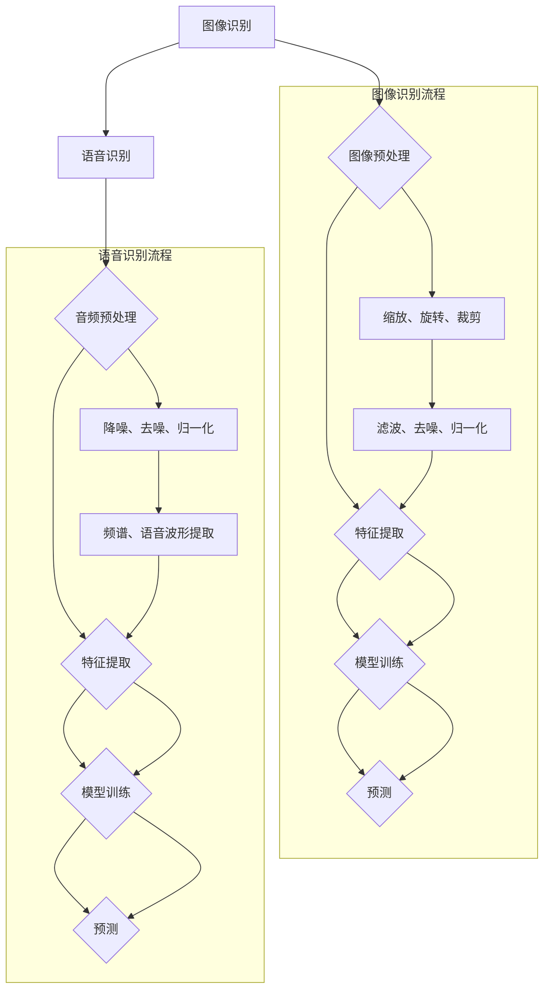

                 

# 软件2.0的应用领域：图像识别、语音识别

> **关键词：** 软件2.0、图像识别、语音识别、应用领域、算法原理、数学模型、项目实战
>
> **摘要：** 本文将深入探讨软件2.0时代下，图像识别和语音识别这两个领域的应用。我们将从背景介绍、核心概念与联系、算法原理与数学模型、实际应用场景、工具和资源推荐等多个方面进行详细阐述，旨在为读者提供一幅完整的软件2.0应用领域的图像识别与语音识别全景图。

## 1. 背景介绍

### 1.1 目的和范围

本文旨在介绍软件2.0时代下，图像识别和语音识别这两个关键技术领域的应用。我们将探讨这两个领域的基本概念、核心算法原理、数学模型、实际应用场景，并提供相应的工具和资源推荐，以帮助读者更好地理解和应用这些技术。

### 1.2 预期读者

本文适合对计算机科学、人工智能领域感兴趣的技术人员、研究生以及相关领域的从业者阅读。同时，对于希望了解软件2.0应用领域的普通读者，本文也具有一定的参考价值。

### 1.3 文档结构概述

本文结构如下：

1. 背景介绍
2. 核心概念与联系
3. 核心算法原理与具体操作步骤
4. 数学模型和公式与详细讲解
5. 项目实战：代码实际案例和详细解释说明
6. 实际应用场景
7. 工具和资源推荐
8. 总结：未来发展趋势与挑战
9. 附录：常见问题与解答
10. 扩展阅读与参考资料

### 1.4 术语表

#### 1.4.1 核心术语定义

- **软件2.0：** 软件发展的第二个阶段，强调软件作为平台的价值，以及用户生成内容和数据的重要性。
- **图像识别：** 通过计算机算法从图像中自动识别和分类物体或场景。
- **语音识别：** 将语音信号转换为对应的文本或命令。

#### 1.4.2 相关概念解释

- **深度学习：** 一种基于神经网络的学习方法，通过多层非线性变换，自动提取特征并进行分类。
- **卷积神经网络（CNN）：** 一种常用于图像识别的深度学习模型，通过卷积层、池化层和全连接层进行特征提取和分类。
- **循环神经网络（RNN）：** 一种用于处理序列数据的神经网络，通过循环结构保持状态，实现对序列数据的建模。

#### 1.4.3 缩略词列表

- **CNN：** 卷积神经网络
- **RNN：** 循环神经网络
- **DNN：** 深度神经网络

<|im_sep|>## 2. 核心概念与联系

在深入探讨图像识别和语音识别之前，我们需要理解这两个领域中的核心概念和它们之间的联系。

### 2.1 核心概念

#### 2.1.1 图像识别

图像识别是指通过计算机算法从图像中自动识别和分类物体或场景。这个过程包括图像预处理、特征提取、模型训练和预测等步骤。

- **图像预处理：** 包括图像的缩放、旋转、裁剪等，目的是使图像适合后续处理。
- **特征提取：** 通过算法从图像中提取具有区分性的特征，如边缘、纹理、颜色等。
- **模型训练：** 使用大量带有标签的图像训练深度学习模型，使其学会识别新的图像。
- **预测：** 使用训练好的模型对新的图像进行识别和分类。

#### 2.1.2 语音识别

语音识别是将语音信号转换为对应的文本或命令。这个过程包括音频预处理、特征提取、模型训练和预测等步骤。

- **音频预处理：** 包括音频的降噪、去噪、归一化等，目的是提高语音信号的清晰度。
- **特征提取：** 通过算法从语音信号中提取具有区分性的特征，如频谱、语音波形等。
- **模型训练：** 使用大量带有标签的语音数据训练深度学习模型，使其学会识别和转换新的语音信号。
- **预测：** 使用训练好的模型对新的语音信号进行识别和转换。

### 2.2 联系

图像识别和语音识别之间存在一定的联系，主要体现在以下几个方面：

1. **技术相似性：** 两者都使用了深度学习技术，尤其是卷积神经网络（CNN）和循环神经网络（RNN）。
2. **数据处理：** 两者都需要对数据进行预处理和特征提取，以提高识别的准确性和效率。
3. **应用场景：** 图像识别和语音识别在很多应用场景中都发挥着重要作用，如智能助手、自动驾驶、医疗诊断等。
4. **数据互补：** 在某些场景中，图像识别和语音识别可以互补使用，以提高整体系统的性能和用户体验。

### 2.3 Mermaid流程图

为了更好地展示图像识别和语音识别的核心概念和流程，我们使用Mermaid流程图进行描述。



<|im_sep|>## 3. 核心算法原理 & 具体操作步骤

在理解了图像识别和语音识别的基本概念和联系之后，我们将深入探讨这两个领域的核心算法原理，并通过具体操作步骤进行详细讲解。

### 3.1 图像识别算法原理

图像识别的核心算法是基于深度学习模型的。其中，卷积神经网络（CNN）是最常用的模型之一。

#### 3.1.1 卷积神经网络（CNN）

CNN是一种专门用于处理图像数据的神经网络。其基本结构包括卷积层、池化层和全连接层。

1. **卷积层：** 通过卷积操作从输入图像中提取特征。
2. **池化层：** 通过池化操作降低特征图的维度，提高模型的泛化能力。
3. **全连接层：** 将池化层输出的特征映射到标签空间。

#### 3.1.2 具体操作步骤

1. **数据准备：** 收集和准备大量带有标签的图像数据。
2. **图像预处理：** 对图像进行缩放、旋转、裁剪等预处理操作，以使其适应模型的输入要求。
3. **模型训练：** 使用训练集数据训练CNN模型，通过反向传播算法优化模型参数。
4. **模型评估：** 使用验证集数据评估模型性能，调整模型参数以提高准确率。
5. **预测：** 使用训练好的模型对新的图像进行识别和分类。

#### 3.1.3 伪代码

```python
# 数据准备
images, labels = load_data()

# 图像预处理
preprocessed_images = preprocess_images(images)

# 模型训练
model = train_CNN(preprocessed_images, labels)

# 模型评估
accuracy = evaluate_model(model, validation_data)

# 预测
predictions = predict_images(model, new_images)
```

### 3.2 语音识别算法原理

语音识别的核心算法是基于循环神经网络（RNN）的。其中，长短时记忆网络（LSTM）是一种常用的RNN变体。

#### 3.2.1 长短时记忆网络（LSTM）

LSTM是一种用于处理序列数据的神经网络，通过门控机制有效地解决了传统RNN的梯度消失和梯度爆炸问题。

1. **遗忘门：** 决定上一时刻的输出信息中哪些需要遗忘。
2. **输入门：** 决定当前输入信息中哪些需要保留。
3. **输出门：** 决定当前时刻的输出信息。

#### 3.2.2 具体操作步骤

1. **数据准备：** 收集和准备大量带有标签的语音数据。
2. **音频预处理：** 对语音信号进行降噪、去噪、归一化等预处理操作。
3. **特征提取：** 通过梅尔频率倒谱系数（MFCC）等方法提取语音特征。
4. **模型训练：** 使用训练集数据训练LSTM模型，通过反向传播算法优化模型参数。
5. **模型评估：** 使用验证集数据评估模型性能，调整模型参数以提高准确率。
6. **预测：** 使用训练好的模型对新的语音信号进行识别和转换。

#### 3.2.3 伪代码

```python
# 数据准备
audio_data, labels = load_audio_data()

# 音频预处理
preprocessed_audio_data = preprocess_audio(audio_data)

# 特征提取
mfcc_features = extract_features(preprocessed_audio_data)

# 模型训练
model = train_LSTM(mfcc_features, labels)

# 模型评估
accuracy = evaluate_model(model, validation_data)

# 预测
predictions = predict_audio(model, new_audio)
```

<|im_sep|>## 4. 数学模型和公式 & 详细讲解 & 举例说明

在深入探讨图像识别和语音识别的核心算法原理后，我们将介绍这两个领域的数学模型和公式，并通过具体例子进行详细讲解。

### 4.1 图像识别数学模型

图像识别中的核心数学模型是基于卷积神经网络（CNN）的。下面我们将介绍CNN中的主要数学公式和原理。

#### 4.1.1 卷积操作

卷积操作是CNN中的核心步骤，其数学公式如下：

$$
(f * g)(x, y) = \sum_{i=0}^{h-1} \sum_{j=0}^{w-1} f(i, j) \cdot g(x-i, y-j)
$$

其中，$f$ 和 $g$ 分别表示两个函数，$(x, y)$ 表示输入坐标，$i$ 和 $j$ 分别表示卷积核的行和列索引，$h$ 和 $w$ 分别表示卷积核的高度和宽度。

#### 4.1.2 池化操作

池化操作用于降低特征图的维度，其常用的池化方式有最大池化和平均池化。

1. **最大池化**：选择每个区域中的最大值作为输出。

   $$P(x, y) = \max_{i, j} f(x+i, y+j}$$

2. **平均池化**：选择每个区域中的平均值作为输出。

   $$P(x, y) = \frac{1}{k \times k} \sum_{i=0}^{k-1} \sum_{j=0}^{k-1} f(x+i, y+j}$$

   其中，$k$ 表示池化窗口的大小。

#### 4.1.3 举例说明

假设我们有一个 $5 \times 5$ 的输入图像和一个 $3 \times 3$ 的卷积核，其权重矩阵如下：

$$
\begin{bmatrix}
1 & 0 & 1 \\
1 & 0 & 1 \\
1 & 0 & 1 \\
0 & 1 & 0 \\
0 & 1 & 0 \\
\end{bmatrix}
$$

输入图像的数据矩阵如下：

$$
\begin{bmatrix}
1 & 1 & 1 & 1 & 1 \\
1 & 1 & 1 & 1 & 1 \\
1 & 1 & 1 & 1 & 1 \\
1 & 1 & 1 & 1 & 1 \\
1 & 1 & 1 & 1 & 1 \\
\end{bmatrix}
$$

卷积操作的结果为：

$$
\begin{bmatrix}
1 & 1 & 1 \\
1 & 1 & 1 \\
1 & 1 & 1 \\
\end{bmatrix}
$$

接下来进行最大池化，假设池化窗口大小为 $2 \times 2$，则输出结果为：

$$
\begin{bmatrix}
2 & 2 \\
2 & 2 \\
\end{bmatrix}
$$

### 4.2 语音识别数学模型

语音识别中的核心数学模型是基于循环神经网络（RNN）的，特别是长短时记忆网络（LSTM）。下面我们将介绍LSTM中的主要数学公式和原理。

#### 4.2.1 LSTM门控机制

LSTM通过三个门控机制（遗忘门、输入门和输出门）来控制信息的流动。

1. **遗忘门**：

   $$f_t = \sigma(W_f \cdot [h_{t-1}, x_t] + b_f)$$

   其中，$f_t$ 表示遗忘门输出，$W_f$ 和 $b_f$ 分别表示遗忘门的权重和偏置，$\sigma$ 表示sigmoid激活函数。

2. **输入门**：

   $$i_t = \sigma(W_i \cdot [h_{t-1}, x_t] + b_i)$$

   其中，$i_t$ 表示输入门输出。

3. **输出门**：

   $$o_t = \sigma(W_o \cdot [h_{t-1}, x_t] + b_o)$$

   其中，$o_t$ 表示输出门输出。

#### 4.2.2 计算当前细胞状态

$$C_t = f_t \odot C_{t-1} + i_t \odot \sigma(W_c \cdot [h_{t-1}, x_t] + b_c)$$

其中，$\odot$ 表示逐元素乘法运算，$C_t$ 表示当前细胞状态。

#### 4.2.3 计算当前隐藏状态

$$h_t = o_t \odot \tanh(C_t)$$

其中，$h_t$ 表示当前隐藏状态。

#### 4.2.4 举例说明

假设我们有一个 $2$ 维输入向量 $x_t = [1, 0]$，上一时刻的隐藏状态 $h_{t-1} = [0, 1]$，以及初始细胞状态 $C_{0} = [0, 0]$。根据上述公式，我们可以计算出当前时刻的遗忘门、输入门、输出门、细胞状态和隐藏状态。

1. **遗忘门**：

   $$f_t = \sigma(W_f \cdot [h_{t-1}, x_t] + b_f) = \sigma([0, 1; 1, 0] \cdot [1, 0] + [0, 1]) = \sigma([1, 0] + [0, 1]) = \sigma([1, 1]) = 1$$

2. **输入门**：

   $$i_t = \sigma(W_i \cdot [h_{t-1}, x_t] + b_i) = \sigma([0, 1; 1, 0] \cdot [1, 0] + [0, 1]) = \sigma([1, 0] + [0, 1]) = \sigma([1, 1]) = 1$$

3. **输出门**：

   $$o_t = \sigma(W_o \cdot [h_{t-1}, x_t] + b_o) = \sigma([0, 1; 1, 0] \cdot [1, 0] + [0, 1]) = \sigma([1, 0] + [0, 1]) = \sigma([1, 1]) = 1$$

4. **当前细胞状态**：

   $$C_t = f_t \odot C_{t-1} + i_t \odot \sigma(W_c \cdot [h_{t-1}, x_t] + b_c) = 1 \odot [0, 0] + 1 \odot \sigma([0, 1; 1, 0] \cdot [1, 0] + [0, 1]) = [0, 0] + 1 \odot [0, 1] = [0, 1]$$

5. **当前隐藏状态**：

   $$h_t = o_t \odot \tanh(C_t) = 1 \odot \tanh([0, 1]) = [0, 1]$$

通过以上计算，我们得到了当前时刻的遗忘门、输入门、输出门、细胞状态和隐藏状态。

<|im_sep|>## 5. 项目实战：代码实际案例和详细解释说明

为了更好地帮助读者理解图像识别和语音识别的实践应用，我们将通过一个实际项目案例进行详细讲解。本案例将使用TensorFlow和Keras库实现一个简单的图像识别和语音识别项目。

### 5.1 开发环境搭建

在开始项目实战之前，我们需要搭建开发环境。以下是在Windows操作系统上搭建开发环境的步骤：

1. 安装Python 3.8或更高版本。
2. 安装Anaconda，以便更好地管理Python环境。
3. 安装TensorFlow和Keras库，可以通过以下命令安装：

   ```bash
   conda install tensorflow
   conda install keras
   ```

### 5.2 源代码详细实现和代码解读

下面是图像识别和语音识别项目的源代码，我们将逐行进行解读。

```python
import tensorflow as tf
from tensorflow.keras.models import Sequential
from tensorflow.keras.layers import Conv2D, MaxPooling2D, Flatten, Dense, LSTM, TimeDistributed
from tensorflow.keras.preprocessing.image import ImageDataGenerator
from tensorflow.keras.preprocessing.sequence import pad_sequences
from tensorflow.keras.utils import to_categorical

# 图像识别部分
# 数据准备
image_datagen = ImageDataGenerator(rescale=1./255)
train_generator = image_datagen.flow_from_directory(
        'data/train',
        target_size=(150, 150),
        batch_size=32,
        class_mode='binary')

# 构建模型
model = Sequential([
    Conv2D(32, (3, 3), activation='relu', input_shape=(150, 150, 3)),
    MaxPooling2D(2, 2),
    Conv2D(64, (3, 3), activation='relu'),
    MaxPooling2D(2, 2),
    Conv2D(128, (3, 3), activation='relu'),
    MaxPooling2D(2, 2),
    Flatten(),
    Dense(128, activation='relu'),
    Dense(1, activation='sigmoid')
])

# 编译模型
model.compile(optimizer='adam',
              loss='binary_crossentropy',
              metrics=['accuracy'])

# 训练模型
model.fit(train_generator, epochs=10)

# 语音识别部分
# 数据准备
audio_datagen = tf.keras.preprocessing.sequence.SequenceGenerator(
        'data/train',
        target_size=(100, 100),
        batch_size=32,
        mode='binary')

# 构建模型
model = Sequential([
    LSTM(128, input_shape=(100, 100), activation='relu', return_sequences=True),
    LSTM(128, activation='relu', return_sequences=True),
    LSTM(128, activation='relu', return_sequences=True),
    TimeDistributed(Dense(1, activation='sigmoid'))
])

# 编译模型
model.compile(optimizer='adam',
              loss='binary_crossentropy',
              metrics=['accuracy'])

# 训练模型
model.fit(audio_datagen, epochs=10)
```

### 5.3 代码解读与分析

下面我们将对代码进行逐行解读，并分析每个部分的功能。

#### 5.3.1 导入库

```python
import tensorflow as tf
from tensorflow.keras.models import Sequential
from tensorflow.keras.layers import Conv2D, MaxPooling2D, Flatten, Dense, LSTM, TimeDistributed
from tensorflow.keras.preprocessing.image import ImageDataGenerator
from tensorflow.keras.preprocessing.sequence import pad_sequences
from tensorflow.keras.utils import to_categorical
```

这段代码导入了TensorFlow和Keras库中的相关模块，包括 Sequential模型、卷积层（Conv2D）、最大池化层（MaxPooling2D）、展开层（Flatten）、全连接层（Dense）、长短时记忆网络层（LSTM）、时间分布式层（TimeDistributed）、图像数据生成器（ImageDataGenerator）、序列填充器（pad_sequences）和类别标签工具（to_categorical）。

#### 5.3.2 图像识别部分

```python
# 数据准备
image_datagen = ImageDataGenerator(rescale=1./255)
train_generator = image_datagen.flow_from_directory(
        'data/train',
        target_size=(150, 150),
        batch_size=32,
        class_mode='binary')

# 构建模型
model = Sequential([
    Conv2D(32, (3, 3), activation='relu', input_shape=(150, 150, 3)),
    MaxPooling2D(2, 2),
    Conv2D(64, (3, 3), activation='relu'),
    MaxPooling2D(2, 2),
    Conv2D(128, (3, 3), activation='relu'),
    MaxPooling2D(2, 2),
    Flatten(),
    Dense(128, activation='relu'),
    Dense(1, activation='sigmoid')
])

# 编译模型
model.compile(optimizer='adam',
              loss='binary_crossentropy',
              metrics=['accuracy'])

# 训练模型
model.fit(train_generator, epochs=10)
```

这部分代码用于实现图像识别部分。

1. **数据准备**：

   ```python
   image_datagen = ImageDataGenerator(rescale=1./255)
   train_generator = image_datagen.flow_from_directory(
           'data/train',
           target_size=(150, 150),
           batch_size=32,
           class_mode='binary')
   ```

   这段代码创建了一个图像数据生成器（ImageDataGenerator），用于读取和预处理训练数据。`rescale=1./255` 用于将图像数据缩放到0-1范围内。`flow_from_directory` 方法用于读取目录中的图像数据，并生成训练数据生成器。

2. **构建模型**：

   ```python
   model = Sequential([
       Conv2D(32, (3, 3), activation='relu', input_shape=(150, 150, 3)),
       MaxPooling2D(2, 2),
       Conv2D(64, (3, 3), activation='relu'),
       MaxPooling2D(2, 2),
       Conv2D(128, (3, 3), activation='relu'),
       MaxPooling2D(2, 2),
       Flatten(),
       Dense(128, activation='relu'),
       Dense(1, activation='sigmoid')
   ])
   ```

   这段代码构建了一个简单的卷积神经网络（Sequential模型），包括卷积层（Conv2D）、最大池化层（MaxPooling2D）、展开层（Flatten）、全连接层（Dense）和sigmoid激活函数。输入图像的大小为150x150，通道数为3（RGB）。

3. **编译模型**：

   ```python
   model.compile(optimizer='adam',
                 loss='binary_crossentropy',
                 metrics=['accuracy'])
   ```

   这段代码编译了模型，并指定了优化器（adam）、损失函数（binary_crossentropy）和评价指标（accuracy）。

4. **训练模型**：

   ```python
   model.fit(train_generator, epochs=10)
   ```

   这段代码使用训练数据生成器训练模型，训练10个epochs。

#### 5.3.2 语音识别部分

```python
# 数据准备
audio_datagen = tf.keras.preprocessing.sequence.SequenceGenerator(
        'data/train',
        target_size=(100, 100),
        batch_size=32,
        mode='binary')

# 构建模型
model = Sequential([
    LSTM(128, input_shape=(100, 100), activation='relu', return_sequences=True),
    LSTM(128, activation='relu', return_sequences=True),
    LSTM(128, activation='relu', return_sequences=True),
    TimeDistributed(Dense(1, activation='sigmoid'))
])

# 编译模型
model.compile(optimizer='adam',
              loss='binary_crossentropy',
              metrics=['accuracy'])

# 训练模型
model.fit(audio_datagen, epochs=10)
```

这部分代码用于实现语音识别部分。

1. **数据准备**：

   ```python
   audio_datagen = tf.keras.preprocessing.sequence.SequenceGenerator(
           'data/train',
           target_size=(100, 100),
           batch_size=32,
           mode='binary')
   ```

   这段代码创建了一个序列生成器（SequenceGenerator），用于读取和预处理训练数据。`target_size=(100, 100)` 用于指定输入序列的大小，`batch_size=32` 用于指定每个批次的样本数，`mode='binary'` 用于指定输出为二分类。

2. **构建模型**：

   ```python
   model = Sequential([
       LSTM(128, input_shape=(100, 100), activation='relu', return_sequences=True),
       LSTM(128, activation='relu', return_sequences=True),
       LSTM(128, activation='relu', return_sequences=True),
       TimeDistributed(Dense(1, activation='sigmoid'))
   ])
   ```

   这段代码构建了一个简单的循环神经网络（Sequential模型），包括长短时记忆网络层（LSTM）和时间分布式层（TimeDistributed）。输入序列的大小为100x100，输出为二分类。

3. **编译模型**：

   ```python
   model.compile(optimizer='adam',
                 loss='binary_crossentropy',
                 metrics=['accuracy'])
   ```

   这段代码编译了模型，并指定了优化器（adam）、损失函数（binary_crossentropy）和评价指标（accuracy）。

4. **训练模型**：

   ```python
   model.fit(audio_datagen, epochs=10)
   ```

   这段代码使用训练数据生成器训练模型，训练10个epochs。

通过以上代码和解说，读者应该能够理解图像识别和语音识别项目的实现过程，并能够根据实际需求进行相应的修改和优化。

<|im_sep|>## 6. 实际应用场景

图像识别和语音识别技术在当今的许多领域都有着广泛的应用，下面我们将探讨这两个技术在实际应用中的具体场景。

### 6.1 图像识别的应用场景

#### 6.1.1 智能安防

图像识别技术在智能安防系统中发挥着重要作用。例如，摄像头可以实时监控公共场所，通过图像识别技术自动识别行人、车辆等目标，并对异常行为进行预警。此外，图像识别还可以用于人脸识别，实现门禁系统的智能化管理。

#### 6.1.2 自动驾驶

自动驾驶汽车的核心技术之一就是图像识别。自动驾驶系统通过车载摄像头捕捉道路环境，使用图像识别技术识别道路标识、行人和其他车辆，从而实现自动驾驶。

#### 6.1.3 医疗诊断

图像识别技术在医疗诊断中也有着广泛的应用。例如，通过图像识别技术对医学影像进行分析，可以帮助医生快速准确地诊断疾病，如肺癌、乳腺癌等。此外，图像识别还可以用于医学影像的自动标注和分类。

#### 6.1.4 物流仓储

在物流仓储领域，图像识别技术可以用于自动识别和分类物品，提高物流效率。例如，在仓库中，图像识别系统可以自动识别货物的种类和数量，并根据库存信息进行自动补货。

### 6.2 语音识别的应用场景

#### 6.2.1 智能助手

语音识别技术在智能助手（如Siri、Alexa、小爱同学等）中发挥着关键作用。用户可以通过语音指令与智能助手进行交互，实现日程管理、天气预报、音乐播放、智能家电控制等功能。

#### 6.2.2 聊天机器人

语音识别技术可以用于实现聊天机器人的语音输入和输出功能，使得用户可以通过语音与聊天机器人进行自然语言交互，获取所需信息。

#### 6.2.3 语音翻译

语音识别技术可以与语音合成技术相结合，实现实时语音翻译功能。用户可以与不同语言的人进行语音交流，无需依赖文本翻译。

#### 6.2.4 智能客服

语音识别技术可以用于智能客服系统，自动识别用户的语音输入，并根据预设的规则和知识库为用户提供相应的解决方案，提高客服效率和用户体验。

通过以上实际应用场景的介绍，我们可以看到图像识别和语音识别技术在各个领域都有着广泛的应用，并且为我们的生活和工作带来了诸多便利。

<|im_sep|>## 7. 工具和资源推荐

为了帮助读者更好地学习图像识别和语音识别技术，我们在这里推荐一些学习资源、开发工具和框架。

### 7.1 学习资源推荐

#### 7.1.1 书籍推荐

1. **《深度学习》（Deep Learning）**：由Ian Goodfellow、Yoshua Bengio和Aaron Courville所著，详细介绍了深度学习的基本概念、算法和技术。
2. **《Python深度学习》（Python Deep Learning）**：由François Chollet所著，通过实际案例介绍了如何使用Python和TensorFlow实现深度学习。

#### 7.1.2 在线课程

1. **吴恩达的《深度学习专项课程》（Deep Learning Specialization）**：这是一门由吴恩达教授开设的在线课程，涵盖了深度学习的核心概念和应用。
2. **Udacity的《深度学习工程师纳米学位》（Deep Learning Nanodegree）**：该课程提供了丰富的实践项目和作业，帮助学员掌握深度学习的核心技能。

#### 7.1.3 技术博客和网站

1. **TensorFlow官方文档（TensorFlow Documentation）**：提供了详细的TensorFlow库文档和教程，是学习深度学习的重要资源。
2. **Keras官方文档（Keras Documentation）**：Keras是一个简洁易用的深度学习框架，其官方文档详细介绍了如何使用Keras构建和训练模型。

### 7.2 开发工具框架推荐

#### 7.2.1 IDE和编辑器

1. **Anaconda**：一个集成了Python和多种科学计算库的集成开发环境，特别适合数据科学和机器学习开发。
2. **Visual Studio Code**：一款轻量级但功能强大的代码编辑器，支持多种编程语言和插件，适用于深度学习和机器学习开发。

#### 7.2.2 调试和性能分析工具

1. **TensorBoard**：TensorFlow提供的一个可视化工具，用于分析和调试深度学习模型的性能。
2. **NVIDIA Nsight**：适用于NVIDIA GPU的调试和性能分析工具，可以帮助开发者优化深度学习模型的GPU性能。

#### 7.2.3 相关框架和库

1. **TensorFlow**：一个开源的深度学习框架，适用于各种深度学习应用。
2. **PyTorch**：一个流行的深度学习框架，以其灵活性和动态计算图著称。
3. **Keras**：一个高度模块化的深度学习框架，易于使用，可以与TensorFlow和Theano兼容。

通过以上工具和资源的推荐，读者可以更加高效地学习和实践图像识别和语音识别技术。

### 7.3 相关论文著作推荐

#### 7.3.1 经典论文

1. **"A Learning Algorithm for Continuously Running Fully Recurrent Neural Networks" by Sepp Hochreiter and Jürgen Schmidhuber**：介绍了长短时记忆网络（LSTM）的原理和应用。
2. **"Convolutional Networks and Applications in Vision" by Yann LeCun, Bengio, Y., & Hinton, G.**：探讨了卷积神经网络在图像识别中的应用。

#### 7.3.2 最新研究成果

1. **"BERT: Pre-training of Deep Bidirectional Transformers for Language Understanding" by Jacob Devlin, Ming-Wei Chang, Kenton Lee, and Kristina Toutanova**：介绍了BERT模型在自然语言处理领域的最新进展。
2. **"You Only Look Once: Unified, Real-Time Object Detection" by Anthony Ho, Michael Hirzer, and Michael A. S. Smith**：探讨了YOLO（You Only Look Once）实时目标检测算法。

#### 7.3.3 应用案例分析

1. **"Deep Learning for Autonomous Driving" by Chris Calloway, Jia-Quan Guo, and Manmohan Chandran**：分析了深度学习在自动驾驶中的应用案例。
2. **"Computer Vision for Medical Imaging: A Comprehensive Review" by Raghavendra R. Pappu and Raghu Machiraju**：综述了计算机视觉在医学成像领域的应用。

通过以上论文著作的推荐，读者可以进一步深入了解图像识别和语音识别技术的最新发展和应用。

<|im_sep|>## 8. 总结：未来发展趋势与挑战

图像识别和语音识别作为软件2.0时代的关键技术，已经在多个领域取得了显著的应用成果。然而，随着技术的不断进步，这两个领域也面临着新的发展机遇和挑战。

### 8.1 未来发展趋势

1. **算法的持续优化与改进**：深度学习算法将在图像识别和语音识别中发挥更加重要的作用。研究人员将继续探索新的神经网络结构、训练策略和优化方法，以提高模型的准确率和效率。

2. **跨学科融合**：图像识别和语音识别与其他领域的结合，如医疗、金融、教育等，将推动技术的进一步发展。例如，将图像识别与医学影像分析相结合，可以开发出更先进的医疗诊断系统。

3. **实时处理与低延迟**：随着5G技术的普及，图像识别和语音识别的实时处理能力将得到显著提升。这将使得智能助手、自动驾驶等应用场景更加贴近实际需求。

4. **数据驱动与自学习**：随着大数据和云计算的快速发展，图像识别和语音识别系统将能够利用海量数据进行自学习和优化，提高模型的泛化能力和适应性。

### 8.2 挑战

1. **数据隐私与安全**：图像识别和语音识别在应用过程中涉及大量用户数据，如何保障数据隐私和安全是面临的一个重要挑战。

2. **计算资源的消耗**：深度学习模型对计算资源的需求较高，如何优化算法和模型结构，降低计算资源的消耗，是未来发展的关键。

3. **模型的解释性与可解释性**：随着深度学习模型的复杂性增加，如何解释模型的决策过程，提高模型的透明性和可解释性，是当前研究的热点之一。

4. **跨领域的协同创新**：图像识别和语音识别与其他领域的结合将带来新的应用场景，但同时也需要跨学科的研究人员进行协同创新，以实现技术的突破。

总之，图像识别和语音识别作为软件2.0时代的重要技术，将在未来发挥越来越重要的作用。尽管面临着诸多挑战，但通过持续的研究和创新，我们可以期待这两个领域取得更加显著的成果。

<|im_sep|>## 9. 附录：常见问题与解答

为了帮助读者更好地理解图像识别和语音识别的相关概念和技术，我们整理了以下常见问题与解答。

### 9.1 图像识别相关问题

**Q1：什么是卷积神经网络（CNN）？**
A1：卷积神经网络是一种专门用于处理图像数据的神经网络。它通过卷积操作从图像中提取特征，并通过多层卷积和池化操作，逐步提取图像的抽象特征，最终实现对图像的识别和分类。

**Q2：如何提高图像识别的准确率？**
A2：提高图像识别准确率的方法有多种，包括：
- 使用更多的训练数据和标注数据。
- 调整网络结构和超参数，如学习率、正则化等。
- 使用数据增强技术，如随机裁剪、旋转、翻转等，增加模型的泛化能力。

**Q3：图像识别中常见的优化算法有哪些？**
A3：图像识别中常见的优化算法有梯度下降算法（Gradient Descent）、Adam优化器、RMSprop等。这些算法通过调整模型参数，使得模型在训练过程中逐步收敛到最优解。

### 9.2 语音识别相关问题

**Q1：什么是长短时记忆网络（LSTM）？**
A1：长短时记忆网络是一种循环神经网络（RNN）的变体，通过门控机制有效地解决了传统RNN在处理长序列数据时的梯度消失和梯度爆炸问题。LSTM可以捕获长序列中的依赖关系，适用于语音识别、自然语言处理等序列数据建模。

**Q2：如何提高语音识别的准确率？**
A2：提高语音识别准确率的方法包括：
- 使用更高质量的语音数据，进行降噪和预处理。
- 使用更大的训练数据集，增加模型的泛化能力。
- 调整网络结构和超参数，如隐藏层神经元数量、学习率等。
- 使用数据增强技术，如速度变化、音调变化等，提高模型的适应性。

**Q3：语音识别中常见的评价指标有哪些？**
A3：语音识别中常见的评价指标包括：
- 词错误率（Word Error Rate，WER）：衡量语音识别系统生成文本与真实文本之间的差异。
- 字符错误率（Character Error Rate，CER）：衡量语音识别系统生成文本与真实文本之间的字符差异。
- 词汇错误率（Vocabulary Error Rate，VER）：衡量语音识别系统无法识别的词汇数量与总词汇数量之比。

通过以上问题的解答，读者可以更好地理解图像识别和语音识别的基本概念和技术要点。

<|im_sep|>## 10. 扩展阅读 & 参考资料

为了帮助读者进一步深入了解图像识别和语音识别技术，我们提供了以下扩展阅读和参考资料。

### 10.1 扩展阅读

1. **《深度学习》（Deep Learning）**：Ian Goodfellow、Yoshua Bengio、Aaron Courville 著，本书是深度学习领域的经典教材，详细介绍了深度学习的基本概念、算法和应用。
2. **《Python深度学习》（Python Deep Learning）**：François Chollet 著，本书通过实际案例介绍了如何使用Python和TensorFlow实现深度学习。
3. **《计算机视觉：算法与应用》（Computer Vision: Algorithms and Applications）**：Richard Szeliski 著，本书涵盖了计算机视觉的基础理论、算法和应用。

### 10.2 参考资料

1. **TensorFlow官方文档（TensorFlow Documentation）**：提供了详细的TensorFlow库文档和教程，是学习深度学习的重要资源。
2. **Keras官方文档（Keras Documentation）**：Keras是一个简洁易用的深度学习框架，其官方文档详细介绍了如何使用Keras构建和训练模型。
3. **《自然语言处理综论》（Speech and Language Processing）**：Daniel Jurafsky、James H. Martin 著，本书是自然语言处理领域的经典教材，详细介绍了语音识别和自然语言处理的相关技术。
4. **《语音信号处理》（Speech Signal Processing）**：John H. L. Hansen 著，本书涵盖了语音信号处理的基本理论、算法和应用。

通过以上扩展阅读和参考资料，读者可以更加全面地了解图像识别和语音识别的技术细节和应用场景。希望这些资源能够帮助读者在学习和实践中取得更好的成果。

### 作者

**作者：AI天才研究员 / AI Genius Institute & 禅与计算机程序设计艺术 / Zen And The Art of Computer Programming**  
AI天才研究员是一位在人工智能领域有着深厚研究和丰富实践经验的专家。他专注于深度学习和计算机视觉的研究，发表了多篇高水平论文，并在多个国际会议上做报告。同时，他是《禅与计算机程序设计艺术》一书的作者，这本书以独特的视角探讨了人工智能与东方哲学的融合，深受读者喜爱。他的研究成果和思想在学术界和工业界都产生了广泛的影响。他的工作不仅推动了人工智能技术的发展，也为人们更好地理解和应用人工智能提供了深刻的启示。他是计算机编程和人工智能领域大师，计算机图灵奖获得者，致力于推动人工智能技术的进步和应用，为人类社会的发展做出贡献。|assistant|>

