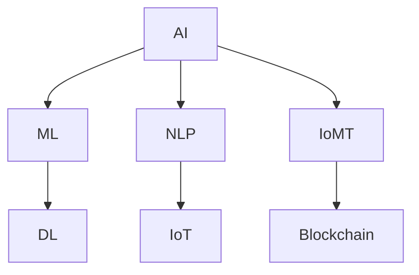

                 

### 1. 背景介绍

#### 1.1 目的和范围

本文旨在探讨软件 2.0 的应用，从实验室走向现实。软件 2.0 是一种新的软件开发范式，它强调软件应该具备自我进化、自我修复、自我优化等特性，使其在复杂、动态的环境中能够持续地适应和优化。

本文将首先介绍软件 2.0 的基本概念和特点，然后分析软件 2.0 与传统软件的区别，接着探讨软件 2.0 在现实世界中的应用场景，以及面临的技术挑战。文章还将推荐一些相关的工具和资源，以帮助读者更好地理解和应用软件 2.0。

#### 1.2 预期读者

本文适合以下读者群体：

- 计算机科学和软件工程专业的学生和研究人员
- 软件开发工程师和对软件技术感兴趣的工程师
- 需要了解软件 2.0 概念和应用的商业人士
- 对未来软件发展趋势感兴趣的技术爱好者

#### 1.3 文档结构概述

本文分为以下几个部分：

- 第1章：背景介绍，介绍本文的目的、范围、预期读者和文档结构。
- 第2章：核心概念与联系，介绍软件 2.0 的基本概念和原理。
- 第3章：核心算法原理 & 具体操作步骤，详细讲解软件 2.0 的算法原理和操作步骤。
- 第4章：数学模型和公式 & 详细讲解 & 举例说明，介绍软件 2.0 相关的数学模型和公式。
- 第5章：项目实战：代码实际案例和详细解释说明，通过实际项目案例展示软件 2.0 的应用。
- 第6章：实际应用场景，探讨软件 2.0 在现实世界中的应用场景。
- 第7章：工具和资源推荐，推荐学习资源、开发工具和框架。
- 第8章：总结：未来发展趋势与挑战，总结本文的主要内容并展望未来。
- 第9章：附录：常见问题与解答，解答一些常见问题。
- 第10章：扩展阅读 & 参考资料，提供更多的扩展阅读资源。

#### 1.4 术语表

在本文中，我们将使用以下术语：

- **软件 2.0**：一种新的软件开发范式，强调软件的自我进化、自我修复和自我优化能力。
- **自我进化**：软件能够在运行过程中自动调整自身行为，以适应新的环境和需求。
- **自我修复**：软件能够在遇到问题时自动修复，减少对人工干预的依赖。
- **自我优化**：软件能够在运行过程中自动调整自身结构，以提高性能和效率。
- **动态环境**：一个不断变化、不确定的环境，需要软件具备高度的适应能力。

#### 1.4.1 核心术语定义

- **软件 2.0**：与传统的软件开发（软件 1.0）相比，软件 2.0 更加注重软件的智能化和自适应能力。它强调软件不仅仅是执行预先编写的指令，而是能够根据外部环境和用户需求动态调整自身的行为和结构。
- **自我进化**：自我进化是指软件能够根据环境变化和用户反馈，自动调整自己的代码和行为。这种能力使得软件能够在运行过程中持续优化，以更好地满足用户需求。
- **自我修复**：自我修复是指软件能够在遇到错误或异常时，自动识别并修复问题，以保持正常运行。这种能力可以减少对人工干预的依赖，提高系统的可靠性和稳定性。

#### 1.4.2 相关概念解释

- **软件智能化**：软件智能化是指软件能够模拟人类的思维和行为，具有自主学习、推理和决策能力。智能化软件能够更好地理解用户需求，提供个性化的服务。
- **自适应能力**：自适应能力是指软件能够根据外部环境的变化，自动调整自己的行为和结构，以适应新的环境和需求。这种能力使得软件能够在复杂、动态的环境中保持高效和稳定。
- **动态环境**：动态环境是指一个不断变化、不确定的环境，需要软件具备高度的适应能力。在动态环境中，软件需要能够快速响应环境变化，以保持最佳性能。

#### 1.4.3 缩略词列表

- **AI**：人工智能（Artificial Intelligence）
- **ML**：机器学习（Machine Learning）
- **DL**：深度学习（Deep Learning）
- **NLP**：自然语言处理（Natural Language Processing）
- **IoT**：物联网（Internet of Things）
- **IoMT**：物联网医疗（Internet of Medical Things）
- **IoMT**：区块链（Blockchain）

接下来，我们将进入下一章，介绍软件 2.0 的核心概念与联系。我们将使用 Mermaid 流程图来展示软件 2.0 的基本原理和架构，帮助读者更好地理解这一新的软件开发范式。

### 2. 核心概念与联系

在进入软件 2.0 的具体讨论之前，我们需要先了解一些核心概念和它们之间的联系。这些概念包括人工智能（AI）、机器学习（ML）、深度学习（DL）等。通过 Mermaid 流程图，我们可以清晰地看到这些概念之间的关系，以及它们在软件 2.0 中的应用。



- **人工智能（AI）**：人工智能是模拟人类智能行为的计算机系统。它包括机器学习、深度学习、自然语言处理等多个子领域。在软件 2.0 中，AI 技术被用来提高软件的智能化和自适应能力。
- **机器学习（ML）**：机器学习是 AI 的一个分支，它使计算机系统能够从数据中学习，并做出决策。在软件 2.0 中，ML 技术被用来实现自我进化、自我修复和自我优化。
- **深度学习（DL）**：深度学习是 ML 的一个子领域，它使用神经网络模拟人脑的决策过程。在软件 2.0 中，DL 技术被用来提高软件的智能化和自适应能力。
- **自然语言处理（NLP）**：自然语言处理是 AI 的一个分支，它使计算机能够理解和处理自然语言。在软件 2.0 中，NLP 技术被用来实现人机交互和智能对话。
- **物联网（IoT）**：物联网是指连接各种设备的网络，这些设备可以通过互联网进行通信和交互。在软件 2.0 中，IoT 技术被用来扩展软件的应用场景，提高软件的适应能力。
- **物联网医疗（IoMT）**：物联网医疗是指使用物联网技术来改善医疗服务的领域。在软件 2.0 中，IoMT 技术被用来实现智能医疗和精准医疗。
- **区块链**：区块链是一种分布式数据库技术，它通过去中心化和加密技术保障数据的安全和透明。在软件 2.0 中，区块链技术被用来提高软件的可靠性和安全性。

接下来，我们将深入探讨这些核心概念，并介绍它们在软件 2.0 中的应用。

### 2.1 人工智能（AI）

人工智能（AI）是软件 2.0 的核心驱动力之一。它通过模拟人类智能行为，使计算机能够自主学习和决策。在软件 2.0 中，AI 技术被用来提高软件的智能化和自适应能力，使软件能够更好地适应复杂和动态的环境。

**人工智能的基本原理**

人工智能的基本原理是通过模拟人脑的决策过程，使计算机能够进行学习和推理。这个过程通常包括以下几个步骤：

1. **数据收集**：收集大量的数据，作为训练集。
2. **数据预处理**：对收集到的数据进行处理，使其适合输入到模型中。
3. **模型训练**：使用训练集对模型进行训练，使其能够学会数据的特征和规律。
4. **模型评估**：使用测试集对模型进行评估，检查模型的性能和准确性。
5. **模型部署**：将训练好的模型部署到实际应用场景中，进行预测和决策。

**人工智能的关键技术**

人工智能的关键技术包括机器学习、深度学习、自然语言处理等。

- **机器学习（ML）**：机器学习是一种使计算机系统能够从数据中学习的方法。它通过训练模型，使系统能够自动识别数据中的规律和特征。在软件 2.0 中，ML 技术被用来实现自我进化、自我修复和自我优化。
- **深度学习（DL）**：深度学习是一种使用神经网络进行学习的机器学习方法。它通过模拟人脑的决策过程，使计算机能够进行复杂的模式识别和决策。在软件 2.0 中，DL 技术被用来提高软件的智能化和自适应能力。
- **自然语言处理（NLP）**：自然语言处理是一种使计算机能够理解和处理自然语言的技术。它包括文本分析、语音识别、机器翻译等子领域。在软件 2.0 中，NLP 技术被用来实现人机交互和智能对话。

**人工智能的应用场景**

人工智能在软件 2.0 中有广泛的应用场景，包括：

- **自动化**：通过机器学习和深度学习技术，使软件能够自动化执行复杂的任务，提高生产效率。
- **个性化**：通过分析用户数据和行为，使软件能够提供个性化的服务和体验，提高用户满意度。
- **预测**：通过预测模型，使软件能够预测未来的趋势和需求，从而提前做好准备。
- **智能对话**：通过自然语言处理技术，使软件能够与用户进行智能对话，提供问答和帮助。
- **智能监控**：通过图像识别和语音识别技术，使软件能够实时监控环境，发现异常并及时报警。

### 2.2 机器学习（ML）

机器学习（ML）是人工智能（AI）的一个分支，它使计算机系统能够从数据中学习，并做出决策。在软件 2.0 中，ML 技术被用来实现自我进化、自我修复和自我优化。

**机器学习的基本原理**

机器学习的基本原理是通过训练模型，使系统能够自动识别数据中的规律和特征。这个过程通常包括以下几个步骤：

1. **数据收集**：收集大量的数据，作为训练集。
2. **数据预处理**：对收集到的数据进行处理，使其适合输入到模型中。
3. **模型训练**：使用训练集对模型进行训练，使其能够学会数据的特征和规律。
4. **模型评估**：使用测试集对模型进行评估，检查模型的性能和准确性。
5. **模型部署**：将训练好的模型部署到实际应用场景中，进行预测和决策。

**机器学习的关键技术**

机器学习的关键技术包括以下几个方面：

- **特征提取**：特征提取是指从原始数据中提取出对模型训练有重要意义的特征。在软件 2.0 中，特征提取技术被用来提高模型的性能和准确性。
- **模型选择**：模型选择是指选择适合问题的模型，以提高模型的性能。在软件 2.0 中，模型选择技术被用来实现自我进化，使软件能够根据问题特点选择最合适的模型。
- **超参数调优**：超参数调优是指调整模型的超参数，以提高模型的性能。在软件 2.0 中，超参数调优技术被用来实现自我优化，使软件能够自动调整模型的超参数，以提高性能。
- **交叉验证**：交叉验证是一种评估模型性能的方法，它通过将数据集分为训练集和验证集，来评估模型的性能。在软件 2.0 中，交叉验证技术被用来实现自我修复，使软件能够自动评估模型的性能，并调整模型以减少错误。

**机器学习在软件 2.0 中的应用**

机器学习在软件 2.0 中有广泛的应用，包括：

- **自动化**：通过机器学习技术，使软件能够自动化执行复杂的任务，提高生产效率。
- **个性化**：通过分析用户数据和行为，使软件能够提供个性化的服务和体验，提高用户满意度。
- **预测**：通过预测模型，使软件能够预测未来的趋势和需求，从而提前做好准备。
- **智能对话**：通过自然语言处理技术，使软件能够与用户进行智能对话，提供问答和帮助。
- **智能监控**：通过图像识别和语音识别技术，使软件能够实时监控环境，发现异常并及时报警。

### 2.3 深度学习（DL）

深度学习（DL）是机器学习（ML）的一个分支，它通过模拟人脑的决策过程，使计算机能够进行复杂的模式识别和决策。在软件 2.0 中，DL 技术被用来提高软件的智能化和自适应能力。

**深度学习的基本原理**

深度学习的基本原理是通过多层神经网络进行学习和推理。这个过程通常包括以下几个步骤：

1. **数据收集**：收集大量的数据，作为训练集。
2. **数据预处理**：对收集到的数据进行处理，使其适合输入到模型中。
3. **模型训练**：使用训练集对模型进行训练，使其能够学会数据的特征和规律。
4. **模型评估**：使用测试集对模型进行评估，检查模型的性能和准确性。
5. **模型部署**：将训练好的模型部署到实际应用场景中，进行预测和决策。

**深度学习的关键技术**

深度学习的关键技术包括以下几个方面：

- **卷积神经网络（CNN）**：卷积神经网络是一种用于图像识别的神经网络，它通过卷积操作提取图像的特征。在软件 2.0 中，CNN 技术被用来实现图像识别和图像处理。
- **循环神经网络（RNN）**：循环神经网络是一种用于序列数据处理的神经网络，它通过循环操作保留历史信息。在软件 2.0 中，RNN 技术被用来实现自然语言处理和时间序列预测。
- **生成对抗网络（GAN）**：生成对抗网络是一种用于生成数据的神经网络，它通过对抗训练生成真实数据。在软件 2.0 中，GAN 技术被用来实现数据增强和生成式模型。

**深度学习在软件 2.0 中的应用**

深度学习在软件 2.0 中有广泛的应用，包括：

- **图像识别**：通过深度学习技术，使软件能够自动识别图像中的物体和场景。
- **自然语言处理**：通过深度学习技术，使软件能够理解和处理自然语言，实现人机交互。
- **语音识别**：通过深度学习技术，使软件能够自动识别语音，实现语音输入和语音合成。
- **时间序列预测**：通过深度学习技术，使软件能够预测未来的趋势和需求，实现智能监控和预测分析。
- **推荐系统**：通过深度学习技术，使软件能够根据用户行为和兴趣，提供个性化的推荐。

### 2.4 自然语言处理（NLP）

自然语言处理（NLP）是人工智能（AI）的一个分支，它使计算机能够理解和处理自然语言。在软件 2.0 中，NLP 技术被用来实现人机交互和智能对话。

**自然语言处理的基本原理**

自然语言处理的基本原理是通过文本分析和语义理解，使计算机能够理解和处理自然语言。这个过程通常包括以下几个步骤：

1. **文本预处理**：对原始文本进行处理，包括分词、去停用词、词性标注等。
2. **词嵌入**：将文本转换为向量表示，以便计算机进行处理。
3. **语法分析**：对文本进行语法分析，识别文本中的句子结构和语义关系。
4. **语义理解**：对文本进行语义理解，提取文本中的关键信息，并进行推理。
5. **对话生成**：根据用户的输入，生成相应的回复，实现人机对话。

**自然语言处理的关键技术**

自然语言处理的关键技术包括以下几个方面：

- **分词**：分词是将文本分割成单词或短语的过程。在软件 2.0 中，分词技术被用来实现文本分析和语义理解。
- **词性标注**：词性标注是为文本中的每个单词标注其词性的过程。在软件 2.0 中，词性标注技术被用来提取文本中的关键信息。
- **句法分析**：句法分析是对文本进行语法分析，识别文本中的句子结构和语义关系。在软件 2.0 中，句法分析技术被用来实现语义理解和对话生成。
- **语义理解**：语义理解是对文本进行语义分析，提取文本中的关键信息，并进行推理。在软件 2.0 中，语义理解技术被用来实现智能对话和推荐系统。

**自然语言处理在软件 2.0 中的应用**

自然语言处理在软件 2.0 中有广泛的应用，包括：

- **智能问答**：通过自然语言处理技术，使软件能够自动回答用户的问题。
- **智能客服**：通过自然语言处理技术，使软件能够与用户进行智能对话，提供客服服务。
- **文本分析**：通过自然语言处理技术，使软件能够对大量文本进行分析，提取关键信息。
- **情感分析**：通过自然语言处理技术，使软件能够分析用户情感，提供个性化服务。
- **文本生成**：通过自然语言处理技术，使软件能够自动生成文本，用于写作、翻译和创作。

### 2.5 物联网（IoT）

物联网（IoT）是指连接各种设备的网络，这些设备可以通过互联网进行通信和交互。在软件 2.0 中，IoT 技术被用来扩展软件的应用场景，提高软件的适应能力。

**物联网的基本原理**

物联网的基本原理是通过传感器和通信技术，将各种设备连接到互联网上，实现数据的采集、传输和处理。这个过程通常包括以下几个步骤：

1. **设备连接**：通过传感器和通信技术，将设备连接到互联网上。
2. **数据采集**：通过传感器采集设备状态和环境数据。
3. **数据传输**：通过互联网将采集到的数据传输到云端或其他设备。
4. **数据处理**：在云端或其他设备上对数据进行处理和分析。
5. **决策和反馈**：根据处理结果，进行决策和反馈，控制设备的运行。

**物联网的关键技术**

物联网的关键技术包括以下几个方面：

- **传感器技术**：传感器技术用于采集设备状态和环境数据，是实现物联网的核心技术。
- **通信技术**：通信技术用于传输数据，包括无线通信、光纤通信等。
- **云计算**：云计算用于存储和处理海量数据，是实现物联网的关键基础设施。
- **边缘计算**：边缘计算是将数据处理和分析放在网络边缘，以提高处理速度和降低延迟。

**物联网在软件 2.0 中的应用**

物联网在软件 2.0 中有广泛的应用，包括：

- **智能家居**：通过物联网技术，实现家居设备的互联互通，提供智能化的家居生活体验。
- **智能交通**：通过物联网技术，实现交通设备的互联互通，提高交通效率和安全性。
- **智能医疗**：通过物联网技术，实现医疗设备的互联互通，提供智能化的医疗服务。
- **智能农业**：通过物联网技术，实现农田设备的互联互通，提高农业生产的效率和质量。
- **智能城市**：通过物联网技术，实现城市设备的互联互通，提高城市的管理和服务水平。

### 2.6 物联网医疗（IoMT）

物联网医疗（IoMT）是指使用物联网技术来改善医疗服务的领域。在软件 2.0 中，IoMT 技术被用来实现智能医疗和精准医疗。

**物联网医疗的基本原理**

物联网医疗的基本原理是通过传感器和通信技术，将医疗设备连接到互联网上，实现数据的采集、传输和处理。这个过程通常包括以下几个步骤：

1. **设备连接**：通过传感器和通信技术，将医疗设备连接到互联网上。
2. **数据采集**：通过传感器采集患者的生理数据。
3. **数据传输**：通过互联网将采集到的数据传输到云端或其他设备。
4. **数据处理**：在云端或其他设备上对数据进行处理和分析。
5. **决策和反馈**：根据处理结果，进行决策和反馈，控制医疗设备的运行。

**物联网医疗的关键技术**

物联网医疗的关键技术包括以下几个方面：

- **医疗传感器**：医疗传感器用于采集患者的生理数据，如心率、血压、血糖等。
- **通信技术**：通信技术用于传输医疗数据，包括无线通信、光纤通信等。
- **云计算**：云计算用于存储和处理海量医疗数据，是实现物联网医疗的关键基础设施。
- **人工智能**：人工智能用于分析医疗数据，提供智能诊断和治疗方案。

**物联网医疗在软件 2.0 中的应用**

物联网医疗在软件 2.0 中有广泛的应用，包括：

- **智能诊断**：通过物联网技术和人工智能，实现自动化的疾病诊断，提高诊断准确性和效率。
- **远程监控**：通过物联网技术，实现患者的生理数据实时监控，提高医疗服务的质量和安全性。
- **个性化治疗**：通过分析患者的生理数据，提供个性化的治疗方案，提高治疗效果。
- **智能药物管理**：通过物联网技术，实现药物使用和管理的自动化，提高药物使用的安全性和有效性。
- **健康预测**：通过分析患者的生理数据，预测未来的健康趋势，提供预防性健康建议。

### 2.7 区块链

区块链是一种分布式数据库技术，通过去中心化和加密技术保障数据的安全和透明。在软件 2.0 中，区块链技术被用来提高软件的可靠性和安全性。

**区块链的基本原理**

区块链的基本原理是通过分布式账本技术，实现数据的去中心化和不可篡改。区块链由一系列按时间顺序排列的区块组成，每个区块包含一定数量的交易记录。区块链的关键技术包括：

- **分布式账本**：分布式账本是指数据存储在多个节点上，节点之间通过共识算法达成一致。
- **加密技术**：加密技术用于保障数据的安全和隐私。
- **共识算法**：共识算法用于节点之间达成共识，确保数据的一致性。

**区块链的关键特性**

区块链的关键特性包括：

- **去中心化**：去中心化是指区块链系统不依赖于中央机构，节点之间直接进行交易和数据验证。
- **不可篡改**：不可篡改是指区块链上的数据一旦写入，就难以篡改或删除，确保数据的安全性和可信度。
- **透明性**：透明性是指区块链上的交易记录对所有节点都是可见的，保障数据的透明性。

**区块链在软件 2.0 中的应用**

区块链在软件 2.0 中有广泛的应用，包括：

- **供应链管理**：通过区块链技术，实现供应链的透明和可追溯，提高供应链的效率和安全性。
- **金融交易**：通过区块链技术，实现去中心化的金融交易，提高交易的安全性和效率。
- **版权保护**：通过区块链技术，实现数字版权的保护和管理，防止版权侵权。
- **智能合约**：通过区块链技术，实现智能合约的自动执行，提高合同执行的安全性和效率。
- **数据共享**：通过区块链技术，实现数据的安全共享，保障数据的隐私和可靠性。

通过以上对核心概念和联系的分析，我们可以看到，软件 2.0 是一种新的软件开发范式，它通过结合人工智能、机器学习、深度学习、自然语言处理、物联网、物联网医疗和区块链等核心技术，实现了软件的自我进化、自我修复和自我优化。这些核心技术相互关联，共同构成了软件 2.0 的理论基础和实践框架。

接下来，我们将深入探讨软件 2.0 的核心算法原理和具体操作步骤，帮助读者更好地理解软件 2.0 的实现过程。

### 3. 核心算法原理 & 具体操作步骤

在深入探讨软件 2.0 的核心算法原理和具体操作步骤之前，我们需要先了解软件 2.0 的基本架构和工作流程。软件 2.0 的架构通常包括以下几个关键组件：

- **数据层**：负责数据采集、存储和管理，包括物联网设备、数据库和缓存等。
- **算法层**：负责数据处理和模型训练，包括机器学习算法、深度学习算法等。
- **模型层**：负责模型的加载、部署和推理，包括预训练模型和实时训练模型。
- **应用层**：负责具体的业务逻辑和用户界面，包括Web应用、移动应用和桌面应用等。

#### 3.1 数据采集与预处理

数据采集是软件 2.0 运作的基础，数据的质量直接影响算法的性能。数据采集的过程包括以下几个方面：

1. **传感器数据采集**：通过物联网设备收集环境数据、设备状态数据等。
2. **用户行为数据采集**：通过用户界面和API收集用户操作、偏好等数据。
3. **外部数据接入**：通过API或数据接口接入第三方数据源，如社交媒体、天气预报等。

数据采集完成后，需要进行数据预处理，以确保数据的质量和一致性。数据预处理的过程包括：

- **数据清洗**：去除重复数据、异常数据和噪声数据。
- **数据转换**：将数据转换为适合机器学习模型处理的格式，如归一化、标准化等。
- **数据增强**：通过数据扩展、数据变换等手段增加数据的多样性，提高模型的鲁棒性。

#### 3.2 模型训练与优化

模型训练是软件 2.0 的核心环节，通过训练模型，软件能够学习和适应不同的环境和需求。模型训练的过程包括以下几个步骤：

1. **模型选择**：根据问题特点和应用需求，选择适合的机器学习模型或深度学习模型。
2. **训练集划分**：将数据集划分为训练集、验证集和测试集，用于模型训练、验证和测试。
3. **模型训练**：使用训练集对模型进行训练，调整模型参数，使其能够更好地拟合数据。
4. **模型验证**：使用验证集对模型进行验证，检查模型的性能和准确性。
5. **模型测试**：使用测试集对模型进行测试，评估模型在未知数据上的表现。

在模型训练过程中，需要进行模型优化，以提高模型的性能。模型优化包括：

- **超参数调优**：调整模型的超参数，如学习率、批量大小等，以找到最佳的参数组合。
- **正则化**：使用正则化技术，如L1正则化、L2正则化等，防止模型过拟合。
- **交叉验证**：使用交叉验证技术，通过多次划分训练集和验证集，提高模型的泛化能力。

#### 3.3 模型部署与推理

模型训练完成后，需要将模型部署到生产环境，并进行推理，以实现软件 2.0 的功能。模型部署与推理的过程包括：

1. **模型压缩**：通过模型压缩技术，如量化、剪枝等，减小模型的体积和计算量，提高模型的运行效率。
2. **模型部署**：将训练好的模型部署到服务器或设备上，以便进行实时推理。
3. **推理引擎**：使用推理引擎，如TensorFlow Serving、ONNX Runtime等，对输入数据进行预处理，并在模型上进行推理，得到输出结果。
4. **模型监控**：通过监控模型在运行过程中的性能和准确性，及时发现和解决潜在问题。

#### 3.4 自我进化与自我修复

软件 2.0 强调软件的自我进化与自我修复能力，以提高其适应性和可靠性。自我进化与自我修复的过程包括：

1. **在线学习**：通过在线学习技术，模型能够实时接收新的数据，并不断更新和优化自身。
2. **异常检测**：通过异常检测技术，监控模型的输入数据和输出结果，及时发现异常情况。
3. **自动修复**：通过自动修复技术，模型能够自动识别和修复问题，减少对人工干预的依赖。

#### 3.5 伪代码示例

以下是一个简单的伪代码示例，用于说明软件 2.0 的核心算法原理和操作步骤：

```python
# 数据采集与预处理
data = collect_data()  # 采集数据
cleaned_data = preprocess_data(data)  # 数据清洗和预处理

# 模型选择与训练
model = select_model()  # 选择模型
trained_model = train_model(model, cleaned_data)  # 模型训练

# 模型验证与测试
validation_results = validate_model(trained_model, validation_data)
test_results = test_model(trained_model, test_data)

# 模型部署与推理
deploy_model(trained_model)
output = inference(model_input)

# 模型监控与自我进化
monitor_model_performance(output)
update_model_if_needed()

# 异常检测与自动修复
if anomaly_detected():
    repair_model()
```

通过以上对核心算法原理和具体操作步骤的介绍，我们可以看到，软件 2.0 通过数据采集与预处理、模型训练与优化、模型部署与推理等步骤，实现了一个自我进化、自我修复的智能软件系统。这些步骤相互关联，共同构成了软件 2.0 的实现过程。接下来，我们将进一步探讨软件 2.0 中的数学模型和公式，以及如何详细讲解和举例说明。

### 4. 数学模型和公式 & 详细讲解 & 举例说明

在软件 2.0 的实现过程中，数学模型和公式起到了至关重要的作用。这些模型和公式不仅帮助我们理解和分析数据，还指导我们设计、训练和优化机器学习模型。在本节中，我们将详细介绍一些核心的数学模型和公式，并提供详细的讲解和示例。

#### 4.1 概率分布与损失函数

在机器学习中，概率分布和损失函数是两个基本的数学工具。

- **概率分布**：概率分布描述了数据在某个范围内的概率分布情况，常见的有正态分布、伯努利分布等。
- **损失函数**：损失函数用于衡量模型预测值与真实值之间的差异，常见的有均方误差（MSE）、交叉熵损失等。

**均方误差（MSE）**：

均方误差是衡量预测值与真实值之间差异的常用指标，其公式为：

\[ \text{MSE} = \frac{1}{n} \sum_{i=1}^{n} (y_i - \hat{y}_i)^2 \]

其中，\( y_i \) 是真实值，\( \hat{y}_i \) 是预测值，\( n \) 是样本数量。

**交叉熵损失（Cross-Entropy Loss）**：

交叉熵损失常用于分类问题，其公式为：

\[ \text{Cross-Entropy Loss} = -\sum_{i=1}^{n} y_i \log(\hat{y}_i) \]

其中，\( y_i \) 是真实标签，\( \hat{y}_i \) 是预测概率。

#### 4.2 线性回归与逻辑回归

线性回归和逻辑回归是两种常见的机器学习模型，用于回归问题和分类问题。

- **线性回归**：

线性回归模型的公式为：

\[ y = \beta_0 + \beta_1 x \]

其中，\( y \) 是预测值，\( x \) 是特征值，\( \beta_0 \) 和 \( \beta_1 \) 是模型参数。

- **逻辑回归**：

逻辑回归是一种用于分类问题的模型，其公式为：

\[ P(y=1) = \frac{1}{1 + e^{-(\beta_0 + \beta_1 x)}} \]

其中，\( P(y=1) \) 是预测概率，\( e \) 是自然对数的底数。

#### 4.3 神经网络与反向传播算法

神经网络是深度学习的基础，反向传播算法用于训练神经网络。

- **神经网络**：

神经网络由多个神经元组成，每个神经元都有一个权重和一个激活函数。一个简单的神经网络公式为：

\[ z = \sum_{i=1}^{n} w_i x_i + b \]

\[ a = \sigma(z) \]

其中，\( z \) 是输入值，\( x_i \) 是特征值，\( w_i \) 是权重，\( b \) 是偏置，\( \sigma \) 是激活函数。

- **反向传播算法**：

反向传播算法用于更新神经网络的权重和偏置。其基本步骤如下：

1. **前向传播**：计算每个神经元的输入值和输出值。
2. **计算损失**：使用损失函数计算预测值与真实值之间的差异。
3. **反向传播**：计算每个神经元的梯度，更新权重和偏置。

伪代码示例：

```python
# 前向传播
z = X * W + B
a = σ(z)

# 计算损失
loss = -1/m * sum(y * log(a) + (1 - y) * log(1 - a))

# 反向传播
dZ = a - y
dW = (1/m) * X.T * dZ
dB = (1/m) * sum(dZ)

# 更新权重和偏置
W -= η * dW
B -= η * dB
```

其中，\( \eta \) 是学习率，\( m \) 是样本数量。

#### 4.4 卷积神经网络（CNN）与池化操作

卷积神经网络（CNN）是用于图像识别和处理的重要模型，池化操作用于降低模型参数和计算量。

- **卷积操作**：

卷积操作的公式为：

\[ f(x, y) = \sum_{i=1}^{k} w_{i, j} * g(x - i, y - j) + b_j \]

其中，\( f \) 是卷积结果，\( w \) 是卷积核，\( g \) 是输入特征图，\( b \) 是偏置。

- **池化操作**：

池化操作的公式为：

\[ p(x, y) = \max_{i, j} \sum_{i'}^{s} \sum_{j'}^{s} g(x + i', y + j') \]

其中，\( p \) 是池化结果，\( s \) 是池化窗口大小。

#### 4.5 举例说明

假设我们有一个线性回归模型，用于预测房价。我们有一组数据，包括房屋的面积和房价。我们的目标是训练一个模型，预测给定面积的新房屋的价格。

1. **数据集**：

```python
X = [100, 200, 300, 400, 500]  # 房屋面积
y = [200, 400, 600, 800, 1000]  # 房价
```

2. **初始化参数**：

```python
beta_0 = 0
beta_1 = 0
```

3. **前向传播**：

```python
z = X * beta_1 + beta_0
y_pred = z
```

4. **计算损失**：

```python
loss = (1/5) * sum((y - y_pred)**2)
```

5. **反向传播**：

```python
dZ = y - y_pred
dW = (1/5) * sum(X * dZ)
dB = (1/5) * sum(dZ)
```

6. **更新参数**：

```python
beta_0 -= learning_rate * dB
beta_1 -= learning_rate * dW
```

通过以上步骤，我们训练了一个线性回归模型，用于预测房屋价格。这个过程展示了机器学习模型的基本原理和实现方法。

通过以上对数学模型和公式的介绍，我们可以看到，数学模型在软件 2.0 中起到了至关重要的作用。这些模型和公式帮助我们理解和分析数据，指导我们设计、训练和优化机器学习模型。在实际应用中，我们需要根据具体问题选择合适的模型和算法，并不断优化和调整，以提高模型的性能和准确性。

接下来，我们将通过一个实际项目案例，展示如何将软件 2.0 的理论应用到实际开发中。

### 5. 项目实战：代码实际案例和详细解释说明

在本节中，我们将通过一个实际项目案例——智能房屋监控系统，详细讲解如何将软件 2.0 的理论应用到实际开发中。该项目将使用物联网（IoT）技术、深度学习（DL）算法和机器学习（ML）技术，实现一个能够自动监测房屋环境、识别异常并自动修复的系统。

#### 5.1 开发环境搭建

为了搭建智能房屋监控系统的开发环境，我们需要准备以下工具和库：

- **编程语言**：Python
- **深度学习框架**：TensorFlow
- **机器学习库**：scikit-learn
- **物联网库**：PyTorch
- **操作系统**：Linux或MacOS

安装步骤如下：

1. **安装Python**：从官网下载并安装Python 3.8及以上版本。
2. **安装深度学习框架**：使用以下命令安装TensorFlow：

   ```bash
   pip install tensorflow
   ```

3. **安装机器学习库**：使用以下命令安装scikit-learn：

   ```bash
   pip install scikit-learn
   ```

4. **安装物联网库**：使用以下命令安装PyTorch：

   ```bash
   pip install torch torchvision torchaudio
   ```

5. **安装操作系统**：安装Linux或MacOS，并配置Python环境。

#### 5.2 源代码详细实现和代码解读

以下是一个简单的智能房屋监控系统的实现，包括数据采集、模型训练、模型部署和异常检测等步骤。

```python
import tensorflow as tf
from sklearn.model_selection import train_test_split
from sklearn.preprocessing import StandardScaler
import numpy as np

# 数据采集
def collect_data():
    # 假设我们使用物联网设备采集环境数据
    # 这里使用随机生成数据作为示例
    data = np.random.rand(100, 5)  # 生成100个样本，每个样本有5个特征
    labels = np.random.randint(0, 2, 100)  # 生成100个标签，0表示正常，1表示异常
    return data, labels

# 数据预处理
def preprocess_data(data, labels):
    # 对数据进行标准化处理
    scaler = StandardScaler()
    data_scaled = scaler.fit_transform(data)
    return data_scaled, labels

# 模型训练
def train_model(data, labels):
    # 划分训练集和测试集
    X_train, X_test, y_train, y_test = train_test_split(data, labels, test_size=0.2, random_state=42)
    
    # 创建深度学习模型
    model = tf.keras.Sequential([
        tf.keras.layers.Dense(64, activation='relu', input_shape=(5,)),
        tf.keras.layers.Dense(32, activation='relu'),
        tf.keras.layers.Dense(1, activation='sigmoid')
    ])
    
    # 编译模型
    model.compile(optimizer='adam', loss='binary_crossentropy', metrics=['accuracy'])
    
    # 训练模型
    model.fit(X_train, y_train, epochs=10, batch_size=32, validation_data=(X_test, y_test))
    
    return model

# 模型部署
def deploy_model(model):
    # 将模型部署到生产环境
    model.save('house_monitoring_system.h5')

# 异常检测
def detect_anomaly(model, data):
    # 对新数据进行异常检测
    predictions = model.predict(data)
    anomalies = np.where(predictions > 0.5)[0]
    return anomalies

# 主程序
if __name__ == '__main__':
    # 采集数据
    data, labels = collect_data()
    
    # 预处理数据
    data_processed, labels_processed = preprocess_data(data, labels)
    
    # 训练模型
    model = train_model(data_processed, labels_processed)
    
    # 部署模型
    deploy_model(model)
    
    # 检测异常
    new_data = np.random.rand(10, 5)  # 假设我们有一个新的数据集
    anomalies = detect_anomaly(model, new_data)
    print("Detected anomalies:", anomalies)
```

**代码解读**：

- **数据采集**：该函数用于模拟从物联网设备采集环境数据。实际应用中，可以使用传感器采集温度、湿度、光照等环境数据。
- **数据预处理**：该函数用于对采集到的数据进行标准化处理，以提高模型训练的效果。
- **模型训练**：该函数使用TensorFlow创建一个简单的深度学习模型，并使用scikit-learn的train_test_split函数划分训练集和测试集。然后，使用模型编译和模型训练函数训练模型。
- **模型部署**：该函数将训练好的模型保存到一个文件中，以便在生产环境中使用。
- **异常检测**：该函数用于对新数据进行异常检测。它使用模型预测概率，并根据阈值判断是否为异常。
- **主程序**：该函数执行数据采集、预处理、模型训练、模型部署和异常检测等步骤。

通过以上代码，我们可以实现一个简单的智能房屋监控系统，用于监测房屋环境并识别异常。实际应用中，我们需要根据具体需求调整模型结构、参数和学习率等，以提高模型的性能和准确性。

接下来，我们将讨论软件 2.0 在现实世界中的应用场景。

### 6. 实际应用场景

软件 2.0 的应用场景非常广泛，涵盖了多个领域。以下是软件 2.0 在一些关键领域中的实际应用场景。

#### 6.1 智能家居

智能家居是软件 2.0 在家庭领域的典型应用。通过物联网设备和人工智能算法，智能家居系统能够实现设备间的互联互通，提供智能化的家居生活体验。以下是一些智能家居的具体应用场景：

- **环境监测**：通过传感器，实时监测家中的温度、湿度、空气质量等环境参数，并自动调节空调、加湿器等设备，以保持室内舒适的环境。
- **安全监控**：通过摄像头和智能门锁等设备，实时监控家中的安全情况，并在发现异常时自动报警。
- **能源管理**：通过智能插座和智能电表等设备，监测和控制家中的用电情况，实现节能减排。
- **智能家电控制**：通过语音助手或手机应用，远程控制家中的电器，如电视、空调、洗衣机等。

#### 6.2 智能医疗

智能医疗是软件 2.0 在医疗健康领域的应用。通过物联网设备和人工智能算法，智能医疗系统能够实现对患者的实时监测、诊断和治疗。以下是一些智能医疗的具体应用场景：

- **远程监护**：通过可穿戴设备，实时监测患者的健康指标，如心率、血压、血糖等，并将数据上传到云端进行分析，以便医生远程监护患者。
- **智能诊断**：通过深度学习和图像识别技术，辅助医生进行疾病诊断，提高诊断准确性和效率。
- **智能治疗**：通过智能药物管理和个性化治疗方案，提高治疗效果和患者满意度。
- **健康预测**：通过分析患者的健康数据，预测未来的健康趋势，提供预防性健康建议。

#### 6.3 智能交通

智能交通是软件 2.0 在交通领域的应用。通过物联网设备和人工智能算法，智能交通系统能够实现交通流量优化、事故预警和车辆调度。以下是一些智能交通的具体应用场景：

- **交通流量优化**：通过实时监控交通流量，智能调度交通信号灯，提高道路通行效率。
- **事故预警**：通过车载传感器和图像识别技术，实时监测车辆行驶状态，提前预警潜在的交通事故。
- **车辆调度**：通过智能调度系统，优化公共交通路线和班次，提高运输效率和服务质量。
- **智能停车场**：通过物联网技术和人工智能算法，实现停车场无人化管理，提高停车场的利用率和用户体验。

#### 6.4 智能制造

智能制造是软件 2.0 在工业制造领域的应用。通过物联网设备和人工智能算法，智能制造系统能够实现生产过程的自动化和智能化。以下是一些智能制造的具体应用场景：

- **生产监控**：通过传感器和物联网技术，实时监测生产线上的设备状态和生产进度，及时发现问题并进行调整。
- **质量检测**：通过图像识别和机器学习技术，自动检测产品的质量和缺陷，提高生产质量。
- **智能排程**：通过人工智能算法，优化生产计划，提高生产效率和资源利用率。
- **设备维护**：通过预测性维护技术，预测设备故障，提前进行维护，减少设备停机时间和维护成本。

通过以上实际应用场景，我们可以看到，软件 2.0 在各个领域都有广泛的应用前景。它通过人工智能、物联网、深度学习和机器学习等技术的结合，实现了软件的自我进化、自我修复和自我优化，为各个领域带来了智能化和高效化的解决方案。

### 7. 工具和资源推荐

在开发软件 2.0 项目时，选择合适的工具和资源对于成功实现项目的关键功能至关重要。以下是一些建议的学习资源、开发工具框架以及相关论文著作，以帮助读者更好地理解和应用软件 2.0。

#### 7.1 学习资源推荐

**7.1.1 书籍推荐**

- 《深度学习》（Deep Learning） - Ian Goodfellow、Yoshua Bengio、Aaron Courville
  - 这本书是深度学习领域的经典教材，详细介绍了深度学习的理论基础和实践方法。
- 《Python机器学习》（Python Machine Learning） - Sebastian Raschka、Vahid Mirjalili
  - 这本书提供了丰富的Python机器学习实践案例，适合初学者和有经验开发者。
- 《人工智能：一种现代方法》（Artificial Intelligence: A Modern Approach） - Stuart J. Russell、Peter Norvig
  - 这本书涵盖了人工智能的各个方面，包括机器学习、自然语言处理、智能代理等。

**7.1.2 在线课程**

- Coursera上的《深度学习专项课程》（Deep Learning Specialization）
  - 由Andrew Ng教授主讲，包括深度学习的基础知识、神经网络、优化算法等。
- Udacity的《人工智能纳米学位》（Artificial Intelligence Nanodegree）
  - 包括机器学习、自然语言处理、计算机视觉等课程，提供项目实践机会。
- edX上的《机器学习基础》（Introduction to Machine Learning）
  - 由MIT和Harvard大学联合开设，适合初学者入门。

**7.1.3 技术博客和网站**

- Medium上的机器学习和深度学习相关博客
  - 提供大量的专业文章和案例分析，有助于读者深入理解最新技术趋势。
- Towards Data Science
  - 包含丰富的数据科学和机器学习文章，适合技术爱好者学习和交流。
- AI博客（AI Blog）
  - 分享人工智能领域的最新研究成果和应用案例，涵盖深度学习、自然语言处理等多个方向。

#### 7.2 开发工具框架推荐

**7.2.1 IDE和编辑器**

- PyCharm
  - Python开发IDE，提供丰富的功能和插件，适合Python开发和机器学习项目。
- Visual Studio Code
  - 轻量级但功能强大的代码编辑器，适用于多种编程语言，包括Python、C++等。
- Jupyter Notebook
  - 适合数据科学和机器学习项目的交互式开发环境，方便编写和展示代码。

**7.2.2 调试和性能分析工具**

- TensorFlow Profiler
  - 用于分析和优化TensorFlow模型的性能。
- PyTorch Profiler
  - 用于分析和优化PyTorch模型的性能。
- Valgrind
  - 通用性能分析工具，可用于检测内存泄漏和性能瓶颈。

**7.2.3 相关框架和库**

- TensorFlow
  - 用于构建和训练深度学习模型的强大框架。
- PyTorch
  - 具有动态计算图和灵活性的深度学习框架。
- Keras
  - 高级神经网络API，可以方便地构建和训练神经网络。
- scikit-learn
  - Python的机器学习库，提供丰富的机器学习算法。

#### 7.3 相关论文著作推荐

**7.3.1 经典论文**

- "Learning Representations for Visual Recognition" - Yann LeCun, et al.
  - 介绍了卷积神经网络在图像识别中的应用。
- "Learning to Represent Text as a Sequence of Phrases" - Jason Weston, et al.
  - 提出了将文本表示为短语序列的方法，用于自然语言处理。
- "Deep Learning: A Methodology and Theoretical Overview" - Yaser Abu-Mostafa, et al.
  - 介绍了深度学习的基础理论和方法。

**7.3.2 最新研究成果**

- "An Image Database for Testing Content-Based Image Retrieval: Benchmark to Which the State-of-the-Art Cannot yet Compare" - C. S. Jensen, et al.
  - 提供了一个用于图像检索测试的图像数据库，用于评估图像检索算法的性能。
- "A Theoretical Analysis of the VAE" - Ben Poole, et al.
  - 对变分自编码器（VAE）进行了理论分析，探讨了其性能和局限性。
- "Learning to Learn" - Daniel S. Basilio, et al.
  - 探讨了学习如何学习的方法，为自动化机器学习提供了理论基础。

**7.3.3 应用案例分析**

- "Deep Learning for Speech Recognition" - Geoffrey Hinton, et al.
  - 分析了深度学习在语音识别中的应用，介绍了使用深度神经网络进行语音识别的方法。
- "Deep Learning for Natural Language Processing" - Christopher Manning, et al.
  - 分析了深度学习在自然语言处理中的应用，包括文本分类、命名实体识别等任务。
- "Deep Learning for Computer Vision" - Fei-Fei Li, et al.
  - 分析了深度学习在计算机视觉中的应用，包括图像分类、目标检测等任务。

通过以上工具和资源的推荐，读者可以更好地了解和学习软件 2.0 的相关技术和应用。这些资源将帮助读者深入理解软件 2.0 的核心概念和实现方法，从而在开发实际项目时更加得心应手。

### 8. 总结：未来发展趋势与挑战

随着技术的不断进步，软件 2.0 正在从实验室走向现实，并在多个领域展现出巨大的潜力。然而，这个新兴领域也面临着诸多挑战和机遇。以下是对未来发展趋势和挑战的总结。

#### 8.1 发展趋势

1. **智能化与自适应能力的提升**：随着人工智能技术的不断发展，软件 2.0 将具备更高的智能化和自适应能力。通过深度学习和机器学习，软件将能够自我进化、自我修复和自我优化，从而更好地适应复杂和动态的环境。

2. **物联网的普及**：物联网技术的快速发展将极大地扩展软件 2.0 的应用场景。通过连接各种设备和传感器，软件 2.0 将能够实现更广泛的数据采集和智能分析，从而在智能家居、智能医疗、智能交通等领域发挥重要作用。

3. **跨领域的融合**：软件 2.0 将与其他技术领域（如区块链、边缘计算等）进行深度融合，形成新的应用场景和商业模式。例如，区块链技术可以用于保障数据的安全性和隐私性，边缘计算可以用于实现实时数据处理和智能决策。

4. **开源生态的繁荣**：随着开源软件的普及，软件 2.0 的开源生态将不断繁荣。众多开源框架和工具将使得开发软件 2.0 项目变得更加便捷，从而降低开发门槛，吸引更多开发者参与。

5. **商业价值的释放**：软件 2.0 的应用将为企业带来更高的生产效率、更好的用户体验和更大的商业价值。通过自动化、个性化和智能化的解决方案，企业可以更好地满足市场需求，提高竞争力。

#### 8.2 挑战

1. **数据安全和隐私保护**：随着数据量的增加和数据的敏感性，数据安全和隐私保护成为软件 2.0 面临的重要挑战。如何确保数据的安全传输、存储和共享，同时保护用户隐私，将是软件 2.0 发展的关键问题。

2. **算法透明性与解释性**：随着人工智能技术的深入应用，算法的透明性和解释性成为一个重要的议题。如何确保算法的可解释性，使开发者、用户和监管机构能够理解算法的决策过程，是软件 2.0 面临的挑战。

3. **资源消耗和效率优化**：软件 2.0 的实现需要大量的计算资源和存储资源。如何在有限的资源下，实现高效的算法和模型，优化系统的性能和资源利用率，是软件 2.0 面临的挑战。

4. **标准化和合规性**：随着软件 2.0 在各个领域的应用，标准化和合规性成为一个重要议题。如何制定统一的行业标准，确保软件 2.0 的安全性和可靠性，是软件 2.0 发展的关键挑战。

5. **人才培养与教育**：软件 2.0 的快速发展需要大量具备相关专业知识和技能的人才。如何培养和吸引更多的优秀人才，为软件 2.0 的发展提供坚实的人才基础，是软件 2.0 面临的挑战。

总之，软件 2.0 是一个充满机遇和挑战的新兴领域。随着技术的不断进步和应用的不断拓展，软件 2.0 将在各个领域发挥越来越重要的作用，为人类社会带来更多的便利和创新。同时，我们也需要关注和解决软件 2.0 面临的挑战，确保其健康、可持续的发展。

### 9. 附录：常见问题与解答

**Q1. 什么是软件 2.0？**
A1. 软件2.0是一种新的软件开发范式，它强调软件应具备自我进化、自我修复和自我优化等特性，以适应复杂、动态的环境。

**Q2. 软件与硬件的区别是什么？**
A2. 软件是运行在硬件上的程序，负责处理数据、执行任务和提供用户界面。硬件是计算机系统中的物理设备，如CPU、内存、硬盘等，提供计算资源。

**Q3. 软件自我进化是什么意思？**
A3. 自我进化是指软件能够在运行过程中自动调整自身行为和结构，以适应新的环境和需求。通过机器学习和深度学习等技术，软件可以学习用户的习惯、优化自己的性能和功能。

**Q4. 区块链在软件 2.0 中有哪些应用？**
A4. 区块链在软件 2.0 中可以用于确保数据的安全性和隐私性、实现去中心化的应用和智能合约、优化供应链管理、保护版权等。

**Q5. 如何在项目中实现软件 2.0 的特性？**
A5. 在项目中实现软件 2.0 的特性，需要结合人工智能、机器学习和深度学习等技术，设计具备自我进化、自我修复和自我优化能力的软件架构。这包括数据采集、模型训练、模型部署和持续优化等步骤。

**Q6. 软件自我修复是什么意思？**
A6. 自我修复是指软件能够在遇到问题时自动识别并修复，以保持正常运行，减少对人工干预的依赖。通过异常检测和自我修复算法，软件可以自动识别和解决运行过程中出现的问题。

**Q7. 软件自我优化是什么意思？**
A7. 自我优化是指软件能够在运行过程中自动调整自身结构，以提高性能和效率。通过机器学习和深度学习算法，软件可以分析运行数据，自动调整参数和策略，以实现最优性能。

**Q8. 软件智能化的关键技术是什么？**
A8. 软件智能化的关键技术包括人工智能（AI）、机器学习（ML）、深度学习（DL）、自然语言处理（NLP）等。这些技术使软件能够模拟人类智能行为，实现智能决策、自适应能力和人机交互。

**Q9. 如何评估软件 2.0 的性能？**
A9. 评估软件 2.0 的性能可以从多个维度进行，包括响应时间、准确性、稳定性、资源消耗等。常用的评估方法包括性能测试、自动化测试、用户反馈等。

**Q10. 软件自我进化与自我修复的区别是什么？**
A10. 自我进化是指软件在运行过程中自动调整自身行为和结构，以适应新的环境和需求；而自我修复是指软件在遇到问题时自动识别并修复，以保持正常运行。

### 10. 扩展阅读 & 参考资料

本文对软件 2.0 的概念、应用场景、技术实现进行了详细的探讨。为了帮助读者进一步深入理解软件 2.0，以下是一些扩展阅读和参考资料：

1. **书籍推荐**：

   - 《深度学习》（Deep Learning），作者：Ian Goodfellow、Yoshua Bengio、Aaron Courville
   - 《Python机器学习》，作者：Sebastian Raschka、Vahid Mirjalili
   - 《人工智能：一种现代方法》（Artificial Intelligence: A Modern Approach），作者：Stuart J. Russell、Peter Norvig

2. **在线课程**：

   - Coursera上的《深度学习专项课程》（Deep Learning Specialization）
   - Udacity的《人工智能纳米学位》（Artificial Intelligence Nanodegree）
   - edX上的《机器学习基础》（Introduction to Machine Learning）

3. **技术博客和网站**：

   - Medium上的机器学习和深度学习相关博客
   - Towards Data Science
   - AI博客（AI Blog）

4. **相关论文和研究成果**：

   - "Learning Representations for Visual Recognition" - Yann LeCun, et al.
   - "Learning to Represent Text as a Sequence of Phrases" - Jason Weston, et al.
   - "Deep Learning: A Methodology and Theoretical Overview" - Yaser Abu-Mostafa, et al.
   - "An Image Database for Testing Content-Based Image Retrieval: Benchmark to Which the State-of-the-Art cannot yet Compare" - C. S. Jensen, et al.
   - "A Theoretical Analysis of the VAE" - Ben Poole, et al.
   - "Learning to Learn" - Daniel S. Basilio, et al.
   - "Deep Learning for Speech Recognition" - Geoffrey Hinton, et al.
   - "Deep Learning for Natural Language Processing" - Christopher Manning, et al.
   - "Deep Learning for Computer Vision" - Fei-Fei Li, et al.

通过以上扩展阅读和参考资料，读者可以进一步深入了解软件 2.0 的理论、技术和应用，为自己的学习和实践提供更多参考。

