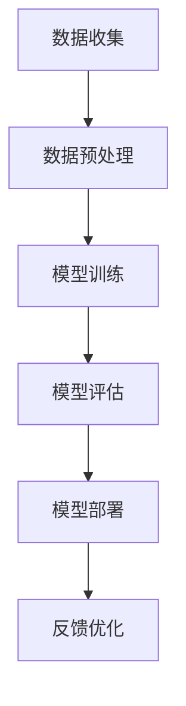
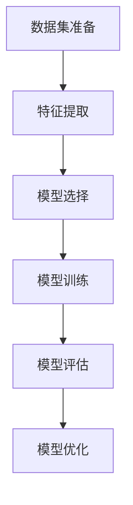
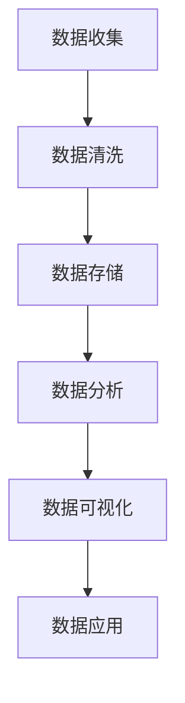
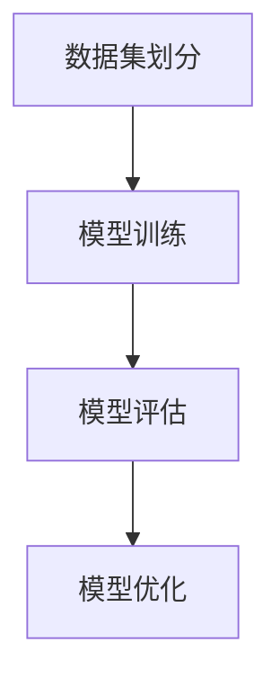

                 


# 软件二代的崛起：数据驱动一切

> 关键词：软件2.0、数据驱动、人工智能、机器学习、数据分析、深度学习
> 
> 摘要：本文将探讨软件2.0时代的数据驱动理念，分析其在人工智能、机器学习和数据分析等领域的应用，通过具体的算法原理和实际案例，探讨数据驱动在软件开发中的重要作用和未来发展趋势。

## 1. 背景介绍

### 1.1 目的和范围

本文旨在探讨软件2.0时代的数据驱动理念，分析其在人工智能、机器学习和数据分析等领域的应用。通过具体的算法原理和实际案例，探讨数据驱动在软件开发中的重要作用和未来发展趋势。

### 1.2 预期读者

本文适合对软件2.0和数据驱动有初步了解的开发者、数据科学家和研究人员，以及对人工智能和机器学习有浓厚兴趣的读者。

### 1.3 文档结构概述

本文分为以下几个部分：

1. 背景介绍：介绍软件2.0和数据驱动的基本概念。
2. 核心概念与联系：阐述数据驱动在软件2.0时代的关键作用。
3. 核心算法原理 & 具体操作步骤：介绍常用的数据驱动算法原理和具体操作步骤。
4. 数学模型和公式 & 详细讲解 & 举例说明：探讨数据驱动的数学模型和公式，并通过实例进行说明。
5. 项目实战：代码实际案例和详细解释说明。
6. 实际应用场景：分析数据驱动在实际项目中的应用。
7. 工具和资源推荐：推荐学习资源、开发工具和框架。
8. 总结：未来发展趋势与挑战。
9. 附录：常见问题与解答。
10. 扩展阅读 & 参考资料：提供进一步学习资料。

### 1.4 术语表

#### 1.4.1 核心术语定义

- 软件2.0：指以数据为中心，通过机器学习和人工智能技术实现的软件系统。
- 数据驱动：指软件开发过程中，数据分析和机器学习模型在决策和优化中发挥重要作用。
- 人工智能：指模拟、延伸和扩展人类智能的理论、方法和技术。
- 机器学习：指利用数据和算法，让计算机自动学习和改进性能的过程。
- 数据分析：指使用统计方法和工具，对大量数据进行分析和处理，以发现规律和趋势。

#### 1.4.2 相关概念解释

- 深度学习：一种基于多层神经网络的学习方法，通过递归地组合简单计算单元，实现复杂的数据处理和模式识别。
- 神经网络：一种模拟人脑神经元连接的模型，用于处理非线性问题。
- 模型训练：指通过训练数据集，调整模型参数，使模型具备预测或分类能力。
- 模型评估：指使用测试数据集，评估模型性能，以判断模型是否有效。

#### 1.4.3 缩略词列表

- AI：人工智能
- ML：机器学习
- DL：深度学习
- NLP：自然语言处理
- CV：计算机视觉
- RL：强化学习

## 2. 核心概念与联系

在软件2.0时代，数据驱动成为软件开发的核心。以下是数据驱动在软件2.0时代的关键概念和它们之间的联系。

### 2.1 数据驱动与人工智能

人工智能是软件2.0时代的关键驱动力。数据驱动使得人工智能模型能够在实际场景中不断优化和改进。

**Mermaid 流程图：**



### 2.2 数据驱动与机器学习

机器学习是数据驱动的核心，通过利用大量数据，机器学习模型能够自动发现规律和趋势。

**Mermaid 流程图：**



### 2.3 数据驱动与数据分析

数据分析是数据驱动的重要组成部分，通过统计方法和工具，对大量数据进行分析和处理，以发现规律和趋势。

**Mermaid 流程图：**



## 3. 核心算法原理 & 具体操作步骤

在本节中，我们将介绍几种常见的数据驱动算法原理和具体操作步骤。

### 3.1 梯度下降算法

梯度下降算法是一种常用的优化算法，用于训练机器学习模型。以下是梯度下降算法的伪代码：

```python
def gradient_descent(x, y, theta, alpha, num_iters):
    for i in range(num_iters):
        hypothesis = h(x, theta)
        error = hypothesis - y
        theta = theta - alpha * (2/m) * error
    return theta
```

### 3.2 随机梯度下降算法

随机梯度下降算法是梯度下降算法的一种变种，通过随机选择数据样本进行梯度计算。以下是随机梯度下降算法的伪代码：

```python
def stochastic_gradient_descent(x, y, theta, alpha, num_iters):
    for i in range(num_iters):
        random_index = randrange(m)
        hypothesis = h(x[random_index], theta)
        error = hypothesis - y[random_index]
        theta = theta - alpha * error
    return theta
```

### 3.3 交叉验证

交叉验证是一种评估模型性能的方法，通过将数据集划分为多个子集，交叉验证可以有效地评估模型在未知数据上的表现。

**Mermaid 流程图：**



## 4. 数学模型和公式 & 详细讲解 & 举例说明

### 4.1 损失函数

损失函数是机器学习中用于评估模型性能的函数。常用的损失函数包括均方误差（MSE）和交叉熵损失（Cross-Entropy Loss）。

**MSE 损失函数：**

$$
MSE = \frac{1}{m} \sum_{i=1}^{m} (h(x^{(i)}, \theta) - y^{(i)})^2
$$

**Cross-Entropy 损失函数：**

$$
Cross-Entropy Loss = -\frac{1}{m} \sum_{i=1}^{m} y^{(i)} \log(h(x^{(i)}, \theta))
$$

### 4.2 梯度下降算法

梯度下降算法的核心在于计算损失函数关于模型参数的梯度，并沿着梯度的反方向更新参数。

**梯度计算：**

$$
\nabla_{\theta} J(\theta) = \frac{\partial J(\theta)}{\partial \theta}
$$

**参数更新：**

$$
\theta = \theta - \alpha \nabla_{\theta} J(\theta)
$$

### 4.3 举例说明

假设我们有一个简单的一元线性回归模型，目标是拟合数据集中的一个线性关系。数据集如下：

| x | y |
|---|---|
| 1 | 2 |
| 2 | 4 |
| 3 | 6 |

模型参数为 $\theta_0$ 和 $\theta_1$，损失函数为均方误差（MSE）。

**损失函数：**

$$
MSE = \frac{1}{3} \left[(1-\theta_0-\theta_1)^2 + (2-\theta_0-2\theta_1)^2 + (3-\theta_0-3\theta_1)^2\right]
$$

**梯度计算：**

$$
\nabla_{\theta_0} MSE = -2(1-\theta_0-\theta_1) - 2(2-\theta_0-2\theta_1) - 2(3-\theta_0-3\theta_1)
$$

$$
\nabla_{\theta_1} MSE = -2(1-\theta_0-\theta_1) - 4(2-\theta_0-2\theta_1) - 6(3-\theta_0-3\theta_1)
$$

**参数更新：**

$$
\theta_0 = \theta_0 - \alpha \nabla_{\theta_0} MSE
$$

$$
\theta_1 = \theta_1 - \alpha \nabla_{\theta_1} MSE
$$

通过多次迭代，我们可以得到最优的模型参数。

## 5. 项目实战：代码实际案例和详细解释说明

在本节中，我们将通过一个简单的线性回归项目，展示数据驱动的实际应用。

### 5.1 开发环境搭建

首先，我们需要搭建一个Python开发环境。以下是安装步骤：

1. 安装Python（版本3.6及以上）。
2. 安装NumPy和Matplotlib库。

```bash
pip install numpy matplotlib
```

### 5.2 源代码详细实现和代码解读

以下是线性回归项目的源代码：

```python
import numpy as np
import matplotlib.pyplot as plt

# 数据集
X = np.array([[1], [2], [3]])
y = np.array([2, 4, 6])

# 模型参数
theta = np.array([0, 0])

# 损失函数
def compute_loss(X, y, theta):
    m = len(y)
    hypothesis = X @ theta
    error = hypothesis - y
    loss = (1 / (2 * m)) * error.T @ error
    return loss

# 梯度计算
def compute_gradient(X, y, theta):
    m = len(y)
    hypothesis = X @ theta
    error = hypothesis - y
    gradient = X.T @ error / m
    return gradient

# 梯度下降算法
def gradient_descent(X, y, theta, alpha, num_iters):
    m = len(y)
    loss_history = []

    for i in range(num_iters):
        hypothesis = X @ theta
        error = hypothesis - y
        loss = (1 / (2 * m)) * error.T @ error
        gradient = X.T @ error / m
        theta = theta - alpha * gradient
        loss_history.append(loss)

    return theta, loss_history

# 运行梯度下降算法
alpha = 0.01
num_iters = 1000
theta, loss_history = gradient_descent(X, y, theta, alpha, num_iters)

# 绘制损失函数图像
plt.plot(loss_history)
plt.xlabel('Iterations')
plt.ylabel('Loss')
plt.title('Loss Function Plot')
plt.show()

# 绘制线性回归图像
plt.scatter(X, y, color='blue')
plt.plot(X, X @ theta, color='red')
plt.xlabel('x')
plt.ylabel('y')
plt.title('Linear Regression Plot')
plt.show()
```

### 5.3 代码解读与分析

1. **数据集**：我们使用一个简单的一元线性回归数据集，其中$x$表示输入特征，$y$表示输出目标。

2. **模型参数**：模型参数$\theta_0$和$\theta_1$表示线性回归的斜率和截距。

3. **损失函数**：损失函数用于评估模型预测值和真实值之间的差异。

4. **梯度计算**：梯度计算用于计算模型参数的更新方向。

5. **梯度下降算法**：梯度下降算法通过迭代更新模型参数，以最小化损失函数。

6. **绘制图像**：我们绘制了损失函数图像和线性回归图像，以可视化模型的训练过程和预测结果。

## 6. 实际应用场景

数据驱动在各个行业和领域都有着广泛的应用。以下是几个典型的实际应用场景：

1. **金融行业**：数据驱动在金融风险管理、股票市场预测和信用评分等方面发挥着重要作用。通过分析历史数据和实时数据，金融机构可以更好地评估风险和预测市场走势。

2. **医疗行业**：数据驱动在医疗诊断、药物研发和患者管理等方面有着重要应用。通过分析患者数据，医生可以更准确地诊断疾病和制定治疗方案。

3. **零售行业**：数据驱动在零售数据分析、客户行为预测和库存管理等方面有着广泛应用。通过分析大量销售数据，零售商可以更好地了解客户需求，优化库存和销售策略。

4. **交通行业**：数据驱动在交通流量预测、路线规划和智能交通管理等方面有着广泛应用。通过分析交通数据，交通部门可以更好地优化交通流，减少拥堵和事故。

## 7. 工具和资源推荐

### 7.1 学习资源推荐

#### 7.1.1 书籍推荐

- 《深度学习》（Deep Learning） by Ian Goodfellow, Yoshua Bengio and Aaron Courville
- 《Python机器学习》（Python Machine Learning） by Sebastian Raschka and Vahid Mirjalili
- 《数据科学入门》（Introduction to Data Science） by Avi Bryant

#### 7.1.2 在线课程

- Coursera：机器学习、深度学习、数据科学等课程。
- edX：机器学习、深度学习、数据科学等课程。
- Udacity：数据科学工程师纳米学位。

#### 7.1.3 技术博客和网站

- Medium：关注数据科学、机器学习和深度学习领域的博客。
- Towards Data Science：分享数据科学、机器学习和深度学习领域的技术文章。
- Analytics Vidhya：印度最大的数据科学社区，分享数据科学和机器学习的资源。

### 7.2 开发工具框架推荐

#### 7.2.1 IDE和编辑器

- Jupyter Notebook：适用于数据科学和机器学习的交互式编程环境。
- PyCharm：适用于Python编程的集成开发环境。
- VS Code：适用于多种编程语言的轻量级集成开发环境。

#### 7.2.2 调试和性能分析工具

- PyTorch Debugger：适用于PyTorch深度学习框架的调试工具。
- TensorBoard：适用于TensorFlow深度学习框架的性能分析工具。

#### 7.2.3 相关框架和库

- PyTorch：适用于深度学习和计算机视觉的Python库。
- TensorFlow：适用于深度学习和计算机视觉的Python库。
- Scikit-learn：适用于机器学习的Python库。

### 7.3 相关论文著作推荐

#### 7.3.1 经典论文

- “A Fast Learning Algorithm for Deep Belief Nets” by Geoffrey Hinton
- “Backpropagation” by David E. Rumelhart, Geoffrey E. Hinton and Ronald J. Williams
- “Learning representations by minimizing competing losses” by Yaroslav Ganin and Victor Lempitsky

#### 7.3.2 最新研究成果

- “Natural Language Inference with Universal Sentence Encoder” by Yoav Artzi et al.
- “GANs for Text Generation” by Noam Shazeer et al.
- “Graph Attention Networks” by Jiawei Li et al.

#### 7.3.3 应用案例分析

- “Deep Learning for Human Activity Recognition using IMU Data” by Emilia Gómez et al.
- “A Survey of Deep Learning for Image Classification” by Wei Yang et al.
- “Deep Learning for Natural Language Processing” by Elementary OS

## 8. 总结：未来发展趋势与挑战

软件2.0时代的数据驱动理念将在未来继续发展和演变。随着数据量的不断增加和计算能力的提升，数据驱动在各个领域的应用将越来越广泛。以下是一些未来发展趋势和挑战：

1. **数据隐私与安全**：数据驱动应用需要对用户数据进行严格保护，以避免隐私泄露和安全风险。

2. **模型可解释性**：数据驱动模型往往难以解释，导致用户对其信任度降低。提高模型的可解释性是一个重要挑战。

3. **实时数据处理**：随着物联网和实时数据分析的兴起，实时数据处理能力将成为数据驱动应用的关键。

4. **算法公平性**：数据驱动模型在处理数据时可能会引入偏见，导致算法不公平。确保算法的公平性是一个重要挑战。

5. **跨领域应用**：数据驱动技术将在更多领域得到应用，如医疗、金融、教育等，这需要跨领域的知识和技术。

## 9. 附录：常见问题与解答

### 9.1 问题1：什么是数据驱动？

数据驱动是指软件开发过程中，数据分析和机器学习模型在决策和优化中发挥重要作用。

### 9.2 问题2：数据驱动有哪些应用场景？

数据驱动在金融、医疗、零售、交通等领域都有广泛应用，如风险管理、疾病诊断、客户行为预测、交通流量预测等。

### 9.3 问题3：如何搭建Python开发环境？

安装Python（版本3.6及以上）、NumPy和Matplotlib库。

### 9.4 问题4：什么是梯度下降算法？

梯度下降算法是一种优化算法，用于训练机器学习模型。它通过计算损失函数关于模型参数的梯度，并沿着梯度的反方向更新参数。

### 9.5 问题5：什么是损失函数？

损失函数是机器学习中用于评估模型性能的函数，用于衡量模型预测值和真实值之间的差异。

## 10. 扩展阅读 & 参考资料

- 《深度学习》（Deep Learning） by Ian Goodfellow, Yoshua Bengio and Aaron Courville
- 《Python机器学习》（Python Machine Learning） by Sebastian Raschka and Vahid Mirjalili
- 《数据科学入门》（Introduction to Data Science） by Avi Bryant
- Medium：关注数据科学、机器学习和深度学习领域的博客
- Analytics Vidhya：印度最大的数据科学社区，分享数据科学和机器学习的资源
- Coursera：机器学习、深度学习、数据科学等课程
- edX：机器学习、深度学习、数据科学等课程
- Udacity：数据科学工程师纳米学位
- PyTorch Debugger：适用于PyTorch深度学习框架的调试工具
- TensorBoard：适用于TensorFlow深度学习框架的性能分析工具
- PyTorch：适用于深度学习和计算机视觉的Python库
- TensorFlow：适用于深度学习和计算机视觉的Python库
- Scikit-learn：适用于机器学习的Python库
- “A Fast Learning Algorithm for Deep Belief Nets” by Geoffrey Hinton
- “Backpropagation” by David E. Rumelhart, Geoffrey E. Hinton and Ronald J. Williams
- “Learning representations by minimizing competing losses” by Yaroslav Ganin and Victor Lempitsky
- “Natural Language Inference with Universal Sentence Encoder” by Yoav Artzi et al.
- “GANs for Text Generation” by Noam Shazeer et al.
- “Graph Attention Networks” by Jiawei Li et al.
- “Deep Learning for Human Activity Recognition using IMU Data” by Emilia Gómez et al.
- “A Survey of Deep Learning for Image Classification” by Wei Yang et al.
- “Deep Learning for Natural Language Processing” by Elementary OS

