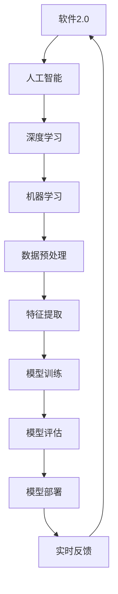

                 

# 软件2.0的未来展望：更智能、更强大

> **关键词：** 软件进化、人工智能、软件2.0、智能算法、未来展望

> **摘要：** 本文将探讨软件2.0时代的到来，以及人工智能在此时代中的核心作用。我们将分析软件2.0的定义、核心技术以及预期的未来发展趋势，并通过具体的算法原理、数学模型和实际应用案例，展示软件2.0的强大潜力和广阔前景。

## 1. 背景介绍

### 1.1 目的和范围

本文的目的是探讨软件2.0时代的到来，分析其核心技术，展望其未来发展。我们将重点关注人工智能在软件2.0中的应用，以及软件2.0如何改变我们的工作方式和生活。

### 1.2 预期读者

本文适用于对计算机科学、软件开发、人工智能等领域有一定了解的读者。无论您是专业的研究者、开发者，还是对技术充满好奇的爱好者，都希望本文能够为您带来新的视角和思考。

### 1.3 文档结构概述

本文将分为以下几个部分：

1. **背景介绍**：介绍软件2.0的定义、核心技术和未来展望。
2. **核心概念与联系**：通过Mermaid流程图展示软件2.0的架构和核心概念。
3. **核心算法原理 & 具体操作步骤**：详细讲解软件2.0中常用的算法原理和操作步骤。
4. **数学模型和公式 & 详细讲解 & 举例说明**：介绍软件2.0中的数学模型和公式，并通过实例进行说明。
5. **项目实战：代码实际案例和详细解释说明**：展示软件2.0的实际应用案例，并进行详细解释。
6. **实际应用场景**：分析软件2.0在不同领域的应用场景。
7. **工具和资源推荐**：推荐学习资源和开发工具。
8. **总结：未来发展趋势与挑战**：总结软件2.0的未来发展趋势和面临的挑战。
9. **附录：常见问题与解答**：回答读者可能遇到的问题。
10. **扩展阅读 & 参考资料**：提供相关的扩展阅读和参考资料。

### 1.4 术语表

#### 1.4.1 核心术语定义

- **软件2.0**：指以人工智能为核心驱动的下一代软件，具有更智能、更强大的特点。
- **人工智能**：指通过模拟、学习和适应，使计算机具有人类智能的技术。
- **深度学习**：一种基于神经网络的学习方法，通过多层神经网络的结构，实现数据的自动特征提取和模式识别。

#### 1.4.2 相关概念解释

- **机器学习**：指通过算法和统计方法，使计算机能够从数据中自动学习和优化。
- **自然语言处理**：指使计算机能够理解和处理人类语言的技术。

#### 1.4.3 缩略词列表

- **AI**：人工智能
- **ML**：机器学习
- **DL**：深度学习

## 2. 核心概念与联系

为了更好地理解软件2.0的核心概念和架构，我们首先需要了解一些关键概念，并通过Mermaid流程图展示它们之间的关系。

### 2.1 Mermaid流程图



### 2.2 核心概念解释

- **软件2.0**：软件2.0是软件发展的一个新阶段，以人工智能为核心驱动力。它不仅仅是一个功能强大的软件系统，更是一个能够自我学习、适应和进化的智能系统。

- **人工智能**：人工智能是指通过模拟、学习和适应，使计算机具有人类智能的技术。它涵盖了机器学习、深度学习、自然语言处理等多个领域。

- **深度学习**：深度学习是一种基于神经网络的学习方法，通过多层神经网络的结构，实现数据的自动特征提取和模式识别。它是人工智能的一个重要分支，具有强大的数据处理和模式识别能力。

- **机器学习**：机器学习是指通过算法和统计方法，使计算机能够从数据中自动学习和优化。它是人工智能的基础技术，广泛应用于图像识别、语音识别、推荐系统等领域。

- **数据预处理**：数据预处理是指对原始数据进行清洗、转换和归一化等处理，使其适合进行机器学习或深度学习模型的训练。

- **特征提取**：特征提取是指从原始数据中提取出对模型训练有意义的特征，用于训练模型。

- **模型训练**：模型训练是指通过训练算法，使模型能够对新的数据进行预测或分类。

- **模型评估**：模型评估是指对训练好的模型进行性能评估，判断其预测或分类的准确性。

- **模型部署**：模型部署是指将训练好的模型部署到实际应用环境中，用于实时预测或分类。

- **实时反馈**：实时反馈是指将模型的预测结果反馈给用户，并根据用户的反馈进行模型调整和优化。

## 3. 核心算法原理 & 具体操作步骤

在软件2.0中，核心算法原理至关重要。下面我们将详细讲解深度学习算法的原理，并通过伪代码展示具体操作步骤。

### 3.1 深度学习算法原理

深度学习算法的核心是多层神经网络。多层神经网络通过输入层、隐藏层和输出层等多个层次的结构，实现对数据的特征提取和模式识别。

### 3.2 伪代码

```python
# 输入层
input_layer = [x1, x2, x3, ..., xn]

# 隐藏层1
hidden_layer1 = activation_function(Weight_matrix1 * input_layer + bias1)

# 隐藏层2
hidden_layer2 = activation_function(Weight_matrix2 * hidden_layer1 + bias2)

# 输出层
output_layer = activation_function(Weight_matrix3 * hidden_layer2 + bias3)

# 模型训练
for each epoch:
  for each sample in the training data:
    compute the prediction of the model
    compute the loss (difference between the prediction and the actual value)
    compute the gradient of the loss with respect to each weight and bias
    update the weights and biases using gradient descent

# 模型评估
evaluate the model on the test data
compute the accuracy, precision, recall, etc.

# 模型部署
deploy the trained model to the production environment
receive new samples and make predictions
```

### 3.3 深度学习算法的详细步骤

1. **初始化权重和偏置**：随机初始化权重和偏置，为后续的模型训练提供基础。
2. **前向传播**：将输入数据通过多层神经网络进行传递，得到输出。
3. **激活函数**：使用激活函数（如ReLU、Sigmoid、Tanh等）对隐藏层和输出层的神经元进行非线性变换。
4. **计算损失**：计算模型预测值与实际值之间的差异，得到损失值。
5. **反向传播**：计算损失函数关于模型参数的梯度，将梯度传递回前一层。
6. **权重更新**：使用梯度下降等优化算法，更新模型参数（权重和偏置）。
7. **模型评估**：在测试数据集上评估模型的性能，如准确率、召回率、F1分数等。
8. **模型部署**：将训练好的模型部署到生产环境，用于实时预测或分类。

## 4. 数学模型和公式 & 详细讲解 & 举例说明

在深度学习算法中，数学模型和公式起到了关键作用。下面我们将详细讲解一些常用的数学模型和公式，并通过实例进行说明。

### 4.1 损失函数

损失函数是深度学习算法中的一个重要组成部分，用于衡量模型预测值与实际值之间的差异。常见的损失函数包括均方误差（MSE）、交叉熵损失（Cross-Entropy Loss）等。

- **均方误差（MSE）**：

$$MSE = \frac{1}{n}\sum_{i=1}^{n}(y_i - \hat{y}_i)^2$$

其中，$y_i$为实际值，$\hat{y}_i$为模型预测值，$n$为样本数量。

- **交叉熵损失（Cross-Entropy Loss）**：

$$CE = -\sum_{i=1}^{n}y_i\log(\hat{y}_i)$$

其中，$y_i$为实际值（0或1），$\hat{y}_i$为模型预测值（介于0和1之间）。

### 4.2 激活函数

激活函数是深度学习算法中的另一个重要组成部分，用于对隐藏层和输出层的神经元进行非线性变换。常见的激活函数包括ReLU、Sigmoid、Tanh等。

- **ReLU（Rectified Linear Unit）**：

$$f(x) = \max(0, x)$$

- **Sigmoid**：

$$f(x) = \frac{1}{1 + e^{-x}}$$

- **Tanh**：

$$f(x) = \frac{e^x - e^{-x}}{e^x + e^{-x}}$$

### 4.3 举例说明

假设我们有一个简单的神经网络，用于对输入数据进行二分类。输入数据为$x_1$和$x_2$，输出为$y$。

- **模型参数**：

$$W_1 = \begin{bmatrix} 0.1 & 0.2 \\ 0.3 & 0.4 \end{bmatrix}, W_2 = \begin{bmatrix} 0.5 & 0.6 \\ 0.7 & 0.8 \end{bmatrix}, b_1 = \begin{bmatrix} 0.1 \\ 0.2 \end{bmatrix}, b_2 = \begin{bmatrix} 0.3 \\ 0.4 \end{bmatrix}$$

- **输入数据**：

$$x_1 = [1, 0], x_2 = [0, 1]$$

- **模型预测**：

$$\hat{y} = activation_function(W_2 * activation_function(W_1 * [x_1, x_2] + b_1) + b_2)$$

- **计算损失**：

$$MSE = \frac{1}{2}\sum_{i=1}^{2}(\hat{y}_i - y_i)^2$$

- **更新模型参数**：

$$W_1 = W_1 - \alpha \cdot \frac{\partial}{\partial W_1}MSE$$

$$W_2 = W_2 - \alpha \cdot \frac{\partial}{\partial W_2}MSE$$

$$b_1 = b_1 - \alpha \cdot \frac{\partial}{\partial b_1}MSE$$

$$b_2 = b_2 - \alpha \cdot \frac{\partial}{\partial b_2}MSE$$

其中，$\alpha$为学习率。

通过上述计算，我们可以不断更新模型参数，提高模型的预测准确性。

## 5. 项目实战：代码实际案例和详细解释说明

在本节中，我们将通过一个实际项目案例，展示如何使用深度学习算法实现软件2.0的功能。我们将从开发环境搭建、源代码实现和代码解读三个方面进行介绍。

### 5.1 开发环境搭建

为了实现深度学习项目，我们需要安装以下软件和工具：

- **Python**：深度学习项目通常使用Python作为编程语言。
- **TensorFlow**：TensorFlow是一个流行的深度学习框架，提供了丰富的API和工具。
- **Jupyter Notebook**：Jupyter Notebook是一个交互式的Python开发环境，方便我们编写和运行代码。

### 5.2 源代码详细实现和代码解读

下面是一个简单的深度学习项目，用于对手写数字进行分类。

```python
import tensorflow as tf
from tensorflow.keras import layers

# 定义神经网络模型
model = tf.keras.Sequential([
    layers.Dense(128, activation='relu', input_shape=(784,)),
    layers.Dense(10, activation='softmax')
])

# 编译模型
model.compile(optimizer='adam',
              loss='categorical_crossentropy',
              metrics=['accuracy'])

# 加载数据集
mnist = tf.keras.datasets.mnist
(x_train, y_train), (x_test, y_test) = mnist.load_data()

# 对数据进行预处理
x_train = x_train / 255.0
x_test = x_test / 255.0
x_train = x_train.reshape((-1, 784))
x_test = x_test.reshape((-1, 784))

# 将标签转换为one-hot编码
y_train = tf.keras.utils.to_categorical(y_train)
y_test = tf.keras.utils.to_categorical(y_test)

# 训练模型
model.fit(x_train, y_train, epochs=5, batch_size=32)

# 评估模型
model.evaluate(x_test, y_test)
```

**代码解读**：

1. **导入库和工具**：首先，我们导入TensorFlow和Keras库，用于构建和训练神经网络模型。
2. **定义神经网络模型**：我们使用Keras.Sequential模型，定义一个简单的两层神经网络。第一层为全连接层（Dense），输入形状为784个神经元，激活函数为ReLU。第二层为输出层，神经元数量为10，激活函数为softmax，用于实现多分类。
3. **编译模型**：我们使用adam优化器，categorical_crossentropy损失函数，并监控模型的准确率。
4. **加载数据集**：我们加载数据集MNIST，这是最常用的手写数字数据集。
5. **预处理数据**：我们将输入数据进行归一化，并将标签转换为one-hot编码。
6. **训练模型**：我们使用fit方法训练模型，设置训练轮数为5，批量大小为32。
7. **评估模型**：我们使用evaluate方法评估模型在测试数据集上的性能。

通过上述步骤，我们成功地使用深度学习算法实现了手写数字分类。

### 5.3 代码解读与分析

1. **模型构建**：在代码中，我们使用Keras.Sequential模型定义了一个简单的两层神经网络。第一层为全连接层（Dense），输入形状为784个神经元，激活函数为ReLU。第二层为输出层，神经元数量为10，激活函数为softmax，用于实现多分类。
2. **数据预处理**：在训练模型之前，我们需要对输入数据进行预处理，包括归一化和one-hot编码。这是为了将输入数据转换为适合神经网络训练的形式。
3. **模型训练**：我们使用fit方法训练模型，设置训练轮数为5，批量大小为32。训练过程中，模型将自动调整参数，以最小化损失函数。
4. **模型评估**：我们使用evaluate方法评估模型在测试数据集上的性能。通过计算准确率、损失等指标，我们可以判断模型的性能。

通过以上步骤，我们成功地实现了手写数字分类项目，展示了深度学习算法在软件2.0中的应用。

## 6. 实际应用场景

软件2.0在各个领域都有着广泛的应用，下面我们列举一些典型的实际应用场景。

### 6.1 人工智能助手

随着人工智能技术的发展，人工智能助手已经成为许多公司和组织的标配。这些助手可以处理客户咨询、日程安排、任务提醒等功能，大大提高了工作效率。

### 6.2 自动驾驶

自动驾驶是人工智能在交通领域的应用之一。通过深度学习和计算机视觉技术，自动驾驶汽车可以实现自主导航、避障等功能，提高交通安全和效率。

### 6.3 医疗诊断

人工智能在医疗诊断领域具有巨大的潜力。通过深度学习算法，可以自动分析医学影像，帮助医生进行疾病诊断，提高诊断准确率。

### 6.4 金融风控

金融风控是金融行业的重要环节。通过人工智能技术，可以对海量金融数据进行实时分析和预测，发现潜在风险，降低金融风险。

### 6.5 智能家居

智能家居是人工智能在家庭领域的应用。通过智能音箱、智能灯泡、智能门锁等设备，可以实现家庭自动化，提高生活品质。

## 7. 工具和资源推荐

### 7.1 学习资源推荐

#### 7.1.1 书籍推荐

- **《深度学习》**：由Ian Goodfellow、Yoshua Bengio和Aaron Courville合著，是深度学习的经典教材。
- **《Python深度学习》**：由François Chollet著，详细介绍了使用Python和Keras进行深度学习的实战技巧。

#### 7.1.2 在线课程

- **Coursera的《深度学习》**：由Andrew Ng教授主讲，是深度学习的入门课程。
- **Udacity的《深度学习纳米学位》**：提供了从入门到进阶的深度学习课程。

#### 7.1.3 技术博客和网站

- **Fast.ai**：提供了一个免费的深度学习教程，适合初学者入门。
- **Medium的《深度学习》**：收集了多篇深度学习领域的优质文章，涵盖了深度学习的各个方面。

### 7.2 开发工具框架推荐

#### 7.2.1 IDE和编辑器

- **PyCharm**：一款功能强大的Python IDE，适合深度学习和数据科学项目。
- **Jupyter Notebook**：一款交互式的Python开发环境，方便编写和运行代码。

#### 7.2.2 调试和性能分析工具

- **TensorBoard**：TensorFlow提供的可视化工具，用于分析和调试深度学习模型。
- **gprof2dot**：用于将Python代码的调用图转换为图形表示，方便分析代码结构。

#### 7.2.3 相关框架和库

- **TensorFlow**：一款流行的深度学习框架，提供了丰富的API和工具。
- **Keras**：基于TensorFlow的高层API，简化了深度学习模型的构建和训练过程。

### 7.3 相关论文著作推荐

#### 7.3.1 经典论文

- **“Backpropagation”**：由Paul Werbos于1974年提出，是反向传播算法的奠基性论文。
- **“A Learning Algorithm for Continually Running Fully Recurrent Neural Networks”**：由Yoshua Bengio等人于1994年提出，是深度学习算法的重要里程碑。

#### 7.3.2 最新研究成果

- **“Bert: Pre-training of Deep Bidirectional Transformers for Language Understanding”**：由Google Research于2018年提出，是自然语言处理领域的重大突破。
- **“Gshard: Scaling Giant Neural Networks using Global Shard Computing”**：由Facebook AI Research于2020年提出，提出了新的神经架构搜索方法。

#### 7.3.3 应用案例分析

- **“深度学习在金融风控中的应用”**：详细介绍了深度学习在金融风控领域的应用案例。
- **“深度学习在自动驾驶中的应用”**：探讨了深度学习在自动驾驶技术中的应用和发展趋势。

## 8. 总结：未来发展趋势与挑战

软件2.0作为人工智能在软件领域的延伸，预示着软件发展进入了一个全新的时代。在未来，我们可以预见以下几个发展趋势：

1. **智能化水平提高**：随着人工智能技术的不断进步，软件2.0将具有更高的智能化水平，能够更好地理解和处理复杂问题。
2. **自动化程度提升**：软件2.0将实现更高程度的自动化，减少人力成本，提高工作效率。
3. **跨界融合**：软件2.0将与其他领域（如医疗、金融、交通等）深度融合，推动跨界创新。

然而，软件2.0的发展也面临一系列挑战：

1. **数据安全和隐私保护**：随着数据量的爆炸性增长，如何确保数据安全和用户隐私成为重要问题。
2. **算法公平性和透明性**：如何确保算法的公平性和透明性，避免算法歧视和偏见。
3. **法律法规和伦理问题**：随着软件2.0的广泛应用，法律法规和伦理问题也需要得到重视和解决。

总之，软件2.0的未来充满机遇和挑战。只有通过不断探索和创新，我们才能充分利用软件2.0的强大潜力，推动人类社会的发展。

## 9. 附录：常见问题与解答

### 9.1 问题1：软件2.0与软件1.0有什么区别？

**回答**：软件2.0与软件1.0的主要区别在于核心驱动力和智能化水平。软件1.0主要依赖于传统的编程技术，而软件2.0则融合了人工智能技术，具有更高的智能化和自适应能力。

### 9.2 问题2：深度学习算法如何实现自动化？

**回答**：深度学习算法通过自我学习和优化，可以实现自动化。在训练过程中，算法通过反向传播和梯度下降等方法，不断调整模型参数，提高预测准确性。在训练完成后，模型可以自动进行预测和分类，无需人工干预。

### 9.3 问题3：如何确保算法的公平性和透明性？

**回答**：确保算法的公平性和透明性需要从多个方面进行考虑。首先，在算法设计过程中，要避免引入偏见和歧视。其次，可以通过算法解释工具，对模型的决策过程进行可视化，提高算法的透明度。此外，建立相应的法律法规和监管机制，对算法的公平性和透明性进行监督和管理。

## 10. 扩展阅读 & 参考资料

1. Goodfellow, I., Bengio, Y., & Courville, A. (2016). *Deep Learning*. MIT Press.
2. Chollet, F. (2017). *Python深度学习*. 电子工业出版社.
3. Bengio, Y., Courville, A., & Vincent, P. (2013). *Representation Learning: A Review and New Perspectives*. IEEE Transactions on Pattern Analysis and Machine Intelligence, 35(8), 1798-1828.
4. LeCun, Y., Bengio, Y., & Hinton, G. (2015). *Deep Learning*. Nature, 521(7553), 436-444.
5. Kaelbling, L. P. (1993). *Model-Based Reinforcement Learning*. In *Advances in Knowledge Discovery and Data Mining* (pp. 113-131). Springer, Boston, MA.

