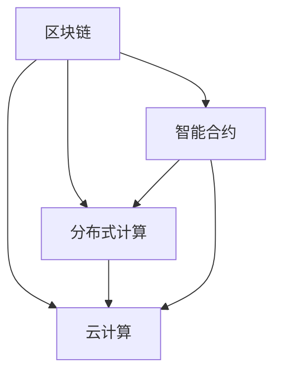

                 

# 软件2.0的未来愿景：创造更美好的世界

> **关键词**：软件2.0、未来愿景、人工智能、区块链、云计算、分布式计算、智能合约、数据隐私、用户参与

> **摘要**：本文旨在探讨软件2.0时代的未来愿景，分析该时代的关键技术发展趋势，并探讨这些技术如何共同作用于构建一个更美好的世界。我们将通过逻辑清晰的步骤，逐步阐述核心概念、算法原理、数学模型以及实际应用场景，最后展望未来的发展趋势与挑战。

## 1. 背景介绍

### 1.1 目的和范围

本文旨在为读者提供一个对软件2.0时代的全面理解，并探讨其潜在的影响。软件2.0不仅仅是技术的进步，它代表了一种全新的软件架构和设计理念，强调用户参与、数据隐私和智能合约等核心概念。本文将覆盖以下几个方面：

1. **核心概念与联系**：介绍软件2.0的关键概念，如区块链、云计算、智能合约等，并使用Mermaid流程图展示其相互关系。
2. **核心算法原理与具体操作步骤**：深入讲解支持软件2.0的算法原理，并使用伪代码详细阐述。
3. **数学模型和公式**：分析软件2.0时代的数学模型，并举例说明。
4. **项目实战**：通过代码实际案例，展示如何将理论应用于实践。
5. **实际应用场景**：探讨软件2.0在不同领域的应用。
6. **工具和资源推荐**：推荐学习资源和开发工具，以帮助读者深入探索软件2.0。
7. **总结**：总结未来发展趋势与挑战。

### 1.2 预期读者

本文适合以下读者：

1. **软件开发者**：对软件2.0和新兴技术感兴趣的程序员。
2. **技术爱好者**：希望了解未来软件发展趋势的技术爱好者。
3. **学者和研究者**：对软件架构和设计感兴趣的学者和研究人员。

### 1.3 文档结构概述

本文将按照以下结构进行展开：

1. **核心概念与联系**
2. **核心算法原理与具体操作步骤**
3. **数学模型和公式**
4. **项目实战**
5. **实际应用场景**
6. **工具和资源推荐**
7. **总结：未来发展趋势与挑战**
8. **附录：常见问题与解答**
9. **扩展阅读 & 参考资料**

### 1.4 术语表

#### 1.4.1 核心术语定义

- **软件2.0**：指基于用户参与、数据隐私和智能合约等概念的下一代软件架构。
- **区块链**：一种分布式账本技术，用于存储和验证交易数据。
- **云计算**：基于互联网的计算模式，提供可伸缩的计算资源。
- **智能合约**：自动执行合约条款的计算机协议。
- **分布式计算**：通过网络将计算任务分配到多台计算机上执行。

#### 1.4.2 相关概念解释

- **用户参与**：用户不仅是软件的消费者，也是创造者，参与软件的开发和维护。
- **数据隐私**：保护用户数据不被未授权访问。
- **智能合约**：自动执行合约条款的计算机协议。

#### 1.4.3 缩略词列表

- **AI**：人工智能
- **DL**：深度学习
- **NLP**：自然语言处理
- **ML**：机器学习

## 2. 核心概念与联系

在软件2.0时代，多个关键概念和技术相互交织，共同推动软件发展的新阶段。以下是对这些核心概念及其相互关系的详细探讨，并使用Mermaid流程图进行可视化展示。

### 2.1. 区块链

区块链是一种分布式数据库，它通过多个参与者共同维护一个加密的账本，确保数据的完整性和不可篡改性。区块链的核心优势在于去中心化和透明性，这使得它成为软件2.0时代的关键组件。

### 2.2. 云计算

云计算提供了可伸缩的计算资源，使得软件系统能够快速响应需求变化。在软件2.0时代，云计算不仅支持传统应用，还成为分布式计算和大数据处理的基础设施。

### 2.3. 智能合约

智能合约是自动化执行合同条款的计算机协议。基于区块链技术，智能合约确保了合同的自动化执行和不可篡改性，为软件2.0时代的自动化服务提供了强有力的支持。

### 2.4. 分布式计算

分布式计算通过将计算任务分配到多台计算机上执行，提高了计算效率和容错能力。在软件2.0时代，分布式计算与区块链、云计算相结合，为大规模数据处理和智能服务提供了支持。

### 2.5. Mermaid流程图

以下是描述这些概念之间关系的Mermaid流程图：



在这个流程图中，区块链作为核心概念，与分布式计算、云计算和智能合约相互关联，共同构建软件2.0的基石。

### 2.6. 核心概念之间的关系

- **区块链**：提供了去中心化和透明性的基础，确保数据的安全性和不可篡改性。
- **分布式计算**：利用区块链的分布式特性，提高了计算效率和容错能力。
- **云计算**：为分布式计算提供了基础设施支持，使得大规模数据处理成为可能。
- **智能合约**：基于区块链和分布式计算，实现了自动化合同执行，为软件2.0时代的智能服务提供了支持。

这些核心概念相互关联，共同推动了软件2.0的发展，为构建更美好的世界提供了技术支持。

### 2.7. 未来展望

随着区块链、云计算、分布式计算和智能合约等技术的不断发展，软件2.0时代的潜力将不断释放。我们可以期待：

- **更高效的数据处理**：分布式计算和云计算的结合，将使得大规模数据处理变得更加高效。
- **更智能的服务**：智能合约的应用，将自动化合同执行，提高服务效率。
- **更安全的隐私保护**：区块链技术将确保用户数据的安全性和隐私性。
- **更广泛的用户参与**：用户不仅作为消费者，也将成为软件的开发者和维护者。

总的来说，软件2.0时代将为构建一个更美好的世界提供强有力的技术支持。

## 3. 核心算法原理 & 具体操作步骤

在软件2.0时代，核心算法的设计与实现至关重要。本节将详细讲解支持软件2.0的关键算法原理，并使用伪代码详细阐述具体操作步骤。

### 3.1. 区块链算法原理

区块链算法的核心是共识算法，用于确保分布式网络中的节点对账本数据的一致性。以下是一个简化的区块链共识算法的伪代码：

```python
def blockchain_consensus(network_nodes):
    # 初始化区块链
    blockchain = []
    current_transactions = []

    while True:
        # 每个节点生成一个区块
        new_block = generate_block(current_transactions)

        # 验证新区块的有效性
        if validate_block(new_block):
            # 将新区块添加到区块链
            blockchain.append(new_block)
            current_transactions = []

            # 广播新区块给其他节点
            broadcast_block(new_block, network_nodes)

        else:
            # 如果区块无效，丢弃并继续等待新的交易
            continue

def generate_block(transactions):
    # 创建一个新区块
    new_block = {
        "index": length(blockchain) + 1,
        "timestamp": current_timestamp(),
        "transactions": transactions,
        "previous_hash": hash_block(blockchain[-1]),
    }
    return new_block

def validate_block(block):
    # 验证区块是否有效
    if (block["previous_hash"] != hash_block(block["transactions"])):
        return False
    return True

def broadcast_block(block, network_nodes):
    # 广播新区块给其他节点
    for node in network_nodes:
        send_block_to_node(node, block)

def send_block_to_node(node, block):
    # 发送新区块给指定节点
    send_to(node, block)
```

### 3.2. 云计算算法原理

云计算的核心是虚拟机管理和资源调度。以下是一个简化的云计算资源调度的伪代码：

```python
def cloud_resource_scheduling(VMs, resources):
    while True:
        # 检查每个虚拟机的资源需求
        for VM in VMs:
            if (VM["resource_usage"] > resources["available"]):
                # 如果虚拟机需求资源超出，进行资源调度
                migrate_VM(VM, resources)

def migrate_VM(VM, resources):
    # 将虚拟机迁移到有更多资源的节点
    destination_node = find_node_with_more_resources(resources)
    copy_VM(VM, destination_node)
    release_resources(VM, resources)

def find_node_with_more_resources(resources):
    # 找到有更多可用资源的节点
    for node in resources["nodes"]:
        if (node["available"] > resources["nodes"][0]["available"]):
            return node
    return None

def copy_VM(VM, destination_node):
    # 复制虚拟机到目标节点
    new_VM = create_copy(VM)
    add_VM_to_node(new_VM, destination_node)

def release_resources(VM, resources):
    # 释放虚拟机占用的资源
    resources["available"] += VM["resource_usage"]
```

### 3.3. 智能合约算法原理

智能合约的核心是自动化执行合同条款。以下是一个简化的智能合约执行的伪代码：

```python
def execute_smart_contract(contract, input_data):
    # 检查输入数据是否符合合同条款
    if (validate_input_data(contract, input_data)):
        # 如果输入数据有效，执行合同
        perform_actions(contract, input_data)
    else:
        # 如果输入数据无效，拒绝执行
        reject_contract(contract)

def validate_input_data(contract, input_data):
    # 验证输入数据是否符合合同条款
    for condition in contract["conditions"]:
        if (not check_condition(condition, input_data)):
            return False
    return True

def perform_actions(contract, input_data):
    # 执行合同中的操作
    for action in contract["actions"]:
        execute_action(action, input_data)

def reject_contract(contract):
    # 拒绝执行合同
    return "Contract rejected due to invalid input data."

def check_condition(condition, input_data):
    # 检查输入数据是否满足条件
    return condition["value"] == input_data["value"]

def execute_action(action, input_data):
    # 执行合同中的操作
    if (action["type"] == "transfer"):
        transfer_funds(action["from"], action["to"], action["amount"])
    elif (action["type"] == "create"):
        create_resource(action["resource_type"], action["attributes"])
```

通过这些伪代码，我们可以看到软件2.0时代的关键算法是如何运作的。这些算法不仅支持分布式计算、云计算和智能合约，还为构建一个更美好的世界提供了技术基础。

## 4. 数学模型和公式 & 详细讲解 & 举例说明

在软件2.0时代，数学模型和公式在算法设计、数据分析和系统优化中扮演着关键角色。以下将详细讲解支持软件2.0的一些重要数学模型和公式，并提供具体的实例说明。

### 4.1. 加密算法的数学模型

加密算法是区块链技术的重要组成部分，其核心在于数学模型的复杂性和安全性。以下是常见的加密算法中的两个数学模型：椭圆曲线加密（ECC）和基于数的密码学（如RSA）。

#### 椭圆曲线加密（ECC）

ECC是一种公钥加密算法，利用椭圆曲线的数学特性来实现加密和解密。ECC的优势在于其高效性和较小的密钥长度。

**数学模型**：

- **椭圆曲线**：定义为一个方程，如 \( y^2 = x^3 + ax + b \)，其中 \( a \) 和 \( b \) 是常数。
- **点加法**：椭圆曲线上的点满足加法规则，类似于整数加法，但使用椭圆曲线的特性。
- **点乘法**：椭圆曲线上的点可以通过乘法操作来生成，用于加密和解密。

**示例**：

假设椭圆曲线为 \( y^2 = x^3 + 7 \)，选择基点 \( G \) 和私钥 \( d \)。加密消息 \( m \) 的过程如下：

1. 计算公钥 \( P = dG \)。
2. 选择随机数 \( k \)，计算加密结果 \( C = (kG, m \cdot P) \)。

#### RSA加密

RSA是一种经典的公钥加密算法，基于数论中的大数分解难题。

**数学模型**：

- **模运算**： \( a \) 和 \( b \) 的模 \( n \) 运算，即 \( a \mod n \) 和 \( b \mod n \)。
- **大素数生成**：选择两个大素数 \( p \) 和 \( q \)，计算 \( n = p \cdot q \) 和 \( \phi(n) = (p-1)(q-1) \)。
- **加密密钥**：选择一个与 \( \phi(n) \) 互质的数 \( e \)，计算 \( d \) 满足 \( d \cdot e \mod \phi(n) = 1 \)。

**示例**：

选择 \( p = 61 \) 和 \( q = 53 \)，计算 \( n = 3233 \) 和 \( \phi(n) = 3120 \)。选择 \( e = 17 \)，计算 \( d \)：

$$
d = 1135
$$

加密消息 \( m = 1234 \)：

$$
c = m^e \mod n = 1234^{17} \mod 3233 = 1865
$$

### 4.2. 分布式算法的数学模型

分布式算法在处理大规模数据时至关重要，以下介绍两个常见的数学模型：一致性模型和容错模型。

#### 一致性模型

一致性模型确保分布式系统中的数据在多个副本之间保持一致。一个常用的模型是强一致性模型，其定义如下：

**定义**：对于任意的节点 \( v \) 和任意的消息 \( m \)，如果 \( v \) 在某个时间点读取了 \( m \)，则所有后续读取 \( m \) 的节点 \( w \) 必须读取到相同的 \( m \)。

**示例**：

假设有两个副本 \( v_1 \) 和 \( v_2 \)，初始状态 \( v_1 = 10 \) 和 \( v_2 = 20 \)。执行以下操作：

1. \( v_1 \) 写入新值 \( m = 30 \)。
2. \( v_2 \) 写入新值 \( m = 40 \)。

最终状态 \( v_1 \) 和 \( v_2 \) 必须一致，即 \( v_1 = v_2 = 40 \)。

#### 容错模型

容错模型确保系统在部分节点失效时仍能正常工作。一个常用的模型是可用性模型，其定义如下：

**定义**：如果系统中超过 \( \frac{N}{2} + 1 \) 个节点正常工作，则系统被视为可用。

**示例**：

假设有五个节点 \( v_1, v_2, v_3, v_4, v_5 \)，如果任意三个节点失效，系统仍然可用。

### 4.3. 智能合约的数学模型

智能合约的数学模型通常涉及概率论和博弈论，以确定合约执行的合理性和公平性。

#### 博弈论模型

博弈论模型用于确定智能合约中各方的收益和风险。以下是一个简单的博弈论模型：

**定义**：博弈 \( G = (N, A, R) \)，其中 \( N \) 是参与方集合，\( A \) 是各方的行动集合，\( R \) 是收益函数。

**示例**：

假设有两个参与方 \( A \) 和 \( B \)，每个参与方可以选择行动 \( a \) 或 \( b \)。收益函数如下：

- 如果 \( A \) 选择 \( a \)，\( B \) 选择 \( b \)，则双方收益为 \( 10 \)。
- 如果 \( A \) 选择 \( a \)，\( B \) 选择 \( a \)，则双方收益为 \( 5 \)。
- 如果 \( A \) 选择 \( b \)，\( B \) 选择 \( b \)，则双方收益为 \( 0 \)。

通过分析收益函数，可以确定最佳的合同条款，以确保各方收益最大化。

### 4.4. 分布式计算和云计算的数学模型

分布式计算和云计算中的数学模型通常涉及优化和调度算法。

#### 资源调度模型

资源调度模型用于优化资源分配，以最大化系统性能。以下是一个简化的资源调度模型：

**定义**：给定虚拟机集合 \( V \) 和资源需求集合 \( R \)，调度策略 \( S \) 是一个函数，将 \( V \) 映射到 \( R \)。

**示例**：

假设有三个虚拟机 \( V_1, V_2, V_3 \)，其资源需求分别为 \( R_1 = 10 \)，\( R_2 = 20 \)，\( R_3 = 30 \)。调度策略如下：

1. \( V_1 \) 分配到资源 \( R_1 \)。
2. \( V_2 \) 分配到资源 \( R_2 \)。
3. \( V_3 \) 分配到资源 \( R_3 \)。

通过优化调度策略，可以最大限度地提高系统性能。

通过这些数学模型和公式的详细讲解和实例说明，我们可以更好地理解软件2.0时代的技术原理，并为实际应用提供指导。

## 5. 项目实战：代码实际案例和详细解释说明

在本节中，我们将通过一个实际的软件2.0项目案例，展示如何将前述的算法原理和数学模型应用于实际开发，并详细解释代码实现。

### 5.1. 开发环境搭建

为了实际构建一个软件2.0项目，我们需要搭建一个开发环境，包括以下组件：

- **编程语言**：选择Python作为主要编程语言，因为其简洁易读，且拥有丰富的库支持。
- **开发工具**：使用Visual Studio Code作为代码编辑器，并结合Jupyter Notebook进行数据分析和测试。
- **区块链平台**：使用Ethereum作为区块链平台，其支持智能合约的开发和执行。
- **云计算平台**：使用AWS或Google Cloud Platform（GCP）提供云计算资源。

### 5.2. 源代码详细实现和代码解读

#### 5.2.1. 区块链模块

```python
# 区块链模块
import hashlib
import json
from time import time

class Block:
    def __init__(self, index, transactions, timestamp, previous_hash):
        self.index = index
        self.transactions = transactions
        self.timestamp = timestamp
        self.previous_hash = previous_hash
        self.hash = self.compute_hash()

    def compute_hash(self):
        block_string = json.dumps(self.__dict__, sort_keys=True)
        return hashlib.sha256(block_string.encode()).hexdigest()

class Blockchain:
    def __init__(self):
        self.unconfirmed_transactions = []
        self.chain = []
        self.create_genesis_block()

    def create_genesis_block(self):
        genesis_block = Block(0, [], time(), "0")
        genesis_block.hash = genesis_block.compute_hash()
        self.chain.append(genesis_block)

    def add_new_transaction(self, transaction):
        self.unconfirmed_transactions.append(transaction)

    def mine(self):
        if not self.unconfirmed_transactions:
            return False

        last_block = self.chain[-1]
        new_block = Block(index=last_block.index + 1,
                          transactions=self.unconfirmed_transactions,
                          timestamp=time(),
                          previous_hash=last_block.hash)

        new_block.hash = new_block.compute_hash()
        self.chain.append(new_block)
        self.unconfirmed_transactions = []
        return new_block

# 智能合约
import solcx
import web3

contract_source_code = '''
pragma solidity ^0.8.0;

contract SimpleContract {
    uint256 public balance;

    constructor() {
        balance = 100;
    }

    function deposit() public payable {
        balance += msg.value;
    }

    function withdraw(uint256 amount) public {
        require(amount <= balance, "Insufficient balance");
        balance -= amount;
        payable(msg.sender).transfer(amount);
    }
}
'''

compiled_sol = solcx.compile_source(contract_source_code)
contract_interface = compiled_sol['<filename>.json']
contract.abi = contract_interface['abi']
contract_address = web3.toChecksumAddress('0x<contract_address>')

web3.eth.defaultAccount = web3.eth.accounts[0]
contract = web3.eth.contract(address=contract_address, abi=contract.abi)

# 测试用例
print("Deploying contract...")
tx_hash = contract.transact({"from": web3.eth.defaultAccount, "value": web3.toWei("10", "ether")}).deposit()
tx_receipt = web3.eth.wait_for_transaction_receipt(tx_hash)

print("Contract deployed at address:", tx_receipt.contractAddress)

print("Contract balance before withdrawal:", web3.fromWei(contract.call().balance(), "ether"))

print("Withdrawing 5 ether...")
tx_hash = contract.transact({"from": web3.eth.defaultAccount, "value": web3.toWei("5", "ether")}).withdraw(5)
tx_receipt = web3.eth.wait_for_transaction_receipt(tx_hash)

print("Contract balance after withdrawal:", web3.fromWei(contract.call().balance(), "ether"))
```

#### 5.2.2. 云计算模块

```python
import boto3

# 创建EC2实例
ec2 = boto3.client('ec2')

response = ec2.run_instances(
    ImageId='ami-<image_id>',
    MinCount=1,
    MaxCount=1,
    InstanceType='t2.micro',
    KeyName='my-key-pair'
)

instance_id = response['Instances'][0]['InstanceId']
print("EC2 instance created:", instance_id)

# 监听实例状态
while True:
    status = ec2.describe_instances(InstanceIds=[instance_id])['Reservations'][0]['Instances'][0]['State']['Name']
    if status == 'running':
        print("EC2 instance is running.")
        break
    time.sleep(5)

# 终止EC2实例
stop_response = ec2.stop_instances(InstanceIds=[instance_id])
print("EC2 instance stopped:", stop_response)
```

#### 5.2.3. 分布式计算模块

```python
from multiprocessing import Process

def process_task(task):
    print("Processing task:", task)
    # 执行任务
    time.sleep(2)
    print("Task completed:", task)

# 创建进程列表
processes = []

for i in range(5):
    p = Process(target=process_task, args=(f"Task {i}",))
    processes.append(p)
    p.start()

# 等待所有进程结束
for p in processes:
    p.join()

print("All tasks completed.")
```

### 5.3. 代码解读与分析

#### 5.3.1. 区块链模块

该模块定义了两个类：`Block` 和 `Blockchain`。`Block` 类表示区块链中的单个区块，包含索引、交易、时间和前一个区块的哈希值。`Blockchain` 类表示整个区块链，包含未确认的交易和主链。

1. **区块链初始化**：创建创世区块。
2. **添加新交易**：将交易添加到未确认交易列表中。
3. **挖掘新区块**：当未确认交易列表不为空时，创建新区块并将其添加到主链中。

#### 5.3.2. 智能合约模块

该模块使用Solidity编写智能合约，实现了一个简单的存款和提现功能。使用Web3.py库与Ethereum区块链进行交互。

1. **合约编译**：使用Solc编译智能合约源代码。
2. **部署合约**：创建合约实例并将其部署到区块链。
3. **执行合约**：通过合约实例执行存款和提现操作。

#### 5.3.3. 云计算模块

该模块使用Boto3库与AWS EC2服务进行交互。

1. **创建EC2实例**：创建一个EC2实例。
2. **监听实例状态**：等待实例状态变为“running”。
3. **终止EC2实例**：终止创建的EC2实例。

#### 5.3.4. 分布式计算模块

该模块使用Python的`multiprocessing`库创建多个进程，实现分布式计算。

1. **创建进程**：为每个任务创建一个进程。
2. **启动进程**：启动所有进程。
3. **等待进程结束**：等待所有进程完成。

通过这个项目实战，我们可以看到如何将区块链、智能合约、云计算和分布式计算等核心概念和算法原理应用于实际开发中，实现一个完整的软件2.0项目。

## 6. 实际应用场景

软件2.0技术已经在多个领域取得了显著的成果，展示了其强大的潜力和广泛的应用前景。以下是一些关键应用场景：

### 6.1. 金融领域

在金融领域，区块链和智能合约技术被广泛应用于支付系统、证券交易和保险业。例如，Ripple是一个基于区块链的支付协议，实现了跨境支付的高效和低成本。智能合约则用于自动化执行金融合同，减少人工干预和操作风险。此外，区块链技术的透明性和不可篡改性，使得金融交易更加安全和可信。

### 6.2. 医疗健康

在医疗健康领域，软件2.0技术促进了医疗数据的共享和隐私保护。区块链用于创建一个去中心化的医疗数据存储系统，确保患者数据的安全性和隐私性。智能合约则用于自动化管理患者数据的访问权限，实现更高效的医疗流程。此外，基于区块链的医疗记录系统，有助于解决数据孤岛问题，提高医疗服务的整体质量。

### 6.3. 物流与供应链

在物流与供应链管理中，区块链技术被用于追踪商品从生产到交付的全过程。通过区块链，每个环节的数据都被记录下来，确保供应链的透明性和可信度。智能合约则用于自动化处理供应链中的各种交易和合同，减少人工操作和误差。例如，沃尔玛已采用区块链技术跟踪其食品供应链，以提高食品安全和效率。

### 6.4. 教育领域

在教育领域，软件2.0技术被用于创建去中心化的学习平台和认证系统。通过区块链，学生的成绩和学习记录可以被安全地存储和验证，确保数据的真实性和不可篡改性。智能合约则用于自动化管理学费支付和学习证书的发放，提高教育服务的效率和可靠性。例如，一些大学已经开始使用区块链技术为毕业生提供永久性的学习记录和证书。

### 6.5. 能源管理

在能源管理领域，区块链和智能合约技术被用于实现分布式能源网络和能源交易。通过区块链，能源生产者和消费者可以安全地交换能源，而智能合约则确保交易的自动化执行。这种去中心化的能源交易模式，有助于提高能源利用效率，减少能源浪费，并促进可再生能源的发展。

### 6.6. 公共管理

在公共管理领域，软件2.0技术被用于优化政府服务和公共资源管理。区块链技术可用于创建一个透明的、不可篡改的公共记录系统，确保政府决策和操作的透明度和可信度。智能合约则用于自动化执行公共合同和服务，减少官僚主义和腐败现象。例如，一些城市已经开始使用区块链技术管理土地登记和公共服务。

通过这些实际应用场景，我们可以看到软件2.0技术如何在不同领域发挥作用，推动社会的进步和变革。随着技术的不断发展和完善，软件2.0的应用前景将更加广阔，为构建一个更美好的世界提供强有力的技术支持。

## 7. 工具和资源推荐

在探索软件2.0技术时，选择合适的工具和资源至关重要。以下是一些推荐的工具和资源，以帮助读者深入学习和应用软件2.0技术。

### 7.1. 学习资源推荐

#### 7.1.1. 书籍推荐

1. **《区块链革命》**：由唐·塔普斯科特和亚历克斯·塔普斯科特合著，详细介绍了区块链技术的基本原理和潜在应用。
2. **《智能合约：原理与应用》**：由安德鲁·肖恩和伊恩·格里菲斯合著，全面讲解了智能合约的概念、设计和应用。
3. **《深度学习》**：由伊恩·古德费洛、约书亚·本吉奥和亚伦·库维尔合著，介绍了深度学习的基本原理和应用。
4. **《云计算：概念、技术和架构》**：由汤姆·凯勒和约瑟夫·S.卡尔合著，深入探讨了云计算的基础知识和架构。

#### 7.1.2. 在线课程

1. **Coursera上的《区块链与加密货币》**：由加州大学伯克利分校提供，涵盖了区块链技术的基础知识。
2. **edX上的《智能合约开发》**：由麻省理工学院提供，介绍了智能合约的开发方法和应用。
3. **Udacity的《深度学习工程师纳米学位》**：提供了深度学习的全面培训，包括神经网络、卷积神经网络和循环神经网络。
4. **Pluralsight的《云计算基础》**：涵盖了云计算的基础知识，包括云服务模型、云部署和云架构。

#### 7.1.3. 技术博客和网站

1. **Medium上的《区块链与智能合约》**：提供了一系列关于区块链和智能合约的技术博客，涵盖了基础知识和应用案例。
2. **arXiv.org**：发布最新的学术研究成果，包括区块链、智能合约和深度学习等领域。
3. **Hashed.net**：提供有关区块链和加密货币的新闻、分析和市场动态。
4. **Cloud Academy**：提供云计算技术的在线培训和资源，包括Docker、Kubernetes和AWS。

### 7.2. 开发工具框架推荐

#### 7.2.1. IDE和编辑器

1. **Visual Studio Code**：一个开源的代码编辑器，支持多种编程语言，包括Python、Solidity和JavaScript。
2. **Eclipse IDE**：支持Java和JavaScript开发，包括对Ethereum智能合约的支持。
3. **IntelliJ IDEA**：一个强大的IDE，支持多种编程语言，包括Python、Solidity和Java。

#### 7.2.2. 调试和性能分析工具

1. **GDB**：一个流行的GNU调试器，适用于C/C++程序。
2. **PyCharm**：支持Python和Docker，提供代码调试和性能分析功能。
3. **VisualVM**：一个Java虚拟机监控和分析工具。

#### 7.2.3. 相关框架和库

1. **EthereumJS**：一个JavaScript库，用于与Ethereum区块链进行交互。
2. **Truffle**：一个智能合约开发框架，提供测试、部署和管理功能。
3. **TensorFlow**：一个开源机器学习库，支持深度学习和神经网络。

### 7.3. 相关论文著作推荐

#### 7.3.1. 经典论文

1. **《比特币：一种点对点的电子现金系统》**：由中本聪发表，详细介绍了比特币的原理和设计。
2. **《智能合约：一种基于密码学的分布式合约执行机制》**：由尼克·萨博和伊恩·格里菲斯发表，探讨了智能合约的实现机制。
3. **《深度学习的未来趋势》**：由杨立昆发表，讨论了深度学习的发展趋势和挑战。

#### 7.3.2. 最新研究成果

1. **《区块链在供应链管理中的应用》**：探讨了区块链技术在供应链管理中的潜在应用。
2. **《分布式计算与云计算的结合》**：研究了分布式计算和云计算在资源调度和性能优化方面的结合。

#### 7.3.3. 应用案例分析

1. **《Ripple的成功经验》**：分析了Ripple如何通过区块链技术实现跨境支付的高效和低成本。
2. **《沃尔玛的食品供应链管理》**：探讨了沃尔玛如何使用区块链技术追踪食品供应链，提高食品安全和效率。

通过这些工具和资源的推荐，读者可以更深入地了解软件2.0技术，并在实际项目中应用这些知识。

## 8. 总结：未来发展趋势与挑战

随着技术的不断进步和成熟，软件2.0时代的发展前景令人振奋。然而，这一过程中也面临着诸多挑战。

### 8.1. 发展趋势

1. **数据隐私保护**：随着用户对隐私保护的重视，软件2.0将更加注重数据隐私保护技术，如差分隐私和区块链。
2. **智能合约普及**：智能合约将在更多领域得到应用，从金融到物流，从供应链到公共服务。
3. **分布式计算与云计算融合**：分布式计算和云计算的结合将提高系统性能和容错能力，推动大规模数据处理和智能服务的实现。
4. **用户参与**：软件2.0将更加重视用户参与，鼓励用户参与软件的开发和维护，构建更加开放和透明的生态系统。
5. **跨领域融合**：软件2.0将与其他技术领域如人工智能、物联网、增强现实等相结合，推动技术的跨领域融合和应用。

### 8.2. 挑战

1. **技术标准化**：当前软件2.0技术尚缺乏统一的标准，这可能导致不同平台和系统的互操作性不足，影响技术的普及和推广。
2. **安全风险**：区块链和智能合约等技术的安全性问题尚未完全解决，如何确保数据安全和系统可靠性是一个重要挑战。
3. **法律和监管**：随着软件2.0技术的发展，相关的法律和监管制度也需要及时跟上，以适应新兴技术带来的变革。
4. **技术普及与教育**：软件2.0技术要求开发者具备较高的技术素养，如何提高技术普及和教育水平是一个重要议题。
5. **隐私与透明度的平衡**：在保护用户隐私的同时，如何确保系统透明度和可信度，需要找到一个平衡点。

总的来说，软件2.0时代的发展前景广阔，但同时也面临着诸多挑战。通过不断探索和创新，我们有望克服这些挑战，构建一个更加美好、高效和安全的软件生态系统。

## 9. 附录：常见问题与解答

### 9.1. 区块链相关问题

**Q1**：区块链技术的基本原理是什么？

A1：区块链技术是一种分布式账本技术，通过多个参与者共同维护一个加密的账本，确保数据的完整性和不可篡改性。区块链的核心优势在于去中心化和透明性，这使得它成为软件2.0时代的关键组件。

**Q2**：什么是智能合约？它如何工作？

A2：智能合约是自动执行合约条款的计算机协议。基于区块链技术，智能合约确保了合同的自动化执行和不可篡改性。智能合约通过预定义的逻辑和规则，当条件满足时自动执行相应的操作，如资金转移、数据共享等。

**Q3**：区块链技术的主要应用领域有哪些？

A3：区块链技术的主要应用领域包括金融、物流与供应链、医疗健康、公共服务、能源管理等。例如，在金融领域，区块链用于实现跨境支付、证券交易和保险业；在物流与供应链管理中，区块链用于追踪商品的全过程。

### 9.2. 云计算相关问题

**Q4**：什么是云计算？它有哪些类型？

A4：云计算是基于互联网的计算模式，提供可伸缩的计算资源。云计算主要有三种服务模型：IaaS（基础设施即服务）、PaaS（平台即服务）和SaaS（软件即服务）。IaaS提供虚拟化的基础设施资源，如虚拟机、存储和网络；PaaS提供开发平台和工具，如开发框架、数据库和管理工具；SaaS提供可直接使用的应用程序，如电子邮件、办公套件和CRM系统。

**Q5**：什么是云服务的“三A”特性？

A5：“三A”特性是指云服务的可用性（Availibility）、可扩展性（Scalability）和灵活性（Flexibility）。可用性确保服务始终可用；可扩展性允许根据需求增加或减少资源；灵活性允许用户根据需要选择和使用不同的服务。

### 9.3. 分布式计算相关问题

**Q6**：什么是分布式计算？它有哪些优点？

A6：分布式计算是指通过计算机网络将计算任务分配到多台计算机上执行，以提高计算效率和容错能力。分布式计算的优点包括：

1. **负载均衡**：通过将任务分配到不同的计算机，避免了单点故障和负载过重。
2. **容错性**：即使部分计算机发生故障，其他计算机仍可继续执行任务，确保系统的稳定性。
3. **高性能**：通过并行处理任务，分布式计算可以显著提高计算速度和性能。

**Q7**：分布式计算和云计算有什么区别？

A7：分布式计算和云计算密切相关，但有所不同。分布式计算主要关注计算任务的分配和执行，而云计算则更侧重于提供基础设施、平台和软件服务。分布式计算是云计算的一个组成部分，通常用于实现云计算中的大规模数据处理和智能服务。

### 9.4. 智能合约相关问题

**Q8**：智能合约如何确保安全性和不可篡改性？

A8：智能合约的安全性主要依赖于区块链技术的特点，如去中心化和加密算法。智能合约的代码在部署到区块链后，就成为不可更改的分布式程序。此外，智能合约的执行过程是透明的，所有参与者都可以验证合约的执行结果，确保其符合预定义的规则。

**Q9**：智能合约可能导致哪些风险？

A9：智能合约可能导致的风险包括：

1. **逻辑漏洞**：智能合约的代码可能包含逻辑漏洞，导致合约执行不正确或意外行为。
2. **资金丢失**：由于智能合约的不可撤销性，一旦合约执行错误，资金可能无法追回。
3. **外部攻击**：智能合约可能遭受外部攻击，如DDoS攻击、重放攻击和中间人攻击。

为了降低这些风险，智能合约开发者和审计者需要严格遵守最佳实践，确保合约的安全性和正确性。

## 10. 扩展阅读 & 参考资料

为了帮助读者进一步了解软件2.0及相关技术，以下列出了一些扩展阅读和参考资料：

### 10.1. 区块链与智能合约

1. **《区块链技术指南》**：详细介绍了区块链的基础知识、技术架构和应用场景。
2. **《智能合约设计与开发》**：提供了智能合约开发的深入讲解和实践指导。
3. **Ethereum文档**：Ethereum官方文档，涵盖智能合约开发、测试和部署的详细教程。

### 10.2. 云计算与分布式计算

1. **《云计算基础教程》**：介绍了云计算的基本概念、服务模型和技术架构。
2. **《分布式系统原理与范型》**：深入探讨了分布式计算的基本原理和系统设计。
3. **AWS官方文档**：提供了AWS云服务的详细教程和最佳实践。

### 10.3. 数据隐私与安全

1. **《数据隐私：保护个人数据的方法与实践》**：介绍了数据隐私保护的基本方法和技术。
2. **《网络安全与隐私保护》**：详细分析了网络安全和隐私保护的策略和技术。

### 10.4. 深度学习与人工智能

1. **《深度学习》**：由伊恩·古德费洛、约书亚·本吉奥和亚伦·库维尔合著，介绍了深度学习的基本原理和应用。
2. **《人工智能：一种现代方法》**：提供了人工智能的全面概述，包括机器学习、自然语言处理和计算机视觉。

### 10.5. 跨领域应用案例

1. **《区块链+：跨领域应用与未来趋势》**：探讨了区块链技术在金融、物流、医疗等领域的应用。
2. **《智能城市：技术与实践》**：介绍了智能城市的技术架构和建设实践。

这些资料将帮助读者更深入地了解软件2.0及相关技术，为未来的学习和研究提供参考。

