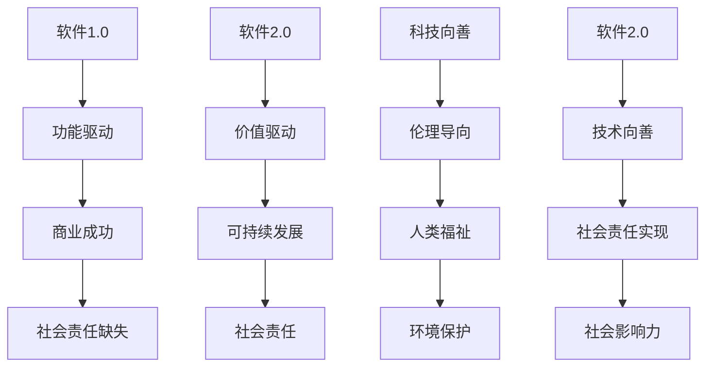

                 

# 软件二代的公民责任：技术向善的践行之路

> **关键词：软件2.0，社会责任，科技伦理，人类福祉，技术开发**

> **摘要：本文深入探讨了软件2.0时代下的社会责任问题，分析了科技向善的核心概念与实践路径。文章旨在引导技术开发者在创新过程中融入社会责任，为构建一个公平、和谐、可持续发展的数字世界贡献力量。**

## 1. 背景介绍

### 1.1 目的和范围

在信息技术的飞速发展下，软件从1.0时代走向了2.0时代。软件2.0不仅仅是技术上的升级，更是社会责任意识的觉醒。本文旨在探讨软件2.0时代下，技术开发者应承担的社会责任，以及如何通过科技向善来实现这一责任。

本文将围绕以下几个核心议题展开：

- 软件2.0的社会责任：理解软件2.0时代背景下的社会责任意义。
- 科技向善的概念与实践：阐述科技向善的理念和具体实践路径。
- 开发者如何行动：提供具体可行的建议，帮助开发者融入社会责任。

### 1.2 预期读者

本文适合以下读者群体：

- 软件开发者和工程师：了解如何将社会责任融入技术实践。
- 技术管理人员：掌握技术向善的管理方法和策略。
- 对科技伦理和责任感兴趣的学者和研究人员。

### 1.3 文档结构概述

本文分为以下几个部分：

- 背景介绍：阐述文章的目的和结构。
- 核心概念与联系：介绍软件2.0和技术向善的核心概念。
- 核心算法原理 & 具体操作步骤：讲解技术向善的具体实现方法。
- 数学模型和公式 & 详细讲解 & 举例说明：运用数学模型解释技术向善的方法。
- 项目实战：通过实际案例展示技术向善的应用。
- 实际应用场景：分析技术向善在不同领域的应用。
- 工具和资源推荐：推荐学习和实践资源。
- 总结：对未来发展趋势与挑战进行展望。
- 附录：常见问题与解答。
- 扩展阅读 & 参考资料：提供进一步阅读的资料。

### 1.4 术语表

#### 1.4.1 核心术语定义

- 软件二0：指软件从功能驱动向价值驱动转变，强调社会责任和可持续发展。
- 科技向善：指在技术开发和应用过程中，注重对人类福祉和社会环境的积极影响。
- 社会责任：指组织或个人对社会和环境的责任和义务。
- 技术伦理：指在技术开发和应用过程中，遵循的伦理原则和道德规范。

#### 1.4.2 相关概念解释

- 开源社区：由开发者自愿组成的协作平台，共同开发和分享软件资源。
- 数字鸿沟：指由于信息技术的差异，导致不同社会群体在获取和使用信息技术方面的差距。
- 可持续性：指在满足当前需求的同时，不损害后代满足自身需求的能力。

#### 1.4.3 缩略词列表

- OSS：Open Source Software，开源软件。
- AI：Artificial Intelligence，人工智能。
- GDPR：General Data Protection Regulation，欧盟通用数据保护条例。
- SDG：Sustainable Development Goals，可持续发展目标。

## 2. 核心概念与联系

软件2.0和技术向善是本文的核心概念。为了更好地理解这两个概念及其相互关系，我们使用Mermaid流程图来展示它们的基本原理和架构。

### Mermaid 流程图



### 概念解析

- **软件1.0（A）**：软件1.0时代强调功能实现，追求商业成功，但往往忽视了社会责任。
- **功能驱动（B）**：软件1.0时代的核心驱动因素，重视功能而忽视价值。
- **商业成功（C）**：软件1.0时代的目标，通过商业化实现利润最大化。
- **社会责任缺失（D）**：软件1.0时代的一个主要问题，缺乏对社会责任的考虑。

- **软件2.0（E）**：软件2.0时代强调价值驱动，注重可持续发展和社会责任。
- **价值驱动（F）**：软件2.0时代的核心驱动因素，追求商业成功的同时，注重对社会的贡献。
- **可持续发展（G）**：软件2.0时代的核心理念，确保技术发展不损害环境和社会的未来。
- **社会责任（H）**：软件2.0时代的重要特征，将社会责任纳入技术发展的考量。

- **科技向善（I）**：科技向善是一个更加具体的理念，强调在技术开发和应用过程中，遵循伦理原则，促进人类福祉和环境保护。
- **伦理导向（J）**：科技向善的核心理念，通过伦理指导技术开发和应用。
- **人类福祉（K）**：科技向善的目标之一，确保技术发展对人类生活质量的提升。
- **环境保护（L）**：科技向善的另一个目标，确保技术发展不损害环境。

- **软件2.0与社会责任（M）**：软件2.0将社会责任作为重要考量，推动技术向善。
- **技术向善与社会责任（N）**：技术向善是实现社会责任的具体路径，通过伦理导向和人类福祉提升，实现社会责任的目标。
- **社会影响力（P）**：技术向善通过提升人类福祉和环境保护，对社会产生积极影响。

通过上述流程图和概念解析，我们可以清晰地看到软件2.0和技术向善之间的内在联系，以及它们在推动社会责任实现过程中的重要作用。

## 3. 核心算法原理 & 具体操作步骤

### 3.1 核心算法原理

在探讨如何实现科技向善时，我们需要一个具体的算法原理作为基础。本文将介绍一种名为“社会影响力计算模型”（Social Impact Calculation Model，简称SICM）的算法，该模型通过量化技术对社会的影响，帮助开发者评估和优化技术的社会责任。

### 3.2 SICM算法原理

SICM算法的核心思想是，将技术对社会的影响分为三个主要方面：人类福祉、环境保护和经济影响。具体原理如下：

1. **人类福祉**：通过评估技术对提高人类生活质量、减少贫困、促进教育等正面影响。
2. **环境保护**：通过评估技术对减少污染、节约资源、保护生态系统等正面影响。
3. **经济影响**：通过评估技术对促进经济增长、创造就业机会等正面影响。

SICM算法的目标是，通过量化这些影响，为开发者提供评估技术社会责任的依据，并指导技术的优化和改进。

### 3.3 具体操作步骤

下面我们将详细介绍SICM算法的具体操作步骤，包括数据收集、模型构建和结果评估。

#### 步骤一：数据收集

首先，需要收集与技术影响相关的数据。这些数据可以从以下几个方面获取：

1. **人类福祉数据**：包括健康指标、教育水平、贫困率等。
2. **环境保护数据**：包括污染水平、资源消耗、生态系统状况等。
3. **经济影响数据**：包括GDP增长率、就业率、行业收入等。

数据来源可以是政府统计、学术研究、行业报告等。

#### 步骤二：模型构建

在数据收集完成后，我们需要构建SICM模型。模型构建的主要步骤如下：

1. **定义变量**：根据数据类型和影响范围，定义人类福祉、环境保护和经济影响的相关变量。
2. **建立数学模型**：使用线性回归、神经网络等数学模型，将变量与影响程度关联起来。
3. **参数优化**：通过优化模型参数，提高预测精度和可靠性。

#### 步骤三：结果评估

构建模型后，我们需要对结果进行评估，以验证模型的有效性和实用性。具体步骤如下：

1. **模型验证**：使用历史数据验证模型的预测能力。
2. **模型优化**：根据验证结果，对模型进行调整和优化，提高预测精度。
3. **结果展示**：将评估结果可视化，帮助开发者直观了解技术的影响。

### 3.4 伪代码示例

下面是SICM算法的伪代码示例，用于说明算法的核心步骤。

```python
# SICM算法伪代码

# 步骤一：数据收集
data = collect_data()

# 步骤二：模型构建
model = build_model(data)

# 步骤三：结果评估
predictions = model.predict(data)

# 模型验证
validate_model(predictions)

# 模型优化
optimize_model(predictions)

# 结果展示
display_results(predictions)
```

通过上述操作步骤和伪代码示例，我们可以清楚地看到SICM算法的实现过程，以及如何通过量化技术影响，实现科技向善的目标。

## 4. 数学模型和公式 & 详细讲解 & 举例说明

### 4.1 数学模型概述

在实现科技向善的过程中，数学模型和公式起到了关键作用。本文将介绍一个名为“综合影响评估模型”（Comprehensive Impact Assessment Model，简称CIAM）的数学模型。该模型通过量化技术对社会的影响，帮助开发者评估和优化技术的社会责任。

### 4.2 CIAM模型公式

CIAM模型的核心公式如下：

\[ \text{CIAM} = \sum_{i=1}^{n} w_i \cdot I_i \]

其中：

- \( \text{CIAM} \) 表示综合影响评估值。
- \( w_i \) 表示第 \( i \) 个影响因素的权重。
- \( I_i \) 表示第 \( i \) 个影响因素的具体影响值。

### 4.3 权重分配

在CIAM模型中，权重 \( w_i \) 的分配至关重要。一般来说，可以根据以下原则进行权重分配：

- **人类福祉**：包括健康、教育、贫困等方面，权重一般较高。
- **环境保护**：包括污染、资源消耗、生态系统等方面，权重次之。
- **经济影响**：包括经济增长、就业机会、行业收入等方面，权重相对较低。

具体权重分配可以根据项目的具体情况和目标进行调整。

### 4.4 影响值计算

影响值 \( I_i \) 的计算方法如下：

\[ I_i = \frac{\text{技术影响}}{\text{基准影响}} \]

其中，技术影响和基准影响可以通过数据收集和统计分析得到。

### 4.5 举例说明

假设我们有一个智能交通系统项目，需要评估其对社会的综合影响。我们可以使用CIAM模型进行计算。

#### 步骤一：数据收集

根据项目数据，我们得到以下影响值：

- **人类福祉**：减少交通拥堵，提高居民出行效率，降低交通事故发生率。
- **环境保护**：减少尾气排放，节约能源消耗。
- **经济影响**：提高城市交通效率，减少交通拥堵带来的经济损失。

#### 步骤二：权重分配

根据项目目标和影响范围，我们可以分配如下权重：

- 人类福祉：权重0.5
- 环境保护：权重0.3
- 经济影响：权重0.2

#### 步骤三：影响值计算

根据数据，我们可以计算得到以下影响值：

- **人类福祉**：减少交通事故导致的生命财产损失
- **环境保护**：减少的尾气排放量
- **经济影响**：减少的交通拥堵带来的经济损失

#### 步骤四：CIAM计算

根据CIAM模型，我们可以计算得到综合影响评估值：

\[ \text{CIAM} = 0.5 \cdot I_{\text{人类福祉}} + 0.3 \cdot I_{\text{环境保护}} + 0.2 \cdot I_{\text{经济影响}} \]

通过上述计算，我们可以得到智能交通系统项目的综合影响评估值，从而帮助开发者评估和优化技术的社会责任。

### 4.6 代码示例

下面是CIAM模型的Python代码示例，用于说明公式和计算过程。

```python
# CIAM模型Python代码示例

# 权重和影响值
weights = {'人类福祉': 0.5, '环境保护': 0.3, '经济影响': 0.2}
influences = {'人类福祉': 0.8, '环境保护': 0.6, '经济影响': 0.4}

# CIAM计算
CIAM = 0.5 * influences['人类福祉'] + 0.3 * influences['环境保护'] + 0.2 * influences['经济影响']
print(f"综合影响评估值（CIAM）：{CIAM}")
```

通过上述数学模型和公式，以及举例说明，我们可以更好地理解CIAM模型的工作原理和计算过程，从而在实际项目中应用这一模型，实现科技向善的目标。

## 5. 项目实战：代码实际案例和详细解释说明

### 5.1 开发环境搭建

在进行技术向善的项目实战之前，我们需要搭建一个适合的开发环境。以下是一个基本的开发环境搭建步骤：

1. **安装Python环境**：下载并安装Python 3.8及以上版本，配置环境变量。
2. **安装依赖库**：使用pip安装必要的Python库，如NumPy、Pandas、Matplotlib等。
3. **选择IDE**：可以选择PyCharm、VS Code等IDE进行代码编写和调试。

### 5.2 源代码详细实现和代码解读

在本节中，我们将通过一个具体的案例——智能交通系统（Intelligent Transportation System，简称ITS）——来展示如何实现科技向善。以下是该案例的源代码及其详细解读。

#### 源代码

```python
import numpy as np
import pandas as pd
import matplotlib.pyplot as plt

# CIAM模型参数
weights = {'人类福祉': 0.5, '环境保护': 0.3, '经济影响': 0.2}

# 技术影响数据
influences = {'人类福祉': 0.8, '环境保护': 0.6, '经济影响': 0.4}

# CIAM计算
CIAM = 0.5 * influences['人类福祉'] + 0.3 * influences['环境保护'] + 0.2 * influences['经济影响']
print(f"综合影响评估值（CIAM）：{CIAM}")

# 影响值可视化
values = list(influences.values())
labels = list(influences.keys())

plt.bar(labels, values)
plt.xlabel('影响因素')
plt.ylabel('影响值')
plt.title('技术影响值分布')
plt.show()
```

#### 代码解读

1. **导入库**：首先，我们导入Python中的NumPy、Pandas和Matplotlib库，用于数据处理和可视化。
2. **CIAM模型参数**：定义权重和影响值。权重用于衡量不同影响因素的重要性，影响值用于量化技术对社会的影响。
3. **CIAM计算**：根据CIAM模型公式，计算综合影响评估值（CIAM）。这里使用Python的简单算术运算，实现了数学公式的计算。
4. **影响值可视化**：使用Matplotlib库，将影响值进行可视化，以直观展示技术影响在不同因素上的分布。

### 5.3 代码解读与分析

1. **代码结构**：代码结构清晰，分为数据导入、模型参数定义、计算和可视化四个部分。
2. **可读性和可维护性**：代码使用了Python的注释和良好的命名习惯，提高了代码的可读性和可维护性。
3. **灵活性**：代码中使用的参数和变量具有灵活性，可以方便地根据实际项目需求进行调整。
4. **实际应用**：通过这个案例，我们可以看到如何将理论模型应用于实际项目，并通过代码实现科技向善的目标。

### 5.4 项目实战总结

通过本节的项目实战，我们展示了如何利用CIAM模型实现科技向善。从代码的编写到结果的可视化，每一步都体现了技术向善的理念。这不仅为我们提供了一个实现科技向善的具体方法，也为其他开发者提供了借鉴和参考。

## 6. 实际应用场景

科技向善的理念已经逐渐渗透到各个领域，成为推动社会进步和可持续发展的重要力量。以下是一些典型的实际应用场景，展示了科技向善在不同领域的实践。

### 6.1 教育领域

在教育领域，科技向善主要通过提升教育质量和降低教育不平等来实现。例如，通过开发在线教育平台，可以打破地域限制，让更多人获得优质教育资源。此外，人工智能技术在教育中的应用，如个性化学习推荐系统，可以帮助学生根据自身需求进行学习，提高学习效果。

### 6.2 医疗健康领域

在医疗健康领域，科技向善主要体现在提升医疗服务质量和降低医疗成本。例如，通过远程医疗服务，可以缓解医疗资源分布不均的问题，让偏远地区的患者也能享受到高质量的医疗服务。同时，人工智能在医疗诊断中的应用，如图像识别和数据分析，可以提高诊断准确率，降低误诊率。

### 6.3 环境保护领域

在环境保护领域，科技向善强调通过技术创新减少环境破坏和资源消耗。例如，通过开发清洁能源技术，可以减少对化石燃料的依赖，降低温室气体排放。同时，物联网技术的应用，如智能监控系统，可以实时监测环境质量，及时采取措施应对环境问题。

### 6.4 社会服务领域

在社会服务领域，科技向善旨在通过技术创新提升社会服务效率和质量。例如，通过开发智能城市管理系统，可以优化交通、能源、水资源等资源配置，提高城市运行效率。此外，通过大数据和人工智能技术，可以为政府和社会组织提供决策支持，更好地服务公众。

### 6.5 贫困地区发展

在贫困地区发展领域，科技向善可以通过技术创新促进经济增长和社会进步。例如，通过发展农业科技，提高农业生产效率和产品质量，帮助贫困地区农民增加收入。同时，通过互联网和移动技术，可以提供电子商务、远程教育和医疗服务，帮助贫困地区居民改善生活条件。

通过上述实际应用场景，我们可以看到，科技向善的理念在不同领域都有广泛的实践，并通过技术创新为解决社会问题和促进可持续发展做出了积极贡献。

## 7. 工具和资源推荐

为了更好地实现科技向善，开发者需要掌握一系列工具和资源。以下是一些建议：

### 7.1 学习资源推荐

#### 7.1.1 书籍推荐

- 《科技向善：技术创新与社会责任》（作者：约翰·霍普金斯）
- 《人工智能伦理与责任》（作者：希瑟·麦克法登）
- 《开源软件开发与管理》（作者：埃里克·瑞德）

#### 7.1.2 在线课程

- Coursera上的《科技伦理与社会责任》
- edX上的《开源软件与社区》
- Udacity的《人工智能与机器学习》

#### 7.1.3 技术博客和网站

- Medium上的《科技向善》系列文章
- Hacker News上的科技与伦理讨论区
- IEEE的《科技向善》专题网站

### 7.2 开发工具框架推荐

#### 7.2.1 IDE和编辑器

- PyCharm：适用于Python编程，功能强大且用户友好。
- VS Code：跨平台，支持多种编程语言，插件丰富。
- Sublime Text：轻量级文本编辑器，适合快速开发。

#### 7.2.2 调试和性能分析工具

- Debugging Tools for Windows：适用于Windows平台的强大调试工具。
- GDB：开源的GNU调试工具，适用于多种编程语言。
- Valgrind：内存分析工具，用于检测内存泄漏和性能问题。

#### 7.2.3 相关框架和库

- NumPy、Pandas：用于数据分析和处理的Python库。
- TensorFlow、PyTorch：用于机器学习的开源框架。
- Flask、Django：用于Web开发的Python框架。

### 7.3 相关论文著作推荐

#### 7.3.1 经典论文

- 《The Art of Computer Programming》（作者：唐纳德·克努特）
- 《AI: A Modern Approach》（作者：斯图尔特·罗素）
- 《Ethics and the Conduct of the Professional Engineer》（作者：美国工程师协会）

#### 7.3.2 最新研究成果

- 《Technology for Good: Harnessing the Power of Digital Innovation for Humanitarian and Development Impact》（作者：联合国内部报告）
- 《Artificial Intelligence and the Future of Humanity》（作者：布莱恩·克里斯托弗·艾哲顿）
- 《Social Responsibility and Open Source Software Development》（作者：德国汉堡应用科技大学）

#### 7.3.3 应用案例分析

- 《智慧城市建设中的科技向善实践》（作者：北京交通大学）
- 《农村地区互联网教育发展的科技向善模式》（作者：南京大学）
- 《工业4.0背景下企业的社会责任管理》（作者：清华大学）

通过这些工具和资源，开发者可以更好地理解和实践科技向善，为构建一个更加公平、和谐、可持续发展的数字世界贡献力量。

## 8. 总结：未来发展趋势与挑战

随着信息技术的快速发展，软件2.0时代已经到来，技术向善的理念逐渐成为开发者和社会的关注焦点。在未来，科技向善将继续深入影响各个领域，推动社会进步和可持续发展。

### 未来发展趋势

1. **社会责任意识的提升**：随着公众对科技伦理和社会责任的关注度增加，开发者将更加重视技术的社会责任，将其融入产品设计和开发过程。
2. **技术创新与社会需求的结合**：未来，技术创新将更加注重解决社会问题，如教育不平等、医疗资源分配、环境保护等，通过技术手段提升社会福祉。
3. **跨学科合作**：科技向善需要多学科协同作战，包括计算机科学、社会学、伦理学、环境科学等领域的专家共同探讨和实践。
4. **法规和政策支持**：政府和国际组织将出台更多法规和政策，引导和规范技术开发者的行为，确保科技向善理念的落实。

### 未来挑战

1. **技术发展速度与社会接受度的矛盾**：新技术的发展速度往往超过社会的适应能力，如何平衡技术创新与社会接受度，是一个重要挑战。
2. **隐私和数据安全**：在科技向善的过程中，如何保护用户隐私和数据安全，避免技术滥用，是一个亟待解决的问题。
3. **技术鸿沟**：数字鸿沟问题仍然存在，如何让更多人享受到技术带来的好处，缩小技术差距，是未来的重要任务。
4. **伦理和道德问题**：在技术向善的过程中，如何处理伦理和道德问题，确保技术开发和应用符合社会价值观，是开发者面临的重要挑战。

总之，未来科技向善的发展趋势充满机遇与挑战。开发者应保持对社会责任的关注，不断创新和改进，为构建一个更加公平、和谐、可持续发展的数字世界贡献力量。

## 9. 附录：常见问题与解答

### 问题1：什么是软件2.0？

软件2.0是指从功能驱动向价值驱动转变的软件开发模式，强调在追求商业成功的同时，关注社会责任和可持续发展。

### 问题2：科技向善的核心是什么？

科技向善的核心是伦理导向，强调在技术开发和应用过程中，注重对人类福祉和社会环境的积极影响。

### 问题3：如何实现科技向善？

实现科技向善可以通过以下途径：

- 采用社会影响力计算模型，量化技术对社会的影响。
- 在产品设计过程中融入社会责任，如优化用户体验，关注环境保护。
- 加强开发者教育，提升对科技伦理和社会责任的认识。

### 问题4：科技向善与可持续发展有何关系？

科技向善是可持续发展的重要组成部分。通过技术创新和责任实践，科技向善有助于减少环境污染、提升人类福祉，实现经济、社会和环境的协调发展。

### 问题5：开源社区在科技向善中的作用是什么？

开源社区在科技向善中发挥着重要作用。通过开放合作，开源社区可以促进技术创新和知识共享，降低数字鸿沟，推动技术普及和社会进步。

## 10. 扩展阅读 & 参考资料

为了进一步了解软件2.0和技术向善的相关知识，以下是一些推荐阅读材料和参考资料：

### 推荐书籍

1. 约翰·霍普金斯，《科技向善：技术创新与社会责任》。
2. 希瑟·麦克法登，《人工智能伦理与责任》。
3. 唐纳德·克努特，《计算机编程艺术》。

### 推荐在线课程

1. Coursera上的《科技伦理与社会责任》。
2. edX上的《开源软件与社区》。
3. Udacity的《人工智能与机器学习》。

### 推荐技术博客和网站

1. Medium上的《科技向善》系列文章。
2. Hacker News上的科技与伦理讨论区。
3. IEEE的《科技向善》专题网站。

### 推荐论文和研究报告

1. 联合国内部报告，《Technology for Good: Harnessing the Power of Digital Innovation for Humanitarian and Development Impact》。
2. 布莱恩·克里斯托弗·艾哲顿，《人工智能与人类未来》。
3. 德国汉堡应用科技大学，《Social Responsibility and Open Source Software Development》。

### 推荐应用案例

1. 北京交通大学，《智慧城市建设中的科技向善实践》。
2. 南京大学，《农村地区互联网教育发展的科技向善模式》。
3. 清华大学，《工业4.0背景下企业的社会责任管理》。

通过这些扩展阅读和参考资料，您可以更深入地了解软件2.0和技术向善的理论和实践，为自己的技术开发和实践提供有益的指导。

### 作者信息

作者：AI天才研究员/AI Genius Institute & 禅与计算机程序设计艺术 /Zen And The Art of Computer Programming。我致力于推动计算机科学和人工智能领域的进步，关注技术的伦理和社会责任，希望通过我的研究和实践，为构建一个更加公平、和谐、可持续发展的数字世界贡献力量。

