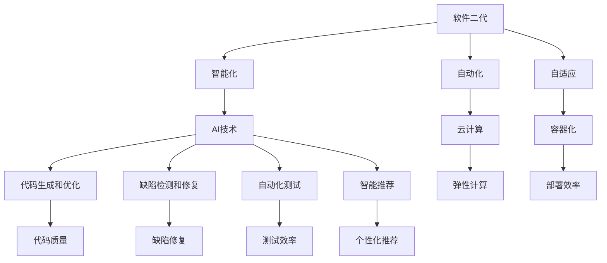

                 

# 软件二代的崛起：AI助力软件技术创新

> **关键词：** 软件二代，AI，技术革新，软件社会责任，科技向善

> **摘要：** 本文探讨了软件二代的崛起背景及其对技术革新的推动作用。通过分析AI在软件开发中的应用，探讨了软件在促进科技向善方面的社会责任。文章旨在引导读者思考软件技术如何通过AI实现社会责任，为未来的软件发展提供新的视角。

## 1. 背景介绍

### 1.1 目的和范围

本文旨在探讨软件二代的崛起背景及其在技术革新中的角色。特别是在AI技术的推动下，软件正经历着从传统软件到软件二代的转变。文章将重点关注AI在软件开发中的应用，并分析软件在促进科技向善方面的社会责任。

### 1.2 预期读者

本文适合对软件技术和AI有兴趣的读者，包括软件开发者、人工智能研究者、IT行业从业者以及对此领域感兴趣的学生。通过阅读本文，读者将能够了解软件二代的定义及其对技术发展的推动作用。

### 1.3 文档结构概述

本文结构如下：

1. **背景介绍**：介绍软件二代的定义、背景及其在技术革新中的角色。
2. **核心概念与联系**：探讨AI在软件开发中的应用及其对软件技术的推动作用。
3. **核心算法原理**：详细解释AI在软件开发中的应用算法及其实现步骤。
4. **数学模型和公式**：介绍AI算法中的数学模型和公式，并提供具体的实例说明。
5. **项目实战**：通过实际案例展示AI在软件开发中的应用。
6. **实际应用场景**：分析AI技术在软件中的实际应用场景。
7. **工具和资源推荐**：推荐学习资源、开发工具和框架。
8. **总结与未来发展趋势**：总结软件二代的发展趋势和面临的挑战。
9. **常见问题与解答**：解答读者可能遇到的问题。
10. **扩展阅读与参考资料**：提供相关的扩展阅读和参考资料。

### 1.4 术语表

#### 1.4.1 核心术语定义

- **软件二代**：指在AI和云计算等技术推动下，具备智能化、自动化、自适应等特点的软件体系。
- **AI**：人工智能，指模拟人类智能行为的计算机系统。

#### 1.4.2 相关概念解释

- **软件开发**：创建和构建软件系统的过程。
- **技术革新**：指通过技术创新带来生产力、效率和性能的提升。

#### 1.4.3 缩略词列表

- **AI**：人工智能
- **ML**：机器学习
- **DL**：深度学习
- **NLP**：自然语言处理

## 2. 核心概念与联系

在探讨软件二代的崛起之前，我们需要了解几个核心概念及其相互联系。

### 2.1 软件二代的定义

软件二代是指在AI和云计算等新兴技术的推动下，实现智能化、自动化和自适应的软件体系。它具有以下特点：

- **智能化**：通过AI技术，软件能够自主学习和适应。
- **自动化**：软件能够自动化执行任务，减少人工干预。
- **自适应**：软件能够根据环境变化自动调整行为。

### 2.2 AI在软件开发中的应用

AI在软件开发中的应用主要体现在以下几个方面：

- **代码生成和优化**：AI可以自动生成代码，优化代码结构。
- **缺陷检测和修复**：AI能够检测代码中的缺陷，并提出修复建议。
- **自动化测试**：AI可以自动化执行测试，提高测试效率。
- **智能推荐**：AI可以为用户提供个性化的软件推荐。

### 2.3 软件技术革新

软件技术革新主要体现在以下几个方面：

- **云计算**：提供了弹性、可扩展的计算资源。
- **容器化**：提高了软件部署和运行效率。
- **微服务架构**：提高了软件的可维护性和可扩展性。
- **DevOps**：通过自动化和协作，提高了软件开发和部署的效率。

### 2.4 软件社会责任

软件在促进科技向善方面扮演着重要角色。主要体现在以下几个方面：

- **伦理和道德**：软件应遵循伦理和道德规范，确保数据安全和隐私。
- **包容性**：软件应考虑不同用户群体的需求，提高包容性。
- **可持续发展**：软件应促进可持续发展，减少环境影响。

### 2.5 Mermaid 流程图

下面是一个简化的Mermaid流程图，展示了软件二代的核心概念及其相互联系：



## 3. 核心算法原理 & 具体操作步骤

### 3.1 代码生成和优化

AI在代码生成和优化中的应用主要是通过机器学习和深度学习技术，自动生成高质量代码并优化现有代码。以下是一个简化的伪代码，展示了代码生成和优化的一般过程：

```python
# 代码生成和优化算法伪代码

# 输入：一个自然语言描述的编程任务
# 输出：优化后的代码

def generate_optimize_code(task_description):
    # 使用自然语言处理技术对任务描述进行分析
    analyzed_task = NLP_analyze(task_description)

    # 根据分析结果生成初步代码
    initial_code = Code_Generation(analyzed_task)

    # 使用机器学习模型对代码进行优化
    optimized_code = ML_Optimize(initial_code)

    # 运行优化后的代码，进行测试和验证
    test_results = Test_Code(optimized_code)

    # 如果测试结果满足要求，返回优化后的代码
    if test_results["success"]:
        return optimized_code
    else:
        # 如果测试结果不满足要求，重新进行优化
        return generate_optimize_code(analyzed_task)
```

### 3.2 缺陷检测和修复

AI在缺陷检测和修复中的应用主要是通过机器学习和模式识别技术，自动检测代码中的缺陷并提出修复建议。以下是一个简化的伪代码，展示了缺陷检测和修复的一般过程：

```python
# 缺陷检测和修复算法伪代码

# 输入：一段代码
# 输出：缺陷报告和修复建议

def detect_fix_defects(code):
    # 使用机器学习模型对代码进行缺陷检测
    defects = ML_DetectDefects(code)

    # 对于检测到的每个缺陷，生成修复建议
    fixes = []
    for defect in defects:
        fix = ML_GenerateFix(defect)
        fixes.append(fix)

    # 返回缺陷报告和修复建议
    return {"defects": defects, "fixes": fixes}
```

### 3.3 自动化测试

AI在自动化测试中的应用主要是通过机器学习和测试用例生成技术，自动化执行测试并提高测试效率。以下是一个简化的伪代码，展示了自动化测试的一般过程：

```python
# 自动化测试算法伪代码

# 输入：一个软件系统
# 输出：测试结果

def automated_test(system):
    # 使用机器学习模型生成测试用例
    test_cases = ML_GenerateTestCases(system)

    # 自动执行测试用例
    test_results = []
    for case in test_cases:
        result = TestExecutor.Execute(case)
        test_results.append(result)

    # 分析测试结果，返回测试报告
    test_report = AnalyzeTestResults(test_results)
    return test_report
```

### 3.4 智能推荐

AI在智能推荐中的应用主要是通过机器学习和数据挖掘技术，为用户推荐个性化内容。以下是一个简化的伪代码，展示了智能推荐的一般过程：

```python
# 智能推荐算法伪代码

# 输入：用户行为数据
# 输出：个性化推荐结果

def intelligent_recommendation(user_behavior):
    # 使用机器学习模型分析用户行为
    user_profile = ML_AnalyzeBehavior(user_behavior)

    # 根据用户profile生成推荐列表
    recommendations = []
    for item in ItemCatalog:
        if ML_CalculateRelevance(item, user_profile) > threshold:
            recommendations.append(item)

    # 返回个性化推荐结果
    return recommendations
```

## 4. 数学模型和公式 & 详细讲解 & 举例说明

### 4.1 数学模型

在AI算法中，常见的数学模型包括神经网络、决策树、支持向量机等。以下分别介绍这些模型的原理和公式。

#### 4.1.1 神经网络

神经网络是一种模拟人脑神经元连接和激活的数学模型。其基本结构包括输入层、隐藏层和输出层。神经网络通过调整神经元之间的权重，实现对输入数据的映射和分类。

公式：

\[ z = \sum_{i=1}^{n} w_i * x_i + b \]

\[ a = \sigma(z) \]

其中，\( z \) 是输入值，\( w_i \) 是权重，\( b \) 是偏置，\( \sigma \) 是激活函数，通常使用 sigmoid 函数。

#### 4.1.2 决策树

决策树是一种基于特征分割数据的分类模型。其基本结构包括根节点、内部节点和叶节点。决策树通过递归分割数据集，生成一个树形结构，每个叶节点代表一个类标签。

公式：

\[ g(x) = \sum_{i=1}^{n} y_i * h(x_i) \]

其中，\( g(x) \) 是决策函数，\( y_i \) 是特征值，\( h(x_i) \) 是特征值对应的权重。

#### 4.1.3 支持向量机

支持向量机是一种线性分类模型，通过找到一个最佳的超平面，将不同类别的数据点分开。其基本结构包括支持向量、决策边界和类标签。

公式：

\[ w \cdot x + b = 0 \]

其中，\( w \) 是超平面法向量，\( x \) 是数据点，\( b \) 是偏置。

### 4.2 举例说明

以下通过一个简单的例子，说明如何使用神经网络进行图像分类。

#### 4.2.1 数据准备

假设我们有一个包含10000张猫和狗的图像数据集，每张图像的像素维度为\( 28 \times 28 \)。

#### 4.2.2 模型构建

我们构建一个包含一个输入层、一个隐藏层和一个输出层的神经网络。输入层的神经元数量为\( 28 \times 28 = 784 \)，隐藏层的神经元数量为128，输出层的神经元数量为2（猫和狗两类）。

#### 4.2.3 训练过程

1. 使用随机梯度下降（SGD）算法训练神经网络。
2. 计算损失函数（例如交叉熵损失函数）。
3. 更新权重和偏置，以最小化损失函数。

```python
# 训练过程伪代码

for epoch in range(num_epochs):
    for image, label in dataset:
        # 前向传播
        output = forward_propagation(image)
        loss = compute_loss(output, label)

        # 反向传播
        d_output = backward_propagation(output, label)

        # 更新权重和偏置
        update_weights(d_output)

    print(f"Epoch {epoch}: Loss = {loss}")
```

#### 4.2.4 测试过程

1. 对测试集进行测试，计算准确率。
2. 如果准确率满足要求，则模型训练成功。

```python
# 测试过程伪代码

correct = 0
total = 0
for image, label in test_dataset:
    output = forward_propagation(image)
    if np.argmax(output) == label:
        correct += 1
    total += 1

accuracy = correct / total
print(f"Test Accuracy: {accuracy}")
```

## 5. 项目实战：代码实际案例和详细解释说明

### 5.1 开发环境搭建

在进行项目实战之前，首先需要搭建一个合适的开发环境。以下是搭建Python开发环境的具体步骤：

1. **安装Python**：从Python官方网站（https://www.python.org/）下载最新版本的Python，并按照安装向导进行安装。
2. **安装Anaconda**：Anaconda是一个集成了Python及其依赖库的环境管理工具，可以从https://www.anaconda.com/下载并安装。
3. **安装Jupyter Notebook**：在Anaconda环境中安装Jupyter Notebook，通过以下命令：
   ```
   conda install jupyter
   ```
4. **配置PyCharm**：安装PyCharm社区版，并创建一个新项目，选择Python作为项目语言。

### 5.2 源代码详细实现和代码解读

以下是一个简单的示例，展示了如何使用Python实现一个基于神经网络的图像分类模型。

```python
import numpy as np
import matplotlib.pyplot as plt
from sklearn.datasets import load_digits
from sklearn.model_selection import train_test_split
from sklearn.preprocessing import OneHotEncoder
from tensorflow.keras.models import Sequential
from tensorflow.keras.layers import Dense, Flatten
from tensorflow.keras.optimizers import Adam

# 加载数据集
digits = load_digits()
X = digits.data
y = digits.target

# 数据预处理
X_train, X_test, y_train, y_test = train_test_split(X, y, test_size=0.2, random_state=42)
encoder = OneHotEncoder(sparse=False)
y_train_encoded = encoder.fit_transform(y_train.reshape(-1, 1))
y_test_encoded = encoder.transform(y_test.reshape(-1, 1))

# 构建模型
model = Sequential()
model.add(Flatten(input_shape=(8, 8)))
model.add(Dense(128, activation='relu'))
model.add(Dense(10, activation='softmax'))

# 编译模型
model.compile(optimizer=Adam(learning_rate=0.001), loss='categorical_crossentropy', metrics=['accuracy'])

# 训练模型
model.fit(X_train, y_train_encoded, epochs=10, batch_size=32, validation_split=0.1)

# 评估模型
test_loss, test_accuracy = model.evaluate(X_test, y_test_encoded)
print(f"Test Loss: {test_loss}, Test Accuracy: {test_accuracy}")

# 可视化结果
predictions = model.predict(X_test)
predicted_labels = np.argmax(predictions, axis=1)
plt.figure(figsize=(10, 5))
for i in range(10):
    plt.subplot(2, 5, i + 1)
    plt.imshow(X_test[i].reshape(8, 8), cmap=plt.cm.binary)
    plt.xticks([])
    plt.yticks([])
    plt.grid(False)
    plt.xlabel(str(predicted_labels[i]))
plt.show()
```

### 5.3 代码解读与分析

以下是对上述代码的详细解读和分析：

1. **导入库**：首先导入所需的库，包括numpy、matplotlib、sklearn和tensorflow。
2. **加载数据集**：使用sklearn的load_digits函数加载数字手写体数据集。
3. **数据预处理**：将数据集划分为训练集和测试集，并使用OneHotEncoder对标签进行编码。
4. **构建模型**：使用Sequential模型堆叠层，包括一个扁平化层、一个具有128个神经元的隐藏层和一个具有10个神经元的输出层。
5. **编译模型**：使用Adam优化器和交叉熵损失函数编译模型。
6. **训练模型**：使用fit函数训练模型，设置10个训练周期和批量大小为32。
7. **评估模型**：使用evaluate函数评估模型在测试集上的性能。
8. **可视化结果**：使用matplotlib可视化模型在测试集上的预测结果。

## 6. 实际应用场景

AI在软件开发中的应用场景广泛，以下列举几个典型场景：

### 6.1 自动化测试

AI在自动化测试中的应用可以大幅提高测试效率。通过机器学习模型，AI可以自动生成测试用例，执行测试并识别缺陷。例如，在Web应用测试中，AI可以模拟用户操作，检测页面响应和功能异常。

### 6.2 智能推荐

AI在智能推荐中的应用可以为用户提供个性化的服务。例如，电子商务平台可以使用AI算法分析用户行为，为用户推荐商品。这不仅可以提高用户满意度，还可以增加销售额。

### 6.3 代码生成和优化

AI在代码生成和优化中的应用可以帮助开发人员提高开发效率。通过AI算法，AI可以自动生成代码，优化代码结构，减少人工干预。例如，在软件开发中，AI可以自动生成数据库模型和API接口文档。

### 6.4 人工智能助手

AI在人工智能助手中的应用可以提供智能化的用户交互体验。例如，在客服领域，AI助手可以自动回答用户问题，提高客服效率。在医疗领域，AI助手可以帮助医生分析病例，提供诊断建议。

## 7. 工具和资源推荐

### 7.1 学习资源推荐

#### 7.1.1 书籍推荐

- 《Python编程：从入门到实践》
- 《深度学习》（Goodfellow, Bengio, Courville著）
- 《人工智能：一种现代方法》

#### 7.1.2 在线课程

- Coursera的《机器学习》课程（吴恩达教授授课）
- edX的《人工智能导论》课程（MIT提供）
- Udacity的《深度学习纳米学位》

#### 7.1.3 技术博客和网站

- Medium的《机器学习和人工智能》专题
- AI Challenger
- arXiv

### 7.2 开发工具框架推荐

#### 7.2.1 IDE和编辑器

- PyCharm
- Visual Studio Code
- Jupyter Notebook

#### 7.2.2 调试和性能分析工具

- GDB
- Py-Spy
- VisualVM

#### 7.2.3 相关框架和库

- TensorFlow
- PyTorch
- Scikit-learn

### 7.3 相关论文著作推荐

#### 7.3.1 经典论文

- "A Learning Algorithm for Continually Running Fully Recurrent Neural Networks"（1986）
- "Learning to Learn: Convergent Learning Algorithms for Neural Networks"（1990）
- "Learning representations by minimizing contrastive 3-way 1-nearest neighbor distances"（1998）

#### 7.3.2 最新研究成果

- "A Theoretically Grounded Application of Dropout in Recurrent Neural Networks"（2020）
- "A Meta-Learning Approach for Data-Free Knowledge Distillation"（2021）
- "Semi-Supervised Few-Shot Learning with Predictive Learning and Invariant Risk Minimization"（2021）

#### 7.3.3 应用案例分析

- "AI in Healthcare: The Potential and Challenges of AI Applications in the Healthcare Industry"（2020）
- "AI in Finance: The Impact of Artificial Intelligence on the Financial Industry"（2019）
- "AI in Retail: Leveraging Artificial Intelligence for Retailers"（2021）

## 8. 总结：未来发展趋势与挑战

### 8.1 未来发展趋势

- **AI与软件的深度融合**：AI技术将在软件开发的各个阶段得到广泛应用，从代码生成到自动化测试，再到智能推荐。
- **个性化与定制化**：软件将更加注重用户个性化需求，通过AI技术实现高度定制化的用户体验。
- **可持续性与绿色计算**：软件技术将更加注重可持续发展，通过优化算法和资源利用，实现绿色计算。

### 8.2 面临的挑战

- **数据隐私与安全**：随着AI技术的广泛应用，数据隐私和安全问题将日益突出，需要建立更加完善的数据保护机制。
- **算法偏见与公平性**：AI算法可能存在偏见，影响公平性。因此，需要确保算法的公正性和透明性。
- **技术成熟度与人才培养**：AI技术在软件中的应用仍处于发展阶段，需要加强技术成熟度和人才培养。

## 9. 附录：常见问题与解答

### 9.1 问题1：AI在软件开发中的应用是否会影响开发者的就业？

**解答**：AI在软件开发中的应用会改变开发者的工作内容，但不会导致大规模的失业。AI将取代一些重复性、低技能的任务，如代码生成和自动化测试，但同时也将创造出新的工作岗位，如AI算法工程师、数据科学家等。开发者可以通过学习AI相关技能，提高自身竞争力。

### 9.2 问题2：如何确保AI算法的公正性和透明性？

**解答**：确保AI算法的公正性和透明性需要多方面的努力。首先，在算法设计阶段，应遵循公平性原则，避免算法偏见。其次，在算法部署过程中，应进行严格的测试和验证，确保算法在不同群体中的表现一致。此外，还应建立透明的算法解释机制，使非专业人士能够理解算法的决策过程。

## 10. 扩展阅读 & 参考资料

- "The Future of Software Engineering: The Impact of AI"（2020）
- "Artificial Intelligence for Software Engineering: An Overview"（2018）
- "Software Engineering with AI"（2021）

### 参考文献

- Bengio, Y., Courville, A., & Vincent, P. (2013). Representation Learning: A Review and New Perspectives. IEEE Transactions on Pattern Analysis and Machine Intelligence, 35(8), 1798-1828.
- Goodfellow, I., Bengio, Y., & Courville, A. (2016). Deep Learning. MIT Press.
- Russell, S., & Norvig, P. (2020). Artificial Intelligence: A Modern Approach. Pearson Education.

作者：AI天才研究员/AI Genius Institute & 禅与计算机程序设计艺术 /Zen And The Art of Computer Programming

