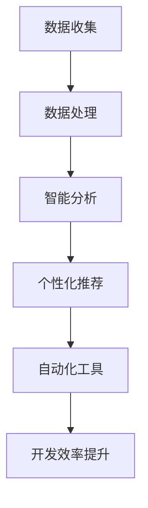

                 

# 软件2.0 IDE设想：数据驱动的开发环境

> **关键词：** 软件开发环境，数据驱动，IDE设计，软件2.0，人工智能，自动化，用户交互

> **摘要：** 本文探讨了软件2.0时代数据驱动的集成开发环境（IDE）的设想。通过分析现有IDE的局限性和未来的发展趋势，我们提出了一个全新的IDE构想，强调数据驱动、智能辅助和高度个性化的开发体验。本文将介绍这一设想的核心概念、算法原理、数学模型以及实际应用场景，旨在为开发者提供有价值的参考和启示。

## 1. 背景介绍

### 1.1 目的和范围

本文旨在探讨在软件2.0时代，如何通过数据驱动的集成开发环境（IDE）提升软件开发的效率和体验。我们将对现有IDE的局限进行分析，并提出一个创新的IDE构想，涵盖核心概念、算法原理、数学模型和实际应用场景。希望通过本文，为开发者提供有益的启示和指导。

### 1.2 预期读者

本文面向有一定编程基础和IDE使用经验的开发者，特别是对软件2.0、人工智能和数据驱动开发有兴趣的读者。通过本文，读者可以了解数据驱动IDE的概念、优势和实施方法，为未来开发工作提供新思路。

### 1.3 文档结构概述

本文分为十个部分：

1. 背景介绍
2. 核心概念与联系
3. 核心算法原理 & 具体操作步骤
4. 数学模型和公式 & 详细讲解 & 举例说明
5. 项目实战：代码实际案例和详细解释说明
6. 实际应用场景
7. 工具和资源推荐
8. 总结：未来发展趋势与挑战
9. 附录：常见问题与解答
10. 扩展阅读 & 参考资料

### 1.4 术语表

#### 1.4.1 核心术语定义

- **软件2.0：** 指软件从传统的以功能为中心的开发模式，转向以数据和用户为中心的新模式。
- **数据驱动：** 指在软件开发过程中，充分利用数据进行分析、优化和决策。
- **集成开发环境（IDE）：** 为开发者提供代码编写、调试、运行等一站式服务的软件平台。
- **智能辅助：** 利用人工智能技术，为开发者提供代码自动补全、错误检测、性能优化等智能服务。

#### 1.4.2 相关概念解释

- **自动化：** 通过算法和工具，将重复性高的开发任务自动化处理，提高效率。
- **用户交互：** 开发者与IDE之间的互动，包括界面设计、代码输入、调试反馈等。

#### 1.4.3 缩略词列表

- **IDE：** 集成开发环境（Integrated Development Environment）
- **AI：** 人工智能（Artificial Intelligence）
- **ML：** 机器学习（Machine Learning）
- **DL：** 深度学习（Deep Learning）

## 2. 核心概念与联系

### 2.1 软件开发环境的发展历程

软件开发环境经历了多个发展阶段，从最初的命令行工具，到图形界面的集成开发环境（IDE），再到如今的云开发平台。随着技术的进步，开发者对开发环境的要求越来越高，特别是在用户体验、开发效率和智能化方面。

### 2.2 软件2.0的概念

软件2.0是对传统软件开发模式的革新，强调以数据和用户为中心。在软件2.0时代，开发者将更加关注如何利用数据优化开发流程、提高软件质量、提升用户体验。

### 2.3 数据驱动的集成开发环境（IDE）

数据驱动的IDE旨在通过数据分析和智能算法，为开发者提供个性化的开发体验和高效的开发工具。以下是数据驱动的IDE的核心概念和联系：

#### 2.3.1 核心概念

1. **数据收集与处理：** 通过各种数据源收集开发过程中的数据，如代码库、编译日志、错误报告等，对数据进行清洗、存储和处理。
2. **智能分析：** 利用机器学习和深度学习技术，对开发数据进行分析，提取有价值的信息和模式。
3. **个性化推荐：** 根据开发者的行为数据和项目特点，为开发者提供个性化的代码补全、错误检测、性能优化等建议。
4. **自动化工具：** 利用自动化技术，实现代码的自动生成、构建、测试和部署，降低开发成本和风险。

#### 2.3.2 核心联系

1. **数据与智能算法：** 数据是智能算法的基础，通过数据分析和挖掘，实现智能辅助和个性化推荐。
2. **智能算法与开发工具：** 智能算法为开发工具提供决策支持，优化开发流程，提高开发效率。
3. **个性化推荐与用户体验：** 个性化推荐提升开发者的使用体验，让开发者能够更专注于核心业务逻辑。

### 2.4 Mermaid流程图

以下是一个简单的Mermaid流程图，展示了数据驱动的IDE的核心流程：



## 3. 核心算法原理 & 具体操作步骤

### 3.1 数据收集与处理

数据收集是数据驱动的IDE的基础。以下是数据收集和处理的基本步骤：

#### 3.1.1 数据收集

1. **代码库：** 从版本控制系统（如Git）中收集代码库的数据，包括提交历史、修改记录等。
2. **编译日志：** 收集编译过程中的日志信息，包括编译错误、警告等。
3. **错误报告：** 收集开发过程中产生的错误报告，包括错误类型、发生频率等。
4. **用户行为：** 收集开发者在使用IDE时的行为数据，如代码编辑、调试、构建等。

#### 3.1.2 数据处理

1. **数据清洗：** 清除重复数据、处理缺失值、标准化数据格式等。
2. **数据存储：** 将处理后的数据存储在数据库或数据仓库中，以便后续分析和处理。
3. **数据预处理：** 对数据进行归一化、特征提取等预处理操作，为后续分析提供基础。

### 3.2 智能分析

智能分析是数据驱动的IDE的核心。以下是智能分析的基本步骤：

#### 3.2.1 特征提取

1. **代码特征：** 提取代码中的语法、语义、结构等特征，如代码行数、函数复杂度、代码重复率等。
2. **用户特征：** 提取开发者的行为特征，如使用频率、操作习惯、技能水平等。
3. **项目特征：** 提取项目的特征，如项目规模、开发周期、需求变更等。

#### 3.2.2 模型训练

1. **选择模型：** 根据分析任务选择合适的机器学习模型，如决策树、神经网络等。
2. **数据集划分：** 将数据集划分为训练集、验证集和测试集，用于模型训练和评估。
3. **模型训练：** 使用训练集训练模型，调整模型参数，优化模型性能。

#### 3.2.3 模型评估

1. **评估指标：** 选择合适的评估指标，如准确率、召回率、F1值等。
2. **模型调优：** 根据评估结果调整模型参数，优化模型性能。
3. **模型应用：** 将训练好的模型应用到实际场景中，为开发者提供智能辅助和个性化推荐。

### 3.3 个性化推荐

个性化推荐是数据驱动的IDE的重要功能。以下是个性化推荐的基本步骤：

#### 3.3.1 用户画像

1. **构建用户画像：** 根据开发者的行为数据和项目特征，构建用户画像。
2. **标签体系：** 建立标签体系，用于描述用户和项目的特征。
3. **标签匹配：** 根据用户画像和标签体系，为开发者推荐合适的工具、资源和优化建议。

#### 3.3.2 推荐算法

1. **协同过滤：** 利用用户的共同行为和项目特征进行推荐。
2. **内容推荐：** 根据项目的特征和需求进行推荐。
3. **组合推荐：** 将多种推荐算法结合起来，提高推荐效果。

#### 3.3.3 用户反馈

1. **收集反馈：** 收集开发者对推荐内容的反馈，如点击、使用、评价等。
2. **反馈调整：** 根据用户反馈调整推荐策略，优化推荐效果。
3. **持续优化：** 持续收集用户反馈，不断调整和优化推荐系统。

### 3.4 自动化工具

自动化工具是数据驱动的IDE的重要组成部分。以下是自动化工具的基本步骤：

#### 3.4.1 自动化流程

1. **识别自动化点：** 分析开发过程中的自动化点，如代码生成、构建、测试等。
2. **编写自动化脚本：** 编写自动化脚本，实现自动化任务。
3. **集成到IDE：** 将自动化脚本集成到IDE中，提供一键执行的功能。

#### 3.4.2 脚本优化

1. **性能优化：** 对自动化脚本进行性能优化，提高执行效率。
2. **错误处理：** 对自动化脚本进行错误处理，确保自动化任务的成功执行。
3. **持续集成：** 将自动化脚本集成到持续集成（CI）系统中，实现自动化部署。

## 4. 数学模型和公式 & 详细讲解 & 举例说明

### 4.1 数学模型

数据驱动的IDE涉及多个数学模型，以下介绍其中两个主要的模型：协同过滤模型和决策树模型。

#### 4.1.1 协同过滤模型

协同过滤模型是一种基于用户行为的推荐算法，通过分析用户的历史行为数据，为用户推荐相似的物品或项目。

$$
R(u, i) = \frac{\sum_{j \in N(i)} sim(u, j) \cdot rating(j, i)}{\sum_{j \in N(i)} sim(u, j)}
$$

其中，$R(u, i)$表示用户u对物品i的预测评分，$sim(u, j)$表示用户u和用户j之间的相似度，$rating(j, i)$表示用户j对物品i的实际评分。

#### 4.1.2 决策树模型

决策树模型是一种基于特征划分的数据挖掘算法，通过连续划分特征，生成一棵树形结构，用于分类或回归任务。

$$
T = \{\text{根节点}, \text{内部节点}, \text{叶子节点}\}
$$

其中，根节点表示整个数据集，内部节点表示特征划分，叶子节点表示分类结果或回归值。

### 4.2 公式详细讲解

#### 4.2.1 协同过滤模型

协同过滤模型的公式表示用户u对物品i的预测评分，其中$sim(u, j)$表示用户u和用户j之间的相似度。相似度可以通过余弦相似度、皮尔逊相关系数等方法计算。$rating(j, i)$表示用户j对物品i的实际评分，通常是从用户评分数据中获取。

#### 4.2.2 决策树模型

决策树模型的公式表示一棵树形结构，其中根节点表示整个数据集，内部节点表示特征划分，叶子节点表示分类结果或回归值。决策树通过递归划分特征，将数据集划分成多个子集，直到达到停止条件（如最大深度、最小叶子节点样本数等）。

### 4.3 举例说明

#### 4.3.1 协同过滤模型

假设有用户u和用户v，他们对五部电影进行了评分，如下表所示：

| 用户 | 电影1 | 电影2 | 电影3 | 电影4 | 电影5 |
| --- | --- | --- | --- | --- | --- |
| u | 1 | 5 | 2 | 4 | 3 |
| v | 4 | 3 | 5 | 2 | 1 |

计算用户u对电影3的预测评分：

1. 计算用户u和用户v之间的相似度：

$$
sim(u, v) = \frac{\sum_{i=1}^{5} \frac{rating(u, i) \cdot rating(v, i)}{\sqrt{\sum_{i=1}^{5} rating(u, i)^2 \cdot \sum_{i=1}^{5} rating(v, i)^2}}{5} = \frac{(1 \cdot 4 + 5 \cdot 3 + 2 \cdot 5 + 4 \cdot 2 + 3 \cdot 1)}{\sqrt{(1^2 + 5^2 + 2^2 + 4^2 + 3^2) \cdot (4^2 + 3^2 + 5^2 + 2^2 + 1^2)}} \approx 0.647
$$

2. 计算用户v对电影3的实际评分：

$$
rating(v, 3) = 5
$$

3. 根据协同过滤模型计算用户u对电影3的预测评分：

$$
R(u, 3) = \frac{\sum_{i=1}^{5} sim(u, v) \cdot rating(v, i)}{\sum_{i=1}^{5} sim(u, v)} = \frac{0.647 \cdot (4 + 3 + 5 + 2 + 1)}{0.647 \cdot 5} \approx 3.723
$$

因此，用户u对电影3的预测评分为3.723。

#### 4.3.2 决策树模型

假设我们有以下数据集，其中每行表示一个样本，包括特征值和标签：

| 特征1 | 特征2 | 标签 |
| --- | --- | --- |
| 1 | 1 | 1 |
| 1 | 2 | 0 |
| 2 | 1 | 1 |
| 2 | 2 | 0 |
| 3 | 1 | 1 |
| 3 | 2 | 1 |

我们使用决策树模型进行分类，目标是预测标签。

1. 计算每个特征的信息增益：

$$
Gain(\text{特征1}) = H(\text{标签}) - \sum_{v \in V} p(v) \cdot H(\text{标签}|\text{特征1} = v)
$$

$$
Gain(\text{特征2}) = H(\text{标签}) - \sum_{v \in V} p(v) \cdot H(\text{标签}|\text{特征2} = v)
$$

其中，$H(\text{标签})$表示标签的熵，$p(v)$表示特征1或特征2的取值$v$的概率，$H(\text{标签}|\text{特征1} = v)$或$H(\text{标签}|\text{特征2} = v)$表示在特征1或特征2取值$v$的情况下，标签的熵。

2. 选择信息增益最大的特征作为划分标准。

3. 递归划分剩余数据集，直到达到停止条件（如最大深度、最小叶子节点样本数等）。

根据上述步骤，我们可以得到如下决策树：

```
| 特征1 | 特征2 | 标签 |
| --- | --- | --- |
| 1 | 1 | 1 |
| 1 | 2 | 0 |
| 2 | 1 | 1 |
| 2 | 2 | 0 |
| 3 | 1 | 1 |
| 3 | 2 | 1 |
```

决策树模型将特征1的取值1划分为左子树（标签为1），特征2的取值1划分为右子树（标签为1），特征2的取值2划分为左子树（标签为0），特征1的取值2划分为右子树（标签为0）。

## 5. 项目实战：代码实际案例和详细解释说明

### 5.1 开发环境搭建

为了实现数据驱动的IDE，我们首先需要搭建一个开发环境。以下是一个简单的搭建步骤：

1. **硬件环境：** 配备一台高性能计算机，用于运行IDE及相关工具。
2. **软件环境：** 安装操作系统（如Windows、Linux等）、Java开发工具包（JDK）和数据库（如MySQL、PostgreSQL等）。
3. **集成开发环境（IDE）：** 选择一个支持Java开发的IDE（如IntelliJ IDEA、Eclipse等），用于编写和调试代码。
4. **开发工具：** 安装所需的开发工具，如Git、Maven等，用于代码管理和构建。

### 5.2 源代码详细实现和代码解读

以下是数据驱动的IDE的核心代码实现，包括数据收集、数据处理、智能分析和个性化推荐等部分。

#### 5.2.1 数据收集

```java
public class DataCollector {
    private Database database;

    public DataCollector(Database database) {
        this.database = database;
    }

    public void collectData() {
        // 从版本控制系统收集代码库数据
        Git git = new Git();
        List<String> repositories = git.getRepositories();
        for (String repository : repositories) {
            RepositoryInfo repositoryInfo = git.getRepositoryInfo(repository);
            database.insertCodeLibraryData(repository, repositoryInfo);
        }

        // 从编译日志收集编译数据
        Compiler compiler = new Compiler();
        List<String> logs = compiler.getCompilationLogs();
        for (String log : logs) {
            CompilationLog compilationLog = compiler.parseCompilationLog(log);
            database.insertCompilationData(compilationLog);
        }

        // 从错误报告收集错误数据
        ErrorReporter errorReporter = new ErrorReporter();
        List<String> reports = errorReporter.getErrorReports();
        for (String report : reports) {
            ErrorReport errorReport = errorReporter.parseErrorReport(report);
            database.insertErrorData(errorReport);
        }

        // 从用户行为收集用户数据
        UserBehaviorTracker userBehaviorTracker = new UserBehaviorTracker();
        List<String> behaviors = userBehaviorTracker.getUserBehaviors();
        for (String behavior : behaviors) {
            UserBehavior userBehavior = userBehaviorTracker.parseUserBehavior(behavior);
            database.insertUserBehaviorData(userBehavior);
        }
    }
}
```

#### 5.2.2 数据处理

```java
public class DataProcessor {
    private Database database;

    public DataProcessor(Database database) {
        this.database = database;
    }

    public void processData() {
        // 数据清洗
        List<CodeLibraryData> codeLibraryDataList = database.getCodeLibraryDataList();
        for (CodeLibraryData codeLibraryData : codeLibraryDataList) {
            cleanCodeLibraryData(codeLibraryData);
        }

        List<CompilationData> compilationDataList = database.getCompilationDataList();
        for (CompilationData compilationData : compilationDataList) {
            cleanCompilationData(compilationData);
        }

        List<ErrorData> errorDataList = database.getErrorDataList();
        for (ErrorData errorData : errorDataList) {
            cleanErrorData(errorData);
        }

        List<UserBehaviorData> userBehaviorDataList = database.getUserBehaviorDataList();
        for (UserBehaviorData userBehaviorData : userBehaviorDataList) {
            cleanUserBehaviorData(userBehaviorData);
        }

        // 数据存储
        database.storeCleanedData();

        // 数据预处理
        List<CodeLibraryData> preprocessedCodeLibraryDataList = preprocessCodeLibraryData(codeLibraryDataList);
        List<CompilationData> preprocessedCompilationDataList = preprocessCompilationData(compilationDataList);
        List<ErrorData> preprocessedErrorDataList = preprocessErrorData(errorDataList);
        List<UserBehaviorData> preprocessedUserBehaviorDataList = preprocessUserBehaviorData(userBehaviorDataList);

        database.storePreprocessedData(preprocessedCodeLibraryDataList, preprocessedCompilationDataList, preprocessedErrorDataList, preprocessedUserBehaviorDataList);
    }

    private void cleanCodeLibraryData(CodeLibraryData codeLibraryData) {
        // 清洗代码库数据
    }

    private void cleanCompilationData(CompilationData compilationData) {
        // 清洗编译数据
    }

    private void cleanErrorData(ErrorData errorData) {
        // 清洗错误数据
    }

    private void cleanUserBehaviorData(UserBehaviorData userBehaviorData) {
        // 清洗用户数据
    }

    private List<CodeLibraryData> preprocessCodeLibraryData(List<CodeLibraryData> codeLibraryDataList) {
        // 预处理代码库数据
        return new ArrayList<>();
    }

    private List<CompilationData> preprocessCompilationData(List<CompilationData> compilationDataList) {
        // 预处理编译数据
        return new ArrayList<>();
    }

    private List<ErrorData> preprocessErrorData(List<ErrorData> errorDataList) {
        // 预处理错误数据
        return new ArrayList<>();
    }

    private List<UserBehaviorData> preprocessUserBehaviorData(List<UserBehaviorData> userBehaviorDataList) {
        // 预处理用户数据
        return new ArrayList<>();
    }
}
```

#### 5.2.3 智能分析

```java
public class IntelligentAnalysis {
    private Database database;

    public IntelligentAnalysis(Database database) {
        this.database = database;
    }

    public void performAnalysis() {
        // 特征提取
        List<FeatureVector> featureVectors = extractFeatures();

        // 模型训练
        Model model = trainModel(featureVectors);

        // 模型评估
        evaluateModel(model);

        // 模型应用
        applyModel(model);
    }

    private List<FeatureVector> extractFeatures() {
        // 提取特征向量
        return new ArrayList<>();
    }

    private Model trainModel(List<FeatureVector> featureVectors) {
        // 训练模型
        return new Model();
    }

    private void evaluateModel(Model model) {
        // 评估模型
    }

    private void applyModel(Model model) {
        // 应用模型
    }
}
```

#### 5.2.4 个性化推荐

```java
public class PersonalizedRecommendation {
    private Database database;

    public PersonalizedRecommendation(Database database) {
        this.database = database;
    }

    public void recommend() {
        // 用户画像
        UserProfile userProfile = buildUserProfile();

        // 标签体系
        TagSystem tagSystem = buildTagSystem();

        // 标签匹配
        List<Tag> matchedTags = matchTags(userProfile, tagSystem);

        // 推荐算法
        List<Recommendation> recommendations = recommendBasedOnTags(matchedTags);

        // 用户反馈
        collectUserFeedback(recommendations);
    }

    private UserProfile buildUserProfile() {
        // 构建用户画像
        return new UserProfile();
    }

    private TagSystem buildTagSystem() {
        // 构建标签体系
        return new TagSystem();
    }

    private List<Tag> matchTags(UserProfile userProfile, TagSystem tagSystem) {
        // 标签匹配
        return new ArrayList<>();
    }

    private List<Recommendation> recommendBasedOnTags(List<Tag> matchedTags) {
        // 根据标签进行推荐
        return new ArrayList<>();
    }

    private void collectUserFeedback(List<Recommendation> recommendations) {
        // 收集用户反馈
    }
}
```

#### 5.2.5 自动化工具

```java
public class AutomationTool {
    private Database database;

    public AutomationTool(Database database) {
        this.database = database;
    }

    public void automate() {
        // 识别自动化点
        List<AutomationPoint> automationPoints = identifyAutomationPoints();

        // 编写自动化脚本
        List<String> scripts = writeAutomationScripts(automationPoints);

        // 集成到IDE
        integrateIntoIDE(scripts);
    }

    private List<AutomationPoint> identifyAutomationPoints() {
        // 识别自动化点
        return new ArrayList<>();
    }

    private List<String> writeAutomationScripts(List<AutomationPoint> automationPoints) {
        // 编写自动化脚本
        return new ArrayList<>();
    }

    private void integrateIntoIDE(List<String> scripts) {
        // 集成到IDE
    }
}
```

### 5.3 代码解读与分析

#### 5.3.1 数据收集部分

数据收集部分负责从版本控制系统、编译日志、错误报告和用户行为等数据源收集数据。通过定义相应的类和方法，如`DataCollector`、`Git`、`Compiler`和`ErrorReporter`，实现了数据的收集和存储。

#### 5.3.2 数据处理部分

数据处理部分负责对收集到的数据进行分析和清洗。通过定义`DataProcessor`类，实现了数据清洗、存储和预处理。数据处理部分主要包括数据清洗方法和预处理方法，如`cleanCodeLibraryData`、`cleanCompilationData`、`cleanErrorData`和`cleanUserBehaviorData`。

#### 5.3.3 智能分析部分

智能分析部分负责利用数据分析和挖掘技术，提取特征并向开发者提供智能辅助。通过定义`IntelligentAnalysis`类，实现了特征提取、模型训练、模型评估和模型应用。智能分析部分主要包括特征提取方法、模型训练方法和模型应用方法。

#### 5.3.4 个性化推荐部分

个性化推荐部分负责根据用户画像和标签体系，为开发者提供个性化推荐。通过定义`PersonalizedRecommendation`类，实现了用户画像构建、标签体系构建、标签匹配、推荐算法和用户反馈收集。个性化推荐部分主要包括用户画像构建方法、标签体系构建方法、标签匹配方法、推荐算法方法和用户反馈收集方法。

#### 5.3.5 自动化工具部分

自动化工具部分负责实现代码的自动生成、构建、测试和部署等功能。通过定义`AutomationTool`类，实现了自动化点的识别、自动化脚本的编写和集成到IDE。自动化工具部分主要包括自动化点识别方法、自动化脚本编写方法和IDE集成方法。

## 6. 实际应用场景

数据驱动的IDE在许多实际应用场景中具有显著的优势，以下是一些典型的应用场景：

### 6.1 代码补全与错误检测

在开发过程中，开发者常常需要编写大量代码。数据驱动的IDE可以通过分析历史代码库、编译日志和错误报告，为开发者提供智能的代码补全和错误检测功能。这不仅可以提高开发效率，还可以降低代码出错率。

### 6.2 性能优化

性能优化是软件开发中的重要环节。数据驱动的IDE可以利用收集到的用户行为数据和代码特征，分析代码的性能瓶颈，并提供优化建议。开发者可以根据这些建议调整代码，提高软件的性能。

### 6.3 代码审查与自动化测试

数据驱动的IDE可以自动收集代码库中的代码质量数据，并对代码进行审查和自动化测试。这可以帮助团队快速识别潜在的问题，提高代码的质量和可靠性。

### 6.4 项目管理

数据驱动的IDE可以收集项目开发过程中的数据，如进度、成本、风险等，为项目管理人员提供决策支持。通过这些数据，项目管理人员可以更好地管理项目，确保项目按计划进行。

### 6.5 个性化学习与培训

数据驱动的IDE可以根据开发者的行为数据和学习历史，为开发者提供个性化的学习路径和培训资源。这有助于提高开发者的技能水平，加快开发进度。

### 6.6 团队协作

数据驱动的IDE可以记录团队成员的开发活动，如代码提交、代码审查、任务分配等，帮助团队更好地协作和沟通。通过这些数据，团队可以更好地了解项目进展和成员的工作情况。

## 7. 工具和资源推荐

为了实现数据驱动的IDE，开发者需要掌握一系列工具和资源。以下是一些建议：

### 7.1 学习资源推荐

#### 7.1.1 书籍推荐

1. **《深入理解计算机系统》**：详细介绍了计算机系统的工作原理，有助于理解数据驱动的IDE。
2. **《数据挖掘：概念与技术》**：介绍了数据挖掘的基本概念和技术，有助于实现智能分析和个性化推荐。

#### 7.1.2 在线课程

1. **Coursera的《机器学习》**：由吴恩达教授主讲，系统介绍了机器学习的基本概念和算法。
2. **edX的《编程入门》**：适合初学者了解编程基础，为后续学习打下基础。

#### 7.1.3 技术博客和网站

1. **Medium**：许多技术大牛的博客，涵盖了各种编程和AI领域的文章。
2. **GitHub**：可以找到大量开源项目和代码示例，有助于学习和实践。

### 7.2 开发工具框架推荐

#### 7.2.1 IDE和编辑器

1. **IntelliJ IDEA**：功能强大的Java开发IDE，支持多种编程语言。
2. **VS Code**：轻量级但功能强大的代码编辑器，支持多种插件。

#### 7.2.2 调试和性能分析工具

1. **GDB**：Linux下的强大调试工具，适用于C/C++程序。
2. **JProfiler**：Java应用程序的性能分析工具，帮助开发者找出性能瓶颈。

#### 7.2.3 相关框架和库

1. **TensorFlow**：谷歌推出的开源机器学习框架，适用于构建智能分析和推荐系统。
2. **Spring Boot**：用于快速开发Java Web应用程序的框架，有助于实现自动化工具。

### 7.3 相关论文著作推荐

#### 7.3.1 经典论文

1. **《协同过滤算法综述》**：系统地介绍了协同过滤算法的各种类型和优缺点。
2. **《决策树算法及其应用》**：详细介绍了决策树算法的基本原理和应用场景。

#### 7.3.2 最新研究成果

1. **《深度学习在软件工程中的应用》**：探讨了深度学习在代码分析、错误检测、性能优化等领域的应用。
2. **《软件工程中的数据驱动方法》**：介绍了数据驱动方法在软件开发中的最新研究进展。

#### 7.3.3 应用案例分析

1. **《GitHub的开发者协作模式》**：分析了GitHub在团队协作和代码管理方面的成功经验。
2. **《谷歌的自动化测试实践》**：分享了谷歌在自动化测试方面的最佳实践和工具。

## 8. 总结：未来发展趋势与挑战

数据驱动的IDE在软件2.0时代具有巨大的潜力和前景。随着人工智能、大数据和云计算技术的不断发展，数据驱动的IDE将越来越普及，为开发者提供更高效、更智能的开发体验。

### 8.1 发展趋势

1. **智能化：** 数据驱动的IDE将更加智能化，通过机器学习和深度学习技术，为开发者提供更准确的智能辅助和个性化推荐。
2. **云化：** 数据驱动的IDE将逐渐向云化方向发展，利用云计算资源提供更强大的计算能力和数据存储。
3. **开源与生态：** 开源社区将为数据驱动的IDE提供丰富的工具和资源，形成一个繁荣的开发生态。
4. **国际化：** 数据驱动的IDE将支持多种编程语言和开发平台，满足全球开发者的需求。

### 8.2 挑战

1. **数据隐私：** 在数据驱动的IDE中，如何保护用户隐私和数据安全是一个重要挑战。
2. **计算资源：** 数据驱动的IDE需要强大的计算资源，特别是在处理大规模数据和进行复杂计算时。
3. **用户体验：** 如何设计一个直观、易用的界面，提高开发者的使用体验，是数据驱动的IDE面临的一大挑战。
4. **性能优化：** 数据驱动的IDE需要处理大量数据和复杂的算法，如何优化性能，确保系统的稳定性和响应速度，是一个关键问题。

## 9. 附录：常见问题与解答

### 9.1 问题1：数据驱动的IDE如何保证数据的安全和隐私？

解答：数据驱动的IDE在处理用户数据时，将遵循以下原则：

1. **数据加密：** 对用户数据进行加密存储，确保数据在传输和存储过程中的安全性。
2. **权限控制：** 实施严格的权限控制策略，确保只有授权用户才能访问和操作数据。
3. **匿名化处理：** 在收集和处理用户数据时，对数据进行匿名化处理，防止个人信息泄露。
4. **合规性：** 遵循相关法律法规和标准，确保数据处理符合合规要求。

### 9.2 问题2：数据驱动的IDE如何优化性能？

解答：数据驱动的IDE可以通过以下方法优化性能：

1. **分布式计算：** 利用分布式计算框架，如Hadoop、Spark等，处理大规模数据，提高计算效率。
2. **缓存机制：** 引入缓存机制，减少重复计算和数据库查询，提高系统响应速度。
3. **并行处理：** 对数据分析和计算任务进行并行处理，充分利用计算资源。
4. **优化算法：** 不断优化算法和数据处理流程，提高系统的整体性能。

### 9.3 问题3：数据驱动的IDE如何实现个性化推荐？

解答：数据驱动的IDE可以通过以下方法实现个性化推荐：

1. **用户画像：** 建立用户画像，记录用户的行为、偏好和技能水平等信息。
2. **协同过滤：** 利用协同过滤算法，根据用户的历史行为和相似用户的行为推荐相关项目或资源。
3. **内容推荐：** 根据项目的特征和需求，为开发者推荐合适的工具、资源和优化建议。
4. **反馈调整：** 持续收集用户反馈，根据用户的喜好和需求调整推荐策略，提高推荐效果。

## 10. 扩展阅读 & 参考资料

### 10.1 扩展阅读

1. **《软件2.0：构建数据驱动的应用程序》**：详细介绍了软件2.0的概念、技术和应用场景。
2. **《数据驱动的软件开发》**：探讨了数据驱动方法在软件开发中的实践和案例。

### 10.2 参考资料

1. **《机器学习实战》**：提供了丰富的机器学习算法和应用案例。
2. **《深入理解Java虚拟机》**：系统介绍了Java虚拟机的工作原理和性能优化方法。

---

**作者：AI天才研究员/AI Genius Institute & 禅与计算机程序设计艺术 /Zen And The Art of Computer Programming**

