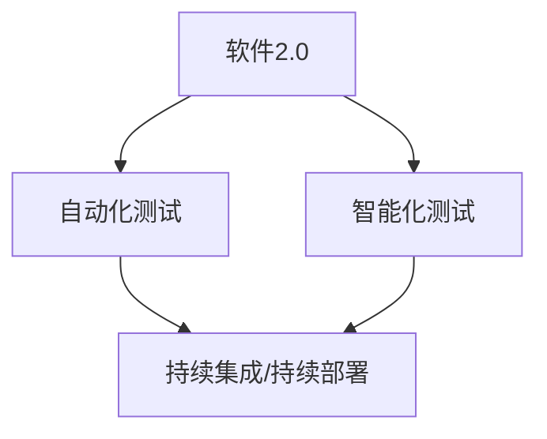
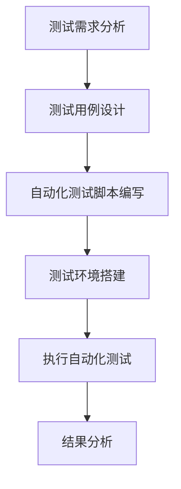
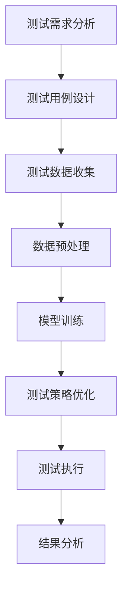

                 

# 软件二步法如何改变软件测试方法论

> **关键词：软件2.0，软件测试，方法论，自动化，智能化**

> **摘要：本文将深入探讨软件2.0的概念及其对软件测试方法论带来的变革。通过对软件2.0的核心特性、测试挑战及其解决方案的详细分析，文章旨在为开发者提供关于如何采用新兴技术来改进软件测试流程的实用指导。**

## 1. 背景介绍

### 1.1 目的和范围

本文旨在探讨软件2.0时代下软件测试领域面临的挑战及相应的解决策略。我们将首先介绍软件2.0的基本概念和特性，然后分析这些特性如何影响软件测试的方法论。文章将重点关注自动化测试和智能化测试的发展趋势，以及它们如何帮助我们更高效地发现和解决软件缺陷。

### 1.2 预期读者

本文适合对软件测试和人工智能有兴趣的软件开发人员、测试工程师以及计算机科学专业的学生。读者需要对软件开发和测试有一定的了解，以便更好地理解本文的内容。

### 1.3 文档结构概述

本文将按照以下结构展开：

- **第1章**：背景介绍，包括本文的目的、预期读者和文档结构。
- **第2章**：核心概念与联系，介绍软件2.0的核心概念及其与软件测试的联系。
- **第3章**：核心算法原理 & 具体操作步骤，详细讲解自动化测试和智能化测试的算法原理和操作步骤。
- **第4章**：数学模型和公式 & 详细讲解 & 举例说明，介绍与测试相关的重要数学模型和公式的应用实例。
- **第5章**：项目实战：代码实际案例和详细解释说明，通过具体代码案例展示如何在实际项目中应用测试方法。
- **第6章**：实际应用场景，探讨软件测试在现实世界中的应用。
- **第7章**：工具和资源推荐，为读者提供相关的学习资源和开发工具。
- **第8章**：总结：未来发展趋势与挑战，展望软件测试的未来方向。
- **第9章**：附录：常见问题与解答，解答读者可能遇到的问题。
- **第10章**：扩展阅读 & 参考资料，提供更多深入的阅读资料。

### 1.4 术语表

#### 1.4.1 核心术语定义

- **软件2.0**：基于云计算、大数据、人工智能等新兴技术，具有高度自动化和智能化特性的新一代软件。
- **自动化测试**：使用工具和脚本自动执行测试过程，以提高测试效率和准确性。
- **智能化测试**：结合机器学习和人工智能技术，实现测试过程的自动优化和智能化。

#### 1.4.2 相关概念解释

- **持续集成/持续部署（CI/CD）**：一种软件开发和部署的实践，通过自动化测试和部署流程，实现快速交付高质量软件。
- **敏捷开发**：一种以人为核心、迭代和灵活性为特征的软件开发方法。

#### 1.4.3 缩略词列表

- **CI**：持续集成（Continuous Integration）
- **CD**：持续部署（Continuous Deployment）
- **AI**：人工智能（Artificial Intelligence）

## 2. 核心概念与联系

### 2.1 软件2.0概述

软件2.0是继传统软件（软件1.0）之后的下一代软件，它利用云计算、大数据、人工智能等技术，实现了软件的高度自动化和智能化。软件2.0具有以下几个核心特性：

1. **云计算**：通过云基础设施提供弹性的计算资源，实现软件的分布式部署和弹性扩展。
2. **大数据**：利用海量数据分析和挖掘，实现个性化推荐、智能决策等高级功能。
3. **人工智能**：结合机器学习和深度学习技术，实现软件的智能化和自动化。
4. **微服务架构**：采用微服务架构，实现软件的模块化、高可用性和可扩展性。

### 2.2 软件2.0与软件测试的关系

软件2.0的特性对软件测试方法论带来了巨大影响。首先，自动化测试成为软件2.0开发的关键环节，因为它能够确保快速交付高质量软件。其次，智能化测试逐渐兴起，通过结合机器学习和人工智能技术，实现测试过程的自动优化和智能化。以下是一个简化的Mermaid流程图，展示了软件2.0与软件测试的关系：



### 2.3 软件测试挑战与解决方案

软件2.0时代带来的挑战包括：

1. **复杂度高**：软件2.0通常涉及大规模、分布式和动态的架构，导致测试复杂性增加。
   - **解决方案**：采用微服务架构和模块化测试策略，降低测试复杂性。

2. **测试数据丰富**：大数据技术使得测试数据更加丰富，但同时也增加了数据管理和处理的难度。
   - **解决方案**：采用数据驱动测试框架，实现测试数据的自动化管理和处理。

3. **快速迭代**：软件2.0开发通常采用敏捷开发方法，要求快速交付高质量软件。
   - **解决方案**：采用自动化测试和智能化测试，提高测试效率和质量。

## 3. 核心算法原理 & 具体操作步骤

### 3.1 自动化测试原理与操作步骤

自动化测试的核心思想是使用工具和脚本自动执行测试过程，以减少人为干预和提高测试效率。以下是一个简单的自动化测试流程：



#### 3.1.1 测试需求分析

在开始自动化测试之前，首先需要分析测试需求，明确测试目标和范围。这包括：

- 确定软件的功能和性能要求。
- 收集用户反馈和业务需求。
- 确定测试优先级和风险。

#### 3.1.2 测试用例设计

根据测试需求，设计测试用例，包括功能测试用例和性能测试用例。测试用例应该覆盖软件的所有功能点，确保全面测试。

#### 3.1.3 自动化测试脚本编写

使用自动化测试工具（如Selenium、Appium等），根据测试用例编写自动化测试脚本。脚本应该包括以下内容：

- 测试数据准备。
- 测试步骤执行。
- 断言和日志记录。

#### 3.1.4 测试环境搭建

搭建测试环境，包括安装测试工具、配置测试数据和搭建测试服务器。确保测试环境与生产环境保持一致。

#### 3.1.5 执行自动化测试

执行自动化测试脚本，收集测试结果。自动化测试工具通常提供图形界面和命令行界面，方便测试人员查看测试结果。

#### 3.1.6 结果分析

对自动化测试结果进行分析，包括：

- 记录测试失败的原因。
- 生成测试报告，提供详细的测试数据。

### 3.2 智能化测试原理与操作步骤

智能化测试是利用机器学习和人工智能技术，实现测试过程的自动优化和智能化。以下是一个简单的智能化测试流程：



#### 3.2.1 测试需求分析

与自动化测试相同，首先需要分析测试需求，明确测试目标和范围。

#### 3.2.2 测试用例设计

设计测试用例，包括功能测试用例和性能测试用例。智能化测试通常需要更多的测试用例，以提供更丰富的测试数据。

#### 3.2.3 测试数据收集

收集测试数据，包括功能测试数据、性能测试数据和异常数据。这些数据将用于训练机器学习模型。

#### 3.2.4 数据预处理

对测试数据进行预处理，包括数据清洗、数据归一化和数据转换等。预处理后的数据将用于训练机器学习模型。

#### 3.2.5 模型训练

使用机器学习和深度学习算法，对预处理后的数据进行训练。训练目标是根据测试数据预测测试结果。

#### 3.2.6 测试策略优化

根据训练结果，优化测试策略。智能化测试可以根据预测结果调整测试用例的执行顺序和执行频率，提高测试效率。

#### 3.2.7 测试执行

根据优化的测试策略执行测试，收集测试结果。

#### 3.2.8 结果分析

对智能化测试结果进行分析，包括：

- 记录测试失败的原因。
- 生成测试报告，提供详细的测试数据。

## 4. 数学模型和公式 & 详细讲解 & 举例说明

### 4.1 自动化测试的数学模型

在自动化测试中，常见的数学模型包括回归模型和分类模型。以下是一个简单的回归模型：

$$ y = w_0 + w_1 \cdot x_1 + w_2 \cdot x_2 + ... + w_n \cdot x_n $$

其中，$y$ 是测试结果，$x_1, x_2, ..., x_n$ 是测试数据特征，$w_0, w_1, w_2, ..., w_n$ 是模型参数。

#### 4.1.1 模型训练

模型训练的目标是找到最佳参数 $w_0, w_1, w_2, ..., w_n$，使模型能够准确预测测试结果。通常使用梯度下降算法进行模型训练：

$$ w_j = w_j - \alpha \cdot \frac{\partial}{\partial w_j} J(w) $$

其中，$J(w)$ 是模型损失函数，$\alpha$ 是学习率。

#### 4.1.2 模型预测

使用训练好的模型进行测试预测：

$$ \hat{y} = w_0 + w_1 \cdot x_1 + w_2 \cdot x_2 + ... + w_n \cdot x_n $$

### 4.2 智能化测试的数学模型

在智能化测试中，常见的数学模型包括决策树、支持向量机和神经网络。以下是一个简单的决策树模型：

$$ \text{Predict}(x) = \text{Label}(T(\text{Leaf}(x))) $$

其中，$T$ 是决策树，$\text{Leaf}(x)$ 是 $x$ 对应的叶节点，$\text{Label}(x)$ 是叶节点的标签。

#### 4.2.1 模型训练

模型训练的目标是构建一个最优的决策树。通常使用ID3算法或C4.5算法进行模型训练。

#### 4.2.2 模型预测

使用训练好的决策树进行测试预测：

$$ \text{Predict}(x) = \text{Label}(T(\text{Leaf}(x))) $$

### 4.3 举例说明

#### 4.3.1 自动化测试

假设我们有一个简单的Web应用，需要测试其登录功能。我们收集了以下测试数据：

- 用户名：admin
- 密码：123456
- 测试结果：登录成功

我们可以使用回归模型预测登录功能是否成功：

$$ \hat{y} = w_0 + w_1 \cdot \text{用户名} + w_2 \cdot \text{密码} $$

通过训练模型，我们得到参数 $w_0, w_1, w_2$，然后使用这些参数预测新的测试数据：

$$ \hat{y} = w_0 + w_1 \cdot \text{用户名} + w_2 \cdot \text{密码} $$

#### 4.3.2 智能化测试

假设我们有一个分类模型，用于预测Web应用的登录功能是否成功。我们收集了以下测试数据：

- 用户名：admin
- 密码：123456
- 测试结果：登录成功

我们可以使用决策树模型预测登录功能是否成功：

$$ \text{Predict}(x) = \text{Label}(T(\text{Leaf}(x))) $$

通过训练模型，我们得到一个决策树 $T$，然后使用这个决策树预测新的测试数据：

$$ \text{Predict}(x) = \text{Label}(T(\text{Leaf}(x))) $$

## 5. 项目实战：代码实际案例和详细解释说明

### 5.1 开发环境搭建

在开始编写测试代码之前，需要搭建一个合适的开发环境。以下是一个简单的步骤：

1. **安装Python**：下载并安装Python 3.x版本，确保安装了pip工具。
2. **安装测试工具**：使用pip安装自动化测试工具（如Selenium）和智能化测试工具（如scikit-learn）。
3. **配置测试环境**：搭建测试服务器，配置测试数据。

### 5.2 源代码详细实现和代码解读

#### 5.2.1 自动化测试

以下是一个简单的自动化测试代码示例：

```python
import unittest
from selenium import webdriver

class TestLogin(unittest.TestCase):
    def setUp(self):
        self.driver = webdriver.Chrome()

    def test_login(self):
        driver = self.driver
        driver.get("http://www.example.com/login")
        driver.find_element_by_name("username").send_keys("admin")
        driver.find_element_by_name("password").send_keys("123456")
        driver.find_element_by_name("submit").click()
        assert "登录成功" in driver.title

    def tearDown(self):
        self.driver.quit()

if __name__ == "__main__":
    unittest.main()
```

**代码解读**：

- **setUp()**：在测试用例执行前，初始化浏览器驱动。
- **test_login()**：执行登录测试，填写用户名和密码，点击登录按钮，然后断言登录结果。
- **tearDown()**：在测试用例执行后，关闭浏览器。

#### 5.2.2 智能化测试

以下是一个简单的智能化测试代码示例：

```python
from sklearn import tree
import numpy as np

# 测试数据
X = np.array([[1, 2], [2, 3], [3, 4], [4, 5]])
y = np.array([1, 0, 1, 0])

# 训练决策树模型
clf = tree.DecisionTreeClassifier()
clf.fit(X, y)

# 测试数据预测
x_test = np.array([3, 4])
y_pred = clf.predict(x_test)

print("预测结果：", y_pred)
```

**代码解读**：

- **测试数据**：定义测试数据 $X$ 和标签 $y$。
- **训练模型**：使用决策树算法训练模型。
- **测试数据预测**：使用训练好的模型预测新的测试数据。

### 5.3 代码解读与分析

#### 5.3.1 自动化测试分析

自动化测试通过脚本模拟用户操作，验证Web应用的功能正确性。以下是自动化测试的优点和缺点：

- **优点**：
  - 提高测试效率，减少人为干预。
  - 自动化测试结果可重复，提高测试准确性。
  - 方便测试用例管理和维护。
- **缺点**：
  - 需要编写大量的测试脚本，维护成本高。
  - 测试覆盖率有限，无法覆盖所有可能的输入。

#### 5.3.2 智能化测试分析

智能化测试通过机器学习和人工智能技术，实现测试过程的自动优化和智能化。以下是智能化测试的优点和缺点：

- **优点**：
  - 提高测试效率，减少人工干预。
  - 根据测试数据自动优化测试策略。
  - 增强测试覆盖率和测试质量。
- **缺点**：
  - 需要大量的测试数据和计算资源。
  - 模型训练和优化需要专业知识和技能。

## 6. 实际应用场景

软件测试在现实世界中具有广泛的应用场景。以下是一些典型的应用场景：

- **金融领域**：金融机构需要对交易系统进行严格的测试，以确保交易数据的准确性和安全性。
- **医疗领域**：医疗系统需要对病历管理系统进行功能测试和性能测试，以确保系统的稳定性和可靠性。
- **电子商务领域**：电商平台需要对购物流程进行全面的测试，以确保用户购物体验和系统性能。
- **物联网领域**：物联网系统需要对设备进行严格的测试，以确保设备的功能正确性和互操作性。

在这些应用场景中，自动化测试和智能化测试发挥着重要作用。自动化测试可以快速发现软件缺陷，提高测试效率。智能化测试可以根据测试数据自动优化测试策略，提高测试覆盖率和测试质量。

## 7. 工具和资源推荐

### 7.1 学习资源推荐

#### 7.1.1 书籍推荐

- 《软件测试的艺术》
- 《敏捷测试实践指南》
- 《机器学习实战》

#### 7.1.2 在线课程

- Coursera的《软件测试与质量保证》课程
- Udemy的《Python自动化测试从入门到实战》课程
- edX的《机器学习基础》课程

#### 7.1.3 技术博客和网站

- 《软件测试部落》
- 《测试驱动开发》
- 《机器学习博客》

### 7.2 开发工具框架推荐

#### 7.2.1 IDE和编辑器

- IntelliJ IDEA
- PyCharm
- WebStorm

#### 7.2.2 调试和性能分析工具

- GDB
- JMeter
- New Relic

#### 7.2.3 相关框架和库

- Selenium
- Appium
- Scikit-learn

### 7.3 相关论文著作推荐

#### 7.3.1 经典论文

- "An Empirical Study of the Reliability of Java Programs"
- "A Survey of Automated Software Testing"
- "Intelligent Software Testing Using Machine Learning"

#### 7.3.2 最新研究成果

- "Deep Learning for Automated Software Testing"
- "A Survey on Automated Software Testing: Challenges, Approaches, and Opportunities"
- "Automated Test Generation using Reinforcement Learning"

#### 7.3.3 应用案例分析

- "Implementing Automated Testing in a Large-scale Financial System"
- "Improving Software Quality with Machine Learning"
- "Case Study: Using AI to Optimize Software Testing"

## 8. 总结：未来发展趋势与挑战

软件2.0时代的到来，为软件测试领域带来了前所未有的机遇和挑战。自动化测试和智能化测试将成为软件测试的主要趋势，通过结合人工智能技术，实现测试过程的自动化和智能化。未来，软件测试将面临以下挑战：

- **测试数据管理**：随着测试数据量的增长，如何高效管理测试数据成为关键问题。
- **模型解释性**：智能化测试模型的解释性不足，导致测试结果难以理解。
- **算法优化**：随着测试场景的复杂化，需要不断优化测试算法，提高测试效率和质量。
- **安全与隐私**：测试过程中需要保护用户隐私和数据安全。

为了应对这些挑战，我们需要不断探索新的测试技术和方法，提高软件测试的自动化和智能化水平。同时，加强测试工具和框架的研发，为开发者提供更高效的测试解决方案。

## 9. 附录：常见问题与解答

### 9.1 自动化测试相关问题

**Q：自动化测试如何提高测试效率？**

A：自动化测试通过脚本模拟用户操作，减少人为干预，提高测试效率。此外，自动化测试可以重复执行，减少测试时间。

**Q：如何确保自动化测试的质量？**

A：确保自动化测试的质量需要从以下几个方面入手：

- **测试用例设计**：设计全面、合理的测试用例，确保覆盖软件的所有功能点。
- **测试脚本编写**：编写高质量的测试脚本，确保脚本执行稳定、可靠。
- **测试环境搭建**：搭建与生产环境一致的测试环境，确保测试结果准确。

### 9.2 智能化测试相关问题

**Q：智能化测试如何提高测试质量？**

A：智能化测试通过机器学习和人工智能技术，实现测试过程的自动优化和智能化，提高测试质量。智能化测试可以根据测试数据自动优化测试策略，提高测试覆盖率和测试准确性。

**Q：智能化测试需要哪些数据？**

A：智能化测试需要丰富的测试数据，包括功能测试数据、性能测试数据和异常数据。这些数据用于训练机器学习模型，预测测试结果。

## 10. 扩展阅读 & 参考资料

- 《软件测试的艺术》作者：Brian W. Kernighan & Rob Pike
- 《敏捷测试实践指南》作者：Jeffries, Andrew, Beedle, and vast agilistas
- 《机器学习实战》作者：Peter Harrington
- 《Selenium自动化测试实战》作者：Oleg Zhuravlev
- 《Appium自动化测试实战》作者：Anshul Kharbanda
- 《Scikit-learn实战》作者：Sascha Thrun & Arne Frank
- 《深度学习入门》作者：François Chollet

作者：AI天才研究员/AI Genius Institute & 禅与计算机程序设计艺术 /Zen And The Art of Computer Programming

