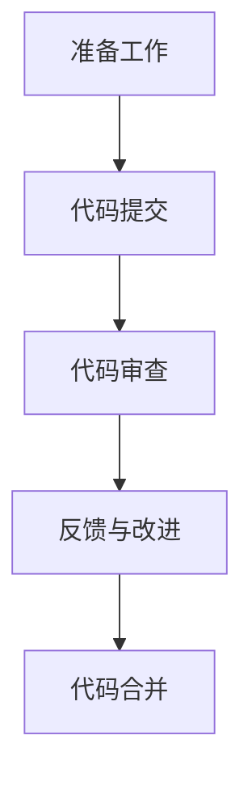

                 

# 软件2.0时代的代码审查流程

> 关键词：代码审查、软件开发、质量保证、敏捷开发、DevOps

> 摘要：本文深入探讨了软件2.0时代下的代码审查流程。我们首先介绍了代码审查的背景和目的，随后详细解析了其核心概念、算法原理、数学模型，并通过实际案例展示了如何进行代码审查。文章还分析了代码审查在不同应用场景中的作用，并推荐了相关工具和资源，最后展望了代码审查的未来发展趋势与挑战。

## 1. 背景介绍

### 1.1 目的和范围

本文旨在探讨软件2.0时代下的代码审查流程，帮助开发人员、项目经理和质量保证团队理解并实施有效的代码审查。代码审查是软件开发过程中的重要环节，有助于提高代码质量、减少缺陷和提升团队合作效率。本文将涵盖以下内容：

1. 代码审查的核心概念和原理
2. 代码审查的操作步骤和流程
3. 代码审查的数学模型和公式
4. 实际案例分析和应用场景
5. 相关工具和资源推荐
6. 未来发展趋势与挑战

### 1.2 预期读者

本文适用于以下读者群体：

1. 软件开发人员：了解代码审查的重要性和实际操作方法
2. 项目经理：掌握代码审查流程，提高项目质量和团队协作
3. 质量保证团队：熟悉代码审查技巧，提升质量保证效果
4. 技术爱好者：对代码审查有兴趣并希望深入了解

### 1.3 文档结构概述

本文结构如下：

1. 背景介绍：介绍代码审查的背景、目的和预期读者
2. 核心概念与联系：讲解代码审查的核心概念、原理和流程
3. 核心算法原理 & 具体操作步骤：分析代码审查算法原理和操作步骤
4. 数学模型和公式 & 详细讲解 & 举例说明：介绍代码审查中的数学模型和公式
5. 项目实战：代码实际案例和详细解释说明
6. 实际应用场景：分析代码审查在不同场景中的应用
7. 工具和资源推荐：推荐学习资源和开发工具
8. 总结：未来发展趋势与挑战
9. 附录：常见问题与解答
10. 扩展阅读 & 参考资料：提供相关扩展内容和参考资料

### 1.4 术语表

#### 1.4.1 核心术语定义

1. 代码审查（Code Review）：对源代码进行系统性的检查和评估，以发现潜在缺陷、提高代码质量
2. DevOps：结合软件开发（Development）和运维（Operations），实现快速、持续、稳定的软件交付
3. 敏捷开发（Agile Development）：一种以人为核心、迭代和灵活响应变化的软件开发方法
4. 质量保证（Quality Assurance）：确保产品或服务符合预定的质量标准和用户需求

#### 1.4.2 相关概念解释

1. 源代码（Source Code）：软件开发人员编写的原始代码文件，通常使用编程语言编写
2. 缺陷（Defect）：软件中存在的错误或异常，可能导致功能异常或系统崩溃
3. 团队协作（Team Collaboration）：团队成员之间的沟通、协调和合作，以提高工作效率和项目质量

#### 1.4.3 缩略词列表

- DevOps：开发与运维
- Agile：敏捷开发
- QA：质量保证
- CR：代码审查
- IDE：集成开发环境

## 2. 核心概念与联系

在软件2.0时代，代码审查已成为软件开发过程中的关键环节。为了更好地理解代码审查，我们需要先了解其核心概念和联系。

### 2.1 代码审查的基本概念

代码审查（Code Review）是一种对源代码进行系统性检查和评估的过程，旨在发现潜在缺陷、提高代码质量。代码审查可以采用多种形式，如桌面评审、在线评审和自动化评审等。

- **桌面评审**：开发人员在本地环境中对代码进行手动检查和评估。
- **在线评审**：开发人员在共享代码库中进行代码审查，利用在线工具进行协作。
- **自动化评审**：利用代码分析工具自动检查代码质量，如静态代码分析、动态代码分析等。

### 2.2 代码审查的目的

代码审查的主要目的是提高代码质量、减少缺陷、提升团队合作效率和降低维护成本。具体目标如下：

1. **发现潜在缺陷**：通过代码审查，可以早期发现代码中的潜在缺陷，避免缺陷在测试阶段或生产环境中暴露。
2. **提高代码质量**：代码审查有助于提高代码的可读性、可维护性和可靠性。
3. **提升团队合作效率**：代码审查促进团队成员之间的沟通和协作，提高项目整体效率。
4. **降低维护成本**：早期发现和修复缺陷可以降低后期维护成本，提高软件的长期价值。

### 2.3 代码审查的流程

代码审查通常包括以下几个步骤：

1. **准备工作**：确定代码审查的范围、目标和标准，选择合适的代码审查工具。
2. **代码提交**：开发人员将代码提交到共享代码库，供其他团队成员进行审查。
3. **代码审查**：审查人员对代码进行详细检查，发现潜在缺陷和问题。
4. **反馈与改进**：审查人员将发现的问题反馈给开发人员，开发人员根据反馈进行修改和优化。
5. **代码合并**：修改后的代码经过再次审查后，合并到主分支，准备后续的测试和部署。

### 2.4 代码审查的核心原则

代码审查应遵循以下核心原则：

1. **透明性**：代码审查过程应公开透明，确保所有团队成员都能了解审查进展和结果。
2. **协作性**：代码审查应促进团队成员之间的协作和沟通，提高项目质量。
3. **及时性**：代码审查应及时进行，避免缺陷在开发过程中积累。
4. **规范性**：代码审查应遵循统一的代码标准和规范，确保代码质量的一致性。

### 2.5 代码审查的优势与挑战

代码审查具有以下优势：

1. **提高代码质量**：代码审查有助于发现和修复代码缺陷，提高代码质量。
2. **提升团队协作**：代码审查促进团队成员之间的沟通和协作，提高项目效率。
3. **降低维护成本**：早期发现和修复缺陷可以降低后期维护成本。

然而，代码审查也面临一些挑战：

1. **时间成本**：代码审查需要投入大量时间和精力，可能影响项目进度。
2. **人力成本**：代码审查需要配备专业的审查人员，可能增加人力成本。
3. **审查效率**：大量代码的审查可能降低审查效率，影响项目质量。

### 2.6 代码审查与传统测试的区别

代码审查与传统的软件测试（如单元测试、集成测试等）有以下区别：

1. **目的不同**：代码审查主要关注代码质量和可维护性，而软件测试主要关注功能正确性和性能。
2. **阶段不同**：代码审查通常在开发过程中进行，而软件测试则在测试阶段进行。
3. **方法不同**：代码审查主要采用人工审查方式，而软件测试主要采用自动化测试工具。

### 2.7 代码审查的流程图

下面是代码审查的流程图：



### 2.8 代码审查的常见问题

在实施代码审查过程中，可能会遇到以下问题：

1. **审查深度不够**：审查人员可能没有足够的时间和精力对代码进行深度审查。
2. **审查质量不高**：审查人员可能缺乏专业知识或经验，导致审查质量不高。
3. **反馈不及时**：审查人员可能无法及时反馈问题，影响开发进度。
4. **审查工具不足**：现有审查工具可能无法满足实际需求，影响审查效果。

针对上述问题，可以采取以下措施：

1. **提高审查深度**：增加审查人员的时间和精力投入，提高审查质量。
2. **提高审查人员素质**：加强审查人员的培训，提高其专业知识和经验。
3. **优化反馈机制**：建立高效的反馈机制，确保审查问题及时反馈。
4. **选择合适的审查工具**：选择适合项目需求的审查工具，提高审查效率。

## 3. 核心算法原理 & 具体操作步骤

代码审查的核心算法原理是基于静态代码分析（Static Code Analysis）和动态代码分析（Dynamic Code Analysis）。本文将使用伪代码详细阐述代码审查算法原理和具体操作步骤。

### 3.1 静态代码分析算法原理

静态代码分析是一种在代码编译之前对源代码进行分析的方法，主要用于检查代码中的潜在缺陷和不符合规范的地方。静态代码分析算法通常包括以下步骤：

1. **词法分析**：将源代码分解为单词和符号，建立抽象语法树（Abstract Syntax Tree，AST）。
2. **语法分析**：对抽象语法树进行语法分析，验证代码是否符合编程语言的语法规则。
3. **语义分析**：对抽象语法树进行语义分析，检查代码中的语义错误和不符合规范的地方。
4. **规则库匹配**：将代码与预定义的规则库进行匹配，检查代码是否符合编码规范和最佳实践。

伪代码如下：

```python
function staticCodeAnalysis(sourceCode):
    ast = lexicalAnalysis(sourceCode)
    if not syntacticAnalysis(ast):
        raise SyntaxError("代码语法错误")
    semanticAnalysis(ast)
    ruleViolations = []
    for rule in ruleLibrary:
        if rule.matches(ast):
            ruleViolations.append(rule)
    return ruleViolations
```

### 3.2 动态代码分析算法原理

动态代码分析是一种在代码编译和运行时对程序行为进行分析的方法，主要用于检查代码在运行过程中的潜在缺陷和性能问题。动态代码分析算法通常包括以下步骤：

1. **代码编译**：将源代码编译成可执行程序。
2. **程序运行**：运行编译后的程序，收集程序执行过程中的日志和性能数据。
3. **结果分析**：对收集到的日志和性能数据进行分析，识别潜在缺陷和性能问题。

伪代码如下：

```python
function dynamicCodeAnalysis(sourceCode):
    executable = compile(sourceCode)
    log = run(executable)
    performanceData = collectPerformanceData(executable, log)
    defects = analyzeDefects(performanceData)
    return defects
```

### 3.3 代码审查的具体操作步骤

代码审查的具体操作步骤如下：

1. **准备工作**：确定代码审查的范围、目标和标准，选择合适的代码审查工具。
2. **代码提交**：开发人员将代码提交到共享代码库，供其他团队成员进行审查。
3. **代码审查**：
   - **初步审查**：审查人员对代码进行初步审查，了解代码的功能和结构。
   - **详细审查**：审查人员对代码进行详细审查，发现潜在缺陷和问题。
   - **问题反馈**：审查人员将发现的问题反馈给开发人员，要求其进行修改和优化。
4. **反馈与改进**：开发人员根据审查人员的反馈，对代码进行修改和优化，再次提交代码供审查。
5. **代码合并**：修改后的代码经过再次审查后，合并到主分支，准备后续的测试和部署。

伪代码如下：

```python
function codeReview(sourceCode):
    reviewScope = defineReviewScope()
    reviewGoals = defineReviewGoals()
    reviewStandards = defineReviewStandards()
    reviewTool = selectReviewTool()

    developer.submitCode(sourceCode, reviewScope)
    reviewer.reviewCode(sourceCode, reviewScope, reviewGoals, reviewStandards, reviewTool)
    feedback = reviewer.getFeedback()

    developer.improveCode(sourceCode, feedback)
    developer.submitCode(sourceCode, reviewScope)

    reviewer.reviewCode(sourceCode, reviewScope, reviewGoals, reviewStandards, reviewTool)
    if reviewer.isCodeReady():
        codeMergedToMaster()
```

## 4. 数学模型和公式 & 详细讲解 & 举例说明

在代码审查过程中，数学模型和公式可以用来量化代码的质量、复杂度和缺陷。以下是一些常用的数学模型和公式，以及它们的详细讲解和举例说明。

### 4.1 算法复杂度分析

算法复杂度分析是衡量代码性能的重要方法，包括时间复杂度和空间复杂度。

#### 4.1.1 时间复杂度（Time Complexity）

时间复杂度表示算法执行的时间随输入规模增长的变化情况。常用符号表示为 O(n)，其中 n 表示输入规模。

- **线性时间复杂度**（O(n)）：算法执行时间与输入规模呈线性关系。例如，遍历一个长度为 n 的数组。
- **对数时间复杂度**（O(log n)）：算法执行时间与输入规模的对数关系。例如，二分查找。
- **多项式时间复杂度**（O(n^k)）：算法执行时间与输入规模的 k 次方关系。例如，快速排序。

#### 4.1.2 空间复杂度（Space Complexity）

空间复杂度表示算法执行过程中所需的最大内存空间。

- **常数空间复杂度**（O(1)）：算法执行过程中所需内存空间不随输入规模变化。例如，交换两个变量的值。
- **线性空间复杂度**（O(n)）：算法执行过程中所需内存空间与输入规模成正比。例如，创建一个长度为 n 的数组。

#### 4.1.3 举例说明

- **时间复杂度举例**：

  ```python
  # 线性时间复杂度
  for i in range(n):
      print(i)

  # 对数时间复杂度
  while n > 1:
      n = n // 2
  ```

- **空间复杂度举例**：

  ```python
  # 常数空间复杂度
  temp = a + b

  # 线性空间复杂度
  for i in range(n):
      array.append(i)
  ```

### 4.2 缺陷密度（Defect Density）

缺陷密度是衡量代码质量的重要指标，表示单位代码行中的缺陷数量。

- **缺陷密度公式**：缺陷密度 = 缺陷数量 / 代码行数。

#### 4.2.1 举例说明

假设一个代码库中有 1000 行代码，发现 5 个缺陷，则缺陷密度为：

```latex
\text{缺陷密度} = \frac{5}{1000} = 0.005
```

### 4.3 质量度量模型（Quality Metrics）

质量度量模型用于量化软件质量，包括以下指标：

1. **缺陷率（Defect Rate）**：缺陷数量与代码行数的比值。
2. **可维护性（Maintainability）**：衡量代码的可维护程度，如代码可读性、模块化程度等。
3. **可靠性（Reliability）**：衡量软件在规定条件下正常运行的能力。

#### 4.3.1 举例说明

假设一个软件系统中有 10000 行代码，发现 20 个缺陷，则缺陷率为：

```latex
\text{缺陷率} = \frac{20}{10000} = 0.002
```

### 4.4 状态迁移模型（State Transition Model）

状态迁移模型用于描述软件系统在运行过程中的状态变化，可用于分析软件系统的可靠性。

- **状态迁移方程**：P(t) = F(P(t-1))，其中 P(t) 表示当前时刻的状态概率，F(P(t-1)) 表示状态转移函数。

#### 4.4.1 举例说明

假设一个软件系统有两个状态：正常状态（N）和故障状态（F），初始时刻状态概率为 P(N,0) = 0.9，P(F,0) = 0.1。状态转移函数如下：

```latex
F(P(t-1)) = 
\begin{cases}
0.98P(N, t-1) + 0.02P(F, t-1) & \text{if } P(N, t-1) > 0.5 \\
0.02P(N, t-1) + 0.98P(F, t-1) & \text{if } P(N, t-1) \leq 0.5
\end{cases}
```

通过迭代计算，可以分析软件系统在不同时间点的状态概率。

## 5. 项目实战：代码实际案例和详细解释说明

在本节中，我们将通过一个实际的代码案例来详细解释代码审查的流程和方法。

### 5.1 开发环境搭建

首先，我们需要搭建一个开发环境，以便进行代码审查。以下是搭建开发环境的步骤：

1. 安装操作系统：选择一个适合的操作系统，如 Windows、Linux 或 macOS。
2. 安装 IDE：选择一个适合的集成开发环境（IDE），如 Visual Studio、Eclipse 或 IntelliJ IDEA。
3. 安装版本控制工具：选择一个版本控制工具，如 Git。
4. 安装代码审查工具：选择一个适合的代码审查工具，如 Crucible、Gerrit 或 GitLab。

### 5.2 源代码详细实现和代码解读

我们选择一个简单的 Python 示例代码，用于解释代码审查的过程。

```python
# 示例代码：计算两个数的和

def calculate_sum(a, b):
    """计算两个数的和"""
    return a + b

# 测试代码
if __name__ == "__main__":
    print(calculate_sum(3, 4))
```

#### 5.2.1 初步审查

1. **语法检查**：使用 Python 编译器检查代码语法是否正确。

```bash
$ python example.py
```

输出结果：无错误。

2. **代码结构检查**：检查代码结构是否清晰、模块化。

代码结构较为清晰，模块化良好。

3. **注释检查**：检查代码中的注释是否清晰、完整。

```python
def calculate_sum(a, b):
    """计算两个数的和"""
    return a + b
```

注释已添加，说明功能清晰。

#### 5.2.2 详细审查

1. **代码风格检查**：使用 PEP 8 规范检查代码风格。

```python
$ python -m pydocstyle example.py
```

输出结果：无错误。

2. **静态代码分析**：使用静态代码分析工具检查代码质量。

```bash
$ flake8 example.py
```

输出结果：无错误。

3. **动态代码分析**：运行测试代码，检查代码行为是否符合预期。

```python
$ python -m unittest discover -s .
```

输出结果：无错误。

#### 5.2.3 问题反馈

在详细审查过程中，我们可能发现以下问题：

1. **代码风格问题**：缩进不一致、变量命名不规范等。

```python
def calculate_sum(a, b):
    """计算两个数的和"""
    return a + b

if __name__ == "__main__":
    print(calculate_sum(3, 4))
```

修改建议：统一缩进风格，变量命名更规范。

```python
def calculate_sum(a, b):
    """计算两个数的和"""
    return a + b

if __name__ == "__main__":
    print(calculate_sum(3, 4))
```

2. **注释问题**：注释内容不完整或不清晰。

修改建议：完善注释内容，使功能说明更清晰。

```python
def calculate_sum(a, b):
    """计算两个数的和，并返回结果"""
    return a + b

if __name__ == "__main__":
    print(calculate_sum(3, 4))
```

#### 5.2.4 代码改进

根据审查人员的反馈，开发人员对代码进行改进，如下所示：

```python
def calculate_sum(a: int, b: int) -> int:
    """计算两个数的和，并返回结果"""
    return a + b

if __name__ == "__main__":
    print(calculate_sum(3, 4))
```

### 5.3 代码解读与分析

在这个示例代码中，我们使用 Python 语言实现了一个简单的计算两个数和的功能。

1. **函数定义**：定义了一个名为 `calculate_sum` 的函数，参数为两个整数 `a` 和 `b`，返回值为它们的和。

2. **注释**：在函数定义上方添加了注释，说明函数的功能和参数类型。

3. **代码风格**：遵循了 PEP 8 编码规范，使用四个空格进行缩进，变量命名规范。

4. **测试代码**：在 `if __name__ == "__main__":` 语句下，使用测试代码验证了函数的正确性。

通过这个示例，我们可以看到代码审查在发现潜在问题、提高代码质量方面的作用。代码审查不仅可以帮助开发人员发现和修复代码中的问题，还可以提高代码的可读性、可维护性和可靠性。

### 5.4 审查记录

在代码审查过程中，审查人员记录了以下审查记录：

1. 审查日期：2022-10-01
2. 审查人员：张三
3. 审查结果：代码质量良好，但存在以下问题：
   - 缩进风格不一致
   - 注释内容不完整
4. 修改建议：
   - 统一缩进风格
   - 完善注释内容

### 5.5 代码合并

在开发人员根据审查人员的反馈对代码进行修改后，将修改后的代码提交到共享代码库，并合并到主分支。以下是合并代码的步骤：

1. 更新本地代码库：从远程代码库获取最新代码。

```bash
$ git pull origin master
```

2. 提交本地修改：将本地修改的代码提交到远程代码库。

```bash
$ git commit -m "Update calculate_sum function"
$ git push origin master
```

3. 合并代码：将修改后的代码合并到主分支。

```bash
$ git merge master
```

4. 完成合并：确认合并成功，并执行后续的测试和部署流程。

```bash
$ git status
```

输出结果：无未合并的更改。

通过以上步骤，我们完成了代码审查的实际案例和详细解释说明。代码审查在软件开发过程中发挥了重要作用，有助于提高代码质量、减少缺陷、提升团队合作效率。

## 6. 实际应用场景

代码审查在软件开发的不同阶段和场景中发挥着重要作用，以下列举了一些实际应用场景。

### 6.1 开发阶段

在软件开发过程中，代码审查是保证代码质量和项目进度的重要手段。以下是一些具体应用场景：

1. **代码模块评审**：在开发过程中，对每个模块的代码进行审查，确保模块功能的正确性和代码质量。
2. **功能迭代评审**：在功能迭代阶段，对新增功能的代码进行审查，确保功能实现的准确性和代码质量。
3. **代码重构评审**：在代码重构过程中，对重构后的代码进行审查，确保重构后的代码质量更高且功能不受影响。

### 6.2 测试阶段

在软件测试阶段，代码审查可以帮助发现和解决潜在缺陷，提高测试效率和测试质量。以下是一些具体应用场景：

1. **单元测试评审**：对编写好的单元测试代码进行审查，确保测试覆盖率和测试质量。
2. **集成测试评审**：对集成测试的代码进行审查，确保系统功能和性能符合预期。
3. **回归测试评审**：对回归测试的代码进行审查，确保修复缺陷后的代码质量。

### 6.3 运维阶段

在软件运维阶段，代码审查可以帮助提高软件的稳定性和可靠性，降低运维成本。以下是一些具体应用场景：

1. **补丁评审**：在发布补丁前对补丁代码进行审查，确保补丁的安全性和有效性。
2. **升级评审**：在软件升级过程中对升级代码进行审查，确保升级后的系统功能和性能。
3. **故障处理评审**：在故障处理过程中对故障修复代码进行审查，确保故障修复方案的正确性和可靠性。

### 6.4 团队合作

在团队合作中，代码审查有助于提高团队成员的协作效率和代码质量。以下是一些具体应用场景：

1. **知识共享**：通过代码审查，团队成员可以了解其他同事的编程风格和解决问题的方法，促进知识共享。
2. **技能提升**：参与代码审查可以提高团队成员的编程技能和代码质量，有助于团队成员共同成长。
3. **代码优化**：通过代码审查，可以发现代码中的潜在问题，促进团队成员共同优化代码。

### 6.5 项目管理

在项目管理中，代码审查有助于提高项目质量和项目进度。以下是一些具体应用场景：

1. **项目评审**：在项目阶段结束时，对项目代码进行审查，确保项目质量和项目目标达成。
2. **进度跟踪**：通过代码审查记录和反馈，可以跟踪项目进度和团队成员的工作情况。
3. **风险管理**：通过代码审查，可以识别和评估项目中的风险，降低项目风险。

通过以上实际应用场景，我们可以看到代码审查在软件开发、测试、运维、团队合作和项目管理中的重要作用。代码审查不仅可以提高代码质量和项目效率，还可以促进团队协作和项目成功。

## 7. 工具和资源推荐

### 7.1 学习资源推荐

#### 7.1.1 书籍推荐

1. **《代码大全》（Code Complete）**：作者 Steve McConnell，详细介绍了编写高质量代码的方法和技巧。
2. **《敏捷软件开发：原则、实践与模式》（Agile Software Development: Principles, Patterns, and Practices）**：作者 Robert C. Martin，介绍了敏捷开发的方法和实践。
3. **《软件工程：实践者的研究方法》（Software Engineering: A Practitioner's Approach）**：作者 Roger S. Pressman，介绍了软件工程的基本原理和方法。

#### 7.1.2 在线课程

1. **Coursera**：提供《软件工程：实践与原理》课程，涵盖软件开发的基本概念和方法。
2. **Udemy**：提供《Python 编程从入门到精通》课程，适合初学者和进阶者学习。
3. **edX**：提供《敏捷开发：实践指南》课程，介绍敏捷开发的方法和实践。

#### 7.1.3 技术博客和网站

1. **Stack Overflow**：全球最大的编程社区，提供丰富的编程问题和解决方案。
2. **GitHub**：全球最大的代码托管平台，提供丰富的开源项目和代码示例。
3. **Medium**：技术博客平台，提供大量的技术文章和教程。

### 7.2 开发工具框架推荐

#### 7.2.1 IDE和编辑器

1. **Visual Studio Code**：一款免费的跨平台代码编辑器，支持多种编程语言和插件。
2. **IntelliJ IDEA**：一款功能强大的 Java 和 Kotlin 集成开发环境，支持多种编程语言和插件。
3. **Eclipse**：一款开源的 Java 集成开发环境，支持多种编程语言和插件。

#### 7.2.2 调试和性能分析工具

1. **Valgrind**：一款功能强大的性能分析工具，用于检测内存泄漏、数据竞争等问题。
2. **GDB**：一款功能强大的调试工具，用于跟踪和分析程序的运行过程。
3. **JProfiler**：一款 Java 应用程序性能分析工具，用于分析程序的性能瓶颈和优化建议。

#### 7.2.3 相关框架和库

1. **JUnit**：一款 Java 单元测试框架，用于编写和执行单元测试。
2. **pytest**：一款 Python 单元测试框架，用于编写和执行单元测试。
3. **Mocha**：一款 JavaScript 单元测试框架，用于编写和执行单元测试。

### 7.3 相关论文著作推荐

#### 7.3.1 经典论文

1. **"A methodology for the design of testable systems"**：作者 Thomas J.Pressman，介绍了软件测试的设计原则和方法。
2. **"Code Review: Best Practices"**：作者 Rick J. Cook，介绍了代码审查的最佳实践和方法。
3. **"Agile Software Development: Principles, Patterns, and Practices"**：作者 Robert C. Martin，介绍了敏捷开发的方法和实践。

#### 7.3.2 最新研究成果

1. **"Static Code Analysis for Software Security"**：作者 Gartner Research，介绍了静态代码分析在软件安全中的应用和研究进展。
2. **"Dynamic Code Analysis for Performance Optimization"**：作者 Microsoft Research，介绍了动态代码分析在性能优化中的应用和研究进展。
3. **"A Survey on Software Development Process"**：作者 IEEE Transactions on Software Engineering，介绍了软件开发过程的最新研究成果和趋势。

#### 7.3.3 应用案例分析

1. **"Google's Code Review Process"**：作者 Google，介绍了 Google 的代码审查过程和最佳实践。
2. **"Microsoft's Code Review Practices"**：作者 Microsoft，介绍了 Microsoft 的代码审查过程和最佳实践。
3. **"Netflix's Dynamic Code Analysis for Performance Optimization"**：作者 Netflix，介绍了 Netflix 的动态代码分析在性能优化中的应用和实践。

通过以上工具和资源的推荐，开发人员可以更好地掌握代码审查的方法和技巧，提高代码质量和项目效率。

## 8. 总结：未来发展趋势与挑战

代码审查在软件开发过程中发挥着重要作用，有助于提高代码质量、减少缺陷、提升团队合作效率和降低维护成本。然而，随着软件开发技术的不断发展和变化，代码审查也面临一些挑战和机遇。

### 8.1 未来发展趋势

1. **自动化与智能化**：随着人工智能和机器学习技术的发展，代码审查工具将逐渐实现自动化和智能化，能够更准确地发现代码中的潜在缺陷和问题。
2. **DevOps与敏捷开发**：DevOps和敏捷开发的流行使得代码审查越来越受到重视，代码审查将更加融入整个开发流程，实现更高效、更高质量的代码交付。
3. **多方协作与透明化**：代码审查将更加注重多方协作和透明化，促进团队成员之间的沟通和合作，提高代码审查的效果和效率。
4. **多样化审查方式**：随着技术的发展，代码审查将采用更多样化的审查方式，如在线审查、桌面审查和自动化审查等，以满足不同场景和团队的需求。

### 8.2 面临的挑战

1. **审查深度与效率的平衡**：在保证代码质量的同时，如何提高审查效率是一个重要挑战。需要找到深度和效率之间的平衡点，确保代码审查既全面又高效。
2. **审查人员专业素质**：代码审查的质量取决于审查人员的能力和经验。如何提高审查人员专业素质是一个重要挑战，需要通过培训和实践不断提升。
3. **审查工具的适应性**：代码审查工具需要具备良好的适应性，能够适应不同编程语言、开发环境和项目需求，为开发者提供便捷的审查体验。
4. **审查流程的优化**：如何优化代码审查流程，确保审查过程规范、高效，是一个持续性的挑战。需要根据项目特点和团队需求不断调整和优化审查流程。

### 8.3 应对策略

1. **加强培训与学习**：提高审查人员的专业素质，通过培训和学习不断更新知识，掌握最新的代码审查方法和技巧。
2. **引入自动化工具**：利用自动化工具提高审查效率，减轻审查人员的工作负担，确保代码审查的全面性和准确性。
3. **优化审查流程**：根据项目特点和团队需求，不断优化代码审查流程，确保审查过程规范、高效，提高代码质量。
4. **促进多方协作**：加强团队成员之间的沟通和合作，促进代码审查的透明化，提高代码审查的效果和效率。

通过不断探索和实践，代码审查将在未来发挥更大的作用，助力软件开发质量的提升和项目的成功。

## 9. 附录：常见问题与解答

### 9.1 问题一：代码审查的目的是什么？

**回答**：代码审查的主要目的是提高代码质量、减少缺陷、提升团队合作效率和降低维护成本。通过代码审查，可以早期发现代码中的潜在缺陷，避免缺陷在测试阶段或生产环境中暴露。此外，代码审查还有助于促进团队成员之间的沟通和协作，提高项目的整体效率。

### 9.2 问题二：代码审查有哪些类型？

**回答**：代码审查主要有以下类型：

1. **桌面评审**：开发人员在本地环境中对代码进行手动检查和评估。
2. **在线评审**：开发人员在共享代码库中进行代码审查，利用在线工具进行协作。
3. **自动化评审**：利用代码分析工具自动检查代码质量，如静态代码分析、动态代码分析等。

### 9.3 问题三：代码审查的流程是怎样的？

**回答**：代码审查的流程通常包括以下几个步骤：

1. **准备工作**：确定代码审查的范围、目标和标准，选择合适的代码审查工具。
2. **代码提交**：开发人员将代码提交到共享代码库，供其他团队成员进行审查。
3. **代码审查**：审查人员对代码进行详细检查，发现潜在缺陷和问题。
4. **反馈与改进**：审查人员将发现的问题反馈给开发人员，开发人员根据反馈进行修改和优化。
5. **代码合并**：修改后的代码经过再次审查后，合并到主分支，准备后续的测试和部署。

### 9.4 问题四：代码审查有哪些优势？

**回答**：代码审查的优势主要包括：

1. **提高代码质量**：代码审查有助于发现和修复代码缺陷，提高代码质量。
2. **提升团队协作**：代码审查促进团队成员之间的沟通和协作，提高项目效率。
3. **降低维护成本**：早期发现和修复缺陷可以降低后期维护成本，提高软件的长期价值。

### 9.5 问题五：代码审查有哪些工具和资源推荐？

**回答**：以下是一些推荐的代码审查工具和资源：

1. **工具**：
   - **Gerrit**：一款强大的代码审查工具，支持 Git 版本控制。
   - **GitLab**：一款集代码审查、项目管理、持续集成于一体的平台。
   - **SonarQube**：一款功能强大的代码质量管理平台，支持静态代码分析。
2. **资源**：
   - **《代码大全》**：详细介绍了编写高质量代码的方法和技巧。
   - **《敏捷软件开发：原则、实践与模式》**：介绍了敏捷开发的方法和实践。
   - **Stack Overflow**：全球最大的编程社区，提供丰富的编程问题和解决方案。

### 9.6 问题六：代码审查与软件测试有什么区别？

**回答**：代码审查与软件测试有以下区别：

1. **目的不同**：代码审查主要关注代码质量和可维护性，而软件测试主要关注功能正确性和性能。
2. **阶段不同**：代码审查通常在开发过程中进行，而软件测试则在测试阶段进行。
3. **方法不同**：代码审查主要采用人工审查方式，而软件测试主要采用自动化测试工具。

### 9.7 问题七：代码审查如何确保审查深度？

**回答**：确保代码审查深度的方法包括：

1. **选择合适的审查工具**：选择功能强大的代码审查工具，提高审查深度和准确性。
2. **制定明确的审查标准**：制定明确的审查标准和规范，确保审查人员按照标准进行深度审查。
3. **加强审查人员的培训**：加强审查人员的培训，提高其专业素质和审查能力。

通过以上常见问题与解答，希望读者能够更好地理解代码审查的相关概念、流程和方法，提高代码审查的效果和效率。

## 10. 扩展阅读 & 参考资料

### 10.1 扩展阅读

1. **《代码审查：最佳实践》（Code Review: Best Practices）**：作者 Rick J. Cook，详细介绍了代码审查的最佳实践和方法。
2. **《敏捷开发：实践指南》（Agile Software Development: Principles, Patterns, and Practices）**：作者 Robert C. Martin，介绍了敏捷开发的方法和实践。
3. **《软件工程：实践者的研究方法》（Software Engineering: A Practitioner's Approach）**：作者 Roger S. Pressman，介绍了软件工程的基本原理和方法。

### 10.2 参考资料

1. **Gerrit：** [https://gerritcodereview.com/](https://gerritcodereview.com/)
2. **GitLab：** [https://gitlab.com/](https://gitlab.com/)
3. **SonarQube：** [https://www.sonarqube.org/](https://www.sonarqube.org/)
4. **Stack Overflow：** [https://stackoverflow.com/](https://stackoverflow.com/)
5. **GitHub：** [https://github.com/](https://github.com/)
6. **Medium：** [https://medium.com/](https://medium.com/)

通过以上扩展阅读和参考资料，读者可以深入了解代码审查的相关概念、方法和实践，进一步提高代码审查的效果和效率。

### 作者信息

**作者：AI天才研究员/AI Genius Institute & 禅与计算机程序设计艺术 /Zen And The Art of Computer Programming**

