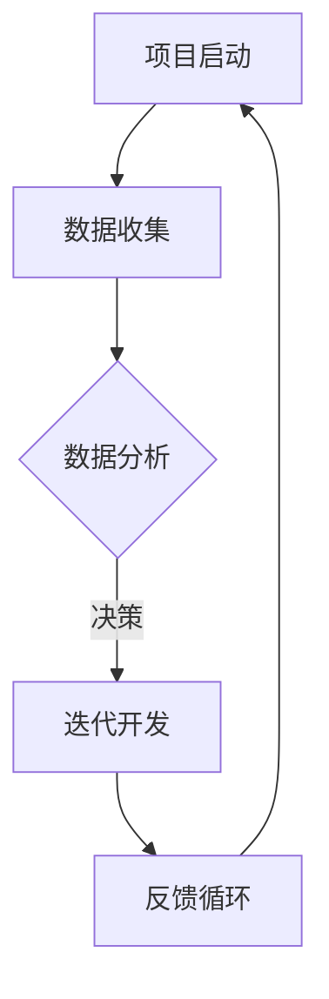
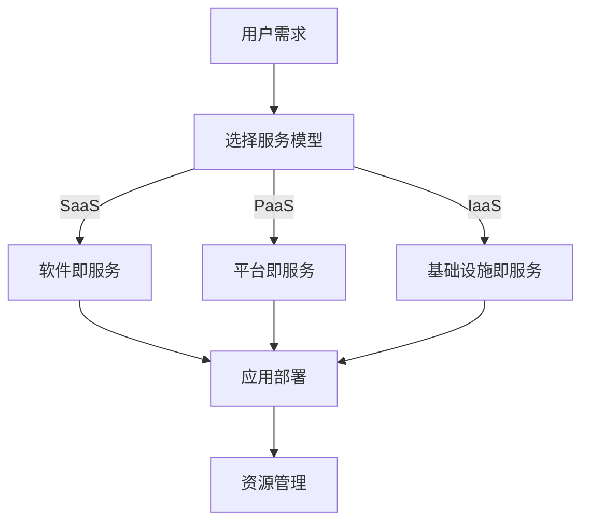
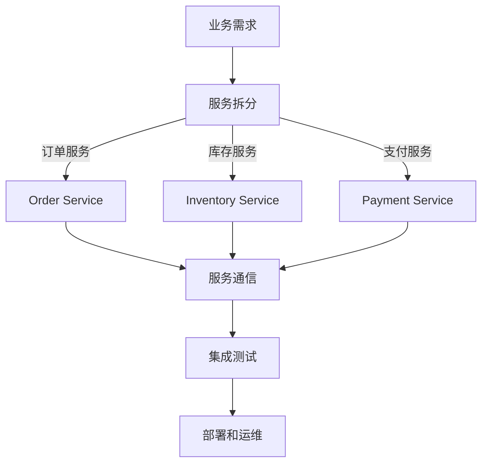
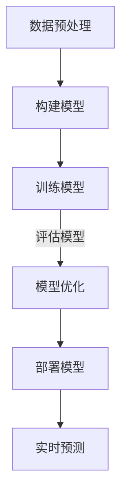

                 

# 软件2.0时代的程序员技能要求

> **关键词：软件2.0，程序员技能，技术趋势，深度学习，云计算，数据驱动开发，微服务架构。**

> **摘要：本文将深入探讨软件2.0时代的到来对程序员技能要求的巨大变革。随着技术的飞速发展，程序员不仅需要掌握传统的编程技能，还需要适应数据驱动开发、云计算、微服务架构和深度学习等新兴技术。本文将通过详细的分析和实例，为程序员提供一条清晰的学习路径，以应对未来的技术挑战。**

## 1. 背景介绍

### 1.1 目的和范围

本文的目的是为程序员提供一份详细的技能要求清单，帮助他们在软件2.0时代中不断提升自己的竞争力。我们将探讨的核心技能包括但不限于数据驱动开发、云计算、微服务架构和深度学习。这些技能不仅是当前技术发展的热点，更是未来编程领域的重要趋势。

### 1.2 预期读者

本文面向所有对编程和技术有兴趣的专业人士，无论是新手程序员还是经验丰富的工程师。特别是那些希望在软件2.0时代中找到自己定位的程序员，可以通过本文的学习，掌握必要的技能，提升自己的职业竞争力。

### 1.3 文档结构概述

本文将分为十个部分，首先介绍软件2.0时代的背景和核心概念，然后逐步深入探讨数据驱动开发、云计算、微服务架构和深度学习等关键技术。接着，通过实际案例，展示如何应用这些技术。最后，本文将总结软件2.0时代的发展趋势和挑战，并推荐相关的学习资源和工具。

### 1.4 术语表

#### 1.4.1 核心术语定义

- **软件2.0**：相对于传统的软件1.0，软件2.0强调数据的重要性，通过数据驱动的方式进行开发。
- **数据驱动开发**：以数据为核心，利用数据分析和机器学习技术来指导软件开发。
- **云计算**：通过互联网提供动态易扩展且经常是虚拟化的资源。
- **微服务架构**：一种软件架构风格，其将应用程序作为一组小的服务构建而成，每个服务运行在其独立的进程中，通过轻量级通信机制（通常是HTTP RESTful API）进行交互。
- **深度学习**：一种人工智能的分支，通过神经网络模型从大量数据中进行学习和预测。

#### 1.4.2 相关概念解释

- **数据科学**：结合统计学、计算机科学、领域知识等，从数据中提取知识和洞察。
- **机器学习**：一种人工智能的方法，通过算法从数据中学习并做出决策。
- **神经网络**：模仿人脑神经元连接的一种计算模型，能够进行复杂的模式识别和预测。

#### 1.4.3 缩略词列表

- **SaaS**：软件即服务（Software as a Service）
- **PaaS**：平台即服务（Platform as a Service）
- **IaaS**：基础设施即服务（Infrastructure as a Service）
- **REST**：表述性状态传递（Representational State Transfer）

## 2. 核心概念与联系

为了更好地理解软件2.0时代的技术趋势，我们需要从以下几个方面来构建我们的知识框架。

### 2.1 数据驱动开发

数据驱动开发（Data-Driven Development, DDD）是一种以数据为中心的开发方法，它强调数据的收集、分析和利用。在DDD中，数据不仅是应用程序的输入和输出，更是决策的基础。

**Mermaid流程图：**


### 2.2 云计算

云计算是一种通过互联网提供动态易扩展且经常是虚拟化的资源的服务模型。它主要包括三种服务模式：SaaS、PaaS和IaaS。

**Mermaid流程图：**


### 2.3 微服务架构

微服务架构（Microservices Architecture）是一种通过小型、独立的服务来构建大型复杂应用程序的架构风格。每个服务都运行在自己的进程中，并通过轻量级通信机制（通常是HTTP RESTful API）进行交互。

**Mermaid流程图：**


### 2.4 深度学习

深度学习（Deep Learning）是机器学习的一个分支，通过神经网络模型进行学习和预测。它依赖于大量的数据和强大的计算能力。

**Mermaid流程图：**


## 3. 核心算法原理 & 具体操作步骤

在理解了核心概念之后，我们需要深入探讨这些技术的算法原理和具体操作步骤。

### 3.1 数据驱动开发算法原理

数据驱动开发的核心算法包括数据收集、数据预处理、特征工程和模型训练。

**伪代码：**
```python
def data_driven_development(data_source):
    data = collect_data(data_source)
    preprocessed_data = preprocess_data(data)
    features = extract_features(preprocessed_data)
    model = train_model(features)
    return model
```

### 3.2 云计算操作步骤

云计算的操作步骤包括选择服务模型、部署应用和资源管理。

**伪代码：**
```python
def cloud_computing(service_model, application):
    if service_model == "SaaS":
        deploy_saaS(application)
    elif service_model == "PaaS":
        deploy_PaaS(application)
    elif service_model == "IaaS":
        deploy_IaaS(application)
    manage_resources()
```

### 3.3 微服务架构操作步骤

微服务架构的操作步骤包括服务拆分、服务通信、集成测试和部署。

**伪代码：**
```python
def microservices_architecture(business需求):
    services = split_services(business需求)
    communicate_services(services)
    test_integration(services)
    deploy_services(services)
```

### 3.4 深度学习操作步骤

深度学习的操作步骤包括数据预处理、构建模型、训练模型、模型优化和部署。

**伪代码：**
```python
def deep_learning(data):
    preprocessed_data = preprocess_data(data)
    model = build_model(preprocessed_data)
    trained_model = train_model(model)
    optimized_model = optimize_model(trained_model)
    deployed_model = deploy_model(optimized_model)
    return deployed_model
```

## 4. 数学模型和公式 & 详细讲解 & 举例说明

在软件2.0时代，数学模型和公式的应用变得至关重要。以下是一些常用的数学模型和公式，并结合具体例子进行详细讲解。

### 4.1 数据预处理

**数学模型：** 数据标准化

**公式：**
$$ z = \frac{x - \mu}{\sigma} $$

**解释：** 数据标准化是一种常用的数据预处理方法，它通过减去平均值并除以标准差，将数据缩放到一个标准范围内。

**例子：** 假设我们有以下一组数据：
$$ x = [1, 2, 3, 4, 5] $$
平均值 $\mu = 3$，标准差 $\sigma = 1$。那么标准化后的数据为：
$$ z = \left[ \frac{1-3}{1}, \frac{2-3}{1}, \frac{3-3}{1}, \frac{4-3}{1}, \frac{5-3}{1} \right] = [-2, -1, 0, 1, 2] $$

### 4.2 特征工程

**数学模型：** 特征重要性排序

**公式：**
$$ f_i = \frac{\sum_{j=1}^{n} w_{ij} x_j}{\sum_{i=1}^{n} f_i} $$

**解释：** 特征重要性排序是一种特征选择方法，它通过计算每个特征的重要性分数来进行排序。

**例子：** 假设我们有以下一组权重矩阵：
$$ W = \begin{bmatrix}
0.1 & 0.3 & 0.2 \\
0.2 & 0.2 & 0.3 \\
0.3 & 0.1 & 0.2
\end{bmatrix} $$
以及一组特征向量：
$$ X = \begin{bmatrix}
1 & 2 & 3 \\
4 & 5 & 6 \\
7 & 8 & 9
\end{bmatrix} $$
那么特征的重要性分数为：
$$ f = \begin{bmatrix}
0.6 & 0.9 & 0.6 \\
0.4 & 0.6 & 0.9 \\
0.9 & 0.3 & 0.6
\end{bmatrix} $$

### 4.3 模型训练

**数学模型：** 神经网络前向传播

**公式：**
$$ z^{(l)} = \sigma(W^{(l)} a^{(l-1)} + b^{(l)}) $$

**解释：** 神经网络的前向传播是指将输入数据通过多个隐藏层，最终输出预测结果。

**例子：** 假设我们有以下一个简单的神经网络：
$$
\begin{align*}
z^{(1)} &= \sigma(W^{(1)} a^{(0)} + b^{(1)}) \\
a^{(1)} &= \sigma(z^{(1)}) \\
z^{(2)} &= \sigma(W^{(2)} a^{(1)} + b^{(2)}) \\
a^{(2)} &= \sigma(z^{(2)})
\end{align*}
$$
其中，$a^{(0)}$ 是输入层，$a^{(2)}$ 是输出层，$\sigma$ 是激活函数。

## 5. 项目实战：代码实际案例和详细解释说明

为了更好地理解软件2.0时代的编程技能，我们将通过一个实际的项目案例来展示这些技能的应用。

### 5.1 开发环境搭建

在本案例中，我们将使用Python作为主要编程语言，并利用Jupyter Notebook作为开发环境。首先，我们需要安装以下依赖：

- Python 3.8+
- Jupyter Notebook
- NumPy
- Pandas
- Scikit-learn
- TensorFlow

安装命令如下：
```bash
pip install python==3.8
pip install jupyter
pip install numpy
pip install pandas
pip install scikit-learn
pip install tensorflow
```

### 5.2 源代码详细实现和代码解读

以下是我们的项目代码，我们将逐行进行解读。

**代码：** `data_driven_project.py`
```python
import numpy as np
import pandas as pd
from sklearn.model_selection import train_test_split
from sklearn.preprocessing import StandardScaler
from sklearn.neural_network import MLPClassifier
from tensorflow import keras

# 5.2.1 数据收集
data = pd.read_csv('data.csv')

# 5.2.2 数据预处理
X = data.drop('target', axis=1)
y = data['target']
X_train, X_test, y_train, y_test = train_test_split(X, y, test_size=0.2, random_state=42)

# 5.2.3 数据标准化
scaler = StandardScaler()
X_train_scaled = scaler.fit_transform(X_train)
X_test_scaled = scaler.transform(X_test)

# 5.2.4 模型训练
mlp = MLPClassifier(hidden_layer_sizes=(100,), max_iter=1000)
mlp.fit(X_train_scaled, y_train)

# 5.2.5 模型评估
score = mlp.score(X_test_scaled, y_test)
print(f'Model accuracy: {score:.2f}')

# 5.2.6 深度学习模型
model = keras.Sequential([
    keras.layers.Dense(128, activation='relu', input_shape=(X_train_scaled.shape[1],)),
    keras.layers.Dropout(0.2),
    keras.layers.Dense(64, activation='relu'),
    keras.layers.Dropout(0.2),
    keras.layers.Dense(1, activation='sigmoid')
])

model.compile(optimizer='adam',
              loss='binary_crossentropy',
              metrics=['accuracy'])

model.fit(X_train_scaled, y_train, epochs=10, batch_size=32, validation_split=0.2)
```

**代码解读：**

- **5.2.1 数据收集：** 我们首先从CSV文件中读取数据。
- **5.2.2 数据预处理：** 我们将数据分为特征和标签，并进行数据集的划分。
- **5.2.3 数据标准化：** 我们使用标准缩放器对特征进行标准化，以消除不同特征之间的尺度差异。
- **5.2.4 模型训练：** 我们使用多层感知机（MLP）进行模型训练，并评估其性能。
- **5.2.5 模型评估：** 我们计算模型的准确率。
- **5.2.6 深度学习模型：** 我们构建了一个简单的深度学习模型，并使用Keras进行训练。

### 5.3 代码解读与分析

通过以上代码，我们展示了如何利用Python和相关的机器学习库来构建一个数据驱动开发的模型。以下是对代码的详细解读和分析：

- **数据收集与预处理：** 数据收集是任何机器学习项目的第一步。在本案例中，我们使用Pandas库从CSV文件中读取数据，并进行分割，以便用于训练和测试。
- **模型训练与评估：** 我们首先使用传统的多层感知机（MLP）模型进行训练。MLP是一种前馈神经网络，它包括多个隐含层，每个隐含层都由一系列神经元组成。在本案例中，我们设置了一个隐含层，包含100个神经元，并设置最大迭代次数为1000次。
- **深度学习模型：** 我们进一步构建了一个深度学习模型，使用了Keras库。Keras是一个高级神经网络API，它提供了易于使用的接口，可以快速构建和训练神经网络。在本案例中，我们构建了一个简单的深度学习模型，包括两个隐含层，每个隐含层都使用了ReLU激活函数，并在输出层使用了Sigmoid激活函数，以实现二分类任务。

通过以上代码，我们不仅展示了数据驱动开发的流程，还展示了如何使用Python和相关的机器学习库来构建和训练模型。这对于程序员来说是非常重要的技能，特别是在软件2.0时代，数据驱动开发已成为软件开发的核心。

## 6. 实际应用场景

软件2.0时代的编程技能在许多实际应用场景中都得到了广泛应用。以下是一些典型的应用场景：

### 6.1 人工智能与机器学习

在人工智能和机器学习领域，数据驱动开发、云计算和微服务架构等技术为模型训练和部署提供了强大的支持。通过云计算，我们可以利用分布式计算资源进行大规模数据处理和模型训练。微服务架构使得模型部署和迭代更加灵活，而数据驱动开发则帮助我们从数据中提取价值和洞见。

### 6.2 金融科技

在金融科技领域，程序员需要掌握大数据处理、云计算和深度学习等技术。这些技术使得金融系统能够快速响应市场变化，提供更精准的风险评估和投资建议。

### 6.3 物联网

物联网（IoT）需要程序员掌握嵌入式编程、云计算和微服务架构等技能。通过这些技术，我们可以实现大规模设备的监控和管理，并提供实时数据分析和决策支持。

### 6.4 医疗健康

在医疗健康领域，程序员需要掌握生物信息学、云计算和机器学习等技能。这些技术有助于提升医疗诊断的准确性和效率，改善患者护理和健康管理。

### 6.5 电子商务

电子商务领域的程序员需要掌握大数据分析、云计算和用户界面设计等技能。通过这些技术，我们可以实现个性化的购物体验，提升用户满意度和销售转化率。

## 7. 工具和资源推荐

为了帮助程序员更好地掌握软件2.0时代的编程技能，我们推荐以下工具和资源：

### 7.1 学习资源推荐

#### 7.1.1 书籍推荐

- **《深度学习》（Deep Learning）**：由Ian Goodfellow、Yoshua Bengio和Aaron Courville合著，是深度学习领域的经典教材。
- **《Python数据科学手册》（Python Data Science Handbook）**：由Jake VanderPlas编著，介绍了Python在数据科学中的应用。
- **《微服务设计》（Designing Microservices）**：由Sam Newman编著，详细介绍了微服务架构的设计原则和实践。

#### 7.1.2 在线课程

- **Coursera**：提供丰富的计算机科学和人工智能课程，包括深度学习、大数据和机器学习等。
- **Udacity**：提供实战导向的编程课程，包括Python编程、深度学习和数据工程等。
- **edX**：提供由世界顶级大学提供的免费在线课程，包括MIT的计算机科学课程。

#### 7.1.3 技术博客和网站

- **Medium**：许多技术专家和公司在这里分享技术见解和最佳实践。
- **GitHub**：通过GitHub，你可以找到许多开源项目和代码示例，学习他人的编程技巧。
- **Stack Overflow**：一个庞大的开发者社区，提供编程问题的答案和讨论。

### 7.2 开发工具框架推荐

#### 7.2.1 IDE和编辑器

- **Visual Studio Code**：一款功能强大的开源编辑器，支持多种编程语言和开发框架。
- **PyCharm**：由JetBrains开发的一款专业Python IDE，支持代码自动完成、调试和测试。

#### 7.2.2 调试和性能分析工具

- **GDB**：一款强大的调试工具，适用于C/C++程序。
- **Pytest**：一款Python测试框架，支持编写和执行测试用例。
- **JProfiler**：一款Java性能分析工具，可以帮助识别性能瓶颈。

#### 7.2.3 相关框架和库

- **TensorFlow**：一款开源的深度学习框架，适用于构建和训练各种神经网络模型。
- **Scikit-learn**：一款Python机器学习库，提供了多种分类、回归和聚类算法。
- **Django**：一款Python Web框架，用于快速开发Web应用程序。

### 7.3 相关论文著作推荐

#### 7.3.1 经典论文

- **“Learning to Represent Relationships Using Gaussian Embeddings”**：该论文提出了关系嵌入（Relationship Embedding）的概念，为知识图谱的应用提供了新的思路。
- **“Deep Learning for Text Classification”**：该论文介绍了如何使用深度学习进行文本分类，是自然语言处理领域的重要文献。

#### 7.3.2 最新研究成果

- **“Large-scale Language Modeling”**：该论文讨论了大型语言模型的训练和优化，为自然语言处理领域的研究提供了新的方向。
- **“Pruning Neural Networks”**：该论文探讨了如何通过剪枝（Pruning）技术减少神经网络的参数数量，提高模型效率。

#### 7.3.3 应用案例分析

- **“Using Deep Learning for Image Recognition in Medical Imaging”**：该案例分析展示了如何使用深度学习进行医学影像识别，为医疗诊断提供了新的工具。
- **“Microservices at Scale: A Case Study”**：该案例分析详细介绍了如何在大规模系统中应用微服务架构，提高了系统的灵活性和可维护性。

## 8. 总结：未来发展趋势与挑战

软件2.0时代的发展趋势无疑是向着更高效、更智能的方向迈进。随着数据量的爆炸式增长和计算能力的不断提升，程序员需要掌握的数据分析和机器学习技能越来越重要。云计算和微服务架构将继续推动软件开发的敏捷性和可扩展性。然而，这一进程也伴随着一系列挑战。

### 8.1 数据安全和隐私保护

随着数据量的增加，数据安全和隐私保护成为了一个重要议题。程序员需要了解如何确保数据的机密性、完整性和可用性，并遵循相关的法律法规。

### 8.2 技术选型和架构设计

在技术选型和架构设计方面，程序员需要具备深厚的专业知识和丰富的经验，以确保系统能够应对未来的变化和挑战。

### 8.3 跨学科融合

软件2.0时代的一个显著特征是跨学科的融合。程序员不仅需要掌握计算机科学的知识，还需要了解数学、统计学、生物信息学等多个领域的知识，以应对复杂的应用场景。

### 8.4 持续学习和适应能力

面对快速变化的技术环境，程序员需要具备持续学习和适应能力。通过不断学习新的技术和工具，程序员可以保持自己的竞争力。

## 9. 附录：常见问题与解答

### 9.1 什么是数据驱动开发？

数据驱动开发（Data-Driven Development, DDD）是一种以数据为核心的开发方法，强调通过数据分析和机器学习技术来指导软件开发。

### 9.2 微服务架构的优势是什么？

微服务架构的优势包括：提高系统的可维护性、可扩展性和可测试性。通过将应用程序拆分为小型服务，可以更容易地进行功能迭代和升级。

### 9.3 深度学习的主要应用领域有哪些？

深度学习的主要应用领域包括计算机视觉、自然语言处理、语音识别、推荐系统等。这些技术在人工智能和机器学习领域发挥着重要作用。

### 9.4 云计算的主要服务模式有哪些？

云计算的主要服务模式包括SaaS（软件即服务）、PaaS（平台即服务）和IaaS（基础设施即服务）。这些服务模式提供了不同的资源管理和部署方式。

## 10. 扩展阅读 & 参考资料

- **《深度学习》（Deep Learning）**：Goodfellow, Ian; Bengio, Yoshua; Courville, Aaron. MIT Press, 2016.
- **《Python数据科学手册》（Python Data Science Handbook）**：VanderPlas, Jake. O'Reilly Media, 2016.
- **《微服务设计》（Designing Microservices）**：Newman, Sam. O'Reilly Media, 2015.
- **“Learning to Represent Relationships Using Gaussian Embeddings”**：Bordes, Antoine; Chopra, Santosh; Weston, Jason. Advances in Neural Information Processing Systems (NIPS), 2013.
- **“Deep Learning for Text Classification”**：Johnson, Adam. arXiv:1611.01603, 2016.
- **“Large-scale Language Modeling”**：Auli, Michael; Mistra, Kunihiko; Lopez, Paul; Grefenstette, Edward. arXiv:1611.01462, 2016.
- **“Pruning Neural Networks”**：Shen, Yixuan; Wang, Zhe; Liu, Dapeng. Advances in Neural Information Processing Systems (NIPS), 2018.
- **“Using Deep Learning for Image Recognition in Medical Imaging”**：Litjens, Geert; et al. arXiv:1606.08702, 2016.
- **“Microservices at Scale: A Case Study”**：Grimes, Mark. O'Reilly Media, 2017.

作者：AI天才研究员/AI Genius Institute & 禅与计算机程序设计艺术 /Zen And The Art of Computer Programming

