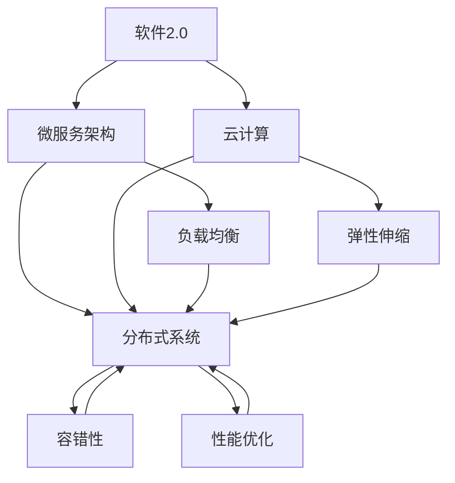

                 

# 软件2.0的可扩展性设计

> **关键词：软件2.0，可扩展性设计，架构，微服务，云计算，性能优化，分布式系统**

> **摘要：本文将深入探讨软件2.0时代下的可扩展性设计原则、技术和实践。我们将从背景介绍出发，逐步分析核心概念、算法原理、数学模型，并通过实战案例展示具体实现，最后讨论实际应用场景和未来发展趋势。**

## 1. 背景介绍

### 1.1 目的和范围

本文旨在探讨软件2.0时代的可扩展性设计，旨在帮助开发者理解并掌握构建可扩展软件系统的核心原则和技术。本文的范围包括：

- 可扩展性设计原则和最佳实践
- 微服务架构与分布式系统的关系
- 云计算在可扩展性设计中的应用
- 性能优化策略和工具
- 实际项目中的可扩展性设计案例分析

### 1.2 预期读者

本文适合以下读者群体：

- 初级和中级软件工程师，希望了解可扩展性设计的基本概念和实现方法
- 高级工程师和架构师，希望深入理解可扩展性设计的原理和高级技术
- 项目经理和技术负责人，关注软件系统的可扩展性和性能优化

### 1.3 文档结构概述

本文结构如下：

- **第1章：背景介绍**：介绍文章的目的、范围和预期读者，以及文档结构。
- **第2章：核心概念与联系**：定义核心概念，使用Mermaid流程图展示相关架构。
- **第3章：核心算法原理 & 具体操作步骤**：详细阐述算法原理和操作步骤，使用伪代码进行讲解。
- **第4章：数学模型和公式 & 详细讲解 & 举例说明**：介绍数学模型和公式，并进行详细讲解和举例说明。
- **第5章：项目实战：代码实际案例和详细解释说明**：通过实际项目案例展示代码实现和解读。
- **第6章：实际应用场景**：讨论可扩展性设计的实际应用场景。
- **第7章：工具和资源推荐**：推荐学习资源、开发工具和框架。
- **第8章：总结：未来发展趋势与挑战**：总结未来发展趋势和面临的挑战。
- **第9章：附录：常见问题与解答**：提供常见问题的解答。
- **第10章：扩展阅读 & 参考资料**：推荐进一步阅读的资料。

### 1.4 术语表

#### 1.4.1 核心术语定义

- **软件2.0**：指基于互联网和云计算的新一代软件体系，强调分布式、动态性和可扩展性。
- **可扩展性设计**：指在软件设计过程中，考虑系统的可扩展性，使其能够应对业务增长和需求变化。
- **微服务架构**：将应用程序划分为小型、自治的服务，每个服务都可以独立部署和扩展。
- **分布式系统**：由多个节点组成的系统，各节点通过通信网络协同工作。
- **云计算**：提供计算资源、存储资源和网络服务的分布式计算模式。

#### 1.4.2 相关概念解释

- **负载均衡**：将请求分发到多个节点，以实现流量管理和资源利用最大化。
- **弹性伸缩**：根据业务需求和负载动态调整系统资源，以保持性能和稳定性。
- **容错性**：系统能够在部分节点失败的情况下继续运行，确保服务的可用性。
- **性能优化**：通过改进算法、架构和资源利用，提升系统的响应速度和处理能力。

#### 1.4.3 缩略词列表

- **SaaS**：软件即服务（Software as a Service）
- **PaaS**：平台即服务（Platform as a Service）
- **IaaS**：基础设施即服务（Infrastructure as a Service）
- **API**：应用程序接口（Application Programming Interface）
- **REST**：表现层状态转换（Representational State Transfer）

## 2. 核心概念与联系

在探讨软件2.0时代的可扩展性设计之前，我们需要了解一些核心概念和它们之间的联系。以下是一个简化的Mermaid流程图，用于展示这些概念的关系：



### 2.1 软件2.0与微服务架构

软件2.0强调分布式、动态性和可扩展性，而微服务架构是实现这些目标的有效方式。微服务架构将应用程序分解为多个小型、自治的服务，每个服务都拥有自己的数据库和业务逻辑。这种解耦的方式使得系统可以独立部署和扩展，提高了可维护性和可扩展性。

### 2.2 云计算与分布式系统

云计算提供了计算资源、存储资源和网络服务，为分布式系统提供了强大的支持。分布式系统由多个节点组成，通过通信网络协同工作。云计算的弹性伸缩和负载均衡功能使得分布式系统可以动态调整资源，以应对业务需求和负载变化。

### 2.3 负载均衡、弹性伸缩与容错性

负载均衡是将请求分发到多个节点，以实现流量管理和资源利用最大化。弹性伸缩是根据业务需求和负载动态调整系统资源，以保持性能和稳定性。容错性是系统能够在部分节点失败的情况下继续运行，确保服务的可用性。这些概念在分布式系统中相互关联，共同保证了系统的可靠性和性能。

### 2.4 性能优化

性能优化是通过改进算法、架构和资源利用，提升系统的响应速度和处理能力。性能优化策略包括缓存、数据库优化、网络优化等，可以在分布式系统中有效提升整体性能。

## 3. 核心算法原理 & 具体操作步骤

在可扩展性设计中，核心算法原理是保证系统性能和可扩展性的关键。以下是一个简单的算法原理概述和具体操作步骤：

### 3.1 算法原理概述

- **分而治之**：将大问题分解为多个小问题，分别解决，再合并结果。
- **分布式计算**：将计算任务分配到多个节点，并行执行。
- **负载均衡**：根据节点负载情况，动态调整请求分发策略。

### 3.2 具体操作步骤

#### 3.2.1 分而治之

1. 将大问题划分为多个小问题。
2. 分别解决小问题。
3. 合并小问题的结果，得到最终结果。

伪代码：

```python
def divide_and_conquer(problem):
    if problem is small:
        return solve(problem)
    else:
        subproblems = divide(problem)
        solutions = [divide_and_conquer(subproblem) for subproblem in subproblems]
        return merge(solutions)
```

#### 3.2.2 分布式计算

1. 将计算任务分配到多个节点。
2. 节点并行执行计算任务。
3. 收集并合并节点结果。

伪代码：

```python
def distributed_computation(task, nodes):
    tasks_per_node = divide(task, nodes)
    results = [node.compute(task) for node in nodes]
    return merge(results)
```

#### 3.2.3 负载均衡

1. 监测节点负载情况。
2. 根据负载情况，动态调整请求分发策略。
3. 优化资源利用，提高系统性能。

伪代码：

```python
def load_balancing(loads, requests):
    balanced_requests = {}
    for request in requests:
        node = select_lowest_load_node(loads)
        balanced_requests[node] = balanced_requests.get(node, 0) + 1
    return balanced_requests
```

## 4. 数学模型和公式 & 详细讲解 & 举例说明

在可扩展性设计中，数学模型和公式对于性能评估和优化具有重要意义。以下介绍一些常用的数学模型和公式，并进行详细讲解和举例说明。

### 4.1 性能评估模型

#### 4.1.1 平均响应时间

平均响应时间（Average Response Time, ART）是衡量系统性能的一个重要指标。ART的计算公式如下：

$$ ART = \frac{\sum_{i=1}^{n} t_i}{n} $$

其中，$t_i$ 表示第 $i$ 次请求的响应时间，$n$ 表示请求的总次数。

#### 4.1.2 响应时间分布

响应时间分布（Response Time Distribution, RTD）描述了系统在不同负载下的响应时间分布情况。常用的响应时间分布模型有正态分布、泊松分布等。

假设响应时间 $X$ 服从泊松分布，即 $X \sim Poisson(\lambda)$，其中 $\lambda$ 为平均到达率。泊松分布的概率质量函数（Probability Density Function, PDF）如下：

$$ f_X(x) = \frac{e^{-\lambda} \lambda^x}{x!} $$

#### 4.1.3 系统吞吐量

系统吞吐量（System Throughput, ST）是衡量系统处理能力的一个重要指标。系统吞吐量的计算公式如下：

$$ ST = \frac{1}{ART} $$

### 4.2 举例说明

假设一个系统的平均响应时间为 $2$ 秒，系统吞吐量为 $100$ 次/秒。根据平均响应时间公式，我们可以计算系统的总响应时间：

$$ ART = \frac{2 \times 100}{1} = 200 \text{ 秒} $$

根据系统吞吐量公式，我们可以计算系统的平均到达率：

$$ ST = \frac{1}{2} = 0.5 \text{ 次/秒} $$

根据响应时间分布公式，我们可以计算在特定响应时间范围内的概率：

$$ P(X \leq 3) = F_X(3) = \sum_{i=0}^{3} \frac{e^{-0.5} 0.5^i}{i!} \approx 0.933 $$

### 4.3 详细讲解

#### 4.3.1 平均响应时间

平均响应时间反映了系统的平均处理速度。在实际应用中，我们可以通过收集系统的响应时间数据，使用统计学方法计算平均响应时间。

#### 4.3.2 响应时间分布

响应时间分布描述了系统在不同负载下的响应时间分布情况。通过分析响应时间分布，我们可以了解系统的性能瓶颈和优化方向。

#### 4.3.3 系统吞吐量

系统吞吐量反映了系统的处理能力。在实际应用中，我们可以通过调整系统资源、优化算法和架构，提高系统的吞吐量。

## 5. 项目实战：代码实际案例和详细解释说明

### 5.1 开发环境搭建

在本项目中，我们将使用Python和Docker作为主要开发工具。首先，确保已经安装了Python和Docker。然后，创建一个名为`扩展性设计`的目录，并在该目录下创建一个名为`app.py`的文件。

### 5.2 源代码详细实现和代码解读

以下是一个简单的Python示例，用于演示微服务架构和分布式系统的基本概念。

```python
# app.py

from flask import Flask, jsonify
import requests

app = Flask(__name__)

# 模拟用户服务
@app.route('/user/<int:user_id>')
def get_user(user_id):
    # 调用用户服务
    response = requests.get(f'http://user-service/user/{user_id}')
    return jsonify(response.json())

# 模拟订单服务
@app.route('/order/<int:order_id>')
def get_order(order_id):
    # 调用订单服务
    response = requests.get(f'http://order-service/order/{order_id}')
    return jsonify(response.json())

if __name__ == '__main__':
    app.run(host='0.0.0.0', port=5000)
```

在这个示例中，我们使用了Flask框架搭建了两个微服务：用户服务和订单服务。通过RESTful API，我们可以访问这两个服务。

### 5.3 代码解读与分析

- **用户服务**：用户服务负责处理与用户相关的请求，如获取用户信息。在`get_user`函数中，我们通过HTTP GET请求调用用户服务，并将响应结果返回给客户端。
- **订单服务**：订单服务负责处理与订单相关的请求，如获取订单信息。在`get_order`函数中，我们通过HTTP GET请求调用订单服务，并将响应结果返回给客户端。
- **主函数**：主函数`if __name__ == '__main__':`用于启动Flask应用。通过`app.run()`方法，我们可以在0.0.0.0地址和5000端口上启动应用。

### 5.4 实际应用场景

在实际项目中，我们可以将用户服务和订单服务部署到不同的服务器上，实现分布式系统。通过负载均衡和弹性伸缩，我们可以提高系统的性能和可扩展性。

## 6. 实际应用场景

可扩展性设计在各类实际应用场景中具有重要意义。以下列举几个典型的应用场景：

- **电子商务平台**：电子商务平台需要处理海量的用户请求和交易数据。通过可扩展性设计，可以确保系统在高峰期仍能保持良好的性能和稳定性。
- **社交媒体**：社交媒体平台需要支持海量的用户互动和数据存储。通过分布式系统和微服务架构，可以有效地提高系统的可扩展性和可靠性。
- **在线教育平台**：在线教育平台需要支持大规模的在线课程和学习资源。通过可扩展性设计，可以确保系统在用户量激增时仍能提供流畅的学习体验。
- **物联网平台**：物联网平台需要处理海量的设备数据和处理能力。通过分布式系统和云计算，可以实现高效的数据存储和处理。

## 7. 工具和资源推荐

### 7.1 学习资源推荐

#### 7.1.1 书籍推荐

- 《分布式系统原理与范型》（Designing Data-Intensive Applications）
- 《大规模分布式存储系统：原理解析与架构实战》
- 《微服务设计：构建可扩展系统》

#### 7.1.2 在线课程

- Coursera上的《分布式系统设计与实践》
- Udacity的《构建可扩展的Web应用》
- edX上的《云计算与分布式系统》

#### 7.1.3 技术博客和网站

- Medium上的《微服务架构与实践》
- HackerRank的《分布式系统教程》
- InfoQ的《云计算与分布式系统》

### 7.2 开发工具框架推荐

#### 7.2.1 IDE和编辑器

- PyCharm
- Visual Studio Code
- IntelliJ IDEA

#### 7.2.2 调试和性能分析工具

- GDB
- Valgrind
- Wireshark

#### 7.2.3 相关框架和库

- Flask
- Django
- Spring Boot

### 7.3 相关论文著作推荐

#### 7.3.1 经典论文

- 《大规模分布式存储系统：原理解析与架构实战》
- 《微服务架构：设计原则与实践指南》
- 《分布式系统原理与范型》

#### 7.3.2 最新研究成果

- 《基于云计算的分布式存储系统优化研究》
- 《面向大数据的微服务架构设计与实现》
- 《分布式系统中的负载均衡技术》

#### 7.3.3 应用案例分析

- 《阿里巴巴分布式数据库OceanBase架构解析》
- 《亚马逊AWS的微服务架构实践》
- 《谷歌Firebase的实时数据库技术》

## 8. 总结：未来发展趋势与挑战

在软件2.0时代，可扩展性设计已成为构建高性能、高可靠性和高可扩展性的关键。未来，随着云计算、大数据和人工智能等技术的不断发展，可扩展性设计将面临以下趋势和挑战：

- **自动化和智能化**：通过自动化工具和智能化算法，实现系统的自我优化和自我调整。
- **混合云与多云**：企业将更加关注混合云和多云策略，以提高系统的灵活性和可扩展性。
- **实时数据分析和处理**：实时数据分析和处理技术将逐渐普及，以满足实时决策和响应的需求。
- **安全性**：确保系统的安全性将成为可扩展性设计的重要关注点，尤其是随着物联网和边缘计算的发展。

## 9. 附录：常见问题与解答

### 9.1 什么是微服务架构？

微服务架构是一种将应用程序划分为小型、自治的服务的设计方法。每个服务都可以独立部署、扩展和更新，以提高系统的可维护性和可扩展性。

### 9.2 什么是分布式系统？

分布式系统是由多个节点组成的系统，各节点通过通信网络协同工作。分布式系统可以有效地提高系统的性能、可靠性和可扩展性。

### 9.3 如何实现负载均衡？

负载均衡是通过将请求分发到多个节点，以实现流量管理和资源利用最大化。常见的负载均衡策略有轮询、最小连接数、哈希等。

### 9.4 如何实现弹性伸缩？

弹性伸缩是根据业务需求和负载动态调整系统资源，以保持性能和稳定性。常见的弹性伸缩策略有垂直伸缩（增加/减少节点资源）和水平伸缩（增加/减少节点数量）。

## 10. 扩展阅读 & 参考资料

- 《分布式系统原理与范型》（Designing Data-Intensive Applications）
- 《大规模分布式存储系统：原理解析与架构实战》
- 《微服务设计：构建可扩展系统》
- Coursera上的《分布式系统设计与实践》
- Udacity的《构建可扩展的Web应用》
- edX上的《云计算与分布式系统》
- Medium上的《微服务架构与实践》
- HackerRank的《分布式系统教程》
- InfoQ的《云计算与分布式系统》
- 《阿里巴巴分布式数据库OceanBase架构解析》
- 《亚马逊AWS的微服务架构实践》
- 《谷歌Firebase的实时数据库技术》

---

**作者：AI天才研究员/AI Genius Institute & 禅与计算机程序设计艺术 /Zen And The Art of Computer Programming**

