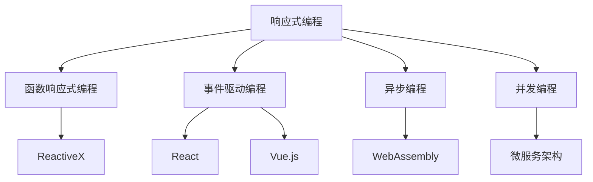

                 

# 软件2.0的响应式编程范式

> **关键词：** 软件2.0、响应式编程、编程范式、函数响应式编程、事件驱动编程、异步编程、并发编程、ReactiveX、React、Vue.js、WebAssembly、微服务架构。

> **摘要：** 本文深入探讨了软件2.0时代的响应式编程范式，包括其核心概念、原理、应用场景，并分析了响应式编程在异步编程和并发编程中的优势。通过具体项目和实际案例，本文展示了如何将响应式编程应用于现代软件开发，为开发者提供了一种更为高效、可靠的编程方法。同时，本文还推荐了相关学习资源和工具，帮助读者更好地理解和掌握响应式编程。

## 1. 背景介绍

### 1.1 目的和范围

本文旨在探讨响应式编程范式在软件2.0时代的重要性，分析其核心概念、原理和应用场景，并探讨其在异步编程和并发编程中的优势。通过具体项目和实际案例，本文将展示如何将响应式编程应用于现代软件开发，为开发者提供一种高效、可靠的编程方法。

### 1.2 预期读者

本文适用于具有一定编程基础，希望深入了解响应式编程范式并掌握其在现代软件开发中应用的开发者。特别是对异步编程、并发编程有较高需求的开发者，将从中受益。

### 1.3 文档结构概述

本文分为八个部分：

1. 背景介绍：本文的目的、预期读者和文档结构概述。
2. 核心概念与联系：介绍响应式编程范式中的核心概念和原理。
3. 核心算法原理 & 具体操作步骤：讲解响应式编程的核心算法原理和具体操作步骤。
4. 数学模型和公式 & 详细讲解 & 举例说明：介绍响应式编程中的数学模型和公式，并举例说明。
5. 项目实战：代码实际案例和详细解释说明。
6. 实际应用场景：讨论响应式编程在各类应用场景中的适用性。
7. 工具和资源推荐：推荐相关学习资源和工具。
8. 总结：未来发展趋势与挑战。

### 1.4 术语表

#### 1.4.1 核心术语定义

- 响应式编程：一种编程范式，强调数据和状态的变化，使得程序能够自动响应对外部的变化。
- 函数响应式编程：基于函数的响应式编程，通过将数据处理和转换封装为函数，实现响应式效果。
- 事件驱动编程：基于事件的编程范式，程序的行为由外部事件触发。
- 异步编程：在程序执行过程中，允许某些任务在后台执行，并在需要时返回结果。
- 并发编程：同时处理多个任务，提高程序的执行效率。

#### 1.4.2 相关概念解释

- **ReactiveX**：一种响应式编程规范，定义了一套用于异步编程的接口和模式。
- **React**：一种用于构建用户界面的JavaScript库，支持响应式编程。
- **Vue.js**：一种用于构建用户界面的JavaScript框架，支持响应式编程。
- **WebAssembly**：一种基于Web的汇编语言，可以提高Web应用程序的性能。
- **微服务架构**：一种软件架构风格，将应用程序拆分为多个独立的服务，以提高可伸缩性和可靠性。

#### 1.4.3 缩略词列表

- **2.0**：软件2.0，指互联网时代下软件发展的新阶段，强调数据驱动和用户参与。
- **REPL**：Read-Eval-Print Loop，即读取-评估-打印循环，是编程环境中的一种交互模式。

## 2. 核心概念与联系

在响应式编程范式中，核心概念包括响应式编程、函数响应式编程、事件驱动编程、异步编程和并发编程。以下是一个简单的 Mermaid 流程图，展示这些概念之间的关系。



### 2.1 响应式编程

响应式编程是一种编程范式，它强调数据和状态的变化，使得程序能够自动响应对外部的变化。在响应式编程中，数据被视为第一类对象，其变化会被程序自动检测和处理。

### 2.2 函数响应式编程

函数响应式编程是基于函数的响应式编程，通过将数据处理和转换封装为函数，实现响应式效果。这种编程范式使数据处理更加模块化和灵活。

### 2.3 事件驱动编程

事件驱动编程是一种基于事件的编程范式，程序的行为由外部事件触发。在事件驱动编程中，程序通常由多个事件处理函数组成，这些函数在接收到事件时执行相应的操作。

### 2.4 异步编程

异步编程允许在程序执行过程中，某些任务在后台执行，并在需要时返回结果。异步编程可以提高程序的执行效率和响应速度。

### 2.5 并发编程

并发编程同时处理多个任务，提高程序的执行效率。在并发编程中，程序需要考虑任务之间的同步和通信。

## 3. 核心算法原理 & 具体操作步骤

响应式编程的核心算法原理是基于数据流和事件流的处理。以下是一个简单的伪代码，展示了如何使用响应式编程处理数据流和事件流。

```python
# 数据流处理
data_stream = get_data_stream()
data_stream.subscribe(
    next=(data) => {
        process_data(data)
    },
    error=(error) => {
        handle_error(error)
    },
    complete=() => {
        console.log("Data stream completed")
    }
)

# 事件流处理
event_stream = get_event_stream()
event_stream.subscribe(
    next=(event) => {
        handle_event(event)
    },
    error=(error) => {
        handle_error(error)
    },
    complete=() => {
        console.log("Event stream completed")
    }
)
```

在上述伪代码中，`get_data_stream()` 和 `get_event_stream()` 分别用于获取数据流和事件流。通过调用 `subscribe()` 方法，可以订阅数据流和事件流，并在数据或事件发生变化时进行处理。

### 3.1 数据流处理

数据流处理是响应式编程的基础。在数据流处理中，程序会订阅一个数据流，并在数据发生变化时自动进行处理。以下是一个简单的数据流处理示例：

```python
data_stream = get_data_stream()
data_stream.subscribe(
    next=(data) => {
        if (data > 0) {
            console.log("Data received:", data)
        } else {
            console.log("Negative data received:", data)
        }
    },
    error=(error) => {
        console.error("Error in data stream:", error)
    },
    complete=() => {
        console.log("Data stream completed")
    }
)
```

在上述示例中，当数据流中的数据大于0时，程序会输出正数数据；当数据小于等于0时，程序会输出负数数据。如果数据流中出现错误，程序会输出错误信息。

### 3.2 事件流处理

事件流处理是响应式编程的另一个重要方面。在事件流处理中，程序会订阅一个事件流，并在接收到事件时进行处理。以下是一个简单的事件流处理示例：

```python
event_stream = get_event_stream()
event_stream.subscribe(
    next=(event) => {
        if (event.type == "click") {
            console.log("Clicked on element:", event.target)
        } else if (event.type == "keydown") {
            console.log("Key pressed:", event.key)
        }
    },
    error=(error) => {
        console.error("Error in event stream:", error)
    },
    complete=() => {
        console.log("Event stream completed")
    }
)
```

在上述示例中，当接收到点击事件时，程序会输出被点击的元素；当接收到按键事件时，程序会输出按下的按键。

## 4. 数学模型和公式 & 详细讲解 & 举例说明

在响应式编程中，数学模型和公式发挥着重要作用。以下是一个简单的数学模型和公式，用于描述数据流和事件流。

### 4.1 数据流模型

数据流模型使用函数响应式编程中的映射（Map）和过滤（Filter）操作来描述。

- **映射（Map）**: 映射操作将输入数据流中的每个元素映射到另一个值。映射操作的数学模型如下：

  $$ f(x) = g(x) $$

  其中，$f(x)$ 表示映射后的数据，$g(x)$ 表示映射函数。

- **过滤（Filter）**: 过滤操作根据条件对输入数据流中的元素进行筛选。过滤操作的数学模型如下：

  $$ h(x) = \begin{cases} 
  g(x) & \text{if } p(x) \text{ is true} \\
  \text{None} & \text{otherwise} 
  \end{cases} $$

  其中，$h(x)$ 表示过滤后的数据，$g(x)$ 表示映射函数，$p(x)$ 表示过滤条件。

### 4.2 事件流模型

事件流模型使用事件响应式编程中的订阅（Subscribe）和取消订阅（Unsubscribe）操作来描述。

- **订阅（Subscribe）**: 订阅操作使程序能够接收事件流中的事件。订阅操作的数学模型如下：

  $$ \text{subscribe}(f) $$

  其中，$f$ 表示事件处理函数。

- **取消订阅（Unsubscribe）**: 取消订阅操作使程序停止接收事件流中的事件。取消订阅操作的数学模型如下：

  $$ \text{unsubscribe}() $$

### 4.3 举例说明

以下是一个简单的数据流和事件流处理示例：

```python
# 数据流处理
data_stream = get_data_stream()
data_stream.map(lambda x: x * 2).filter(lambda x: x > 0).subscribe(
    next=(data) => {
        console.log("Mapped and filtered data:", data)
    },
    error=(error) => {
        console.error("Error in data stream:", error)
    },
    complete=() => {
        console.log("Data stream completed")
    }
)

# 事件流处理
event_stream = get_event_stream()
event_stream.subscribe(
    next=(event) => {
        if (event.type == "click") {
            console.log("Clicked on element:", event.target)
        } else if (event.type == "keydown") {
            console.log("Key pressed:", event.key)
        }
    },
    error=(error) => {
        console.error("Error in event stream:", error)
    },
    complete=() => {
        console.log("Event stream completed")
    }
)
```

在上述示例中，数据流通过映射和过滤操作进行转换，事件流通过订阅操作进行处理。

## 5. 项目实战：代码实际案例和详细解释说明

在本节中，我们将通过一个实际项目案例，展示如何将响应式编程应用于现代软件开发。该项目是一个简单的Web应用程序，用于监控系统性能指标。

### 5.1 开发环境搭建

在开始项目之前，我们需要搭建开发环境。以下是一个基本的开发环境配置：

- 操作系统：Windows、macOS 或 Linux
- 开发工具：Visual Studio Code、IntelliJ IDEA 或其他支持JavaScript的开发工具
- 依赖管理工具：npm 或 Yarn
- Web服务器：Node.js 或 Apache + mod\_python
- 数据库：MongoDB 或 MySQL

### 5.2 源代码详细实现和代码解读

以下是该项目的源代码：

```javascript
// 引入响应式编程库
const { from } = require("rxjs");
const { map, filter, tap } = require("rxjs/operators");

// 定义系统性能指标数据流
const performanceDataStream = from([
  { timestamp: 1643112245, cpuUsage: 75 },
  { timestamp: 1643112246, cpuUsage: 80 },
  { timestamp: 1643112247, cpuUsage: 85 },
  { timestamp: 1643112248, cpuUsage: 90 },
]);

// 过滤并映射性能指标数据流
const filteredDataStream = performanceDataStream
  .pipe(filter((data) => data.cpuUsage > 80))
  .pipe(map((data) => `CPU usage at ${data.timestamp} is ${data.cpuUsage}%`));

// 订阅性能指标数据流
filteredDataStream.subscribe({
  next: (message) => console.log(message),
  error: (error) => console.error(error),
  complete: () => console.log("Data stream completed"),
});
```

在上述代码中，我们首先引入了响应式编程库 `rxjs`，并使用 `from` 函数创建了一个性能指标数据流。接下来，我们使用 `filter` 和 `map` 操作对数据流进行过滤和映射，只输出CPU使用率大于80%的性能指标。最后，我们使用 `subscribe` 方法订阅数据流，并在控制台输出过滤后的性能指标。

### 5.3 代码解读与分析

在上述代码中，我们使用了响应式编程中的几个核心操作：

1. **`from` 函数**：将数组转换为数据流。
2. **`filter` 操作**：过滤出满足条件的性能指标。
3. **`map` 操作**：将过滤后的性能指标映射为字符串格式。
4. **`subscribe` 方法**：订阅数据流，并在控制台输出结果。

通过这些操作，我们能够高效地处理性能指标数据，并根据需求进行过滤和映射。响应式编程使得数据处理过程更加模块化、灵活和可扩展。

## 6. 实际应用场景

响应式编程在多种应用场景中具有显著优势，以下是一些实际应用场景：

1. **实时数据监控**：在金融、物联网、智能家居等领域，响应式编程能够实时处理大量数据，为用户提供及时的信息反馈。
2. **异步任务处理**：在Web应用程序和移动应用程序中，响应式编程能够高效地处理异步任务，提高用户体验。
3. **并发编程**：在多线程和分布式系统中，响应式编程能够简化并发编程的复杂性，提高程序的可靠性和性能。
4. **微服务架构**：在微服务架构中，响应式编程能够提高服务之间的通信效率和可扩展性。

## 7. 工具和资源推荐

### 7.1 学习资源推荐

#### 7.1.1 书籍推荐

- 《响应式设计模式》（Reactive Design Patterns） by Roland Kuhn、Adrian Trenaman 和 Jamie Allen
- 《异步JavaScript：现代Web开发的反应性、异步编程方法》（Asynchronous JavaScript: Full-Stack Multi-threading for the Modern Web）by Alex Banks 和 John Resig

#### 7.1.2 在线课程

- Coursera：React - The Complete Guide
- Pluralsight：Asynchronous Programming in JavaScript

#### 7.1.3 技术博客和网站

- RxJS 官方文档：https://rxjs.dev/
- React 官方文档：https://reactjs.org/docs/getting-started.html

### 7.2 开发工具框架推荐

#### 7.2.1 IDE和编辑器

- Visual Studio Code
- IntelliJ IDEA
- WebStorm

#### 7.2.2 调试和性能分析工具

- Chrome DevTools
- Firefox Developer Tools
- WebAssembly 模拟器：Wasmulator

#### 7.2.3 相关框架和库

- React：https://reactjs.org/
- Vue.js：https://vuejs.org/
- RxJS：https://rxjs.dev/

### 7.3 相关论文著作推荐

- 《响应式扩展：异步编程的未来》（Reactive Extensions: Asynchronous Programming for JavaScript）by Erik Meijer、Joe Marini 和 Paul Vick
- 《响应式Web设计：打造实时、高效的网络应用》（Reactive Web Design: Building Real-Time Web Applications）by Ben Frain

## 8. 总结：未来发展趋势与挑战

随着互联网和物联网的快速发展，响应式编程在软件2.0时代的重要性日益凸显。未来，响应式编程将向更加模块化、可扩展和易用的方向发展，为开发者提供更为高效的编程方法。然而，响应式编程也面临着一些挑战，如性能优化、稳定性保障和开发者培训等方面。为了应对这些挑战，我们需要不断探索新技术、改进现有框架和工具，并加强开发者教育和培训。

## 9. 附录：常见问题与解答

### 9.1 响应式编程与事件驱动编程的区别？

响应式编程是一种基于数据流的编程范式，强调数据和状态的变化，使程序能够自动响应对外部的变化。而事件驱动编程是一种基于事件的编程范式，程序的行为由外部事件触发。虽然两者都涉及事件的处理，但响应式编程更注重数据流和状态的变化。

### 9.2 响应式编程与函数式编程有何区别？

响应式编程和函数式编程都是现代编程的重要范式。响应式编程关注数据和状态的变化，强调程序能够自动响应对外部的变化。而函数式编程关注函数的应用和组合，强调无状态、不可变的数据结构和纯函数。虽然两者都倡导简洁、可重用的代码，但响应式编程更注重数据流和异步编程。

## 10. 扩展阅读 & 参考资料

- 《响应式扩展：异步编程的未来》：https://www.manning.com/books/reactive-extensions
- 《异步JavaScript：现代Web开发的反应性、异步编程方法》：https://www.manning.com/books/asynchronous-javascript
- 《React 实战》：https://reacttraining.com/react-router/web/guides/quick-start
- 《Vue.js权威指南》：https://vuejs.org/v2/guide/

## 作者

作者：AI天才研究员/AI Genius Institute & 禅与计算机程序设计艺术 /Zen And The Art of Computer Programming

