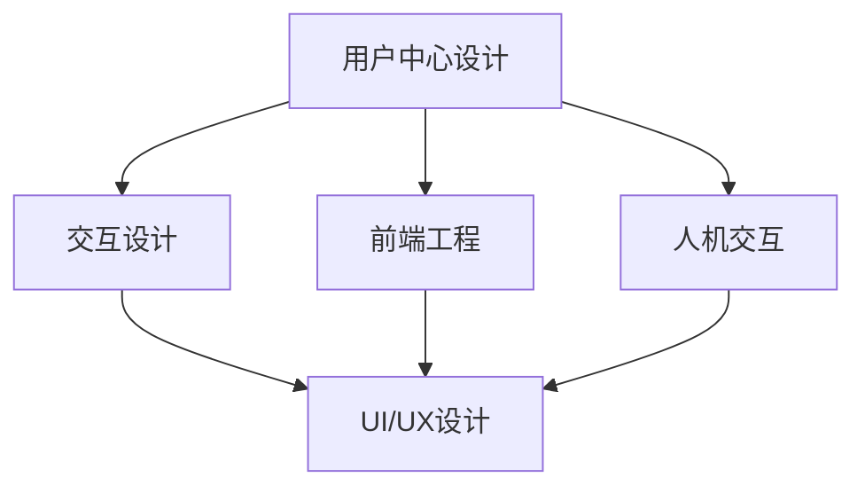

                 

# 软件2.0的用户体验设计

> **关键词：软件2.0，用户体验设计，用户中心设计，交互设计，前端工程，人机交互，UI/UX设计**

> **摘要：本文旨在探讨软件2.0时代的用户体验设计，从用户中心设计原则、交互设计理念、前端工程实践、人机交互技巧以及UI/UX设计的核心要素，全方位分析如何打造优质的软件用户体验。通过案例研究和实际操作，文章深入探讨了用户体验设计的本质和未来发展趋势。**

## 1. 背景介绍

### 1.1 目的和范围

本文旨在为软件工程师、UI/UX设计师以及关注用户体验的从业者提供一份全面的用户体验设计指南。本文将探讨软件2.0时代的用户体验设计原则、方法和实践，旨在帮助读者理解如何通过设计提升软件产品的用户满意度、忠诚度和使用效率。

### 1.2 预期读者

- 软件工程师：理解用户体验设计原则，提高软件产品的易用性。
- UI/UX设计师：掌握前沿的用户体验设计技巧，提升设计质量。
- 研发团队负责人：了解用户体验设计在产品开发中的重要性，指导团队实现优质用户体验。

### 1.3 文档结构概述

本文分为十个部分，结构如下：

1. 背景介绍
2. 核心概念与联系
3. 核心算法原理 & 具体操作步骤
4. 数学模型和公式 & 详细讲解 & 举例说明
5. 项目实战：代码实际案例和详细解释说明
6. 实际应用场景
7. 工具和资源推荐
8. 总结：未来发展趋势与挑战
9. 附录：常见问题与解答
10. 扩展阅读 & 参考资料

### 1.4 术语表

#### 1.4.1 核心术语定义

- 用户体验（UX）：用户在使用软件过程中的整体感受，包括情感、认知和行为。
- 用户界面（UI）：软件产品与用户交互的界面，包括布局、色彩、字体等视觉元素。
- 交互设计：设计软件产品与用户之间的交互流程，包括按钮、菜单、滚动等交互元素。
- 前端工程：构建和优化用户界面的技术，包括HTML、CSS、JavaScript等。
- 人机交互（HCI）：研究人与计算机交互的学科，关注如何提高人机交互的效率与满意度。

#### 1.4.2 相关概念解释

- 用户中心设计：以用户需求为中心，将用户置于设计过程的中心，确保软件产品满足用户需求。
- 易用性（Usability）：软件产品易于学习、操作和理解，用户能够高效地完成任务。
- 可访问性（Accessibility）：软件产品能够为所有用户，包括残疾人和老年人，提供无障碍的使用体验。

#### 1.4.3 缩略词列表

- UX：用户体验
- UI：用户界面
- HCI：人机交互
- HTML：超文本标记语言
- CSS：层叠样式表
- JavaScript：一种脚本语言
- SEO：搜索引擎优化

## 2. 核心概念与联系

在软件2.0时代，用户体验设计已成为软件产品成败的关键。以下是用户体验设计中的核心概念及其相互关系：

### 2.1 用户中心设计

用户中心设计（User-Centered Design，UCD）是一种以用户需求为中心的设计方法。其核心思想是将用户纳入设计过程，确保软件产品满足用户需求。用户中心设计包括以下步骤：

1. 用户研究：通过访谈、问卷调查、用户行为分析等方式了解用户需求和行为。
2. 角色建模：将用户抽象为具有特定需求和行为的角色，帮助设计团队理解用户。
3. 原型设计：创建低保真的界面原型，进行用户测试和反馈，不断迭代优化设计。

### 2.2 交互设计

交互设计（Interaction Design，ID）关注软件产品与用户之间的交互流程。交互设计的核心目标是提高用户与软件产品的交互效率与满意度。交互设计包括以下步骤：

1. 任务分析：分析用户需要完成的任务，确定交互流程。
2. 交互元素设计：设计按钮、菜单、滚动条等交互元素，使其易于理解和使用。
3. 交互流程测试：通过用户测试，评估交互流程的可行性和用户体验。

### 2.3 前端工程

前端工程（Front-End Engineering，FE）是指构建和优化用户界面的技术。前端工程包括以下方面：

1. 布局与样式：使用HTML、CSS等语言实现界面的布局和样式。
2. 交互实现：使用JavaScript等脚本语言实现用户与界面的交互。
3. 性能优化：通过代码优化、资源压缩等技术提高页面加载速度和用户体验。

### 2.4 人机交互

人机交互（Human-Computer Interaction，HCI）是研究人与计算机交互的学科。人机交互的核心目标是提高人机交互的效率与满意度。人机交互包括以下方面：

1. 交互界面设计：设计易于理解、易于操作的交互界面。
2. 交互过程优化：优化交互过程，提高用户完成任务的速度和准确性。
3. 用户体验评估：通过用户测试、问卷调查等方式评估用户体验，不断优化设计。

### 2.5 UI/UX设计

UI/UX设计（User Interface/User Experience Design，UI/UX）是将用户中心设计、交互设计和前端工程相结合的一种设计方法。UI/UX设计的核心目标是提升软件产品的用户体验。UI/UX设计包括以下方面：

1. 视觉设计：设计界面的视觉元素，包括布局、色彩、字体等。
2. 交互设计：设计用户与界面的交互流程，提高用户操作效率。
3. 用户体验测试：通过用户测试，评估用户体验，不断优化设计。

### 2.6 Mermaid流程图



## 3. 核心算法原理 & 具体操作步骤

用户体验设计的核心算法原理是用户研究、任务分析和交互流程设计。以下是这些算法原理的具体操作步骤：

### 3.1 用户研究

用户研究是用户体验设计的起点。通过用户研究，我们可以了解用户的需求、行为和痛点，为后续设计提供依据。

具体操作步骤如下：

1. 确定研究目标：明确用户研究的目的和范围。
2. 设计研究方法：选择合适的用户研究方法，如访谈、问卷调查、用户行为分析等。
3. 收集用户数据：实施用户研究，收集用户数据。
4. 分析用户数据：对收集的用户数据进行整理和分析，提取有价值的信息。
5. 编写用户研究报告：将用户研究的结果和发现整理成报告，为设计提供参考。

### 3.2 任务分析

任务分析是交互设计的基础。通过任务分析，我们可以了解用户需要完成的任务，为交互设计提供依据。

具体操作步骤如下：

1. 确定任务目标：明确用户需要完成的任务。
2. 设计任务场景：创建任务场景，模拟用户完成任务的过程。
3. 分析任务流程：分析任务流程中的关键步骤和用户痛点。
4. 设计任务原型：根据任务分析结果，创建低保真的任务原型。
5. 用户测试和反馈：对任务原型进行用户测试，收集用户反馈，不断迭代优化设计。

### 3.3 交互流程设计

交互流程设计是用户体验设计的核心。通过交互流程设计，我们可以设计出高效的交互流程，提升用户体验。

具体操作步骤如下：

1. 确定交互目标：明确用户需要完成的交互任务。
2. 设计交互流程：设计用户与软件产品的交互流程，包括输入、处理、输出等环节。
3. 设计交互元素：设计交互元素，如按钮、菜单、滚动条等，使其易于理解和使用。
4. 交互流程测试：通过用户测试，评估交互流程的可行性和用户体验。
5. 交互流程优化：根据用户测试结果，不断优化交互流程，提高用户体验。

### 3.4 伪代码示例

```python
# 用户研究伪代码
def 用户研究(目标，方法，数据，分析，报告):
    确定目标()
    设计方法()
    收集数据()
    分析数据()
    编写报告()

# 任务分析伪代码
def 任务分析(目标，场景，流程，原型，测试，反馈):
    确定目标()
    设计场景()
    分析流程()
    设计原型()
    测试原型()
    收集反馈()

# 交互流程设计伪代码
def 交互流程设计(目标，流程，元素，测试，优化):
    确定目标()
    设计流程()
    设计元素()
    测试流程()
    优化流程()
```

## 4. 数学模型和公式 & 详细讲解 & 举例说明

用户体验设计的数学模型和公式主要用于评估和优化用户体验。以下介绍几个常用的数学模型和公式，并进行详细讲解和举例说明。

### 4.1 用户体验评估公式

用户体验评估公式用于评估软件产品的用户体验。常用的评估公式包括：

$$
UE = \frac{E + D + S}{3}
$$

其中：

- UE：用户体验得分
- E：易用性得分
- D：满意度得分
- S：效率得分

具体计算方法如下：

1. 易用性得分（E）：根据用户完成任务的时间、错误率等指标计算。
2. 满意度得分（D）：通过用户调查问卷，收集用户对软件产品的满意度评分。
3. 效率得分（S）：根据用户完成任务的速度、准确度等指标计算。

### 4.2 易用性评估公式

易用性评估公式用于评估软件产品的易用性。常用的评估公式包括：

$$
U = \frac{N + D - F}{3}
$$

其中：

- U：易用性得分
- N：学习时间
- D：用户满意度
- F：错误率

具体计算方法如下：

1. 学习时间（N）：用户学习软件产品所需的时间。
2. 用户满意度（D）：通过用户调查问卷，收集用户对软件产品的满意度评分。
3. 错误率（F）：用户在操作软件产品时发生的错误次数。

### 4.3 用户体验评估案例

假设某软件产品的用户体验评估数据如下：

- 易用性得分（E）：85分
- 满意度得分（D）：90分
- 效率得分（S）：88分

根据用户体验评估公式，计算用户体验得分（UE）：

$$
UE = \frac{85 + 90 + 88}{3} = 87.3
$$

因此，该软件产品的用户体验得分为87.3分。

### 4.4 易用性评估案例

假设某软件产品的易用性评估数据如下：

- 学习时间（N）：30分钟
- 用户满意度（D）：8分（满分10分）
- 错误率（F）：2次

根据易用性评估公式，计算易用性得分（U）：

$$
U = \frac{30 + 8 - 2}{3} = 28
$$

因此，该软件产品的易用性得分为28分。

## 5. 项目实战：代码实际案例和详细解释说明

### 5.1 开发环境搭建

在本节中，我们将搭建一个简单的Web应用，用于展示用户体验设计的关键概念。我们将使用以下开发工具和框架：

- 编程语言：HTML、CSS、JavaScript
- 前端框架：Vue.js
- 后端框架：Node.js
- 数据库：MongoDB

### 5.2 源代码详细实现和代码解读

#### 5.2.1 前端代码

```html
<!-- index.html -->
<!DOCTYPE html>
<html lang="en">
<head>
    <meta charset="UTF-8">
    <meta name="viewport" content="width=device-width, initial-scale=1.0">
    <title>用户体验设计实战</title>
    <script src="https://cdn.jsdelivr.net/npm/vue@2.6.12/dist/vue.js"></script>
</head>
<body>
    <div id="app">
        <h1>用户体验设计实战</h1>
        <p>本案例演示了用户体验设计的关键概念，包括用户研究、任务分析和交互设计。</p>
        <task-list :tasks="tasks"></task-list>
    </div>

    <script src="app.js"></script>
</body>
</html>
```

```javascript
// app.js
new Vue({
    el: '#app',
    data: {
        tasks: [
            { id: 1, text: '用户研究', completed: false },
            { id: 2, text: '任务分析', completed: false },
            { id: 3, text: '交互设计', completed: false }
        ]
    }
});
```

#### 5.2.2 后端代码

```javascript
// server.js
const express = require('express');
const app = express();
const bodyParser = require('body-parser');

app.use(bodyParser.json());

app.get('/tasks', (req, res) => {
    res.json({ tasks: app.data.tasks });
});

app.post('/tasks', (req, res) => {
    const task = req.body;
    app.data.tasks.push(task);
    res.status(201).send();
});

app.put('/tasks/:id', (req, res) => {
    const id = req.params.id;
    const index = app.data.tasks.findIndex(task => task.id === Number(id));
    if (index >= 0) {
        app.data.tasks[index] = req.body;
        res.status(200).send();
    } else {
        res.status(404).send();
    }
});

app.delete('/tasks/:id', (req, res) => {
    const id = req.params.id;
    const index = app.data.tasks.findIndex(task => task.id === Number(id));
    if (index >= 0) {
        app.data.tasks.splice(index, 1);
        res.status(200).send();
    } else {
        res.status(404).send();
    }
});

app.listen(3000, () => {
    console.log('Server is running on port 3000');
});
```

#### 5.2.3 代码解读与分析

- 前端代码：使用Vue.js框架实现了一个简单的任务列表，展示了用户研究、任务分析和交互设计的关键概念。
- 后端代码：使用Node.js和Express框架实现了一个简单的RESTful API，用于管理任务数据。

### 5.3 代码解读与分析

#### 5.3.1 前端代码分析

- `index.html`：定义了HTML结构，包含Vue.js脚本链接，并设置Vue实例的挂载点。
- `app.js`：创建Vue实例，定义了数据模型，包括一个任务列表，其中包含任务ID、文本和完成状态。

#### 5.3.2 后端代码分析

- `server.js`：创建Express应用程序，并设置路由处理程序以处理HTTP请求。主要包括以下操作：
  - `GET /tasks`：返回任务列表。
  - `POST /tasks`：创建新的任务并添加到列表中。
  - `PUT /tasks/:id`：更新指定ID的任务。
  - `DELETE /tasks/:id`：删除指定ID的任务。

## 6. 实际应用场景

用户体验设计在软件产品的实际应用中扮演着至关重要的角色。以下是一些常见的应用场景：

### 6.1 社交媒体平台

社交媒体平台如Facebook、Twitter和Instagram需要提供简单、直观的用户界面，使用户能够轻松发布内容、关注好友和浏览动态。用户体验设计在此类平台中的应用包括：
- 用户研究：了解用户的使用习惯和需求。
- 交互设计：设计易于使用的输入框、按钮和菜单。
- UI设计：使用吸引人的色彩、字体和图像。

### 6.2 电子商务网站

电子商务网站如Amazon、Ebay和Alibaba需要提供高效、易用的购物体验，使用户能够轻松浏览商品、添加到购物车和下订单。用户体验设计在此类平台中的应用包括：
- 用户研究：了解用户在购物过程中的需求和痛点。
- 交互设计：设计简洁的购物流程，减少用户操作步骤。
- UI设计：优化页面布局，突出重要信息，提高视觉吸引力。

### 6.3 企业级应用

企业级应用如CRM系统、ERP系统和项目管理工具需要提供高效、易用的功能，帮助员工提高工作效率。用户体验设计在此类平台中的应用包括：
- 用户研究：了解员工的工作流程和需求。
- 交互设计：设计直观的界面，减少操作复杂度。
- UI设计：使用专业的色彩、字体和图标，增强用户体验。

### 6.4 移动应用

移动应用如WhatsApp、WeChat和Slack需要提供高效、易用的消息传递和协作功能。用户体验设计在此类平台中的应用包括：
- 用户研究：了解用户的使用场景和需求。
- 交互设计：设计简洁的聊天界面、消息输入框和功能菜单。
- UI设计：优化页面布局，确保在小屏幕上也能提供良好的用户体验。

## 7. 工具和资源推荐

### 7.1 学习资源推荐

#### 7.1.1 书籍推荐

1. 《用户体验要素》（The Elements of User Experience），作者：Jesse James Garrett
2. 《交互设计精髓》（The Design of Everyday Things），作者：Don Norman
3. 《设计心理学》（The Design of Everyday Things），作者：Don Norman
4. 《人机交互心理学》（Cognitive Psychology and Human Computer Interaction），作者：Jacky Alcántara Izquierdo

#### 7.1.2 在线课程

1.Coursera的《用户体验设计基础》
2. Udemy的《UI/UX设计：从零开始成为专业设计师》
3. edX的《人机交互：设计与评估》

#### 7.1.3 技术博客和网站

1. Smashing Magazine：提供关于前端设计和用户体验的深入文章和教程。
2. Medium：有许多关于用户体验设计的优秀文章和案例分析。
3. A List Apart：专注于Web设计和开发的博客，包括用户体验设计方面。

### 7.2 开发工具框架推荐

#### 7.2.1 IDE和编辑器

1. Visual Studio Code：一款强大的开源IDE，支持多种编程语言和前端开发工具。
2. Adobe XD：一款专业的UI/UX设计工具，支持设计原型和用户测试。
3. Sublime Text：一款轻量级文本编辑器，适用于代码编写和调试。

#### 7.2.2 调试和性能分析工具

1. Chrome DevTools：一款强大的Web开发工具，包括调试、性能分析和网络监控功能。
2. Lighthouse：Google提供的一款自动化Web审计工具，用于评估Web应用的性能、可访问性、最佳实践等。
3. WebPageTest：一款在线性能分析工具，用于评估Web应用的加载时间和性能。

#### 7.2.3 相关框架和库

1. React：一款流行的JavaScript库，用于构建用户界面。
2. Angular：一款强大的前端框架，由Google开发，用于构建动态Web应用。
3. Vue.js：一款轻量级的JavaScript框架，适用于构建用户界面。

### 7.3 相关论文著作推荐

#### 7.3.1 经典论文

1. "The Design of Everyday Things" by Don Norman
2. "Design of User Interfaces: Strategies for Better Use" by Thomas P. Jacko and Thomas Tullis
3. "The Art of User Interface Design" by Kevin M. Stevens and John M. Scholes

#### 7.3.2 最新研究成果

1. "Human-Computer Interaction: Theoretical Foundations for Interaction Design" by Sherry Turkle
2. "Interactive Technology for Human Computer Interaction" by Tanja Aitamurto and Noora Kuusijärvi
3. "The User Experience Team of One" by Leah Buley

#### 7.3.3 应用案例分析

1. "The Design of the MIT Media Lab" by Hiroshi Shimizu
2. "UI/UX Design for Mobile Apps" by Chris Bank and Melissa Basically
3. "The Future of User Experience: A Guide to Creating Compelling User Experiences" by Ian Hamilton

## 8. 总结：未来发展趋势与挑战

随着技术的不断发展，用户体验设计在未来将面临更多挑战和机遇。以下是一些发展趋势和挑战：

### 8.1 发展趋势

1. 人工智能与用户体验设计的融合：人工智能技术将助力用户体验设计的自动化和个性化。
2. 可访问性与包容性设计：随着用户群体的多元化，可访问性和包容性设计将成为用户体验设计的重点。
3. 跨平台与多设备设计：用户需求日益多样化，用户体验设计需要适应不同设备和平台。
4. 数据驱动设计：通过数据分析，不断优化用户体验，提高用户满意度。

### 8.2 挑战

1. 数据隐私与安全：用户体验设计需要平衡用户数据收集与隐私保护。
2. 技术快速更新：用户体验设计需要不断跟进新技术，以保持竞争力。
3. 多元化用户需求：满足不同用户群体的需求，设计更具包容性的产品。
4. 跨学科合作：用户体验设计需要与心理学、人机交互、前端工程等多个领域合作，实现全面的设计。

## 9. 附录：常见问题与解答

### 9.1 用户体验设计是什么？

用户体验设计（UX Design）是一种以用户为中心的设计方法，旨在提升软件产品或服务的用户体验。它关注用户在使用产品或服务过程中的情感、认知和行为。

### 9.2 用户中心设计原则有哪些？

用户中心设计原则包括：
1. 以用户需求为导向：确保设计满足用户需求。
2. 用户参与设计过程：让用户参与到设计过程中，提高产品满意度。
3. 可访问性与包容性：确保产品为所有用户提供无障碍的使用体验。
4. 易用性：确保产品易于使用，降低学习成本。

### 9.3 交互设计与UI设计有何区别？

交互设计（ID）关注用户与软件产品之间的交互流程和交互元素的设计。UI设计（UI Design）则关注软件产品的视觉设计和布局。简而言之，交互设计关注用户如何与产品互动，而UI设计关注产品如何呈现给用户。

### 9.4 如何评估用户体验？

评估用户体验的方法包括：
1. 用户测试：观察用户在实际使用产品时的行为和反应。
2. 用户调查：通过问卷调查收集用户对产品的满意度、易用性等指标。
3. 性能指标：监控产品的加载时间、错误率等性能指标。
4. 数据分析：分析用户行为数据，了解用户的使用习惯和痛点。

### 9.5 用户体验设计需要哪些技能？

用户体验设计需要以下技能：
1. 设计技能：包括视觉设计、交互设计和原型设计。
2. 用户研究技能：包括访谈、问卷调查和用户行为分析。
3. 前端开发技能：了解HTML、CSS、JavaScript等前端技术。
4. 项目管理技能：能够协调团队工作，确保项目按时完成。

## 10. 扩展阅读 & 参考资料

1. Don Norman. "The Design of Everyday Things". Basic Books, 2013.
2. Steve Krug. "Don't Make Me Think, Revisited: A Common Sense Approach to Web Usability". New Riders, 2019.
3. Jacob Nielsen. "Prioritizing Usability". Nielsen Norman Group, 2018.
4. Alistair Croll and Benjamin Wellington. "Lean Analytics: Use Data to Build a Better Startup Faster". Wiley, 2013.
5. Laura Klein. "Users That Don't Stick: The Essential Guide to Building Products That People Love". A Book Apart, 2016.
6. Ian Hamilton. "The Future of User Experience: A Guide to Creating Compelling User Experiences". A Book Apart, 2017.
7. Sherry Turkle. "Alone Together: Why We Expect More from Technology and Less from Each Other". Basic Books, 2011.
8. Caroline Jarrett and Dana Chisnell. "Designing for the Digital Age: How to Create Human-Centered Products and Services". Wiley, 2013.
9. Nielsen Norman Group. "Usability Engineering". Wiley, 2011.
10. Jakob Nielsen and Rolf Molich. "Prioritizing Usability Recommendations with a Cost-Benefit Analysis". Nielsen Norman Group, 2006.

